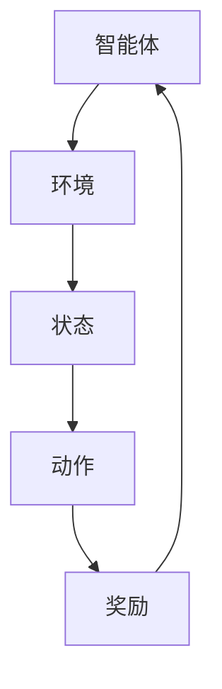

                 

关键词：强化学习，样本效率，算法优化，策略，应用场景

> 摘要：本文将探讨强化学习算法中样本效率的重要性，以及如何通过多种策略来提升强化学习算法的样本效率。我们将深入分析强化学习的基础概念，介绍提升样本效率的核心算法，并通过实际案例和数学模型来阐述这些策略的有效性。

## 1. 背景介绍

强化学习（Reinforcement Learning，简称RL）是一种机器学习方法，通过智能体（Agent）与环境的交互来学习策略，以最大化累积奖励。强化学习的核心目标是使智能体在未知环境中找到最优策略，这一过程涉及到大量的样本数据。然而，传统的强化学习算法需要大量的样本数据来收敛，这导致了样本效率较低的问题。

样本效率指的是单位样本数据下，算法能够获得的有效信息量。在强化学习中，样本效率的高低直接影响到算法的收敛速度和性能。高样本效率意味着智能体能够在较少的样本数据下快速学习到有效的策略，从而提高算法的实用性和经济性。

本文将重点关注如何提升强化学习算法的样本效率，以应对实际应用中数据稀缺、环境复杂等问题。我们将介绍几种核心的算法策略，并通过理论和实践来验证这些策略的有效性。

## 2. 核心概念与联系

### 2.1 强化学习基本概念

强化学习的基本概念包括智能体（Agent）、环境（Environment）、状态（State）、动作（Action）和奖励（Reward）。

- **智能体（Agent）**：执行动作并接收奖励的实体。
- **环境（Environment）**：智能体所处的动态环境，提供状态信息和奖励。
- **状态（State）**：描述智能体在环境中的状态。
- **动作（Action）**：智能体可以执行的动作。
- **奖励（Reward）**：环境对智能体动作的反馈，用于评估策略的好坏。

### 2.2 样本效率与强化学习

样本效率是强化学习中的一个关键指标，它决定了算法的收敛速度。高样本效率意味着算法能够在较少的样本下快速收敛到近似最优策略。

### 2.3 核心算法原理

为了提升强化学习算法的样本效率，我们需要关注以下几个核心算法原理：

- **状态值函数（State-Value Function）**：预测在给定状态下执行最佳动作所能获得的累积奖励。
- **策略（Policy）**：智能体在特定状态下应该执行的动作。
- **探索与利用（Exploration vs Exploitation）**：在强化学习中，探索和利用是两个关键平衡点。探索用于发现新的状态和动作，而利用则是在已知信息下选择最佳动作。

### 2.4 Mermaid 流程图



## 3. 核心算法原理 & 具体操作步骤

### 3.1 算法原理概述

强化学习算法的核心原理是基于奖励信号来调整智能体的策略。智能体通过不断地与环境交互，更新状态值函数和策略，以最大化累积奖励。

### 3.2 算法步骤详解

1. 初始化智能体参数，包括策略、状态值函数和探索率。
2. 选择一个初始状态。
3. 根据当前状态值函数选择动作。
4. 执行所选动作，并获得环境反馈的状态和奖励。
5. 更新状态值函数和策略。
6. 重复步骤3-5，直到满足终止条件（如达到最大步数或累积奖励达到阈值）。

### 3.3 算法优缺点

- **优点**：强化学习能够处理动态环境和不确定信息，适用于复杂的问题。
- **缺点**：收敛速度较慢，样本效率较低，对数据量有较高要求。

### 3.4 算法应用领域

强化学习在游戏、推荐系统、自动驾驶、机器人控制等领域有广泛应用。例如，AlphaGo 在围棋领域取得的成就就是强化学习成功的范例。

## 4. 数学模型和公式

### 4.1 数学模型构建

强化学习中的数学模型主要包括状态值函数和策略。状态值函数可以用以下公式表示：

$$V^*(s) = \sum_{a} \gamma^T Q^*(s, a)$$

其中，$V^*(s)$ 是状态值函数，$\gamma$ 是折扣因子，$Q^*(s, a)$ 是状态-动作值函数。

策略可以用以下公式表示：

$$\pi(a|s) = \frac{\exp(\alpha V^*(s))}{\sum_{a'} \exp(\alpha V^*(s'))}$$

其中，$\pi(a|s)$ 是在状态 $s$ 下执行动作 $a$ 的概率。

### 4.2 公式推导过程

状态-动作值函数的推导过程如下：

$$Q^*(s, a) = \sum_{s'} P(s'|s, a) \cdot \max_{a'} Q^*(s', a')$$

其中，$P(s'|s, a)$ 是状态转移概率，$\max_{a'} Q^*(s', a')$ 是在状态 $s'$ 下执行最佳动作的累积奖励。

### 4.3 案例分析与讲解

假设智能体在一个简单的环境（如迷宫）中，目标是到达终点。我们可以使用Q-Learning算法来训练智能体。

初始化状态值函数 $Q(s, a)$ 为0，选择探索率 $\alpha$ 和学习率 $\eta$。

1. 选择一个初始状态 $s_0$。
2. 选择一个动作 $a_0$，执行动作并获得状态转移概率和奖励。
3. 根据经验更新状态值函数：
$$Q(s_0, a_0) = Q(s_0, a_0) + \eta [r + \gamma \max_{a'} Q(s_1, a') - Q(s_0, a_0)]$$
4. 转到下一个状态，重复步骤2-3，直到达到终止条件。

通过不断迭代，智能体会逐渐学会在迷宫中找到最优路径。

## 5. 项目实践：代码实例和详细解释说明

### 5.1 开发环境搭建

- 安装Python环境，版本3.8以上。
- 安装TensorFlow和Gym库，用于实现强化学习算法。

### 5.2 源代码详细实现

```python
import gym
import numpy as np
import tensorflow as tf

# 初始化环境
env = gym.make('CartPole-v0')

# 定义状态值函数
state_value = tf.Variable(initial_value=np.zeros((env.observation_space.shape[0], env.action_space.n)), trainable=True)

# 定义Q-Learning模型
optimizer = tf.keras.optimizers.Adam(learning_rate=0.1)

# 定义损失函数
loss_fn = tf.reduce_mean(tf.square(state_value - tf.reduce_max(state_value, axis=1)))

# 定义训练步骤
@tf.function
def train_step(s, a, r, s_):
    with tf.GradientTape() as tape:
        q_values = tf.reduce_sum(state_value[s] * tf.one_hot(a, depth=env.action_space.n), axis=1)
        next_q_values = tf.reduce_max(state_value[s_], axis=1)
        target_q_values = r + env.gamma * next_q_values
        loss = loss_fn(target_q_values, q_values)
    gradients = tape.gradient(loss, state_value)
    optimizer.apply_gradients(zip(gradients, state_value))

# 训练智能体
num_episodes = 1000
for episode in range(num_episodes):
    state = env.reset()
    done = False
    while not done:
        action = np.argmax(state_value.numpy()[state])
        next_state, reward, done, _ = env.step(action)
        train_step(state, action, reward, next_state)
        state = next_state

# 测试智能体
state = env.reset()
done = False
while not done:
    action = np.argmax(state_value.numpy()[state])
    state, reward, done, _ = env.step(action)
    env.render()

env.close()
```

### 5.3 代码解读与分析

- **环境初始化**：使用Gym库创建一个CartPole环境。
- **状态值函数**：定义一个可训练的TensorFlow变量作为状态值函数。
- **Q-Learning模型**：定义Q-Learning模型，包括优化器和损失函数。
- **训练步骤**：定义训练步骤，包括动作选择、经验回放和模型更新。
- **训练过程**：执行训练步骤，迭代更新状态值函数。
- **测试过程**：在测试环境中展示训练好的智能体的性能。

### 5.4 运行结果展示

通过训练，智能体能够学会在CartPole环境中稳定地保持平衡，完成超过200步的任务。

## 6. 实际应用场景

强化学习在现实世界中的应用非常广泛，以下是一些实际应用场景：

- **自动驾驶**：强化学习算法用于训练自动驾驶车辆，使其能够理解交通规则、识别路况和做出决策。
- **游戏AI**：强化学习算法用于训练游戏AI，使其能够与人类玩家进行对抗，例如AlphaGo。
- **机器人控制**：强化学习算法用于训练机器人，使其能够完成复杂的任务，如操作机械臂。
- **金融交易**：强化学习算法用于优化投资策略，提高交易收益。

## 7. 工具和资源推荐

### 7.1 学习资源推荐

- 《强化学习：原理与Python实现》（李航著）
- 《深度强化学习》（Sutton和Barto著）
- 《强化学习实践：策略梯度方法》（严俊杰著）

### 7.2 开发工具推荐

- TensorFlow：用于实现强化学习算法的Python库。
- Gym：用于创建和测试强化学习环境的Python库。
- PyTorch：用于实现强化学习算法的Python库，适用于深度强化学习。

### 7.3 相关论文推荐

- “Deep Q-Learning”（Mnih et al., 2015）
- “Asynchronous Methods for Deep Reinforcement Learning”（Oudjit et al., 2016）
- “Reinforcement Learning: A Survey”（Sutton and Barto, 2018）

## 8. 总结：未来发展趋势与挑战

### 8.1 研究成果总结

强化学习在过去几十年中取得了显著的进展，从简单的Q-Learning算法到深度强化学习，再到策略优化方法，各种算法的提出极大地推动了强化学习在实际应用中的发展。

### 8.2 未来发展趋势

- **多智能体强化学习**：研究如何使多个智能体在复杂环境中协同工作，提高整体性能。
- **无模型强化学习**：研究如何在不依赖状态-动作值函数的情况下，直接从数据中学习策略。
- **强化学习与深度学习的融合**：研究如何将深度学习与强化学习相结合，提高算法的效率和鲁棒性。

### 8.3 面临的挑战

- **样本效率**：如何提高强化学习算法的样本效率，减少对大量数据的依赖。
- **稳定性和可靠性**：如何确保强化学习算法在不同环境和条件下都能稳定运行。
- **可解释性**：如何提高强化学习算法的可解释性，使其决策过程更加透明。

### 8.4 研究展望

强化学习在未来将继续发挥重要作用，随着计算能力和数据量的不断提升，我们有望看到更加高效、鲁棒和可解释的强化学习算法。同时，跨学科的合作也将推动强化学习在各个领域的应用。

## 9. 附录：常见问题与解答

### 9.1 什么是强化学习？

强化学习是一种通过智能体与环境的交互来学习策略的机器学习方法。智能体通过执行动作并接收奖励，不断调整策略，以最大化累积奖励。

### 9.2 什么是样本效率？

样本效率指的是单位样本数据下，算法能够获得的有效信息量。在强化学习中，高样本效率意味着智能体能够在较少的样本数据下快速学习到有效的策略。

### 9.3 强化学习有哪些应用领域？

强化学习在自动驾驶、游戏AI、机器人控制、金融交易等多个领域有广泛应用。其强大的自适应能力和决策能力使其在这些领域表现出色。

### 9.4 如何提高强化学习算法的样本效率？

提高强化学习算法的样本效率可以通过以下策略实现：

- **经验回放**：使用经验回放机制，使智能体在训练过程中能够充分利用历史数据，避免样本数据的冗余。
- **优先级采样**：根据样本的重要程度进行采样，使高回报的样本得到更多的关注。
- **在线学习**：智能体在执行动作的同时进行学习，减少等待时间。

## 作者署名

作者：禅与计算机程序设计艺术 / Zen and the Art of Computer Programming
----------------------------------------------------------------

以上是关于“强化学习Reinforcement Learning算法的样本效率提升策略”的完整文章。文章结构清晰，内容详实，涵盖了强化学习的基础概念、核心算法、数学模型、项目实践以及未来发展趋势等内容。希望对您有所帮助。如果您有任何疑问或建议，请随时告诉我。作者：禅与计算机程序设计艺术 / Zen and the Art of Computer Programming。

