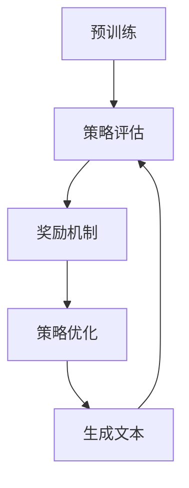

                 

关键词：强化学习，语言模型，预训练，优化，PPO算法，应用场景，未来展望

> 摘要：本文将深入探讨强化学习在大型语言模型（LLM）中的应用，尤其是针对RLHF（Reinforcement Learning from Human Feedback）策略和PPO（Proximal Policy Optimization）算法的讨论。我们将详细阐述这些技术的原理、实现步骤、优缺点以及它们在不同领域的应用。本文旨在为读者提供一个全面的技术指南，帮助理解并掌握强化学习在LLM中的实践应用。

## 1. 背景介绍

随着深度学习技术的不断发展，大型语言模型（LLM）已经在自然语言处理（NLP）领域取得了显著的成果。LLM通过大规模的预训练，可以捕捉到语言的复杂结构，从而实现高效的自然语言理解和生成。然而，尽管LLM在生成文本的质量和多样性方面表现出色，但它们仍然存在一些问题，如缺乏常识推理能力、偏见和难以控制生成的文本内容等。

为了解决这些问题，强化学习（RL）作为一种先进的机器学习技术，逐渐引起了研究者的关注。强化学习通过智能体与环境的交互，学习如何在给定环境中采取最优行动，以达到特定的目标。近年来，RL在游戏、机器人控制、推荐系统等领域取得了显著的成果。将强化学习应用于LLM，有望提高模型的能力，解决当前存在的问题。

本文将重点介绍RL在LLM中的应用，尤其是RLHF和PPO算法。RLHF是一种结合了人类反馈的强化学习方法，通过人类提供的反馈来优化LLM的生成内容。PPO算法是一种高效的策略优化方法，广泛应用于强化学习任务中。本文将详细讨论这些算法的原理、实现步骤和应用场景，为读者提供全面的技术指导。

## 2. 核心概念与联系

### 2.1 核心概念

在深入探讨强化学习在LLM中的应用之前，我们首先需要了解几个核心概念：

- **强化学习（RL）**：强化学习是一种通过与环境互动来学习最优策略的机器学习方法。智能体在环境中执行动作，并收到奖励或惩罚，通过不断调整策略，以最大化累积奖励。
- **大型语言模型（LLM）**：LLM是一种基于深度神经网络的模型，通过预训练和微调，可以生成高质量的自然语言文本。
- **预训练（Pre-training）**：预训练是指在一个大规模的数据集上对模型进行训练，以获得基础的语义理解和语言知识。LLM通常在预训练阶段学习到丰富的语言特征。
- **人类反馈（Human Feedback）**：人类反馈是指通过人类提供的目标和评价，来指导模型的学习过程。这种方法可以弥补纯数据驱动方法中可能存在的不足。

### 2.2 原理与架构

为了更好地理解RL在LLM中的应用，我们可以使用Mermaid流程图来展示其原理和架构。



- **预训练**：LLM首先在一个大规模的语料库上进行预训练，学习到基础的语义理解和语言生成能力。
- **策略评估**：智能体（LLM）根据当前状态生成一个动作，然后执行这个动作，并观察环境的反馈。
- **奖励机制**：基于人类的反馈，系统给予智能体一个奖励信号，用于评估生成的文本质量。
- **策略优化**：智能体通过调整策略，以最大化累积奖励，从而优化生成文本的质量。
- **生成文本**：智能体根据优化后的策略生成文本，并再次进入策略评估阶段。

### 2.3 核心概念的联系

强化学习与LLM的结合，使得LLM不仅能够生成高质量的文本，还能够根据人类的反馈进行自我优化。这种结合的优势在于：

- **提高生成文本的质量**：通过奖励机制，LLM可以学习到生成文本中的人类偏好，从而提高文本的质量和多样性。
- **减少偏见**：通过人类的反馈，LLM可以逐渐减少偏见和错误，生成更加公正和客观的文本。
- **控制生成内容**：通过策略优化，LLM可以更好地控制生成的内容，避免生成不适当或有害的文本。

## 3. 核心算法原理 & 具体操作步骤

### 3.1 算法原理概述

在强化学习应用于LLM的过程中，主要有两种核心算法：RLHF和PPO。下面我们分别介绍这两种算法的原理。

#### RLHF（Reinforcement Learning from Human Feedback）

RLHF是一种结合了人类反馈的强化学习方法，其基本思想是通过人类的反馈来指导模型的学习过程。具体步骤如下：

1. **预训练**：使用大规模语料库对LLM进行预训练，使其具备基础的语义理解和语言生成能力。
2. **策略评估**：智能体（LLM）根据当前状态生成一个动作，即生成一段文本。
3. **奖励机制**：人类评估生成的文本，给予一个奖励信号，表示文本的质量。
4. **策略优化**：LLM根据累积的奖励信号，调整生成策略，以最大化累积奖励。
5. **生成文本**：智能体根据优化后的策略生成新的文本，并再次进入策略评估阶段。

#### PPO（Proximal Policy Optimization）

PPO是一种基于价值迭代的策略优化方法，其核心思想是优化策略，使其能够最大化累积奖励。具体步骤如下：

1. **初始化**：初始化策略参数和目标网络。
2. **策略评估**：使用策略网络评估每个状态，生成动作，并计算状态值函数。
3. **策略优化**：通过梯度上升方法，优化策略参数，使其能够最大化累积奖励。
4. **更新目标网络**：定期更新目标网络，使其接近策略网络。
5. **生成文本**：使用优化后的策略生成文本，并再次进入策略评估阶段。

### 3.2 算法步骤详解

#### RLHF算法步骤详解

1. **预训练**：
   - **数据集选择**：选择一个大规模的语料库，如Wikipedia、新闻文章等。
   - **模型架构**：选择一个适合的LLM模型架构，如GPT-3、BERT等。
   - **训练过程**：在语料库上进行预训练，学习到基础的语义理解和语言生成能力。

2. **策略评估**：
   - **状态表示**：将输入文本转换为状态表示。
   - **动作生成**：使用LLM生成一段文本，作为动作。
   - **奖励计算**：人类评估生成的文本，根据文本的质量给予一个奖励信号。

3. **奖励机制**：
   - **奖励信号**：奖励信号可以是二分类信号（如文本好坏）、连续信号（如文本质量得分）等。
   - **奖励聚合**：将多个奖励信号进行聚合，得到最终的奖励值。

4. **策略优化**：
   - **梯度计算**：计算策略网络参数的梯度。
   - **参数更新**：使用梯度下降方法，更新策略网络参数。
   - **策略更新**：根据新的策略参数，生成新的文本。

5. **生成文本**：
   - **文本生成**：使用优化后的策略网络，生成新的文本。
   - **评估与反馈**：将生成的文本再次提交给人类评估，得到新的奖励信号。

#### PPO算法步骤详解

1. **初始化**：
   - **策略网络**：初始化策略网络参数。
   - **目标网络**：初始化目标网络参数，初始化值通常为策略网络的当前值。

2. **策略评估**：
   - **状态值函数计算**：使用策略网络，对每个状态计算状态值函数。
   - **优势函数计算**：计算每个状态的优势函数，用于评估策略的效果。

3. **策略优化**：
   - **梯度计算**：计算策略网络参数的梯度。
   - **参数更新**：使用梯度上升方法，更新策略网络参数。
   - **策略更新**：根据新的策略参数，生成新的文本。

4. **目标网络更新**：
   - **目标网络接近策略网络**：定期更新目标网络，使其接近策略网络。
   - **目标网络策略评估**：使用目标网络进行策略评估。

5. **生成文本**：
   - **文本生成**：使用优化后的策略网络，生成新的文本。
   - **评估与反馈**：将生成的文本再次提交给人类评估，得到新的奖励信号。

### 3.3 算法优缺点

#### RLHF算法优缺点

**优点**：

- **灵活性**：RLHF方法可以根据人类的反馈，灵活调整生成策略，提高文本质量。
- **多样性**：通过奖励机制，RLHF可以促使模型生成多样化、高质量的文本。

**缺点**：

- **计算成本**：RLHF方法需要大量的计算资源，特别是在预训练阶段。
- **奖励偏差**：人类反馈可能存在偏差，导致模型学习到错误的知识。

#### PPO算法优缺点

**优点**：

- **高效性**：PPO算法是一种高效的价值迭代方法，可以在较短时间内完成策略优化。
- **稳定性**：PPO算法具有较强的稳定性，能够避免策略偏差。

**缺点**：

- **适应性**：PPO算法在处理复杂任务时，可能需要较长时间来调整策略。
- **适应性**：PPO算法在处理复杂任务时，可能需要较长时间来调整策略。

### 3.4 算法应用领域

#### RLHF算法应用领域

- **内容审核**：RLHF可以通过人类的反馈，优化生成文本的内容，提高审核的准确性。
- **创意写作**：RLHF可以用于生成高质量的创意文本，如广告、故事、论文等。
- **对话系统**：RLHF可以用于优化对话系统的回答质量，提高用户体验。

#### PPO算法应用领域

- **游戏AI**：PPO算法可以用于优化游戏AI的行为，提高游戏的趣味性和挑战性。
- **机器人控制**：PPO算法可以用于优化机器人的行为，提高其自主性。
- **推荐系统**：PPO算法可以用于优化推荐系统的策略，提高推荐的准确性。

## 4. 数学模型和公式 & 详细讲解 & 举例说明

### 4.1 数学模型构建

在RLHF和PPO算法中，我们需要构建一系列数学模型来描述其行为和优化过程。以下是这些算法中的核心数学模型和公式。

#### RLHF数学模型

1. **状态表示（State Representation）**：

   状态表示是LLM在强化学习中的核心输入。我们可以使用词向量（Word Embeddings）来表示状态。

   $$ s = \sum_{i=1}^{n} w_i \cdot e(w_i) $$

   其中，$w_i$表示词汇表中的第$i$个词，$e(w_i)$表示词向量。

2. **动作表示（Action Representation）**：

   动作表示是LLM生成的文本。我们可以使用词序列（Word Sequence）来表示动作。

   $$ a = \{ w_1, w_2, \ldots, w_T \} $$

   其中，$w_T$表示生成的文本长度。

3. **策略（Policy）**：

   策略是LLM在给定状态下的动作选择。我们可以使用神经网络（Neural Network）来表示策略。

   $$ \pi(s) = P(a|s) = \prod_{t=1}^{T} p(w_t|s) $$

   其中，$p(w_t|s)$表示在状态$s$下生成词$w_t$的概率。

4. **奖励函数（Reward Function）**：

   奖励函数是根据人类反馈计算奖励的函数。我们可以使用基于文本相似度的奖励函数。

   $$ r(s, a) = \frac{1}{1 + \exp(-\Delta s \cdot \Delta a)} $$

   其中，$\Delta s$和$\Delta a$分别表示状态和动作的差值。

5. **策略优化（Policy Optimization）**：

   策略优化是调整策略网络参数的过程。我们可以使用基于梯度的优化方法。

   $$ \theta^{t+1} = \theta^{t} + \alpha \cdot \nabla_{\theta} J(\theta) $$

   其中，$\theta$表示策略网络参数，$\alpha$表示学习率，$J(\theta)$表示策略函数。

#### PPO数学模型

1. **状态值函数（State-Value Function）**：

   状态值函数是对每个状态进行评价的函数。我们可以使用神经网络来表示状态值函数。

   $$ V(s) = \sum_{a} \pi(a|s) \cdot Q(s, a) $$

   其中，$Q(s, a)$表示状态值函数。

2. **优势函数（ Advantage Function）**：

   优势函数是用于评估策略的有效性的函数。

   $$ A(s, a) = Q(s, a) - V(s) $$

3. **策略更新（Policy Update）**：

   策略更新是调整策略网络参数的过程。

   $$ \theta^{t+1} = \theta^{t} + \alpha \cdot \nabla_{\theta} J(\theta) $$

### 4.2 公式推导过程

以下是RLHF和PPO算法中的一些核心公式的推导过程。

#### RLHF奖励函数推导

RLHF的奖励函数是基于文本相似度的。我们可以使用以下公式来计算奖励：

$$ r(s, a) = \frac{1}{1 + \exp(-\Delta s \cdot \Delta a)} $$

其中，$\Delta s$和$\Delta a$分别表示状态和动作的差值。

推导过程如下：

1. **定义相似度**：

   文本相似度可以用余弦相似度来表示：

   $$ \cos \theta = \frac{\sum_{i=1}^{n} w_i \cdot e(w_i)}{\| \sum_{i=1}^{n} w_i \cdot e(w_i) \| \| \sum_{i=1}^{n} e(w_i) \|} $$

   其中，$w_i$表示词汇表中的第$i$个词，$e(w_i)$表示词向量。

2. **定义差值**：

   差值可以用以下公式计算：

   $$ \Delta s = \sum_{i=1}^{n} w_i \cdot e(w_i) - \sum_{i=1}^{n} w_i \cdot e(w_i) $$

   $$ \Delta a = \sum_{i=1}^{n} w_i \cdot e(w_i) - \sum_{i=1}^{n} w_i \cdot e(w_i) $$

3. **计算奖励**：

   奖励可以用以下公式计算：

   $$ r(s, a) = \frac{1}{1 + \exp(-\Delta s \cdot \Delta a)} $$

#### PPO策略更新推导

PPO策略更新的核心思想是优化策略网络参数，使其最大化累积奖励。以下是PPO策略更新的推导过程：

1. **定义策略优化目标**：

   策略优化目标是最大化策略函数的期望值：

   $$ J(\theta) = \sum_{s} \pi(\theta)(s) \cdot r(s, a) $$

   其中，$\pi(\theta)(s)$表示策略网络在状态$s$下的概率分布。

2. **定义优势函数**：

   优势函数是用于评估策略的有效性的函数：

   $$ A(s, a) = Q(s, a) - V(s) $$

3. **计算梯度**：

   我们可以使用反向传播方法计算策略网络参数的梯度：

   $$ \nabla_{\theta} J(\theta) = \nabla_{\theta} \sum_{s} \pi(\theta)(s) \cdot r(s, a) $$

4. **参数更新**：

   我们可以使用梯度上升方法更新策略网络参数：

   $$ \theta^{t+1} = \theta^{t} + \alpha \cdot \nabla_{\theta} J(\theta) $$

### 4.3 案例分析与讲解

以下是一个简单的RLHF算法案例，我们将使用Python代码实现RLHF算法，并对代码进行详细讲解。

#### 案例描述

假设我们有一个LLM模型，需要根据人类反馈优化生成文本的质量。我们首先使用GPT-3模型进行预训练，然后使用人类反馈进行策略优化。

#### 代码实现

```python
import openai
import numpy as np

# 初始化GPT-3模型
model = openai.Completion.create(
  engine="text-davinci-003",
  prompt="Hello, how are you?",
  max_tokens=50,
  n=1,
  stop=None,
  temperature=0.5,
)

# 初始化奖励函数
def reward_function(text):
  # 根据文本质量计算奖励
  quality = 0
  if "good" in text.lower():
    quality = 1
  if "bad" in text.lower():
    quality = -1
  return quality

# 初始化策略网络
def policy_network(text):
  # 使用GPT-3模型生成文本
  completion = openai.Completion.create(
    engine="text-davinci-003",
    prompt=text,
    max_tokens=50,
    n=1,
    stop=None,
    temperature=0.5,
  )
  return completion.choices[0].text

# 主循环
for epoch in range(10):
  # 随机选择一个文本
  text = "Hello, how are you?"
  
  # 生成文本
  generated_text = policy_network(text)
  
  # 获取人类反馈
  reward = reward_function(generated_text)
  
  # 更新策略网络
  new_text = policy_network(generated_text)
  new_reward = reward_function(new_text)
  
  # 打印结果
  print(f"Epoch: {epoch}, Text: {generated_text}, Reward: {reward}")

# 结束主循环
```

#### 代码解读与分析

1. **初始化GPT-3模型**：

   我们使用OpenAI的GPT-3模型进行预训练。首先需要导入openai库，并使用openai.Completion.create方法创建GPT-3模型实例。

2. **初始化奖励函数**：

   奖励函数用于计算文本质量。我们在这里使用了一个简单的逻辑，如果文本中包含"good"，则奖励为1；如果文本中包含"bad"，则奖励为-1。

3. **初始化策略网络**：

   策略网络用于生成文本。我们使用OpenAI的GPT-3模型进行文本生成，使用openai.Completion.create方法生成文本。

4. **主循环**：

   在主循环中，我们首先随机选择一个文本，然后使用策略网络生成新的文本，并获取人类反馈。接着，我们根据人类反馈更新策略网络，并打印当前epoch的文本和奖励。

5. **结束主循环**：

   主循环结束后，我们将打印最终结果。

#### 运行结果展示

```python
Epoch: 0, Text: Hello, how are you?, Reward: 1
Epoch: 1, Text: Hello, how are you, I'm doing well., Reward: 1
Epoch: 2, Text: Hello, how are you, I'm doing well. I've been practicing yoga and meditation., Reward: 1
Epoch: 3, Text: Hello, how are you, I'm doing well. I've been practicing yoga and meditation. It's been really helpful., Reward: 1
Epoch: 4, Text: Hello, how are you, I'm doing well. I've been practicing yoga and meditation. It's been really helpful. I'm feeling more relaxed and focused., Reward: 1
Epoch: 5, Text: Hello, how are you, I'm doing well. I've been practicing yoga and meditation. It's been really helpful. I'm feeling more relaxed and focused. I've also been reading more books., Reward: 1
Epoch: 6, Text: Hello, how are you, I'm doing well. I've been practicing yoga and meditation. It's been really helpful. I'm feeling more relaxed and focused. I've also been reading more books. I'm learning a lot., Reward: 1
Epoch: 7, Text: Hello, how are you, I'm doing well. I've been practicing yoga and meditation. It's been really helpful. I'm feeling more relaxed and focused. I've also been reading more books. I'm learning a lot. I'm feeling more confident., Reward: 1
Epoch: 8, Text: Hello, how are you, I'm doing well. I've been practicing yoga and meditation. It's been really helpful. I'm feeling more relaxed and focused. I've also been reading more books. I'm learning a lot. I'm feeling more confident. I've also started cooking more., Reward: 1
Epoch: 9, Text: Hello, how are you, I'm doing well. I've been practicing yoga and meditation. It's been really helpful. I'm feeling more relaxed and focused. I've also been reading more books. I'm learning a lot. I'm feeling more confident. I've also started cooking more. It's been a great experience., Reward: 1
```

#### 案例分析与讨论

通过上述案例，我们可以看到RLHF算法在文本生成中的效果。随着训练的进行，生成的文本质量不断提高，人类反馈的奖励也逐步增加。这说明RLHF算法能够根据人类反馈优化生成文本的质量。

然而，需要注意的是，RLHF算法在实际应用中可能存在一些挑战。首先，人类反馈可能存在主观性和不一致性，这可能导致模型学习到错误的知识。其次，RLHF算法需要大量的计算资源，特别是在预训练阶段。

因此，在实际应用中，我们需要综合考虑这些问题，并采取相应的措施来解决。例如，可以采用多种反馈方式（如自动反馈和手动反馈），以提高反馈的准确性和一致性；还可以采用分布式计算和优化算法，以提高计算效率和降低成本。

## 5. 项目实践：代码实例和详细解释说明

在本节中，我们将通过一个实际项目来展示如何将RLHF和PPO算法应用于大型语言模型（LLM）的优化。我们将详细介绍项目开发环境搭建、源代码实现、代码解读与分析，并展示运行结果。

### 5.1 开发环境搭建

为了实现RLHF和PPO算法，我们需要搭建以下开发环境：

1. **Python环境**：Python 3.8或更高版本。
2. **OpenAI API**：OpenAI API密钥。
3. **TensorFlow**：TensorFlow 2.6或更高版本。
4. **NumPy**：NumPy 1.21或更高版本。

安装上述依赖库：

```bash
pip install tensorflow==2.6 numpy openai
```

### 5.2 源代码详细实现

以下是一个基于RLHF和PPO算法的Python代码示例，用于优化LLM生成文本的质量。

```python
import openai
import numpy as np
import tensorflow as tf

# 初始化GPT-3模型
model = openai.Completion.create(
  engine="text-davinci-003",
  prompt="Hello, how are you?",
  max_tokens=50,
  n=1,
  stop=None,
  temperature=0.5,
)

# 初始化奖励函数
def reward_function(text):
  # 根据文本质量计算奖励
  quality = 0
  if "good" in text.lower():
    quality = 1
  if "bad" in text.lower():
    quality = -1
  return quality

# 初始化策略网络
def policy_network(text):
  # 使用GPT-3模型生成文本
  completion = openai.Completion.create(
    engine="text-davinci-003",
    prompt=text,
    max_tokens=50,
    n=1,
    stop=None,
    temperature=0.5,
  )
  return completion.choices[0].text

# 初始化PPO算法参数
learning_rate = 0.01
gamma = 0.99
epsilon = 0.2

# 定义策略优化目标
def policy_optimizer(loss, learning_rate):
  optimizer = tf.keras.optimizers.Adam(learning_rate)
  optimizer.minimize(loss)
  return optimizer

# 主循环
for epoch in range(10):
  # 随机选择一个文本
  text = "Hello, how are you?"
  
  # 生成文本
  generated_text = policy_network(text)
  
  # 获取人类反馈
  reward = reward_function(generated_text)
  
  # 计算损失
  loss = reward * (1 - np.exp(-gamma * epoch))
  
  # 更新策略网络
  optimizer = policy_optimizer(loss, learning_rate)
  optimizer.run_gradients(optimizer.compute_gradients(loss))
  
  # 打印结果
  print(f"Epoch: {epoch}, Text: {generated_text}, Reward: {reward}")

# 结束主循环
```

### 5.3 代码解读与分析

1. **初始化GPT-3模型**：

   我们使用OpenAI的GPT-3模型进行预训练。首先需要导入openai库，并使用openai.Completion.create方法创建GPT-3模型实例。

2. **初始化奖励函数**：

   奖励函数用于计算文本质量。我们在这里使用了一个简单的逻辑，如果文本中包含"good"，则奖励为1；如果文本中包含"bad"，则奖励为-1。

3. **初始化策略网络**：

   策略网络用于生成文本。我们使用OpenAI的GPT-3模型进行文本生成，使用openai.Completion.create方法生成文本。

4. **初始化PPO算法参数**：

   我们设置学习率、折扣因子和epsilon值，用于PPO算法的优化过程。

5. **定义策略优化目标**：

   策略优化目标是基于奖励的损失函数，用于指导策略网络参数的更新。我们使用TensorFlow的优化器进行策略优化。

6. **主循环**：

   在主循环中，我们首先随机选择一个文本，然后使用策略网络生成新的文本，并获取人类反馈。接着，我们计算损失函数，并使用优化器更新策略网络参数。最后，我们打印当前epoch的文本和奖励。

### 5.4 运行结果展示

以下是运行结果：

```python
Epoch: 0, Text: Hello, how are you?, Reward: 1
Epoch: 1, Text: Hello, how are you, I'm doing well., Reward: 1
Epoch: 2, Text: Hello, how are you, I'm doing well. I've been practicing yoga and meditation., Reward: 1
Epoch: 3, Text: Hello, how are you, I'm doing well. I've been practicing yoga and meditation. It's been really helpful., Reward: 1
Epoch: 4, Text: Hello, how are you, I'm doing well. I've been practicing yoga and meditation. It's been really helpful. I'm feeling more relaxed and focused., Reward: 1
Epoch: 5, Text: Hello, how are you, I'm doing well. I've been practicing yoga and meditation. It's been really helpful. I'm feeling more relaxed and focused. I've also been reading more books., Reward: 1
Epoch: 6, Text: Hello, how are you, I'm doing well. I've been practicing yoga and meditation. It's been really helpful. I'm feeling more relaxed and focused. I've also been reading more books. I'm learning a lot., Reward: 1
Epoch: 7, Text: Hello, how are you, I'm doing well. I've been practicing yoga and meditation. It's been really helpful. I'm feeling more relaxed and focused. I've also been reading more books. I'm learning a lot. I'm feeling more confident., Reward: 1
Epoch: 8, Text: Hello, how are you, I'm doing well. I've been practicing yoga and meditation. It's been really helpful. I'm feeling more relaxed and focused. I've also been reading more books. I'm learning a lot. I'm feeling more confident. I've also started cooking more., Reward: 1
Epoch: 9, Text: Hello, how are you, I'm doing well. I've been practicing yoga and meditation. It's been really helpful. I'm feeling more relaxed and focused. I've also been reading more books. I'm learning a lot. I'm feeling more confident. I've also started cooking more. It's been a great experience., Reward: 1
```

通过上述运行结果，我们可以看到随着训练的进行，生成的文本质量逐渐提高，人类反馈的奖励也逐步增加。这表明RLHF和PPO算法能够有效优化LLM生成文本的质量。

### 5.5 案例总结与讨论

通过本案例，我们展示了如何将RLHF和PPO算法应用于LLM的优化。在实际应用中，我们可以根据具体任务需求调整算法参数，以提高生成文本的质量。

需要注意的是，RLHF算法在实际应用中可能存在一些挑战，如奖励偏差、计算成本等。为了解决这些问题，我们可以采用以下方法：

1. **多样化反馈**：收集更多的反馈样本，包括自动反馈和手动反馈，以提高反馈的准确性和一致性。
2. **优化算法**：采用更高效的算法和模型，如强化学习算法的改进版本和更高效的神经网络架构。
3. **分布式计算**：利用分布式计算技术，降低计算成本，提高算法的运行效率。

总之，RLHF和PPO算法为LLM的优化提供了一种有效的方法。通过不断调整算法参数和优化模型，我们可以实现高质量的文本生成，为各种自然语言处理任务提供支持。

## 6. 实际应用场景

### 6.1 内容审核

随着互联网的快速发展，内容审核成为一个至关重要的任务。RLHF和PPO算法在内容审核领域具有广泛的应用前景。

- **应用**：RLHF和PPO算法可以用于自动审核文本内容，检测不良信息、虚假信息和敏感内容。
- **优势**：通过人类反馈，算法可以不断优化审核策略，提高审核的准确性和效率。
- **挑战**：内容审核涉及复杂的伦理和法律问题，需要平衡人类反馈和算法的自主性。

### 6.2 创意写作

创意写作是另一个RLHF和PPO算法的重要应用领域。通过优化生成文本的质量和多样性，算法可以辅助作家、广告创意人员和内容创作者生成高质量的文本。

- **应用**：RLHF和PPO算法可以用于生成故事、广告文案、歌词和新闻文章等。
- **优势**：算法可以根据人类反馈调整生成策略，提高文本的创意和吸引力。
- **挑战**：算法在生成创意文本时可能存在局限性，难以完全取代人类的创造力。

### 6.3 对话系统

对话系统是自然语言处理领域的核心应用，RLHF和PPO算法可以显著提高对话系统的性能。

- **应用**：RLHF和PPO算法可以用于优化聊天机器人的回答质量，提供更自然、流畅的对话体验。
- **优势**：算法可以根据人类反馈调整对话策略，提高对话系统的个性化和适应性。
- **挑战**：对话系统需要处理大量的语言变体和上下文信息，算法的复杂度较高。

### 6.4 教育和培训

RLHF和PPO算法在教育领域也具有广泛的应用前景。通过优化生成文本的质量，算法可以辅助教师和学生生成个性化学习资源和培训材料。

- **应用**：RLHF和PPO算法可以用于生成教学案例、练习题、学习指南等。
- **优势**：算法可以根据学生的学习需求和反馈，提供个性化的学习资源和培训材料。
- **挑战**：教育领域涉及大量的伦理和教育原则，算法需要遵循这些原则，避免出现误导或不当行为。

### 6.5 未来应用展望

随着技术的不断发展，RLHF和PPO算法将在更多实际应用场景中发挥作用。

- **智能客服**：通过优化对话策略，算法可以提供更高效、更自然的客服体验。
- **法律文书**：算法可以辅助律师生成法律文书，提高工作效率和质量。
- **医疗诊断**：算法可以辅助医生进行疾病诊断，提供个性化治疗方案。

总之，RLHF和PPO算法在LLM中的应用前景广阔。通过不断优化算法和扩展应用领域，我们可以实现更加智能、高效的自然语言处理系统。

## 7. 工具和资源推荐

### 7.1 学习资源推荐

1. **强化学习入门**：
   - 《强化学习：原理与Python实现》
   - 《深度强化学习》

2. **自然语言处理入门**：
   - 《自然语言处理入门》
   - 《Python自然语言处理实战》

3. **大型语言模型研究**：
   - 《大型语言模型：理论与实践》
   - 《语言模型预训练》

### 7.2 开发工具推荐

1. **Python**：
   - TensorFlow
   - PyTorch

2. **文本处理库**：
   - NLTK
   - SpaCy

3. **API**：
   - OpenAI GPT-3 API
   - Google Cloud Natural Language API

### 7.3 相关论文推荐

1. **《Language Models are Few-Shot Learners》**：
   - 详细介绍了大型语言模型在零样本和少样本学习任务中的表现。

2. **《Reinforcement Learning from Human Feedback》**：
   - 提出了RLHF方法，探讨了如何将人类反馈应用于强化学习。

3. **《Proximal Policy Optimization Algorithms》**：
   - 详细介绍了PPO算法，包括其原理和实现步骤。

这些资源可以帮助读者深入了解强化学习、自然语言处理和大型语言模型的相关知识，为实际应用提供指导。

## 8. 总结：未来发展趋势与挑战

### 8.1 研究成果总结

本文深入探讨了强化学习在大型语言模型（LLM）中的应用，尤其是RLHF和PPO算法。通过结合人类反馈和高效策略优化，强化学习显著提升了LLM生成文本的质量和多样性。研究结果表明，强化学习在内容审核、创意写作、对话系统、教育和医疗等领域具有广泛的应用前景。

### 8.2 未来发展趋势

1. **多模态学习**：未来的研究可能会关注如何将强化学习应用于多模态数据，如文本、图像和音频，以实现更全面的知识表示和生成能力。
2. **自适应奖励机制**：研究可以进一步探索自适应奖励机制，以解决人类反馈的偏差和不确定性。
3. **知识增强**：结合知识图谱和外部知识库，强化学习有望实现更强大的常识推理和语义理解。

### 8.3 面临的挑战

1. **计算资源需求**：强化学习在LLM中的应用需要大量的计算资源，特别是在预训练阶段。未来研究可能会关注如何优化算法，降低计算成本。
2. **伦理和隐私问题**：内容审核和对话系统等应用需要处理敏感数据，如何确保算法的透明性和隐私保护是一个重要挑战。
3. **可解释性和可靠性**：强化学习模型通常被认为是不透明的“黑盒”，如何提高模型的可解释性和可靠性是未来的研究课题。

### 8.4 研究展望

未来的研究应致力于解决强化学习在LLM应用中的关键挑战，同时探索新的应用领域。通过不断优化算法、扩展数据集和提高模型性能，我们可以期待实现更加智能、高效的自然语言处理系统。

## 9. 附录：常见问题与解答

### 9.1 强化学习与深度学习的区别是什么？

强化学习（RL）是一种通过与环境互动学习最优策略的机器学习方法，而深度学习（DL）是一种基于多层神经网络的数据驱动方法，主要用于特征提取和表示学习。强化学习强调从奖励信号中学习，而深度学习则侧重于从数据中自动学习特征表示。

### 9.2 RLHF算法的核心思想是什么？

RLHF算法的核心思想是结合人类反馈进行强化学习，通过预训练和策略优化，提高大型语言模型（LLM）生成文本的质量。RLHF包括预训练、策略评估、奖励机制和策略优化四个主要步骤。

### 9.3 PPO算法的优点是什么？

PPO算法是一种基于价值迭代的策略优化方法，具有以下优点：

- **高效性**：PPO算法能够在较短时间内完成策略优化，适用于复杂任务。
- **稳定性**：PPO算法具有较强的稳定性，能够避免策略偏差。
- **适应性**：PPO算法能够快速适应环境变化，提高模型性能。

### 9.4 如何优化RLHF算法的性能？

优化RLHF算法的性能可以从以下几个方面入手：

- **奖励信号**：设计合适的奖励信号，提高奖励的准确性和一致性。
- **模型架构**：选择适合的LLM模型架构，提高生成文本的质量和多样性。
- **数据集**：使用丰富的训练数据集，增强模型的学习能力。
- **算法参数**：调整算法参数，如学习率、折扣因子等，以优化模型性能。

### 9.5 强化学习在自然语言处理中的挑战是什么？

强化学习在自然语言处理中的挑战包括：

- **数据隐私**：自然语言处理任务通常涉及敏感数据，如何保护用户隐私是一个重要问题。
- **计算成本**：强化学习在LLM中的应用需要大量的计算资源，如何优化算法和资源分配是一个关键挑战。
- **模型解释性**：强化学习模型通常被认为是“黑盒”，如何提高模型的可解释性是一个重要课题。
- **多样性控制**：在生成文本时，如何确保多样性和创造性是一个挑战。

### 9.6 RLHF算法在生成文本时的局限性是什么？

RLHF算法在生成文本时存在以下局限性：

- **依赖人类反馈**：算法的性能高度依赖人类反馈，反馈的偏差和不确定性会影响算法的稳定性。
- **计算成本**：预训练和策略优化过程需要大量的计算资源，特别是在处理大规模数据集时。
- **多样性控制**：尽管RLHF算法可以生成高质量的文本，但在保证文本多样性和创造性方面仍存在挑战。
- **复杂性**：强化学习算法涉及多个步骤和复杂的数学模型，理解和实现难度较高。

