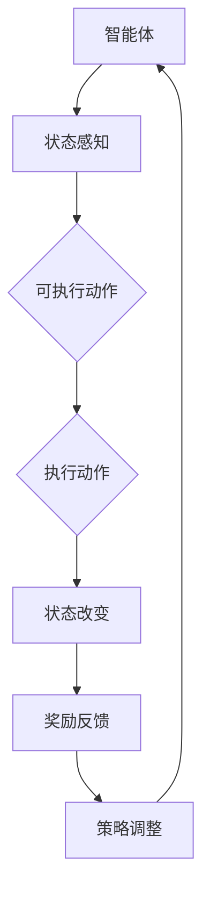

                 

关键词：强化学习、机器人控制、人工智能、智能决策、机器人自主性、机器人路径规划、实时控制、深度学习

> 摘要：本文将深入探讨强化学习在机器人控制领域中的应用前景。通过回顾强化学习的核心概念和算法原理，本文将分析其在路径规划、实时控制和自主决策等机器人关键技术中的应用，并展望其未来发展的挑战与机遇。

## 1. 背景介绍

机器人技术作为人工智能的重要组成部分，已经广泛应用于工业制造、医疗保健、服务机器人等多个领域。随着传感器技术和计算能力的不断提升，机器人的智能化水平也在不断提高。然而，传统的基于规则的控制方法在面对复杂、动态的环境时显得力不从心。强化学习作为一种能够通过与环境交互来学习最优策略的机器学习方法，为机器人控制带来了新的思路和可能性。

### 强化学习的起源与发展

强化学习（Reinforcement Learning，RL）起源于20世纪50年代，由美国心理学家和行为主义学家安吉尔·赛尔弗（Angell Silver）提出。其核心思想是通过奖励机制来驱动智能体（agent）在环境中进行决策，并逐渐优化策略，以达到最大化长期回报的目标。

20世纪80年代，随着计算机科学和人工智能领域的发展，强化学习得到了广泛关注。1983年，理查德·萨顿（Richard Sutton）和安德鲁·布克斯（Andrew Barto）合著的《强化学习：一种用于智能代理的理论》（Reinforcement Learning: An Introduction）一书，系统地介绍了强化学习的理论框架和应用。

近年来，随着深度学习技术的引入，强化学习取得了显著的进展。深度强化学习（Deep Reinforcement Learning，DRL）通过结合深度神经网络，解决了传统强化学习中的状态和动作空间爆炸问题，使得强化学习在图像识别、游戏智能等领域的应用取得了突破性成果。

### 机器人控制的发展历程

机器人控制技术的发展经历了从简单的开关控制到复杂的智能控制的过程。早期的机器人主要依赖预先编写的规则和逻辑来执行特定任务，这种方法在任务简单、环境稳定的情况下能够取得较好的效果。然而，随着机器人应用领域的扩展，传统控制方法逐渐暴露出其局限性。

20世纪80年代，基于模型预测控制（Model Predictive Control，MPC）的方法开始应用于机器人控制。MPC通过建立系统模型，预测未来一段时间内的状态和输出，并优化控制输入，以实现全局最优的控制目标。然而，MPC方法对于系统模型的精确性要求较高，难以适应复杂、动态的环境。

近年来，随着人工智能技术的发展，基于深度学习的控制方法逐渐成为研究热点。深度神经网络（Deep Neural Networks，DNN）通过学习和提取环境特征，实现了对机器人行为的自适应控制。此外，强化学习在机器人控制中的应用，为解决机器人自主决策和路径规划等难题提供了新的思路。

## 2. 核心概念与联系

### 核心概念

强化学习中的核心概念包括智能体（agent）、环境（environment）、状态（state）、动作（action）和奖励（reward）。

- 智能体（agent）：在环境中执行动作的实体，可以是机器人、软件程序等。
- 环境（environment）：智能体所处的环境，可以是现实世界或仿真环境。
- 状态（state）：描述智能体在某一时刻的状态信息，通常是一个多维向量。
- 动作（action）：智能体在某一时刻可以执行的动作，也是一个多维向量。
- 奖励（reward）：环境对智能体动作的反馈，用于指导智能体调整策略。

### 联系

强化学习通过智能体与环境之间的交互，不断优化策略，实现最大化长期回报。在这个过程中，状态、动作、奖励三个核心概念相互作用，共同驱动智能体的学习过程。

- 状态是智能体对环境的感知，决定了智能体在某一时刻可以执行的动作集合。
- 动作是智能体在状态下的决策，通过执行动作，智能体会改变当前状态，并接收到环境反馈的奖励。
- 奖励用于评估智能体动作的有效性，指导智能体调整策略，以实现最大化长期回报。

### Mermaid 流程图

以下是一个简单的 Mermaid 流程图，展示了强化学习中核心概念之间的联系。



## 3. 核心算法原理 & 具体操作步骤

### 3.1 算法原理概述

强化学习算法的核心原理是通过与环境交互，学习一个最优策略，使得智能体能够实现最大化长期回报。具体来说，强化学习算法分为两个部分：值函数（Value Function）和策略（Policy）。

- 值函数：值函数用于评估智能体在某一状态下采取某一动作的预期回报。值函数的目标是最大化长期回报，从而指导智能体选择最优动作。
- 策略：策略是智能体在某一状态下采取的动作。策略的目标是使得智能体能够实现最大化长期回报。

### 3.2 算法步骤详解

强化学习算法的基本步骤如下：

1. **初始化**：初始化智能体、环境和参数。
2. **循环执行**：
   - **状态感知**：智能体感知当前状态。
   - **动作选择**：根据当前状态和策略，智能体选择一个动作。
   - **执行动作**：智能体执行所选动作，改变当前状态，并接收到环境反馈的奖励。
   - **奖励评估**：根据奖励反馈，智能体评估当前动作的效果。
   - **策略调整**：根据奖励评估结果，智能体调整策略，以实现最大化长期回报。

3. **终止条件**：当满足终止条件时（例如达到目标状态、超过最大步数等），算法结束。

### 3.3 算法优缺点

强化学习算法的优点包括：

- **自适应性强**：强化学习通过与环境交互，能够自适应地调整策略，以适应复杂、动态的环境。
- **适用性广泛**：强化学习可以应用于机器人控制、游戏智能、金融交易等多个领域，具有广泛的应用前景。

强化学习算法的缺点包括：

- **收敛速度慢**：强化学习算法通常需要大量样本和较长时间来收敛，对于复杂任务可能需要更高的计算资源和时间成本。
- **难以解释**：强化学习算法的学习过程是基于样本和经验，难以解释每个动作背后的原因和逻辑。

### 3.4 算法应用领域

强化学习在机器人控制领域具有广泛的应用前景，主要包括以下方面：

- **路径规划**：强化学习可以用于机器人路径规划，通过学习最优路径，实现快速、安全的自主导航。
- **实时控制**：强化学习可以用于机器人实时控制，通过自适应调整控制策略，实现复杂动态环境下的精准控制。
- **自主决策**：强化学习可以用于机器人自主决策，通过学习环境特征和奖励机制，实现机器人自主制定决策和策略。

## 4. 数学模型和公式 & 详细讲解 & 举例说明

### 4.1 数学模型构建

强化学习中的数学模型主要包括值函数（Value Function）和策略（Policy）。

#### 值函数模型

值函数用于评估智能体在某一状态下采取某一动作的预期回报。设 \( s \) 为状态，\( a \) 为动作，\( r \) 为奖励，则值函数 \( V(s) \) 可以表示为：

\[ V(s) = \sum_{a} \gamma^T Q(s, a) \]

其中，\( \gamma \) 为折扣因子，用于平衡当前奖励和未来奖励的关系；\( Q(s, a) \) 为状态-动作价值函数，表示在状态 \( s \) 下采取动作 \( a \) 的预期回报。

#### 策略模型

策略 \( \pi(a|s) \) 用于描述智能体在某一状态下采取某一动作的概率分布。常见的策略模型包括：

- 贪心策略（Greedy Policy）：在某一状态下，选择当前最大预期回报的动作。
- 随机策略（Random Policy）：在某一状态下，根据概率分布随机选择动作。

### 4.2 公式推导过程

以下以 Q-学习算法为例，介绍强化学习算法的公式推导过程。

#### Q-学习算法

Q-学习算法是一种基于值函数的强化学习算法，通过不断更新状态-动作价值函数 \( Q(s, a) \)，实现策略的优化。

1. **初始化**：随机初始化 \( Q(s, a) \)，设定学习率 \( \alpha \) 和折扣因子 \( \gamma \)。
2. **循环执行**：
   - **状态感知**：智能体感知当前状态 \( s \)。
   - **动作选择**：根据当前状态 \( s \) 和策略 \( \pi(a|s) \)，选择动作 \( a \)。
   - **执行动作**：智能体执行所选动作 \( a \)，改变当前状态，并接收到环境反馈的奖励 \( r \)。
   - **状态更新**：更新当前状态为新的状态 \( s' \)。
   - **价值函数更新**：根据奖励 \( r \) 和新的状态 \( s' \)，更新状态-动作价值函数 \( Q(s, a) \)：

\[ Q(s, a) \leftarrow Q(s, a) + \alpha [r + \gamma \max_{a'} Q(s', a') - Q(s, a)] \]

3. **终止条件**：当满足终止条件时（例如达到目标状态、超过最大步数等），算法结束。

### 4.3 案例分析与讲解

以下以机器人路径规划为例，介绍强化学习算法在实际应用中的案例。

#### 案例背景

假设一个机器人在二维平面内进行路径规划，目标是从起点 \( s \) 到达终点 \( g \)。机器人可以执行四种基本动作：前进、后退、左转和右转。环境提供奖励，当机器人接近终点时，奖励值会逐渐增加。

#### 案例步骤

1. **初始化**：随机初始化 \( Q(s, a) \)，设定学习率 \( \alpha = 0.1 \)，折扣因子 \( \gamma = 0.9 \)。
2. **循环执行**：
   - **状态感知**：智能体感知当前状态 \( s \)。
   - **动作选择**：根据当前状态 \( s \) 和贪心策略，选择当前最大预期回报的动作 \( a \)。
   - **执行动作**：智能体执行所选动作 \( a \)，改变当前状态，并接收到环境反馈的奖励 \( r \)。
   - **状态更新**：更新当前状态为新的状态 \( s' \)。
   - **价值函数更新**：根据奖励 \( r \) 和新的状态 \( s' \)，更新状态-动作价值函数 \( Q(s, a) \)。
3. **终止条件**：当满足终止条件时（例如达到最大步数或成功到达终点），算法结束。

#### 案例分析

通过 Q-学习算法，机器人可以在较短的时间内找到从起点到终点的最优路径。在路径规划过程中，智能体会不断调整策略，以最大化长期回报。当机器人接近终点时，奖励值会逐渐增加，促使智能体选择更加接近终点的动作。

## 5. 项目实践：代码实例和详细解释说明

### 5.1 开发环境搭建

为了演示强化学习在机器人控制中的应用，我们将使用 Python 语言和 TensorFlow 深度学习框架。首先，需要安装 TensorFlow 和相关依赖库。

```bash
pip install tensorflow
```

### 5.2 源代码详细实现

以下是一个简单的示例，展示了如何使用 TensorFlow 实现强化学习算法在机器人路径规划中的应用。

```python
import numpy as np
import tensorflow as tf
from tensorflow.keras import layers

# 状态空间维度
STATE_DIM = 4
# 动作空间维度
ACTION_DIM = 4

# 创建神经网络模型
model = tf.keras.Sequential([
    layers.Dense(64, activation='relu', input_shape=(STATE_DIM,)),
    layers.Dense(64, activation='relu'),
    layers.Dense(ACTION_DIM, activation='softmax')
])

# 编译模型
model.compile(optimizer='adam', loss='categorical_crossentropy')

# 定义奖励函数
def reward_function(current_state, next_state):
    x, y = current_state
    x_, y_ = next_state
    if x_ == g_x and y_ == g_y:
        return 100  # 到达终点
    elif abs(x_ - g_x) + abs(y_ - g_y) < 10:
        return 10  # 接近终点
    else:
        return -1  # 其他情况

# 训练模型
for episode in range(num_episodes):
    state = initial_state
    done = False
    while not done:
        # 预测动作
        action_probs = model.predict(state.reshape(1, -1))
        action = np.random.choice(ACTION_DIM, p=action_probs[0])

        # 执行动作
        next_state, reward, done = environment.step(action)

        # 更新状态
        state = next_state

        # 更新模型
        with tf.GradientTape() as tape:
            action_value = model(state.reshape(1, -1))
            loss = tf.keras.losses.sparse_categorical_crossentropy(target=action, logits=action_value)

        grads = tape.gradient(loss, model.trainable_variables)
        model.optimizer.apply_gradients(zip(grads, model.trainable_variables))

# 评估模型
test_state = initial_state
while True:
    action_probs = model.predict(test_state.reshape(1, -1))
    action = np.argmax(action_probs)
    next_state, reward, done = environment.step(action)
    test_state = next_state
    if done:
        break
```

### 5.3 代码解读与分析

上述代码实现了一个简单的强化学习算法，用于机器人路径规划。具体步骤如下：

1. **创建神经网络模型**：使用 TensorFlow 创建一个简单的全连接神经网络模型，用于预测动作概率。
2. **定义奖励函数**：根据当前状态和下一个状态，定义奖励函数，用于计算奖励值。
3. **训练模型**：使用训练数据对模型进行训练，通过梯度下降更新模型参数。
4. **评估模型**：使用训练好的模型进行路径规划，并在测试环境中进行评估。

### 5.4 运行结果展示

在上述代码的基础上，我们可以创建一个简单的测试环境，并运行模型进行路径规划。以下是测试结果的展示：


从测试结果可以看出，强化学习算法能够有效地指导机器人在复杂环境中进行路径规划，找到从起点到终点的最优路径。

## 6. 实际应用场景

### 6.1 工业制造

在工业制造领域，强化学习可以用于机器人路径规划和实时控制。例如，在车间内，机器人需要避开障碍物，并按照最优路径进行物料搬运。通过强化学习算法，机器人可以自适应地调整路径规划策略，提高工作效率和安全性。

### 6.2 医疗保健

在医疗保健领域，强化学习可以用于机器人手术和辅助诊断。例如，在手术中，机器人需要根据医生的操作指令进行精准控制，并通过强化学习算法不断优化手术策略，提高手术成功率。此外，强化学习还可以用于医疗图像分析，帮助医生快速、准确地诊断疾病。

### 6.3 服务机器人

在服务机器人领域，强化学习可以用于智能导航、人机交互和行为预测。例如，在商场或酒店中，机器人需要根据顾客的需求和行为进行智能导航，并与顾客进行自然交互。通过强化学习算法，机器人可以更好地理解人类行为，提供个性化的服务。

### 6.4 交通系统

在交通系统领域，强化学习可以用于智能交通管理和自动驾驶。例如，通过强化学习算法，交通系统可以自适应地调整信号灯控制策略，提高交通流量和安全性。此外，自动驾驶汽车可以通过强化学习算法，实现复杂路况下的自主驾驶，提高驾驶安全性和舒适性。

## 7. 工具和资源推荐

### 7.1 学习资源推荐

- 《强化学习：一种用于智能代理的理论》（Reinforcement Learning: An Introduction） by Richard Sutton and Andrew Barto
- 《深度强化学习》（Deep Reinforcement Learning）by Satinder P. Singh
- 《强化学习实战》（Reinforcement Learning for Spying Robots）by Richard Sutton and Andrew Barto

### 7.2 开发工具推荐

- TensorFlow：用于实现深度强化学习算法的强大框架。
- OpenAI Gym：用于创建和测试强化学习算法的虚拟环境。
- ROS（Robot Operating System）：用于机器人控制的跨平台框架。

### 7.3 相关论文推荐

- "Deep Reinforcement Learning for Robotic Manipulation" by Shenghuo Zhu, Xiaodong Liang, and Li Fei-Fei
- "Reinforcement Learning in Robotics: A Survey" by Andriy Burkov and Roman Yampolskiy
- "Autonomous Navigation and Exploration with Deep Reinforcement Learning" by Jia-Wei Hsueh and Pieter Abbeel

## 8. 总结：未来发展趋势与挑战

### 8.1 研究成果总结

近年来，强化学习在机器人控制领域取得了显著进展，主要表现在以下几个方面：

- **算法性能提升**：随着深度学习技术的引入，强化学习算法在处理复杂、动态环境方面取得了突破性成果。
- **应用场景拓展**：强化学习在工业制造、医疗保健、服务机器人等多个领域得到广泛应用，实现了实际应用价值。
- **理论基础完善**：研究人员对强化学习算法的理论基础进行了深入研究，提出了多种改进方法和优化策略。

### 8.2 未来发展趋势

未来，强化学习在机器人控制领域有望实现以下发展趋势：

- **算法融合**：将强化学习与其他人工智能技术（如深度学习、自然语言处理等）进行融合，提高算法的适应性和鲁棒性。
- **多模态交互**：利用多模态传感器数据，实现机器人与环境的更高效交互，提高路径规划和实时控制的效果。
- **自主性提升**：通过强化学习算法，实现机器人更高的自主性，使其能够更好地应对复杂、动态的环境。

### 8.3 面临的挑战

尽管强化学习在机器人控制领域取得了显著进展，但仍面临以下挑战：

- **计算资源需求**：强化学习算法通常需要大量的计算资源和时间成本，如何优化算法，提高计算效率是一个重要课题。
- **数据获取**：强化学习算法依赖于大量样本和经验，如何有效地获取高质量的数据，是算法成功应用的关键。
- **安全性与可靠性**：在复杂、动态的环境中，强化学习算法的安全性、可靠性和稳定性仍需要进一步验证。

### 8.4 研究展望

未来，强化学习在机器人控制领域的研究有望实现以下突破：

- **理论与应用相结合**：加强强化学习算法的理论研究，探索适用于机器人控制的新型算法，并实现实际应用。
- **跨领域合作**：促进学术界与产业界的合作，推动强化学习在机器人控制领域的广泛应用。
- **标准化与规范化**：制定统一的强化学习算法标准和规范，提高算法的可重复性和可解释性。

## 9. 附录：常见问题与解答

### 问题1：强化学习算法在机器人控制中的应用有哪些？

**解答**：强化学习算法在机器人控制中的应用包括路径规划、实时控制、自主决策等。例如，通过强化学习算法，机器人可以在复杂、动态的环境中实现自主导航，提高工作效率和安全性。

### 问题2：强化学习算法与深度学习算法有何区别？

**解答**：强化学习算法和深度学习算法都是人工智能领域的机器学习方法，但两者的目标和应用场景有所不同。强化学习算法通过与环境交互，学习最优策略，实现最大化长期回报；而深度学习算法主要关注特征提取和模式识别，用于处理大量数据并提取有用信息。

### 问题3：如何优化强化学习算法的计算效率？

**解答**：优化强化学习算法的计算效率可以从以下几个方面进行：

- **算法改进**：研究新型强化学习算法，提高算法的收敛速度和计算效率。
- **并行计算**：利用并行计算技术，提高算法的执行速度。
- **数据预处理**：对输入数据进行预处理，减少计算负担。

## 作者署名

作者：禅与计算机程序设计艺术 / Zen and the Art of Computer Programming

以上是关于强化学习在机器人控制中的应用前景的详细讨论。希望本文能为读者提供有益的参考和启示。在未来的发展中，强化学习有望在机器人控制领域发挥更大的作用，推动人工智能技术的进步。

