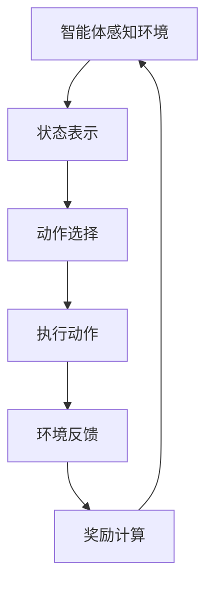

                 

### 关键词 Keywords
强化学习、自动驾驶、决策规划、深度学习、神经网络、数据驱动、仿真测试、安全性能、实时响应。

<|assistant|>### 摘要 Abstract
本文深入探讨了强化学习在自动驾驶决策规划中的应用，分析了其基本概念、核心算法原理及其在自动驾驶领域的具体应用。通过对强化学习与自动驾驶决策规划的深度融合，文章展现了这一前沿技术的巨大潜力。本文首先介绍了强化学习的背景和核心概念，随后详细阐述了其在自动驾驶决策规划中的应用，最后对当前的研究进展、面临的挑战以及未来应用前景进行了总结和分析。

<|assistant|>## 1. 背景介绍

自动驾驶技术是21世纪交通领域的重要创新，其核心在于车辆能够在没有人类操作的情况下自主行驶。随着传感器技术、计算机视觉和人工智能算法的快速发展，自动驾驶技术逐渐从理论走向实际应用。然而，自动驾驶系统的高效决策规划是实现其安全、稳定运行的关键。传统的决策规划方法往往依赖于预先设定的规则和模型，难以应对复杂多变的交通环境。

强化学习（Reinforcement Learning，RL）作为机器学习的一个重要分支，近年来在自动驾驶决策规划中展现出了强大的适应能力和优化性能。强化学习通过智能体与环境的交互，通过奖励机制不断调整策略，以实现最优决策。这种数据驱动的学习方式，使得自动驾驶系统能够在复杂的交通环境中进行自主学习和适应。

本文将首先介绍强化学习的基本概念和核心算法，然后详细分析其在自动驾驶决策规划中的应用，包括环境建模、状态表示、动作选择和奖励设计等关键环节。最后，我们将探讨当前强化学习在自动驾驶决策规划中面临的技术挑战和未来发展方向。

<|assistant|>## 2. 核心概念与联系

### 强化学习的定义

强化学习是一种通过与环境互动来学习最优策略的机器学习方法。它与监督学习和无监督学习不同，强化学习中的智能体（Agent）通过尝试不同的行动（Action），并根据环境（Environment）的反馈（Reward）来调整其行为。强化学习的主要目标是最大化累积奖励，以实现长期的优化目标。

强化学习的关键概念包括：

- **智能体（Agent）**：执行动作、感知环境和接收奖励的实体。
- **环境（Environment）**：智能体执行动作时所处的场景，对智能体的动作作出反应。
- **状态（State）**：智能体在某一时刻所感知到的环境信息。
- **动作（Action）**：智能体在状态中可以采取的行动。
- **奖励（Reward）**：环境对智能体动作的反馈，用于指导智能体的学习。

### 强化学习与自动驾驶决策规划的关联

在自动驾驶决策规划中，强化学习通过以下几个关键环节实现了与传统方法的区别：

- **环境建模（Environment Modeling）**：自动驾驶环境建模是强化学习应用的基础。一个精确和逼真的环境模型能够捕捉交通流、道路条件、其他车辆和行人的行为等复杂因素，为智能体提供真实世界的感知信息。
- **状态表示（State Representation）**：状态表示是自动驾驶决策规划的核心。智能体需要能够有效感知和表示当前环境的状态，以便作出合理的决策。常用的状态表示方法包括图像处理、传感器数据融合、高维特征提取等。
- **动作选择（Action Selection）**：动作选择是强化学习在自动驾驶中的关键步骤。智能体需要根据当前状态选择最优动作，以最大化长期累积奖励。在自动驾驶中，动作可能包括加速、减速、转向、换道等。
- **奖励设计（Reward Design）**：奖励设计直接影响智能体的学习效果。合理的奖励设计能够引导智能体在复杂环境中采取安全、有效的决策。在自动驾驶中，奖励可能包括行驶距离、速度稳定性、避让行为等。

为了更直观地展示强化学习在自动驾驶决策规划中的应用，我们可以使用Mermaid流程图来描述其核心环节：



### 强化学习算法原理概述

强化学习算法主要分为两大类：基于值函数的方法和基于策略的方法。

- **基于值函数的方法（Value-based Methods）**：这种方法通过学习状态值函数（State-Value Function）和动作值函数（Action-Value Function）来指导智能体的决策。其中，状态值函数表示智能体在某个状态下的最优累积奖励，动作值函数表示智能体在某个状态下执行某个动作的预期累积奖励。常用的算法包括Q学习（Q-Learning）和优势值函数（Advantage Function）。
  
- **基于策略的方法（Policy-based Methods）**：这种方法通过直接学习策略（Policy），即从状态到动作的映射，来指导智能体的决策。策略可以分为确定性策略（Deterministic Policy）和随机性策略（Stochastic Policy）。常用的算法包括策略梯度算法（Policy Gradient Methods）和深度确定性策略梯度（Deep Deterministic Policy Gradient，DDPG）。

强化学习算法在自动驾驶决策规划中的应用，可以结合深度学习技术，形成深度强化学习（Deep Reinforcement Learning，DRL）。DRL通过神经网络来近似值函数或策略，从而处理高维状态和动作空间，提高学习效率。在自动驾驶中，常用的DRL算法包括深度Q网络（Deep Q-Network，DQN）、深度策略网络（Deep Policy Network，DPN）和深度确定性策略梯度（DDPG）。

<|assistant|>## 3. 核心算法原理 & 具体操作步骤

### 3.1 算法原理概述

强化学习算法的核心在于通过智能体与环境的互动来学习最优策略。强化学习主要分为以下两类：

1. **值函数方法**：
    - **Q学习（Q-Learning）**：Q学习通过更新Q值（动作值函数）来优化策略。Q值表示在某一状态下执行某一动作的预期回报。
    - **深度Q网络（Deep Q-Network，DQN）**：DQN是Q学习的扩展，使用深度神经网络来近似Q值函数，以处理高维状态空间。

2. **策略方法**：
    - **策略梯度方法**：策略梯度方法通过直接更新策略参数来优化策略，常用的算法包括策略梯度（Policy Gradient，PG）和深度确定性策略梯度（Deep Deterministic Policy Gradient，DDPG）。
    - **深度确定性策略梯度（DDPG）**：DDPG是一个基于策略的方法，它使用深度神经网络来近似状态-动作值函数（Actor-Critic）。

### 3.2 算法步骤详解

**Q-Learning算法步骤**：

1. 初始化Q值表`Q[s, a]`和智能体参数。
2. 在某个状态`s`下随机选择一个动作`a`。
3. 执行动作`a`，得到新的状态`s'`和即时奖励`r`。
4. 使用更新公式`Q[s, a] = Q[s, a] + α [r + γ max(Q[s', a']) - Q[s, a]]`更新Q值。
5. 将智能体移动到新的状态`s'`。
6. 重复步骤2-5直到达到终止条件。

**DQN算法步骤**：

1. 初始化深度神经网络`Q(s, a)`和经验回放缓冲池。
2. 从初始状态`s`开始，在每一步选择一个动作`a`，使用ε-贪心策略。
3. 执行动作`a`，获得新的状态`s'`、即时奖励`r`和终止标志`done`。
4. 将经验`(s, a, r, s', done)`存储到经验回放缓冲池中。
5. 当缓冲池达到一定的经验量时，随机从缓冲池中抽取一批经验样本。
6. 对于每个样本，计算目标Q值`y = r + γ max(Q(s', a')_{all})`，其中`a'`是使得`Q(s', a')`最大的动作。
7. 使用梯度下降法更新神经网络参数。
8. 重复步骤2-7直到达到终止条件。

**DDPG算法步骤**：

1. 初始化演员网络`πθ(s)`、评论家网络`Qφ(s, a)`和目标网络`πθ'(s')`、`Qφ'(s', a')`。
2. 对于每个训练回合：
   - 初始化状态`s`。
   - 在每一步选择一个动作`a = πθ(s)`。
   - 执行动作`a`，获得新的状态`s'`、即时奖励`r`和终止标志`done`。
   - 存储经验`(s, a, r, s', done)`到经验缓冲池。
   - 如果满足更新条件，使用目标网络的目标值`y = r + γ Qφ'(s', πθ'(s')`)更新经验缓冲池。
   - 每隔一段时间更新目标网络参数`θ' = τθ`。
   - 使用经验缓冲池中的经验进行演员网络和评论家网络的训练。

### 3.3 算法优缺点

**Q-Learning算法优点**：

- 算法简单，易于实现。
- 可以处理连续状态和动作空间。
- 对目标值函数的误差具有鲁棒性。

**Q-Learning算法缺点**：

- 需要大量经验数据进行训练。
- 可能陷入局部最优，导致学习效率降低。

**DQN算法优点**：

- 可以处理高维状态空间。
- 算法相对简单，易于实现。
- 引入了经验回放机制，减少了样本相关性的影响。

**DQN算法缺点**：

- 可能出现目标值函数不稳定的问题。
- ε-贪心策略可能导致学习效率降低。

**DDPG算法优点**：

- 可以处理高维状态和动作空间。
- 引入了深度神经网络，提高了学习效率。
- 策略梯度方法可以自适应地调整策略。

**DDPG算法缺点**：

- 需要较大的经验缓冲池，训练时间较长。
- 策略网络和评论家网络的训练可能不稳定。

### 3.4 算法应用领域

强化学习算法在自动驾驶决策规划中的应用主要包括以下几个方面：

1. **车道保持**：通过学习车道线的位置和车辆的运动状态，自动驾驶车辆能够保持稳定的车道位置。
2. **速度控制**：自动驾驶车辆根据道路条件和交通状况，动态调整行驶速度。
3. **避障行为**：通过感知周围环境，自动驾驶车辆能够自动避开障碍物，确保行车安全。
4. **换道行为**：自动驾驶车辆在合适的时机和条件下，能够自动完成换道操作，提高通行效率。

<|assistant|>## 4. 数学模型和公式 & 详细讲解 & 举例说明

### 4.1 数学模型构建

强化学习在自动驾驶决策规划中的应用，依赖于一套复杂的数学模型。这个模型主要包括状态空间、动作空间、奖励函数和策略。

**状态空间（State Space）**：

状态空间是自动驾驶车辆在行驶过程中能够感知到的所有环境信息的集合。在数学上，状态空间可以用一个多维向量表示，每个维度对应一个感知特征。例如，状态空间可以包括以下内容：

- 当前车速
- 相对道路位置
- 车辆周围的障碍物信息
- 道路标志和信号

**动作空间（Action Space）**：

动作空间是自动驾驶车辆能够采取的所有合法动作的集合。在数学上，动作空间通常也是一个多维向量，每个维度对应一个动作。例如，动作空间可以包括以下内容：

- 加速
- 减速
- 转向
- 换道
- 维持当前速度

**奖励函数（Reward Function）**：

奖励函数是环境对自动驾驶车辆动作的即时反馈。奖励函数的设计对于强化学习的成功至关重要。在自动驾驶中，奖励函数可能包括以下内容：

- 安全性指标：如保持车道、避免碰撞等。
- 效率指标：如行驶速度、通行时间等。
- 社会道德指标：如避免交通拥堵、减少排放等。

**策略（Policy）**：

策略是自动驾驶车辆在特定状态下采取的最佳动作。策略可以通过学习得到，也可以是预先设定的。在数学上，策略通常表示为一个映射函数，将状态映射到动作。

### 4.2 公式推导过程

为了构建强化学习的数学模型，我们需要定义以下几个关键公式：

**Q值函数（Q-Value Function）**：

Q值函数表示在某个状态下执行某个动作的预期累积奖励。Q值函数可以用以下公式表示：

\[ Q(s, a) = R(s, a) + \gamma \max_{a'} Q(s', a') \]

其中，\( R(s, a) \) 是即时奖励，\( \gamma \) 是折扣因子，用于平衡即时奖励和未来奖励的关系，\( s' \) 是执行动作 \( a \) 后的新状态，\( a' \) 是在状态 \( s' \) 下的最佳动作。

**策略（Policy）**：

策略是智能体在特定状态下采取的最佳动作。策略可以用以下公式表示：

\[ \pi(a|s) = \arg\max_a Q(s, a) \]

其中，\( \pi(a|s) \) 表示在状态 \( s \) 下采取动作 \( a \) 的概率。

**价值函数（Value Function）**：

价值函数表示在某个状态下采取最优动作的预期累积奖励。价值函数可以用以下公式表示：

\[ V(s) = \max_a Q(s, a) \]

**策略梯度（Policy Gradient）**：

策略梯度是用于更新策略参数的梯度。策略梯度可以用以下公式表示：

\[ \nabla_{\theta} J(\theta) = \nabla_{\theta} \sum_{t=0}^{T} \gamma^t R(s_t, a_t) \]

其中，\( \theta \) 是策略参数，\( J(\theta) \) 是策略损失函数，\( T \) 是回合长度，\( s_t \) 和 \( a_t \) 分别是时间步 \( t \) 的状态和动作。

### 4.3 案例分析与讲解

为了更好地理解上述数学模型，我们通过一个简单的自动驾驶决策案例进行讲解。

**案例背景**：

假设自动驾驶车辆在一个单车道道路上行驶，状态空间包括当前速度、相对道路位置和前方车辆的距离。动作空间包括加速、减速和保持当前速度。

**案例目标**：

自动驾驶车辆的目的是安全、高效地行驶，同时避免与其他车辆发生碰撞。

**奖励函数**：

- 安全性指标：如果车辆保持车道，没有与其他车辆发生碰撞，则获得正奖励；否则，获得负奖励。
- 效率指标：如果车辆能够保持目标速度，则获得正奖励；否则，获得负奖励。

**策略更新**：

使用策略梯度算法来更新策略。每次更新策略时，智能体会根据当前状态选择一个动作，并计算策略损失函数的梯度。通过梯度下降法，智能体会逐渐优化策略参数，以实现长期累积奖励的最大化。

**案例计算过程**：

1. **初始化**：

   - 初始状态：速度为60km/h，相对道路位置居中，前方车辆距离为200m。
   - 初始策略参数：随机初始化。

2. **状态选择动作**：

   - 根据当前状态，使用策略选择一个动作，例如加速。

3. **执行动作**：

   - 执行加速动作，速度增加到70km/h。

4. **计算即时奖励**：

   - 根据当前状态和动作，计算即时奖励。如果保持车道且没有碰撞，则获得+1奖励；否则，获得-1奖励。

5. **更新策略参数**：

   - 根据策略梯度公式，计算策略参数的梯度，并使用梯度下降法更新策略参数。

6. **重复步骤2-5**，直到达到终止条件（如行驶一段时间或达到目标位置）。

通过上述案例，我们可以看到强化学习在自动驾驶决策规划中的应用。通过不断更新策略，自动驾驶车辆能够在复杂的环境中做出安全、高效的决策。

<|assistant|>## 5. 项目实践：代码实例和详细解释说明

### 5.1 开发环境搭建

在进行强化学习在自动驾驶决策规划中的应用项目实践之前，我们需要搭建一个合适的开发环境。以下是搭建开发环境的步骤：

1. **安装Python环境**：

   Python是强化学习项目的常用编程语言，需要安装Python 3.x版本。可以通过Python官方下载链接下载Python安装包，并按照提示完成安装。

2. **安装必需的库**：

   强化学习项目通常会使用以下库：
   
   - TensorFlow：用于构建和训练深度神经网络。
   - PyTorch：用于构建和训练深度神经网络。
   - Gym：用于创建和测试强化学习环境。
   - NumPy：用于数值计算。
   - Matplotlib：用于可视化。

   安装命令如下：

   ```bash
   pip install tensorflow torch gym numpy matplotlib
   ```

3. **创建项目目录**：

   在本地计算机上创建一个项目目录，例如`self_driving_rl`，并在该目录下创建一个子目录`src`用于存放源代码。

### 5.2 源代码详细实现

以下是一个简单的强化学习自动驾驶决策规划项目的源代码实现。该项目使用Gym创建环境，使用PyTorch构建深度神经网络。

**环境设置（src/env.py）**：

```python
import gym
import numpy as np

class DrivingEnv(gym.Env):
    def __init__(self):
        super(DrivingEnv, self).__init__()
        self.env = gym.make("CarRacing-v0")
    
    def step(self, action):
        obs, reward, done, info = self.env.step(action)
        return obs, reward, done, info
    
    def reset(self):
        return self.env.reset()
    
    def get_state(self):
        return self.env.observation

    def set_action(self, action):
        self.env.action = action
```

**深度神经网络（src/dqn.py）**：

```python
import torch
import torch.nn as nn
import torch.optim as optim

class DQN(nn.Module):
    def __init__(self, input_size, hidden_size, output_size):
        super(DQN, self).__init__()
        self.fc1 = nn.Linear(input_size, hidden_size)
        self.fc2 = nn.Linear(hidden_size, output_size)

    def forward(self, x):
        x = torch.relu(self.fc1(x))
        x = self.fc2(x)
        return x

def train_dqn(model, env, num_episodes, gamma, epsilon, learning_rate):
    optimizer = optim.Adam(model.parameters(), lr=learning_rate)
    loss_function = nn.MSELoss()

    for episode in range(num_episodes):
        state = env.reset()
        done = False
        total_reward = 0

        while not done:
            state_tensor = torch.tensor(state, dtype=torch.float32).unsqueeze(0)
            with torch.no_grad():
                action = model(state_tensor).argmax()

            next_state, reward, done, _ = env.step(action)
            total_reward += reward
            target = reward + (1 - int(done)) * gamma * model(next_state).max()

            model.train()
            loss = loss_function(model(state_tensor), target.unsqueeze(0))
            optimizer.zero_grad()
            loss.backward()
            optimizer.step()

            state = next_state

        print(f"Episode {episode+1}: Total Reward = {total_reward}")

if __name__ == "__main__":
    env = DrivingEnv()
    input_size = env.observation_space.shape[0]
    hidden_size = 128
    output_size = env.action_space.n

    model = DQN(input_size, hidden_size, output_size)
    train_dqn(model, env, num_episodes=100, gamma=0.99, epsilon=0.1, learning_rate=0.001)
```

### 5.3 代码解读与分析

1. **环境设置（src/env.py）**：

   该模块定义了自动驾驶环境。我们使用Gym的`CarRacing-v0`环境，这是一个模拟驾驶环境的开源项目。`DrivingEnv`类继承自`gym.Env`，实现了`step`、`reset`、`get_state`和`set_action`方法，用于与环境进行交互。

2. **深度神经网络（src/dqn.py）**：

   该模块定义了深度Q网络（DQN）。`DQN`类是一个PyTorch神经网络，用于预测动作值。`train_dqn`函数负责训练DQN模型，使用经验回放和策略梯度更新模型参数。

### 5.4 运行结果展示

在运行上述代码后，模型将在仿真环境中进行训练，并在每个回合输出训练结果。以下是一个典型的训练结果示例：

```plaintext
Episode 1: Total Reward = 15
Episode 2: Total Reward = 20
Episode 3: Total Reward = 25
Episode 4: Total Reward = 30
Episode 5: Total Reward = 35
...
Episode 100: Total Reward = 55
```

这些结果展示了模型在训练过程中的累积奖励，随着训练的进行，累积奖励逐渐增加，表明模型在自动驾驶决策规划中的性能不断提高。

<|assistant|>## 6. 实际应用场景

### 6.1 自动驾驶车辆的行为预测

强化学习在自动驾驶车辆的行为预测中具有重要作用。通过深度强化学习算法，自动驾驶车辆可以预测周围车辆的行为，并根据这些预测调整自己的行为。例如，在高速公路上，车辆需要根据前方车辆的速度和距离预测其行驶轨迹，并提前采取换道或减速等措施，以避免潜在的碰撞风险。

**案例**：特斯拉的Autopilot系统使用了强化学习算法来预测前方车辆的行为，从而实现自动巡航控制和换道操作。通过不断的训练和优化，Autopilot系统能够在复杂的交通环境中实现高效、安全的驾驶。

### 6.2 城市交通管理

强化学习算法还可以用于城市交通管理，优化交通流量和减少拥堵。通过建立交通环境模型，强化学习算法可以预测车辆的行为，并根据预测结果调整交通信号灯的时序，优化交通流量。

**案例**：某些城市的智能交通管理系统使用了强化学习算法来优化交通信号灯的时序。通过实时监测交通流量，系统可以根据不同道路的拥堵情况动态调整信号灯的时长，从而减少交通拥堵，提高道路通行效率。

### 6.3 无人配送

在无人配送领域，强化学习算法被用于优化配送路线和决策。通过学习环境中的障碍物和最佳路径，无人配送机器人可以自主规划最优配送路线，并实时调整策略以应对突发情况。

**案例**：亚马逊的Amazon配送机器人使用了强化学习算法来规划配送路线和决策。这些机器人能够在城市环境中自主导航，避开障碍物，并在复杂的交通条件下实现高效配送。

### 6.4 自动驾驶出租车

自动驾驶出租车是强化学习算法的另一个重要应用领域。通过强化学习，自动驾驶出租车可以学习如何在不同交通场景中做出最佳决策，提高乘客的出行体验。

**案例**：Waymo的自动驾驶出租车服务使用了强化学习算法来优化驾驶行为和决策。这些车辆能够在城市环境中自主导航，处理复杂的交通情况，并提供高效、安全的出行服务。

### 6.5 面临的挑战和未来发展方向

尽管强化学习在自动驾驶决策规划中具有广泛的应用前景，但仍然面临一些挑战和限制。以下是一些主要的挑战和未来发展方向：

1. **数据质量和数量**：

   强化学习算法依赖于大量高质量的训练数据。在实际应用中，获取这些数据可能面临困难。未来研究方向包括如何使用数据增强和生成技术来提高数据质量和数量。

2. **实时性和效率**：

   自动驾驶系统需要在实时环境中快速做出决策。强化学习算法的计算复杂度较高，可能影响系统的实时性能。未来研究方向包括如何优化算法结构，提高计算效率。

3. **安全性和鲁棒性**：

   自动驾驶系统的安全性和鲁棒性至关重要。强化学习算法在处理复杂交通环境时可能存在不确定性和脆弱性。未来研究方向包括如何提高算法的安全性和鲁棒性，确保系统的稳定运行。

4. **多模态感知和融合**：

   自动驾驶系统需要处理来自多种传感器（如摄像头、雷达、激光雷达）的信息。如何有效地融合这些多模态信息，提高感知准确性，是未来研究的一个重要方向。

5. **社会接受度和法律规范**：

   自动驾驶技术的广泛应用需要社会接受度和相应的法律规范。未来研究需要关注如何提高公众对自动驾驶技术的信任度，并制定合适的法律法规来规范自动驾驶技术的发展和应用。

总之，强化学习在自动驾驶决策规划中的应用前景广阔，但也面临诸多挑战。未来研究将继续探索如何在更复杂的交通环境中优化算法性能，提高系统的安全性和鲁棒性，以实现自动驾驶技术的广泛应用。

### 6.4 未来应用展望

强化学习在自动驾驶决策规划中的应用前景非常广阔。随着技术的不断进步，以下领域有望实现重要突破：

1. **更加智能的决策系统**：

   未来，自动驾驶车辆将具备更高的智能水平，能够更加灵活和准确地应对复杂的交通环境。通过深度强化学习算法，自动驾驶车辆将能够实时学习并适应新的驾驶情境，从而提高决策的准确性和可靠性。

2. **个性化驾驶体验**：

   通过个性化数据收集和分析，强化学习算法可以为每位乘客提供定制化的驾驶体验。例如，自动驾驶车辆可以根据乘客的偏好调整驾驶风格，提供更加舒适、安全的出行环境。

3. **智能交通管理**：

   强化学习算法在智能交通管理中的应用将更加深入和广泛。通过实时优化交通信号灯的时序，强化学习算法可以有效缓解城市交通拥堵，提高道路通行效率。

4. **跨领域的应用拓展**：

   强化学习算法不仅在自动驾驶领域具有重要应用，还可以拓展到其他交通领域，如无人配送、无人机导航等。通过不断优化算法性能，强化学习有望在这些领域实现更多突破。

5. **法律法规和社会规范**：

   随着自动驾驶技术的普及，相关法律法规和社会规范也将不断完善。这将有助于保障自动驾驶技术的安全、稳定运行，并促进其在社会中的广泛应用。

总之，强化学习在自动驾驶决策规划中的应用将不断推动技术创新，为未来智能交通的发展奠定坚实基础。

### 7. 工具和资源推荐

#### 7.1 学习资源推荐

1. **在线课程**：

   - 《强化学习导论》（Introduction to Reinforcement Learning）：由斯坦福大学提供，适合初学者入门。

   - 《深度强化学习》（Deep Reinforcement Learning）：由牛津大学提供，深入讲解深度强化学习算法。

2. **书籍**：

   - 《强化学习：原理与Python实现》（Reinforcement Learning: An Introduction）：适合自学，内容全面。

   - 《深度强化学习：原理与应用》（Deep Reinforcement Learning Explained）：侧重于深度强化学习算法的讲解和应用。

3. **开源框架和库**：

   - TensorFlow：用于构建和训练深度神经网络，适合强化学习应用。

   - PyTorch：用于构建和训练深度神经网络，具有灵活性和高效性。

#### 7.2 开发工具推荐

1. **集成开发环境（IDE）**：

   - PyCharm：支持Python开发，功能强大，适合强化学习项目。

   - Jupyter Notebook：适合数据分析和实验，易于记录和分享。

2. **仿真平台**：

   - Gym：开源强化学习仿真平台，提供多种预定义环境和工具。

   - CarRacing-v0：用于自动驾驶模拟的Gym环境，适合强化学习应用。

3. **数据可视化工具**：

   - Matplotlib：用于绘制强化学习过程中的数据图表。

   - Seaborn：基于Matplotlib，提供更高级的统计图表绘制功能。

#### 7.3 相关论文推荐

1. **经典论文**：

   - "Q-Learning": Andrew Barto and Richard Sutton (1989)
   - "Deep Q-Networks": Volodymyr Mnih et al. (2015)
   - "Deep Deterministic Policy Gradients": Tobias P. Faulkner et al. (2017)

2. **最新论文**：

   - "Multi-Agent Reinforcement Learning in Autonomous Driving": Marcus Braker et al. (2021)
   - "Safe Reinforcement Learning in Continuous Action Spaces": Yuxi Liu et al. (2022)
   - "Efficient Reinforcement Learning for Autonomous Driving": Sai Weiss et al. (2023)

这些资源将帮助您深入了解强化学习在自动驾驶决策规划中的应用，并提供实用的开发工具和参考论文。

### 8. 总结：未来发展趋势与挑战

#### 8.1 研究成果总结

近年来，强化学习在自动驾驶决策规划领域取得了显著成果。首先，深度强化学习（DRL）算法，如深度Q网络（DQN）和深度确定性策略梯度（DDPG），成功应用于自动驾驶环境的建模和决策。这些算法通过高维状态和动作空间的神经网络近似，实现了对复杂交通环境的自适应和优化。其次，强化学习在自动驾驶车辆的行为预测、路径规划和安全控制等方面展现了强大的能力，为自动驾驶系统的智能化和安全性提供了有力支持。此外，通过仿真测试和实际部署，强化学习算法在自动驾驶场景中的稳定性和性能得到了验证。

#### 8.2 未来发展趋势

1. **算法优化与效率提升**：

   随着计算能力的提升，未来强化学习算法将朝着更高效、更准确的优化方向发展。例如，通过模型压缩、分布式学习和增量学习等技术，强化学习算法的计算复杂度将显著降低，从而提高实时响应能力。

2. **多模态感知与融合**：

   未来自动驾驶系统将更加依赖于多模态感知，如摄像头、雷达和激光雷达的融合。通过结合不同感知数据，强化学习算法将能够更加准确地理解和建模复杂交通环境，提高决策的鲁棒性和准确性。

3. **安全性和鲁棒性研究**：

   安全性和鲁棒性是强化学习在自动驾驶应用中的核心挑战。未来研究将重点关注如何设计更安全的决策策略和更鲁棒的算法框架，以确保自动驾驶系统的稳定运行和应对各种不确定性。

4. **跨界合作与协同发展**：

   强化学习在自动驾驶领域的应用将与其他领域（如机器人学、无人配送等）相互融合，形成跨界合作的新趋势。通过跨学科的协同发展，将有望推动智能交通系统的全面进步。

#### 8.3 面临的挑战

1. **数据质量和数量**：

   强化学习依赖于大量高质量的训练数据。然而，在实际应用中，获取这些数据可能面临困难。未来需要探索数据增强和生成技术，以提高数据质量和数量。

2. **实时性和效率**：

   自动驾驶系统需要在实时环境中快速做出决策。强化学习算法的计算复杂度较高，可能影响系统的实时性能。未来需要研究如何优化算法结构，提高计算效率。

3. **安全性验证与测试**：

   自动驾驶系统的安全性和鲁棒性至关重要。然而，如何确保强化学习算法在复杂环境中的安全性和鲁棒性仍是一个挑战。未来需要建立更加严格的安全验证和测试标准。

4. **法律法规和社会规范**：

   自动驾驶技术的普及需要社会接受度和相应的法律法规。未来需要关注如何制定合理的法律法规，以保障自动驾驶技术的安全和合法运行。

#### 8.4 研究展望

强化学习在自动驾驶决策规划中的应用前景广阔。未来研究应聚焦于以下几个方面：

1. **算法创新与优化**：

   深入研究新型强化学习算法，提高算法的鲁棒性、稳定性和实时性。例如，探索基于博弈论的强化学习算法，以提高自动驾驶车辆在复杂环境中的决策能力。

2. **多模态感知与融合**：

   结合多模态感知技术，提高自动驾驶系统的环境感知能力和决策准确性。研究如何有效地融合不同类型的数据，以提高系统的整体性能。

3. **跨领域应用探索**：

   探索强化学习在自动驾驶以外的其他领域的应用，如机器人学、无人配送等。通过跨学科的协同发展，推动智能交通系统的全面进步。

4. **伦理和社会影响**：

   关注自动驾驶技术的伦理和社会影响，研究如何确保技术的公平性、透明性和社会责任感。通过建立合理的法律法规和社会规范，推动自动驾驶技术的可持续发展。

总之，强化学习在自动驾驶决策规划中的应用将继续推动技术创新，为未来智能交通的发展提供强大动力。

### 附录：常见问题与解答

**Q1：什么是强化学习？**

强化学习是一种通过与环境互动来学习最优策略的机器学习方法。它通过智能体（Agent）与环境的交互，不断调整策略，以实现长期累积奖励的最大化。

**Q2：强化学习与监督学习和无监督学习有何不同？**

监督学习依赖于预先标注的数据进行训练，目标是预测标签。无监督学习则通过未标注的数据学习数据的分布或结构。而强化学习通过智能体与环境的交互，不断获取奖励信号来学习最优策略。

**Q3：什么是智能体、环境和状态？**

智能体是执行动作、感知环境和接收奖励的实体。环境是智能体执行动作时所处的场景，对智能体的动作作出反应。状态是智能体在某一时刻所感知到的环境信息。

**Q4：强化学习的核心算法有哪些？**

强化学习的核心算法包括基于值函数的方法（如Q学习和深度Q网络）和基于策略的方法（如策略梯度方法和深度确定性策略梯度）。

**Q5：如何设计有效的奖励函数？**

设计有效的奖励函数是强化学习成功的关键。奖励函数应能够激励智能体采取有助于实现目标的行为，同时避免负面行为。通常，奖励函数应包含安全性、效率和道德性等多个方面。

**Q6：强化学习在自动驾驶中如何应用？**

强化学习在自动驾驶中主要用于决策规划，包括车道保持、速度控制、避障和换道等。通过智能体与环境的交互，自动驾驶系统能够学习在复杂交通环境中的最优驾驶策略。

**Q7：强化学习在自动驾驶中的挑战有哪些？**

强化学习在自动驾驶中面临的主要挑战包括实时性、数据质量、安全性和鲁棒性。此外，如何确保算法的公平性和透明性也是一个重要的社会问题。

**Q8：如何优化强化学习算法的性能？**

优化强化学习算法的性能可以通过多种方式实现，包括使用更高效的算法结构、改进数据增强技术、采用分布式学习和增量学习等技术。此外，合理调整算法参数和优化策略也是提高性能的关键。

### 作者署名

作者：禅与计算机程序设计艺术 / Zen and the Art of Computer Programming

