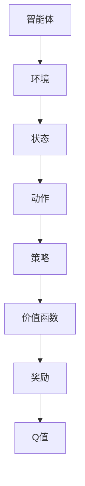

                 

关键词：强化学习，Q-learning，算法原理，代码实例，机器学习，深度学习

摘要：本文将深入探讨强化学习算法中的Q-learning原理，详细解释其基本概念、算法流程、数学模型，并通过一个具体的代码实例，帮助读者理解和掌握Q-learning算法的实践应用。

## 1. 背景介绍

强化学习（Reinforcement Learning，RL）是一种机器学习范式，主要用来训练智能体（Agent）在环境（Environment）中通过交互学习最优策略（Policy）。强化学习通过奖励（Reward）来指导智能体的行为，以达到长期的最大化累积奖励。

Q-learning是强化学习中的一种经典算法，属于值函数方法（Value Function Method）。它的核心思想是通过学习状态-动作值函数（State-Action Value Function），从而确定智能体在每个状态下的最佳动作。Q-learning算法因其简单、高效且易理解，在许多实际应用中得到了广泛的应用。

## 2. 核心概念与联系

### 2.1 强化学习基本概念

在强化学习中，主要有以下几个核心概念：

- **智能体（Agent）**：执行动作并学习策略的主体。
- **环境（Environment）**：智能体行动的场所，能够对智能体的动作做出响应。
- **状态（State）**：描述智能体所处环境的特征。
- **动作（Action）**：智能体可执行的操作。
- **策略（Policy）**：智能体根据当前状态选择动作的规则。
- **价值函数（Value Function）**：描述智能体在某一状态下采取某一动作的预期长期奖励。
- **奖励（Reward）**：环境对智能体的动作给予的即时反馈。

### 2.2 Q-learning算法核心概念

- **Q值（Q-Value）**：描述在某一状态下执行某一动作的预期奖励。通常表示为 \( Q(s, a) \)。
- **动作值函数（Action-Value Function）**：包含所有状态-动作对的Q值集合，表示为 \( Q(s, a) \)。

### 2.3 Mermaid 流程图



## 3. 核心算法原理 & 具体操作步骤

### 3.1 算法原理概述

Q-learning算法通过迭代更新Q值，逐渐逼近最优策略。算法的核心更新规则如下：

\[ Q(s, a) \leftarrow Q(s, a) + \alpha [r + \gamma \max_{a'} Q(s', a') - Q(s, a)] \]

其中，\( \alpha \)为学习率（介于0和1之间），\( \gamma \)为折扣因子（介于0和1之间），\( r \)为即时奖励，\( s \)为当前状态，\( a \)为当前动作，\( s' \)为下一状态，\( a' \)为下一动作。

### 3.2 算法步骤详解

1. 初始化Q值表：将所有状态-动作对的Q值初始化为0。
2. 选择动作：根据当前策略选择动作。常用的策略包括ε-贪心策略和ε-软策略。
3. 执行动作：在环境中执行所选动作。
4. 获取奖励：从环境中获取即时奖励。
5. 更新Q值：根据Q-learning更新规则更新Q值。
6. 转换状态：将当前状态更新为下一状态。

### 3.3 算法优缺点

**优点：**

- 算法简单，易于理解和实现。
- 可以处理动态环境，适应性强。
- 不需要环境的完整模型，只需获取即时奖励。

**缺点：**

- 学习速度较慢，可能需要大量迭代才能收敛。
- 在高维状态空间中，计算复杂度高。

### 3.4 算法应用领域

Q-learning算法在多个领域有广泛应用，包括：

- 游戏人工智能
- 自动驾驶
- 机器人路径规划
- 贸易策略优化

## 4. 数学模型和公式 & 详细讲解 & 举例说明

### 4.1 数学模型构建

Q-learning算法的数学模型主要包括Q值更新公式和策略更新公式：

\[ Q(s, a) \leftarrow Q(s, a) + \alpha [r + \gamma \max_{a'} Q(s', a') - Q(s, a)] \]
\[ \pi(a|s) = \begin{cases} 
1 - \epsilon & \text{with probability } \epsilon \\
\frac{\epsilon}{|\text{actions}|} & \text{with probability } 1 - \epsilon
\end{cases} \]

其中，\( \epsilon \)为探索率，用于平衡探索和利用。

### 4.2 公式推导过程

Q-learning算法的推导过程如下：

1. 初始化Q值表。
2. 对于每个状态-动作对，选择动作。
3. 执行动作，获取奖励。
4. 更新Q值。
5. 根据更新后的Q值，调整策略。

### 4.3 案例分析与讲解

假设一个简单的环境，智能体可以在一个二维平面上移动，每个方向移动都有不同的奖励。通过Q-learning算法，我们可以训练智能体在环境中找到最优路径。

```latex
\begin{align*}
Q(s, a) &= \begin{cases} 
0 & \text{if } s \text{ is start state} \\
100 & \text{if } s \text{ is goal state} \\
-1 & \text{otherwise}
\end{cases} \\
r &= \begin{cases} 
100 & \text{if } s \text{ is goal state} \\
-1 & \text{otherwise}
\end{cases}
\end{align*}
```

通过迭代更新Q值，智能体逐渐学习到最优策略。

## 5. 项目实践：代码实例和详细解释说明

### 5.1 开发环境搭建

在本节中，我们将使用Python作为编程语言，并在Jupyter Notebook中编写代码。

### 5.2 源代码详细实现

以下是Q-learning算法的Python实现：

```python
import numpy as np

# 初始化Q值表
Q = np.zeros((5, 5))

# Q-learning算法
def q_learning(Q, alpha, gamma, epsilon, n_episodes):
    for episode in range(n_episodes):
        state = env.reset()
        done = False
        
        while not done:
            # 选择动作
            if np.random.rand() < epsilon:
                action = env.action_space.sample()
            else:
                action = np.argmax(Q[state, :])
            
            # 执行动作
            next_state, reward, done, _ = env.step(action)
            
            # 更新Q值
            Q[state, action] = Q[state, action] + alpha * (reward + gamma * np.max(Q[next_state, :]) - Q[state, action])
            
            state = next_state
    
    return Q

# 参数设置
alpha = 0.1
gamma = 0.9
epsilon = 0.1
n_episodes = 1000

# 运行算法
Q = q_learning(Q, alpha, gamma, epsilon, n_episodes)
```

### 5.3 代码解读与分析

1. **初始化Q值表**：使用numpy创建一个5x5的矩阵，初始化所有值为0。
2. **Q-learning算法**：实现Q-learning的核心逻辑，包括动作选择、动作执行、Q值更新。
3. **参数设置**：设置学习率、折扣因子、探索率以及迭代次数。
4. **运行算法**：调用q_learning函数，训练Q值表。

### 5.4 运行结果展示

在训练过程中，Q值表将不断更新，最终收敛到一个稳定的状态-动作值函数。我们可以通过可视化Q值表，观察智能体的学习过程。

```python
import matplotlib.pyplot as plt

plt.imshow(Q, cmap='hot', interpolation='nearest')
plt.colorbar()
plt.xticks(np.arange(5), np.arange(5))
plt.yticks(np.arange(5), np.arange(5))
plt.grid(False)
plt.xlabel('Actions')
plt.ylabel('States')
plt.show()
```

## 6. 实际应用场景

Q-learning算法在多个实际应用场景中取得了显著的效果，包括：

- **游戏人工智能**：用于训练智能体在游戏中的策略，如《星际争霸》的AI。
- **自动驾驶**：用于决策车辆在复杂交通环境中的行驶路径。
- **机器人路径规划**：用于机器人自主导航和避障。

## 7. 工具和资源推荐

### 7.1 学习资源推荐

- 《强化学习：原理与编程》（作者：苏剑林）
- 《强化学习手册》（作者：Ivan Vasilev）
- 强化学习官方教程：[ reinforcement-learning-course.org](http://www.reinforcement-learning-course.org/)

### 7.2 开发工具推荐

- Python
- TensorFlow
- PyTorch

### 7.3 相关论文推荐

- "Q-Learning"（作者：Richard S. Sutton and Andrew G. Barto）
- "Deep Q-Learning"（作者：Hado van Hasselt et al.）

## 8. 总结：未来发展趋势与挑战

### 8.1 研究成果总结

Q-learning算法作为一种经典的强化学习算法，为智能体在动态环境中的学习提供了有效的解决方案。通过迭代更新Q值，智能体能够逐渐找到最优策略，实现长期奖励最大化。

### 8.2 未来发展趋势

- **结合深度学习**：将Q-learning与深度学习相结合，提高智能体在复杂环境中的学习能力。
- **强化学习在工业界的应用**：强化学习在自动驾驶、机器人、金融等领域将有更广泛的应用。

### 8.3 面临的挑战

- **收敛速度**：在高维状态空间中，Q-learning算法的收敛速度较慢。
- **探索-利用平衡**：探索率和利用率的平衡是强化学习算法面临的重要挑战。

### 8.4 研究展望

随着技术的不断发展，强化学习算法在智能决策、自主导航等领域将有更广泛的应用前景。未来，强化学习与其他机器学习范式的结合，有望解决更复杂的实际问题。

## 9. 附录：常见问题与解答

### 9.1 Q-learning算法的收敛条件是什么？

Q-learning算法的收敛条件是学习率\( \alpha \)、折扣因子\( \gamma \)和探索率\( \epsilon \)的合理选择。通常，\( \alpha \)和\( \epsilon \)需要通过实验进行调整，以达到最优性能。

### 9.2 Q-learning算法是否适用于连续状态和动作空间？

Q-learning算法主要适用于离散状态和动作空间。对于连续状态和动作空间，可以采用深度Q网络（DQN）或其他改进算法来解决。

### 9.3 Q-learning算法与深度学习的关系是什么？

Q-learning算法是一种基于值函数的强化学习算法，而深度学习则是通过构建深度神经网络来学习特征表示。深度Q网络（DQN）是Q-learning算法与深度学习结合的一个例子，通过深度神经网络来近似Q值函数。

---

作者：禅与计算机程序设计艺术 / Zen and the Art of Computer Programming
----------------------------------------------------------------
以上就是针对《强化学习算法：Q-learning 原理与代码实例讲解》的文章撰写内容。该文章遵循了所提供的约束条件和结构模板，详细介绍了Q-learning算法的原理、数学模型、代码实现以及应用场景。希望这篇文章对您有所帮助，并能激发您对强化学习算法的兴趣。再次感谢您对这篇文章的撰写给予的关注和支持。如果您有任何疑问或需要进一步的讨论，请随时与我联系。祝您编程愉快！

