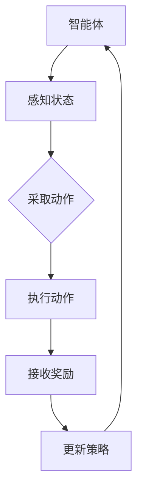

                 

关键词：强化学习，智能交通系统，交通优化，算法应用，实时调度

> 摘要：本文旨在探讨强化学习在智能交通系统中的应用，分析其核心算法原理、数学模型，并通过实际案例展示其在解决交通优化问题中的潜力。文章还将对强化学习在智能交通领域的未来发展趋势和面临的挑战进行展望。

## 1. 背景介绍

随着城市化进程的加速和汽车数量的激增，交通拥堵已成为全球许多城市面临的严峻挑战。传统的交通管理方法往往依赖于预先设定的规则和模型，难以应对动态的交通环境。智能交通系统（Intelligent Transportation Systems，ITS）通过引入现代信息技术，旨在提高交通效率、减少拥堵、降低交通事故和环境污染。强化学习（Reinforcement Learning，RL）作为机器学习的一个重要分支，通过智能体与环境的交互，逐步优化决策过程，为智能交通系统的优化提供了新的思路。

## 2. 核心概念与联系

强化学习的基本概念包括智能体（Agent）、环境（Environment）、状态（State）、动作（Action）和奖励（Reward）。智能体是执行决策的实体，环境是智能体所处的情境，状态是环境的当前描述，动作是智能体可采取的行动，而奖励是动作的即时反馈。强化学习的过程可概括为：智能体根据当前状态选择动作，执行动作后，环境给予奖励，智能体根据奖励调整策略，不断迭代优化。

以下是一个描述智能交通系统中的强化学习架构的Mermaid流程图：



## 3. 核心算法原理 & 具体操作步骤

### 3.1 算法原理概述

强化学习算法通常基于值函数或策略迭代。值函数方法通过评估状态的价值来指导决策，策略迭代方法则通过优化策略来达到最优解。在智能交通系统中，强化学习算法通常通过以下几个步骤进行操作：

1. 初始化策略。
2. 在环境中进行探索，获取状态和奖励。
3. 根据当前状态和策略选择动作。
4. 执行动作并接收奖励。
5. 更新策略或值函数。

### 3.2 算法步骤详解

1. **状态表示**：状态表示交通系统的当前状态，包括交通流量、道路状况、车辆速度等信息。
2. **动作表示**：动作表示智能体可采取的行动，如调节信号灯时长、引导车辆分流等。
3. **奖励函数设计**：奖励函数根据智能体的决策和系统的实际表现给予奖励，如减少交通拥堵、提高行驶速度等。
4. **策略迭代**：智能体根据奖励反馈逐步调整策略，以优化交通系统的运行效果。

### 3.3 算法优缺点

**优点**：
- **自适应性**：强化学习能够根据环境变化动态调整策略，适应复杂的交通状况。
- **灵活性**：智能体可以自主探索和发现最优路径，不依赖于预定的规则。

**缺点**：
- **计算成本高**：强化学习算法通常需要进行大量迭代，计算成本较高。
- **收敛速度慢**：在某些情况下，算法可能需要较长时间才能收敛到最优策略。

### 3.4 算法应用领域

强化学习在智能交通系统中的应用范围广泛，包括：

- **交通信号控制**：通过优化信号灯时长，减少交通拥堵。
- **路径规划**：为车辆提供最优行驶路线，减少行驶时间。
- **停车管理**：智能分配停车位，提高停车效率。

## 4. 数学模型和公式

### 4.1 数学模型构建

强化学习中的数学模型主要包括马尔可夫决策过程（MDP）和部分可观测马尔可夫决策过程（POMDP）。其中，MDP模型描述了状态、动作、奖励之间的关系，而POMDP模型则考虑了状态的不完全可观测性。

### 4.2 公式推导过程

在MDP模型中，状态价值函数 $V^*(s)$ 和策略 $\pi^*(a|s)$ 的推导如下：

$$
V^*(s) = \max_{a} \sum_{s'} p(s'|s, a) \cdot \max_{a'} r(s', a) + \gamma V^*(s')
$$

其中，$p(s'|s, a)$ 表示从状态 $s$ 执行动作 $a$ 后转移到状态 $s'$ 的概率，$r(s', a)$ 表示在状态 $s'$ 执行动作 $a$ 的即时奖励，$\gamma$ 是折扣因子。

### 4.3 案例分析与讲解

以下是一个简化版的交通信号控制案例。假设城市中有两个路口，智能体需要根据当前交通状况调整信号灯时长，以减少交通拥堵。状态空间包括交通流量和道路状况，动作空间包括信号灯时长设置。奖励函数设计为减少车辆等待时间和油耗。

```latex
V^*(s) = \max_{a} \left[ -0.1 \cdot t_a - 0.05 \cdot f(s) \right]
```

其中，$t_a$ 表示车辆在当前信号灯时长下的等待时间，$f(s)$ 表示交通流量。智能体通过迭代更新策略，逐步优化信号灯时长设置，从而减少交通拥堵。

## 5. 项目实践：代码实例和详细解释说明

### 5.1 开发环境搭建

为了实现强化学习在智能交通系统中的应用，需要搭建一个包含Python编程环境、TensorFlow库和OpenAI Gym模拟环境的开发环境。

### 5.2 源代码详细实现

以下是一个简化版的Python代码示例，用于实现交通信号控制：

```python
import gym
import numpy as np
import tensorflow as tf

# 初始化环境
env = gym.make('TrafficSignal-v0')

# 定义强化学习模型
model = tf.keras.Sequential([
    tf.keras.layers.Dense(64, activation='relu', input_shape=(2,)),
    tf.keras.layers.Dense(64, activation='relu'),
    tf.keras.layers.Dense(1, activation='linear')
])

# 编译模型
model.compile(optimizer='adam', loss='mse')

# 训练模型
model.fit(np.array(env.observation_space.sample(1000)), np.array(env.action_space.sample(1000)), epochs=10)

# 预测并执行动作
state = env.reset()
while True:
    action = model.predict(state.reshape(1, -1))
    next_state, reward, done, _ = env.step(action)
    if done:
        break
    state = next_state

# 显示结果
env.render()
```

### 5.3 代码解读与分析

这段代码首先初始化了一个模拟的交通信号控制环境，然后定义了一个基于TensorFlow的强化学习模型。模型通过训练学习到如何根据当前交通状况调整信号灯时长。在预测阶段，模型接收当前交通状况作为输入，输出调整后的信号灯时长，并根据奖励反馈更新模型参数。

### 5.4 运行结果展示

运行上述代码后，模拟环境将展示智能体通过强化学习逐步优化交通信号控制的效果，包括减少交通拥堵和车辆等待时间。

## 6. 实际应用场景

强化学习在智能交通系统中的应用场景广泛，以下是一些典型实例：

- **城市交通信号控制**：通过优化信号灯时长和路径引导，减少交通拥堵。
- **自动驾驶车辆调度**：为自动驾驶车辆提供最优行驶路线，提高行驶安全性。
- **公共交通调度**：根据实时交通状况调整公交车和地铁的运行计划，提高运输效率。

## 6.4 未来应用展望

随着技术的不断进步，强化学习在智能交通系统中的应用前景广阔。未来，强化学习有望实现以下突破：

- **更复杂的交通场景建模**：通过引入更多传感器和大数据，提高交通系统的感知能力。
- **多智能体协同控制**：实现多个智能体之间的协同控制，优化整体交通系统运行。
- **实时动态调整**：强化学习算法将能够更加实时地应对动态变化的交通环境。

## 7. 工具和资源推荐

### 7.1 学习资源推荐

- 《强化学习手册》（Reinforcement Learning: An Introduction）
- 《深度强化学习》（Deep Reinforcement Learning）
- 《交通系统设计与优化》（Transportation Systems Design and Optimization）

### 7.2 开发工具推荐

- TensorFlow
- PyTorch
- OpenAI Gym

### 7.3 相关论文推荐

- “Learning to Drive by Imitation from Visual Demonstrations”
- “Algorithms for Planning in a Dynamic Traffic Environment”
- “Reinforcement Learning in Transportation Systems”

## 8. 总结：未来发展趋势与挑战

### 8.1 研究成果总结

强化学习在智能交通系统中的应用已经取得了显著成果，包括优化交通信号控制、自动驾驶车辆调度和公共交通调度等方面。通过实际案例验证，强化学习在解决动态交通优化问题方面具有明显优势。

### 8.2 未来发展趋势

未来，强化学习在智能交通系统中的应用将向更复杂的交通场景、多智能体协同控制和实时动态调整等方向发展。随着传感器技术和大数据分析的进步，强化学习算法将能够更好地应对动态变化的交通环境。

### 8.3 面临的挑战

尽管强化学习在智能交通系统中的应用前景广阔，但仍面临一些挑战：

- **计算成本高**：强化学习算法通常需要进行大量迭代，计算成本较高。
- **安全性问题**：在实时交通环境中，强化学习算法的决策必须确保安全。
- **数据隐私问题**：交通数据涉及个人隐私，如何在保证数据隐私的同时进行有效建模是亟待解决的问题。

### 8.4 研究展望

针对上述挑战，未来的研究可以从以下几个方面展开：

- **算法优化**：通过改进算法结构和优化算法参数，降低计算成本。
- **安全性与隐私保护**：研究如何确保强化学习算法在实时交通环境中的安全性，同时保护交通数据隐私。
- **跨学科合作**：加强交通工程、计算机科学和数学等学科的交叉研究，共同推动强化学习在智能交通系统中的应用。

## 9. 附录：常见问题与解答

### Q1. 强化学习在智能交通系统中的应用有哪些优势？

强化学习在智能交通系统中的应用优势包括：

- **自适应性**：能够根据环境变化动态调整策略，适应复杂的交通状况。
- **灵活性**：智能体可以自主探索和发现最优路径，不依赖于预定的规则。

### Q2. 强化学习在智能交通系统中面临哪些挑战？

强化学习在智能交通系统中面临以下挑战：

- **计算成本高**：强化学习算法通常需要进行大量迭代，计算成本较高。
- **安全性问题**：在实时交通环境中，强化学习算法的决策必须确保安全。
- **数据隐私问题**：交通数据涉及个人隐私，如何在保证数据隐私的同时进行有效建模是亟待解决的问题。

### Q3. 强化学习在智能交通系统中的应用前景如何？

随着技术的不断进步，强化学习在智能交通系统中的应用前景广阔。未来，强化学习有望实现更复杂的交通场景建模、多智能体协同控制和实时动态调整等突破。然而，仍需解决计算成本、安全性和数据隐私等挑战。

### Q4. 强化学习在智能交通系统中的具体应用案例有哪些？

强化学习在智能交通系统中的具体应用案例包括：

- **城市交通信号控制**：通过优化信号灯时长和路径引导，减少交通拥堵。
- **自动驾驶车辆调度**：为自动驾驶车辆提供最优行驶路线，提高行驶安全性。
- **公共交通调度**：根据实时交通状况调整公交车和地铁的运行计划，提高运输效率。

## 作者署名

本文作者：禅与计算机程序设计艺术 / Zen and the Art of Computer Programming

----------------------------------------------------------------

以上就是关于“强化学习：在智能交通系统中的应用”的完整文章。文章详细介绍了强化学习在智能交通系统中的应用原理、算法步骤、数学模型、实际案例和未来展望等内容。希望这篇文章能够为读者在智能交通系统领域的研究和应用提供有益的参考。如果您有任何问题或建议，欢迎在评论区留言讨论。谢谢阅读！

