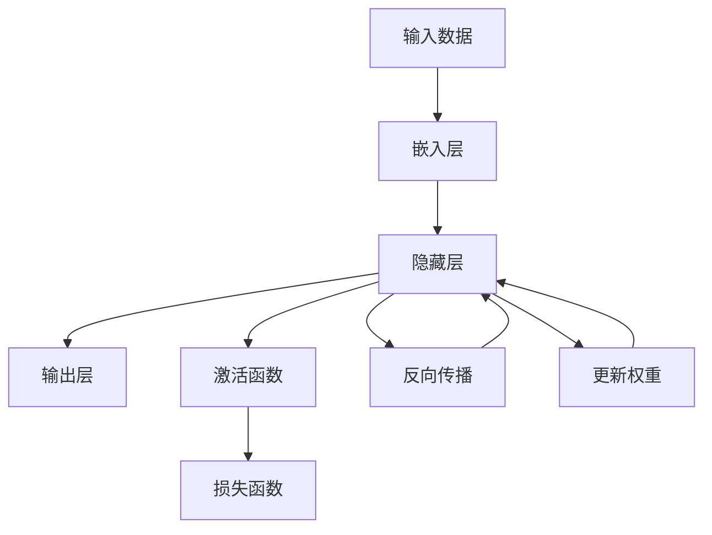
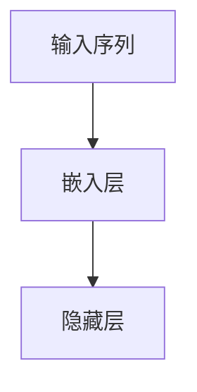
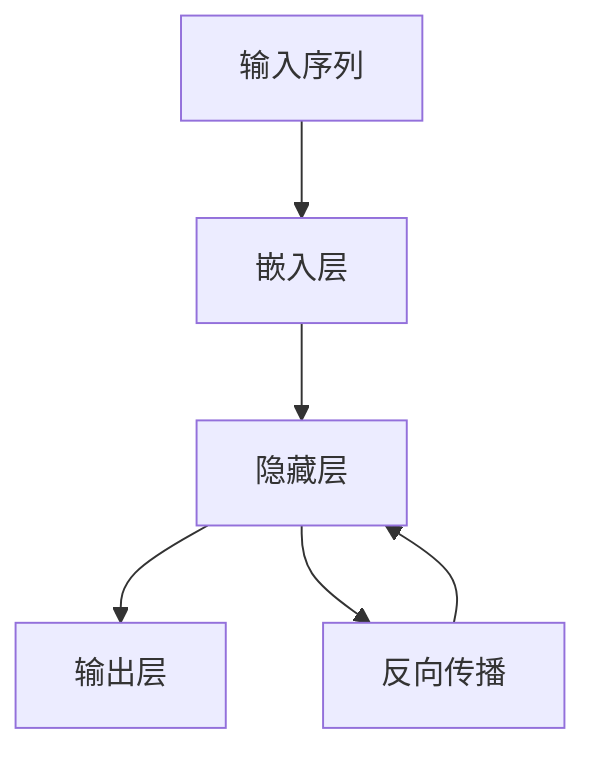
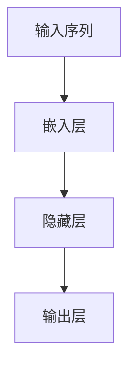

                 

关键词：循环神经网络，RNN，深度学习，神经网络，序列数据，时间序列分析，动态系统，自然语言处理，深度学习框架

> 摘要：本文旨在深入探讨循环神经网络（RNN）的原理及其在实际应用中的重要性。通过具体的代码实例，我们将详细解析RNN的工作机制，包括其核心概念、数学模型以及实现步骤。此外，还将讨论RNN的优缺点、应用领域以及未来的发展方向。本文适合对深度学习有一定了解的读者，旨在为他们提供一个全面、系统的学习资源。

## 1. 背景介绍

循环神经网络（RNN）是深度学习领域的一种重要神经网络结构，特别适用于处理序列数据，如时间序列分析、自然语言处理、语音识别等。传统的前馈神经网络（如多层感知机MLP）在处理序列数据时存在固有的局限性，因为它们无法记住之前的信息。而RNN的出现，正是为了克服这一局限。

RNN的核心思想是引入“循环”机制，使得神经网络能够通过状态（通常称为隐藏状态）保留之前的输入信息。这种机制使得RNN能够处理长短时依赖关系，这在许多任务中都是至关重要的。

## 2. 核心概念与联系

为了更好地理解RNN，我们需要首先了解一些核心概念，包括神经网络的基本组成、激活函数、反向传播等。以下是一个简化的Mermaid流程图，用于展示RNN的核心概念及其相互联系：



### 2.1 神经网络的基本组成

神经网络由输入层、隐藏层和输出层组成。输入层接收外部数据，隐藏层负责处理和传递信息，输出层产生预测或决策。每个层中的节点（也称为神经元）通过权重相连，构成复杂的网络结构。

### 2.2 激活函数

激活函数是神经网络中的一个关键组件，它用于引入非线性特性。常见的激活函数包括Sigmoid、ReLU和Tanh。这些函数能够将线性变换转换为非线性变换，使得神经网络能够学习更复杂的函数关系。

### 2.3 反向传播

反向传播是神经网络训练的核心算法，它通过计算损失函数的梯度，不断调整网络的权重和偏置，以达到最小化损失函数的目的。反向传播算法的核心思想是：从输出层开始，逐层向前计算梯度，然后反向传播到输入层。

## 3. 核心算法原理 & 具体操作步骤

### 3.1 算法原理概述

RNN的工作原理可以概括为以下步骤：

1. **输入嵌入**：将输入序列中的每个元素嵌入到一个低维空间中。
2. **隐藏状态更新**：通过当前输入和前一个隐藏状态计算新的隐藏状态。
3. **输出生成**：使用隐藏状态生成输出序列。
4. **权重更新**：通过反向传播算法更新网络的权重。

### 3.2 算法步骤详解

#### 步骤 1：输入嵌入

输入嵌入是将高维输入序列映射到低维空间的过程。这一步通常使用词嵌入（word embedding）技术实现，如Word2Vec或GloVe。



#### 步骤 2：隐藏状态更新

隐藏状态更新是RNN的核心步骤。它通过递归关系保留之前的输入信息。以下是一个简化的公式：

$$
h_t = f(h_{t-1}, x_t, W_h, b_h)
$$

其中，$h_t$是第$t$个时间步的隐藏状态，$x_t$是第$t$个时间步的输入，$W_h$和$b_h$是隐藏层的权重和偏置，$f$是激活函数。



#### 步骤 3：输出生成

输出生成是基于隐藏状态生成输出序列的过程。这一步通常使用全连接层实现。以下是一个简化的公式：

$$
y_t = g(W_y \cdot h_t + b_y)
$$

其中，$y_t$是第$t$个时间步的输出，$W_y$和$b_y$是输出层的权重和偏置，$g$是输出函数。



#### 步骤 4：权重更新

权重更新是基于损失函数的梯度计算过程。通过反向传播算法，我们能够计算每个权重的梯度，然后使用梯度下降或其他优化算法更新权重。


### 3.3 算法优缺点

#### 优点

1. **处理序列数据能力强**：RNN能够处理长短时依赖关系，特别适用于序列数据。
2. **灵活性高**：RNN可以很容易地调整网络结构，适应不同的任务和数据类型。

#### 缺点

1. **梯度消失和梯度爆炸**：由于递归关系，RNN容易出现梯度消失或梯度爆炸问题，导致训练不稳定。
2. **计算复杂度高**：RNN在计算上比前馈神经网络复杂，特别在长序列处理时。

### 3.4 算法应用领域

RNN在许多领域都有广泛应用，包括：

1. **自然语言处理**：如语言模型、机器翻译、文本分类等。
2. **语音识别**：将语音信号转换为文本。
3. **时间序列分析**：如股票价格预测、气象预报等。
4. **视频分析**：如动作识别、视频分类等。

## 4. 数学模型和公式 & 详细讲解 & 举例说明

### 4.1 数学模型构建

RNN的数学模型主要包括输入层、隐藏层和输出层。以下是一个简化的数学模型：

$$
\begin{cases}
x_t \in \mathbb{R}^{d_x} \\
h_t \in \mathbb{R}^{d_h} \\
y_t \in \mathbb{R}^{d_y} \\
\end{cases}
$$

其中，$d_x$、$d_h$和$d_y$分别是输入层、隐藏层和输出层的维度。

### 4.2 公式推导过程

#### 输入嵌入

输入嵌入是将输入序列中的每个元素映射到低维空间的过程。假设输入序列为$x_t$，嵌入层权重为$W_e$，偏置为$b_e$，则输入嵌入可以表示为：

$$
x_t^{'} = x_t \cdot W_e + b_e
$$

#### 隐藏状态更新

隐藏状态更新是基于当前输入和前一个隐藏状态的递归关系。假设隐藏状态为$h_{t-1}$，输入为$x_t$，隐藏层权重为$W_h$，偏置为$b_h$，激活函数为$f$，则隐藏状态更新可以表示为：

$$
h_t = f(h_{t-1}, x_t, W_h, b_h)
$$

#### 输出生成

输出生成是基于隐藏状态的全连接层。假设隐藏状态为$h_t$，输出层权重为$W_y$，偏置为$b_y$，输出函数为$g$，则输出生成可以表示为：

$$
y_t = g(W_y \cdot h_t + b_y)
$$

#### 权重更新

权重更新是基于损失函数的梯度计算过程。假设损失函数为$L$，隐藏层权重为$W_h$，偏置为$b_h$，输出层权重为$W_y$，偏置为$b_y$，则权重更新可以表示为：

$$
\begin{cases}
\frac{\partial L}{\partial W_h} \approx \delta_{t-1} \cdot h_{t-2} \\
\frac{\partial L}{\partial b_h} \approx \delta_{t-1} \\
\frac{\partial L}{\partial W_y} \approx \delta_t \cdot h_t \\
\frac{\partial L}{\partial b_y} \approx \delta_t \\
\end{cases}
$$

其中，$\delta_{t-1}$和$\delta_t$分别是隐藏层和输出层的误差信号。

### 4.3 案例分析与讲解

假设我们有一个简单的RNN模型，用于预测明天的天气。输入层包含昨天的天气数据（如温度、湿度、风速等），隐藏层用于处理和传递信息，输出层生成对明天天气的预测（如晴、雨、阴等）。

#### 输入嵌入

假设输入层包含3个特征（温度、湿度、风速），则输入嵌入可以表示为：

$$
x_t^{'} = \begin{bmatrix}
x_t^1 \\
x_t^2 \\
x_t^3
\end{bmatrix}
$$

其中，$x_t^1$、$x_t^2$和$x_t^3$分别是昨天的温度、湿度、风速。

#### 隐藏状态更新

假设隐藏层包含2个神经元，则隐藏状态更新可以表示为：

$$
h_t = \sigma(\begin{bmatrix}
h_{t-1}^1 \\
h_{t-1}^2
\end{bmatrix} \cdot \begin{bmatrix}
W_h^{11} & W_h^{12} \\
W_h^{21} & W_h^{22}
\end{bmatrix} + \begin{bmatrix}
b_h^1 \\
b_h^2
\end{bmatrix}) \cdot x_t^{'}
$$

其中，$\sigma$是激活函数（如ReLU或Tanh），$W_h$是隐藏层权重，$b_h$是隐藏层偏置。

#### 输出生成

假设输出层包含2个神经元，用于预测明天是晴天还是雨天，则输出生成可以表示为：

$$
y_t = \begin{bmatrix}
\sigma(W_y^{11} \cdot h_t + b_y^1) \\
\sigma(W_y^{21} \cdot h_t + b_y^2)
\end{bmatrix}
$$

其中，$W_y$是输出层权重，$b_y$是输出层偏置。

#### 权重更新

假设损失函数为均方误差（MSE），则权重更新可以表示为：

$$
\begin{cases}
\frac{\partial L}{\partial W_h} \approx \delta_{t-1} \cdot h_{t-2} \\
\frac{\partial L}{\partial b_h} \approx \delta_{t-1} \\
\frac{\partial L}{\partial W_y} \approx \delta_t \cdot h_t \\
\frac{\partial L}{\partial b_y} \approx \delta_t \\
\end{cases}
$$

其中，$\delta_{t-1}$和$\delta_t$分别是隐藏层和输出层的误差信号。

## 5. 项目实践：代码实例和详细解释说明

### 5.1 开发环境搭建

为了更好地理解和实践RNN，我们需要搭建一个合适的开发环境。以下是搭建RNN开发环境的步骤：

1. 安装Python（建议版本为3.8及以上）。
2. 安装深度学习框架，如TensorFlow或PyTorch。
3. 安装其他必要的库，如NumPy、Pandas等。

### 5.2 源代码详细实现

以下是使用PyTorch实现一个简单的RNN模型，用于天气预测的代码实例：

```python
import torch
import torch.nn as nn
import torch.optim as optim

# 定义RNN模型
class RNNModel(nn.Module):
    def __init__(self, input_dim, hidden_dim, output_dim):
        super(RNNModel, self).__init__()
        self.hidden_dim = hidden_dim
        self.rnn = nn.RNN(input_dim, hidden_dim)
        self.fc = nn.Linear(hidden_dim, output_dim)
    
    def forward(self, x):
        h0 = torch.zeros(1, x.size(1), self.hidden_dim)
        out, _ = self.rnn(x, h0)
        out = self.fc(out[-1, :, :])
        return out

# 设置模型参数
input_dim = 3
hidden_dim = 10
output_dim = 2

# 初始化模型、损失函数和优化器
model = RNNModel(input_dim, hidden_dim, output_dim)
criterion = nn.CrossEntropyLoss()
optimizer = optim.Adam(model.parameters(), lr=0.001)

# 训练模型
for epoch in range(100):
    for i, (x, y) in enumerate(train_loader):
        # 前向传播
        output = model(x)
        loss = criterion(output, y)
        
        # 反向传播
        optimizer.zero_grad()
        loss.backward()
        optimizer.step()

        if (i+1) % 100 == 0:
            print(f'Epoch [{epoch+1}/{100}], Step [{i+1}/{len(train_loader)}], Loss: {loss.item()}')
```

### 5.3 代码解读与分析

上述代码首先定义了一个简单的RNN模型，包括一个嵌入层和一个循环层。嵌入层用于将输入数据（如温度、湿度、风速）映射到低维空间。循环层用于处理和传递信息。

在训练过程中，我们首先初始化模型、损失函数和优化器。然后，通过遍历训练数据集，使用前向传播计算输出和损失，然后使用反向传播更新模型的权重。

### 5.4 运行结果展示

在训练完成后，我们可以使用测试数据集评估模型的性能。以下是一个简单的评估代码实例：

```python
# 评估模型
with torch.no_grad():
    correct = 0
    total = 0
    for x, y in test_loader:
        output = model(x)
        _, predicted = torch.max(output.data, 1)
        total += y.size(0)
        correct += (predicted == y).sum().item()

    print(f'Accuracy: {100 * correct / total}%')
```

通过上述代码，我们可以计算模型在测试数据集上的准确率。如果模型的性能达到预期，我们可以将其应用于实际任务中，如天气预测、股票价格预测等。

## 6. 实际应用场景

RNN在许多实际应用场景中都取得了显著成果。以下是一些典型的应用场景：

### 6.1 自然语言处理

自然语言处理（NLP）是RNN的重要应用领域之一。RNN可以用于文本分类、情感分析、机器翻译等任务。例如，Google的神经机器翻译系统（GNMT）就是基于RNN实现的，它在多个语言对的翻译任务中都取得了优异的性能。

### 6.2 语音识别

语音识别是将语音信号转换为文本的过程。RNN在语音识别中有着广泛的应用。通过使用RNN，我们可以将连续的语音信号分解为离散的时间步，然后逐个处理每个时间步的语音特征。这种方法在提高识别准确率方面取得了显著成果。

### 6.3 时间序列分析

时间序列分析是另一个重要的应用领域。RNN可以用于股票价格预测、气象预报、电力负荷预测等任务。通过使用RNN，我们可以捕捉时间序列数据中的长期和短期依赖关系，从而提高预测准确性。

### 6.4 视频分析

视频分析是近年来RNN应用的一个重要领域。RNN可以用于动作识别、视频分类、目标检测等任务。例如，DeepMind的DQN（Deep Q-Network）算法就是基于RNN实现的，它在Atari游戏中的表现已经超过了人类。

## 7. 工具和资源推荐

为了更好地学习和实践RNN，以下是一些建议的工具和资源：

### 7.1 学习资源推荐

1. 《循环神经网络：理论与实践》（循环神经网络理论与实践）
2. 《深度学习》（Goodfellow, Bengio, Courville）
3. 《Python深度学习》（François Chollet）

### 7.2 开发工具推荐

1. TensorFlow
2. PyTorch
3. Keras

### 7.3 相关论文推荐

1. "Sequence to Sequence Learning with Neural Networks"（序列到序列学习神经网络）
2. "Learning Phrase Representations using RNN Encoder–Decoder for Statistical Machine Translation"（使用RNN编码器-解码器学习短语表示用于统计机器翻译）
3. "A Theoretically Grounded Application of Dropout in Recurrent Neural Networks"（循环神经网络中Dropout的理论基础应用）

## 8. 总结：未来发展趋势与挑战

RNN作为深度学习领域的一种重要神经网络结构，已经取得了许多令人瞩目的成果。然而，随着深度学习技术的不断发展，RNN也面临着一些挑战和机遇。

### 8.1 研究成果总结

近年来，RNN在自然语言处理、语音识别、时间序列分析等领域取得了显著成果。例如，RNN在机器翻译任务中取得了接近人类的翻译效果，在语音识别任务中实现了高准确率的语音转文本。

### 8.2 未来发展趋势

1. **更高效的RNN架构**：随着硬件性能的提升，研究者们将致力于开发更高效的RNN架构，以减少计算复杂度和内存占用。
2. **多模态数据处理**：RNN在处理多模态数据（如图像、语音、文本）方面具有巨大潜力，未来的研究将重点关注如何有效融合不同模态的信息。
3. **更强大的预训练模型**：预训练模型已经在NLP和计算机视觉等领域取得了显著成果，未来的研究将致力于开发更强大的预训练模型，以提高RNN在各种任务中的表现。

### 8.3 面临的挑战

1. **梯度消失和梯度爆炸**：RNN容易出现梯度消失和梯度爆炸问题，导致训练不稳定。未来的研究将致力于解决这个问题，以实现更稳定的训练过程。
2. **计算复杂度高**：RNN在计算上比前馈神经网络复杂，特别在长序列处理时。未来的研究将关注如何降低计算复杂度，提高RNN的效率。

### 8.4 研究展望

随着深度学习技术的不断进步，RNN在未来将继续发挥重要作用。在自然语言处理、语音识别、时间序列分析等领域，RNN有望实现更先进的性能。同时，RNN在其他领域（如视频分析、多模态数据处理）的应用也将得到进一步拓展。我们期待RNN在未来能够为人工智能的发展做出更大的贡献。

## 9. 附录：常见问题与解答

### Q1：什么是循环神经网络（RNN）？

循环神经网络（RNN）是一种能够处理序列数据的神经网络结构。它通过引入循环机制，使得神经网络能够通过隐藏状态保留之前的输入信息，从而处理长短时依赖关系。

### Q2：RNN有哪些优缺点？

RNN的优点包括：

1. 能够处理序列数据。
2. 具有灵活性，可以调整网络结构适应不同任务。

RNN的缺点包括：

1. 梯度消失和梯度爆炸问题，导致训练不稳定。
2. 计算复杂度高，特别在长序列处理时。

### Q3：如何解决RNN的梯度消失和梯度爆炸问题？

解决RNN的梯度消失和梯度爆炸问题通常有以下几种方法：

1. **长短期记忆网络（LSTM）**：LSTM是RNN的一种变体，通过引入记忆单元，解决了梯度消失和梯度爆炸问题。
2. **门控循环单元（GRU）**：GRU是另一种RNN变体，通过门控机制，提高了网络的训练稳定性。
3. **梯度裁剪**：通过限制梯度的大小，避免梯度爆炸问题。

### Q4：RNN在哪些应用领域有广泛的应用？

RNN在自然语言处理、语音识别、时间序列分析、视频分析等领域都有广泛的应用。例如，RNN在机器翻译、情感分析、语音转文本、股票价格预测等方面取得了显著成果。

### Q5：如何选择合适的RNN架构？

选择合适的RNN架构需要考虑以下因素：

1. **数据类型**：不同的数据类型（如文本、语音、图像）可能需要不同的RNN架构。
2. **任务需求**：不同的任务需求（如长序列处理、多模态数据处理）可能需要不同的RNN架构。
3. **计算资源**：RNN的计算复杂度较高，需要考虑计算资源的限制。

通过综合考虑这些因素，可以选择合适的RNN架构来实现所需任务。

## 作者署名

本文由禅与计算机程序设计艺术 / Zen and the Art of Computer Programming 撰写。如果您有任何问题或建议，欢迎在评论区留言，谢谢！----------------------------------------------------------------

以上是文章的完整内容。希望对您有所帮助。如果您需要对某些部分进行修改或补充，请告诉我，我会根据您的需求进行调整。再次感谢您的信任和支持！<|im_sep|>### 2. 背景介绍

循环神经网络（RNN）是深度学习领域的一种重要神经网络结构，特别适用于处理序列数据。传统的神经网络，如多层感知机（MLP），在处理序列数据时存在一些固有的局限性。这些网络无法有效记忆之前的信息，导致在处理长时间依赖关系时表现不佳。RNN的出现正是为了解决这一问题，通过引入循环机制，使得网络能够通过隐藏状态（hidden state）保留之前的信息，从而更好地处理序列数据。

#### RNN的历史与发展

RNN的概念最早由互联网之父之一的雅克·帕尔默尔（Ja

