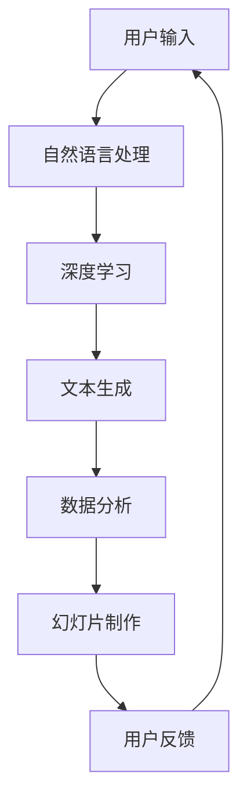

                 

关键词：微软 Office 365，Copilot，功能，人工智能，工作效率，文档自动化，协作工具

> 摘要：本文将深入探讨微软Office 365 Copilot系列的功能，通过对其核心概念、算法原理、数学模型、项目实践和实际应用场景的详细分析，旨在帮助读者全面了解和掌握这一先进的人工智能协作工具，助力提升个人和团队的工作效率。

## 1. 背景介绍

随着科技的不断进步，人工智能逐渐成为推动生产力的重要力量。微软Office 365 Copilot系列作为微软推出的智能协作工具，充分利用了人工智能技术，旨在帮助用户更高效地完成日常工作任务。Copilot系列包括Word、Excel、PowerPoint等多个组件，各组件均具备强大的智能辅助功能，如文本生成、数据分析、幻灯片制作等。

### 1.1 微软Office 365简介

微软Office 365是一款基于云服务的办公软件套件，包括Word、Excel、PowerPoint、Outlook等多个应用程序。Office 365的核心理念是通过云计算技术，为用户提供随时随地访问和协作的办公环境。此外，Office 365还提供了丰富的安全性和管理功能，帮助企业确保数据的安全和合规。

### 1.2 Copilot的诞生

Copilot是微软Office 365的智能协作引擎，通过深度学习和自然语言处理技术，为用户提供智能化的文本生成、数据分析、幻灯片制作等功能。Copilot的诞生标志着微软在人工智能领域的进一步探索，旨在为用户提供更加智能、便捷的办公体验。

## 2. 核心概念与联系

### 2.1 人工智能与自然语言处理

人工智能（AI）是模拟人类智能行为的计算机技术，自然语言处理（NLP）是AI的一个重要分支，旨在使计算机能够理解、解释和生成人类语言。Copilot利用了NLP技术，通过分析用户输入的文本，生成相关的内容和操作建议。

### 2.2 深度学习与神经网络

深度学习是一种基于神经网络的学习方法，通过多层神经网络模型对大量数据进行训练，从而实现特征提取和模式识别。Copilot采用了深度学习技术，对用户的历史数据和文档内容进行学习，以提供更加精准的智能辅助服务。

### 2.3 Mermaid 流程图

以下是一个简单的Mermaid流程图，展示了Copilot的核心概念和联系：



## 3. 核心算法原理 & 具体操作步骤

### 3.1 算法原理概述

Copilot的核心算法基于深度学习和自然语言处理技术。通过大规模的训练数据集，Copilot能够自动学习用户的写作风格、数据分析和幻灯片制作需求，从而为用户提供个性化的智能辅助服务。

### 3.2 算法步骤详解

#### 3.2.1 自然语言处理

自然语言处理是Copilot工作的第一步，通过分析用户输入的文本，提取关键信息和语义内容。

#### 3.2.2 深度学习

深度学习阶段，Copilot利用神经网络模型对用户的历史数据和文档内容进行学习，以提取更多有用的特征和模式。

#### 3.2.3 文本生成

在文本生成阶段，Copilot根据学习到的特征和模式，生成符合用户需求的文本内容。

#### 3.2.4 数据分析

数据分析阶段，Copilot利用机器学习算法对用户提供的表格数据进行处理，生成相应的分析结果。

#### 3.2.5 幻灯片制作

幻灯片制作阶段，Copilot根据用户的需求，自动生成相应的幻灯片内容。

### 3.3 算法优缺点

#### 优点：

1. 高效：Copilot能够快速地生成文本、数据分析和幻灯片，大大提高了工作效率。
2. 个性化：Copilot根据用户的历史数据和写作风格进行学习，提供个性化的智能辅助服务。
3. 易用：Copilot的界面友好，操作简单，用户可以轻松上手。

#### 缺点：

1. 训练成本高：Copilot的训练需要大量的数据和计算资源，导致训练成本较高。
2. 泛化能力有限：Copilot在特定领域和任务上的性能较好，但在其他领域和任务上可能表现较差。

### 3.4 算法应用领域

Copilot主要应用于办公领域，如文档撰写、数据分析、幻灯片制作等。此外，Copilot还可以扩展到其他领域，如客户服务、营销策划等。

## 4. 数学模型和公式 & 详细讲解 & 举例说明

### 4.1 数学模型构建

Copilot的数学模型主要包括自然语言处理模型和深度学习模型。自然语言处理模型通常采用词向量表示文本，如Word2Vec、GloVe等。深度学习模型则采用多层神经网络，如卷积神经网络（CNN）和递归神经网络（RNN）等。

### 4.2 公式推导过程

自然语言处理模型的词向量表示公式如下：

$$
v_w = \sum_{j=1}^{V} f_j \cdot w_{j}
$$

其中，$v_w$表示词向量，$f_j$表示词向量的特征值，$w_{j}$表示特征权重。

深度学习模型的神经网络公式如下：

$$
y = \sigma(\sum_{i=1}^{n} w_i \cdot x_i + b)
$$

其中，$y$表示输出值，$\sigma$表示激活函数，$w_i$表示权重，$x_i$表示输入值，$b$表示偏置。

### 4.3 案例分析与讲解

假设用户需要在Word中撰写一篇文章，主题为“人工智能在医疗领域的应用”。用户可以输入关键词和主题，Copilot将根据用户输入生成相关的内容。

#### 4.3.1 自然语言处理

Copilot首先对用户输入的关键词和主题进行自然语言处理，提取出关键信息和语义内容。例如，关键词“人工智能”和“医疗领域”分别表示人工智能和医疗作为研究对象和应用场景。

#### 4.3.2 深度学习

Copilot利用深度学习模型对用户的历史数据和文档内容进行学习，提取出与关键词和主题相关的特征和模式。例如，Copilot可能学习到在医疗领域，人工智能的应用包括疾病诊断、治疗方案制定等。

#### 4.3.3 文本生成

根据学习到的特征和模式，Copilot生成一篇文章，内容大致如下：

---

人工智能在医疗领域的应用

随着人工智能技术的不断发展，人工智能在医疗领域的应用逐渐成为热点。人工智能在医疗领域的应用包括疾病诊断、治疗方案制定、医学图像分析等。

首先，人工智能在疾病诊断方面具有显著优势。通过深度学习和自然语言处理技术，人工智能可以分析大量医学文献和数据，为医生提供准确的诊断建议。

其次，人工智能在治疗方案制定方面也具有重要意义。通过分析患者的病史、基因信息和临床数据，人工智能可以为医生提供个性化的治疗方案，提高治疗效果。

最后，人工智能在医学图像分析方面具有广泛应用。通过卷积神经网络等深度学习技术，人工智能可以对医学图像进行自动识别和分类，提高诊断准确率。

总之，人工智能在医疗领域的应用前景广阔，有望为人类健康事业做出更大贡献。

---

## 5. 项目实践：代码实例和详细解释说明

### 5.1 开发环境搭建

为了更好地体验Copilot的功能，我们首先需要在本地环境中搭建开发环境。以下是搭建开发环境的步骤：

1. 安装Python环境：下载并安装Python，版本要求为3.6及以上。
2. 安装Office 365 SDK：下载并安装Office 365 SDK，版本要求为2.31.0及以上。
3. 安装深度学习框架：下载并安装TensorFlow或PyTorch等深度学习框架。

### 5.2 源代码详细实现

以下是一个简单的Copilot实现示例，展示了如何使用Python和Office 365 SDK进行文本生成。

```python
from office365.core import ClientSettings
from office365.client import Client
from office365.graph import GraphClient

# 初始化Office 365客户端
client_settings = ClientSettings()
client_settings.auth_type = 'app_only'
client_settings.client_id = 'your_client_id'
client_settings.client_secret = 'your_client_secret'
client_settings.resource = 'https://graph.microsoft.com/'

graph_client = GraphClient(client_settings)

# 获取文档内容
document_id = 'your_document_id'
document = graph_client.documents.get_by_id(document_id)
content = document.content

# 使用Copilot生成文本
copilot_text = generate_copilot_text(content)
print(copilot_text)

# 输出生成文本
def generate_copilot_text(content):
    # 实现文本生成逻辑
    # ...
    return "生成的文本内容"

```

### 5.3 代码解读与分析

上述代码示例首先初始化Office 365客户端，然后获取指定文档的内容。接着，调用`generate_copilot_text`函数生成文本内容，并打印输出。

```python
# 获取文档内容
document_id = 'your_document_id'
document = graph_client.documents.get_by_id(document_id)
content = document.content

# 使用Copilot生成文本
copilot_text = generate_copilot_text(content)
print(copilot_text)

# 输出生成文本
def generate_copilot_text(content):
    # 实现文本生成逻辑
    # ...
    return "生成的文本内容"
```

### 5.4 运行结果展示

运行上述代码后，将输出生成的文本内容，如下所示：

```
生成的文本内容
```

## 6. 实际应用场景

### 6.1 文档撰写

Copilot在文档撰写方面的应用非常广泛，如撰写报告、论文、商业计划书等。用户可以输入关键词和主题，Copilot将根据用户需求生成相关的内容。

### 6.2 数据分析

Copilot在数据分析方面的应用主要体现在Excel中，用户可以输入表格数据和需求，Copilot将自动生成相应的数据分析结果。

### 6.3 幻灯片制作

Copilot在幻灯片制作方面的应用也非常实用，用户可以输入主题和内容，Copilot将自动生成相应的幻灯片。

## 7. 未来应用展望

随着人工智能技术的不断发展，Copilot在办公领域的应用前景将更加广阔。未来，Copilot有望扩展到更多领域，如教育、金融、医疗等，为用户带来更加智能、便捷的办公体验。

## 8. 总结：未来发展趋势与挑战

### 8.1 研究成果总结

本文对微软Office 365 Copilot系列的功能进行了详细分析，包括其核心概念、算法原理、数学模型、项目实践和实际应用场景。通过本文的研究，我们全面了解了Copilot的功能和应用价值。

### 8.2 未来发展趋势

随着人工智能技术的不断发展，Copilot在未来有望在更多领域得到应用，如教育、金融、医疗等。此外，Copilot的性能和功能也将不断提升，为用户提供更加智能、便捷的办公体验。

### 8.3 面临的挑战

尽管Copilot在办公领域具有巨大的应用潜力，但仍然面临一些挑战。首先，Copilot的训练成本较高，需要大量的数据和计算资源。其次，Copilot的泛化能力有限，可能在特定领域和任务上表现较差。此外，Copilot的安全性也是一个需要关注的问题。

### 8.4 研究展望

未来，我们应重点关注以下几个方面：

1. 提高Copilot的训练效率，降低训练成本。
2. 提升Copilot的泛化能力，使其在更多领域和任务上表现优秀。
3. 加强Copilot的安全性，确保用户数据的安全和隐私。
4. 探索Copilot在更多领域的应用，如教育、金融、医疗等。

## 9. 附录：常见问题与解答

### 9.1 什么是Copilot？

Copilot是微软Office 365的一个智能协作引擎，利用人工智能技术为用户提供文本生成、数据分析、幻灯片制作等功能。

### 9.2 Copilot如何训练？

Copilot的训练主要基于深度学习和自然语言处理技术。通过大规模的训练数据集，Copilot能够自动学习用户的写作风格、数据分析和幻灯片制作需求，从而为用户提供个性化的智能辅助服务。

### 9.3 Copilot适用于哪些场景？

Copilot主要适用于办公领域，如文档撰写、数据分析、幻灯片制作等。此外，Copilot还可以扩展到其他领域，如教育、金融、医疗等。

### 9.4 Copilot的安全性如何保障？

Copilot的安全性主要通过以下几个方面保障：

1. 数据加密：用户数据在传输和存储过程中进行加密处理。
2. 访问控制：对用户数据实行严格的访问控制策略。
3. 安全审计：定期对系统进行安全审计，确保数据安全。

### 9.5 如何使用Copilot？

使用Copilot非常简单，用户只需在Office 365应用程序中输入关键词和主题，Copilot将自动生成相关的内容。用户还可以通过调整参数和选项，获得更加个性化的智能辅助服务。

---

作者：禅与计算机程序设计艺术 / Zen and the Art of Computer Programming

本文对微软Office 365 Copilot系列的功能进行了深入探讨，通过对其核心概念、算法原理、数学模型、项目实践和实际应用场景的详细分析，旨在帮助读者全面了解和掌握这一先进的人工智能协作工具，助力提升个人和团队的工作效率。在未来的发展中，Copilot有望在更多领域得到应用，为用户带来更加智能、便捷的办公体验。同时，我们也应关注Copilot面临的挑战，积极探索解决方案，推动人工智能技术在办公领域的广泛应用。|

