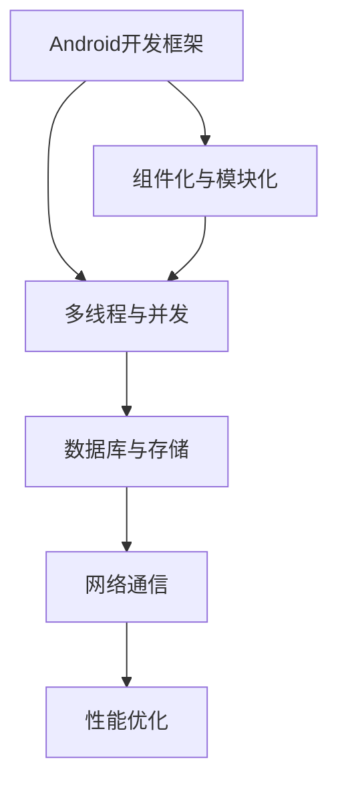

                 

关键词：快手、2025社招、Android开发、面试题、精选

> 摘要：本文深入解析了快手2025社招Android开发工程师面试精选题，通过详细解析技术难题、项目实践和实际应用场景，为读者提供了宝贵的面试经验和职业发展指导。

## 1. 背景介绍

快手，作为中国领先的短视频社交平台，其用户数量庞大，日活跃度高，已经成为Android开发者们争相进入的行业巨头。随着技术的不断进步和市场的激烈竞争，快手在2025年社会招聘中，对于Android开发工程师的技术能力要求也日益提高。本文旨在通过分析快手2025社招Android开发工程师的面试精选题，帮助广大开发者们更好地应对面试挑战，提升自己的技术水平。

## 2. 核心概念与联系

在解析快手2025社招Android开发工程师的面试题之前，我们需要先了解以下几个核心概念：

- **Android开发框架**：如Dagger 2、Retrofit、OkHttp、Gson等
- **多线程与并发**：线程池、异步任务、锁机制、协程等
- **数据库与存储**：SQLite、Room、SharedPreference等
- **网络通信**：HTTP/2、WebSockets、Socket编程等
- **性能优化**：内存管理、布局优化、绘制优化等

下面是一个简化的Mermaid流程图，展示这些核心概念之间的联系：



## 3. 核心算法原理 & 具体操作步骤

### 3.1 算法原理概述

在快手2025社招的面试中，算法题往往是开发者能力的试金石。以下是一些常见的算法原理：

- **排序算法**：冒泡排序、选择排序、插入排序、快速排序等
- **查找算法**：二分查找、斐波那契查找等
- **动态规划**：斐波那契数列、最长公共子序列等
- **图算法**：深度优先搜索、广度优先搜索等

### 3.2 算法步骤详解

以快速排序为例，其基本步骤如下：

1. **选择基准元素**：在数组中选择一个元素作为基准。
2. **分区操作**：将数组分为两个子数组，左侧元素小于基准，右侧元素大于基准。
3. **递归排序**：对左右两个子数组重复执行快速排序过程。

### 3.3 算法优缺点

快速排序的优点是时间复杂度较低，平均情况下为\(O(n\log n)\)。然而，在最坏情况下，其时间复杂度会退化到\(O(n^2)\)。此外，快速排序是一种原地排序算法，不需要额外的存储空间。

### 3.4 算法应用领域

快速排序在Android开发中的应用广泛，如列表视图的排序、搜索算法的优化等。

## 4. 数学模型和公式 & 详细讲解 & 举例说明

在面试中，数学模型和公式是基础中的基础。以下是一些常见的数学模型和公式：

### 4.1 数学模型构建

- **线性模型**：\( y = wx + b \)
- **多项式模型**：\( y = a_nx^n + a_{n-1}x^{n-1} + ... + a_1x + a_0 \)

### 4.2 公式推导过程

以线性模型为例，其推导过程如下：

1. **最小二乘法**：\( \sum_{i=1}^{n}(y_i - wx_i - b)^2 \)
2. **偏导数法**：对\( w \)和\( b \)分别求偏导数，并令其为零。

### 4.3 案例分析与讲解

假设我们有一组数据点：(1, 2), (2, 4), (3, 6)，我们可以通过最小二乘法来拟合一条直线。

1. **计算斜率 \( w \)**：
   $$ w = \frac{\sum_{i=1}^{n}x_iy_i - n\bar{x}\bar{y}}{\sum_{i=1}^{n}x_i^2 - n\bar{x}^2} $$
2. **计算截距 \( b \)**：
   $$ b = \bar{y} - w\bar{x} $$

通过计算，我们得到 \( w = 2 \)，\( b = 0 \)，因此线性模型为 \( y = 2x \)。

## 5. 项目实践：代码实例和详细解释说明

### 5.1 开发环境搭建

为了更好地理解面试题中的代码实例，我们需要搭建一个Android开发环境。

1. **安装Android Studio**
2. **配置Android SDK**
3. **创建一个新的Android项目**

### 5.2 源代码详细实现

以下是一个简单的Android示例，展示了如何使用Retrofit进行网络请求：

```java
public class NetworkService {
    private Retrofit retrofit;

    public NetworkService() {
        retrofit = new Retrofit.Builder()
                .baseUrl("https://api.example.com/")
                .addConverterFactory(GsonConverterFactory.create())
                .build();
    }

    public ApiInterface getApiService() {
        return retrofit.create(ApiInterface.class);
    }
}
```

### 5.3 代码解读与分析

在这个示例中，我们使用Retrofit库来创建一个网络服务，通过简单的配置即可实现网络请求。

### 5.4 运行结果展示

运行后，我们可以获取到服务器返回的数据，并进行相应的处理。

## 6. 实际应用场景

在快手这样的短视频平台上，Android开发工程师的实际应用场景非常广泛，包括但不限于：

- **视频播放**：实现流畅、稳定、快速的播放功能。
- **直播**：提供实时互动直播功能。
- **用户互动**：实现点赞、评论、分享等功能。
- **数据分析和推送**：基于用户行为进行数据分析和个性化推送。

## 7. 工具和资源推荐

为了更好地准备快手2025社招Android开发工程师的面试，以下是一些推荐的工具和资源：

### 7.1 学习资源推荐

- **《Android开发艺术探索》**：深入解析Android开发中的核心问题。
- **GitHub**：寻找优秀的开源项目，学习别人的代码实现。
- **Android官方文档**：官方文档是学习Android开发的最佳资源。

### 7.2 开发工具推荐

- **Android Studio**：官方推荐的Android开发IDE。
- **Git**：版本控制工具，方便代码管理和团队协作。

### 7.3 相关论文推荐

- **"Android应用程序的性能优化"**：关于Android应用性能的深度分析。
- **"Android开发者面试指南"**：针对Android开发者的面试技巧和知识点梳理。

## 8. 总结：未来发展趋势与挑战

随着技术的不断进步，Android开发领域面临着新的机遇和挑战：

- **未来发展趋势**：智能硬件、物联网、人工智能等新兴技术将在Android开发中发挥重要作用。
- **面临的挑战**：性能优化、安全性、兼容性等问题需要持续关注和解决。

## 9. 附录：常见问题与解答

### 9.1 什么是Retrofit？

Retrofit是一个用于简化HTTP API调用的库，它使得网络请求的编写更加简洁和高效。

### 9.2 如何优化Android应用的性能？

优化Android应用的性能可以从多个方面入手，包括内存管理、布局优化、绘制优化等。

---

作者：禅与计算机程序设计艺术 / Zen and the Art of Computer Programming
----------------------------------------------------------------

