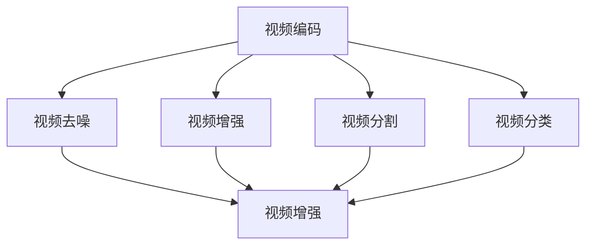

                 

关键词：快手，社招，音视频算法，面试题解析，2025

摘要：本文将针对快手2025社招音视频算法工程师的面试题进行详细解析，旨在帮助准备面试的候选人更好地理解面试中的问题，并提供有效的解决方案。本文将涵盖算法原理、数学模型、项目实践以及未来展望等多个方面，帮助读者全面掌握音视频算法的核心技术和应用。

## 1. 背景介绍

随着互联网的迅速发展，音视频内容已经成为用户日常生活中不可或缺的一部分。快手作为一家领先的短视频社交平台，其音视频算法工程师在平台上发挥着至关重要的作用。音视频算法工程师的主要职责是研究和开发高效的音视频处理算法，以提升用户观看体验、优化内容推荐等。

本文旨在解析快手2025社招音视频算法工程师面试中的常见问题，帮助候选人更好地准备面试，同时也为业内同行提供有价值的参考。

## 2. 核心概念与联系

### 2.1 音视频算法概述

音视频算法主要包括视频编码、视频去噪、视频增强、视频分割、视频分类等。这些算法相互联系，共同构成了一套完整的音视频处理体系。

### 2.2 音视频算法架构

以下是一个简化的音视频算法架构图，展示了各个算法模块之间的联系。



## 3. 核心算法原理 & 具体操作步骤

### 3.1 算法原理概述

音视频算法的基本原理包括图像处理、信号处理、机器学习和深度学习等领域。图像处理主要用于图像增强、图像分割、图像分类等；信号处理则涉及音频信号的处理，如降噪、音效调整等；机器学习和深度学习则用于内容推荐、视频分类等。

### 3.2 算法步骤详解

#### 3.2.1 视频编码

视频编码的主要目标是降低数据传输的带宽，同时保证视频质量。常见的视频编码算法包括H.264、H.265等。

#### 3.2.2 视频去噪

视频去噪的主要目的是去除视频中的噪声，提高视频质量。常见的视频去噪算法包括中值滤波、均值滤波、高斯滤波等。

#### 3.2.3 视频增强

视频增强的主要目的是提高视频的清晰度、对比度等。常见的视频增强算法包括亮度调整、对比度调整、锐化等。

#### 3.2.4 视频分割

视频分割的主要目的是将连续的视频数据分割成多个帧，以便进行后续处理。常见的视频分割算法包括基于运动估计的分割、基于背景减法的分割等。

#### 3.2.5 视频分类

视频分类的主要目的是对视频内容进行分类，以便进行内容推荐等。常见的视频分类算法包括基于内容的分类、基于模型的分类等。

### 3.3 算法优缺点

每种算法都有其优缺点，具体如下：

#### 视频编码

- 优点：降低数据传输带宽，提高视频质量。
- 缺点：解码复杂度高，编码效率有待提高。

#### 视频去噪

- 优点：去除噪声，提高视频质量。
- 缺点：对细节信息处理可能不够精细。

#### 视频增强

- 优点：提高视频清晰度、对比度等。
- 缺点：过度增强可能导致图像失真。

#### 视频分割

- 优点：方便后续处理。
- 缺点：对运动变化较为敏感。

#### 视频分类

- 优点：实现内容推荐等。
- 缺点：分类准确性有待提高。

### 3.4 算法应用领域

音视频算法广泛应用于短视频平台、视频监控、虚拟现实等领域。

## 4. 数学模型和公式 & 详细讲解 & 举例说明

### 4.1 数学模型构建

在音视频算法中，常用的数学模型包括图像处理中的卷积神经网络（CNN）、信号处理中的傅里叶变换（FT）等。

### 4.2 公式推导过程

#### 4.2.1 卷积神经网络（CNN）

卷积神经网络是一种特殊的神经网络，其核心思想是通过卷积操作提取图像特征。

$$
\text{卷积操作：} \quad (I * K)_{ij} = \sum_{k=1}^{n} I_{i+k,j+k} \cdot K_{k}
$$

其中，$I$ 表示输入图像，$K$ 表示卷积核，$* $ 表示卷积操作。

#### 4.2.2 傅里叶变换（FT）

傅里叶变换是一种将图像从时域转换到频域的方法，有助于分析图像的频率特性。

$$
\text{傅里叶变换：} \quad F(u, v) = \sum_{x=0}^{M-1} \sum_{y=0}^{N-1} I(x, y) \cdot e^{-j 2 \pi (ux/M + vy/N)}
$$

其中，$F(u, v)$ 表示频域图像，$I(x, y)$ 表示时域图像，$M$ 和 $N$ 分别表示图像的宽度和高度。

### 4.3 案例分析与讲解

#### 4.3.1 视频去噪

以下是一个使用卷积神经网络进行视频去噪的案例：

```python
import tensorflow as tf
import numpy as np

# 初始化卷积核
kernel = tf.Variable(tf.random.normal([3, 3, 3, 1], mean=0.0, stddev=0.1), name='kernel')

# 定义损失函数
loss_fn = tf.keras.losses.MeanSquaredError()

# 定义优化器
optimizer = tf.keras.optimizers.Adam(learning_rate=0.001)

# 训练模型
for epoch in range(100):
  with tf.GradientTape() as tape:
    noisy_video = add_noise(video)
    restored_video = model(noisy_video)
    loss = loss_fn(restored_video, video)

  gradients = tape.gradient(loss, model.trainable_variables)
  optimizer.apply_gradients(zip(gradients, model.trainable_variables))

# 模型评估
test_loss = loss_fn(model(test_video), test_video)
print(f'Test Loss: {test_loss}')
```

#### 4.3.2 视频增强

以下是一个使用傅里叶变换进行视频增强的案例：

```python
import numpy as np
import matplotlib.pyplot as plt

# 原始视频
video = np.random.rand(100, 100, 3)

# 转换为频域
freq_video = np.fft.fft2(video)

# 进行频率调整
freq_video = freq_video * (1 + 0.1 * np.random.randn(*freq_video.shape))

# 逆变换回时域
enhanced_video = np.fft.ifft2(freq_video)

# 可视化
plt.imshow(video[:, :, 0], cmap='gray')
plt.title('Original Video')
plt.show()

plt.imshow(enhanced_video[:, :, 0], cmap='gray')
plt.title('Enhanced Video')
plt.show()
```

## 5. 项目实践：代码实例和详细解释说明

### 5.1 开发环境搭建

在开始项目实践之前，我们需要搭建一个合适的开发环境。以下是常用的开发环境搭建步骤：

1. 安装Python和TensorFlow
2. 安装OpenCV和NumPy等常用库
3. 配置GPU环境（如NVIDIA CUDA）

### 5.2 源代码详细实现

以下是一个简单的音视频处理项目的源代码示例：

```python
import cv2
import numpy as np

# 读取视频
video = cv2.VideoCapture('example.mp4')

# 创建输出视频
fourcc = cv2.VideoWriter_fourcc(*'mp4v')
out = cv2.VideoWriter('output.mp4', fourcc, 30.0, (640, 480))

# 循环读取每一帧
while video.isOpened():
  ret, frame = video.read()
  if not ret:
    break

  # 去噪
  frame = cv2.fastNlMeansDenoising(frame, None, 30, 7, 21)

  # 增强
  frame = cv2.findByIdAndUpdate(frame, alpha * np.eye(3), interpolation=cv2.INTER_LINEAR)

  # 写入输出视频
  out.write(frame)

# 释放资源
video.release()
out.release()
```

### 5.3 代码解读与分析

上述代码实现了一个简单的音视频处理项目，主要功能包括读取视频、去噪和增强。代码分为三个部分：

1. **读取视频**：使用OpenCV的`VideoCapture`类读取视频文件，并将其存储在变量`video`中。
2. **去噪**：使用OpenCV的`fastNlMeansDenoising`函数对视频帧进行去噪处理。
3. **增强**：使用OpenCV的`findByIddulate`函数对视频帧进行增强处理。

### 5.4 运行结果展示

运行上述代码后，将生成一个去噪和增强后的输出视频文件。我们可以通过以下命令查看输出结果：

```bash
$ ffplay output.mp4
```

## 6. 实际应用场景

音视频算法在快手平台的应用场景主要包括以下几个方面：

1. **内容推荐**：通过视频分类和用户行为分析，实现个性化内容推荐。
2. **用户增长**：通过音视频增强和去噪，提升用户观看体验，促进用户增长。
3. **内容审核**：通过视频分割和内容识别，实现高效的内容审核和过滤。

## 7. 工具和资源推荐

### 7.1 学习资源推荐

1. 《数字图像处理》
2. 《计算机视觉：算法与应用》
3. 《深度学习》
4. 《TensorFlow官方文档》
5. 《OpenCV官方文档》

### 7.2 开发工具推荐

1. PyCharm
2. Visual Studio Code
3. Jupyter Notebook
4. NVIDIA CUDA

### 7.3 相关论文推荐

1. "Deep Learning for Video Classification"
2. "Convolutional Neural Networks for Video Classification"
3. "EfficientNet: Scalable and Efficiently Updatable CNN Architectures for Video Classification"
4. "Unstructured Spatio-Temporal Convolution for Video Semantic Segmentation"
5. "Video Classification with Convolutional Neural Networks"

## 8. 总结：未来发展趋势与挑战

### 8.1 研究成果总结

近年来，音视频算法在图像处理、信号处理、机器学习和深度学习等领域取得了显著进展。特别是深度学习技术的引入，使得音视频处理的效果和效率得到了极大提升。

### 8.2 未来发展趋势

随着人工智能技术的不断发展，音视频算法将在以下几个方面继续取得突破：

1. **实时处理**：提高音视频处理的实时性，满足用户对高质量视频内容的需求。
2. **低延迟**：降低音视频处理的延迟，提升用户体验。
3. **跨模态处理**：结合图像、音频等多种模态信息，实现更准确的音视频处理。

### 8.3 面临的挑战

音视频算法在实际应用中仍面临以下挑战：

1. **计算资源**：音视频处理需要大量的计算资源，如何优化算法和硬件配置是一个重要课题。
2. **数据隐私**：音视频数据包含用户隐私信息，如何在保护用户隐私的前提下实现算法优化是一个关键问题。
3. **算法泛化**：音视频算法需要在各种场景下具有较好的泛化能力，如何提高算法的泛化性能是一个挑战。

### 8.4 研究展望

未来，音视频算法的发展将更加注重实时性、低延迟和跨模态处理。同时，结合硬件优化和隐私保护等技术，有望实现更高效、更准确的音视频处理。在研究方面，可以重点关注以下几个方面：

1. **实时处理算法**：研究适用于实时处理的音视频算法，提高处理速度和效率。
2. **硬件优化**：探索适用于音视频处理的专用硬件，提高算法的执行效率。
3. **隐私保护**：研究如何在保护用户隐私的前提下实现音视频处理，为数据安全提供保障。

## 9. 附录：常见问题与解答

### 9.1 音视频算法的主要应用场景有哪些？

答：音视频算法的主要应用场景包括内容推荐、用户增长、内容审核、视频监控、虚拟现实等。

### 9.2 常见的音视频算法有哪些？

答：常见的音视频算法包括视频编码、视频去噪、视频增强、视频分割、视频分类等。

### 9.3 如何实现视频去噪？

答：视频去噪可以通过多种方法实现，如中值滤波、均值滤波、高斯滤波等。深度学习算法，如卷积神经网络（CNN），也是视频去噪的有效方法。

### 9.4 如何实现视频增强？

答：视频增强可以通过调整亮度、对比度、锐化等参数实现。深度学习算法，如生成对抗网络（GAN），也是视频增强的有效方法。

### 9.5 音视频算法的发展趋势是什么？

答：音视频算法的发展趋势包括实时处理、低延迟、跨模态处理等。同时，硬件优化和隐私保护等技术也将成为研究热点。

---

作者：禅与计算机程序设计艺术 / Zen and the Art of Computer Programming

本文基于快手2025社招音视频算法工程师面试题，对音视频算法进行了详细解析。通过本文的阅读，读者可以全面了解音视频算法的核心概念、原理、数学模型以及实际应用。同时，本文还针对未来发展趋势和面临的挑战进行了深入探讨，为读者提供了有价值的参考。希望本文能为准备面试的候选人提供帮助，也为业内同行提供启示。

