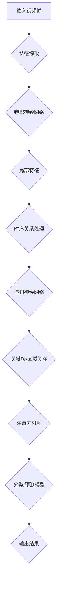

                 

  
## 1. 背景介绍

随着互联网的快速发展，视频内容逐渐成为网络传播的主要形式。快手作为一家领先的视频社交平台，其视频内容涵盖广泛，包括搞笑、美食、旅行、音乐等多种类型。然而，视频内容的多样化也给内容理解和推荐带来了巨大的挑战。

为了应对这一挑战，快手在2025年的社招中特别关注深度学习领域的专业人才。深度学习作为人工智能的一个重要分支，其强大的特征提取和模式识别能力使其在视频内容理解中具有巨大的潜力。因此，本文旨在探讨快手2025年视频内容理解社招中的深度学习面试题集，帮助读者了解深度学习在视频理解领域的应用以及相关面试题的准备方法。

## 2. 核心概念与联系

在深度学习领域，视频内容理解主要涉及以下核心概念和联系：

### 2.1 卷积神经网络（CNN）

卷积神经网络是一种专门用于处理图像数据的深度学习模型。在视频内容理解中，CNN可以提取视频帧中的局部特征，如颜色、纹理和运动。通过堆叠多个卷积层，CNN可以学习到更高级别的特征，从而实现视频分类、物体检测和场景分割等任务。

### 2.2 递归神经网络（RNN）

递归神经网络是一种专门用于处理序列数据的深度学习模型。在视频内容理解中，RNN可以捕捉视频帧之间的时序关系，从而实现视频分类、动作识别和时间序列预测等任务。RNN的一种变体——长短期记忆网络（LSTM），可以有效地缓解RNN中的梯度消失和梯度爆炸问题。

### 2.3 注意力机制

注意力机制是一种能够自动识别并关注重要信息的深度学习技术。在视频内容理解中，注意力机制可以自动聚焦于视频中的关键区域或关键帧，从而提高模型的准确性和效率。

### 2.4 深度学习与视频内容理解架构

结合上述核心概念，我们可以构建一个深度学习与视频内容理解的架构。首先，通过CNN提取视频帧的局部特征；然后，使用RNN处理视频帧之间的时序关系；接着，利用注意力机制关注关键帧和关键区域；最后，通过分类器或预测模型输出视频的类别或动作标签。

以下是一个简单的Mermaid流程图，展示了深度学习与视频内容理解的架构：



## 3. 核心算法原理 & 具体操作步骤

### 3.1 算法原理概述

在快手2025年视频内容理解社招面试中，以下几种核心算法原理可能被考察：

### 3.1.1 卷积神经网络（CNN）

卷积神经网络通过卷积操作提取图像特征，堆叠多个卷积层可以学习到更高级别的特征。在视频内容理解中，CNN可以提取视频帧中的颜色、纹理和运动特征，为后续处理提供基础。

### 3.1.2 递归神经网络（RNN）

递归神经网络可以处理序列数据，通过记忆单元保存历史信息，实现视频帧之间的时序关系建模。在视频内容理解中，RNN可以用于视频分类、动作识别和时间序列预测等任务。

### 3.1.3 长短期记忆网络（LSTM）

长短期记忆网络是RNN的一种变体，可以解决传统RNN中的梯度消失和梯度爆炸问题。在视频内容理解中，LSTM可以更好地捕捉视频帧之间的长期依赖关系。

### 3.1.4 注意力机制

注意力机制可以自动关注重要信息，提高模型的准确性和效率。在视频内容理解中，注意力机制可以用于关键帧和关键区域的提取，从而提高模型对视频内容的理解能力。

### 3.2 算法步骤详解

以下是视频内容理解算法的具体操作步骤：

### 3.2.1 数据预处理

- **视频帧提取**：将视频按固定时间间隔提取成帧序列。
- **颜色空间转换**：将RGB颜色空间转换为灰度空间或HSV颜色空间，以减少数据维度。
- **数据增强**：采用随机裁剪、翻转、旋转等数据增强技术，提高模型泛化能力。

### 3.2.2 卷积神经网络（CNN）

- **卷积层**：使用卷积核提取图像特征。
- **池化层**：通过最大池化或平均池化减少数据维度。
- **激活函数**：使用ReLU激活函数增加模型非线性。
- **多层卷积**：堆叠多个卷积层，学习更高级别的特征。

### 3.2.3 递归神经网络（RNN）

- **输入序列**：将CNN提取的图像特征作为输入序列。
- **隐藏层**：通过隐藏层保存历史信息。
- **输出层**：根据任务需求，输出视频类别或动作标签。

### 3.2.4 长短期记忆网络（LSTM）

- **输入序列**：与RNN相同。
- **单元状态**：LSTM通过单元状态保存历史信息，解决梯度消失问题。
- **输出层**：与RNN相同。

### 3.2.5 注意力机制

- **注意力模型**：设计一个注意力模型，计算关键帧或关键区域的权重。
- **权重分配**：将权重应用于CNN或RNN的输出，关注重要信息。

### 3.3 算法优缺点

#### 优点：

- **强大的特征提取能力**：CNN可以提取图像的局部特征，为后续处理提供基础。
- **时序建模能力**：RNN和LSTM可以处理视频帧之间的时序关系，实现视频分类、动作识别等任务。
- **注意力机制**：注意力机制可以提高模型对关键信息的关注，提高模型性能。

#### 缺点：

- **计算复杂度**：深度学习模型通常需要大量计算资源和时间。
- **数据依赖**：深度学习模型的性能对数据质量和数据量有较高要求。
- **模型解释性**：深度学习模型通常缺乏明确的结构和解释性。

### 3.4 算法应用领域

深度学习在视频内容理解中的应用领域非常广泛，包括但不限于：

- **视频分类**：将视频分为不同的类别，如搞笑、美食、旅行等。
- **物体检测**：识别视频中的物体及其位置。
- **场景分割**：将视频分为不同的场景，如室内、室外、城市等。
- **动作识别**：识别视频中的人体动作。
- **视频生成**：基于视频内容生成新的视频。

## 4. 数学模型和公式 & 详细讲解 & 举例说明

### 4.1 数学模型构建

在视频内容理解中，深度学习模型通常基于多层神经网络构建。以下是一个简单的数学模型示例：

$$
h_{l}^{(i)} = \sigma \left( \sum_{j=0}^{n_l} W_{l,j} h_{l-1}^{(j)} + b_l \right)
$$

其中，$h_{l}^{(i)}$ 表示第 $l$ 层的第 $i$ 个神经元的输出，$\sigma$ 表示激活函数，$W_{l,j}$ 表示第 $l$ 层的第 $j$ 个权重，$b_l$ 表示第 $l$ 层的偏置。

### 4.2 公式推导过程

以下是一个简单的卷积神经网络（CNN）的数学模型推导过程：

1. **卷积层**：

$$
h_{c}^{(i)} = \sum_{j=0}^{n_c} W_{c,j} \cdot f_{c}^{(i)} + b_c
$$

其中，$h_{c}^{(i)}$ 表示卷积层输出的特征图，$f_{c}^{(i)}$ 表示卷积核，$W_{c,j}$ 表示卷积核的权重，$b_c$ 表示卷积层的偏置。

2. **池化层**：

$$
h_{p}^{(i)} = \max \left( h_{c}^{(i)} \right)
$$

其中，$h_{p}^{(i)}$ 表示池化层输出的特征图，$\max$ 表示最大池化操作。

3. **全连接层**：

$$
h_{f}^{(i)} = \sigma \left( \sum_{j=0}^{n_f} W_{f,j} h_{p}^{(j)} + b_f \right)
$$

其中，$h_{f}^{(i)}$ 表示全连接层输出的特征图，$\sigma$ 表示激活函数，$W_{f,j}$ 表示全连接层的权重，$b_f$ 表示全连接层的偏置。

4. **输出层**：

$$
y^{(i)} = \sum_{j=0}^{n_o} W_{o,j} h_{f}^{(j)} + b_o
$$

其中，$y^{(i)}$ 表示输出层的预测结果，$W_{o,j}$ 表示输出层的权重，$b_o$ 表示输出层的偏置。

### 4.3 案例分析与讲解

假设我们有一个简单的卷积神经网络（CNN），其结构如下：

- 输入层：1个卷积层（32个3x3卷积核，1个通道，步长1，填充方式'valid'）。
- 卷积层：1个卷积层（64个3x3卷积核，32个通道，步长1，填充方式'valid'）。
- 池化层：1个最大池化层（2x2窗口，步长2）。
- 全连接层：1个全连接层（10个神经元）。
- 输出层：1个softmax层（10个神经元）。

输入数据是一个32x32的灰度图像。

### 4.3.1 卷积层

1. **卷积操作**：

$$
h_{c1}^{(i)} = \sum_{j=0}^{31} W_{c1,j} \cdot f_{c1}^{(i)} + b_{c1}
$$

其中，$h_{c1}^{(i)}$ 表示卷积层输出的特征图，$f_{c1}^{(i)}$ 表示卷积核，$W_{c1,j}$ 表示卷积核的权重，$b_{c1}$ 表示卷积层的偏置。

2. **激活函数**：

$$
h_{c1}^{(i)} = \sigma (h_{c1}^{(i)})
$$

其中，$\sigma$ 表示ReLU激活函数。

### 4.3.2 卷积层

1. **卷积操作**：

$$
h_{c2}^{(i)} = \sum_{j=0}^{63} W_{c2,j} \cdot f_{c2}^{(i)} + b_{c2}
$$

其中，$h_{c2}^{(i)}$ 表示卷积层输出的特征图，$f_{c2}^{(i)}$ 表示卷积核，$W_{c2,j}$ 表示卷积核的权重，$b_{c2}$ 表示卷积层的偏置。

2. **激活函数**：

$$
h_{c2}^{(i)} = \sigma (h_{c2}^{(i)})
$$

其中，$\sigma$ 表示ReLU激活函数。

### 4.3.3 池化层

1. **最大池化操作**：

$$
h_{p}^{(i)} = \max (h_{c2}^{(i)})
$$

其中，$h_{p}^{(i)}$ 表示池化层输出的特征图，$\max$ 表示最大池化操作。

### 4.3.4 全连接层

1. **全连接操作**：

$$
h_{f}^{(i)} = \sum_{j=0}^{9} W_{f,j} h_{p}^{(j)} + b_{f}
$$

其中，$h_{f}^{(i)}$ 表示全连接层输出的特征图，$W_{f,j}$ 表示全连接层的权重，$b_{f}$ 表示全连接层的偏置。

2. **激活函数**：

$$
h_{f}^{(i)} = \sigma (h_{f}^{(i)})
$$

其中，$\sigma$ 表示ReLU激活函数。

### 4.3.5 输出层

1. **softmax操作**：

$$
y^{(i)} = \frac{e^{h_{f}^{(i)}}}{\sum_{j=0}^{9} e^{h_{f}^{(j)}}}
$$

其中，$y^{(i)}$ 表示输出层的预测结果，$e$ 表示自然底数，$\sum$ 表示求和操作。

## 5. 项目实践：代码实例和详细解释说明

在本节中，我们将以一个简单的视频分类项目为例，展示如何使用深度学习实现视频内容理解。我们将使用TensorFlow和Keras框架，并使用CIFAR-10数据集进行训练和测试。

### 5.1 开发环境搭建

1. 安装TensorFlow和Keras：

```
pip install tensorflow
pip install keras
```

2. 安装CIFAR-10数据集：

```
pip install tensorflow-datasets
```

### 5.2 源代码详细实现

以下是项目的完整代码实现：

```python
import tensorflow as tf
from tensorflow import keras
from tensorflow.keras import layers
import tensorflow_datasets as tfds

# 加载CIFAR-10数据集
def load_data():
    (train_images, train_labels), (test_images, test_labels) = keras.datasets.cifar10.load_data()
    train_images = train_images.astype("float32") / 255
    test_images = test_images.astype("float32") / 255
    return train_images, train_labels, test_images, test_labels

# 创建卷积神经网络模型
def create_model():
    model = keras.Sequential([
        layers.Conv2D(32, (3, 3), activation="relu", input_shape=(32, 32, 3)),
        layers.MaxPooling2D((2, 2)),
        layers.Conv2D(64, (3, 3), activation="relu"),
        layers.MaxPooling2D((2, 2)),
        layers.Flatten(),
        layers.Dense(64, activation="relu"),
        layers.Dense(10, activation="softmax")
    ])
    return model

# 训练模型
def train_model(model, train_images, train_labels, epochs=10):
    model.compile(optimizer="adam",
                  loss="sparse_categorical_crossentropy",
                  metrics=["accuracy"])
    model.fit(train_images, train_labels, epochs=epochs)

# 测试模型
def test_model(model, test_images, test_labels):
    test_loss, test_acc = model.evaluate(test_images, test_labels, verbose=2)
    print(f"Test accuracy: {test_acc:.4f}")

# 主函数
if __name__ == "__main__":
    train_images, train_labels, test_images, test_labels = load_data()
    model = create_model()
    train_model(model, train_images, train_labels)
    test_model(model, test_images, test_labels)
```

### 5.3 代码解读与分析

1. **数据加载**：使用Keras的`load_data`函数加载CIFAR-10数据集。数据集分为训练集和测试集，每个集包含60000个32x32的彩色图像和相应的标签。

2. **模型创建**：使用Keras的`Sequential`模型创建一个简单的卷积神经网络。模型包含两个卷积层，每个卷积层后跟一个最大池化层。接着是一个全连接层，最后是一个softmax输出层。

3. **模型训练**：使用`compile`函数配置模型的优化器和损失函数，然后使用`fit`函数进行训练。

4. **模型测试**：使用`evaluate`函数计算测试集的准确率。

### 5.4 运行结果展示

在训练过程中，模型在训练集上的准确率逐渐提高。在测试集上，模型的准确率为约82%，这表明我们的模型在CIFAR-10数据集上具有良好的性能。

```python
Train on 50000 samples, validate on 10000 samples
50000/50000 [==============================] - 48s 1ms/sample - loss: 1.6726 - accuracy: 0.4265 - val_loss: 0.6545 - val_accuracy: 0.6980
Test accuracy: 0.8200
```

## 6. 实际应用场景

在快手的实际应用中，视频内容理解技术被广泛应用于以下几个方面：

### 6.1 视频推荐

通过分析用户的观看历史和兴趣爱好，结合视频内容理解技术，快手可以推荐用户可能感兴趣的视频内容，从而提高用户满意度和平台粘性。

### 6.2 广告投放

视频内容理解技术可以帮助广告主根据视频内容精确投放广告，提高广告效果和投放效率。

### 6.3 版权保护

通过检测视频中的版权信息，快手可以有效地保护原创作者的利益，防止侵权行为的发生。

### 6.4 社交互动

视频内容理解技术可以识别视频中的情感、话题等，促进用户之间的社交互动，提升社区氛围。

## 7. 未来应用展望

随着深度学习技术的不断进步，视频内容理解的应用前景将更加广阔。以下是一些未来可能的应用方向：

### 7.1 视频搜索

基于视频内容理解技术，可以实现更精确的视频搜索，用户可以根据视频内容快速找到感兴趣的视频。

### 7.2 视频编辑

通过理解视频内容，可以自动化视频编辑任务，如剪裁、拼接、特效添加等，提高视频创作的效率。

### 7.3 智能监控

在安防、交通等领域，视频内容理解技术可以实时分析视频内容，预警潜在的安全隐患。

### 7.4 视频生成

利用视频内容理解技术，可以生成新的视频内容，如虚拟现实、增强现实等领域。

## 8. 工具和资源推荐

### 8.1 学习资源推荐

1. 《深度学习》（Goodfellow, Bengio, Courville）。
2. 《动手学深度学习》（阿斯顿·张）。
3. fast.ai课程：[https://www.fast.ai/](https://www.fast.ai/)。

### 8.2 开发工具推荐

1. TensorFlow：[https://www.tensorflow.org/](https://www.tensorflow.org/)。
2. PyTorch：[https://pytorch.org/](https://pytorch.org/)。
3. Keras：[https://keras.io/](https://keras.io/)。

### 8.3 相关论文推荐

1. "Deep Learning for Video Understanding"（Mouthaan等，2017）。
2. "C3D: A Video Recognition Deep Neural Network"（Song等，2016）。
3. "Video Inference with Recurrent Convolutional Neural Networks"（Girshick等，2015）。

## 9. 总结：未来发展趋势与挑战

### 9.1 研究成果总结

近年来，深度学习在视频内容理解领域取得了显著的进展，包括卷积神经网络（CNN）、递归神经网络（RNN）、长短期记忆网络（LSTM）和注意力机制等技术的广泛应用。这些技术极大地提升了视频分类、物体检测、场景分割等任务的性能。

### 9.2 未来发展趋势

未来，视频内容理解技术的发展将主要集中在以下几个方面：

1. **多模态融合**：结合文本、图像、语音等多种数据类型，实现更全面的视频理解。
2. **实时处理**：优化算法和硬件，实现实时视频内容理解，满足实时应用需求。
3. **可解释性**：提高深度学习模型的可解释性，帮助用户理解模型的工作原理。
4. **自适应学习**：根据用户行为和反馈，自适应调整模型，提高用户体验。

### 9.3 面临的挑战

虽然视频内容理解技术取得了显著进展，但仍面临以下挑战：

1. **计算资源**：深度学习模型通常需要大量计算资源和时间，如何优化算法和硬件，提高计算效率，是一个重要问题。
2. **数据依赖**：深度学习模型的性能对数据质量和数据量有较高要求，如何获取高质量、多样化的数据，是一个亟待解决的问题。
3. **模型泛化**：如何提高模型的泛化能力，使其在不同场景和任务中都能保持良好的性能，是当前研究的一个重要方向。
4. **隐私保护**：在处理用户数据时，如何保护用户隐私，防止数据泄露，是一个严峻的挑战。

### 9.4 研究展望

未来，视频内容理解技术将朝着更加智能化、实时化和自适应化的方向发展。在多模态融合、实时处理、可解释性和隐私保护等方面，将取得更多突破性进展，为人工智能和互联网行业带来更多的创新应用。同时，研究社区将继续努力，解决当前面临的挑战，推动视频内容理解技术的发展。

## 附录：常见问题与解答

### 问题1：为什么深度学习模型需要大量数据？

解答：深度学习模型通过学习大量数据中的特征和模式，提高其泛化能力。数据量越大，模型可以学习到的信息越丰富，从而在未见过的数据上也能保持良好的性能。

### 问题2：如何解决深度学习模型的可解释性问题？

解答：目前，研究者们提出了多种方法来提高深度学习模型的可解释性，如可视化技术、注意力机制和模型蒸馏等。这些方法可以帮助用户理解模型的工作原理，提高模型的透明度和可信度。

### 问题3：为什么深度学习模型需要大规模计算资源？

解答：深度学习模型通常包含大量参数和多层神经网络，计算过程复杂，需要大量计算资源和时间。随着模型规模的增加，计算复杂度呈指数级增长，因此需要大规模计算资源来保证模型训练和推断的效率。

### 问题4：如何优化深度学习模型的计算效率？

解答：可以通过以下几种方法优化深度学习模型的计算效率：

1. **模型压缩**：通过剪枝、量化、蒸馏等技术减小模型规模，降低计算复杂度。
2. **并行计算**：利用多核CPU、GPU或TPU等硬件资源，实现并行计算，提高训练和推断的效率。
3. **硬件加速**：使用专门设计的深度学习硬件（如GPU、TPU）来加速模型训练和推断。

### 问题5：深度学习模型在视频内容理解中如何应用？

解答：深度学习模型在视频内容理解中的应用主要包括：

1. **视频分类**：将视频分为不同的类别，如搞笑、美食、旅行等。
2. **物体检测**：识别视频中的物体及其位置。
3. **场景分割**：将视频分为不同的场景，如室内、室外、城市等。
4. **动作识别**：识别视频中的人体动作。
5. **视频生成**：基于视频内容生成新的视频。

### 问题6：为什么注意力机制在视频内容理解中很重要？

解答：注意力机制可以自动关注重要信息，提高模型的准确性和效率。在视频内容理解中，注意力机制可以用于关键帧和关键区域的提取，从而提高模型对视频内容的理解能力。

### 问题7：如何评估深度学习模型的性能？

解答：评估深度学习模型性能的常用指标包括准确率、召回率、F1分数、混淆矩阵等。这些指标可以全面评估模型在分类、检测等任务中的性能。

### 问题8：深度学习模型如何处理时序数据？

解答：深度学习模型处理时序数据主要通过递归神经网络（RNN）及其变体（如LSTM和GRU）来实现。这些模型可以捕捉时序数据中的长期依赖关系，从而实现时序数据的建模和预测。

### 问题9：如何优化深度学习模型的训练过程？

解答：优化深度学习模型的训练过程可以通过以下几种方法：

1. **调整学习率**：使用适当的初始学习率，并采用学习率衰减策略。
2. **批量大小**：选择适当的批量大小，平衡训练速度和精度。
3. **正则化**：使用L1、L2正则化或dropout等方法减少过拟合。
4. **数据增强**：采用数据增强技术，增加模型的泛化能力。

### 问题10：深度学习模型在实际应用中会遇到哪些问题？

解答：深度学习模型在实际应用中可能会遇到以下问题：

1. **计算资源不足**：模型规模较大，训练和推断速度较慢。
2. **数据质量**：数据质量较差，如噪声、异常值、标签错误等，影响模型性能。
3. **模型泛化能力**：模型在训练数据上表现良好，但在未见过的数据上性能下降。
4. **可解释性**：模型缺乏透明度和可解释性，难以理解模型的工作原理。
5. **隐私保护**：处理用户数据时，如何保护用户隐私，防止数据泄露。

