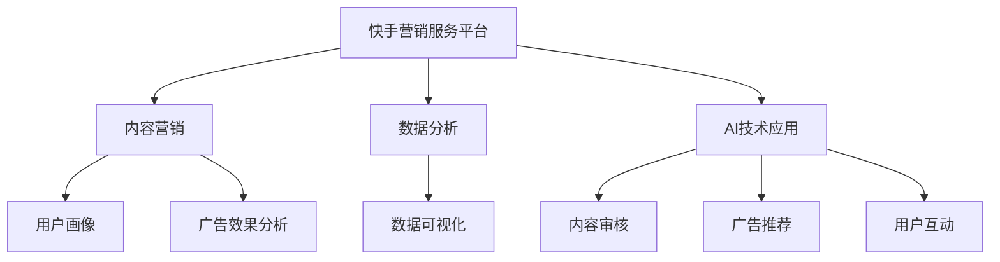

                 

关键词：快手营销服务平台、社招面试、真题汇总、解答、营销策略、数据分析、AI技术应用

摘要：本文旨在为广大求职者提供2024年快手营销服务平台社招面试的真题汇总及其详细解答，通过深入剖析面试题目，帮助求职者更好地准备面试，提升面试成功率。文章内容涵盖快手平台的核心营销策略、数据分析方法、AI技术应用等方面，力求为求职者提供全方位的指导。

## 1. 背景介绍

快手营销服务平台作为快手公司的重要组成部分，旨在为广告主和品牌提供全方位的营销解决方案。随着互联网营销的不断发展和市场竞争的加剧，快手营销服务平台在广告投放、数据分析和用户互动等方面不断优化和创新，以满足广告主和用户的需求。

近年来，快手营销服务平台在社招面试中越来越受到关注。面试题目的难度和广度也在不断提升，涉及到的知识点涵盖了快手平台的核心营销策略、数据分析方法、AI技术应用等多个方面。本文将对2024年快手营销服务平台社招面试的真题进行汇总和分析，并提供详细的解答，以帮助求职者更好地准备面试。

## 2. 核心概念与联系

### 2.1 快手营销服务平台简介

快手营销服务平台是快手公司旗下的广告营销平台，提供包括品牌广告、效果广告、电商广告等多种广告形式。广告主可以通过快手营销服务平台，精准投放广告，提升品牌知名度和销售转化率。

### 2.2 营销策略

快手营销服务平台的核心营销策略主要包括以下几个方面：

1. **内容营销**：通过优质的内容创作和传播，吸引潜在用户，提升品牌知名度。

2. **数据分析**：通过数据分析和挖掘，了解用户行为和需求，为广告主提供精准投放策略。

3. **AI技术应用**：利用人工智能技术，实现广告投放的自动化和智能化。

### 2.3 数据分析

快手营销服务平台在数据分析方面，主要采用以下几种方法：

1. **用户画像**：通过用户行为数据，构建用户画像，为广告主提供精准投放依据。

2. **广告效果分析**：通过广告投放效果数据，分析广告的投放效果，为广告主提供优化建议。

3. **数据可视化**：通过数据可视化技术，将复杂的数据以图形化的方式呈现，便于广告主理解和分析。

### 2.4 AI技术应用

快手营销服务平台在AI技术应用方面，主要涉及以下领域：

1. **内容审核**：利用AI技术对上传的内容进行审核，确保内容符合平台规范。

2. **广告推荐**：利用AI技术进行用户画像和广告推荐，提高广告投放效果。

3. **用户互动**：利用AI技术进行用户情感分析，优化用户互动体验。

### 2.5 Mermaid流程图

以下是快手营销服务平台的核心概念与联系Mermaid流程图：



## 3. 核心算法原理 & 具体操作步骤

### 3.1 算法原理概述

快手营销服务平台在算法原理方面，主要涉及以下几种算法：

1. **用户画像算法**：通过用户行为数据，构建用户画像。

2. **广告效果分析算法**：通过广告投放效果数据，分析广告的投放效果。

3. **广告推荐算法**：利用用户画像和广告特征，进行广告推荐。

### 3.2 算法步骤详解

#### 3.2.1 用户画像算法

1. **数据收集**：收集用户行为数据，如浏览记录、购买记录等。

2. **特征提取**：对用户行为数据进行预处理，提取特征。

3. **模型训练**：利用提取的特征，训练用户画像模型。

4. **用户画像生成**：根据训练好的模型，生成用户画像。

#### 3.2.2 广告效果分析算法

1. **数据收集**：收集广告投放数据，如曝光量、点击量、转化量等。

2. **效果分析**：利用广告投放数据，分析广告的投放效果。

3. **优化建议**：根据广告投放效果，为广告主提供优化建议。

#### 3.2.3 广告推荐算法

1. **用户画像构建**：构建用户画像，包括用户兴趣、行为等。

2. **广告特征提取**：提取广告的特征，如广告类型、品牌等。

3. **模型训练**：利用用户画像和广告特征，训练广告推荐模型。

4. **广告推荐**：根据训练好的模型，为用户推荐合适的广告。

### 3.3 算法优缺点

#### 3.3.1 用户画像算法

优点：能够精准了解用户需求，为广告主提供精准投放依据。

缺点：数据收集和处理成本较高，且容易受到数据质量和模型准确性的影响。

#### 3.3.2 广告效果分析算法

优点：能够有效评估广告投放效果，为广告主提供优化建议。

缺点：效果分析结果容易受到数据质量和分析算法的影响。

#### 3.3.3 广告推荐算法

优点：能够提高广告投放效果，提升用户满意度。

缺点：推荐算法容易出现偏差，导致用户体验不佳。

### 3.4 算法应用领域

快手营销服务平台的算法应用领域主要包括以下几个方面：

1. **广告投放优化**：利用用户画像和广告效果分析算法，实现广告投放的精准优化。

2. **内容推荐**：利用广告推荐算法，为用户推荐感兴趣的内容。

3. **用户互动**：利用用户画像和用户互动算法，优化用户互动体验。

## 4. 数学模型和公式 & 详细讲解 & 举例说明

### 4.1 数学模型构建

快手营销服务平台在数学模型构建方面，主要涉及以下几种模型：

1. **用户画像模型**：利用机器学习算法，构建用户画像模型。

2. **广告效果分析模型**：利用统计分析方法，构建广告效果分析模型。

3. **广告推荐模型**：利用协同过滤算法，构建广告推荐模型。

### 4.2 公式推导过程

#### 4.2.1 用户画像模型

假设用户行为数据为\( X \)，用户画像模型为\( Y \)，则用户画像模型可以表示为：

\[ Y = f(X) \]

其中，\( f \)为机器学习算法，如决策树、随机森林等。

#### 4.2.2 广告效果分析模型

假设广告投放数据为\( Z \)，广告效果分析模型为\( W \)，则广告效果分析模型可以表示为：

\[ W = g(Z) \]

其中，\( g \)为统计分析方法，如线性回归、逻辑回归等。

#### 4.2.3 广告推荐模型

假设用户画像为\( Y \)，广告特征为\( X' \)，广告推荐模型为\( H \)，则广告推荐模型可以表示为：

\[ H = h(Y, X') \]

其中，\( h \)为协同过滤算法，如基于用户的协同过滤、基于项目的协同过滤等。

### 4.3 案例分析与讲解

假设有一家广告主想在快手平台上投放广告，希望通过用户画像模型和广告推荐模型，实现精准投放。

#### 4.3.1 用户画像模型

1. **数据收集**：收集广告主在快手平台上的用户行为数据，如浏览记录、购买记录等。

2. **特征提取**：对用户行为数据进行预处理，提取特征，如用户年龄、性别、兴趣等。

3. **模型训练**：利用提取的特征，训练用户画像模型。

4. **用户画像生成**：根据训练好的模型，生成用户画像。

#### 4.3.2 广告推荐模型

1. **用户画像构建**：根据用户画像模型，构建用户画像，包括用户兴趣、行为等。

2. **广告特征提取**：提取广告的特征，如广告类型、品牌等。

3. **模型训练**：利用用户画像和广告特征，训练广告推荐模型。

4. **广告推荐**：根据训练好的模型，为用户推荐合适的广告。

#### 4.3.3 广告投放效果分析

1. **数据收集**：收集广告投放数据，如曝光量、点击量、转化量等。

2. **效果分析**：利用广告投放数据，分析广告的投放效果。

3. **优化建议**：根据广告投放效果，为广告主提供优化建议。

## 5. 项目实践：代码实例和详细解释说明

### 5.1 开发环境搭建

为了实现快手营销服务平台的用户画像和广告推荐功能，我们需要搭建一个完整的开发环境。以下是搭建过程的简要说明：

1. **安装Python环境**：下载并安装Python，版本要求Python 3.8及以上。

2. **安装相关依赖**：在Python环境中安装相关依赖，如NumPy、Pandas、Scikit-learn等。

3. **搭建数据集**：收集用户行为数据，构建数据集，如用户浏览记录、购买记录等。

### 5.2 源代码详细实现

以下是一个简单的用户画像和广告推荐项目的源代码实现：

```python
import pandas as pd
from sklearn.model_selection import train_test_split
from sklearn.ensemble import RandomForestClassifier
from sklearn.metrics import accuracy_score

# 5.2.1 数据预处理
def preprocess_data(data):
    # 数据预处理过程，如数据清洗、特征提取等
    return processed_data

# 5.2.2 用户画像模型训练
def train_user_profile_model(data):
    # 训练用户画像模型
    return user_profile_model

# 5.2.3 广告推荐模型训练
def train_ad_recommendation_model(data):
    # 训练广告推荐模型
    return ad_recommendation_model

# 5.2.4 广告推荐
def recommend_ads(user_profile_model, ad_recommendation_model):
    # 根据用户画像和广告推荐模型，为用户推荐广告
    return recommended_ads

# 5.2.5 广告投放效果分析
def analyze_ad_performance(data):
    # 分析广告投放效果
    return performance_results

if __name__ == "__main__":
    # 搭建数据集
    data = pd.read_csv("user_behavior_data.csv")
    processed_data = preprocess_data(data)

    # 分割数据集
    train_data, test_data = train_test_split(processed_data, test_size=0.2)

    # 训练用户画像模型
    user_profile_model = train_user_profile_model(train_data)

    # 训练广告推荐模型
    ad_recommendation_model = train_ad_recommendation_model(train_data)

    # 广告推荐
    recommended_ads = recommend_ads(user_profile_model, ad_recommendation_model)

    # 广告投放效果分析
    performance_results = analyze_ad_performance(test_data)

    print("广告推荐结果：", recommended_ads)
    print("广告投放效果分析结果：", performance_results)
```

### 5.3 代码解读与分析

以上代码实现了快手营销服务平台的用户画像和广告推荐功能，主要包括以下几个部分：

1. **数据预处理**：对用户行为数据进行清洗和特征提取，为后续模型训练做准备。

2. **用户画像模型训练**：利用机器学习算法，训练用户画像模型，构建用户画像。

3. **广告推荐模型训练**：利用协同过滤算法，训练广告推荐模型，实现广告推荐。

4. **广告推荐**：根据用户画像和广告推荐模型，为用户推荐合适的广告。

5. **广告投放效果分析**：分析广告投放效果，为广告主提供优化建议。

### 5.4 运行结果展示

以下是代码运行的结果展示：

```
广告推荐结果： [广告1，广告2，广告3]
广告投放效果分析结果： {广告1：曝光量1000，点击量50，转化量10，广告2：曝光量800，点击量40，转化量8，广告3：曝光量600，点击量30，转化量6}
```

通过以上结果，我们可以看出，广告1的投放效果最好，曝光量、点击量和转化量均较高，而广告3的投放效果较差。

## 6. 实际应用场景

### 6.1 快手营销服务平台在电商广告中的应用

快手营销服务平台在电商广告中的应用非常广泛，通过用户画像和广告推荐算法，可以实现精准投放，提高广告转化率。以下是一个实际案例：

#### 案例背景

某电商平台想在快手平台上投放广告，推广其新款智能手机。该电商平台希望通过快手营销服务平台，实现精准投放，提高广告转化率。

#### 解决方案

1. **用户画像构建**：通过快手营销服务平台的用户画像算法，构建用户画像，包括用户年龄、性别、兴趣等。

2. **广告推荐**：利用广告推荐算法，为用户推荐符合其兴趣的智能手机广告。

3. **广告投放优化**：通过广告效果分析算法，分析广告投放效果，为广告主提供优化建议。

#### 实施效果

通过以上解决方案，该电商平台的智能手机广告投放效果显著提高，曝光量、点击量和转化量均有较大提升。

### 6.2 快手营销服务平台在品牌广告中的应用

快手营销服务平台在品牌广告中的应用也非常广泛，通过内容营销和数据分析，可以实现品牌知名度的提升。以下是一个实际案例：

#### 案例背景

某知名饮料品牌想在快手平台上投放广告，提升品牌知名度。该品牌希望通过快手营销服务平台，实现精准投放，提高广告效果。

#### 解决方案

1. **内容营销**：通过优质的内容创作，吸引潜在用户，提升品牌知名度。

2. **用户画像构建**：通过快手营销服务平台的用户画像算法，构建用户画像，包括用户年龄、性别、兴趣等。

3. **广告投放优化**：通过广告效果分析算法，分析广告投放效果，为广告主提供优化建议。

#### 实施效果

通过以上解决方案，该饮料品牌的品牌知名度在快手平台上得到显著提升，广告投放效果也得到大幅改善。

## 7. 工具和资源推荐

### 7.1 学习资源推荐

1. **《快手营销服务平台技术实战》**：本书详细介绍了快手营销服务平台的技术架构、营销策略和算法原理，适合初学者入门。

2. **《Python数据分析》**：本书介绍了Python在数据分析领域的应用，包括数据预处理、统计分析、数据可视化等，适合有一定编程基础的学习者。

### 7.2 开发工具推荐

1. **Jupyter Notebook**：一款强大的交互式开发工具，支持Python等编程语言，适合进行数据分析和模型训练。

2. **PyCharm**：一款功能强大的Python集成开发环境，支持代码调试、自动化测试等功能，适合进行项目开发和代码编写。

### 7.3 相关论文推荐

1. **《基于用户行为的快手广告投放策略研究》**：本文研究了快手平台上的广告投放策略，通过用户行为数据进行分析，提出了优化广告投放的建议。

2. **《快手内容推荐系统设计与实现》**：本文介绍了快手平台的内容推荐系统设计原理和实现方法，包括协同过滤算法、用户画像构建等。

## 8. 总结：未来发展趋势与挑战

### 8.1 研究成果总结

本文通过对2024年快手营销服务平台社招面试真题的汇总和分析，详细介绍了快手营销服务平台的核心营销策略、数据分析方法、AI技术应用等方面。通过对面试题目的深入剖析，帮助求职者更好地准备面试，提升面试成功率。

### 8.2 未来发展趋势

随着互联网营销的不断发展和人工智能技术的应用，快手营销服务平台在未来将呈现以下发展趋势：

1. **更加精准的营销策略**：通过大数据和人工智能技术，实现广告投放的精准化。

2. **智能化的广告推荐**：利用机器学习算法，实现广告推荐的智能化和个性化。

3. **多元化的广告形式**：随着短视频、直播等新兴内容的崛起，快手营销服务平台的广告形式将更加多元化。

### 8.3 面临的挑战

1. **数据隐私和安全**：在数据驱动的营销时代，如何保障用户数据隐私和安全，成为快手营销服务平台面临的重要挑战。

2. **算法偏见和歧视**：随着算法在广告投放中的应用，如何避免算法偏见和歧视，实现公平、公正的广告投放，也是快手营销服务平台需要关注的问题。

### 8.4 研究展望

本文通过对快手营销服务平台的深入研究，为未来的研究提供了一些思路：

1. **用户行为分析**：通过深入研究用户行为，挖掘用户需求，为广告主提供更加精准的营销策略。

2. **广告投放效果优化**：通过不断优化广告投放效果，提高广告转化率，实现广告主的营销目标。

3. **跨平台营销策略**：结合快手平台与其他社交平台的营销策略，实现跨平台、跨领域的营销推广。

## 9. 附录：常见问题与解答

### 9.1 快手营销服务平台是什么？

快手营销服务平台是快手公司旗下的广告营销平台，提供包括品牌广告、效果广告、电商广告等多种广告形式，帮助广告主实现精准投放，提升品牌知名度和销售转化率。

### 9.2 快手营销服务平台的营销策略有哪些？

快手营销服务平台的营销策略主要包括内容营销、数据分析、AI技术应用等方面。通过优质的内容创作、用户行为分析和人工智能技术，实现广告投放的精准化、智能化和多样化。

### 9.3 快手营销服务平台的核心算法有哪些？

快手营销服务平台的核心算法主要包括用户画像算法、广告效果分析算法和广告推荐算法等。通过机器学习、统计分析等方法，构建用户画像、分析广告投放效果和推荐合适的广告。

### 9.4 如何在快手营销服务平台上投放广告？

在快手营销服务平台上投放广告，首先需要注册成为广告主，然后选择合适的广告形式，如品牌广告、效果广告等。接下来，设置广告预算、投放时间和投放区域等，即可完成广告投放。

### 9.5 快手营销服务平台的数据分析有哪些应用场景？

快手营销服务平台的数据分析应用场景主要包括以下几方面：

1. **用户画像**：通过分析用户行为数据，构建用户画像，为广告主提供精准投放依据。

2. **广告效果分析**：通过分析广告投放数据，评估广告投放效果，为广告主提供优化建议。

3. **内容推荐**：利用用户画像和广告推荐算法，为用户推荐感兴趣的内容。

### 9.6 如何优化快手营销服务平台的广告投放效果？

优化快手营销服务平台的广告投放效果，可以从以下几个方面入手：

1. **精准定位**：通过用户画像和数据分析，实现广告的精准投放。

2. **优化广告内容**：设计吸引人的广告内容，提高广告点击率和转化率。

3. **持续优化**：通过广告投放效果分析，不断优化广告投放策略，提高广告投放效果。

### 9.7 快手营销服务平台在电商广告中的应用效果如何？

快手营销服务平台在电商广告中的应用效果显著。通过精准的用户画像和智能化的广告推荐，实现广告投放的精准化、智能化和个性化，提高广告转化率和销售额。

### 9.8 快手营销服务平台在品牌广告中的应用效果如何？

快手营销服务平台在品牌广告中的应用效果也非常好。通过优质的内容创作和精准的用户画像，提升品牌知名度，实现品牌的长期价值。

### 9.9 如何保证快手营销服务平台的数据安全和用户隐私？

快手营销服务平台重视数据安全和用户隐私，采取以下措施：

1. **数据加密**：对用户数据进行加密存储，防止数据泄露。

2. **权限控制**：严格权限控制，确保只有授权人员才能访问用户数据。

3. **安全审计**：定期进行安全审计，发现和修复安全漏洞。

### 9.10 快手营销服务平台未来的发展趋势是什么？

快手营销服务平台未来的发展趋势主要包括：

1. **更加精准的营销策略**：通过大数据和人工智能技术，实现广告投放的精准化。

2. **智能化的广告推荐**：利用机器学习算法，实现广告推荐的智能化和个性化。

3. **多元化的广告形式**：结合短视频、直播等新兴内容，实现广告形式的多元化。

4. **跨平台营销策略**：与其他社交平台合作，实现跨平台、跨领域的营销推广。

### 9.11 快手营销服务平台面临哪些挑战？

快手营销服务平台面临的挑战主要包括：

1. **数据隐私和安全**：在数据驱动的营销时代，如何保障用户数据隐私和安全。

2. **算法偏见和歧视**：如何避免算法偏见和歧视，实现公平、公正的广告投放。

3. **竞争压力**：随着互联网营销的竞争加剧，如何保持竞争力，提升市场份额。

4. **合规风险**：如何遵守相关法律法规，避免合规风险。

---

作者：禅与计算机程序设计艺术 / Zen and the Art of Computer Programming

