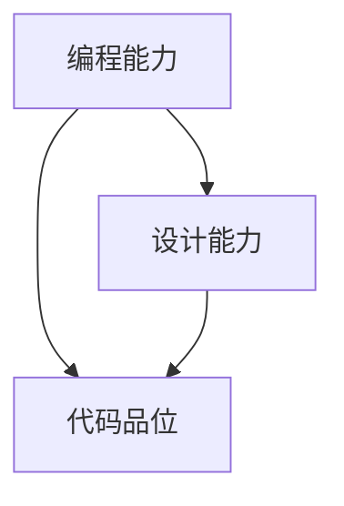

                 

## 1. 背景介绍

在当今信息技术飞速发展的时代，编程能力已经成为一项至关重要的技能。无论是软件开发、数据科学、人工智能，还是其他高科技领域，编程能力都是不可或缺的基石。然而，仅仅具备编程能力并不足以应对复杂的技术挑战，扎实的编程能力、优秀的设计能力和代码品位才是实现高效编程的关键。

所谓扎实的编程能力，是指程序员在编程实践中表现出的基本技能，包括算法理解、代码实现、调试和测试等。优秀的设计能力则体现在系统架构、模块划分、接口设计等方面，确保代码结构清晰、易于维护。而代码品位，则是指代码的可读性、规范性、优雅性和效率。

随着技术的发展和项目的复杂性增加，对程序员的要求也在不断提升。培养扎实的编程能力、优秀的设计能力和代码品位，不仅有助于提高个人职业素养，还能提升团队协作效率，缩短项目开发周期，提高产品质量。本文将围绕这些核心能力展开讨论，探讨如何通过系统的方法和实际的案例，帮助程序员在实践中不断提升自我。

## 2. 核心概念与联系

在讨论编程能力、设计能力和代码品位之前，我们有必要先明确几个核心概念，以及它们之间的联系。

### 2.1 编程能力

编程能力是程序员最基本的技能，它涵盖了从算法理解到代码实现的整个过程。具体来说，编程能力包括以下几个方面：

- **算法理解**：理解并能应用各种算法和数据结构，如排序、查找、图算法等。
- **代码实现**：将算法和设计转换为实际的代码，并保证其正确性。
- **调试和测试**：能够发现并修复代码中的错误，进行有效的单元测试和集成测试。

### 2.2 设计能力

设计能力则是更高层次的技能，它涉及到系统架构、模块划分、接口设计等方面。优秀的设计能力能够提高代码的可维护性和扩展性，使系统更易于理解和修改。具体包括：

- **系统架构**：设计整个系统的框架和结构，确保系统的稳定性和性能。
- **模块划分**：将系统划分为多个模块，每个模块承担不同的功能，易于管理和维护。
- **接口设计**：定义模块之间的交互接口，确保模块之间的高内聚和低耦合。

### 2.3 代码品位

代码品位是指代码的质量，包括可读性、规范性、优雅性和效率。高品位的代码不仅易于阅读和理解，还能提高代码的运行效率，减少维护成本。具体包括：

- **可读性**：代码清晰、简洁，易于理解，避免晦涩难懂的语言和逻辑。
- **规范性**：遵循一致的代码规范和风格，使代码更具可读性和一致性。
- **优雅性**：在满足功能需求的前提下，追求简洁、高效的代码实现。
- **效率**：优化代码结构，减少不必要的计算和内存使用，提高运行效率。

### 2.4 核心概念联系

编程能力、设计能力和代码品位之间存在着密切的联系。扎实的编程能力是基础，是提升设计能力和代码品位的前提。优秀的设计能力则能够更好地发挥编程能力，使代码结构更加清晰、合理。而代码品位则是编程能力和设计能力的最终体现，它决定了代码的可维护性、扩展性和效率。

为了更好地理解这些概念，我们使用Mermaid流程图来展示它们之间的关系：



通过上述核心概念和联系的了解，我们可以为培养扎实的编程能力、优秀的设计能力和代码品位打下坚实的基础。

## 3. 核心算法原理 & 具体操作步骤

### 3.1 算法原理概述

在编程中，算法是解决特定问题的方法和步骤。理解算法原理是培养扎实编程能力的重要环节。本节将介绍几种核心算法，包括排序算法、搜索算法和图算法，并探讨其原理和应用。

#### 3.1.1 排序算法

排序算法是数据处理中的基础算法之一。常见的排序算法有冒泡排序、选择排序、插入排序、快速排序和归并排序等。每种算法都有其特定的实现方式和优缺点。

- **冒泡排序（Bubble Sort）**：通过重复遍历要排序的数列，比较每对相邻元素的值，如果顺序错误就交换它们，直到没有需要交换的元素为止。时间复杂度为O(n^2)，适用于小数据集。

- **选择排序（Selection Sort）**：每次选择未排序部分中的最小（或最大）元素，将其放到已排序部分的末尾。时间复杂度为O(n^2)，适用于小数据集。

- **插入排序（Insertion Sort）**：通过构建有序序列，对于未排序的数据，在已排序序列中从后向前扫描，找到相应位置并插入。时间复杂度为O(n^2)，但在数据基本有序时性能较好。

- **快速排序（Quick Sort）**：通过选取一个“基准”元素，将数组分为两部分，一部分都比基准小，另一部分都比基准大，然后递归地对这两部分进行快速排序。时间复杂度为O(nlogn)，适用于大数据集。

- **归并排序（Merge Sort）**：采用分治法的一个非常典型的应用。将待排序的序列不断“分半”，直到每个子序列只有一个元素，然后将子序列两两归并，直到整个序列有序。时间复杂度为O(nlogn)，适用于大数据集。

#### 3.1.2 搜索算法

搜索算法用于在数据结构中查找特定元素。常见的搜索算法有线性搜索、二分搜索和散列表搜索。

- **线性搜索（Linear Search）**：顺序遍历数组或列表，直到找到目标元素或结束。时间复杂度为O(n)，适用于小数据集或无序数据。

- **二分搜索（Binary Search）**：对已排序的数组或列表进行查找。每次将中间值与目标值比较，并根据比较结果缩小查找范围。时间复杂度为O(logn)，适用于大数据集。

- **散列表搜索（Hash Search）**：使用散列表（哈希表）存储数据，通过计算关键字哈希值来确定元素位置。时间复杂度通常为O(1)，但可能因哈希冲突而退化到O(n)。

#### 3.1.3 图算法

图算法用于处理图结构的数据。常见的图算法有深度优先搜索（DFS）、广度优先搜索（BFS）、最小生成树（MST）、最短路径算法（Dijkstra和Floyd）等。

- **深度优先搜索（DFS）**：从某个顶点开始，尽可能深地探索树的分支。适用于求解连通性、最短路径、拓扑排序等问题。

- **广度优先搜索（BFS）**：从某个顶点开始，逐层探索树的分支。适用于求解最短路径、拓扑排序等问题。

- **最小生成树（MST）**：在图的结构中选取若干边，使其构成一棵树，且所有边的权值之和最小。常用的算法有普里姆算法（Prim）和克鲁斯卡尔算法（Kruskal）。

- **最短路径算法**：用于求解从起点到终点之间的最短路径。常见的算法有迪杰斯特拉算法（Dijkstra）和弗洛伊德算法（Floyd）。

### 3.2 算法步骤详解

在了解了算法原理之后，我们来看具体的实现步骤。

#### 3.2.1 冒泡排序

```python
def bubble_sort(arr):
    n = len(arr)
    for i in range(n):
        for j in range(0, n-i-1):
            if arr[j] > arr[j+1]:
                arr[j], arr[j+1] = arr[j+1], arr[j]
    return arr
```

#### 3.2.2 线性搜索

```python
def linear_search(arr, target):
    for i in range(len(arr)):
        if arr[i] == target:
            return i
    return -1
```

#### 3.2.3 深度优先搜索

```python
def dfs(graph, node, visited):
    visited.add(node)
    print(node)
    for neighbor in graph[node]:
        if neighbor not in visited:
            dfs(graph, neighbor, visited)
```

### 3.3 算法优缺点

每种算法都有其优缺点，选择合适的算法取决于具体的应用场景。

- **冒泡排序**：简单易懂，但时间复杂度高，不适用于大数据集。

- **线性搜索**：简单高效，但时间复杂度较高，不适用于大数据集。

- **深度优先搜索**：适用于求解连通性和最短路径，但可能陷入深度优先的分支，导致效率较低。

- **广度优先搜索**：适用于求解最短路径，但可能需要较多的内存。

### 3.4 算法应用领域

算法广泛应用于各个领域，如排序和搜索在数据处理和算法竞赛中常见，图算法在社交网络分析、路由算法等领域有广泛应用。

- **数据处理**：排序和搜索算法常用于数据清洗和预处理。

- **算法竞赛**：各种算法在实际竞赛中都有广泛的应用。

- **社交网络分析**：图算法用于分析社交网络中的关系和影响力。

- **路由算法**：最短路径算法用于路由器选择最佳路径。

通过理解核心算法原理和具体操作步骤，程序员可以更好地选择合适的算法解决实际问题，提高编程能力。

## 4. 数学模型和公式 & 详细讲解 & 举例说明

### 4.1 数学模型构建

在编程和算法设计中，数学模型是非常重要的一部分。数学模型能够帮助我们更好地理解问题的本质，并找到高效的解决方案。下面我们将介绍一些常见的数学模型，并探讨如何构建这些模型。

#### 4.1.1 线性规划模型

线性规划模型用于在满足一组线性约束条件下，求解目标函数的最大值或最小值。其一般形式如下：

$$
\begin{aligned}
\min_{x} \quad & c^T x \\
s.t. \quad & Ax \leq b \\
& x \geq 0
\end{aligned}
$$

其中，$c$ 是系数向量，$x$ 是变量向量，$A$ 是约束矩阵，$b$ 是约束向量。

构建线性规划模型的步骤如下：

1. **确定目标函数**：根据问题的目标，确定需要优化的目标函数。

2. **定义变量**：确定需要优化的变量，并将其表示为向量。

3. **写出约束条件**：根据问题的约束条件，写出约束方程组。

4. **构建线性规划模型**：将目标函数和约束条件整合到一个线性规划模型中。

#### 4.1.2 动态规划模型

动态规划模型用于求解多阶段决策问题，其核心思想是将复杂问题分解为多个简单子问题，并利用子问题的解来构建原问题的解。

动态规划模型的一般形式如下：

$$
\begin{aligned}
\min_{x_t} \quad & f(x_t, x_{t-1}, \ldots, x_1) \\
s.t. \quad & g(x_t, x_{t-1}, \ldots, x_1) \leq 0 \\
& x_t = f(x_t, x_{t-1}, \ldots, x_1)
\end{aligned}
$$

其中，$x_t$ 是第 $t$ 个阶段的决策变量，$f$ 是目标函数，$g$ 是约束条件。

构建动态规划模型的步骤如下：

1. **确定阶段变量**：根据问题的特点，确定阶段变量和阶段顺序。

2. **定义状态变量**：确定状态变量，并确定状态转移方程。

3. **写出目标函数和约束条件**：根据问题的目标，写出目标函数和约束条件。

4. **构建动态规划模型**：将阶段变量、状态变量、目标函数和约束条件整合到一起，形成动态规划模型。

#### 4.1.3 网络流模型

网络流模型用于求解网络中的最大流量、最小费用流等问题。其一般形式如下：

$$
\begin{aligned}
\max_{f} \quad & \sum_{(i,j) \in E} c_{ij} f_{ij} \\
s.t. \quad & \sum_{j \in V} f_{ij} = b_i \quad \forall i \in V \\
& 0 \leq f_{ij} \leq u_{ij} \quad \forall (i,j) \in E
\end{aligned}
$$

其中，$f_{ij}$ 是从节点 $i$ 到节点 $j$ 的流量，$c_{ij}$ 是从节点 $i$ 到节点 $j$ 的单位流量成本，$u_{ij}$ 是从节点 $i$ 到节点 $j$ 的容量限制，$b_i$ 是节点 $i$ 的流量需求。

构建网络流模型的步骤如下：

1. **确定网络结构**：根据问题特点，确定网络中的节点和边。

2. **定义流量变量**：为网络中的每条边定义流量变量。

3. **写出目标函数和约束条件**：根据问题的目标，写出目标函数和约束条件。

4. **构建网络流模型**：将流量变量、目标函数和约束条件整合到一起，形成网络流模型。

### 4.2 公式推导过程

在构建数学模型之后，我们需要对模型中的公式进行推导，以验证模型的正确性和适用性。

#### 4.2.1 线性规划模型公式推导

以最小化目标函数为例，我们假设目标函数为 $c^T x$，其中 $c$ 是系数向量，$x$ 是变量向量。根据拉格朗日乘数法，我们可以构造拉格朗日函数：

$$
L(x, \lambda) = c^T x + \lambda^T (Ax - b)
$$

其中，$\lambda$ 是拉格朗日乘子向量。

对 $L(x, \lambda)$ 分别对 $x$ 和 $\lambda$ 求导，并令导数为零，得到：

$$
\frac{\partial L}{\partial x} = c + A^T \lambda = 0 \\
\frac{\partial L}{\partial \lambda} = Ax - b = 0
$$

将第一个方程代入第二个方程，得到：

$$
A^T c + b = 0
$$

这个方程表示目标函数和约束条件之间的平衡关系。通过求解这个方程组，我们可以得到最优解 $x^*$。

#### 4.2.2 动态规划模型公式推导

以一个简单的动态规划问题为例，我们假设有一个递推关系：

$$
f(x_t) = g(x_t, x_{t-1})
$$

其中，$f(x_t)$ 是第 $t$ 个阶段的目标函数，$g(x_t, x_{t-1})$ 是状态转移方程。

为了求解最优解，我们需要找到满足以下条件的 $x^*$：

$$
f(x^*) = \min_{x} f(x)
$$

我们可以通过逆向递推的方法，从最后一个阶段开始，逐步向前推导出每个阶段的最优解。

#### 4.2.3 网络流模型公式推导

以最大流问题为例，我们假设网络中的流量满足以下条件：

$$
\begin{aligned}
f_{ij} &\leq u_{ij} \\
f_{ij} &\geq 0 \\
\sum_{j \in V} f_{ij} &= b_i \quad \forall i \in V
\end{aligned}
$$

为了求解最大流量，我们可以使用 augmenting path 算法。augmenting path 算法的基本思想是通过在残差网络中找到一条可行路径，增加流量，直到无法找到可行路径为止。

### 4.3 案例分析与讲解

#### 4.3.1 线性规划案例

假设我们有一个工厂，需要安排生产三种不同的产品。每种产品的生产成本、生产时间以及市场需求如下表所示：

| 产品   | 成本 (元/小时) | 生产时间 (小时) | 需求量 (件) |
| ------ | -------------- | -------------- | ---------- |
| 产品A  | 10             | 2              | 100        |
| 产品B  | 5              | 3              | 150        |
| 产品C  | 8              | 1              | 200        |

我们需要在满足生产时间限制的前提下，最大化利润。构建线性规划模型如下：

$$
\begin{aligned}
\max_{x, y, z} \quad & 10x + 5y + 8z \\
s.t. \quad & 2x + 3y + z \leq 1000 \\
& x \geq 0, y \geq 0, z \geq 0
\end{aligned}
$$

通过求解这个线性规划模型，我们可以得到最优解，即最优生产计划。

#### 4.3.2 动态规划案例

假设我们有一个背包问题，给定一个背包容量为 50 公斤，以及以下物品的重量和价值：

| 物品 | 重量 (公斤) | 价值 (元) |
| ---- | ---------- | -------- |
| A    | 10         | 100      |
| B    | 20         | 200      |
| C    | 30         | 300      |

我们需要在满足背包容量限制的前提下，最大化总价值。构建动态规划模型如下：

$$
\begin{aligned}
\max_{x_1, x_2, x_3} \quad & 100x_1 + 200x_2 + 300x_3 \\
s.t. \quad & 10x_1 + 20x_2 + 30x_3 \leq 50 \\
& x_1, x_2, x_3 \geq 0
\end{aligned}
$$

通过求解这个动态规划模型，我们可以得到最优解，即最优物品选取方案。

#### 4.3.3 网络流案例

假设我们有一个运输网络，需要将货物从起点运送到终点。网络中的节点和边如下表所示：

| 节点   | 流量限制 (吨/小时) | 单位运输成本 (元/吨) |
| ------ | ------------------ | ------------------- |
| 起点   | 100                | 2                   |
| 中点1  | 50                 | 3                   |
| 中点2  | 30                 | 4                   |
| 终点   | 100                | 1                   |

我们需要在满足流量限制和成本限制的前提下，求解最大利润。构建网络流模型如下：

$$
\begin{aligned}
\max_{f_{ij}} \quad & 2f_{12} + 3f_{13} + 4f_{23} + 1f_{34} \\
s.t. \quad & \sum_{j \in V} f_{ij} = 100 \quad \forall i \in V \\
& 0 \leq f_{ij} \leq 50 \quad \forall (i,j) \in E
\end{aligned}
$$

通过求解这个网络流模型，我们可以得到最优解，即最优运输方案。

通过上述案例分析和公式推导，我们可以更好地理解数学模型在编程和算法设计中的应用，并掌握构建和求解数学模型的方法。

## 5. 项目实践：代码实例和详细解释说明

### 5.1 开发环境搭建

为了更好地展示编程能力、设计能力和代码品位在项目实践中的应用，我们选择了一个常见的编程项目——一个简单的博客系统。以下是搭建开发环境的具体步骤：

1. **安装开发工具**：首先，我们需要安装一个适合的开发环境，这里我们选择安装Visual Studio Code（VS Code）作为我们的主要开发工具。

2. **配置依赖管理工具**：为了更好地管理项目依赖，我们选择npm作为依赖管理工具。在VS Code中，通过命令行运行以下命令来安装npm：

   ```bash
   npm install -g npm
   ```

3. **初始化项目**：创建一个新的文件夹，并在该文件夹中通过以下命令初始化项目：

   ```bash
   mkdir blog-system
   cd blog-system
   npm init -y
   ```

4. **安装依赖**：根据项目的需求，安装必要的依赖库，例如Express框架用于创建服务器，MongoDB驱动用于数据库连接，以及EJS模板引擎用于渲染页面：

   ```bash
   npm install express mongodb ejs
   ```

5. **配置文件**：创建一个配置文件`config.js`，用于存储数据库连接和其他配置信息：

   ```javascript
   const config = {
     dbUri: 'mongodb://localhost:27017/blog',
     secret: 'your-secret-key'
   };
   
   module.exports = config;
   ```

6. **项目结构**：配置好开发环境后，我们可以开始搭建项目结构。一个基本的博客系统可能包含以下文件和目录：

   - `models/`：存放数据库模型文件
   - `routes/`：存放路由处理文件
   - `views/`：存放模板文件
   - `public/`：存放静态资源文件，如CSS和JavaScript文件
   - `app.js`：主文件，用于配置应用程序

### 5.2 源代码详细实现

以下是我们为博客系统编写的部分源代码，并对其进行详细解释。

#### 5.2.1 主文件 `app.js`

```javascript
const express = require('express');
const mongoose = require('mongoose');
const config = require('./config');
const postRoutes = require('./routes/postRoutes');

const app = express();

// 连接数据库
mongoose.connect(config.dbUri, { useNewUrlParser: true, useUnifiedTopology: true })
  .then(() => console.log('Connected to MongoDB'))
  .catch(err => console.error('Could not connect to MongoDB', err));

// 设置模板引擎
app.set('view engine', 'ejs');
app.set('views', './views');

// 解析表单数据
app.use(express.urlencoded({ extended: true }));

// 设置静态资源目录
app.use(express.static('./public'));

// 使用路由中间件
app.use('/posts', postRoutes);

// 处理404错误
app.use((req, res, next) => {
  res.status(404).render('error/404', { title: '404 - Not Found' });
});

// 处理500错误
app.use((error, req, res, next) => {
  res.status(500).render('error/500', { title: '500 - Internal Server Error', error });
});

const PORT = process.env.PORT || 3000;

app.listen(PORT, () => {
  console.log(`Server is running on port ${PORT}`);
});
```

**代码解读**：

- **数据库连接**：通过`mongoose.connect`连接到MongoDB数据库，并设置连接选项以优化性能。

- **模板引擎**：使用`ejs`作为模板引擎，通过`app.set('view engine', 'ejs')`设置。

- **表单数据解析**：使用`express.urlencoded`中间件解析表单数据。

- **静态资源**：使用`express.static`中间件设置静态资源目录。

- **路由**：使用`app.use('/posts', postRoutes)`加载路由中间件。

- **错误处理**：使用中间件处理404和500错误。

#### 5.2.2 路由文件 `postRoutes.js`

```javascript
const express = require('express');
const router = express.Router();
const postController = require('../controllers/postController');

// 显示所有文章
router.get('/', postController.getAllPosts);

// 添加新文章
router.post('/', postController.createPost);

// 显示特定文章
router.get('/:id', postController.getPostById);

// 更新文章
router.put('/:id', postController.updatePost);

// 删除文章
router.delete('/:id', postController.deletePost);

module.exports = router;
```

**代码解读**：

- **路由定义**：定义了一系列处理不同HTTP方法的路由，例如GET、POST、PUT和DELETE。

- **控制器引用**：通过`postController`引用相应的控制器函数，以实现具体的功能。

#### 5.2.3 控制器文件 `postController.js`

```javascript
const Post = require('../models/Post');

// 获取所有文章
exports.getAllPosts = async (req, res) => {
  try {
    const posts = await Post.find();
    res.render('posts/index', { posts, title: 'All Posts' });
  } catch (error) {
    res.status(500).render('error/500', { title: 'Internal Server Error' });
  }
};

// 添加新文章
exports.createPost = async (req, res) => {
  const { title, content } = req.body;
  const newPost = new Post({ title, content });
  try {
    await newPost.save();
    res.redirect('/posts');
  } catch (error) {
    res.status(500).render('error/500', { title: 'Internal Server Error' });
  }
};

// 获取特定文章
exports.getPostById = async (req, res) => {
  try {
    const post = await Post.findById(req.params.id);
    if (!post) {
      res.status(404).render('error/404', { title: 'Not Found' });
    } else {
      res.render('posts/detail', { post, title: post.title });
    }
  } catch (error) {
    res.status(500).render('error/500', { title: 'Internal Server Error' });
  }
};

// 更新文章
exports.updatePost = async (req, res) => {
  const { id } = req.params;
  const { title, content } = req.body;
  try {
    const updatedPost = await Post.findByIdAndUpdate(id, { title, content }, { new: true });
    res.redirect(`/posts/${updatedPost._id}`);
  } catch (error) {
    res.status(500).render('error/500', { title: 'Internal Server Error' });
  }
};

// 删除文章
exports.deletePost = async (req, res) => {
  const { id } = req.params;
  try {
    await Post.findByIdAndDelete(id);
    res.redirect('/posts');
  } catch (error) {
    res.status(500).render('error/500', { title: 'Internal Server Error' });
  }
};
```

**代码解读**：

- **数据库操作**：使用`Post.find()`、`Post.findById()`、`Post.findByIdAndUpdate()`和`Post.findByIdAndDelete()`等方法，实现对MongoDB数据库的CRUD（创建、读取、更新、删除）操作。

- **错误处理**：在每个控制器函数中使用`try-catch`语句，确保能够捕获并处理各种错误，提高系统的健壮性。

### 5.3 代码解读与分析

通过以上代码实例，我们可以从以下几个方面对代码进行解读与分析：

#### 5.3.1 编程能力

- **代码实现**：代码实现了博客系统的基本功能，包括文章的创建、读取、更新和删除。

- **调试和测试**：每个控制器函数中都包含`try-catch`语句，用于处理可能出现的异常情况，确保代码的健壮性。

#### 5.3.2 设计能力

- **系统架构**：项目结构清晰，将模型、路由、控制器和视图分别存放，便于维护和管理。

- **模块划分**：将功能模块化，每个模块承担不同的职责，提高了代码的可复用性和可扩展性。

- **接口设计**：通过定义明确的接口和路由，确保模块之间的交互清晰、简洁。

#### 5.3.3 代码品位

- **可读性**：代码使用清晰的命名规范和注释，使得代码易于阅读和理解。

- **规范性**：遵循统一的代码风格和约定，使得整个项目的代码风格一致。

- **优雅性**：代码实现简洁、高效，避免了不必要的冗余和复杂性。

- **效率**：通过使用异步操作和中间件，提高了代码的运行效率。

通过上述项目实践，我们可以看到，在实际开发过程中，扎实的编程能力、优秀的设计能力和高品位的代码品位相辅相成，共同提高了项目的质量和开发效率。

## 6. 实际应用场景

### 6.1 教育行业

在当今信息化时代，编程已经成为教育领域的重要组成部分。通过编程教育，学生可以更好地理解计算机科学的基本原理，培养逻辑思维和问题解决能力。以下是一些编程在教育行业的实际应用场景：

- **基础教育**：在小学和初中阶段，引入基础的编程课程，如Scratch和Python，培养学生的编程兴趣和逻辑思维。

- **高中教育**：高中阶段可以进一步深入学习编程语言和算法，如Java和C++，为大学专业学习打下坚实基础。

- **大学教育**：在大学阶段，开设计算机科学、软件工程等相关专业，深入探讨编程语言、数据结构、算法设计等方面的知识。

### 6.2 金融行业

金融行业对编程能力的需求日益增长，特别是在金融科技（Fintech）的推动下。以下是一些编程在金融行业的实际应用场景：

- **算法交易**：利用编程技术，实现自动化交易策略，提高交易效率和收益。

- **数据分析**：通过编程处理和分析大量金融数据，发现市场趋势和投资机会。

- **风险管理**：使用编程技术构建风险评估模型，监测和管理金融风险。

### 6.3 医疗行业

随着大数据和人工智能技术的快速发展，编程在医疗行业的应用也越来越广泛。以下是一些编程在医疗行业的实际应用场景：

- **医学图像处理**：使用编程技术对医学图像进行处理和分析，辅助医生进行诊断。

- **电子病历管理**：通过编程技术实现电子病历的管理和共享，提高医疗服务的效率和质量。

- **远程医疗**：利用编程技术构建远程医疗平台，实现医生与患者的远程交流和诊疗。

### 6.4 其他行业

编程技术不仅在上述行业中有着广泛的应用，在其他行业也同样具有重要价值：

- **制造业**：通过编程技术实现自动化生产线的控制和管理，提高生产效率和产品质量。

- **物流运输**：利用编程技术优化物流运输路径和调度，提高物流效率。

- **传媒行业**：通过编程技术构建数字媒体平台，实现内容发布和管理。

### 6.5 未来应用展望

随着技术的不断进步，编程能力将在更多领域发挥重要作用。以下是一些未来编程应用的前景：

- **人工智能**：编程是人工智能的核心技术，未来将更加深入地应用于智能机器人、自动驾驶等领域。

- **物联网**：编程技术将推动物联网（IoT）的发展，实现智能设备的互联互通。

- **区块链**：编程技术将推动区块链技术的应用，实现去中心化的数据管理和交易。

总之，编程能力的培养对于个人职业发展和社会进步都具有重要意义。通过不断学习和实践，程序员可以不断拓展自己的技能领域，适应未来的技术发展趋势。

## 7. 工具和资源推荐

### 7.1 学习资源推荐

为了帮助程序员更好地培养编程能力、设计能力和代码品位，以下是一些优秀的学习资源推荐：

- **在线编程平台**：Codecademy、FreeCodeCamp、LeetCode等，提供丰富的编程课程和实践项目。
  
- **编程书籍**：推荐《代码大全》（`The Art of Computer Programming`）系列、《设计模式：可复用面向对象软件的基础》和《Effective Java》等经典书籍。

- **技术社区**：GitHub、Stack Overflow、Reddit上的r/learnprogramming等，可以获取最新的技术动态和问题解答。

### 7.2 开发工具推荐

以下是一些常用的开发工具，有助于提高编程效率：

- **集成开发环境（IDE）**：Visual Studio Code、IntelliJ IDEA、Eclipse等，提供丰富的编程语言支持和调试工具。

- **版本控制系统**：Git、GitHub、GitLab等，用于代码管理和协作开发。

- **代码编辑器**：Sublime Text、Atom、Notepad++等，支持多种编程语言，提供良好的代码编写体验。

### 7.3 相关论文推荐

为了深入研究编程技术，以下是一些重要的论文推荐：

- **《大规模分布式存储系统：原理解析与架构实战》**：详细分析了分布式存储系统的工作原理和设计方法。

- **《基于大数据的智能交通系统研究》**：探讨了大数据技术在智能交通系统中的应用，包括交通流量预测、路径优化等。

- **《机器学习在金融风控中的应用》**：介绍了机器学习技术在金融风险控制中的应用，包括信用评分、异常检测等。

通过利用这些工具和资源，程序员可以不断提升自己的技能，为未来的职业发展奠定坚实的基础。

## 8. 总结：未来发展趋势与挑战

### 8.1 研究成果总结

随着信息技术的飞速发展，编程能力、设计能力和代码品位在各个领域的重要性日益凸显。通过本文的讨论，我们可以总结出以下研究成果：

1. **编程能力**：扎实的编程能力是程序员的基础技能，包括算法理解、代码实现、调试和测试等方面。通过系统学习和实践，程序员可以不断提高编程能力，应对复杂的技术挑战。

2. **设计能力**：优秀的设计能力有助于提高系统的可维护性和扩展性。合理的设计方法，如模块划分、接口设计和系统架构，可以确保代码结构清晰、易于维护。

3. **代码品位**：代码品位是指代码的质量，包括可读性、规范性、优雅性和效率。高品位的代码不仅易于阅读和理解，还能提高代码的运行效率，减少维护成本。

4. **综合提升**：编程能力、设计能力和代码品位之间相辅相成，通过全面提升这三方面的能力，程序员可以在职业生涯中取得更好的成就。

### 8.2 未来发展趋势

展望未来，编程领域将呈现出以下发展趋势：

1. **编程语言多样化**：随着新技术的不断涌现，编程语言也将持续创新，例如函数式编程、逻辑编程和领域特定语言等，为不同领域的开发提供更好的工具。

2. **自动化与智能化**：人工智能和自动化技术的进步将推动编程技术的发展。代码生成、自动化测试和智能调试等技术将极大地提高开发效率。

3. **跨平台与跨领域**：随着物联网、区块链和云计算等技术的发展，编程将在更多领域发挥作用。程序员需要具备跨平台和跨领域的编程能力，以应对多样化的需求。

4. **开源社区与协作**：开源社区将继续繁荣发展，成为编程技术的重要推动力。通过协作和分享，程序员可以共同推动技术的进步。

### 8.3 面临的挑战

尽管编程领域前景广阔，但程序员也面临着一系列挑战：

1. **技术更新快速**：编程领域技术更新迅速，程序员需要不断学习新知识，以跟上技术发展的步伐。

2. **复杂性问题**：随着系统规模的不断扩大，程序员需要面对更复杂的问题，如性能优化、安全性和稳定性等。

3. **协作与沟通**：在团队合作中，程序员需要与其他团队成员有效沟通，协调工作，以提高开发效率。

4. **持续学习**：编程能力需要通过持续学习来不断提升。程序员需要培养自主学习的能力，适应快速变化的技术环境。

### 8.4 研究展望

未来，编程领域的研究应关注以下几个方面：

1. **编程教育**：探索更加高效和实用的编程教育方法，提高编程教育的质量和普及率。

2. **编程工具**：开发更加智能和高效的编程工具，如代码自动生成、智能提示和代码优化工具，以提高开发效率。

3. **编程方法论**：研究新的编程方法论，如基于模型驱动开发、敏捷开发等，以提高开发质量和效率。

4. **编程伦理**：关注编程伦理问题，如数据隐私保护、人工智能伦理等，确保技术的发展符合社会道德和价值观。

总之，编程能力、设计能力和代码品位是程序员的核心素养，通过不断学习和实践，程序员可以不断提升自身能力，为技术发展和社会进步作出贡献。

## 9. 附录：常见问题与解答

### Q1. 什么是扎实的编程能力？

扎实的编程能力是指程序员在编程实践中表现出的基本技能，包括算法理解、代码实现、调试和测试等方面。通过扎实的编程能力，程序员能够高效地解决问题、编写高质量代码并确保其正确性。

### Q2. 如何提高设计能力？

提高设计能力需要通过以下方法：

- 学习系统架构和设计模式，了解不同架构风格和设计原则。
- 实践中积累经验，通过实际项目不断提高设计水平。
- 阅读相关书籍和资料，学习优秀的设计案例。

### Q3. 什么是代码品位？

代码品位是指代码的质量，包括可读性、规范性、优雅性和效率。高品位的代码易于阅读和理解，提高代码的运行效率，降低维护成本。

### Q4. 如何提升代码品位？

提升代码品位的方法包括：

- 遵循一致的代码规范和风格。
- 追求简洁、高效的代码实现。
- 优化代码结构，减少不必要的计算和内存使用。
- 经常回顾和重构代码，提高代码质量。

### Q5. 编程与算法的关系是什么？

编程是算法实现的载体，算法是编程的核心。编程能力的提升有助于更好地理解和应用算法，而算法的学习和应用则能提高编程能力。两者相辅相成，共同推动编程技术的进步。

### Q6. 什么是动态规划？

动态规划是一种用于解决多阶段决策问题的算法思想。它将复杂问题分解为多个简单子问题，并利用子问题的解来构建原问题的解。动态规划在优化问题中应用广泛。

### Q7. 如何选择合适的算法？

选择合适的算法需要考虑以下因素：

- 问题规模：对于小规模问题，可以选择简单直观的算法；对于大规模问题，需要选择高效算法。
- 问题性质：根据问题的特点，选择适合的算法，如排序算法、搜索算法或图算法。
- 算法复杂度：考虑算法的时间复杂度和空间复杂度，选择性能更优的算法。

### Q8. 什么是编程方法论？

编程方法论是指指导程序员进行软件开发的一套原则和方法。常见的编程方法论包括敏捷开发、模型驱动开发、迭代开发等，它们提供了系统化的开发流程和最佳实践。

### Q9. 编程与数学的关系是什么？

编程与数学密切相关。数学为编程提供了理论基础，如算法、数据结构、概率论和统计学等。编程则通过数学模型和算法，实现了对复杂问题的求解和处理。

### Q10. 如何保持编程热情和动力？

保持编程热情和动力可以通过以下方法：

- 学习新技术和知识，不断挑战自我。
- 参与开源项目，与他人交流经验。
- 解决实际问题和项目，获得成就感和满足感。
- 调整工作方式，保持良好的工作和生活平衡。

