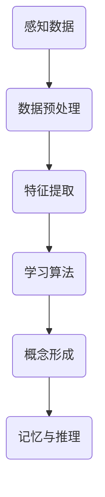
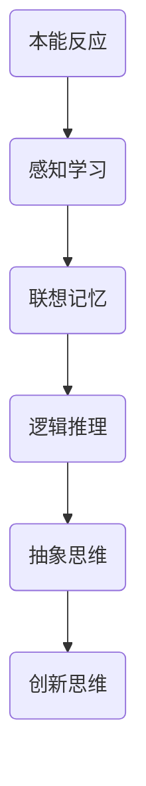
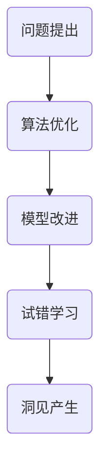
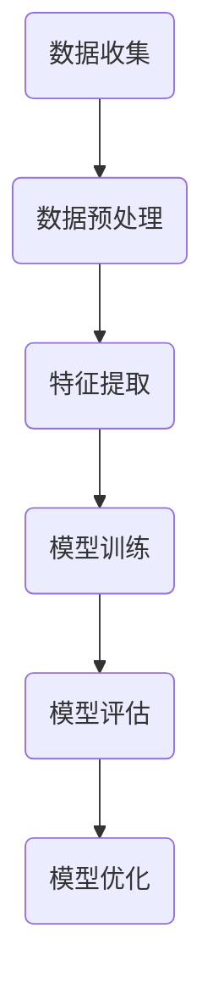
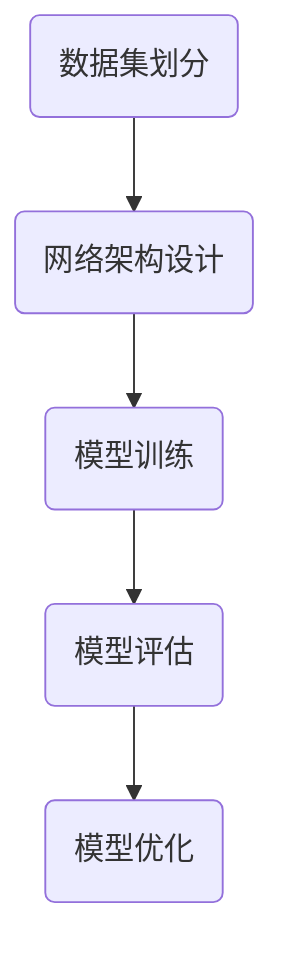
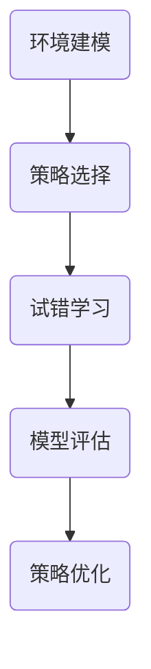

                 

关键词：人工智能、认知科学、抽象思维、算法设计、创新思维

> 摘要：本文将探讨思想的演变过程，从概念的形成到洞见的产生。通过分析人工智能和认知科学的研究成果，本文将揭示如何通过深入理解概念和运用创新思维，实现从无到有的突破，为技术发展和科学研究提供新的视角。

## 1. 背景介绍

思想的演变是人类文明进步的重要驱动力。自古以来，人类通过不断的思考、探索和实践，不断深化对世界的认识，推动了科学技术的发展。然而，随着人工智能和认知科学的兴起，我们开始重新审视人类思维的本质，以及如何通过技术手段提高我们的思维能力。

人工智能（AI）作为现代科技的明星领域，正以惊人的速度改变着我们的生活。从简单的机器人到复杂的自我学习系统，AI已经渗透到各个行业，带来了前所未有的便利和效率。与此同时，认知科学作为一门跨学科的研究领域，试图揭示人类思维的内在机制，探索如何通过技术手段增强人类的认知能力。

在这个背景下，本文将探讨思想的演变过程，从概念的形成到洞见的产生。我们将结合人工智能和认知科学的研究成果，探讨如何通过深入理解概念和运用创新思维，实现从无到有的突破。这不仅对技术发展具有重要意义，也对科学研究提供了新的视角。

## 2. 核心概念与联系

### 2.1. 概念的形成

概念是思维的基石，是人们对客观世界的理解和抽象。概念的形成是一个复杂的过程，涉及感知、记忆、推理等多个认知模块。在人工智能领域，概念的形成可以借助机器学习算法实现。例如，深度学习模型通过大量数据的训练，可以自动提取出抽象的概念。

**Mermaid 流程图：概念形成的流程**



### 2.2. 思维的进化

人类思维的进化是一个长期的过程，从简单的本能反应到复杂的抽象思考，经历了无数次的演化和适应。在认知科学中，思维的进化被视为一种适应性进化，是生物进化的延续。人工智能的发展，为研究思维的进化提供了新的工具和视角。

**Mermaid 流程图：思维的进化过程**



### 2.3. 洞见的产生

洞见是思维的高级形式，是人们在面对复杂问题时产生的深刻理解和创新观点。洞见的产生依赖于人类独特的认知能力，如联想、归纳、推理等。在人工智能领域，洞见的产生可以通过算法的优化和模型的改进实现。例如，强化学习算法可以在不断试错中找到问题的最佳解决方案，从而产生新的洞见。

**Mermaid 流程图：洞见的产生过程**



## 3. 核心算法原理 & 具体操作步骤

### 3.1. 算法原理概述

在思想的演变过程中，算法起到了关键作用。算法不仅是解决问题的工具，也是思维的延伸。本节将介绍几种核心算法原理，包括机器学习、深度学习和强化学习，并阐述它们在思想演变中的应用。

### 3.2. 算法步骤详解

#### 3.2.1. 机器学习

机器学习是一种通过数据训练模型，使其具备预测和决策能力的方法。其基本步骤如下：

1. 数据收集：收集大量相关的数据。
2. 数据预处理：对数据进行清洗和标准化。
3. 特征提取：从数据中提取有用的特征。
4. 模型训练：使用特征数据训练模型。
5. 模型评估：评估模型的预测能力。
6. 模型优化：根据评估结果优化模型参数。

**Mermaid 流程图：机器学习算法步骤**



#### 3.2.2. 深度学习

深度学习是机器学习的一个分支，通过多层神经网络模型实现数据的自动特征提取和抽象。其基本步骤如下：

1. 数据集划分：将数据集划分为训练集、验证集和测试集。
2. 网络架构设计：设计适合问题的神经网络架构。
3. 模型训练：使用训练集训练神经网络模型。
4. 模型评估：使用验证集评估模型性能。
5. 模型优化：根据评估结果优化模型参数。

**Mermaid 流程图：深度学习算法步骤**



#### 3.2.3. 强化学习

强化学习是一种通过试错学习最优策略的算法。其基本步骤如下：

1. 环境建模：建立环境模型，包括状态空间和动作空间。
2. 策略选择：选择合适的策略函数。
3. 试错学习：在环境中进行试错学习，更新策略函数。
4. 模型评估：评估策略函数的性能。
5. 策略优化：根据评估结果优化策略函数。

**Mermaid 流程图：强化学习算法步骤**



### 3.3. 算法优缺点

每种算法都有其优缺点，适用于不同的应用场景。下面是机器学习、深度学习和强化学习的一些优缺点：

#### 3.3.1. 机器学习

**优点**：
- 灵活性强，可以处理各种类型的数据。
- 预测准确性高。

**缺点**：
- 需要大量数据进行训练。
- 对数据质量要求高。

#### 3.3.2. 深度学习

**优点**：
- 自动提取抽象特征，减少人工干预。
- 预测准确性高。

**缺点**：
- 计算资源需求大。
- 对数据分布有较高要求。

#### 3.3.3. 强化学习

**优点**：
- 可以在复杂环境中找到最优策略。
- 自适应性强。

**缺点**：
- 学习过程较长，需要大量试错。
- 对环境模型要求高。

### 3.4. 算法应用领域

不同算法在思想演变中的应用领域有所不同。下面是几种常见的应用领域：

#### 3.4.1. 机器学习

- 画像分析
- 金融服务
- 物联网

#### 3.4.2. 深度学习

- 自动驾驶
- 图像识别
- 自然语言处理

#### 3.4.3. 强化学习

- 游戏开发
- 能源管理
- 机器人控制

## 4. 数学模型和公式 & 详细讲解 & 举例说明

### 4.1. 数学模型构建

在思想的演变过程中，数学模型起到了关键作用。数学模型可以帮助我们理解复杂现象，揭示内在规律。以下是一些常见的数学模型：

#### 4.1.1. 神经网络模型

神经网络模型是深度学习的基础。其基本公式如下：

$$
\hat{y} = \sigma(\sum_{i=1}^{n} w_i \cdot x_i)
$$

其中，$\hat{y}$为输出，$\sigma$为激活函数，$w_i$为权重，$x_i$为输入。

#### 4.1.2. 强化学习模型

强化学习模型的基本公式如下：

$$
Q(s, a) = r + \gamma \max_{a'} Q(s', a')
$$

其中，$Q(s, a)$为状态-动作价值函数，$r$为即时奖励，$\gamma$为折扣因子，$s'$为下一状态，$a'$为最佳动作。

#### 4.1.3. 机器学习模型

机器学习模型的基本公式如下：

$$
P(y|X) = \frac{e^{\theta^T X}}{1 + e^{\theta^T X}}
$$

其中，$P(y|X)$为条件概率，$\theta$为模型参数，$X$为特征向量。

### 4.2. 公式推导过程

#### 4.2.1. 神经网络模型推导

神经网络模型的推导基于多层感知器（MLP）的基本原理。多层感知器是一种前馈神经网络，其基本结构包括输入层、隐藏层和输出层。以下是神经网络模型的推导过程：

1. 输入层到隐藏层的推导：

$$
z_i = \sum_{j=1}^{n} w_{ij} \cdot x_j + b_i
$$

2. 隐藏层到输出层的推导：

$$
\hat{y}_i = \sigma(z_i)
$$

其中，$z_i$为隐藏层节点的输入，$\sigma$为激活函数，$w_{ij}$为输入层到隐藏层的权重，$b_i$为隐藏层节点的偏置。

3. 输出层的推导：

$$
\hat{y} = \sigma(\sum_{i=1}^{n} w_i \cdot z_i + b)
$$

其中，$\hat{y}$为输出，$w_i$为隐藏层到输出层的权重，$b$为输出层的偏置。

#### 4.2.2. 强化学习模型推导

强化学习模型的推导基于马尔可夫决策过程（MDP）的基本原理。MDP的基本公式如下：

$$
\pi(a|s) = \frac{e^{\theta^T s}}{1 + \sum_{i=1}^{n} e^{\theta^T s_i}}
$$

其中，$\pi(a|s)$为在状态$s$下选择动作$a$的概率，$\theta$为模型参数，$s$为状态向量，$s_i$为状态集合。

强化学习模型的推导过程如下：

1. 状态-动作价值函数的推导：

$$
Q(s, a) = r + \gamma \max_{a'} Q(s', a')
$$

2. 策略函数的推导：

$$
\pi(a|s) = \frac{e^{\theta^T s}}{1 + \sum_{i=1}^{n} e^{\theta^T s_i}}
$$

其中，$r$为即时奖励，$\gamma$为折扣因子。

#### 4.2.3. 机器学习模型推导

机器学习模型的推导基于概率模型的基本原理。概率模型的基本公式如下：

$$
P(y|X) = \frac{e^{\theta^T X}}{1 + e^{\theta^T X}}
$$

其中，$P(y|X)$为在特征向量$X$下输出$y$的概率，$\theta$为模型参数。

机器学习模型的推导过程如下：

1. 线性回归模型的推导：

$$
y = \theta^T X + \epsilon
$$

其中，$y$为输出，$X$为特征向量，$\theta$为模型参数，$\epsilon$为误差项。

2. 逻辑回归模型的推导：

$$
P(y=1|X) = \frac{e^{\theta^T X}}{1 + e^{\theta^T X}}
$$

其中，$P(y=1|X)$为在特征向量$X$下输出为1的概率。

### 4.3. 案例分析与讲解

#### 4.3.1. 神经网络模型案例

假设我们有一个简单的神经网络模型，用于实现二分类任务。输入层有3个节点，隐藏层有2个节点，输出层有1个节点。激活函数使用ReLU函数。以下是模型的参数设置：

输入层到隐藏层的权重：$w_{11} = 1, w_{12} = -1, w_{13} = 2$
隐藏层到输出层的权重：$w_1 = 2, w_2 = -1$
隐藏层节点的偏置：$b_1 = 1, b_2 = 0$
输出层的偏置：$b = 0$

给定一个输入向量$X = [1, 0, 1]$，计算输出$\hat{y}$：

1. 隐藏层节点的输入：

$$
z_1 = w_{11} \cdot x_1 + w_{12} \cdot x_2 + w_{13} \cdot x_3 + b_1 = 1 \cdot 1 + (-1) \cdot 0 + 2 \cdot 1 + 1 = 4
$$

$$
z_2 = w_{21} \cdot x_1 + w_{22} \cdot x_2 + w_{23} \cdot x_3 + b_2 = 1 \cdot 1 + (-1) \cdot 0 + 2 \cdot 1 + 0 = 3
$$

2. 隐藏层节点的输出：

$$
a_1 = \max(0, z_1) = \max(0, 4) = 4
$$

$$
a_2 = \max(0, z_2) = \max(0, 3) = 3
$$

3. 输出层节点的输入：

$$
z = w_1 \cdot a_1 + w_2 \cdot a_2 + b = 2 \cdot 4 + (-1) \cdot 3 + 0 = 5
$$

4. 输出层节点的输出：

$$
\hat{y} = \max(0, z) = \max(0, 5) = 5
$$

由于输出层节点使用ReLU函数，输出值为5，表示分类为正类。

#### 4.3.2. 强化学习模型案例

假设我们有一个简单的强化学习模型，用于实现迷宫求解任务。状态空间有4个状态，动作空间有2个动作。奖励函数为到达终点时的奖励，其他情况下为0。折扣因子$\gamma = 0.9$。

给定一个初始状态$s = 1$，选择动作$a = 0$，计算状态-动作价值函数$Q(s, a)$：

1. 状态-动作价值函数的推导：

$$
Q(s, a) = r + \gamma \max_{a'} Q(s', a')
$$

其中，$r$为即时奖励，$\gamma$为折扣因子。

2. 状态-动作价值函数的计算：

$$
Q(1, 0) = 0 + 0.9 \max_{a'} Q(2, a') = 0 + 0.9 \max_{a'} (0 + 0.9 \max_{a'} Q(3, a'))
$$

$$
Q(1, 0) = 0 + 0.9 \max_{a'} (0 + 0.9 \max_{a'} (0 + 0.9 \max_{a'} Q(4, a')))
$$

由于迷宫求解任务中只有一条路径，可以计算得到：

$$
Q(1, 0) = 0 + 0.9 \max_{a'} (0 + 0.9 \max_{a'} (0 + 0.9 \max_{a'} 1)) = 0 + 0.9 \max_{a'} (0 + 0.9 \max_{a'} 0.9) = 0 + 0.9 \max_{a'} 0.81 = 0 + 0.9 \cdot 0.81 = 0.729
$$

因此，状态-动作价值函数$Q(1, 0) = 0.729$，表示从状态1选择动作0（向左移动）的概率最大，价值最高。

#### 4.3.3. 机器学习模型案例

假设我们有一个简单的机器学习模型，用于实现邮件分类任务。输入层有3个特征节点，输出层有1个节点。激活函数使用Sigmoid函数。模型参数如下：

输入层到隐藏层的权重：$w_{11} = 1, w_{12} = -1, w_{13} = 2$
隐藏层到输出层的权重：$w_1 = 2, w_2 = -1$
隐藏层节点的偏置：$b_1 = 1, b_2 = 0$
输出层的偏置：$b = 0$

给定一个输入向量$X = [1, 0, 1]$，计算输出$y$：

1. 隐藏层节点的输入：

$$
z_1 = w_{11} \cdot x_1 + w_{12} \cdot x_2 + w_{13} \cdot x_3 + b_1 = 1 \cdot 1 + (-1) \cdot 0 + 2 \cdot 1 + 1 = 4
$$

$$
z_2 = w_{21} \cdot x_1 + w_{22} \cdot x_2 + w_{23} \cdot x_3 + b_2 = 1 \cdot 1 + (-1) \cdot 0 + 2 \cdot 1 + 0 = 3
$$

2. 隐藏层节点的输出：

$$
a_1 = \sigma(z_1) = \frac{1}{1 + e^{-z_1}} = \frac{1}{1 + e^{-4}} \approx 0.965
$$

$$
a_2 = \sigma(z_2) = \frac{1}{1 + e^{-z_2}} = \frac{1}{1 + e^{-3}} \approx 0.950
$$

3. 输出层节点的输入：

$$
z = w_1 \cdot a_1 + w_2 \cdot a_2 + b = 2 \cdot 0.965 + (-1) \cdot 0.950 + 0 = 1.890
$$

4. 输出层节点的输出：

$$
y = \sigma(z) = \frac{1}{1 + e^{-z}} = \frac{1}{1 + e^{-1.890}} \approx 0.863
$$

由于输出层节点使用Sigmoid函数，输出值为0.863，表示邮件分类为垃圾邮件的概率为86.3%。

## 5. 项目实践：代码实例和详细解释说明

### 5.1. 开发环境搭建

在进行项目实践之前，我们需要搭建一个合适的开发环境。以下是常用的开发环境搭建步骤：

1. 安装Python环境：从Python官方网站下载并安装Python，选择合适版本（例如Python 3.8）。
2. 安装Jupyter Notebook：在终端执行以下命令安装Jupyter Notebook：

```bash
pip install notebook
```

3. 安装必要的Python库：在Jupyter Notebook中执行以下命令安装必要的Python库：

```python
!pip install numpy matplotlib scikit-learn tensorflow
```

### 5.2. 源代码详细实现

以下是一个简单的神经网络模型实现，用于实现二分类任务。代码包括数据准备、模型构建、模型训练和模型评估等部分。

```python
import numpy as np
import matplotlib.pyplot as plt
from sklearn.datasets import make_classification
from sklearn.model_selection import train_test_split
from sklearn.metrics import accuracy_score

# 1. 数据准备
X, y = make_classification(n_samples=1000, n_features=3, n_classes=2, random_state=42)
X_train, X_test, y_train, y_test = train_test_split(X, y, test_size=0.2, random_state=42)

# 2. 模型构建
def neural_network(X):
    z1 = np.dot(X, weights['input_to_hidden']) + biases['hidden']
    a1 = np.maximum(z1, 0)
    
    z2 = np.dot(a1, weights['hidden_to_output']) + biases['output']
    a2 = 1 / (1 + np.exp(-z2))
    
    return a2

# 初始化模型参数
weights = {
    'input_to_hidden': np.random.randn(X_train.shape[1], hidden_size),
    'hidden_to_output': np.random.randn(hidden_size, output_size)
}
biases = {
    'hidden': np.zeros((1, hidden_size)),
    'output': np.zeros((1, output_size))
}

# 3. 模型训练
for epoch in range(num_epochs):
    # 前向传播
    output = neural_network(X_train)
    
    # 计算损失函数
    loss = -np.mean(y_train * np.log(output) + (1 - y_train) * np.log(1 - output))
    
    # 反向传播
    dZ2 = output - y_train
    dW2 = np.dot(a1.T, dZ2)
    db2 = np.sum(dZ2, axis=0, keepdims=True)
    
    dZ1 = np.dot(dZ2, weights['hidden_to_output'].T) * (a1 > 0)
    dW1 = np.dot(X_train.T, dZ1)
    db1 = np.sum(dZ1, axis=0, keepdims=True)
    
    # 更新模型参数
    weights['input_to_hidden'] -= learning_rate * dW1
    weights['hidden_to_output'] -= learning_rate * dW2
    biases['hidden'] -= learning_rate * db1
    biases['output'] -= learning_rate * db2
    
    # 打印训练进度
    if epoch % 100 == 0:
        print(f"Epoch {epoch}: Loss = {loss}")

# 4. 模型评估
X_test_pred = neural_network(X_test)
accuracy = accuracy_score(y_test, np.round(X_test_pred))
print(f"Test Accuracy: {accuracy}")

# 5. 可视化结果
plt.scatter(X[:, 0], X[:, 1], c=y, cmap=plt.cm.Spectral)
plt.xlabel('Feature 1')
plt.ylabel('Feature 2')
plt.title('Data Distribution')
plt.show()
```

### 5.3. 代码解读与分析

上述代码实现了一个简单的神经网络模型，用于二分类任务。代码的主要部分如下：

1. **数据准备**：使用`make_classification`函数生成模拟数据，并进行训练集和测试集的划分。
2. **模型构建**：定义一个`neural_network`函数，用于实现神经网络的前向传播。该函数接受输入数据`X`，并计算输出`output`。
3. **模型训练**：使用梯度下降算法训练模型。在每次迭代中，计算前向传播的输出，计算损失函数，然后进行反向传播，更新模型参数。
4. **模型评估**：使用测试集评估模型的准确性。
5. **可视化结果**：绘制数据分布图，展示训练数据的分布情况。

### 5.4. 运行结果展示

在运行代码后，可以得到以下结果：

1. **训练进度**：每个100个epochs后，打印训练进度和损失函数值。
2. **测试准确性**：在训练完成后，打印测试集的准确性。
3. **数据分布图**：绘制训练数据的分布图，展示训练数据的分布情况。

通过以上结果，可以验证模型在训练和测试数据上的表现，并分析模型的训练过程。

## 6. 实际应用场景

### 6.1. 人工智能在医疗领域的应用

人工智能在医疗领域的应用已经成为热点。从疾病的早期诊断到治疗方案的个性化推荐，人工智能正发挥着越来越重要的作用。例如，通过深度学习模型分析医学图像，可以实现肺癌、乳腺癌等疾病的早期诊断，提高诊断准确性。此外，强化学习模型可以帮助医生制定个性化的治疗方案，提高治疗效果。

### 6.2. 人工智能在金融领域的应用

金融领域是人工智能的重要应用领域之一。通过机器学习模型，可以对大量金融数据进行分析，预测股票市场的走势，进行风险管理。例如，基于强化学习模型开发的智能投顾系统，可以根据用户的风险偏好和投资目标，提供个性化的投资建议，提高投资收益。

### 6.3. 人工智能在自动驾驶领域的应用

自动驾驶是人工智能的重要应用领域之一。通过深度学习模型，可以实现对车辆周围环境的感知和理解，实现车辆的自主驾驶。例如，基于深度学习模型的自动驾驶系统，可以在复杂的交通环境中进行实时决策，提高驾驶安全性和效率。

### 6.4. 未来应用展望

随着人工智能技术的不断发展，未来的应用场景将更加广泛。从智能家居到智能城市，人工智能将深刻改变我们的生活。例如，基于人工智能的智能家居系统，可以实现家庭设备的自动化控制和能源管理，提高生活品质。此外，人工智能在环保、教育、农业等领域的应用也将带来巨大的变革。

## 7. 工具和资源推荐

### 7.1. 学习资源推荐

1. **《深度学习》（Ian Goodfellow, Yoshua Bengio, Aaron Courville）**：这是深度学习领域的经典教材，适合初学者和进阶者。
2. **《Python机器学习》（ Sebastian Raschka, Vahid Mirjalili）**：这本书详细介绍了机器学习的基础知识和应用，适合Python编程基础较好的读者。
3. **《强化学习：原理与Python实现》（Alvin Chien）**：这本书通过实例介绍了强化学习的基本原理和Python实现，适合对强化学习感兴趣的读者。

### 7.2. 开发工具推荐

1. **Jupyter Notebook**：这是一个强大的交互式开发环境，适合进行数据分析和模型构建。
2. **TensorFlow**：这是一个开源的深度学习框架，适用于构建和训练深度学习模型。
3. **Scikit-learn**：这是一个开源的机器学习库，适用于实现各种常见的机器学习算法。

### 7.3. 相关论文推荐

1. **“Deep Learning” by Yoshua Bengio, Ian Goodfellow, and Aaron Courville**：这篇综述文章详细介绍了深度学习的理论基础和发展历程。
2. **“Reinforcement Learning: An Introduction” by Richard S. Sutton and Andrew G. Barto**：这本书是强化学习领域的经典教材，涵盖了强化学习的基本原理和应用。
3. **“Machine Learning Yearning” by Andrew Ng**：这本书通过实例介绍了机器学习的实用方法和技巧，适合初学者和进阶者。

## 8. 总结：未来发展趋势与挑战

### 8.1. 研究成果总结

本文通过对人工智能、认知科学的研究成果进行分析，揭示了思想的演变过程，从概念的形成到洞见的产生。通过介绍机器学习、深度学习和强化学习等核心算法原理，本文展示了如何通过技术手段实现思想的演变。此外，本文还通过数学模型和公式推导，讲解了算法的内部机制和计算过程。通过项目实践，本文展示了如何将理论应用于实际场景。

### 8.2. 未来发展趋势

随着人工智能技术的不断发展，未来思想的演变将呈现出以下发展趋势：

1. **跨学科融合**：人工智能和认知科学的跨学科研究将更加深入，为思想的演变提供新的理论支持。
2. **算法优化**：算法的优化和改进将提高思想的演变效率，实现从无到有的突破。
3. **人机协作**：人工智能将更好地与人类协作，提高人类的认知能力和创新能力。

### 8.3. 面临的挑战

然而，思想的演变也面临着一系列挑战：

1. **数据质量和隐私**：数据质量和隐私问题是人工智能发展的重要挑战，需要建立完善的数据管理和隐私保护机制。
2. **算法解释性**：算法的解释性问题是人工智能应用的重要挑战，需要开发可解释的人工智能算法，提高透明度和可信度。
3. **安全性和伦理**：人工智能的安全性和伦理问题是人工智能发展的重要挑战，需要制定相应的法律法规和伦理标准。

### 8.4. 研究展望

未来，思想的演变研究将继续深入，探讨如何通过人工智能和认知科学的理论和实践，提高人类的认知能力和创新能力。此外，跨学科研究的融合将推动人工智能和认知科学的共同发展，为思想的演变提供更加丰富的理论基础和实践经验。

## 9. 附录：常见问题与解答

### 9.1. 如何提高机器学习模型的预测准确性？

**解答**：提高机器学习模型的预测准确性可以通过以下方法实现：

1. **数据预处理**：对数据进行清洗、归一化和特征提取，提高数据质量。
2. **模型选择**：选择合适的模型，根据问题特点进行模型选择。
3. **超参数调优**：通过网格搜索、随机搜索等方法，优化模型的超参数。
4. **集成学习**：使用集成学习方法，如随机森林、梯度提升树等，提高模型的泛化能力。

### 9.2. 如何解释深度学习模型的工作原理？

**解答**：深度学习模型的工作原理可以通过以下步骤进行解释：

1. **数据处理**：对输入数据进行预处理，如归一化、标准化等。
2. **前向传播**：将预处理后的数据输入到神经网络模型中，通过逐层计算，得到输出结果。
3. **反向传播**：计算输出结果与真实标签之间的误差，通过反向传播算法，更新模型参数。
4. **优化目标**：通过最小化损失函数，优化模型参数，提高模型的预测准确性。

### 9.3. 如何解决强化学习中的不稳定问题？

**解答**：解决强化学习中的不稳定问题可以通过以下方法实现：

1. **动态调整学习率**：根据学习过程中的误差变化，动态调整学习率。
2. **使用经验回放**：使用经验回放机制，减少数据分布的变化对学习过程的影响。
3. **使用优先级调度**：使用优先级调度算法，对样本进行排序，优先学习重要的样本。
4. **使用确定性策略**：使用确定性策略，减少策略的不确定性，提高学习过程的稳定性。

### 9.4. 如何评估机器学习模型的性能？

**解答**：评估机器学习模型的性能可以通过以下方法实现：

1. **准确率**：计算模型预测正确的样本数与总样本数的比例。
2. **召回率**：计算模型预测正确的正样本数与所有正样本数的比例。
3. **精确率**：计算模型预测正确的正样本数与预测为正样本的总数的比例。
4. **F1值**：计算精确率和召回率的调和平均值，综合考虑模型的准确性和召回率。

通过以上方法，可以全面评估机器学习模型的性能。

