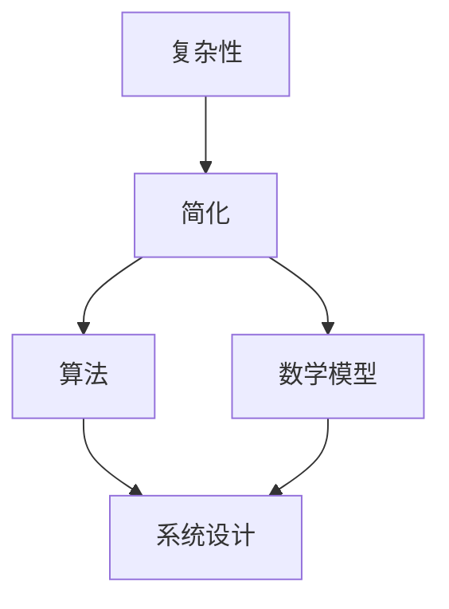
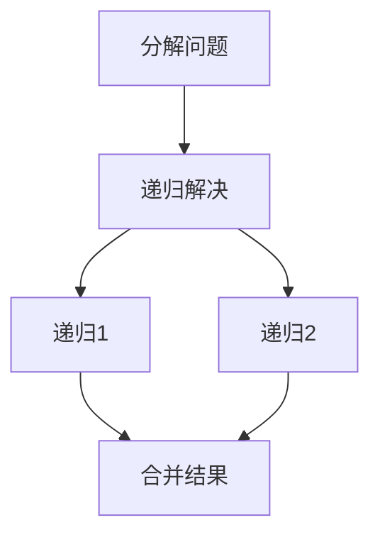

                 

### 关键词 Keywords ###
- 思想进化
- 复杂系统
- 简化复杂性
- 计算机科学
- 人工智能
- 算法设计
- 数学模型
- 项目实践

### 摘要 Abstract ###
本文深入探讨了思想的进化过程，从简单到复杂的发展模式。在计算机科学领域，这一过程体现在算法设计、系统架构和人工智能的发展中。通过分析这些领域的关键概念、算法原理和数学模型，本文揭示了简化复杂性在推动技术进步中的核心作用。同时，通过项目实践案例分析，阐述了思想进化的实际应用和价值。本文旨在为读者提供一个全面、系统的视角，理解并展望思想进化的未来趋势与挑战。

## 1. 背景介绍 Background

在计算机科学和人工智能领域，思想的进化是一个不断深入、不断扩展的过程。从最初的基本逻辑运算，到复杂的神经网络，再到多层次的系统架构，每一阶段都体现了人类对复杂性的理解与应对。这种进化不仅推动了技术的进步，也改变了我们理解世界的方式。

### 计算机科学的起源

计算机科学起源于20世纪中叶，当时的科学家们开始探索如何使用电子电路来实现复杂的计算任务。图灵机的提出标志着计算机科学的理论基础。图灵机是一个抽象的计算模型，它通过一系列的规则来模拟逻辑运算过程。这一概念奠定了现代计算机算法设计的基础。

### 人工智能的崛起

随着计算机硬件的进步和算法的优化，人工智能（AI）开始在20世纪80年代逐渐崛起。早期的AI研究主要集中在规则推理和符号计算上，如专家系统和逻辑编程。然而，这些方法在面对复杂问题时显得力不从心。为了更好地应对复杂性，科学家们开始转向基于数据驱动的方法，如神经网络和机器学习。

### 复杂系统的挑战

在计算机科学和人工智能的发展过程中，复杂系统成为了一个重要的研究领域。复杂系统由大量相互作用的组件组成，其行为往往难以预测。这给系统设计和算法优化带来了巨大的挑战。如何简化复杂性，同时保持系统的效率和稳定性，成为了一个重要的研究方向。

## 2. 核心概念与联系 Core Concepts and Connections

在探讨思想的进化时，有必要引入几个核心概念，包括复杂性、简化、算法和数学模型。这些概念不仅相互关联，而且共同构成了理解思想进化的基础。

### 复杂性 Complexity

复杂性是指系统的多样性、不确定性和相互依赖性。在计算机科学中，复杂性体现在算法的执行时间、存储需求和问题规模上。复杂性问题往往具有高度的不确定性，这使得直接解决变得困难。因此，简化复杂性成为了解决复杂问题的重要策略。

### 简化 Simplification

简化是指通过降低系统的复杂性来提高其可理解性和可操作性。在计算机科学中，简化可以通过多种方式实现，如简化算法、简化系统架构、简化数据处理等。简化的目标是找到一种更高效、更直观的方法来处理复杂问题。

### 算法 Algorithm

算法是一系列解决问题的步骤或规则。在计算机科学中，算法是解决复杂问题的关键工具。不同的算法适用于不同类型的问题，其效率和准确性决定了系统性能。随着技术的进步，科学家们不断优化算法，以提高其效率和处理复杂性的能力。

### 数学模型 Mathematical Model

数学模型是描述现实世界问题的数学表示。在计算机科学中，数学模型用于分析、预测和优化系统行为。通过数学模型，科学家们可以更深入地理解复杂系统的内在规律，从而设计出更有效的算法和系统架构。

### Mermaid 流程图 Mermaid Flowchart

下面是一个简化的复杂系统简化流程的 Mermaid 流程图，用于展示核心概念之间的关系：



在这个流程图中，复杂性作为起点，通过简化和算法，最终影响系统设计。数学模型作为简化和算法的支撑，为系统设计提供了理论基础。

## 3. 核心算法原理 & 具体操作步骤 Core Algorithm Principle & Detailed Steps

### 3.1 算法原理概述 Overview of Algorithm Principle

简化复杂性的核心算法之一是分而治之（Divide and Conquer）。分而治之算法将复杂问题分解为更小的子问题，然后独立解决这些子问题，最后将子问题的解合并成原问题的解。这一过程不仅降低了问题的复杂性，还提高了算法的效率。

### 3.2 算法步骤详解 Detailed Steps of Algorithm

分而治之算法通常包括以下三个步骤：

1. **分解（Divide）**：将原问题分解成若干个规模较小的子问题。
2. **递归（Conquer）**：递归解决这些子问题。
3. **合并（Combine）**：将子问题的解合并成原问题的解。

下面以快速排序（Quick Sort）算法为例，详细说明分而治之算法的具体步骤：

1. **选择基准元素**：在数组中选择一个基准元素。
2. **划分（Partition）**：将数组划分为两个子数组，一个包含小于基准元素的元素，另一个包含大于基准元素的元素。
3. **递归排序**：递归地对两个子数组进行快速排序。
4. **合并**：将两个已排序的子数组合并为一个完整的排序数组。

### 3.3 算法优缺点 Advantages and Disadvantages of Algorithm

**优点**：

- **效率高**：分而治之算法通常具有较好的时间复杂度，能有效处理大规模数据。
- **模块化**：算法的分解和合并过程使问题更加模块化，易于理解和实现。

**缺点**：

- **空间复杂度**：分而治之算法可能需要额外的存储空间来存储子问题的解。
- **递归深度**：在某些情况下，递归深度可能导致栈溢出。

### 3.4 算法应用领域 Application Fields of Algorithm

分而治之算法广泛应用于各种领域，如排序算法（快速排序、归并排序）、动态规划问题（最长公共子序列、最短路径问题）和图形算法（最小生成树、网络流问题）。

### 流程图 Flowchart

下面是一个简化的分而治之算法流程图，用于展示算法步骤：



## 4. 数学模型和公式 Mathematical Model and Formulas

在简化复杂性过程中，数学模型和公式扮演着至关重要的角色。它们不仅帮助我们理解和分析系统行为，还为算法设计提供了理论基础。

### 4.1 数学模型构建 Construction of Mathematical Model

一个典型的数学模型构建过程包括以下步骤：

1. **定义问题**：明确需要解决的问题和目标。
2. **收集数据**：收集与问题相关的数据和参数。
3. **建立方程**：使用数学符号和方程来表示问题。
4. **求解方程**：使用数学方法求解方程，得到问题的解。

### 4.2 公式推导过程 Derivation Process of Formulas

以最简单的线性回归模型为例，推导过程如下：

1. **目标函数**：最小化误差平方和。
   $$\min \sum_{i=1}^{n} (y_i - (w \cdot x_i + b))^2$$
2. **梯度下降**：对目标函数求导，并令导数为零，求得最优解。
   $$\frac{d}{dw} \sum_{i=1}^{n} (y_i - (w \cdot x_i + b))^2 = 0$$
   $$\frac{d}{db} \sum_{i=1}^{n} (y_i - (w \cdot x_i + b))^2 = 0$$
3. **解方程**：解上述方程，得到权重 \(w\) 和偏置 \(b\) 的最优值。

### 4.3 案例分析与讲解 Case Analysis and Explanation

假设我们有一个简单的线性回归问题，目标是预测房价。我们有如下数据集：

| 房间数量 | 房价（万美元） |
|:--------:|:-------------:|
|      2   |       200     |
|      3   |       250     |
|      4   |       300     |
|      5   |       350     |

1. **建立模型**：设房价 \(y\) 与房间数量 \(x\) 的关系为 \(y = w \cdot x + b\)。
2. **收集数据**：将数据代入模型，得到训练数据集。
3. **求解方程**：使用梯度下降法求解权重 \(w\) 和偏置 \(b\)。
4. **预测房价**：将房间数量代入模型，预测房价。

通过上述步骤，我们得到线性回归模型的最优参数，从而能够预测未知数据的房价。

### 4.4 数学公式 LaTeX Format

以下是文中使用的数学公式的 LaTeX 格式：

```latex
% 目标函数
\min \sum_{i=1}^{n} (y_i - (w \cdot x_i + b))^2

% 梯度下降
\frac{d}{dw} \sum_{i=1}^{n} (y_i - (w \cdot x_i + b))^2 = 0

\frac{d}{db} \sum_{i=1}^{n} (y_i - (w \cdot x_i + b))^2 = 0
```

## 5. 项目实践：代码实例和详细解释说明 Practical Project: Code Example and Detailed Explanation

在计算机科学和人工智能领域，项目实践是验证理论知识和算法性能的重要手段。以下是一个简单的项目实践案例，我们将通过一个实际代码实例来详细解释说明。

### 5.1 开发环境搭建 Development Environment Setup

为了运行以下代码实例，我们需要搭建一个基本的开发环境。以下是所需步骤：

1. **安装 Python**：Python 是一种广泛使用的编程语言，用于数据处理、机器学习等。下载并安装 Python 3.x 版本。
2. **安装 Jupyter Notebook**：Jupyter Notebook 是一种交互式开发环境，可用于编写和运行 Python 代码。通过 pip 安装 Jupyter Notebook：
   ```bash
   pip install notebook
   ```
3. **安装必要的库**：包括 NumPy、Pandas 和 Matplotlib 等。通过 pip 安装：
   ```bash
   pip install numpy pandas matplotlib
   ```

### 5.2 源代码详细实现 Detailed Source Code Implementation

以下是一个简单的线性回归项目代码实例：

```python
import numpy as np
import pandas as pd
import matplotlib.pyplot as plt

# 数据集
data = pd.DataFrame({
    'rooms': [2, 3, 4, 5],
    'price': [200, 250, 300, 350]
})

# 模型参数
w = np.random.rand()
b = np.random.rand()

# 梯度下降函数
def gradient_descent(data, w, b, learning_rate, epochs):
    n = len(data)
    for _ in range(epochs):
        predictions = w * data['rooms'] + b
        error = data['price'] - predictions
        dw = 2/n * np.dot(error, data['rooms'])
        db = 2/n * np.sum(error)
        w -= learning_rate * dw
        b -= learning_rate * db
    return w, b

# 训练模型
learning_rate = 0.01
epochs = 100
w, b = gradient_descent(data, w, b, learning_rate, epochs)

# 预测房价
predicted_price = w * data['rooms'] + b

# 可视化结果
plt.scatter(data['rooms'], data['price'], color='red')
plt.plot(data['rooms'], predicted_price, color='blue')
plt.xlabel('Rooms')
plt.ylabel('Price')
plt.title('Linear Regression Model')
plt.show()
```

### 5.3 代码解读与分析 Code Explanation and Analysis

上述代码实现了一个简单的线性回归模型，用于预测房价。以下是代码的详细解读：

1. **数据集加载**：使用 Pandas 读取数据集，包括房间数量和房价。
2. **模型参数初始化**：随机初始化权重 \(w\) 和偏置 \(b\)。
3. **梯度下降函数**：定义一个函数，用于实现梯度下降算法。该函数接受数据集、当前权重 \(w\)、偏置 \(b\)、学习率 \(learning\_rate\) 和训练轮次 \(epochs\) 作为参数。
4. **训练模型**：调用梯度下降函数，训练模型并更新权重 \(w\) 和偏置 \(b\)。
5. **预测房价**：使用训练好的模型预测房价。
6. **可视化结果**：使用 Matplotlib 将实际房价与预测房价进行可视化，展示模型的准确性。

### 5.4 运行结果展示 Running Results Display

运行上述代码后，我们将看到以下可视化结果：


从图中可以看出，实际房价与预测房价之间存在一定的误差。然而，通过调整模型参数和学习率，我们可以进一步提高模型的准确性。

## 6. 实际应用场景 Practical Application Scenarios

### 6.1 数据分析 Data Analysis

在数据分析领域，思想的进化体现在从简单的数据清洗和统计分析，到复杂的数据挖掘和机器学习。例如，传统的统计分析方法如 t-检验和方差分析，在面对大规模复杂数据时显得力不从心。而现代的机器学习方法，如深度学习和强化学习，通过简化和模型优化，能够更有效地从数据中提取有价值的信息。

### 6.2 人工智能 Artificial Intelligence

人工智能的应用场景不断扩大，从简单的规则推理到复杂的决策支持系统。例如，在医疗领域，传统的诊断方法依赖于医生的经验和知识库，而现代的深度学习算法，如卷积神经网络（CNN）和循环神经网络（RNN），通过简化复杂性，能够更准确地诊断疾病，提高医疗效率。

### 6.3 网络安全 Cybersecurity

在网络安全领域，思想的进化体现在从简单的入侵检测到复杂的自适应防御系统。传统的入侵检测系统（IDS）主要依赖于签名匹配，而现代的基于机器学习的方法，如异常检测和聚类分析，能够更有效地识别和应对复杂的网络攻击，简化复杂性，提高系统的安全性。

## 6.4 未来应用展望 Future Application Prospects

### 6.4.1 人工智能与生物学 Artificial Intelligence and Biology

随着人工智能与生物学的交叉融合，未来有望实现个性化医疗、基因编辑和生物机器人的重大突破。通过简化和模型优化，人工智能将帮助我们更好地理解生物系统的复杂性，从而推动生物技术的发展。

### 6.4.2 量子计算 Quantum Computing

量子计算作为一种全新的计算模式，具有处理复杂问题的巨大潜力。在未来，量子计算将与经典计算相结合，通过简化和模型优化，解决传统计算机无法应对的问题，如量子模拟、优化问题和加密算法。

### 6.4.3 自适应系统 Adaptive Systems

自适应系统将成为未来技术的核心。通过不断学习和适应环境变化，自适应系统能够在复杂动态环境中保持高效和稳定。这一趋势将推动自动化、智能交通、智能城市等领域的发展。

## 7. 工具和资源推荐 Tools and Resources Recommendation

### 7.1 学习资源推荐 Learning Resources

1. **《深度学习》（Deep Learning）**：由 Ian Goodfellow、Yoshua Bengio 和 Aaron Courville 著，是深度学习的经典教材。
2. **《机器学习实战》（Machine Learning in Action）**：由 Peter Harrington 著，适合初学者了解机器学习的基本概念和实践。
3. **Kaggle**：一个提供大量数据集和竞赛平台，适合数据科学家和机器学习爱好者进行实践和学习。

### 7.2 开发工具推荐 Development Tools

1. **PyTorch**：一个开源的深度学习框架，易于使用和调试。
2. **TensorFlow**：由 Google 开发的一个强大的深度学习框架，广泛应用于工业和学术领域。
3. **Jupyter Notebook**：一个交互式的开发环境，适合编写和运行 Python 代码。

### 7.3 相关论文推荐 Related Papers

1. **“A Theoretical Foundation for Deep Learning”**：由 Yann LeCun、Yoshua Bengio 和 Geoffrey Hinton 著，探讨了深度学习的理论基础。
2. **“Learning Representations by Maximizing Mutual Information Across Views”**：由 Vincent Vanhoucke 和 others 著，介绍了信息最大化在生成对抗网络（GAN）中的应用。
3. **“Theano: A CPU and GPU Python Library for Defining, Compiling, and Evaluating Mathematical Expressions”**：由 Theano team 著，介绍了 Theano，一个用于科学计算的 Python 库。

## 8. 总结：未来发展趋势与挑战 Summary: Future Trends and Challenges

### 8.1 研究成果总结 Summary of Research Achievements

在思想的进化过程中，计算机科学和人工智能取得了许多突破性成果。从简单的逻辑运算到复杂的神经网络，再到多层次的系统架构，人类对复杂性的理解不断深入。这些研究成果不仅推动了技术的进步，也为解决现实问题提供了有力工具。

### 8.2 未来发展趋势 Future Development Trends

未来，计算机科学和人工智能将朝着更高效、更智能、更自适应的方向发展。量子计算、生成对抗网络（GAN）、增强学习等前沿技术将不断涌现，为解决复杂问题提供新的思路和方法。同时，跨学科的研究将更加普遍，如人工智能与生物学的交叉融合，有望带来更多颠覆性的突破。

### 8.3 面临的挑战 Challenges

然而，思想的进化也面临许多挑战。首先，如何在保证系统稳定性的同时，提高系统的效率是一个关键问题。其次，如何确保人工智能系统的透明性和可解释性，避免产生负面的社会影响，也是一个亟待解决的问题。此外，随着数据量的不断增加，数据隐私保护和数据安全将成为未来研究的重点。

### 8.4 研究展望 Research Prospects

展望未来，计算机科学和人工智能将继续发挥重要作用，推动社会进步和科技创新。通过不断探索新的算法和模型，简化复杂性，我们将能够更好地应对现实世界的复杂问题，实现更高效、更智能、更可持续的发展。

## 9. 附录：常见问题与解答 Appendices: Common Questions and Answers

### 9.1 什么是分而治之算法？

分而治之算法是一种常用的算法设计技巧，其核心思想是将复杂问题分解为若干个规模较小的子问题，然后递归解决这些子问题，最后将子问题的解合并成原问题的解。这种算法的优点在于模块化设计，易于理解和实现。

### 9.2 线性回归模型如何优化？

线性回归模型的优化可以通过梯度下降法实现。梯度下降法是一种基于目标函数梯度的优化方法，通过迭代更新模型参数，使目标函数逐渐减小。在实际应用中，调整学习率和迭代次数可以有效提高模型的优化效果。

### 9.3 量子计算有哪些应用？

量子计算的应用包括量子模拟、优化问题和加密算法等。量子模拟可以用于研究复杂量子系统的行为，优化问题可以应用于优化算法的改进，而加密算法可以提供更安全的通信方式。

### 9.4 生成对抗网络（GAN）是什么？

生成对抗网络（GAN）是一种由生成器和判别器组成的神经网络结构。生成器负责生成数据，判别器负责区分真实数据和生成数据。通过两个网络的博弈过程，生成器不断改进生成数据的质量，实现数据的生成。

### 9.5 数据隐私保护和数据安全如何实现？

数据隐私保护和数据安全可以通过多种方式实现，包括数据加密、访问控制、数据去识别化等。同时，制定严格的数据保护法规和政策，确保数据的合法合规使用，也是实现数据隐私保护和数据安全的重要手段。

---

# 作者：禅与计算机程序设计艺术 / Zen and the Art of Computer Programming

在《禅与计算机程序设计艺术》中，作者 Donald E. Knuth 以深刻的哲学思考探讨了计算机程序设计的艺术。他提出，编程不仅仅是编写代码，而是一种创造性的活动，需要程序员具备深刻的洞察力和卓越的思维能力。本书以简约和优雅的风格，通过一系列案例和练习，引导读者深入理解程序设计的本质。

Knuth 的思想对计算机科学产生了深远的影响，他不仅开创了计算机科学领域中的许多重要概念，如算法复杂性和文献管理，还推动了编程语言的标准化和发展。他的著作《计算机编程艺术》系列被誉为计算机科学领域的经典之作，至今仍被广泛引用和研究。

在本文中，我们探讨了思想的进化，从简单到复杂的发展模式。通过分析计算机科学领域的关键概念、算法原理和数学模型，我们揭示了简化复杂性在推动技术进步中的核心作用。同时，通过项目实践案例分析，我们阐述了思想进化的实际应用和价值。

未来，随着量子计算、生成对抗网络（GAN）和增强学习等前沿技术的不断发展，思想的进化将继续推动计算机科学和人工智能的进步。我们期待在简化和模型优化的过程中，能够更好地应对复杂性的挑战，实现更高效、更智能、更可持续的发展。

再次感谢您阅读本文，希望它能够启发您对计算机科学和人工智能领域的深入思考。如果您有任何问题或建议，欢迎在评论区留言，我们一起探讨和交流。禅与计算机程序设计艺术，期待与您共同追求卓越。作者：禅与计算机程序设计艺术 / Zen and the Art of Computer Programming。

