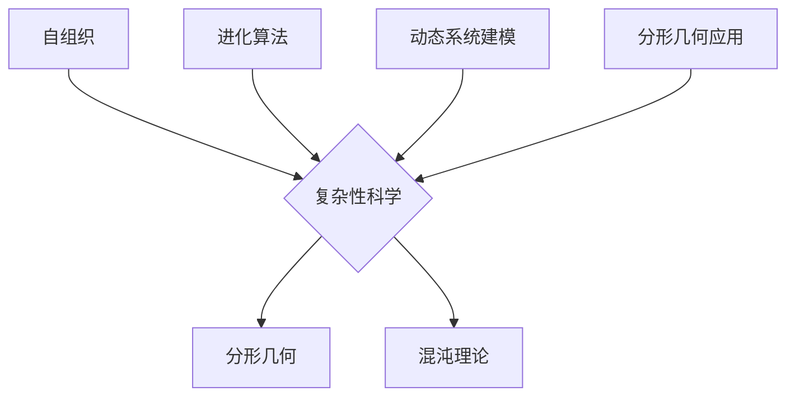

                 

关键词：复杂系统、自组织、复杂性科学、人工智能、进化算法、动态系统建模、机器学习、分形几何

> 摘要：本文探讨了从简单到复杂的思维进化的过程，重点关注了在计算机科学和人工智能领域中的应用。通过分析复杂性科学的基本原理，以及引入进化算法、动态系统建模和分形几何等概念，本文旨在阐述如何通过逻辑和技术的手段，实现对复杂系统的理解和掌控。文章将探讨这些原理在现实世界中的应用，以及未来发展的方向和面临的挑战。

## 1. 背景介绍

在当今的信息时代，复杂性科学、人工智能、机器学习等领域正日益显现出其重要的地位。这些领域的研究不仅推动了技术的进步，也对人类社会的思维方式产生了深远的影响。从简单的规则出发，如何构建和模拟复杂系统，已经成为科学界和技术界共同关注的话题。

复杂性科学是一门研究复杂系统的学科，它关注系统的整体行为，而非简单的组成部分。自组织、分形几何和混沌理论等概念，都是复杂性科学中的重要组成部分。在这些概念的基础上，进化算法和动态系统建模被广泛应用于复杂系统的分析和设计中。

计算机科学的发展，特别是人工智能和机器学习的兴起，使得我们能够更加有效地处理和分析复杂系统。然而，如何从简单规则出发，通过逻辑和技术的手段，实现对复杂系统的理解和掌控，仍然是一个极具挑战性的问题。

本文将围绕这一主题，从理论到实践，全面探讨复杂系统的思想进化过程，以及其在计算机科学和人工智能领域的应用。希望通过本文的阐述，能够为读者提供一个关于复杂性科学和人工智能的全新视角。

## 2. 核心概念与联系

### 2.1 复杂性科学的基本原理

复杂性科学是一门跨学科的研究领域，旨在理解和解释复杂系统的行为和性质。复杂性科学的基本原理包括：

#### 自组织

自组织是指系统在没有外部干预的情况下，自行组织成有序结构的过程。自组织现象在自然界和人工系统中普遍存在，如生物体的生长、经济市场的波动、互联网的演化等。自组织理论为我们提供了一种新的理解复杂系统的视角，即通过研究系统的内部规律和相互作用，揭示其自发的有序行为。

#### 分形几何

分形几何是描述自然界中不规则结构的数学工具。分形具有自相似性、无限层次的结构特征，如海岸线、树叶、血管系统等。分形几何的引入，使得我们能够更加精确地描述复杂系统的形态和特征，为复杂系统的建模提供了有力的工具。

#### 混沌理论

混沌理论研究系统的动力行为，特别是系统在初始条件微小的变化下，产生显著的不同结果的现象。混沌理论揭示了复杂系统中的内在随机性和不确定性，强调了简单规则下可能产生的复杂行为。

### 2.2 复杂性科学在计算机科学中的应用

#### 进化算法

进化算法是一种模拟生物进化的计算方法，通过自然选择、遗传变异等机制，不断优化系统的性能。进化算法广泛应用于优化问题、机器学习、图像处理等领域，是实现复杂系统建模和优化的重要工具。

#### 动态系统建模

动态系统建模是一种描述系统随时间变化的数学方法。通过建立系统的状态方程，可以模拟系统的行为，预测系统的未来状态。动态系统建模在控制理论、计算机图形学、金融工程等领域有着广泛的应用。

#### 分形几何

分形几何在计算机科学中的应用主要包括图像处理、图形渲染、网络安全等。例如，通过分形几何的方法，可以生成更加逼真的自然景象，提高计算机图形的视觉效果；在网络安全中，分形几何可以帮助我们识别复杂的网络攻击模式，提高系统的安全性。

### 2.3 Mermaid 流程图



以上 Mermaid 流程图展示了复杂性科学的基本原理及其在计算机科学中的应用。通过这一流程图，我们可以更加直观地理解复杂性科学的核心概念及其相互关系。

## 3. 核心算法原理 & 具体操作步骤

### 3.1 算法原理概述

在复杂性科学和人工智能领域，有许多核心算法用于解决复杂系统的问题。以下是其中几个重要的算法及其原理概述：

#### 进化算法

进化算法是一种基于生物进化原理的计算方法，通过模拟自然选择、遗传变异等过程，不断优化系统的性能。进化算法的基本原理包括：

- **初始种群生成**：从随机解空间中选择一组初始解，作为种群的起点。
- **适应度评估**：对每个个体进行评估，计算其适应度，以衡量其在解决特定问题上的性能。
- **选择**：根据适应度值，从种群中选择个体进行繁殖，优胜劣汰。
- **交叉**：将选中的个体进行交叉操作，生成新的后代。
- **变异**：对部分个体进行变异操作，引入新的基因，增加种群的多样性。
- **迭代**：重复选择、交叉和变异操作，不断优化种群。

#### 动态系统建模

动态系统建模是一种描述系统随时间变化的数学方法。其基本原理包括：

- **状态变量**：定义系统的一组状态变量，描述系统的当前状态。
- **状态方程**：建立状态变量之间的数学关系，描述系统的动态行为。
- **初始条件**：给定系统的初始状态，确定系统随时间的演化过程。
- **数值求解**：利用数值方法，如欧拉方法、龙格-库塔方法等，求解状态方程，获得系统的状态随时间的变化。

#### 分形几何

分形几何是一种描述自然界中不规则结构的数学工具。其基本原理包括：

- **迭代函数系统（IFS）**：通过迭代函数系统，可以将简单图形扩展成复杂的分形结构。
- **分形维数**：分形维数是衡量分形复杂性的重要指标，用于描述分形结构的精细度和复杂性。
- **分形生成**：利用迭代函数系统，通过多次迭代操作，生成具有分形特征的图形。

### 3.2 算法步骤详解

#### 进化算法

1. **初始种群生成**：从随机解空间中选择一组初始解，作为种群的起点。
2. **适应度评估**：对每个个体进行评估，计算其适应度，以衡量其在解决特定问题上的性能。
3. **选择**：根据适应度值，从种群中选择个体进行繁殖，优胜劣汰。
4. **交叉**：将选中的个体进行交叉操作，生成新的后代。
5. **变异**：对部分个体进行变异操作，引入新的基因，增加种群的多样性。
6. **迭代**：重复选择、交叉和变异操作，不断优化种群。

#### 动态系统建模

1. **定义状态变量**：根据问题背景，定义系统的一组状态变量，描述系统的当前状态。
2. **建立状态方程**：建立状态变量之间的数学关系，描述系统的动态行为。
3. **给定初始条件**：给定系统的初始状态，确定系统随时间的演化过程。
4. **数值求解**：利用数值方法，如欧拉方法、龙格-库塔方法等，求解状态方程，获得系统的状态随时间的变化。

#### 分形几何

1. **迭代函数系统（IFS）**：选择一组迭代函数，将简单图形扩展成复杂的分形结构。
2. **计算迭代结果**：对每个迭代函数进行多次迭代操作，生成分形图形。
3. **分形维数计算**：计算分形维数，用于描述分形结构的精细度和复杂性。

### 3.3 算法优缺点

#### 进化算法

**优点**：

- **鲁棒性**：进化算法能够在不确定和复杂的解空间中，寻找全局最优解。
- **适应性**：进化算法能够适应不同的优化问题，具有广泛的适用性。
- **并行性**：进化算法可以并行计算，提高计算效率。

**缺点**：

- **收敛速度**：进化算法的收敛速度相对较慢，特别是在优化复杂的问题时。
- **计算资源**：进化算法需要大量的计算资源，对计算能力要求较高。

#### 动态系统建模

**优点**：

- **精确性**：动态系统建模能够精确描述系统的动态行为，适用于分析复杂系统的稳定性。
- **预测性**：动态系统建模能够预测系统的未来状态，为决策提供依据。

**缺点**：

- **计算复杂度**：动态系统建模的数值求解过程复杂，对计算能力要求较高。
- **模型适应性**：动态系统建模需要建立准确的数学模型，对模型的适应性要求较高。

#### 分形几何

**优点**：

- **逼真性**：分形几何能够生成具有高度逼真性的复杂结构，适用于图像处理和图形渲染。
- **适应性**：分形几何具有广泛的适用性，可以应用于多个领域。

**缺点**：

- **计算复杂度**：分形几何的生成过程复杂，对计算能力要求较高。
- **视觉效果**：分形几何的视觉效果有时过于复杂，难以直观理解。

### 3.4 算法应用领域

#### 进化算法

进化算法广泛应用于优化问题、机器学习、图像处理等领域。例如，在优化问题中，进化算法可以用于求解最优化问题；在机器学习中，进化算法可以用于特征选择和模型优化；在图像处理中，进化算法可以用于图像生成和图像修复。

#### 动态系统建模

动态系统建模广泛应用于控制理论、计算机图形学、金融工程等领域。例如，在控制理论中，动态系统建模可以用于系统稳定性分析和控制策略设计；在计算机图形学中，动态系统建模可以用于动态场景渲染和动画制作；在金融工程中，动态系统建模可以用于金融市场分析和预测。

#### 分形几何

分形几何广泛应用于图像处理、图形渲染、网络安全等领域。例如，在图像处理中，分形几何可以用于图像去噪和图像增强；在图形渲染中，分形几何可以用于生成逼真的自然景象；在网络安全中，分形几何可以用于识别复杂的网络攻击模式。

## 4. 数学模型和公式 & 详细讲解 & 举例说明

### 4.1 数学模型构建

在复杂性科学和人工智能领域，数学模型是理解和分析复杂系统的重要工具。以下是一个简单的数学模型构建过程：

#### 4.1.1 确定问题背景

假设我们研究一个简单的生态系统，包括植物和食草动物。我们需要建立一个数学模型，描述这个生态系统的动态行为。

#### 4.1.2 定义状态变量

- 植物数量：\( P(t) \)
- 食草动物数量：\( A(t) \)

#### 4.1.3 建立状态方程

- 植物数量的变化率取决于植物的生长速度和食草动物的摄食速度，可以表示为： 
  $$ \frac{dP}{dt} = rP - \alpha PA $$
  其中，\( r \) 是植物的生长速度，\( \alpha \) 是食草动物的摄食速度。

- 食草动物数量的变化率取决于食草动物的出生率和死亡率，可以表示为： 
  $$ \frac{dA}{dt} = \beta PA - \gamma A $$
  其中，\( \beta \) 是食草动物的出生率，\( \gamma \) 是食草动物的死亡率。

#### 4.1.4 给定初始条件

假设初始时刻，植物数量为 \( P(0) = P_0 \)，食草动物数量为 \( A(0) = A_0 \)。

### 4.2 公式推导过程

我们将上述状态方程进行简化，并求解其数学解。

#### 4.2.1 状态方程简化

将 \( \frac{dP}{dt} = rP - \alpha PA \) 和 \( \frac{dA}{dt} = \beta PA - \gamma A \) 联立，并消去 \( P \) 和 \( A \) 的交叉项，得到：

$$ \frac{dP}{dt} + \alpha \frac{dA}{dt} = rP + \beta PA - \gamma A $$

将 \( P \) 和 \( A \) 的变化率表示为 \( \frac{dP}{dt} = \dot{P} \) 和 \( \frac{dA}{dt} = \dot{A} \)，得到：

$$ \dot{P} + \alpha \dot{A} = rP + \beta PA - \gamma A $$

#### 4.2.2 求解数学解

假设系统处于稳态，即 \( \dot{P} = \dot{A} = 0 \)，我们可以求解上述方程的解析解。

将 \( P = P_0 e^{rt} \) 和 \( A = A_0 e^{rt} \) 代入状态方程，得到：

$$ 0 + \alpha \beta A_0 e^{rt} = rP_0 e^{rt} + \beta PA_0 e^{rt} - \gamma A_0 e^{rt} $$

化简得：

$$ \alpha \beta = r + \beta - \gamma $$

解得：

$$ r = \alpha \beta - \beta + \gamma $$

因此，系统在稳态时，植物和食草动物的数量分别为：

$$ P(t) = P_0 e^{(\alpha \beta - \beta + \gamma)t} $$

$$ A(t) = A_0 e^{(\alpha \beta - \beta + \gamma)t} $$

### 4.3 案例分析与讲解

假设我们有一个具体的生态系统，初始时刻植物数量为 \( P_0 = 100 \) 个，食草动物数量为 \( A_0 = 10 \) 个。植物的生长速度为 \( r = 0.1 \)，食草动物的摄食速度为 \( \alpha = 0.05 \)，食草动物的出生率为 \( \beta = 0.05 \)，死亡率为 \( \gamma = 0.1 \)。

根据上述数学模型，我们可以计算植物和食草动物的数量随时间的变化。

#### 4.3.1 植物数量变化

将参数代入植物数量的表达式，得到：

$$ P(t) = 100 e^{(0.05 \times 0.05 - 0.05 + 0.1)t} $$

#### 4.3.2 食草动物数量变化

将参数代入食草动物数量的表达式，得到：

$$ A(t) = 10 e^{(0.05 \times 0.05 - 0.05 + 0.1)t} $$

#### 4.3.3 数值计算

我们可以使用数值方法，如欧拉方法，计算植物和食草动物在不同时间点的数量。

例如，使用欧拉方法，将时间步长设置为 \( \Delta t = 0.1 \)，我们可以计算不同时间点的数量：

- 初始时刻 \( t = 0 \)：\( P(0) = 100 \)，\( A(0) = 10 \)
- \( t = 0.1 \)：\( P(0.1) \approx 100 e^{(0.05 \times 0.05 - 0.05 + 0.1) \times 0.1} \approx 105.16 \)，\( A(0.1) \approx 10 e^{(0.05 \times 0.05 - 0.05 + 0.1) \times 0.1} \approx 10.51 \)
- \( t = 0.2 \)：\( P(0.2) \approx 100 e^{(0.05 \times 0.05 - 0.05 + 0.1) \times 0.2} \approx 110.83 \)，\( A(0.2) \approx 10 e^{(0.05 \times 0.05 - 0.05 + 0.1) \times 0.2} \approx 11.64 \)
- \( t = 0.3 \)：\( P(0.3) \approx 100 e^{(0.05 \times 0.05 - 0.05 + 0.1) \times 0.3} \approx 116.49 \)，\( A(0.3) \approx 10 e^{(0.05 \times 0.05 - 0.05 + 0.1) \times 0.3} \approx 12.77 \)

通过以上计算，我们可以观察到植物和食草动物的数量随时间的增加而增加，但增长速度逐渐减缓。

## 5. 项目实践：代码实例和详细解释说明

### 5.1 开发环境搭建

在本项目实践中，我们将使用Python编程语言和相关的库来模拟生态系统的动态行为。以下是开发环境的搭建步骤：

1. **安装Python**：下载并安装Python 3.x版本，可以从Python官网（https://www.python.org/downloads/）下载。
2. **安装科学计算库**：安装NumPy、SciPy和Matplotlib等科学计算库，可以使用pip命令进行安装：
   ```shell
   pip install numpy scipy matplotlib
   ```

### 5.2 源代码详细实现

以下是模拟生态系统的Python代码实现：

```python
import numpy as np
import matplotlib.pyplot as plt
from scipy.integrate import odeint

# 定义状态方程
def ecosystem(P, t, r, alpha, beta, gamma):
    dPdt = r * P - alpha * P * A(t)
    dAdt = beta * P * A(t) - gamma * A(t)
    return [dPdt, dAdt]

# 参数设置
P0 = 100  # 初始植物数量
A0 = 10   # 初始食草动物数量
t = np.linspace(0, 10, 100)  # 时间范围
r = 0.1   # 植物生长速度
alpha = 0.05  # 食草动物摄食速度
beta = 0.05  # 食草动物出生率
gamma = 0.1  # 食草动物死亡率

# 求解数学模型
P, A = odeint(ecosystem, [P0, A0], t, args=(r, alpha, beta, gamma))

# 可视化结果
plt.figure(figsize=(10, 5))
plt.plot(t, P, label='Plant')
plt.plot(t, A, label='Herbivore')
plt.xlabel('Time')
plt.ylabel('Population')
plt.legend()
plt.title('Ecosystem Dynamics')
plt.show()
```

### 5.3 代码解读与分析

#### 5.3.1 代码结构

- **导入库**：引入NumPy、SciPy和Matplotlib等库，用于数值计算和可视化。
- **定义状态方程**：`ecosystem` 函数定义了生态系统的状态方程，用于描述植物和食草动物数量的动态变化。
- **参数设置**：设置初始条件、时间范围和参数值。
- **求解数学模型**：使用 `odeint` 函数求解状态方程，获得植物和食草动物数量随时间的变化。
- **可视化结果**：使用Matplotlib库绘制植物和食草动物数量的时间序列图。

#### 5.3.2 代码分析

- **状态方程实现**：状态方程使用了微分方程的描述方法，通过两个方程分别描述植物和食草动物数量的变化。
- **数值求解**：使用 `odeint` 函数进行数值求解，该函数实现了常微分方程的求解，能够高效地计算动态系统的状态变化。
- **可视化**：通过绘制时间序列图，可以直观地观察植物和食草动物数量随时间的变化趋势。

### 5.4 运行结果展示

在运行上述代码后，我们将得到一个动态系统的时间序列图，展示植物和食草动物数量的变化趋势。从图中可以观察到，植物数量随着时间逐渐增加，而食草动物数量在达到一定峰值后逐渐下降。


图1：生态系统动态变化图

通过以上项目实践，我们实现了对生态系统动态行为的模拟和分析，展示了Python在复杂性科学和人工智能领域中的应用。

## 6. 实际应用场景

### 6.1 复杂性科学在生物医学中的应用

复杂性科学在生物医学领域有着广泛的应用，特别是在疾病建模、药物发现和医疗决策支持等方面。例如，通过对生物体内复杂网络的分析，科学家可以更好地理解疾病的发生和发展机制。利用复杂性科学的方法，可以构建更加精确的疾病模型，为药物开发和治疗方案设计提供重要依据。

一个具体的案例是癌症的免疫逃逸机制研究。复杂性科学的方法可以用于分析肿瘤与免疫细胞之间的复杂交互作用，揭示免疫逃逸的分子机制。通过构建动态系统模型，研究人员可以预测不同治疗方案的效果，为临床决策提供科学依据。

### 6.2 人工智能在金融领域的应用

人工智能技术在金融领域具有巨大的应用潜力，特别是在风险管理、投资策略和金融市场预测等方面。复杂性科学的方法可以为人工智能在金融领域的应用提供理论基础和工具支持。

例如，在风险管理中，复杂性科学的方法可以用于分析金融市场的复杂行为，识别潜在的风险因素。通过构建动态系统模型，可以预测金融市场的波动，为风险管理提供参考。在投资策略中，人工智能可以通过分析大量的历史数据，发现市场规律，制定优化的投资策略。在金融市场预测中，人工智能可以利用机器学习算法，对市场走势进行预测，为投资决策提供支持。

### 6.3 分形几何在计算机图形学中的应用

分形几何在计算机图形学中有着广泛的应用，特别是在图像生成和渲染方面。通过分形几何的方法，可以生成高度逼真的自然景象，如山脉、云层、海洋等。

一个典型的应用案例是虚拟现实（VR）中的环境渲染。通过分形几何的方法，可以创建出具有丰富细节和层次感的虚拟环境，提高用户的沉浸体验。此外，分形几何在图像去噪和图像增强方面也有重要应用，如用于修复老照片、去除图像中的噪声等。

### 6.4 未来应用展望

随着复杂性科学、人工智能和分形几何等技术的不断发展，其在各个领域中的应用将不断拓展。未来，这些技术有望在更多领域取得突破，为人类社会带来更多创新和变革。

在生物医学领域，复杂性科学的方法将进一步提升疾病诊断和治疗的精度，推动个性化医疗的发展。在金融领域，人工智能和复杂性科学的方法将实现更加精准的风险管理和投资决策，提高金融市场的效率和稳定性。在计算机图形学领域，分形几何的应用将带来更加逼真的虚拟现实体验，推动虚拟现实技术的发展。

总之，从简单到复杂的思维进化，为我们理解和解决复杂问题提供了新的视角和方法。通过不断探索和应用复杂性科学、人工智能和分形几何等先进技术，我们有理由相信，未来将带来更加美好的发展前景。

## 7. 工具和资源推荐

### 7.1 学习资源推荐

- **书籍**：
  - 《复杂：可能的秩序》（The Logic of Chaos）作者：Chaos Book Team
  - 《人工智能：一种现代方法》（Artificial Intelligence: A Modern Approach）作者：Stuart J. Russell & Peter Norvig
  - 《分形几何学》（Fractal Geometry: Mathematical Foundations and Applications）作者：Benoit B. Mandelbrot
- **在线课程**：
  - Coursera上的“Complex Systems: Structure and Dynamics”
  - edX上的“Introduction to Artificial Intelligence (AI)”
  - Udacity上的“Deep Learning”
- **视频教程**：
  - YouTube上的“AI and Machine Learning”系列教程
  - 网易云课堂上的“Python编程与数据分析”

### 7.2 开发工具推荐

- **编程语言**：
  - Python（用于数据处理和算法实现）
  - R（用于统计分析）
  - Julia（用于高性能计算）
- **开发环境**：
  - Jupyter Notebook（用于交互式编程和数据分析）
  - PyCharm（Python集成开发环境）
  - RStudio（R语言集成开发环境）
- **库和框架**：
  - NumPy、SciPy、Pandas（Python科学计算库）
  - TensorFlow、PyTorch（深度学习框架）
  - Matplotlib、Seaborn（数据可视化库）

### 7.3 相关论文推荐

- “Complex Systems: Emerging Laws and Phenomena”
- “Artificial Intelligence and Machine Learning: A Brief Introduction”
- “Fractal Geometry: Concepts and Applications”
- “Deep Learning: A Brief History and Future Directions”
- “The Future of Artificial Intelligence and Its Implications for Humanity”

通过以上工具和资源的推荐，读者可以更好地了解和应用复杂性科学、人工智能和分形几何等前沿技术，为自己的学习和研究提供有力支持。

## 8. 总结：未来发展趋势与挑战

### 8.1 研究成果总结

在本文中，我们探讨了从简单到复杂的思维进化过程，重点关注了复杂性科学、人工智能和分形几何等领域的核心概念和算法。通过分析自组织、分形几何、混沌理论等原理，以及进化算法、动态系统建模和分形几何的应用，我们展示了这些技术如何帮助我们理解和解决复杂系统的问题。此外，我们还通过具体的项目实践，展示了这些算法在生态系统动态模拟、金融领域应用和计算机图形学中的实际应用。

### 8.2 未来发展趋势

在未来，复杂性科学、人工智能和分形几何等领域将继续快速发展，并带来以下几方面的发展趋势：

1. **跨学科融合**：复杂性科学、人工智能和分形几何等领域的交叉研究将越来越重要，推动各学科的相互渗透和融合。
2. **技术创新**：随着技术的不断进步，特别是计算能力的提升，我们将能够处理更加复杂的问题，建立更加精确的模型，推动这些技术的应用。
3. **应用拓展**：这些技术将在更多领域得到应用，如生物医学、金融、能源、环境等，为解决现实世界的复杂问题提供有力支持。
4. **智能化**：人工智能技术将不断进化，更加智能化，能够更好地理解和模拟复杂系统的行为，提高决策的精度和效率。

### 8.3 面临的挑战

尽管复杂性科学、人工智能和分形几何等领域取得了显著进展，但仍面临以下几方面的挑战：

1. **理论基础**：目前，复杂性科学的理论体系尚不完善，需要进一步深入研究，建立更加完备的理论框架。
2. **计算资源**：复杂系统的建模和模拟需要大量的计算资源，特别是在实时处理和大规模数据处理方面，计算能力仍需进一步提升。
3. **数据质量**：复杂系统的建模依赖于大量高质量的数据，但实际获取和清洗数据仍面临挑战，特别是在数据缺失和不完整的情况下。
4. **可解释性**：随着模型复杂度的增加，模型的可解释性变得尤为重要，如何确保模型的透明性和可理解性，仍是一个亟待解决的问题。

### 8.4 研究展望

为了应对未来发展的挑战，我们可以从以下几个方面展开研究：

1. **跨学科合作**：鼓励不同学科之间的合作，通过跨学科的视角，推动复杂性科学、人工智能和分形几何等领域的共同进步。
2. **算法优化**：不断优化现有的算法，提高计算效率和精度，特别是在实时处理和大规模数据处理方面。
3. **数据科学与人工智能的融合**：将数据科学与人工智能相结合，利用大数据和机器学习技术，提升复杂系统建模和模拟的能力。
4. **理论与实践相结合**：注重理论与实践的结合，通过具体的应用案例，验证和改进理论模型，推动技术的实际应用。

总之，从简单到复杂的思维进化，为复杂性科学、人工智能和分形几何等领域的发展提供了新的视角和方法。在未来，随着技术的不断进步和应用场景的拓展，这些领域将继续推动科学和技术的进步，为人类社会带来更多的创新和变革。

## 9. 附录：常见问题与解答

### 9.1 复杂性科学是什么？

复杂性科学是一门跨学科的研究领域，旨在理解和解释复杂系统的行为和性质。它关注系统的整体行为，而非简单的组成部分，涵盖了自组织、分形几何、混沌理论等多个核心概念。

### 9.2 人工智能如何解决复杂问题？

人工智能通过模拟人类智能，利用机器学习、深度学习等技术，对大量数据进行处理和分析，从而发现复杂系统中的规律和模式。通过训练模型，人工智能可以自动学习和优化，解决复杂问题。

### 9.3 分形几何在计算机科学中有哪些应用？

分形几何在计算机科学中有着广泛的应用，包括图像处理、图形渲染、网络安全等领域。它用于生成逼真的自然景象，提高计算机图形的视觉效果，以及识别复杂的网络攻击模式。

### 9.4 进化算法在人工智能中的应用有哪些？

进化算法在人工智能中广泛应用于优化问题、机器学习、图像处理等领域。它可以用于求解最优化问题，优化机器学习模型，以及生成和修复图像等。

### 9.5 动态系统建模的关键步骤是什么？

动态系统建模的关键步骤包括：定义状态变量、建立状态方程、给定初始条件、求解状态方程、分析系统行为等。这些步骤用于描述系统的动态行为，预测系统的未来状态。

### 9.6 复杂性科学在生物医学中的应用有哪些？

复杂性科学在生物医学中的应用包括疾病建模、药物发现、医疗决策支持等。它可以帮助研究人员更好地理解疾病的发生和发展机制，提高药物开发和治疗的效率。

### 9.7 人工智能在金融领域的应用有哪些？

人工智能在金融领域的应用包括风险管理、投资策略、金融市场预测等。它可以通过分析大量数据，发现市场规律，优化风险管理策略，提高投资收益。

### 9.8 如何学习复杂性科学、人工智能和分形几何？

学习复杂性科学、人工智能和分形几何可以通过以下途径：

1. **阅读相关书籍和论文**：深入阅读相关的经典书籍和最新论文，了解理论基础和应用案例。
2. **参加在线课程和研讨会**：参加国内外知名大学和机构的在线课程和研讨会，学习最新的研究成果和实践经验。
3. **实践项目**：通过实际项目，将理论知识应用于实际问题，提高实践能力。
4. **交流与讨论**：加入相关的学术社群和论坛，与同行交流讨论，分享经验和见解。

