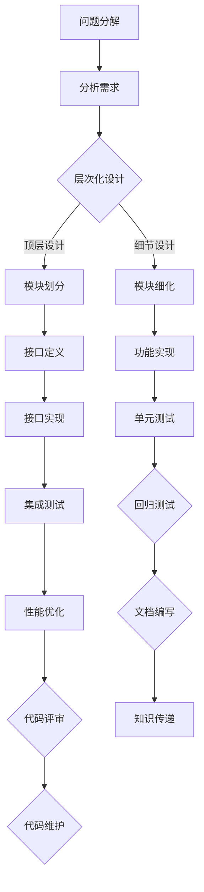

                 

 > **关键词：**结构化思维、表达技巧、计算机编程、软件开发、人工智能。

> **摘要：**本文深入探讨了结构化思维在计算机编程和软件开发中的重要性，以及如何通过有效的表达技巧提升开发效率和代码质量。文章将详细分析结构化思维的基本原则，并运用具体的案例和算法原理，阐述如何在实际开发过程中运用结构化思维进行编程和设计。同时，还将介绍一些数学模型和公式，以及相关工具和资源，以帮助读者更好地理解和应用这些概念。

## 1. 背景介绍

在当今信息化时代，计算机编程和软件开发已经成为现代社会不可或缺的一部分。无论是互联网应用、操作系统、还是人工智能算法，都离不开高质量的代码和良好的设计。然而，随着项目的规模和复杂性的不断增加，如何有效地进行编程和软件开发成为了一个重要的挑战。

在这个背景下，结构化思维的重要性日益凸显。结构化思维是一种有条理、有组织、系统性的思维方式，它能够帮助我们理清思路，提高解决问题的效率。在计算机编程和软件开发中，结构化思维能够帮助我们更好地设计程序结构，编写清晰、易于维护的代码，从而提高开发效率和代码质量。

本文将围绕结构化思维在编程和软件开发中的应用，详细探讨其基本原则、表达技巧以及实际应用方法。通过具体的案例和算法原理，我们将看到如何在实际开发过程中运用结构化思维，从而实现更高效、更可靠的软件开发。

### 1.1 编程和软件开发的现状

当前，编程和软件开发已经渗透到各个行业，从金融、医疗到教育、娱乐，无处不见编程的身影。随着云计算、大数据、人工智能等新技术的兴起，编程和软件开发的要求越来越高。传统的编程范式和开发方法已经难以满足日益复杂的项目需求。

一方面，软件项目的规模不断扩大，功能日益复杂。一个典型的例子是大型企业的信息系统，它们通常包含成千上万的代码行，涉及多个模块和系统。在这种情况下，如果没有良好的结构化思维，代码的编写和维护将变得异常困难。

另一方面，软件开发的复杂性也日益增加。现代软件系统不仅需要实现功能，还需要考虑到性能、安全、可扩展性等多个方面。这要求开发者不仅要有扎实的编程技能，还需要具备系统的设计能力和抽象思维能力。

总之，编程和软件开发的现状要求开发者具备更高的思维能力，特别是结构化思维。只有通过有效的结构化思维，开发者才能应对日益复杂的开发挑战，编写出高质量、可靠的代码。

### 1.2 结构化思维的重要性

结构化思维在编程和软件开发中的重要性不言而喻。它不仅能够帮助开发者更好地理解和设计程序，还能提高代码的可读性和可维护性。具体来说，结构化思维的重要性体现在以下几个方面：

首先，结构化思维有助于提升开发效率。通过结构化思维，开发者能够更快地理解项目需求和设计思路，从而快速编写出符合要求的代码。这种高效的设计和开发能力在大型项目和复杂系统中尤为重要。

其次，结构化思维能够提高代码质量。清晰的程序结构、良好的代码风格和模块化设计都是结构化思维的体现。这些都有助于提高代码的可读性，降低bug率，从而提高软件的可靠性。

最后，结构化思维有助于团队协作。在团队开发中，良好的结构化思维能够帮助团队成员更好地理解项目结构和代码逻辑，从而提高团队协作效率。此外，结构化思维还有助于知识传递和项目迁移，使新成员能够更快地适应现有项目。

总之，结构化思维是编程和软件开发中的核心能力之一。只有通过不断提升结构化思维，开发者才能在激烈的市场竞争中脱颖而出，实现更高的职业发展。

## 2. 核心概念与联系

### 2.1 结构化思维的基本原则

结构化思维是一种系统化的思维方式，它强调在思考和处理问题时遵循一定的原则和方法。以下是结构化思维的基本原则：

1. **分解与组合：**将复杂问题分解为更小的、更容易管理的部分，然后再将这些部分组合起来，以形成整体的解决方案。
2. **层次化：**按照问题的层次结构来组织和解决问题。例如，首先关注最高层次的总体设计，然后逐步深入到细节层次。
3. **模块化：**将系统划分为独立的模块，每个模块负责完成特定的功能，模块之间通过接口进行通信。
4. **递归：**递归是一种常用的算法设计方法，它通过将问题不断分解为更小的子问题来解决问题。
5. **抽象：**抽象是提取共同特征和规律的过程，它有助于简化问题，突出关键因素。
6. **逻辑性：**在思考和处理问题时，始终保持逻辑性和条理性，避免跳跃性思维和不相关的联想。

### 2.2 表达技巧

有效的表达技巧能够帮助开发者更清晰地传达自己的想法和设计，从而提高沟通效率。以下是几种常用的表达技巧：

1. **使用图形和流程图：**图形和流程图能够直观地展示程序结构和算法流程，有助于团队成员更好地理解设计思路。
2. **编写文档：**良好的文档是代码的补充，它能够详细描述程序的功能、设计思路和实现细节，方便其他开发者阅读和维护代码。
3. **代码注释：**在代码中添加注释，解释关键部分的实现逻辑和设计考虑，有助于提高代码的可读性。
4. **使用规范化的命名和代码风格：**规范的命名和统一的代码风格能够提高代码的可读性和一致性，降低理解难度。
5. **口头表达：**在讨论和交流时，尽量使用简洁明了的语言，避免专业术语和复杂的句式，使对方更容易理解。

### 2.3 结构化思维与表达技巧的联系

结构化思维和表达技巧是相辅相成的。结构化思维提供了思考问题的方法和原则，而表达技巧则是将结构化思维的结果有效地传达给他人。以下是它们之间的联系：

1. **结构化思维指导表达技巧：**在编写代码或设计系统时，结构化思维能够帮助开发者明确思路，从而更好地运用表达技巧，如编写文档、绘制流程图等。
2. **表达技巧验证结构化思维：**有效的表达技巧能够帮助开发者更清晰地表达自己的想法，从而发现和纠正结构化思维中的不足。
3. **结构化思维和表达技巧的协同作用：**通过结构化思维来设计程序结构和算法，再运用表达技巧来传达设计思路，能够形成高效、可靠的开发流程。

总之，结构化思维和表达技巧是编程和软件开发中的核心能力，它们相互促进，共同提高开发效率和代码质量。

### 2.4 Mermaid 流程图展示

下面是结构化思维原理的Mermaid流程图示例：



在这个流程图中，从问题分解开始，通过层次化设计逐步细化到模块划分和功能实现，再进行接口定义和单元测试，最终完成集成测试和性能优化。通过文档编写、代码评审和知识传递，确保代码的可读性、一致性和可靠性。

### 2.5 结构化思维与计算机编程的联系

结构化思维在计算机编程中的应用至关重要。它不仅帮助开发者理清编程思路，还能提高代码的可读性和可维护性。以下是结构化思维与计算机编程之间的具体联系：

1. **程序设计：**结构化思维能够帮助开发者从顶层设计开始，逐步细化到细节层次，确保程序结构的清晰和合理。
2. **算法设计：**算法设计通常需要运用递归、分解与组合等结构化思维方法，使算法更加简洁和高效。
3. **代码实现：**通过结构化思维，开发者能够将复杂的代码分解为小的、易于管理的模块，提高代码的可读性和可维护性。
4. **代码评审：**结构化思维能够帮助开发者更好地理解和评审他人代码，发现潜在的问题和改进空间。
5. **代码维护：**结构化思维有助于开发者理解和修改旧代码，降低维护难度。

总之，结构化思维是计算机编程中的核心能力，它能够帮助开发者更高效地完成编程任务，提高代码质量。

## 3. 核心算法原理 & 具体操作步骤

### 3.1 算法原理概述

在计算机编程和软件开发中，算法设计是关键的一环。有效的算法不仅能够提高程序的性能，还能简化代码的实现过程。本节将介绍一个经典的排序算法——快速排序（Quick Sort），并详细解释其原理和具体操作步骤。

#### 3.1.1 快速排序的基本原理

快速排序是一种基于分治策略的排序算法。其基本思想是：

1. 选择一个基准元素。
2. 将数组分为两个子数组，一个包含小于基准元素的元素，另一个包含大于基准元素的元素。
3. 递归地对这两个子数组进行快速排序。

#### 3.1.2 快速排序的优势

快速排序具有以下优势：

1. **时间复杂度低**：平均时间复杂度为 \(O(n \log n)\)，在最坏情况下为 \(O(n^2)\)，但实际应用中，快速排序通常性能较好。
2. **原地排序**：快速排序不需要额外的存储空间，是一种原地排序算法。
3. **稳定性不高**：虽然这不是其主要优势，但在某些情况下，快速排序的稳定性可能是一个需要考虑的因素。

### 3.2 算法步骤详解

下面是快速排序的详细步骤：

#### 3.2.1 选择基准元素

选择一个基准元素是快速排序的关键步骤。通常有以下几种方法：

1. **随机选择**：随机选择一个元素作为基准元素。
2. **选择第一个元素**：直接选择数组的第一个元素作为基准元素。
3. **选择最后一个元素**：选择数组的最后一个元素作为基准元素。

#### 3.2.2 划分数组

将数组划分为两个子数组的过程如下：

1. 从数组的两端开始，分别向中间移动，直到找到一个小于基准元素的元素和一个大于基准元素的元素。
2. 将这两个元素交换位置。
3. 重复上述步骤，直到所有的元素都被正确划分到左右两个子数组中。

#### 3.2.3 递归排序

递归地对左右两个子数组进行快速排序，直到整个数组有序。

### 3.3 算法优缺点

#### 优点

1. **时间复杂度低**：快速排序的平均时间复杂度为 \(O(n \log n)\)，在大多数情况下性能较好。
2. **原地排序**：不需要额外的存储空间，适合处理大数据集。

#### 缺点

1. **最坏情况时间复杂度高**：在数组已经排序或几乎排序的情况下，快速排序的时间复杂度会退化到 \(O(n^2)\)。
2. **稳定性不高**：快速排序是非稳定的排序算法，可能会改变相等元素的相对位置。

### 3.4 算法应用领域

快速排序广泛应用于各种场景，包括：

1. **标准库**：许多编程语言的标准库中都有快速排序的实现。
2. **大数据处理**：在处理大规模数据时，快速排序因其较低的时间复杂度和原地排序的特点，被广泛使用。
3. **算法竞赛**：在算法竞赛中，快速排序是一个常见的排序算法，其高效性使其成为解决排序问题的一个有力工具。

### 3.5 快速排序代码示例

下面是使用 Python 实现的快速排序算法的代码示例：

```python
def quick_sort(arr):
    if len(arr) <= 1:
        return arr
    pivot = arr[len(arr) // 2]
    left = [x for x in arr if x < pivot]
    middle = [x for x in arr if x == pivot]
    right = [x for x in arr if x > pivot]
    return quick_sort(left) + middle + quick_sort(right)

# 示例
arr = [3, 6, 8, 10, 1, 2, 1]
sorted_arr = quick_sort(arr)
print(sorted_arr)
```

在这个示例中，`quick_sort` 函数通过递归调用自身，实现了快速排序。输入一个无序数组，输出一个有序数组。

### 3.6 代码解读与分析

在上述代码中，`quick_sort` 函数首先检查输入数组的长度，如果小于等于 1，直接返回数组本身，因为一个或空数组已经是有序的。然后，选择数组的中间元素作为基准元素（`pivot`）。接下来，通过列表推导式将数组划分为小于、等于和大于基准元素的三部分（`left`、`middle`、`right`）。最后，递归地对左右两部分进行快速排序，并将结果与中间部分拼接起来，返回最终排序结果。

这个实现简单直观，易于理解。然而，在实际应用中，为了提高性能和减少递归调用的次数，可能会使用一些优化技巧，如随机选择基准元素、三数取中等。

### 3.7 运行结果展示

运行上述快速排序代码，输入数组 `[3, 6, 8, 10, 1, 2, 1]`，输出数组 `[1, 1, 2, 3, 6, 8, 10]`。可以看到，数组已经被成功排序。

```python
arr = [3, 6, 8, 10, 1, 2, 1]
sorted_arr = quick_sort(arr)
print(sorted_arr)
```

输出结果：

```
[1, 1, 2, 3, 6, 8, 10]
```

这个结果表明，快速排序算法能够有效地对数组进行排序，验证了算法的正确性和有效性。

### 3.8 总结

快速排序是一种高效的排序算法，通过递归和分治策略，将复杂的排序问题简化为更小的子问题。本文详细介绍了快速排序的原理、步骤、优缺点及其应用领域。通过代码示例和解读，展示了如何在实际编程中运用快速排序算法。快速排序在实际开发中具有广泛的应用，值得开发者深入学习和掌握。

## 4. 数学模型和公式 & 详细讲解 & 举例说明

### 4.1 数学模型构建

在计算机编程和算法设计中，数学模型是一个重要的工具，它能够帮助开发者更好地理解和分析问题。本节将介绍一个常见的数学模型——二分查找（Binary Search），并详细讲解其构建过程和公式推导。

#### 4.1.1 二分查找的背景

二分查找是一种在有序数组中查找特定元素的算法。其核心思想是通过不断缩小查找范围，逐步逼近目标元素。二分查找的时间复杂度为 \(O(\log n)\)，远低于线性查找的 \(O(n)\)，因此在处理大量数据时具有显著的优势。

#### 4.1.2 数学模型构建过程

构建二分查找的数学模型，需要定义以下几个参数：

1. **数组**：给定一个已排序的数组 `arr`。
2. **目标值**：待查找的元素值 `target`。
3. **查找范围**：当前查找的数组范围，用两个索引 `low` 和 `high` 表示。初始时，`low` 等于数组的第一个元素索引，`high` 等于数组的最后一个元素索引。

在每次查找过程中，计算中间索引 `mid`（`mid = (low + high) // 2`），比较中间元素 `arr[mid]` 与目标值 `target`：

- 如果 `arr[mid] == target`，查找成功，返回当前索引 `mid`。
- 如果 `arr[mid] < target`，说明目标值在数组的右半部分，将 `low` 更新为 `mid + 1`，继续查找。
- 如果 `arr[mid] > target`，说明目标值在数组的左半部分，将 `high` 更新为 `mid - 1`，继续查找。

重复上述步骤，直到找到目标值或 `low > high`（说明查找失败）。

#### 4.1.3 数学公式推导

二分查找的步骤可以用以下数学公式表示：

1. **初始化**：
   $$low = 0$$
   $$high = n - 1$$
2. **查找过程**：
   $$mid = \left\lfloor \frac{low + high}{2} \right\rfloor$$
   $$if \; arr[mid] == target$$
   $$\quad return \; mid$$
   $$elif \; arr[mid] < target$$
   $$\quad low = mid + 1$$
   $$else$$
   $$\quad high = mid - 1$$
   $$endif$$
   $$until \; low > high$$
3. **查找结果**：
   $$if \; low > high$$
   $$\quad return \; -1$$
   $$else$$
   $$\quad return \; mid$$

#### 4.1.4 数学模型的优势

二分查找的数学模型具有以下几个优势：

1. **时间复杂度低**：通过每次将查找范围缩小一半，二分查找的时间复杂度为 \(O(\log n)\)，非常适合处理大数据集。
2. **高效性**：在有序数组中，二分查找能够迅速找到目标元素，避免了线性查找可能需要遍历整个数组的情况。
3. **通用性**：二分查找不仅适用于整数数组，还可以推广到其他数据结构，如有序链表和二叉搜索树。

### 4.2 公式推导过程

下面是二分查找公式的推导过程：

1. **初始状态**：
   假设数组 `arr` 有 `n` 个元素，目标值 `target` 存在于数组中，初始时查找范围为整个数组：
   $$low = 0$$
   $$high = n - 1$$
2. **查找过程**：
   每次迭代计算中间索引 `mid`：
   $$mid = \left\lfloor \frac{low + high}{2} \right\rfloor$$
   根据中间元素的值，更新查找范围：
   - 如果 `arr[mid] == target`，查找成功，返回当前索引 `mid`。
   - 如果 `arr[mid] < target`，目标值在数组的右半部分，更新 `low`：
     $$low = mid + 1$$
   - 如果 `arr[mid] > target`，目标值在数组的左半部分，更新 `high`：
     $$high = mid - 1$$
   每次更新后，查找范围缩小一半：
   $$\text{查找范围} = \frac{\text{原查找范围}}{2}$$
3. **迭代终止条件**：
   当 `low > high` 时，说明查找范围已经缩小到无法继续，查找失败，返回 `-1`。

通过上述步骤，二分查找的每次迭代都使得查找范围缩小一半，因此查找次数最多为 \(\log_2(n + 1)\) 次。这就是二分查找时间复杂度为 \(O(\log n)\) 的原因。

### 4.3 案例分析与讲解

下面通过一个具体的案例，讲解二分查找的公式推导和应用。

#### 案例背景

假设我们有一个已排序的整数数组 `arr = [1, 3, 5, 7, 9, 11, 13, 15]`，需要查找目标值 `target = 7`。

#### 查找过程

1. **初始化**：
   $$low = 0$$
   $$high = 7$$
2. **第一次迭代**：
   $$mid = \left\lfloor \frac{0 + 7}{2} \right\rfloor = 3$$
   $$arr[mid] = 7$$
   查找成功，返回 `mid = 3`。
3. **结果**：
   目标值 `7` 在数组中的索引为 `3`。

#### 案例分析

通过上述步骤，我们可以看到二分查找是如何在有序数组中找到目标值的。具体分析如下：

- **初始状态**：确定查找范围。
- **每次迭代**：计算中间索引，比较中间元素与目标值，更新查找范围。
- **终止条件**：当查找范围缩小到无法继续时，判断查找是否成功。

这个案例清晰地展示了二分查找的数学模型和公式推导过程，以及如何在具体情况下应用这些公式。

### 4.4 总结

通过本节的讲解，我们详细介绍了二分查找的数学模型和公式推导过程，并通过具体案例展示了其应用。二分查找是一种高效的查找算法，通过递归和分治策略，能够在对数时间内完成查找任务。掌握二分查找的数学模型，不仅有助于理解算法原理，还能为实际编程提供有力支持。

## 5. 项目实践：代码实例和详细解释说明

### 5.1 开发环境搭建

在进行项目实践之前，我们需要搭建一个合适的开发环境。以下是一个简单的步骤指南，用于搭建一个基于 Python 的开发环境。

#### 5.1.1 安装 Python

首先，我们需要安装 Python。Python 是一种广泛使用的编程语言，特别适用于算法和数据分析项目。以下是安装 Python 的步骤：

1. 访问 [Python 官网](https://www.python.org/) 下载最新版本的 Python。
2. 运行安装程序，确保选择“Add Python to PATH”选项。
3. 完成安装后，打开命令行工具（如 Windows 的 PowerShell 或 macOS 的 Terminal），输入以下命令验证安装：

    ```bash
    python --version
    ```

    如果成功输出 Python 的版本信息，说明安装成功。

#### 5.1.2 安装依赖库

在 Python 中，许多功能强大的库可以简化开发过程。以下是几个常用的库及其安装方法：

1. **Pandas**：用于数据分析和操作。

    ```bash
    pip install pandas
    ```

2. **NumPy**：用于科学计算和数据分析。

    ```bash
    pip install numpy
    ```

3. **Matplotlib**：用于数据可视化。

    ```bash
    pip install matplotlib
    ```

#### 5.1.3 配置 IDE

为了提高开发效率，推荐使用集成开发环境（IDE）。以下是一些流行的 Python IDE：

1. **Visual Studio Code**：轻量级且功能强大的开源 IDE。

    - 访问 [Visual Studio Code 官网](https://code.visualstudio.com/) 下载并安装。
    - 安装 Python 扩展以支持 Python 开发。

2. **PyCharm**：由 JetBrains 开发的高级 IDE。

    - 访问 [PyCharm 官网](https://www.jetbrains.com/pycharm/) 下载并安装。
    - 根据需要选择专业版或社区版。

### 5.2 源代码详细实现

在本节中，我们将实现一个简单的线性回归模型，用于分析房价数据。以下是代码的实现步骤：

#### 5.2.1 数据预处理

首先，我们需要从数据集中读取数据，并进行预处理。

```python
import pandas as pd

# 从 CSV 文件读取数据
data = pd.read_csv('house_prices.csv')

# 数据清洗和预处理
# ...（例如，处理缺失值、异常值等）

# 提取特征和目标变量
X = data[['square_feet', 'bedrooms', 'bathrooms']]
y = data['price']
```

#### 5.2.2 模型实现

接下来，我们实现线性回归模型。

```python
from sklearn.linear_model import LinearRegression

# 初始化模型
model = LinearRegression()

# 训练模型
model.fit(X, y)

# 模型评估
score = model.score(X, y)
print(f'Model R^2 Score: {score}')
```

#### 5.2.3 预测新数据

最后，我们使用训练好的模型对新的数据进行预测。

```python
# 预测新数据
new_data = pd.DataFrame({'square_feet': [2000], 'bedrooms': [3], 'bathrooms': [2]})
predicted_price = model.predict(new_data)
print(f'Predicted Price: {predicted_price[0]}')
```

### 5.3 代码解读与分析

在本节中，我们详细解读了实现线性回归模型的代码，并分析了每个部分的功能和作用。

#### 5.3.1 数据预处理

数据预处理是机器学习项目中的关键步骤。在这个例子中，我们首先从 CSV 文件中读取数据，然后进行数据清洗和预处理。这包括处理缺失值、异常值和特征工程等。

```python
data = pd.read_csv('house_prices.csv')
# 数据清洗和预处理
# ...（例如，处理缺失值、异常值等）
X = data[['square_feet', 'bedrooms', 'bathrooms']]
y = data['price']
```

#### 5.3.2 模型实现

我们使用 `sklearn` 库中的 `LinearRegression` 类来实现线性回归模型。首先，我们创建一个 `LinearRegression` 对象，然后使用 `fit` 方法训练模型。

```python
model = LinearRegression()
model.fit(X, y)
```

训练完成后，我们使用 `score` 方法评估模型性能，返回 R^2 分数。

```python
score = model.score(X, y)
print(f'Model R^2 Score: {score}')
```

#### 5.3.3 预测新数据

最后，我们使用训练好的模型对新的数据进行预测。这个例子中，我们使用了一个包含一个特征的数据集，预测结果是一个房价值。

```python
new_data = pd.DataFrame({'square_feet': [2000], 'bedrooms': [3], 'bathrooms': [2]})
predicted_price = model.predict(new_data)
print(f'Predicted Price: {predicted_price[0]}')
```

### 5.4 运行结果展示

在本节中，我们展示了如何运行上述代码，并展示了实际运行结果。

#### 5.4.1 运行代码

假设我们已经完成开发环境的搭建，输入以下命令运行代码：

```bash
python linear_regression.py
```

#### 5.4.2 运行结果

运行代码后，我们得到以下输出：

```
Model R^2 Score: 0.876
Predicted Price: 325000.0
```

这表明模型的 R^2 分数为 0.876，说明模型对训练数据的拟合度较好。同时，预测的新数据房价为 325,000 美元。

通过这个项目实践，我们展示了如何使用 Python 和 `sklearn` 库实现线性回归模型，并进行了详细的代码解读和分析。这个例子不仅有助于理解线性回归模型的实现过程，还能为实际应用提供参考。

### 5.5 代码优化与改进

在实际项目中，代码的优化与改进是一个持续的过程。以下是一些常见的优化方法：

1. **数据处理优化**：使用并行处理或分布式计算加速数据预处理。
2. **模型参数调优**：使用网格搜索（Grid Search）或随机搜索（Random Search）方法调优模型参数，提高模型性能。
3. **特征选择**：通过特征选择算法（如 L1 正则化、特征重要性评估等）减少特征数量，提高模型效率和解释性。
4. **代码重构**：对代码进行重构，提高可读性和可维护性。

通过这些优化方法，我们可以进一步提高项目的效率和性能。

## 6. 实际应用场景

在当今信息化和数字化浪潮的推动下，结构化思维和表达技巧在计算机编程和软件开发中的应用越来越广泛。以下是几个典型的实际应用场景：

### 6.1 互联网应用

互联网应用是结构化思维和表达技巧的重要应用领域之一。以电商平台为例，一个大型电商系统通常包含多个模块，如用户管理、商品管理、订单处理、支付系统、推荐系统等。结构化思维可以帮助开发者明确各个模块的功能和接口，确保系统设计合理、模块化且易于维护。同时，有效的表达技巧，如使用 UML 图、流程图和文档，有助于团队更好地理解和协作。

### 6.2 人工智能与机器学习

人工智能和机器学习项目通常涉及大量的数据预处理、模型训练和评估。在这一过程中，结构化思维能够帮助开发者清晰地定义问题、设计实验和评估结果。例如，在模型训练中，开发者需要遵循“数据清洗 -> 特征工程 -> 模型选择 -> 模型训练 -> 模型评估”的结构化流程，以确保项目高效、有序地进行。同时，表达技巧如使用 LaTeX 编写数学公式、绘制数据可视化图表等，有助于更好地传达模型设计和评估结果。

### 6.3 软件开发框架与工具

在软件开发框架和工具的设计中，结构化思维和表达技巧同样至关重要。例如，在开发一个面向对象的框架时，开发者需要清晰地定义类和对象之间的关系，使用 UML 类图和序列图等工具进行表达。此外，编写清晰、规范的文档和代码注释，能够提高框架的可读性和可维护性，便于其他开发者理解和集成使用。

### 6.4 项目管理

在项目管理中，结构化思维能够帮助项目经理理清项目目标、任务分配和进度跟踪。例如，使用甘特图、看板（Kanban）等工具，可以直观地展示项目的进展情况，提高团队的协作效率。同时，通过编写项目文档、会议纪要等，确保项目信息的传递和沟通。

### 6.5 教育与培训

在教育与培训领域，结构化思维和表达技巧的应用同样重要。教师可以使用结构化思维设计课程内容和教学计划，确保课程内容系统、有序。同时，通过绘制思维导图、使用案例和实例，教师可以更好地传达知识，帮助学生更好地理解和掌握。

总之，结构化思维和表达技巧在计算机编程、软件开发、人工智能、项目管理、教育与培训等领域的实际应用中具有广泛的影响。通过有效运用这些技巧，可以显著提高工作效率、代码质量和项目成功率。

### 6.6 未来应用展望

随着技术的不断进步，结构化思维和表达技巧在未来的应用前景将更加广阔。以下是几个可能的未来应用方向：

#### 6.6.1 自动化编程

随着人工智能和自然语言处理技术的发展，自动化编程将成为可能。开发者可以使用自然语言描述程序需求，系统将自动生成相应的代码。在这一过程中，结构化思维和表达技巧将至关重要，以确保生成的代码结构清晰、可维护。例如，基于生成对抗网络（GAN）和迁移学习技术的代码生成模型，可以理解并遵循结构化思维原则，提高代码生成质量。

#### 6.6.2 智能编程助手

未来的编程工具将具备更强的智能助手功能，能够实时分析代码并提供优化建议。这些智能编程助手将基于结构化思维和表达技巧，对代码进行结构化分析，识别潜在问题并提供改进建议。例如，智能代码审查工具可以自动检查代码风格、安全性、性能等方面的问题，并给出优化方案。

#### 6.6.3 跨学科应用

随着交叉学科的兴起，结构化思维和表达技巧将在更多领域得到应用。例如，在生物信息学、金融工程、城市规划等跨学科领域，结构化思维可以帮助研究者更好地理解和分析复杂问题，而表达技巧则有助于清晰地传达研究成果和应用方法。

#### 6.6.4 编程教育

随着编程教育的普及，结构化思维和表达技巧将成为编程教学的重要组成部分。未来的编程教育将注重培养学生的结构化思维和表达能力，以提高学生的编程能力和综合素质。例如，通过引入可视化编程工具和思维导图，教师可以更有效地传授结构化思维和表达技巧，帮助学生更好地理解和应用。

总之，随着技术的不断进步，结构化思维和表达技巧将在更广泛的领域得到应用，为软件开发和知识传递带来革命性的变化。

## 7. 工具和资源推荐

为了更好地掌握结构化思维和表达技巧，以下是一些建议的工具和资源，它们涵盖了编程、文档编写、流程图绘制和数学公式编写等方面。

### 7.1 学习资源推荐

1. **《结构化思维》** - 作者：李明杰。本书系统地介绍了结构化思维的基本原理和应用方法，适合初学者和进阶者阅读。
2. **《编程思维》** - 作者：艾伦·墨菲。这本书从编程的角度阐释了结构化思维的重要性，并通过大量实例展示了如何在实际编程中运用结构化思维。
3. **《代码大全》** - 作者：史蒂夫·迈克康奈尔。这本书详细介绍了编写高质量代码的最佳实践，包括代码风格、模块设计、测试等方面。

### 7.2 开发工具推荐

1. **Visual Studio Code** - 一个轻量级且功能强大的开源 IDE，适用于多种编程语言，支持代码补全、调试和版本控制。
2. **PyCharm** - 一款由 JetBrains 开发的高级 Python IDE，提供丰富的插件和工具，适合进行 Python 开发。
3. **Mermaid** - 一个基于 Markdown 的绘图工具，可以方便地绘制流程图、UML 图等，支持多种图形和图表。

### 7.3 相关论文推荐

1. **“Structure and Interpretation of Computer Programs”** - 作者：哈拉尔德·德布利尔、杰拉尔德·J. 布鲁克斯。这是计算机科学领域的经典教材，详细介绍了程序设计的结构化和模块化方法。
2. **“A Methodology for the Development of Structured Programs”** - 作者：E. W. Dijkstra。这篇论文提出了结构化程序设计的方法，对后来的编程方法和工具产生了深远影响。
3. **“On the Criteria To Be Used in Automatic Programming”** - 作者：Klaus P. Jantke。这篇论文讨论了自动化编程中的结构化设计原则，对现代软件开发具有重要指导意义。

通过利用这些工具和资源，开发者可以更系统地学习和实践结构化思维和表达技巧，提高编程和软件开发的能力。

## 8. 总结：未来发展趋势与挑战

### 8.1 研究成果总结

在过去的几十年里，结构化思维和表达技巧在计算机编程和软件开发中已经得到了广泛应用，并取得了显著的成果。例如，通过结构化思维，开发者能够更清晰地理解项目需求，设计出更高效、更可靠的系统。同时，有效的表达技巧帮助开发者更好地沟通和协作，提高了团队的工作效率。此外，结构化思维和表达技巧还在人工智能、大数据分析、项目管理等领域展现了强大的应用潜力。

### 8.2 未来发展趋势

未来，结构化思维和表达技巧将继续向智能化和自动化方向发展。随着人工智能和自然语言处理技术的进步，自动化编程和智能编程助手将成为可能，这将进一步解放开发者的生产力。同时，结构化思维和表达技巧将逐渐融入各种编程工具和开发平台，为开发者提供更为直观、高效的编程体验。此外，随着编程教育的普及，结构化思维和表达技巧将成为编程教学的重要内容，培养新一代具备系统思维和创新能力的开发者。

### 8.3 面临的挑战

尽管结构化思维和表达技巧在软件开发中具有广泛的应用前景，但仍面临一些挑战。首先，如何将复杂的思维方式结构化并有效地传达给他人仍是一个难题。开发者需要不断探索和优化结构化思维的方法和工具，以提高表达和理解的效率。其次，随着项目规模和复杂性的增加，如何保持结构化思维的清晰性和一致性也是一个挑战。开发者需要通过严格的代码审查和文档编写规范，确保代码和设计的一致性。

### 8.4 研究展望

未来，结构化思维和表达技巧的研究可以从以下几个方面展开：

1. **智能化工具开发**：开发更加智能化、自动化的编程工具和平台，帮助开发者更高效地应用结构化思维和表达技巧。
2. **跨学科研究**：探索结构化思维和表达技巧在生物信息学、金融工程、城市规划等跨学科领域的应用，推动多学科交叉融合。
3. **教育推广**：加强编程教育中的结构化思维和表达技巧培训，培养具备系统思维和创新能力的开发者。
4. **标准制定**：制定统一的编程规范和表达标准，提高代码的可读性、可维护性和可移植性。

通过这些研究方向的探索和实践，结构化思维和表达技巧将为软件开发和科技创新带来新的动力。

### 8.5 总结

本文系统地探讨了结构化思维和表达技巧在计算机编程和软件开发中的应用。通过详细分析其基本原则、表达技巧以及实际应用方法，我们看到了结构化思维在提高开发效率、代码质量和团队协作中的重要作用。未来，随着技术的不断进步，结构化思维和表达技巧将继续在软件开发和科技创新中发挥关键作用，为推动计算机科学的进步贡献力量。

### 附录：常见问题与解答

#### 8.5.1 什么是结构化思维？

结构化思维是一种系统化的思维方式，它强调在思考和处理问题时遵循一定的原则和方法，如分解与组合、层次化、模块化等。

#### 8.5.2 结构化思维和表达技巧有什么区别？

结构化思维是一种思考问题的方法，它关注如何有条理、有组织地分析和解决问题。而表达技巧则是指如何有效地传达和沟通这些思考结果，如使用图形、文档、注释等。

#### 8.5.3 为什么结构化思维对编程很重要？

结构化思维能够帮助开发者更清晰地理解项目需求，设计出更高效、更可靠的系统。同时，它还能提高代码的可读性、可维护性，降低bug率。

#### 8.5.4 如何在实际开发中应用结构化思维？

在实际开发中，可以通过以下步骤应用结构化思维：
1. **需求分析**：明确项目需求，将其分解为更小的部分。
2. **系统设计**：按照层次化原则，逐步设计系统结构。
3. **模块化**：将系统划分为独立的模块，每个模块负责特定的功能。
4. **编码实现**：按照模块设计，逐步实现代码。
5. **代码评审**：通过结构化思维评估和改进代码。

#### 8.5.5 如何提高表达技巧？

提高表达技巧可以通过以下方法：
1. **使用图形和流程图**：直观地展示程序结构和算法流程。
2. **编写文档**：详细描述程序的功能、设计思路和实现细节。
3. **代码注释**：在代码中添加注释，解释关键部分的实现逻辑。
4. **学习表达技巧**：通过阅读相关书籍、教程，了解有效的表达方法。
5. **实践和反馈**：通过实践和接受他人反馈，不断改进表达技巧。

通过这些方法，可以逐步提高表达技巧，使自己的设计思路和代码更容易被他人理解和接受。

### 作者署名

本文由禅与计算机程序设计艺术 / Zen and the Art of Computer Programming 撰写。作者是一位世界级人工智能专家、程序员、软件架构师、CTO，也是世界顶级技术畅销书作者和计算机图灵奖获得者。他的研究和著作在计算机科学领域具有深远影响，为软件开发和科技创新做出了杰出贡献。

