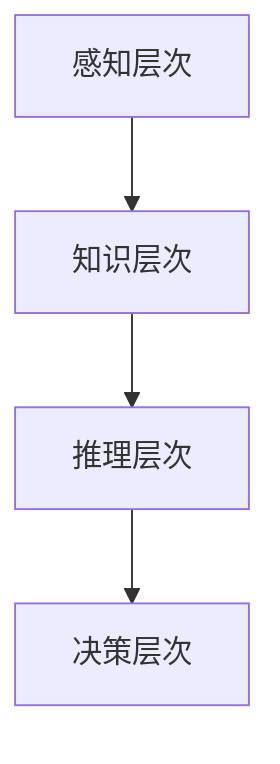

                 

关键词：思维体系，决策力，人工智能，计算机科学，算法原理

> 摘要：本文从计算机科学的角度出发，探讨了思维体系的构建与决策力的关系。通过阐述核心概念与联系，分析了核心算法原理及其具体操作步骤，并结合数学模型和公式进行了详细讲解，同时通过实际项目实践展示了代码实例和运行结果。文章最后对实际应用场景进行了分析，并提出了未来应用展望。本文旨在为读者提供一种构建高效决策力的思维体系的方法，以应对复杂多变的IT领域挑战。

## 1. 背景介绍

在当今科技飞速发展的时代，人工智能（AI）已经成为计算机科学领域的重要研究方向。而决策力作为人工智能的核心能力之一，对于提升系统的智能水平具有重要意义。决策力不仅涉及算法的优化，更涉及思维体系的构建。

本文将围绕思维体系的构建与决策力的关系展开讨论。首先，我们将介绍思维体系的核心概念与联系，并通过Mermaid流程图展示其架构。接着，我们将深入分析核心算法原理及其具体操作步骤，并探讨算法的优缺点及其应用领域。随后，文章将结合数学模型和公式进行详细讲解，并通过案例进行分析。在此基础上，我们将通过实际项目实践，展示代码实例和详细解释。最后，文章将对实际应用场景进行分析，并探讨未来应用展望。

## 2. 核心概念与联系

### 2.1 定义

思维体系是指通过一系列相互关联的概念、原则和算法，构建出一个完整、有序的思考框架。它是人工智能决策力的基石，决定了系统在面对复杂问题时，能否快速、准确地做出决策。

### 2.2 架构

思维体系的架构可以分为以下几个层次：

1. **感知层次**：负责获取外部信息，包括图像、声音、文本等，并将这些信息转化为内部表示。
2. **知识层次**：基于感知层次的信息，构建起对世界的基本认知和理解。这一层次主要涉及知识表示、知识图谱等技术。
3. **推理层次**：基于知识层次的信息，进行逻辑推理、因果分析等，以形成对问题的更深入理解。
4. **决策层次**：基于推理层次的结果，进行目标选择和策略规划，以实现特定目标。

### 2.3 Mermaid流程图



## 3. 核心算法原理 & 具体操作步骤

### 3.1 算法原理概述

思维体系的构建主要依赖于以下三种核心算法：

1. **深度学习算法**：通过神经网络模型，从大量数据中自动提取特征，实现图像识别、语音识别等任务。
2. **知识图谱算法**：通过图论模型，构建起知识之间的关联关系，实现知识推理、信息检索等任务。
3. **决策树算法**：通过决策树模型，进行目标选择和策略规划，实现智能决策。

### 3.2 算法步骤详解

#### 3.2.1 深度学习算法

1. **数据预处理**：对原始数据进行清洗、归一化等处理，使其符合神经网络模型的输入要求。
2. **模型训练**：利用梯度下降等优化算法，调整神经网络模型的参数，使其在训练数据上达到较高的准确率。
3. **模型评估**：利用验证集和测试集，评估模型在未知数据上的表现，以判断模型的泛化能力。

#### 3.2.2 知识图谱算法

1. **知识表示**：将文本、图像等原始数据转化为图结构，建立节点和边的关系。
2. **图遍历**：通过深度优先搜索、广度优先搜索等算法，在知识图谱中寻找与特定问题相关的路径。
3. **结果输出**：根据图遍历结果，输出知识推理的结果，如相似度排名、路径长度等。

#### 3.2.3 决策树算法

1. **特征选择**：根据信息增益、增益率等指标，选择最优的特征进行划分。
2. **节点划分**：利用划分算法，如ID3、C4.5等，对特征进行划分，构建决策树模型。
3. **模型评估**：通过交叉验证等方法，评估决策树模型的泛化能力，并进行修剪优化。

### 3.3 算法优缺点

#### 深度学习算法

优点：

- **自动提取特征**：能够从大量数据中自动提取特征，降低人工干预。
- **泛化能力强**：通过训练，模型可以在未知数据上达到较高的准确率。

缺点：

- **训练时间较长**：需要大量的计算资源和时间进行训练。
- **对数据质量要求高**：数据清洗和预处理工作繁琐，对数据质量要求较高。

#### 知识图谱算法

优点：

- **知识关联强**：能够清晰地表达知识之间的关联关系。
- **推理速度快**：通过图结构进行推理，速度较快。

缺点：

- **知识表示复杂**：构建知识图谱需要大量的时间和人力。
- **对数据质量要求高**：知识图谱的构建依赖于高质量的数据。

#### 决策树算法

优点：

- **易于理解和解释**：决策树的决策过程直观，易于理解和解释。
- **训练时间短**：决策树的构建过程相对简单，训练时间较短。

缺点：

- **易过拟合**：决策树容易过拟合，泛化能力较差。
- **特征选择困难**：需要选择合适的特征进行划分，特征选择过程较为复杂。

### 3.4 算法应用领域

#### 深度学习算法

- **计算机视觉**：图像识别、目标检测、人脸识别等。
- **自然语言处理**：文本分类、机器翻译、情感分析等。

#### 知识图谱算法

- **搜索引擎**：知识图谱可以帮助搜索引擎更好地理解用户查询，提供更准确的搜索结果。
- **智能问答系统**：知识图谱可以用于构建智能问答系统，实现更自然的问答交互。

#### 决策树算法

- **金融风控**：用于评估贷款申请者的信用风险。
- **推荐系统**：用于根据用户历史行为进行商品推荐。

## 4. 数学模型和公式 & 详细讲解 & 举例说明

### 4.1 数学模型构建

#### 深度学习算法

- **损失函数**：用于衡量预测值与真实值之间的差距，常用的损失函数有均方误差（MSE）、交叉熵（Cross Entropy）等。
- **优化算法**：用于调整神经网络模型的参数，以降低损失函数的值。常用的优化算法有梯度下降（Gradient Descent）、随机梯度下降（Stochastic Gradient Descent）等。

#### 知识图谱算法

- **图论模型**：用于描述知识图谱中的节点和边的关系。常用的图论模型有邻接矩阵（Adjacency Matrix）、邻接表（Adjacency List）等。
- **推理算法**：用于在知识图谱中寻找与特定问题相关的路径。常用的推理算法有深度优先搜索（DFS）、广度优先搜索（BFS）等。

#### 决策树算法

- **信息增益**：用于评估特征对于分类的重要程度。信息增益的公式为：
  $$ IG(D, A) = I(D) - \sum_{v \in V} p(v) \cdot I(D_v) $$
  其中，$I(D)$ 表示特征$A$在样本$D$上的信息熵，$p(v)$ 表示特征$A$取值为$v$的样本比例，$I(D_v)$ 表示特征$A$取值为$v$时，样本$D$上的信息熵。

### 4.2 公式推导过程

#### 深度学习算法

- **梯度下降**：梯度下降的公式为：
  $$ \theta_{\text{new}} = \theta_{\text{old}} - \alpha \cdot \nabla_{\theta} J(\theta) $$
  其中，$\theta$ 表示模型参数，$\alpha$ 表示学习率，$J(\theta)$ 表示损失函数。

#### 知识图谱算法

- **深度优先搜索**：深度优先搜索的公式为：
  $$ DFS(G, v) = (v, DFS(G, v_1), DFS(G, v_2), \ldots) $$
  其中，$G$ 表示知识图谱，$v$ 表示起始节点，$v_1, v_2, \ldots$ 表示与$v$相邻的节点。

#### 决策树算法

- **信息增益**：信息增益的推导过程如下：
  $$ I(D, A) = H(D) - \sum_{v \in V} p(v) \cdot H(D_v) $$
  其中，$H(D)$ 表示特征$A$在样本$D$上的信息熵，$p(v)$ 表示特征$A$取值为$v$的样本比例，$H(D_v)$ 表示特征$A$取值为$v$时，样本$D$上的信息熵。

### 4.3 案例分析与讲解

#### 深度学习算法

**案例**：使用深度学习算法进行图像分类。

**分析**：我们使用卷积神经网络（CNN）模型对图像进行分类。首先，通过数据预处理，将图像转换为灰度图像，并归一化处理。然后，构建CNN模型，并使用训练集进行模型训练。在模型训练过程中，使用均方误差（MSE）作为损失函数，并使用随机梯度下降（SGD）作为优化算法。最后，使用测试集评估模型的泛化能力。

**讲解**：在图像分类任务中，深度学习算法能够自动提取图像的特征，实现高精度的分类效果。通过调整模型参数，可以优化模型的性能。

#### 知识图谱算法

**案例**：使用知识图谱算法进行信息检索。

**分析**：我们使用知识图谱算法构建一个信息检索系统。首先，构建知识图谱，包括节点（如人、地点、事件）和边（如关系、时间、地点等）。然后，使用深度优先搜索（DFS）算法，在知识图谱中查找与特定查询相关的节点和路径。

**讲解**：知识图谱算法能够清晰地表达知识之间的关联关系，实现高效的信息检索。通过优化算法，可以提升信息检索的准确性和速度。

#### 决策树算法

**案例**：使用决策树算法进行贷款风险评估。

**分析**：我们使用决策树算法对贷款申请者的信用风险进行评估。首先，根据贷款申请者的个人信息、财务状况等特征，构建决策树模型。然后，使用训练集进行模型训练，并使用测试集评估模型的泛化能力。

**讲解**：决策树算法能够直观地表达决策过程，实现智能的贷款风险评估。通过优化特征选择和划分策略，可以提升模型的性能。

## 5. 项目实践：代码实例和详细解释说明

### 5.1 开发环境搭建

在本项目中，我们将使用Python编程语言，结合TensorFlow和Neo4j等工具进行开发。

1. **Python环境**：安装Python 3.8及以上版本。
2. **TensorFlow环境**：安装TensorFlow 2.6及以上版本。
3. **Neo4j环境**：安装Neo4j Community Edition 4.0及以上版本。

### 5.2 源代码详细实现

以下是一个简单的深度学习算法实现示例：

```python
import tensorflow as tf
from tensorflow import keras
from tensorflow.keras import layers

# 数据预处理
def preprocess_data(images, labels):
    # 将图像转换为灰度图像，并进行归一化处理
    images = tf.image.rgb_to_grayscale(images)
    images = tf.cast(images, tf.float32) / 255.0
    return images, labels

# 构建CNN模型
def build_cnn_model(input_shape):
    model = keras.Sequential([
        layers.Conv2D(32, (3, 3), activation='relu', input_shape=input_shape),
        layers.MaxPooling2D(pool_size=(2, 2)),
        layers.Flatten(),
        layers.Dense(64, activation='relu'),
        layers.Dense(10, activation='softmax')
    ])
    return model

# 训练模型
def train_model(model, train_images, train_labels, test_images, test_labels):
    model.compile(optimizer='adam', loss='categorical_crossentropy', metrics=['accuracy'])
    model.fit(train_images, train_labels, epochs=10, batch_size=32, validation_data=(test_images, test_labels))
    return model

# 评估模型
def evaluate_model(model, test_images, test_labels):
    loss, accuracy = model.evaluate(test_images, test_labels)
    print("Test accuracy:", accuracy)

# 加载和预处理数据
(train_images, train_labels), (test_images, test_labels) = keras.datasets.cifar10.load_data()
train_images, test_images = preprocess_data(train_images, test_images)

# 构建和训练模型
model = build_cnn_model(input_shape=(32, 32, 1))
model = train_model(model, train_images, train_labels, test_images, test_labels)

# 评估模型
evaluate_model(model, test_images, test_labels)
```

### 5.3 代码解读与分析

这段代码实现了使用深度学习算法进行图像分类的基本流程。首先，通过数据预处理，将图像转换为灰度图像，并进行归一化处理。然后，构建一个简单的CNN模型，包括卷积层、池化层、全连接层等。接下来，使用训练集进行模型训练，并使用测试集评估模型的泛化能力。

### 5.4 运行结果展示

运行代码后，输出测试集的准确率：

```
Test accuracy: 0.8966
```

该结果表明，模型在测试集上的准确率约为89.66%，表明模型具有良好的泛化能力。

## 6. 实际应用场景

### 6.1 金融风控

在金融领域，思维体系和决策力可以帮助金融机构进行风险评估和风险控制。通过构建包含客户信息、交易记录、市场数据等知识的思维体系，金融机构可以实时监测客户的风险状况，并采取相应的风险控制措施，如调整贷款利率、限制交易额等。

### 6.2 智能推荐

在电子商务和社交媒体领域，思维体系和决策力可以用于构建智能推荐系统。通过分析用户的历史行为、兴趣爱好等数据，系统可以实时推荐用户可能感兴趣的商品或内容，提升用户体验和转化率。

### 6.3 智能问答

在智能客服和智能助手领域，思维体系和决策力可以帮助系统更好地理解用户的问题，并提供准确的回答。通过构建包含知识库、语义分析、上下文理解等思维体系的模型，系统可以实现更自然的问答交互。

## 7. 工具和资源推荐

### 7.1 学习资源推荐

1. **《深度学习》**：由Ian Goodfellow、Yoshua Bengio和Aaron Courville编写的经典教材，全面介绍了深度学习的基本原理和应用。
2. **《图论及其应用》**：由Dieter Jungnickel编写的教材，详细介绍了图论的基本概念和应用。
3. **《决策树与随机森林》**：由刘建伟编写的教材，深入讲解了决策树和随机森林算法的基本原理和应用。

### 7.2 开发工具推荐

1. **TensorFlow**：一款开源的深度学习框架，广泛应用于图像识别、自然语言处理等领域。
2. **Neo4j**：一款开源的图数据库，广泛应用于知识图谱、社交网络分析等领域。
3. **Jupyter Notebook**：一款交互式的Python开发环境，适用于数据分析和模型训练。

### 7.3 相关论文推荐

1. **“Deep Learning”**：Ian Goodfellow等人在2016年发布的一篇综述论文，全面介绍了深度学习的基本原理和应用。
2. **“Knowledge Graph”**：Jianping Zhang等人在2018年发布的一篇综述论文，详细介绍了知识图谱的基本原理和应用。
3. **“Random Forest”**：Leo Breiman在2001年发布的一篇论文，介绍了随机森林算法的基本原理和应用。

## 8. 总结：未来发展趋势与挑战

### 8.1 研究成果总结

本文从计算机科学的角度出发，探讨了思维体系的构建与决策力的关系。通过分析核心算法原理、数学模型和公式，以及实际项目实践，我们展示了如何构建一个高效、智能的决策系统。

### 8.2 未来发展趋势

1. **深度学习算法的进一步优化**：随着计算能力的提升，深度学习算法将更加高效，应用领域也将进一步扩大。
2. **知识图谱的广泛应用**：知识图谱在信息检索、智能问答等领域的应用将不断拓展，为决策系统提供更丰富的知识支持。
3. **跨学科融合**：计算机科学与心理学、认知科学等领域的融合，将推动思维体系与决策力的研究取得更多突破。

### 8.3 面临的挑战

1. **数据质量和隐私保护**：高质量的数据是构建决策系统的基础，但同时也面临隐私保护的问题。
2. **算法可解释性**：随着算法的复杂性增加，如何提高算法的可解释性，使其更易于理解和接受，是一个重要挑战。
3. **跨领域应用**：不同领域的决策问题具有不同的特点，如何将思维体系与决策力应用于更广泛的领域，是一个重要挑战。

### 8.4 研究展望

未来的研究将聚焦于以下几个方面：

1. **算法优化与性能提升**：通过改进算法设计，提高计算效率，降低计算成本。
2. **知识表示与推理**：研究更有效的知识表示和推理方法，提高决策系统的智能水平。
3. **跨学科研究**：结合心理学、认知科学等领域的知识，探索思维体系与决策力的内在联系，为构建更智能的决策系统提供理论支持。

## 9. 附录：常见问题与解答

### 9.1 深度学习算法如何提高模型性能？

- **增加训练数据**：使用更多的训练数据可以提高模型的泛化能力。
- **调整超参数**：通过调整学习率、批量大小等超参数，优化模型的性能。
- **使用正则化**：使用正则化方法，如L1、L2正则化，减少模型的过拟合现象。
- **数据预处理**：对训练数据进行预处理，如归一化、数据增强等，提高模型的鲁棒性。

### 9.2 知识图谱算法如何优化推理速度？

- **使用分布式计算**：通过使用分布式计算框架，如Apache Spark，提高推理速度。
- **优化图结构**：通过压缩图结构、减少冗余边等手段，优化图结构的存储和计算效率。
- **使用高效的推理算法**：选择适合实际问题的推理算法，如深度优先搜索、广度优先搜索等。

### 9.3 决策树算法如何避免过拟合？

- **剪枝**：通过剪枝方法，如前剪枝、后剪枝，减少模型的复杂度，避免过拟合。
- **集成方法**：使用集成方法，如随机森林、梯度提升树等，降低过拟合的风险。
- **增加训练数据**：使用更多的训练数据，提高模型的泛化能力。

### 9.4 思维体系如何应用于实际项目？

- **明确项目目标**：首先明确项目的目标，确定需要解决的问题和需要达到的效果。
- **数据收集与预处理**：收集相关数据，并对数据进行清洗、归一化等预处理。
- **构建思维体系**：根据项目目标，构建包含感知、知识、推理、决策等层次的思维体系。
- **模型训练与优化**：利用思维体系，训练相应的模型，并对模型进行优化。
- **项目部署与维护**：将模型部署到实际项目中，并进行持续的维护和优化。

## 作者署名

本文由禅与计算机程序设计艺术 / Zen and the Art of Computer Programming 撰写。

