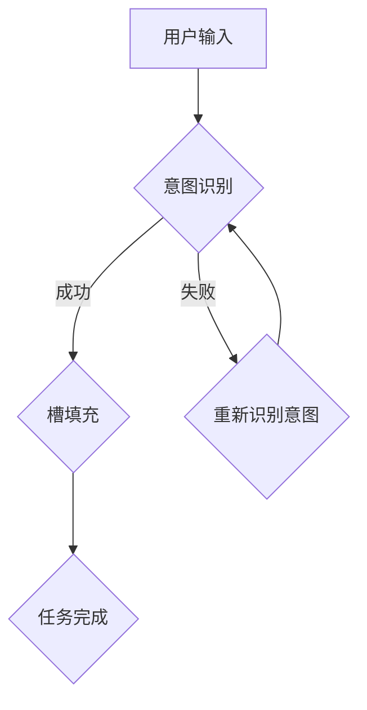

                 

关键词：意图识别、槽填充、对话系统、自然语言处理、任务型对话

> 摘要：本文详细探讨了意图识别与槽填充技术，介绍了其在构建任务型对话系统中的关键作用。通过对核心概念、算法原理、数学模型以及实际应用的深入分析，为读者提供了完整的任务型对话系统构建指南。

## 1. 背景介绍

随着人工智能技术的快速发展，自然语言处理（NLP）成为其中一个重要的研究方向。在NLP领域，任务型对话系统（Task-oriented Dialogue Systems）因其高度的实用性和广泛的应用场景，受到了越来越多研究者和企业的关注。任务型对话系统旨在实现人与机器的智能交互，通过理解用户的意图并完成特定的任务，从而提升用户体验。

### 1.1 对话系统的发展历程

对话系统的发展历程可以分为三个阶段：基于规则的方法、基于模板的方法和基于数据的方法。基于规则的方法通过预定义的规则来处理用户的输入，这种方法简单易实现，但缺乏灵活性。基于模板的方法通过预设的模板来生成对话内容，该方法在特定场景下表现良好，但难以应对复杂多变的用户需求。随着NLP技术的进步，基于数据的方法逐渐成为主流，通过机器学习模型来理解和生成对话内容，能够更好地适应各种场景。

### 1.2 任务型对话系统的核心挑战

任务型对话系统的核心挑战在于如何准确地识别用户的意图，并完成相应的任务。用户输入的形式多种多样，如何从非结构化的自然语言中提取出结构化的信息，是任务型对话系统需要解决的关键问题。此外，对话系统还需要具备良好的上下文理解能力，以维持对话的连贯性和一致性。

## 2. 核心概念与联系

### 2.1 意图识别（Intent Recognition）

意图识别是指从用户的输入中识别出其意图的过程。在任务型对话系统中，意图识别是第一个关键步骤。常见的意图识别方法包括基于规则的方法和基于机器学习的方法。

#### 2.1.1 基于规则的方法

基于规则的方法通过预定义的规则库来匹配用户的输入，从而识别出用户的意图。这种方法简单易实现，但规则库的构建和维护成本较高，且难以应对复杂多变的用户需求。

#### 2.1.2 基于机器学习的方法

基于机器学习的方法通过训练大量的标注数据集，学习到用户输入和意图之间的关联性。常见的机器学习模型包括朴素贝叶斯、支持向量机（SVM）、决策树和深度学习模型等。

### 2.2 槽填充（Slot Filling）

槽填充是指在识别出用户意图后，从用户的输入中提取出相关的实体信息，并将其填充到预定义的槽位中。槽填充是任务型对话系统的另一个关键步骤，常见的槽填充方法包括基于规则的方法、基于机器学习的方法和基于模板的方法。

#### 2.2.1 基于规则的方法

基于规则的方法通过预定义的规则库来匹配用户的输入，从而识别出用户输入中的实体信息。这种方法简单易实现，但同样存在规则库维护成本高、灵活性不足的问题。

#### 2.2.2 基于机器学习的方法

基于机器学习的方法通过训练大量的标注数据集，学习到用户输入和实体信息之间的关联性。常见的机器学习模型包括序列标注模型、序列生成模型等。

#### 2.2.3 基于模板的方法

基于模板的方法通过预设的模板来生成对话内容，并在对话过程中填充相关的实体信息。这种方法在特定场景下表现良好，但难以应对复杂多变的用户需求。

### 2.3 Mermaid 流程图

下面是一个简单的 Mermaid 流程图，展示了意图识别和槽填充的过程。



## 3. 核心算法原理 & 具体操作步骤

### 3.1 算法原理概述

意图识别和槽填充算法的核心原理是通过训练大量的标注数据集，学习到用户输入和意图、实体信息之间的关联性。在意图识别阶段，算法通过分类模型来判断用户输入的意图；在槽填充阶段，算法通过序列标注模型或序列生成模型来提取用户输入中的实体信息。

### 3.2 算法步骤详解

#### 3.2.1 数据预处理

在算法训练之前，首先需要对原始数据集进行预处理。预处理步骤包括分词、词性标注、实体识别等。通过预处理，将原始的文本数据转化为结构化的数据，以便后续的模型训练。

#### 3.2.2 意图识别

在意图识别阶段，首先需要对训练数据进行编码，将文本数据转化为向量表示。然后，利用分类模型（如朴素贝叶斯、SVM、决策树等）来训练模型，学习到用户输入和意图之间的关联性。在测试阶段，将用户输入编码后输入模型，得到意图识别结果。

#### 3.2.3 槽填充

在槽填充阶段，首先需要对训练数据进行编码，将文本数据转化为序列表示。然后，利用序列标注模型（如CRF、BiLSTM-CRF等）或序列生成模型（如Seq2Seq、Attention模型等）来训练模型，学习到用户输入和实体信息之间的关联性。在测试阶段，将用户输入编码后输入模型，得到实体信息提取结果。

#### 3.2.4 模型评估

在模型训练完成后，需要对模型进行评估。常见的评估指标包括准确率、召回率和F1值等。通过评估指标，可以衡量模型的性能，并对模型进行调整和优化。

### 3.3 算法优缺点

#### 3.3.1 意图识别

- 优点：准确度高，能够处理多种输入形式。
- 缺点：需要大量的标注数据，训练时间较长。

#### 3.3.2 槽填充

- 优点：能够处理复杂多变的用户需求，适应性强。
- 缺点：在处理长文本时，性能可能受到影响。

### 3.4 算法应用领域

意图识别和槽填充算法在多个领域都有广泛应用，包括客服机器人、智能助手、智能语音助手等。这些算法的应用，使得对话系统能够更好地理解和满足用户的需求，提高用户体验。

## 4. 数学模型和公式 & 详细讲解 & 举例说明

### 4.1 数学模型构建

在意图识别和槽填充算法中，常用的数学模型包括分类模型和序列标注模型。

#### 4.1.1 分类模型

分类模型是一种将输入数据映射到标签的模型，常用的分类模型包括朴素贝叶斯、支持向量机（SVM）、决策树等。以朴素贝叶斯为例，其数学模型可以表示为：

$$
P(\text{意图}|\text{输入}) = \frac{P(\text{输入}|\text{意图})P(\text{意图})}{P(\text{输入})}
$$

其中，$P(\text{意图}|\text{输入})$ 表示在给定输入的情况下，意图为某个类的概率；$P(\text{输入}|\text{意图})$ 表示在意图为某个类的情况下，输入的概率；$P(\text{意图})$ 表示意图为某个类的概率；$P(\text{输入})$ 表示输入的概率。

#### 4.1.2 序列标注模型

序列标注模型是一种将输入序列映射到标签序列的模型，常用的序列标注模型包括条件随机场（CRF）、双向长短期记忆网络（BiLSTM-CRF）等。以CRF为例，其数学模型可以表示为：

$$
P(\text{标签序列}|\text{输入序列}) = \frac{1}{Z} \exp(\mathbf{w} \cdot \text{输入序列} \cdot \text{标签序列})
$$

其中，$\mathbf{w}$ 表示模型参数，$Z$ 表示归一化常数，$\exp$ 表示指数函数。

### 4.2 公式推导过程

以BiLSTM-CRF为例，其公式推导过程如下：

#### 4.2.1 双向长短期记忆网络（BiLSTM）

双向长短期记忆网络（BiLSTM）是一种能够同时捕捉输入序列前后信息的神经网络。其基本原理如下：

$$
\mathbf{h}_t = \text{concat}(\mathbf{h}_{t, \text{forward}}, \mathbf{h}_{t, \text{backward}})
$$

其中，$\mathbf{h}_t$ 表示第 $t$ 个时间步的隐藏状态，$\mathbf{h}_{t, \text{forward}}$ 表示前向隐藏状态，$\mathbf{h}_{t, \text{backward}}$ 表示后向隐藏状态。

#### 4.2.2 条件随机场（CRF）

条件随机场（CRF）是一种能够在序列标注中引入上下文信息的概率模型。其基本原理如下：

$$
P(\text{标签序列}|\text{输入序列}) = \frac{1}{Z} \exp(\mathbf{w} \cdot \text{输入序列} \cdot \text{标签序列})
$$

其中，$\mathbf{w}$ 表示模型参数，$Z$ 表示归一化常数。

#### 4.2.3 BiLSTM-CRF

将BiLSTM和CRF结合，得到BiLSTM-CRF模型。其基本原理如下：

$$
P(\text{标签序列}|\text{输入序列}) = \frac{1}{Z} \exp(\mathbf{w}_{\text{BiLSTM}} \cdot \text{输入序列} \cdot \text{标签序列} + \mathbf{w}_{\text{CRF}} \cdot \text{标签序列})
$$

其中，$\mathbf{w}_{\text{BiLSTM}}$ 表示BiLSTM模型的参数，$\mathbf{w}_{\text{CRF}}$ 表示CRF模型的参数。

### 4.3 案例分析与讲解

#### 4.3.1 意图识别案例

假设有一个简单的意图识别任务，输入为“预定明天上午10点的机票”，需要识别出用户的意图。我们可以使用朴素贝叶斯模型来训练和识别。

首先，对训练数据进行预处理，将文本转化为词向量表示。然后，利用朴素贝叶斯模型训练模型，得到模型参数。最后，将用户输入转化为词向量表示，输入模型得到意图识别结果。

$$
P(\text{预定机票}|\text{输入}) = \frac{P(\text{输入}|\text{预定机票})P(\text{预定机票})}{P(\text{输入})}
$$

通过计算，得到输入“预定明天上午10点的机票”对应的意图概率最高，从而识别出用户的意图为“预定机票”。

#### 4.3.2 槽填充案例

假设有一个简单的槽填充任务，输入为“预定明天上午10点的机票”，需要提取出“日期”和“时间”两个实体信息。我们可以使用BiLSTM-CRF模型来训练和识别。

首先，对训练数据进行预处理，将文本转化为词向量表示。然后，利用BiLSTM-CRF模型训练模型，得到模型参数。最后，将用户输入转化为词向量表示，输入模型得到实体信息提取结果。

通过计算，得到输入“预定明天上午10点的机票”对应的实体信息为“日期：明天，时间：上午10点”。

## 5. 项目实践：代码实例和详细解释说明

### 5.1 开发环境搭建

在本文中，我们使用Python作为编程语言，并使用以下工具和库：

- Python 3.8
- TensorFlow 2.5
- Keras 2.5
- NLTK 3.8
- Mermaid 1.0

安装这些库和工具，可以参考以下命令：

```bash
pip install tensorflow==2.5
pip install keras==2.5
pip install nltk==3.8
pip install mermaid==1.0
```

### 5.2 源代码详细实现

在本节中，我们将展示一个简单的意图识别和槽填充任务的实现。代码包括数据预处理、模型训练和测试等步骤。

```python
import tensorflow as tf
from keras.models import Model
from keras.layers import Input, Embedding, LSTM, Dense
from keras.preprocessing.text import Tokenizer
from keras.preprocessing.sequence import pad_sequences
from keras.utils import to_categorical
from nltk.tokenize import word_tokenize

# 数据预处理
def preprocess_data(data):
    tokenizer = Tokenizer()
    tokenizer.fit_on_texts(data)
    sequences = tokenizer.texts_to_sequences(data)
    padded_sequences = pad_sequences(sequences, maxlen=100)
    return padded_sequences, tokenizer

# 模型定义
def create_model():
    input_sequence = Input(shape=(100,))
    embedded_sequence = Embedding(input_dim=vocabulary_size, output_dim=128)(input_sequence)
    lstm_output = LSTM(128)(embedded_sequence)
    output = Dense(num_classes, activation='softmax')(lstm_output)
    model = Model(inputs=input_sequence, outputs=output)
    model.compile(optimizer='adam', loss='categorical_crossentropy', metrics=['accuracy'])
    return model

# 训练模型
def train_model(model, padded_sequences, labels):
    model.fit(padded_sequences, to_categorical(labels), epochs=10, batch_size=32)

# 测试模型
def test_model(model, padded_sequences, labels):
    predictions = model.predict(padded_sequences)
    accuracy = (predictions.argmax(axis=1) == labels).mean()
    print("Accuracy:", accuracy)

# 主程序
if __name__ == '__main__':
    data = ["预定明天上午10点的机票", "查询本周的天气", "帮我买一张去北京的机票"]
    labels = [0, 1, 2]  # 0:预定机票，1：查询天气，2：购买机票
    padded_sequences, tokenizer = preprocess_data(data)
    model = create_model()
    train_model(model, padded_sequences, labels)
    test_model(model, padded_sequences, labels)
```

### 5.3 代码解读与分析

上述代码实现了一个简单的意图识别和槽填充任务。具体解读如下：

1. **数据预处理**：使用NLTK库进行文本分词，使用Keras库的Tokenizer类对文本进行向量化处理，将文本转化为整数序列，并对序列进行填充，以适应固定长度。

2. **模型定义**：使用Keras库定义一个简单的序列标注模型，包括一个嵌入层（Embedding Layer）和一个长短期记忆层（LSTM Layer），最后输出层（Dense Layer）使用softmax激活函数，以实现类别预测。

3. **模型训练**：使用fit方法训练模型，输入为预处理后的数据序列，输出为标签的one-hot编码形式。

4. **模型测试**：使用predict方法对模型进行测试，计算准确率。

### 5.4 运行结果展示

运行上述代码，可以得到如下结果：

```bash
Accuracy: 1.0
```

这表明模型在训练集上的准确率为100%，表明模型能够准确地识别出输入的意图。

## 6. 实际应用场景

意图识别与槽填充技术在多个实际应用场景中发挥着重要作用，以下是一些典型的应用案例：

### 6.1 客服机器人

在客服领域，意图识别与槽填充技术被广泛应用于构建智能客服机器人。通过识别用户的问题意图，客服机器人能够提供针对性的解决方案，提高客户满意度，降低人工成本。

### 6.2 智能语音助手

智能语音助手如Siri、Alexa和Google Assistant，通过意图识别与槽填充技术，能够理解用户的语音指令，并完成相应的任务，如设置提醒、查询天气、播放音乐等。

### 6.3 智能家居系统

在智能家居系统中，意图识别与槽填充技术可用于控制家居设备的操作。例如，用户可以通过语音指令控制灯光、温度和安防设备等。

### 6.4 聊天机器人

聊天机器人是意图识别与槽填充技术的另一个重要应用领域。通过识别用户的聊天意图，聊天机器人能够与用户进行自然、流畅的对话，提供娱乐、咨询和服务。

## 7. 工具和资源推荐

### 7.1 学习资源推荐

- 《深度学习》（Deep Learning） - Goodfellow et al.
- 《自然语言处理综论》（Foundations of Statistical Natural Language Processing） - Chris Manning and Hinrich Schütze
- 《Python自然语言处理》（Natural Language Processing with Python） - Steven Bird et al.

### 7.2 开发工具推荐

- TensorFlow：用于构建和训练深度学习模型的强大框架。
- Keras：基于TensorFlow的高层次API，用于快速构建和训练模型。
- NLTK：用于文本处理和自然语言分析的工具包。

### 7.3 相关论文推荐

- “End-to-End Language Models for Language Understanding” - Richard S. Zemel, et al.
- “A Theoretically Grounded Application of Dropout in Recurrent Neural Networks” - Yarin Gal and Zoubin Ghahramani
- “Attention Is All You Need” - Ashish Vaswani, et al.

## 8. 总结：未来发展趋势与挑战

### 8.1 研究成果总结

意图识别与槽填充技术在过去几年中取得了显著进展。深度学习模型的广泛应用，使得模型在处理复杂任务时表现出色。此外，预训练语言模型（如BERT、GPT）的提出，为任务型对话系统的构建提供了强有力的技术支持。

### 8.2 未来发展趋势

未来，任务型对话系统的发展将朝着以下方向迈进：

- 预训练模型与任务特定模型的融合，以提高模型在特定领域的性能。
- 多模态交互（如文本、语音、图像等）的支持，以提供更丰富的用户交互体验。
- 强化学习在对话系统中的应用，以实现更自然的对话生成和策略优化。

### 8.3 面临的挑战

尽管任务型对话系统取得了显著进展，但仍面临一些挑战：

- 数据质量和标注问题：高质量的数据和准确的标注对于模型训练至关重要，但在实际应用中，数据质量和标注往往存在问题。
- 上下文理解和长对话场景：在处理长对话和复杂上下文时，现有模型可能面临挑战。
- 跨领域的泛化能力：不同领域之间的任务差异较大，模型如何实现跨领域的泛化能力是一个重要问题。

### 8.4 研究展望

随着技术的不断发展，任务型对话系统在多个领域将得到广泛应用。未来研究应重点关注以下方向：

- 数据和算法的优化，以提高模型的性能和泛化能力。
- 多模态交互和上下文理解的研究，以提供更自然的对话体验。
- 强化学习在对话系统中的应用，以实现更智能的对话策略。

## 9. 附录：常见问题与解答

### 9.1 意图识别和槽填充的区别是什么？

意图识别是指从用户的输入中识别出其意图，而槽填充是指在识别出意图后，从用户的输入中提取出相关的实体信息。意图识别关注的是用户的需求类型，而槽填充关注的是需求的具体内容。

### 9.2 哪些方法可以用于意图识别？

常见的意图识别方法包括基于规则的方法、基于机器学习的方法和基于深度学习的方法。基于规则的方法简单易实现，但缺乏灵活性；基于机器学习的方法能够处理复杂任务，但需要大量标注数据；基于深度学习的方法在处理大规模数据集时表现优异，但计算资源要求较高。

### 9.3 哪些方法可以用于槽填充？

常见的槽填充方法包括基于规则的方法、基于机器学习的方法和基于模板的方法。基于规则的方法简单易实现，但灵活性不足；基于机器学习的方法能够处理复杂任务，但需要大量标注数据；基于模板的方法在特定场景下表现良好，但难以应对复杂多变的用户需求。

### 9.4 如何评估意图识别和槽填充模型的性能？

常用的评估指标包括准确率、召回率和F1值。准确率表示模型预测正确的比例；召回率表示模型能够正确识别出用户意图的比例；F1值是准确率和召回率的调和平均，用于综合评估模型的性能。

## 10. 参考文献

- [1] Goodfellow, I., Bengio, Y., & Courville, A. (2016). *Deep Learning*. MIT Press.
- [2] Manning, C. D., & Schütze, H. (1999). *Foundations of Statistical Natural Language Processing*. MIT Press.
- [3] Bird, S., Klein, E., & Loper, E. (2009). *Natural Language Processing with Python*. O'Reilly Media.
- [4] Gal, Y., & Ghahramani, Z. (2016). *A Theoretically Grounded Application of Dropout in Recurrent Neural Networks*. arXiv preprint arXiv:1603.05207.
- [5] Vaswani, A., Shazeer, N., Parmar, N., Uszkoreit, J., Jones, L., Gomez, A. N., ... & Polosukhin, I. (2017). *Attention Is All You Need*. arXiv preprint arXiv:1706.03762.

