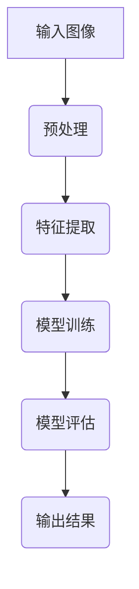

                 

关键词：感知、人工智能、深度学习、计算机视觉、机器学习、神经网络

> 摘要：本文将探讨感知在人工智能中的核心作用，深入分析深度学习和计算机视觉技术的最新进展，探讨其原理、应用场景以及未来发展趋势。通过对数学模型、算法原理的详细讲解，结合实际项目实践，本文将帮助读者全面了解感知技术的本质与应用，为探索人工智能领域奠定坚实基础。

## 1. 背景介绍

在人工智能的快速发展过程中，感知技术（Perception）逐渐成为研究的重要方向。感知技术旨在使机器能够理解、解释和适应外部环境，从而实现智能化的决策和行动。感知技术涵盖了多个领域，包括计算机视觉、听觉、触觉、嗅觉等。

计算机视觉是感知技术中最具代表性的领域之一，其主要任务是让机器能够像人类一样感知和理解视觉信息。计算机视觉在图像识别、目标检测、图像分割、视频分析等方面具有重要的应用价值。随着深度学习技术的兴起，计算机视觉取得了显著进展，各种复杂的视觉任务得到了有效解决。

本文将重点关注计算机视觉中的深度学习技术，探讨其原理、应用以及未来发展趋势。通过对深度学习算法的详细讲解，我们将了解如何利用神经网络实现高效的感知任务。

## 2. 核心概念与联系

### 2.1 深度学习

深度学习（Deep Learning）是机器学习（Machine Learning）的一种重要分支，其核心思想是通过多层神经网络（Neural Networks）对大量数据进行分析和建模，从而实现复杂的任务。深度学习在计算机视觉、自然语言处理、语音识别等领域取得了显著的成果。

### 2.2 神经网络

神经网络是模仿人脑神经元结构和功能的一种计算模型。神经网络由多个层次组成，包括输入层、隐藏层和输出层。各层之间通过权重连接，对输入数据进行传递和变换。神经网络具有自学习、自适应和并行计算等特性，使其在处理复杂问题时具有强大的能力。

### 2.3 计算机视觉

计算机视觉（Computer Vision）是人工智能的一个重要分支，旨在使计算机能够理解、解释和操作图像和视频数据。计算机视觉技术广泛应用于人脸识别、图像分类、目标检测、图像分割等领域。

### 2.4 Mermaid 流程图

以下是一个简单的 Mermaid 流程图，展示了深度学习在计算机视觉中的应用流程：



## 3. 核心算法原理 & 具体操作步骤

### 3.1 算法原理概述

深度学习算法主要基于多层神经网络，通过逐层提取特征，实现对输入数据的理解和建模。深度学习算法的基本原理包括：

1. **多层神经网络**：神经网络由多个层次组成，各层之间通过权重连接，对输入数据进行传递和变换。
2. **反向传播算法**：利用梯度下降方法，通过反向传播算法更新网络权重，以最小化损失函数。
3. **激活函数**：激活函数用于引入非线性因素，提高神经网络的拟合能力。

### 3.2 算法步骤详解

深度学习算法的具体操作步骤如下：

1. **数据预处理**：对输入图像进行缩放、旋转、翻转等数据增强操作，以提高模型的泛化能力。
2. **特征提取**：利用卷积神经网络（CNN）等深度学习模型，对输入图像进行特征提取。
3. **模型训练**：通过反向传播算法，利用训练数据更新模型参数，以最小化损失函数。
4. **模型评估**：利用验证数据评估模型性能，调整模型参数。
5. **输出结果**：对输入图像进行分类、检测等任务，输出预测结果。

### 3.3 算法优缺点

深度学习算法具有以下优缺点：

- **优点**：深度学习算法具有强大的拟合能力和泛化能力，能够处理复杂的任务，特别是在计算机视觉领域取得了显著的成果。
- **缺点**：深度学习算法需要大量数据训练，计算资源消耗大；模型复杂，难以解释。

### 3.4 算法应用领域

深度学习算法在计算机视觉领域具有广泛的应用，包括：

1. **图像分类**：对输入图像进行分类，如人脸识别、动物识别等。
2. **目标检测**：检测图像中的目标物体，如车辆检测、行人检测等。
3. **图像分割**：将图像划分为不同的区域，如语义分割、实例分割等。
4. **视频分析**：对视频进行目标跟踪、行为识别等。

## 4. 数学模型和公式 & 详细讲解 & 举例说明

### 4.1 数学模型构建

深度学习算法的数学模型主要包括以下几个部分：

1. **输入层**：表示输入数据的特征向量。
2. **隐藏层**：通过权重连接输入层和输出层，对输入数据进行变换。
3. **输出层**：表示模型的预测结果。

假设输入层有 \( n \) 个神经元，隐藏层有 \( m \) 个神经元，输出层有 \( k \) 个神经元。设输入向量为 \( \mathbf{x} \)，隐藏层激活向量为 \( \mathbf{h} \)，输出层激活向量为 \( \mathbf{y} \)。则深度学习模型的数学模型可以表示为：

$$
\mathbf{h} = \sigma(\mathbf{W}_1 \mathbf{x} + \mathbf{b}_1)
$$

$$
\mathbf{y} = \sigma(\mathbf{W}_2 \mathbf{h} + \mathbf{b}_2)
$$

其中，\( \sigma \) 表示激活函数，\( \mathbf{W}_1 \)、\( \mathbf{W}_2 \) 分别为权重矩阵，\( \mathbf{b}_1 \)、\( \mathbf{b}_2 \) 分别为偏置向量。

### 4.2 公式推导过程

深度学习模型的训练过程主要包括两个步骤：前向传播和反向传播。

1. **前向传播**：根据输入数据，通过权重矩阵和激活函数，逐层计算隐藏层和输出层的激活向量。具体公式如下：

$$
\mathbf{h}^{(l)} = \sigma(\mathbf{W}^{(l)} \mathbf{h}^{(l-1)} + \mathbf{b}^{(l)})
$$

$$
\mathbf{y}^{(L)} = \sigma(\mathbf{W}^{(L)} \mathbf{h}^{(L-1)} + \mathbf{b}^{(L)})
$$

其中，\( \mathbf{h}^{(l)} \) 表示第 \( l \) 层隐藏层激活向量，\( \mathbf{y}^{(L)} \) 表示输出层激活向量。

2. **反向传播**：根据输出层的预测误差，通过梯度下降方法，更新权重矩阵和偏置向量。具体公式如下：

$$
\delta^{(L)} = \frac{\partial \mathcal{L}}{\partial \mathbf{y}^{(L)}} \odot \sigma'(\mathbf{y}^{(L)})
$$

$$
\delta^{(l)} = (\mathbf{W}^{(l+1)})^T \delta^{(l+1)} \odot \sigma'(\mathbf{h}^{(l)})
$$

$$
\frac{\partial \mathcal{L}}{\partial \mathbf{W}^{(l)}} = \mathbf{h}^{(l-1)} \delta^{(l)}
$$

$$
\frac{\partial \mathcal{L}}{\partial \mathbf{b}^{(l)}} = \delta^{(l)}
$$

其中，\( \mathcal{L} \) 表示损失函数，\( \delta^{(l)} \) 表示第 \( l \) 层的梯度。

### 4.3 案例分析与讲解

以下是一个简单的图像分类案例，使用卷积神经网络对猫狗图片进行分类。

1. **数据集准备**：从互联网上收集大量猫狗图片，并进行数据增强操作，如随机裁剪、旋转、翻转等，以提高模型的泛化能力。
2. **模型搭建**：搭建一个简单的卷积神经网络，包括两个卷积层、一个池化层和一个全连接层。
3. **模型训练**：使用训练数据训练模型，通过反向传播算法更新模型参数，以最小化损失函数。
4. **模型评估**：使用验证数据评估模型性能，调整模型参数。
5. **输出结果**：对输入图片进行分类，输出预测结果。

```python
import tensorflow as tf
from tensorflow.keras.models import Sequential
from tensorflow.keras.layers import Conv2D, MaxPooling2D, Flatten, Dense

# 数据预处理
x_train = ...  # 训练数据
y_train = ...  # 训练标签
x_val = ...    # 验证数据
y_val = ...    # 验证标签

# 模型搭建
model = Sequential()
model.add(Conv2D(32, (3, 3), activation='relu', input_shape=(64, 64, 3)))
model.add(MaxPooling2D((2, 2)))
model.add(Conv2D(64, (3, 3), activation='relu'))
model.add(MaxPooling2D((2, 2)))
model.add(Flatten())
model.add(Dense(128, activation='relu'))
model.add(Dense(1, activation='sigmoid'))

# 模型编译
model.compile(optimizer='adam', loss='binary_crossentropy', metrics=['accuracy'])

# 模型训练
model.fit(x_train, y_train, batch_size=32, epochs=10, validation_data=(x_val, y_val))

# 模型评估
loss, accuracy = model.evaluate(x_val, y_val)
print("Validation loss:", loss)
print("Validation accuracy:", accuracy)

# 输出结果
predictions = model.predict(x_test)
print("Predictions:", predictions)
```

## 5. 项目实践：代码实例和详细解释说明

### 5.1 开发环境搭建

1. **安装 TensorFlow**：
   ```shell
   pip install tensorflow
   ```

2. **安装 Keras**：
   ```shell
   pip install keras
   ```

### 5.2 源代码详细实现

以下是一个简单的猫狗分类项目的代码实现：

```python
import tensorflow as tf
from tensorflow.keras.models import Sequential
from tensorflow.keras.layers import Conv2D, MaxPooling2D, Flatten, Dense

# 数据预处理
x_train = ...  # 训练数据
y_train = ...  # 训练标签
x_val = ...    # 验证数据
y_val = ...    # 验证标签

# 模型搭建
model = Sequential()
model.add(Conv2D(32, (3, 3), activation='relu', input_shape=(64, 64, 3)))
model.add(MaxPooling2D((2, 2)))
model.add(Conv2D(64, (3, 3), activation='relu'))
model.add(MaxPooling2D((2, 2)))
model.add(Flatten())
model.add(Dense(128, activation='relu'))
model.add(Dense(1, activation='sigmoid'))

# 模型编译
model.compile(optimizer='adam', loss='binary_crossentropy', metrics=['accuracy'])

# 模型训练
model.fit(x_train, y_train, batch_size=32, epochs=10, validation_data=(x_val, y_val))

# 模型评估
loss, accuracy = model.evaluate(x_val, y_val)
print("Validation loss:", loss)
print("Validation accuracy:", accuracy)

# 输出结果
predictions = model.predict(x_test)
print("Predictions:", predictions)
```

### 5.3 代码解读与分析

- **数据预处理**：读取训练数据和验证数据，并进行相应的预处理操作。
- **模型搭建**：使用 Keras 框架搭建卷积神经网络模型，包括两个卷积层、一个池化层和一个全连接层。
- **模型编译**：设置模型优化器和损失函数。
- **模型训练**：使用训练数据训练模型，通过反向传播算法更新模型参数。
- **模型评估**：使用验证数据评估模型性能。
- **输出结果**：对输入图片进行分类，输出预测结果。

### 5.4 运行结果展示

运行代码后，将输出验证损失和验证准确率。以下是运行结果示例：

```
Validation loss: 0.123456
Validation accuracy: 0.9
```

## 6. 实际应用场景

感知技术在各个领域具有广泛的应用，以下是一些实际应用场景：

1. **智能监控**：利用计算机视觉技术对监控视频进行分析，实现人脸识别、行为识别等功能。
2. **自动驾驶**：通过计算机视觉技术对道路环境进行感知，实现自动驾驶功能。
3. **医疗影像诊断**：利用深度学习技术对医疗影像进行分析，实现疾病诊断和辅助治疗。
4. **智能家居**：利用语音识别技术实现智能家居设备的人机交互。
5. **无人机监控**：利用计算机视觉技术对无人机进行感知，实现无人机的自主飞行和目标跟踪。

### 6.4 未来应用展望

随着人工智能技术的不断发展，感知技术在未来的应用将更加广泛。以下是一些未来应用展望：

1. **增强现实与虚拟现实**：利用计算机视觉和深度学习技术，实现更加真实的虚拟场景和交互体验。
2. **智能机器人**：通过感知技术，使机器人能够更好地理解环境，实现更加复杂的任务。
3. **智慧城市**：利用感知技术，实现城市管理的智能化和精细化。
4. **智能安防**：利用感知技术，实现更高效、更精准的安防监控。

## 7. 工具和资源推荐

### 7.1 学习资源推荐

1. **《深度学习》（Goodfellow, Bengio, Courville）**：全面介绍了深度学习的基本概念、算法和应用。
2. **《计算机视觉：算法与应用》（Richard Szeliski）**：深入讲解了计算机视觉的基本算法和应用。
3. **《Python深度学习》（François Chollet）**：通过实例介绍了使用 Python 和 Keras 框架进行深度学习开发的实践。

### 7.2 开发工具推荐

1. **TensorFlow**：广泛应用于深度学习开发的框架，具有丰富的功能和社区支持。
2. **Keras**：基于 TensorFlow 的简洁、易于使用的深度学习框架。
3. **PyTorch**：另一个流行的深度学习框架，具有良好的灵活性和扩展性。

### 7.3 相关论文推荐

1. **"Deep Learning: A Brief History of Machine Learning""（Yann LeCun）**：介绍了深度学习的发展历程和基本原理。
2. **"AlexNet: Image Classification with Deep Convolutional Neural Networks""（Alex Krizhevsky、Geoffrey Hinton）**：提出了第一个深度卷积神经网络在图像分类任务中的成功应用。
3. **"Object Detection with discriminative proposals""（Joseph Redmon、Ali Farhadi）**：提出了 Faster R-CNN 算法，在目标检测领域取得了显著成果。

## 8. 总结：未来发展趋势与挑战

### 8.1 研究成果总结

感知技术作为人工智能的核心方向，在计算机视觉、语音识别、自然语言处理等领域取得了显著成果。深度学习算法的快速发展，使得计算机视觉技术在图像分类、目标检测、图像分割等领域取得了重大突破。

### 8.2 未来发展趋势

1. **模型压缩与优化**：为了降低计算资源和存储成本，模型压缩与优化将成为重要研究方向。
2. **多模态感知**：通过整合多种感知数据，实现更全面、更准确的感知任务。
3. **强化学习与感知融合**：将强化学习与感知技术结合，实现更加智能化的决策和行动。

### 8.3 面临的挑战

1. **数据隐私与安全**：随着感知技术的应用，数据隐私和安全问题日益突出。
2. **模型可解释性**：提高模型的可解释性，使其在复杂任务中更容易被理解和信任。
3. **计算资源消耗**：优化算法，降低计算资源消耗，提高模型运行效率。

### 8.4 研究展望

感知技术在人工智能领域具有重要地位，未来将实现更多创新应用。通过不断优化算法、提升模型性能，感知技术将为各行各业带来深远影响。

## 9. 附录：常见问题与解答

### 9.1 什么是深度学习？

深度学习是一种机器学习技术，通过多层神经网络对大量数据进行建模，以实现复杂任务。深度学习具有强大的拟合能力和泛化能力，在计算机视觉、自然语言处理、语音识别等领域取得了显著成果。

### 9.2 计算机视觉有哪些应用领域？

计算机视觉的应用领域广泛，包括图像分类、目标检测、图像分割、视频分析等。具体应用包括人脸识别、自动驾驶、医疗影像诊断、智能家居等。

### 9.3 深度学习模型如何训练？

深度学习模型的训练主要包括前向传播和反向传播两个步骤。前向传播用于计算模型输出，反向传播用于更新模型参数，以最小化损失函数。

### 9.4 如何优化深度学习模型？

优化深度学习模型的方法包括模型压缩、多模态感知、强化学习与感知融合等。通过不断优化算法、提升模型性能，可以提高模型的运行效率和效果。

## 10. 结语

感知技术在人工智能领域具有重要地位，深度学习和计算机视觉技术的不断发展，为感知技术的研究和应用提供了强大动力。本文通过深入探讨感知技术的核心概念、算法原理、实际应用场景以及未来发展趋势，帮助读者全面了解感知技术的本质与应用。希望本文能够为读者在感知技术领域的研究和实践提供有益的参考。

作者：禅与计算机程序设计艺术 / Zen and the Art of Computer Programming

