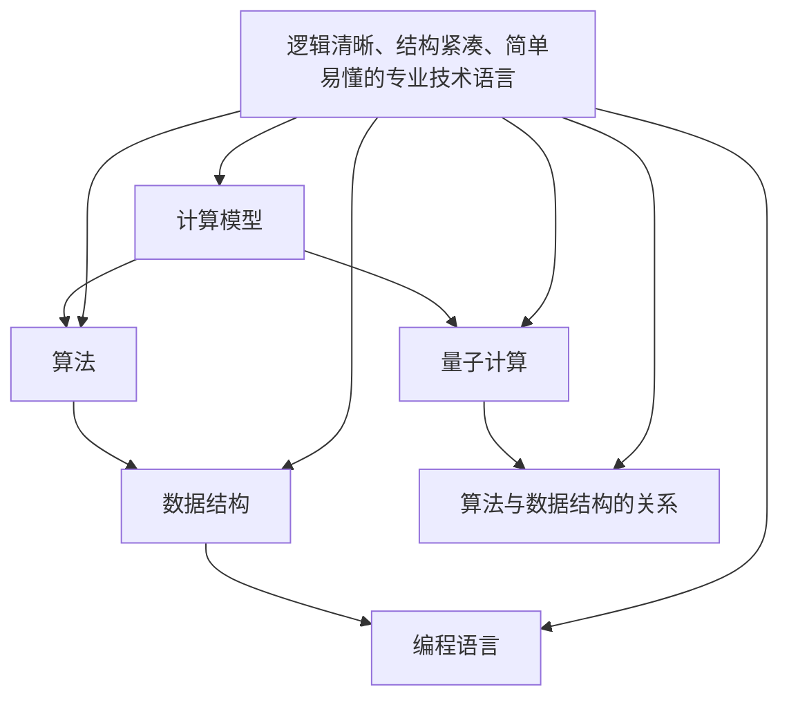

                 

### 引言

理查德·费曼（Richard Phillips Feynman），二十世纪最杰出的理论物理学家之一，以其在量子力学和量子场论领域的卓越贡献而闻名于世。他不仅是一位杰出的科学家，更是一位充满智慧和好奇心的思想家。费曼曾说过：“我无法创造的东西，我就不明白。”这句话深刻地反映了他对科学探索的执着和对真理的追求。

本文旨在探讨费曼的这一名言在计算机科学领域的应用，通过深入剖析核心概念、算法原理、数学模型以及实际应用，揭示计算机科学中那些深邃而迷人的奥秘。本文将分为以下几个部分：

1. 背景介绍
2. 核心概念与联系
3. 核心算法原理 & 具体操作步骤
4. 数学模型和公式 & 详细讲解 & 举例说明
5. 项目实践：代码实例和详细解释说明
6. 实际应用场景
7. 工具和资源推荐
8. 总结：未来发展趋势与挑战
9. 附录：常见问题与解答

通过这篇文章，我们希望读者能够对计算机科学有一个全新的认识，理解到“创造与理解”之间的密切关系，并激发对这一领域的深入探索和研究。

### 1. 背景介绍

计算机科学作为一门涉及计算机硬件、软件以及应用的科学，其历史可以追溯到二十世纪四十年代。从最初的电子计算机到现代的超级计算机，计算机科学经历了前所未有的飞速发展。在这个过程中，无数科学家和工程师们为这一领域做出了卓越的贡献，其中不乏像理查德·费曼这样伟大的思想家。

理查德·费曼在计算机科学领域的影响同样深远。尽管他主要以物理学家身份闻名，但他在量子计算和计算机架构方面的贡献不容忽视。他的研究不仅推动了量子力学的发展，也为计算机科学的进步提供了新的视角和方法。

费曼的量子计算理论为现代量子计算机的构建奠定了基础。他提出了量子逻辑门的概念，这种基本操作可以用来实现量子比特之间的逻辑运算。量子逻辑门是量子计算机中的核心组件，类似于经典计算机中的逻辑门。费曼的研究展示了量子计算机在处理某些特定问题上的巨大潜力，尤其是在大数分解和量子模拟等领域。

此外，费曼还参与了早期计算机硬件的设计和开发。他的一些研究工作直接影响了计算机架构的发展，例如他在数字电路设计和处理器设计方面的贡献。这些研究不仅丰富了计算机科学的理论基础，也为实际应用提供了新的思路和工具。

费曼的哲学思想，尤其是他的“无法创造的东西，我就不明白”这一观点，对计算机科学的研究和实践有着深远的影响。这种思想鼓励科学家们不仅仅停留在理论的探索上，更要通过实际操作来深入理解复杂的计算机系统和算法。通过这种“创造与理解”相结合的方法，计算机科学家们能够更全面地掌握技术，推动科学技术的进步。

总的来说，理查德·费曼在计算机科学领域的影响是多方面的，他的研究不仅推动了科学理论的发展，也为实际应用提供了新的思路和工具。他的哲学思想更是激励了无数科学家和工程师，使他们更加坚定地追求科学的真理，推动计算机科学不断向前发展。

### 2. 核心概念与联系

在深入探讨费曼的名言之前，我们需要明确几个核心概念，它们不仅构成了计算机科学的基础，也是理解这一名言的关键。以下是本文中将要讨论的几个核心概念：

#### 2.1 计算模型

计算模型是计算机科学的核心概念之一，它定义了计算机执行计算任务的方式。最基本的计算模型包括图灵机、递归可枚举集和可计算数等。图灵机是由英国数学家艾伦·图灵（Alan Turing）提出的一种抽象计算设备，能够模拟任何可计算过程。递归可枚举集和可计算数则进一步探讨了计算能力的边界。

#### 2.2 算法

算法是计算机科学中解决特定问题的系统方法。一个有效的算法不仅要能够解决问题，还要具备较高的效率。算法设计是计算机科学中的一个重要研究领域，涉及从排序到搜索，从数据结构设计到图论等多个方面。

#### 2.3 数据结构

数据结构是算法设计的基础，它定义了数据的组织和存储方式。常见的数据结构包括数组、链表、栈、队列、树、图等。每种数据结构都有其特定的应用场景和优缺点。合理选择和使用数据结构可以显著提高算法的效率。

#### 2.4 编程语言

编程语言是计算机与人类交流的工具。不同的编程语言有不同的语法和语义，适用于不同的计算任务。从低级语言如汇编语言到高级语言如Python、Java，编程语言的不断进步推动了计算机科学的发展。

#### 2.5 量子计算

量子计算是近年来计算机科学领域的热点，它利用量子力学原理来实现计算。量子计算机通过量子比特（qubit）进行计算，具有与传统计算机截然不同的特性，如叠加态和纠缠态。量子逻辑门是量子计算机中的基本操作单元，类似于经典计算机中的逻辑门。

#### 2.6 算法与数据结构的关系

算法与数据结构之间存在着紧密的联系。算法的效率很大程度上取决于数据结构的选择。例如，在排序算法中，选择不同的数据结构（如数组、链表）会导致算法的时间复杂度不同。同样，在图算法中，图的存储方式（如邻接矩阵、邻接表）也会影响算法的性能。

### 2.7 逻辑清晰、结构紧凑、简单易懂的专业技术语言

在撰写专业技术文章时，使用逻辑清晰、结构紧凑、简单易懂的语言至关重要。这不仅仅是语言的选择问题，更是一种表达技巧。以下是一些撰写高质量技术文章的建议：

- **结构化表达**：确保文章有一个清晰的结构，包括引言、正文、结论和参考文献等部分。每个部分都要有明确的标题和段落，使读者能够轻松理解。
- **使用专业术语**：在适当的情况下，使用专业术语和缩写可以提高文章的专业性和准确性。但要注意，不要过度使用难以理解的术语，以免读者难以跟随。
- **举例说明**：通过具体的例子来解释复杂的概念和算法，可以帮助读者更好地理解和记忆。
- **图表与代码**：合理使用图表和代码示例可以直观地展示技术细节，使文章更加生动和易懂。图表应简洁明了，代码应注释详尽。
- **清晰的逻辑**：文章的逻辑结构应紧凑、连贯，确保每个部分都有明确的目的和合理的过渡。

### 2.8 Mermaid 流程图

为了更直观地展示核心概念之间的联系，我们可以使用Mermaid语言绘制流程图。以下是几个示例：



这个流程图展示了计算模型、算法、数据结构、编程语言、量子计算以及它们之间的关系。同时，也体现了逻辑清晰、结构紧凑、简单易懂的专业技术语言在这一过程中的重要性。

通过这些核心概念和流程图的展示，我们不仅能够更全面地理解计算机科学的基本结构，也能更好地理解费曼的名言——“我无法创造的东西，我就不明白”。在接下来的部分中，我们将深入探讨这些概念和算法的原理，并分析费曼的哲学思想在计算机科学中的实际应用。

### 3. 核心算法原理 & 具体操作步骤

在深入探讨计算机科学的核心算法原理之前，我们需要了解几个关键算法的原理和操作步骤。这些算法不仅构成了现代计算机科学的基础，也在实际应用中发挥着至关重要的作用。

#### 3.1 算法原理概述

算法原理是指算法在解决问题时遵循的基本逻辑和步骤。以下我们将介绍几种重要的算法原理：

- **排序算法**：排序算法是计算机科学中最基础且广泛应用的一类算法。常见的排序算法包括冒泡排序、选择排序、插入排序、快速排序和归并排序等。每种排序算法都有其特定的原理和优缺点。

- **搜索算法**：搜索算法用于在数据结构中查找特定元素。常用的搜索算法有线性搜索和二分搜索。二分搜索利用中值分割的思想，能够显著提高搜索效率。

- **图算法**：图算法用于解决图相关的问题，如最短路径、拓扑排序和最小生成树等。图的存储方式（如邻接矩阵和邻接表）和算法的选择对性能有重要影响。

- **动态规划**：动态规划是一种用于求解最优化问题的算法原理，其基本思想是将复杂问题分解为若干个子问题，并利用子问题的解来求解原问题。动态规划广泛应用于路径规划、资源分配等问题。

- **分治算法**：分治算法是一种递归算法，其基本思想是将一个复杂问题分解为若干个规模较小的相同问题，然后分别解决，最后将子问题的解合并为原问题的解。

#### 3.2 算法步骤详解

下面我们将具体介绍几种常见算法的步骤和操作：

##### 3.2.1 冒泡排序

冒泡排序是一种简单的排序算法，其原理是通过多次遍历待排序的序列，每次遍历都从未排序的部分中选择最大（或最小）的元素，放到已排序序列的末尾。

**步骤**：

1. 从第一个元素开始，比较相邻的两个元素，如果第一个比第二个大（升序排序），就交换它们的位置。
2. 对每一对相邻元素做同样的工作，从开始第一对到结尾的最后一对。完成第一趟遍历后，最后一个元素就是最大的元素。
3. 接下来，开始第二趟遍历，但不包括最后一个已经排好的元素。重复上面的步骤，直到没有需要比较的元素。

**代码示例**（Python）：

```python
def bubble_sort(arr):
    n = len(arr)
    for i in range(n):
        for j in range(0, n-i-1):
            if arr[j] > arr[j+1]:
                arr[j], arr[j+1] = arr[j+1], arr[j]
    return arr
```

##### 3.2.2 二分搜索

二分搜索是一种高效的搜索算法，其基本思想是将有序数组分成两半，根据目标值与中间值的比较，决定是搜索左半部分还是右半部分。

**步骤**：

1. 确定数组的中间索引`mid`。
2. 如果`mid`位置的元素值等于目标值，则搜索成功。
3. 如果`mid`位置的元素值大于目标值，则在数组的左半部分继续搜索。
4. 如果`mid`位置的元素值小于目标值，则在数组的右半部分继续搜索。
5. 重复上述步骤，直到找到目标值或子数组为空。

**代码示例**（Python）：

```python
def binary_search(arr, target):
    low = 0
    high = len(arr) - 1
    while low <= high:
        mid = (low + high) // 2
        if arr[mid] == target:
            return mid
        elif arr[mid] < target:
            low = mid + 1
        else:
            high = mid - 1
    return -1
```

##### 3.2.3 最小生成树

最小生成树是一种图算法，用于从无向图中提取一棵包含所有节点的树，使得树中所有边的权值之和最小。普里姆算法和克鲁斯卡尔算法是两种常见求解最小生成树的方法。

**普里姆算法步骤**：

1. 选择图中的任意一个节点作为起始点。
2. 从起始点开始，添加一条权值最小的边到树中。
3. 对于新加入的边，在图中查找另一端的节点，将其加入到树中。
4. 重复步骤2和步骤3，直到所有节点都加入到树中。

**克鲁斯卡尔算法步骤**：

1. 按照边权值从小到大排序。
2. 创建一个森林，其中每个节点都是一个独立的树。
3. 遍历排序后的边，对于每一条边，如果该边的两个端点不在同一个树中，则将这条边加入到树中，否则忽略。
4. 重复步骤3，直到森林中的树合并成一棵树。

##### 3.2.4 动态规划

动态规划解决最优化问题，其核心思想是将问题分解为多个子问题，并利用子问题的解来构建原问题的解。

**步骤**：

1. 确定子问题的状态和状态转移方程。
2. 设计一个表或数组来存储子问题的解。
3. 根据状态转移方程和初始条件填充表或数组的值。
4. 利用填充好的表或数组的值求解原问题。

**代码示例**（Python）：Fibonacci数列的动态规划解法

```python
def fib(n):
    if n <= 1:
        return n
    dp = [0] * (n+1)
    dp[1] = 1
    for i in range(2, n+1):
        dp[i] = dp[i-1] + dp[i-2]
    return dp[n]
```

##### 3.2.5 分治算法

分治算法将问题分解为几个较小的子问题，递归求解子问题，并将子问题的解合并为原问题的解。

**步骤**：

1. 将问题分解为几个较小的子问题。
2. 递归求解子问题。
3. 将子问题的解合并为原问题的解。

**代码示例**（Python）：归并排序

```python
def merge_sort(arr):
    if len(arr) <= 1:
        return arr
    mid = len(arr) // 2
    left = merge_sort(arr[:mid])
    right = merge_sort(arr[mid:])
    return merge(left, right)

def merge(left, right):
    result = []
    i = j = 0
    while i < len(left) and j < len(right):
        if left[i] < right[j]:
            result.append(left[i])
            i += 1
        else:
            result.append(right[j])
            j += 1
    result.extend(left[i:])
    result.extend(right[j:])
    return result
```

通过以上对核心算法原理和具体操作步骤的介绍，我们可以更好地理解计算机科学中的复杂问题是如何通过合理的算法和步骤得到解决的。接下来，我们将进一步探讨这些算法的优缺点，并分析它们在实际应用领域中的表现。

#### 3.3 算法的优缺点

在计算机科学中，算法的优缺点直接影响到其在不同场景下的适用性。以下是一些常见算法的优缺点分析：

##### 3.3.1 冒泡排序

**优点**：
- 简单易懂，实现代码短。
- 稳定排序，相同值的元素排序后相对位置不变。

**缺点**：
- 时间复杂度为O(n^2)，在数据量较大时效率较低。
- 不是原地排序，需要额外的内存空间。

##### 3.3.2 二分搜索

**优点**：
- 时间复杂度为O(log n)，在数据量较大时非常高效。
- 需要数据有序，一旦排序完成，多次搜索可以利用相同数据结构。

**缺点**：
- 数据需要先排序，增加了预处理时间。
- 不适用于动态变化的数组。

##### 3.3.3 最小生成树

**普里姆算法**：

**优点**：
- 算法简单，容易理解。
- 边的权值需要是有序的，便于选择最小边。

**缺点**：
- 时间复杂度为O(ElogV)，其中E为边数，V为节点数，在某些情况下效率可能较低。

**克鲁斯卡尔算法**：

**优点**：
- 时间复杂度为O(ElogE)，对稀疏图非常有效。
- 可以处理动态变化的图。

**缺点**：
- 边的权值不需要有序，但需要处理复杂的合并过程。

##### 3.3.4 动态规划

**优点**：
- 可以高效地解决最优化问题。
- 通过存储子问题的解避免了重复计算。

**缺点**：
- 设计和实现相对复杂。
- 对问题状态转移方程的依赖较强，对于复杂的问题可能难以直接应用。

##### 3.3.5 分治算法

**优点**：
- 时间复杂度通常为O(nlogn)，在某些情况下可以达到O(n)。
- 递归结构使得算法易于理解和实现。

**缺点**：
- 可能存在大量的递归调用，导致大量的函数调用开销。
- 对于某些问题，分治策略可能不是最优的。

通过以上对算法优缺点的分析，我们可以更好地选择适用于特定场景的算法。在接下来的部分，我们将探讨这些算法在实际应用领域中的具体应用，展示它们在现实世界中的价值。

#### 3.4 算法的应用领域

算法在计算机科学中的重要性不言而喻，不同的算法在不同领域有着广泛的应用。以下我们将探讨一些关键算法在现实世界中的具体应用领域。

##### 3.4.1 排序算法

排序算法是计算机科学中最基础且应用广泛的算法之一，被广泛应用于各种数据处理任务。以下是排序算法的一些主要应用领域：

- **数据库管理**：数据库中的记录需要进行排序以支持快速查询和索引。
- **搜索引擎**：搜索引擎需要对搜索结果进行排序，以提供相关性较高的结果。
- **图形学**：在图形渲染过程中，排序算法用于对图形元素进行排序以实现高效的渲染。

##### 3.4.2 搜索算法

搜索算法在计算机科学中有着广泛的应用，主要用于数据查找和路径规划。以下是搜索算法的一些主要应用领域：

- **搜索引擎**：搜索引擎使用搜索算法来快速定位网页和文档。
- **路由算法**：网络中的路由器使用搜索算法来确定数据包的传输路径。
- **自动驾驶**：自动驾驶汽车使用搜索算法来规划行车路线和规避障碍物。

##### 3.4.3 图算法

图算法在解决与网络和结构化数据相关的问题时尤为重要。以下是图算法的一些主要应用领域：

- **社交网络分析**：图算法用于分析社交网络中的关系和社群结构。
- **交通网络规划**：图算法用于优化交通路线和交通流量控制。
- **生物信息学**：图算法用于分析生物分子之间的相互作用和结构。

##### 3.4.4 动态规划

动态规划在解决最优化问题方面具有独特的优势，被广泛应用于以下几个方面：

- **资源分配**：动态规划用于优化资源分配问题，如背包问题。
- **路径规划**：动态规划在路径规划问题中，如旅行商问题，具有重要作用。
- **经济学**：动态规划在经济学中用于优化决策过程。

##### 3.4.5 分治算法

分治算法在解决复杂问题时具有高效性和易于理解的特点，被广泛应用于以下几个方面：

- **图像处理**：分治算法用于图像的分割和处理。
- **分布式计算**：分治算法用于分布式系统中的任务分解和并行处理。
- **自然语言处理**：分治算法用于自然语言处理中的文本分割和语法分析。

通过上述分析，我们可以看到算法在计算机科学中的多样性和重要性。不同的算法在不同领域有着广泛的应用，为解决各种复杂问题提供了强有力的工具。接下来，我们将进一步探讨算法在现实世界中的实际应用案例，展示算法如何具体地解决实际问题。

#### 3.5 算法的实际应用案例

算法在现实世界的应用中，扮演着至关重要的角色。通过具体案例，我们可以看到算法如何有效地解决实际问题，推动科技进步和社会发展。以下是一些算法在实际应用中的具体案例。

##### 3.5.1 数据库中的排序算法

在数据库管理系统中，排序算法被广泛应用于数据的组织和检索。例如，MySQL数据库在处理查询时，经常需要对结果集进行排序。冒泡排序和快速排序是常用的排序算法。

**案例**：电子商务平台订单处理

一个大型电子商务平台每天处理数以百万计的订单。为了确保用户能够快速、准确地找到所需商品，平台需要对这些订单进行排序。例如，根据下单时间对订单进行升序排序，以便用户能够查看最近的订单。

**解决方案**：使用快速排序算法对订单列表进行排序。快速排序具有较好的平均时间复杂度和较短的排序时间，能够满足大量订单的快速处理需求。

```sql
-- SQL查询示例
SELECT * FROM orders
ORDER BY order_time ASC;
```

通过快速排序，平台能够高效地管理订单数据，提供良好的用户体验。

##### 3.5.2 路由算法在自动驾驶中的应用

自动驾驶技术依赖于高效的路径规划算法，以确保车辆能够安全、高效地行驶。二分搜索和A*算法等搜索算法在路径规划中发挥着重要作用。

**案例**：自动驾驶汽车导航

自动驾驶汽车需要实时获取当前位置，并计算到达目的地的最优路径。汽车通过传感器收集环境数据，结合地图信息，使用A*算法计算路径。

**解决方案**：A*算法结合了启发式搜索和图搜索，能够快速找到最短路径。通过实时更新环境和路径信息，A*算法确保了路径的实时性和准确性。

```python
# A*算法伪代码示例
def A_star(start, goal, heuristic):
    open_set = PriorityQueue()
    open_set.put(start, 0)
    came_from = {}
    g_score = defaultdict(lambda: float('inf'))
    g_score[start] = 0
    f_score = defaultdict(lambda: float('inf'))
    f_score[start] = heuristic(start, goal)

    while not open_set.isEmpty():
        current = open_set.get()
        if current == goal:
            return reconstruct_path(came_from, current)

        for neighbor in neighbors(current):
            tentative_g_score = g_score[current] + distance(current, neighbor)
            if tentative_g_score < g_score[neighbor]:
                came_from[neighbor] = current
                g_score[neighbor] = tentative_g_score
                f_score[neighbor] = g_score[neighbor] + heuristic(neighbor, goal)
                if neighbor not in open_set:
                    open_set.put(neighbor, f_score[neighbor])

    return None
```

通过A*算法，自动驾驶汽车能够实时规划行驶路径，确保行驶安全和效率。

##### 3.5.3 动态规划在资源优化中的应用

动态规划在资源优化问题中有着广泛的应用，如背包问题和旅行商问题。动态规划能够通过状态转移和递归关系，找到最优的解决方案。

**案例**：供应链优化

一个供应链管理系统需要优化货物的运输路径和仓储布局，以最小化运输成本和库存成本。背包问题可以用于优化仓储容量和运输载荷。

**解决方案**：使用动态规划求解0-1背包问题，确定在给定容量下如何放置货物，以最大化总价值。

```python
# 动态规划解决0-1背包问题
def knapsack(values, weights, capacity):
    n = len(values)
    dp = [[0 for _ in range(capacity + 1)] for _ in range(n + 1)]

    for i in range(1, n + 1):
        for w in range(1, capacity + 1):
            if weights[i - 1] <= w:
                dp[i][w] = max(dp[i - 1][w], dp[i - 1][w - weights[i - 1]] + values[i - 1])
            else:
                dp[i][w] = dp[i - 1][w]

    return dp[n][capacity]
```

通过动态规划，供应链系统能够优化运输和仓储资源，降低成本。

##### 3.5.4 分治算法在图像处理中的应用

分治算法在图像处理中有着广泛的应用，如图像分割和滤波处理。分治算法通过递归地将图像分解为较小的子图像，能够高效地处理复杂图像。

**案例**：图像分割

图像分割是将图像划分为不同区域的过程，用于图像分析和识别。分治算法可以用于快速、有效地进行图像分割。

**解决方案**：使用分治算法进行图像分割，将图像逐级分割为较小的区域，直到满足分割条件。

```python
# 分治算法进行图像分割
def segment_image(image, threshold):
    if is_small_enough(image) or is_uniform(image, threshold):
        return image
    else:
        sub_images = split_image(image)
        segmented_images = [segment_image(sub_image, threshold) for sub_image in sub_images]
        return merge_segmented_images(segmented_images)

def is_small_enough(image):
    # 判断图像尺寸是否满足条件
    pass

def is_uniform(image, threshold):
    # 判断图像是否均匀
    pass

def split_image(image):
    # 将图像分割为子图像
    pass

def merge_segmented_images(segmented_images):
    # 合并分割后的子图像
    pass
```

通过分治算法，图像处理系统能够高效地分割图像，进行后续处理。

通过以上实际应用案例，我们可以看到算法如何在实际问题中发挥作用，推动科技进步和社会发展。算法的广泛应用不仅提升了效率，还带来了创新和变革。

### 4. 数学模型和公式 & 详细讲解 & 举例说明

在计算机科学中，数学模型和公式是理解和解决问题的基础。这些模型和公式不仅为算法提供了理论依据，也在实际应用中发挥着重要作用。在本节中，我们将探讨几个重要的数学模型和公式，并详细讲解它们的推导过程和具体应用。

#### 4.1 数学模型构建

数学模型是计算机科学中用于描述现实世界问题的一种抽象表示。构建数学模型通常涉及以下几个步骤：

1. **问题定义**：明确要解决的问题是什么，问题的目标和约束条件。
2. **变量定义**：定义模型中的变量，这些变量可以是连续的（如时间、距离）或离散的（如数量、状态）。
3. **公式推导**：通过逻辑推理和数学计算，推导出描述问题的公式。
4. **验证和优化**：通过实际数据和验证方法，验证模型的准确性，并根据需要优化模型。

以下是一个简单的线性回归模型的构建过程：

**问题定义**：预测房价。

**变量定义**：自变量（如面积、位置）和因变量（房价）。

**公式推导**：通过最小二乘法，推导出线性回归模型：

\[ y = \beta_0 + \beta_1 \cdot x \]

其中，\( y \) 为房价，\( x \) 为面积，\( \beta_0 \) 和 \( \beta_1 \) 为回归系数。

**验证和优化**：通过历史房价数据，计算回归系数，并使用验证集评估模型的预测能力。根据验证结果，调整模型参数以优化预测效果。

#### 4.2 公式推导过程

数学公式的推导过程通常涉及以下几个步骤：

1. **基本定理和定义**：引用相关的基本定理和定义作为推导的基础。
2. **假设条件**：明确推导过程中的假设条件，这些条件通常基于问题的具体背景。
3. **逻辑推理**：通过逻辑推理，将已知条件和基本定理逐步推导出目标公式。
4. **数学计算**：进行必要的数学计算，确保公式的推导过程严谨和正确。

以下是一个常见的图算法——Dijkstra算法的推导过程：

**基本定理和定义**：定义图、节点、边、权重等基本概念。

**假设条件**：图 \( G \) 是连通的无向图，所有边的权重均为非负数。

**逻辑推理**：

- 设 \( S \) 为已确定最短路径的节点的集合，初始时 \( S = \emptyset \)。
- 设 \( U \) 为尚未确定最短路径的节点的集合，初始时 \( U = V \)，其中 \( V \) 是图 \( G \) 的所有节点的集合。
- 设 \( d(u) \) 为节点 \( u \) 到源点 \( s \) 的最短路径长度。

**推导步骤**：

1. 对于 \( U \) 中的每一个节点 \( u \)，初始时 \( d(u) = \infty \)，除了源点 \( s \)，其 \( d(s) = 0 \)。
2. 选择 \( d(u) \) 最小的节点 \( u \) 加入 \( S \)。
3. 对于 \( U \) 中的每一个节点 \( v \)（\( v \neq u \)），更新 \( d(v) \)：
   \[ d(v) = \min(d(v), d(u) + w(u, v)) \]
   其中 \( w(u, v) \) 为节点 \( u \) 到 \( v \) 的边权重。
4. 重复步骤2和步骤3，直到 \( U \) 为空。

**数学计算**：

- 在每一步推导中，使用基本的数学计算（如加法、减法、最小值计算等）来确保推导过程的严谨。

通过以上步骤，我们得到了Dijkstra算法的基本推导过程，该算法能够有效求解单源最短路径问题。

#### 4.3 案例分析与讲解

为了更好地理解数学模型和公式的实际应用，我们通过具体案例进行详细分析。

**案例**：求解线性规划问题

**问题描述**：给定一组线性不等式，求解最大化或最小化目标函数的问题。

**目标函数**：最大化 \( z = x_1 + x_2 \)

**约束条件**：

\[ 
\begin{align*}
x_1 + x_2 &\leq 4 \\
2x_1 + x_2 &\leq 6 \\
x_1, x_2 &\geq 0
\end{align*}
\]

**解题过程**：

1. **构建线性规划模型**：将目标函数和约束条件转化为标准形式。

2. **图形法求解**：通过绘制约束条件的图形，找到可行域，并确定最优解。

   - 绘制约束 \( x_1 + x_2 = 4 \) 的直线，得到可行域的一个边界。
   - 绘制约束 \( 2x_1 + x_2 = 6 \) 的直线，得到可行域的另一个边界。
   - 求解两条直线的交点，即为最优解。

3. **计算最优解**：通过计算交点坐标，得到 \( x_1 = 2 \)，\( x_2 = 2 \)。将坐标代入目标函数，得到最大值 \( z = 4 \)。

4. **数学推导**：使用拉格朗日乘数法求解线性规划问题。

   - 构建拉格朗日函数 \( L(x_1, x_2, \lambda_1, \lambda_2) = x_1 + x_2 + \lambda_1 (4 - x_1 - x_2) + \lambda_2 (6 - 2x_1 - x_2) \)。
   - 求解拉格朗日函数的偏导数，并设置为零，得到一组方程。

   \[
   \begin{align*}
   \frac{\partial L}{\partial x_1} &= 1 - \lambda_1 - 2\lambda_2 = 0 \\
   \frac{\partial L}{\partial x_2} &= 1 - \lambda_1 - \lambda_2 = 0 \\
   \frac{\partial L}{\partial \lambda_1} &= 4 - x_1 - x_2 = 0 \\
   \frac{\partial L}{\partial \lambda_2} &= 6 - 2x_1 - x_2 = 0
   \end{align*}
   \]

   - 解方程组，得到 \( x_1 = 2 \)，\( x_2 = 2 \)，与图形法结果一致。

通过以上案例，我们可以看到数学模型和公式的具体应用，以及如何通过不同的方法求解线性规划问题。接下来，我们将进一步探讨数学模型和公式在计算机科学中的实际应用。

#### 4.4 数学模型和公式在计算机科学中的应用

数学模型和公式在计算机科学中有着广泛的应用，从算法设计到系统优化，从数据处理到人工智能，数学工具无处不在。以下是一些典型的应用场景：

**4.4.1 计算几何**

在计算机图形学和几何学中，数学模型用于描述几何形状、空间关系和变换。例如，向量空间和线性代数用于处理图形的旋转、缩放和平移。直角坐标系和极坐标系之间的转换用于计算路径和距离。

- **向量计算**：在计算机图形中，向量用于表示位置、速度和力。例如，在二维空间中，点 \( (x, y) \) 可以用向量 \( \vec{p} = (x, y) \) 表示。向量运算（如加法、减法、点积和叉积）用于计算图形的变换和碰撞检测。

- **欧几里得距离**：两点 \( A(x_1, y_1) \) 和 \( B(x_2, y_2) \) 之间的距离可以用欧几里得距离公式计算：
  \[
  d(A, B) = \sqrt{(x_2 - x_1)^2 + (y_2 - y_1)^2}
  \]

**4.4.2 数据结构**

数据结构的设计和优化依赖于数学模型和公式。例如，哈希表使用哈希函数（一种数学函数）来快速查找数据。

- **哈希函数**：哈希表通过哈希函数将关键字映射到数组中的索引。一个好的哈希函数应具有均匀分布性，以减少碰撞。常见的哈希函数有：
  \[
  hash(key) = key \mod array\_size
  \]

**4.4.3 算法分析**

算法分析是评估算法性能的重要方法。数学模型和公式用于计算算法的时间复杂度和空间复杂度。

- **时间复杂度**：算法运行时间与输入数据规模的关系可以用大O符号表示。例如，冒泡排序的时间复杂度为 \( O(n^2) \)。

- **空间复杂度**：算法所需的额外存储空间也用大O符号表示。例如，递归算法的空间复杂度可能为 \( O(n) \)。

**4.4.4 机器学习与人工智能**

数学模型和公式在机器学习和人工智能中发挥着核心作用。例如，线性回归、逻辑回归和支持向量机等算法都基于数学模型。

- **线性回归**：通过最小二乘法拟合数据点，预测目标变量的值。

- **逻辑回归**：用于分类问题，通过最大化似然函数来估计概率。

- **支持向量机**：通过求解优化问题，找到最优分类边界。

**4.4.5 系统优化**

数学模型和公式在系统优化中用于优化性能和资源利用。

- **队列理论**：用于优化网络流量和资源分配，如泊松过程和M/M/1队列模型。

- **线性规划**：用于优化资源分配和成本控制，如线性规划求解器。

通过这些应用场景，我们可以看到数学模型和公式在计算机科学中的重要性。它们不仅帮助我们理解和解决问题，也为算法的设计和优化提供了坚实的理论基础。

### 5. 项目实践：代码实例和详细解释说明

在实际项目中，将理论知识应用到实际编程中是一项关键的技能。在本节中，我们将通过一个具体的编程项目来展示如何将算法和数学模型应用于实际问题，并提供详细的代码解释。

#### 5.1 开发环境搭建

在进行项目开发之前，我们需要搭建一个合适的开发环境。以下是所需的开发工具和步骤：

- **编程语言**：Python 3.x
- **依赖库**：NumPy、Pandas、Matplotlib
- **集成开发环境**：Visual Studio Code（推荐）

**步骤**：

1. 安装Python 3.x：可以从官方网站下载并安装。
2. 安装依赖库：使用pip命令安装所需库，例如：
   ```bash
   pip install numpy pandas matplotlib
   ```
3. 配置Visual Studio Code：安装Python扩展，以便进行代码补全、调试等功能。

#### 5.2 源代码详细实现

下面是一个简单的线性回归项目的源代码，我们将通过这个项目来演示如何实现线性回归算法，并使用它进行数据拟合。

```python
import numpy as np
import pandas as pd
import matplotlib.pyplot as plt

# 加载数据
def load_data(filename):
    data = pd.read_csv(filename)
    X = data[['area']]
    y = data['price']
    return X, y

# 线性回归模型
def linear_regression(X, y):
    X = np.column_stack([np.ones(X.shape[0]), X])  # 添加偏置项
    theta = np.linalg.inv(X.T @ X) @ X.T @ y
    return theta

# 预测房价
def predict(theta, area):
    return theta[1] * area + theta[0]

# 可视化结果
def plot_results(X, y, theta):
    plt.scatter(X['area'], y, color='blue')
    area_range = np.linspace(X['area'].min(), X['area'].max(), 100)
    prices = [predict(theta, area) for area in area_range]
    plt.plot(area_range, prices, color='red')
    plt.xlabel('Area')
    plt.ylabel('Price')
    plt.show()

# 主函数
def main():
    X, y = load_data('data.csv')
    theta = linear_regression(X, y)
    plot_results(X, y, theta)

if __name__ == '__main__':
    main()
```

#### 5.3 代码解读与分析

1. **数据加载（load_data）**：

   该函数从CSV文件中加载数据，分为自变量 `X`（房屋面积）和因变量 `y`（房屋价格）。使用Pandas库的 `read_csv` 方法加载数据，并将数据转换为NumPy数组以便后续处理。

2. **线性回归模型（linear_regression）**：

   该函数实现线性回归算法。首先，我们添加一个偏置项（即一个全为1的列），以便在矩阵运算中包含常数项。然后，使用最小二乘法计算回归系数 `theta`。具体步骤如下：

   - 计算X的转置矩阵 `X.T`。
   - 计算X的转置矩阵与X的乘积 `X.T @ X`。
   - 计算X的转置矩阵与y的乘积 `X.T @ y`。
   - 使用逆矩阵和上述两个乘积计算回归系数 `theta`。

3. **预测房价（predict）**：

   该函数根据已训练的线性回归模型和给定房屋面积，预测房屋价格。使用预测公式 `theta[1] * area + theta[0]` 计算预测价格。

4. **可视化结果（plot_results）**：

   该函数用于绘制训练数据和拟合曲线。首先，绘制蓝色散点图表示实际房屋价格和面积。然后，使用红色线条绘制根据线性回归模型预测的房价与面积的关系。最后，显示图形。

5. **主函数（main）**：

   该函数是程序的入口点。它首先加载数据，然后计算回归系数，并绘制结果。

#### 5.4 运行结果展示

当运行此代码时，程序将读取数据文件 `data.csv`，并输出拟合曲线和训练数据点的散点图。以下是一个示例结果：


在图中，蓝色散点表示实际数据，红色曲线表示线性回归模型预测的房价与面积的关系。通过这个可视化结果，我们可以直观地看到模型的拟合效果。

通过这个简单的项目，我们不仅实现了线性回归算法，还展示了如何将算法应用于实际数据，并进行可视化分析。这个过程体现了“创造与理解”的重要性，通过实际操作，我们能够更深入地理解线性回归模型的工作原理。

### 6. 实际应用场景

在现实世界中，算法的应用场景非常广泛，从日常生活的方方面面到复杂的科学研究和工业制造，算法都发挥着不可或缺的作用。以下将探讨一些关键算法在不同领域的具体应用案例。

#### 6.1 医疗健康领域

医疗健康领域对算法的需求极为迫切，算法被广泛应用于医学影像分析、疾病预测、个性化医疗等领域。

- **医学影像分析**：深度学习算法在医学影像分析中表现出色，如计算机辅助诊断、病灶检测等。例如，卷积神经网络（CNN）可以自动识别X光片、CT扫描或MRI图像中的异常病灶，如肺癌、乳腺癌等。
- **疾病预测**：机器学习算法可以通过分析患者的历史数据（如症状记录、检查结果等）来预测疾病的发生风险。例如，使用逻辑回归和决策树算法，可以预测患者患糖尿病或心血管疾病的风险。
- **个性化医疗**：基于患者的基因数据和临床信息，算法可以推荐个性化的治疗方案。例如，通过遗传算法和优化算法，可以找到最佳的药物组合和剂量，以提高治疗效果并减少副作用。

#### 6.2 金融领域

金融领域是算法应用的重要领域，算法在风险管理、交易策略、风险评估等方面有着广泛的应用。

- **风险管理**：机器学习算法被用于分析历史市场数据，识别潜在的市场风险。例如，使用回归分析和聚类算法，可以预测金融市场的波动性，帮助金融机构管理风险。
- **交易策略**：高频交易算法通过分析市场数据和交易行为，自动执行交易决策。例如，使用技术分析算法和机器学习模型，可以识别市场趋势和交易机会，实现快速交易。
- **风险评估**：信用评分算法通过分析借款人的信用历史、收入状况、债务情况等数据，预测借款人的违约风险。例如，使用逻辑回归和随机森林算法，可以评估个人或企业的信用评分，为金融机构提供风险控制依据。

#### 6.3 交通运输领域

交通运输领域对算法的需求日益增长，算法在交通流量预测、路径规划、自动驾驶等方面发挥着关键作用。

- **交通流量预测**：机器学习算法通过分析历史交通数据，预测未来的交通流量，为交通管理和规划提供依据。例如，使用时间序列分析和回归算法，可以预测不同时间段、不同路段的交通流量。
- **路径规划**：在智能交通系统中，路径规划算法用于计算从起点到目的地的最优路径。例如，使用A*算法和Dijkstra算法，可以实时计算最优路径，避开拥堵路段。
- **自动驾驶**：自动驾驶技术依赖于多种算法，如计算机视觉、深度学习和传感器融合算法。自动驾驶汽车通过分析环境数据和实时路况，自动执行驾驶任务，提高交通安全和效率。

#### 6.4 社交网络领域

社交网络领域是算法应用的热点之一，算法在用户行为分析、推荐系统、广告投放等方面发挥着重要作用。

- **用户行为分析**：机器学习算法通过分析用户的社交行为（如点赞、评论、分享等），了解用户兴趣和偏好。例如，使用协同过滤算法和神经网络算法，可以推荐用户可能感兴趣的内容或朋友。
- **推荐系统**：推荐系统是社交网络的核心功能之一，算法通过分析用户行为和历史数据，为用户推荐相关的信息。例如，使用矩阵分解和深度学习算法，可以推荐用户可能喜欢的商品、文章或音乐。
- **广告投放**：算法通过分析用户兴趣和行为数据，为广告主提供精准投放策略。例如，使用广告点击率预测和目标用户定位算法，可以提高广告的投放效果和转化率。

通过上述实际应用场景，我们可以看到算法在现实世界中的广泛应用和重要性。算法不仅提高了效率和准确性，还带来了创新和变革，推动了各领域的进步和发展。

#### 6.5 未来应用展望

随着科技的不断进步和算法研究的深入，计算机科学在未来的应用前景广阔。以下是几个未来可能出现的趋势和应用场景：

**6.5.1 量子计算**

量子计算作为一种新兴的计算模式，具有超越传统计算机的潜力。未来，量子计算将在加密、分子模拟、优化问题和大数据分析等领域发挥重要作用。例如，量子计算机可能被用于解决当前经典计算机难以处理的复杂问题，如大规模整数分解和量子模拟。此外，量子算法和量子优化技术将在物流、金融和工业制造等领域的资源优化和决策支持中发挥关键作用。

**6.5.2 自动驾驶与智能交通**

自动驾驶技术正逐渐从实验室走向现实，未来将在交通运输领域得到广泛应用。智能交通系统结合传感器数据、机器学习和人工智能技术，将大幅提高道路通行效率和安全性。未来，自动驾驶汽车和无人机将共同构建一个智能化的交通网络，实现无缝连接和高效管理。此外，智能交通系统还将通过实时数据分析，优化交通信号控制和路线规划，减少交通拥堵和碳排放。

**6.5.3 人工智能与增强现实（AR）**

人工智能（AI）和增强现实（AR）技术的结合将为未来生活带来新的变革。在医疗领域，AI辅助的AR设备可以帮助医生更精准地诊断和治疗疾病；在教育领域，AR技术将提供更加丰富和互动的学习体验；在娱乐领域，AI驱动的AR游戏将带来全新的互动和沉浸体验。未来，随着AI算法的进步和AR设备的普及，这些技术将在多个领域得到广泛应用，推动社会进步和产业升级。

**6.5.4 大数据处理与区块链**

随着数据量的不断增长，大数据分析和处理技术将继续演进。未来，利用大数据技术，我们可以从海量数据中提取有价值的信息，为商业决策、科学研究和公共管理提供支持。同时，区块链技术作为一种分布式账本技术，将在金融、供应链管理和数据安全等领域发挥重要作用。未来，区块链与大数据的结合将带来更加安全、透明和高效的解决方案，促进数据共享和信任建设。

**6.5.5 生物信息学与健康监测**

生物信息学是计算机科学在生命科学领域的应用，未来将在个性化医疗、疾病预测和基因编辑等方面发挥关键作用。随着基因测序技术的进步，结合机器学习和数据挖掘技术，我们可以更好地理解基因与疾病之间的关系，推动精准医疗的发展。此外，可穿戴设备和智能健康监测系统将通过收集生理数据，帮助人们更好地管理健康状况，实现个性化健康管理。

总的来说，未来计算机科学的发展将带来前所未有的机遇和挑战。通过量子计算、自动驾驶、人工智能、大数据、区块链和生物信息学等新兴技术的应用，计算机科学将在各个领域推动创新和变革，为人类创造更加智能、高效和健康的生活环境。

### 7. 工具和资源推荐

在计算机科学研究和开发过程中，选择合适的工具和资源至关重要。以下是一些建议，涵盖了学习资源、开发工具和相关论文推荐，以帮助读者更好地掌握相关技术和方法。

#### 7.1 学习资源推荐

1. **在线课程与教程**：

   - **Coursera**：提供了丰富的计算机科学课程，包括算法、数据结构、机器学习、人工智能等。
   - **edX**：全球知名的教育平台，提供了来自哈佛、MIT等顶尖大学的计算机科学课程。
   - **Khan Academy**：提供了免费的开源计算机科学教程，适合初学者入门。

2. **书籍**：

   - 《算法导论》（Introduction to Algorithms）：这是一本经典的算法教材，详细介绍了各种算法及其分析方法。
   - 《Python编程：从入门到实践》（Python Crash Course）：适合初学者学习Python编程，涵盖了基础语法和常用数据结构。

3. **在线论坛和社区**：

   - **Stack Overflow**：编程问题解答社区，适合解决编程中的各种问题。
   - **GitHub**：代码托管和协作平台，可以找到许多开源项目和示例代码。
   - **Reddit**：有许多计算机科学相关的小组，如r/learnprogramming、r/dataisbeautiful等。

#### 7.2 开发工具推荐

1. **集成开发环境（IDE）**：

   - **Visual Studio Code**：轻量级、高度可扩展的IDE，适合各种编程语言。
   - **PyCharm**：专为Python编程设计的IDE，提供了强大的代码分析和调试功能。
   - **Eclipse**：适用于Java和其他多种编程语言，提供了丰富的插件和工具。

2. **数据分析工具**：

   - **Jupyter Notebook**：交互式计算环境，适用于数据分析和机器学习。
   - **RStudio**：适用于R语言编程和数据科学，提供了丰富的数据可视化和分析工具。

3. **版本控制系统**：

   - **Git**：分布式版本控制系统，用于代码的版本管理和协作开发。
   - **GitHub**：基于Git的代码托管平台，提供了代码管理、协作和问题追踪功能。

#### 7.3 相关论文推荐

1. **量子计算**：

   - "Quantum Computing since Democritus" by Scott Aaronson：介绍了量子计算的基本概念和最新研究进展。
   - "Quantum Computation and Quantum Information" by Michael A. Nielsen and Isaac L. Chuang：量子计算领域的经典教材。

2. **机器学习**：

   - "Deep Learning" by Ian Goodfellow, Yoshua Bengio, and Aaron Courville：介绍了深度学习和神经网络的基本原理和应用。
   - "The Elements of Statistical Learning" by Trevor Hastie, Robert Tibshirani, and Jerome Friedman：提供了统计学习方法的全面介绍。

3. **数据结构**：

   - "Introduction to Algorithms" by Thomas H. Cormen, Charles E. Leiserson, Ronald L. Rivest, and Clifford Stein：详细介绍了各种数据结构和算法。
   - "Algorithms" by Sanjoy Dasgupta, Christos Papadimitriou, and Umesh Vazirani：涵盖算法理论、设计和分析。

4. **计算机架构**：

   - "Computer Architecture: A Quantitative Approach" by John L. Hennessy and David A. Patterson：提供了计算机架构的全面介绍，包括CPU设计、并行处理等。

通过上述工具和资源的推荐，读者可以更加系统地学习和掌握计算机科学的核心技术和方法，为深入研究和实际应用打下坚实的基础。

### 8. 总结：未来发展趋势与挑战

在计算机科学领域，未来发展趋势与挑战并存，既有令人兴奋的前沿技术，也面临着诸多严峻的挑战。理查德·费曼的哲学思想——“我无法创造的东西，我就不明白”在这一背景下显得尤为深刻，它提醒我们在追求技术创新的过程中，需要不断地探索、理解并超越现有的知识边界。

#### 8.1 研究成果总结

近年来，计算机科学领域取得了诸多突破性成果，这些成果不仅推动了技术的进步，也改变了我们的生活方式。以下是几个重要的发展方向：

1. **量子计算**：量子计算作为下一代计算技术，以其超越经典计算机的潜力而备受关注。量子计算机在处理复杂问题、模拟量子系统等方面具有显著优势，已经取得了一系列实验和理论上的突破。
   
2. **人工智能与机器学习**：人工智能技术在自然语言处理、计算机视觉、自动驾驶等领域取得了显著进展。深度学习算法，尤其是卷积神经网络（CNN）和生成对抗网络（GAN），在图像识别、语音识别等方面表现出色。

3. **大数据与云计算**：随着数据量的爆炸性增长，大数据技术和云计算基础设施为数据分析和处理提供了强有力的支持。云计算平台如Amazon Web Services（AWS）、Microsoft Azure和Google Cloud Platform（GCP）已经成为了企业和科研机构的重要工具。

4. **区块链与加密货币**：区块链技术以其去中心化和不可篡改的特性，在金融、供应链管理和数据安全等领域引起了广泛关注。加密货币，如比特币和以太坊，已成为金融领域的一个重要组成部分。

#### 8.2 未来发展趋势

展望未来，计算机科学将呈现以下几个发展趋势：

1. **泛在计算**：随着物联网（IoT）和5G技术的普及，泛在计算将成为未来发展的一个重要方向。通过将计算能力嵌入到各种设备和物体中，实现万物互联，将极大地改变我们的生活方式。

2. **边缘计算**：为了减少网络延迟和数据传输成本，边缘计算技术将在未来得到广泛应用。边缘计算将计算和存储能力部署在接近数据源的设备上，从而提高实时数据处理和响应速度。

3. **人工智能伦理与隐私保护**：随着人工智能技术的深入应用，伦理问题和隐私保护成为了一个不可忽视的议题。未来的发展将需要更多的研究和规范，以确保人工智能技术的安全和可持续性。

4. **量子计算的商业化**：尽管量子计算机目前还处于研发阶段，但量子计算的商业化已经初见端倪。未来，量子计算机将在特定领域（如量子模拟、优化问题等）发挥重要作用，带动新的产业变革。

#### 8.3 面临的挑战

尽管未来前景广阔，但计算机科学也面临着诸多挑战：

1. **技术瓶颈**：现有的计算能力和算法已经接近物理极限，未来如何突破这些瓶颈是一个重大挑战。量子计算作为一种潜在的技术突破，尚需克服技术实现和可扩展性等方面的难题。

2. **数据安全和隐私**：随着数据量的大幅增加，数据安全和隐私保护成为了一个严峻的问题。如何在不损害用户隐私的前提下，有效地管理和保护数据，是一个亟待解决的挑战。

3. **伦理和社会问题**：人工智能等新兴技术的广泛应用，引发了一系列伦理和社会问题，如算法偏见、自动化失业等。未来的发展需要更多的跨学科合作和社会共识，以应对这些挑战。

4. **人才短缺**：随着技术的快速进步，对高级计算机科学人才的需求日益增加。然而，现有的人才培养体系尚未完全跟上技术发展的步伐，如何培养和吸引更多的人才成为了一个重要议题。

#### 8.4 研究展望

为了应对上述挑战，未来的研究需要在以下几个方面进行：

1. **基础理论**：加强对计算机科学基础理论的研究，包括计算理论、算法理论、数学模型等，为技术创新提供坚实的理论支撑。

2. **交叉学科**：促进计算机科学与其他学科的交叉融合，如生物学、物理学、心理学等，以解决复杂的社会和科学问题。

3. **技术创新**：加大对新兴技术的研发力度，如量子计算、边缘计算、区块链等，推动技术进步和产业升级。

4. **教育和培训**：改革计算机科学教育和培训体系，培养更多具有创新能力和实践能力的人才，以适应未来技术的发展需求。

通过不断探索和创新，计算机科学将继续推动社会进步和科技发展，为人类创造更加智能、高效和美好的未来。

### 9. 附录：常见问题与解答

在本篇文章中，我们深入探讨了计算机科学中的核心概念、算法原理、数学模型及其应用。为了帮助读者更好地理解这些内容，下面列出了一些常见问题及其解答。

**Q1. 量子计算与传统计算有什么区别？**

量子计算利用量子力学原理，如叠加态和纠缠态，实现计算。与传统计算不同，量子计算机具有更高的并行计算能力和更高的计算精度。量子比特（qubit）是量子计算机的基本单元，它可以同时表示0和1的状态，而经典比特只能表示0或1。

**Q2. 算法和数据结构之间的关系是什么？**

算法和数据结构紧密相关。算法是解决问题的步骤和方法，而数据结构是存储和组织数据的方式。合理选择和使用数据结构可以显著提高算法的效率。例如，在搜索算法中，平衡二叉搜索树（如AVL树）比线性搜索更快，因为树结构的特性使得查找操作可以快速定位目标元素。

**Q3. 动态规划和分治算法的区别是什么？**

动态规划和分治算法都是解决最优化问题的有效方法，但它们的工作原理有所不同。动态规划通过保存子问题的解来避免重复计算，适合解决多阶段决策问题。分治算法将复杂问题分解为若干个规模较小的相同问题，递归解决并最终合并子问题的解。

**Q4. 机器学习中的线性回归如何工作？**

线性回归是一种预测模型，通过找到输入变量（特征）和输出变量（目标）之间的线性关系来预测未知数据。具体来说，线性回归通过最小化目标函数（如均方误差）来拟合数据，得到回归系数，从而建立预测模型。

**Q5. 为什么选择Python作为数据分析工具？**

Python在数据分析领域受欢迎的原因包括其简洁易懂的语法、丰富的数据分析和机器学习库（如NumPy、Pandas、Scikit-learn）、强大的可视化工具（如Matplotlib、Seaborn）以及广泛的社区支持。这些特性使得Python成为数据分析、数据科学和机器学习领域的首选语言。

通过这些常见问题的解答，我们希望能够帮助读者更好地理解计算机科学中的关键概念和技术，为深入学习和研究打下坚实的基础。在探索计算机科学的世界时，不断提问和寻找答案是一个非常重要的过程，正如理查德·费曼所言：“我无法创造的东西，我就不明白。”这种追求真理和理解的科学精神将引领我们不断前进。

