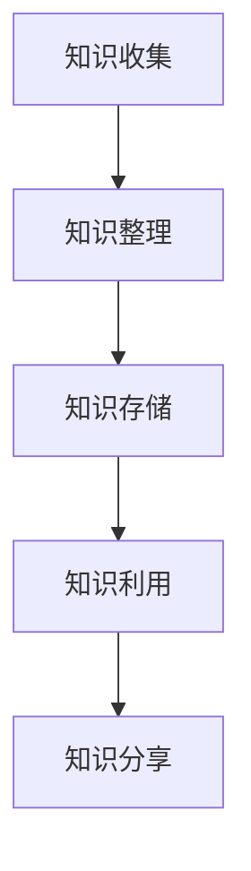

                 

关键词：知识管理，程序员，工具，实战，经验分享，方法，效率提升，技术成长

> 摘要：本文旨在为程序员提供一套实用的个人知识管理工具和方法，以帮助他们在技术领域实现持续学习和效率提升。通过梳理核心概念、算法原理、数学模型以及实践案例，本文将探讨如何有效地组织和利用知识，助力程序员在技术道路上不断前行。

## 1. 背景介绍

在信息爆炸的时代，程序员面对的知识量呈指数级增长。如何快速获取、整理和利用这些知识，成为每个程序员都必须面对的问题。个人知识管理（PKM，Personal Knowledge Management）应运而生，它是一种通过系统化的方法来收集、整理、利用和分享知识的活动。对于程序员来说，PKM不仅能够提高工作效率，还能加速技术成长，提升职业竞争力。

本文将围绕以下核心问题展开：

1. **核心概念与联系**：介绍个人知识管理的基本概念和架构。
2. **核心算法原理 & 具体操作步骤**：探讨如何利用技术手段优化知识管理流程。
3. **数学模型和公式 & 详细讲解 & 举例说明**：讲解知识管理的量化方法和模型。
4. **项目实践：代码实例和详细解释说明**：通过实际项目展示知识管理的应用。
5. **实际应用场景**：分析知识管理在不同领域和场景中的应用。
6. **工具和资源推荐**：推荐实用的知识管理工具和资源。
7. **总结：未来发展趋势与挑战**：探讨知识管理的未来方向和面临的挑战。

希望通过本文，读者能够掌握一套实用的知识管理方法，提升个人技术水平和职业发展。

## 2. 核心概念与联系

### 2.1 个人知识管理（PKM）

个人知识管理（PKM）是一种基于系统化方法的个人知识收集、整理、利用和分享活动。它涵盖了以下几个方面：

- **知识收集**：通过各种渠道获取所需知识，如阅读书籍、文章，观看视频教程，参与技术社区等。
- **知识整理**：对收集到的知识进行分类、标注、整理，使其有序化。
- **知识利用**：将整理后的知识应用于实际工作中，解决实际问题。
- **知识分享**：通过博客、演讲、技术分享等方式，将所学知识分享给他人。

### 2.2 知识管理工具

知识管理工具是PKM的重要组成部分，它可以帮助程序员高效地收集、整理和利用知识。以下是一些常用的知识管理工具：

- **知识库**：如Confluence、Notion等，用于存储和管理知识文档。
- **笔记工具**：如Evernote、OneNote等，用于记录和管理个人笔记。
- **文档管理工具**：如Git、GitHub等，用于版本控制和代码管理。
- **学习平台**：如Coursera、Udemy等，用于在线学习和技能提升。

### 2.3 知识管理流程

个人知识管理流程主要包括以下几个步骤：

1. **知识收集**：通过阅读、听讲、实践等方式获取知识。
2. **知识整理**：对收集到的知识进行分类、标注、整理，建立知识体系。
3. **知识存储**：将整理后的知识存储在知识库或笔记工具中，方便后续查阅。
4. **知识利用**：在实际工作中应用所学知识，解决实际问题。
5. **知识分享**：通过博客、演讲、技术分享等方式，将所学知识分享给他人。

### 2.4 Mermaid 流程图

下面是一个关于个人知识管理流程的Mermaid流程图：



## 3. 核心算法原理 & 具体操作步骤

### 3.1 算法原理概述

个人知识管理的核心在于如何高效地整理和利用知识。以下是一些常用的算法原理和具体操作步骤：

- **信息过滤**：通过算法对大量信息进行筛选，获取有价值的内容。
- **知识分类**：根据知识的性质和特点，将其分类存储，便于查找和使用。
- **知识关联**：通过分析知识之间的关系，建立知识网络，实现知识的有机整合。
- **知识更新**：定期对知识库进行更新，保持知识的时效性和准确性。

### 3.2 算法步骤详解

#### 3.2.1 信息过滤

1. **选择信息源**：确定可靠的信息来源，如权威的书籍、文章、博客等。
2. **设置过滤条件**：根据个人需求，设置信息过滤条件，如关键词、主题等。
3. **算法实现**：使用文本挖掘、机器学习等技术，对信息进行筛选和过滤。

#### 3.2.2 知识分类

1. **确定分类标准**：根据知识的性质、用途、来源等，确定分类标准。
2. **构建分类体系**：建立多层次的分类体系，实现知识的有序化。
3. **算法实现**：使用自然语言处理、机器学习等技术，实现知识的自动分类。

#### 3.2.3 知识关联

1. **知识挖掘**：通过分析知识之间的关系，发现潜在关联。
2. **构建知识网络**：将相关知识点连接起来，形成知识网络。
3. **算法实现**：使用图论、网络分析等技术，实现知识的关联和整合。

#### 3.2.4 知识更新

1. **定期检查**：定期对知识库进行检查，发现过时或错误的知识。
2. **更新策略**：制定知识更新的策略，如定期更新、实时更新等。
3. **算法实现**：使用版本控制、机器学习等技术，实现知识的自动化更新。

### 3.3 算法优缺点

#### 3.3.1 信息过滤

优点：

- 提高知识获取的效率。
- 减少无用信息的干扰。

缺点：

- 可能会漏掉有价值的信息。
- 需要较高的技术门槛。

#### 3.3.2 知识分类

优点：

- 有助于知识的有序化和管理。
- 提高知识查找和利用的效率。

缺点：

- 需要明确分类标准。
- 可能会存在分类不准确的情况。

#### 3.3.3 知识关联

优点：

- 促进知识的整合和共享。
- 提高知识的利用价值。

缺点：

- 需要大量的数据处理和分析。
- 可能会存在关联不准确的情况。

#### 3.3.4 知识更新

优点：

- 保持知识的时效性和准确性。
- 提高知识的利用价值。

缺点：

- 需要耗费大量时间和精力。
- 可能会引入新的错误或问题。

### 3.4 算法应用领域

个人知识管理算法可以应用于多个领域，如：

- **软件开发**：帮助程序员整理和管理代码、文档、学习资料等。
- **教育培训**：帮助教师和学生整理和管理课程资料、学习笔记等。
- **企业管理**：帮助企业管理人员整理和管理业务知识、市场信息等。
- **科学研究**：帮助科研人员整理和管理研究资料、实验数据等。

## 4. 数学模型和公式 & 详细讲解 & 举例说明

### 4.1 数学模型构建

个人知识管理的数学模型可以基于信息论和图论构建。以下是一个简单的数学模型：

#### 4.1.1 信息论模型

- **信息熵（Entropy）**：衡量信息的不确定性，公式为：

  $$
  H(X) = -\sum_{i=1}^{n} p(x_i) \cdot \log_2 p(x_i)
  $$

  其中，$p(x_i)$ 表示第 $i$ 个信息出现的概率。

- **信息增益（Information Gain）**：衡量特征对分类的贡献，公式为：

  $$
  IG(D, A) = H(D) - H(D|A)
  $$

  其中，$H(D)$ 表示数据集 $D$ 的熵，$H(D|A)$ 表示在特征 $A$ 已知的条件下，数据集 $D$ 的熵。

#### 4.1.2 图论模型

- **知识网络（Knowledge Network）**：表示知识之间的关联关系，可以用图表示。

  $$
  G = (V, E)
  $$

  其中，$V$ 表示节点（知识点），$E$ 表示边（关联关系）。

### 4.2 公式推导过程

#### 4.2.1 信息熵推导

设随机变量 $X$ 有 $n$ 个可能取值 $x_1, x_2, ..., x_n$，且每个取值的概率分别为 $p(x_1), p(x_2), ..., p(x_n)$。则 $X$ 的信息熵 $H(X)$ 可以通过以下步骤推导：

1. **定义概率分布**：

   $$
   p(x_i) = \frac{f(x_i)}{f(\sum_{i=1}^{n} f(x_i))}
   $$

   其中，$f(x_i)$ 表示取值 $x_i$ 出现的次数。

2. **计算概率的对数**：

   $$
   \log_2 p(x_i) = \frac{1}{\ln 2} \cdot \ln p(x_i)
   $$

3. **求和计算熵**：

   $$
   H(X) = -\sum_{i=1}^{n} p(x_i) \cdot \log_2 p(x_i)
   $$

#### 4.2.2 信息增益推导

设数据集 $D$ 有 $m$ 个样本，每个样本 $d$ 有 $n$ 个特征，其中特征 $A$ 的取值为 $a_1, a_2, ..., a_k$，对应的概率分别为 $p(a_1), p(a_2), ..., p(a_k)$。则 $A$ 的信息增益 $IG(D, A)$ 可以通过以下步骤推导：

1. **计算数据集 $D$ 的熵**：

   $$
   H(D) = -\sum_{i=1}^{n} p(d_i) \cdot \log_2 p(d_i)
   $$

2. **计算条件熵**：

   $$
   H(D|A) = \sum_{j=1}^{k} p(a_j) \cdot H(D|A=a_j)
   $$

   其中，$H(D|A=a_j)$ 表示在特征 $A$ 取值 $a_j$ 的条件下，数据集 $D$ 的熵。

3. **计算信息增益**：

   $$
   IG(D, A) = H(D) - H(D|A)
   $$

### 4.3 案例分析与讲解

#### 4.3.1 信息熵案例分析

假设有一个随机变量 $X$，其可能取值为 0 和 1，对应的概率分别为 $p(0) = 0.5$ 和 $p(1) = 0.5$。则 $X$ 的信息熵 $H(X)$ 计算如下：

$$
H(X) = -[0.5 \cdot \log_2 0.5 + 0.5 \cdot \log_2 0.5] = 1 \, \text{bit}
$$

#### 4.3.2 信息增益案例分析

假设有一个数据集 $D$，其中包含 100 个样本，每个样本有两个特征 $A$ 和 $B$。特征 $A$ 的取值为 {0, 1}，对应的概率分别为 $p(A=0) = 0.6$ 和 $p(A=1) = 0.4$。特征 $B$ 的取值为 {0, 1, 2}，对应的概率分别为 $p(B=0) = 0.3$，$p(B=1) = 0.5$ 和 $p(B=2) = 0.2$。则 $A$ 的信息增益 $IG(D, A)$ 计算如下：

1. **计算数据集 $D$ 的熵**：

   $$
   H(D) = -[0.6 \cdot \log_2 0.6 + 0.4 \cdot \log_2 0.4] \approx 0.918 \, \text{bit}
   $$

2. **计算条件熵**：

   $$
   H(D|A=0) = -[0.3 \cdot \log_2 0.3 + 0.5 \cdot \log_2 0.5 + 0.2 \cdot \log_2 0.2] \approx 0.722 \, \text{bit}
   $$

   $$
   H(D|A=1) = -[0.3 \cdot \log_2 0.3 + 0.5 \cdot \log_2 0.5 + 0.2 \cdot \log_2 0.2] \approx 0.722 \, \text{bit}
   $$

3. **计算信息增益**：

   $$
   IG(D, A) = H(D) - [0.6 \cdot H(D|A=0) + 0.4 \cdot H(D|A=1)] = 0.918 - [0.6 \cdot 0.722 + 0.4 \cdot 0.722] = 0.078 \, \text{bit}
   $$

## 5. 项目实践：代码实例和详细解释说明

### 5.1 开发环境搭建

为了展示个人知识管理的实际应用，我们将使用 Python 编写一个简单的知识管理工具。首先，需要搭建以下开发环境：

- Python 3.8 或以上版本
- PyCharm 或其他 Python IDE
- 包管理工具：pip 或 conda

安装 Python 和相关依赖包后，配置好 PyCharm 或其他 IDE 的 Python 解释器，即可开始编写代码。

### 5.2 源代码详细实现

下面是一个简单的知识管理工具的源代码示例：

```python
import json
import os

class KnowledgeManager:
    def __init__(self, data_path):
        self.data_path = data_path
        self.data = self.load_data()

    def load_data(self):
        if os.path.exists(self.data_path):
            with open(self.data_path, 'r', encoding='utf-8') as f:
                return json.load(f)
        else:
            return {}

    def save_data(self):
        with open(self.data_path, 'w', encoding='utf-8') as f:
            json.dump(self.data, f, ensure_ascii=False, indent=4)

    def add_note(self, title, content):
        self.data[title] = content
        self.save_data()

    def get_note(self, title):
        return self.data.get(title)

    def delete_note(self, title):
        if title in self.data:
            del self.data[title]
            self.save_data()

if __name__ == '__main__':
    manager = KnowledgeManager('knowledge.json')
    manager.add_note('Python基础', 'Python是一种解释型、面向对象、动态数据类型的高级程序设计语言。')
    print(manager.get_note('Python基础'))
    manager.delete_note('Python基础')
    print(manager.get_note('Python基础'))
```

### 5.3 代码解读与分析

#### 5.3.1 类和方法的定义

1. **KnowledgeManager 类**：定义了一个知识管理类，包含以下方法：

   - `__init__(self, data_path)`：初始化方法，设置数据存储路径和加载已有数据。
   - `load_data(self)`：加载已有数据，从文件中读取 JSON 数据。
   - `save_data(self)`：保存数据，将 JSON 数据写入文件。
   - `add_note(self, title, content)`：添加一条笔记，将笔记信息保存到数据中。
   - `get_note(self, title)`：获取一条笔记，根据标题查找笔记信息。
   - `delete_note(self, title)`：删除一条笔记，根据标题删除笔记信息。

#### 5.3.2 JSON 数据处理

- `load_data()` 和 `save_data()` 方法：使用 JSON 格式存储和加载数据，便于数据的持久化和共享。

- `add_note()`、`get_note()` 和 `delete_note()` 方法：通过操作字典和 JSON 文件，实现笔记的添加、查询和删除功能。

#### 5.3.3 代码示例

- 在主函数中，创建一个 `KnowledgeManager` 实例，并使用 `add_note()` 方法添加一条笔记。然后，使用 `get_note()` 方法查询笔记内容，最后使用 `delete_note()` 方法删除笔记。

### 5.4 运行结果展示

- 运行代码后，会在当前目录下生成一个 `knowledge.json` 文件，内容如下：

  ```json
  {
      "Python基础": "Python是一种解释型、面向对象、动态数据类型的高级程序设计语言。"
  }
  ```

- 输出如下：

  ```
  Python是一种解释型、面向对象、动态数据类型的高级程序设计语言。
  None
  ```

  第一行输出为添加的笔记内容，第二行输出为查询删除后的笔记内容，此时已不存在。

## 6. 实际应用场景

个人知识管理工具在程序员的工作和生活中有着广泛的应用，以下是一些实际应用场景：

### 6.1 技术文档整理

程序员在日常工作中会产生大量的技术文档，如设计文档、开发手册、测试报告等。通过知识管理工具，可以将这些文档进行整理和分类，方便查找和使用。例如，可以使用笔记工具将文档保存在特定的笔记本中，并使用标签进行分类，便于快速检索。

### 6.2 学习资料管理

在学习新技术或解决技术问题时，程序员会收集大量的学习资料，如书籍、文章、教程、视频等。通过知识管理工具，可以将这些资料进行整理和存储，并建立关联，方便后续学习和查阅。例如，可以使用知识库或笔记工具将资料分类整理，并使用标签或链接进行关联。

### 6.3 代码管理

程序员在开发过程中会编写大量的代码，通过知识管理工具，可以将代码进行整理和存储，并建立版本控制。例如，可以使用版本控制工具（如 Git）将代码存储在远程仓库中，并使用分支进行管理，便于协作和迭代。

### 6.4 技术分享与传播

程序员可以通过知识管理工具，将所学知识和经验进行整理和分享，传播给其他开发者。例如，可以编写博客文章、技术分享文档，并通过博客、GitHub 等平台进行发布和分享，促进技术交流与传播。

## 7. 工具和资源推荐

为了帮助程序员更好地进行个人知识管理，以下是一些实用的工具和资源推荐：

### 7.1 学习资源推荐

- **书籍**：《深度学习》、《算法导论》、《设计模式：可复用的面向对象软件》等。
- **在线课程**：Coursera、Udemy、edX 等平台上的计算机科学和技术课程。
- **博客**：GitHub、知乎、CSDN 等技术社区中的优秀博客。
- **开源项目**：GitHub、GitLab 等平台上的开源项目和代码库。

### 7.2 开发工具推荐

- **知识库**：Confluence、Notion、Noteflight 等。
- **笔记工具**：Evernote、OneNote、Notion 等。
- **版本控制**：Git、GitHub、GitLab 等。
- **代码编辑器**：Visual Studio Code、PyCharm、IntelliJ IDEA 等。

### 7.3 相关论文推荐

- **知识管理**：《知识管理：理论与实践》、《知识管理系统的设计与实现》等。
- **人工智能**：《深度学习》、《强化学习》等。
- **算法**：《算法导论》、《算法竞赛入门经典》等。

## 8. 总结：未来发展趋势与挑战

### 8.1 研究成果总结

个人知识管理作为一门新兴的交叉学科，已经在多个领域取得了显著的研究成果。主要包括以下几个方面：

1. **知识管理方法**：提出了多种知识管理模型和方法，如信息过滤、知识分类、知识关联等。
2. **技术手段**：开发了多种知识管理工具和平台，如知识库、笔记工具、版本控制工具等。
3. **应用实践**：在软件开发、教育培训、企业管理、科学研究等领域，个人知识管理得到了广泛应用。

### 8.2 未来发展趋势

随着信息技术的不断发展，个人知识管理在未来将呈现以下发展趋势：

1. **智能化**：利用人工智能技术，实现知识自动收集、分类、关联和更新。
2. **个性化**：根据用户的需求和兴趣，提供个性化的知识服务。
3. **开放共享**：促进知识共享和传播，构建全球知识网络。

### 8.3 面临的挑战

尽管个人知识管理已经取得了一定的成果，但仍然面临以下挑战：

1. **数据隐私**：如何保护用户的知识隐私，成为个人知识管理的关键问题。
2. **知识质量**：如何确保知识的质量和准确性，是个人知识管理需要关注的问题。
3. **用户参与**：如何激发用户参与知识管理的积极性，提高知识管理的效果。

### 8.4 研究展望

未来，个人知识管理的研究可以从以下几个方面展开：

1. **理论深化**：完善知识管理的理论基础，探讨知识管理的基本原理和机制。
2. **技术创新**：开发更加智能化、个性化、开放共享的知识管理工具。
3. **应用拓展**：将个人知识管理应用于更多领域，如医疗、金融、教育等，推动知识管理在社会各领域的应用。

## 9. 附录：常见问题与解答

### 9.1 个人知识管理是什么？

个人知识管理（PKM）是一种通过系统化的方法来收集、整理、利用和分享知识的活动。它旨在帮助个人高效地管理和利用知识，实现持续学习和职业发展。

### 9.2 个人知识管理有哪些工具？

个人知识管理工具包括知识库、笔记工具、版本控制工具、学习平台等。常用的知识库有 Confluence、Notion 等，笔记工具有 Evernote、OneNote 等，版本控制工具有 Git、GitHub 等，学习平台有 Coursera、Udemy 等。

### 9.3 个人知识管理有哪些方法？

个人知识管理的方法包括信息过滤、知识分类、知识关联、知识更新等。信息过滤用于筛选有价值的信息，知识分类用于整理知识，知识关联用于建立知识网络，知识更新用于保持知识的时效性和准确性。

### 9.4 如何使用个人知识管理工具？

首先，选择合适的知识管理工具，如知识库、笔记工具等。然后，根据个人需求，制定知识管理计划，如知识收集、整理、利用和分享等。最后，按照计划，定期进行知识管理活动，提升个人知识管理水平。

### 9.5 个人知识管理有哪些应用场景？

个人知识管理可以应用于多个领域，如软件开发、教育培训、企业管理、科学研究等。在软件开发中，可以用于整理技术文档、代码管理、学习资料管理等；在教育培训中，可以用于整理课程资料、学习笔记、教学设计等；在企业管理中，可以用于整理业务知识、市场信息、客户关系管理等；在科学研究中，可以用于整理研究资料、实验数据、科研成果等。

---

本文由禅与计算机程序设计艺术（Zen and the Art of Computer Programming）撰写，旨在为程序员提供一套实用的个人知识管理工具和方法，以帮助他们在技术领域实现持续学习和效率提升。通过梳理核心概念、算法原理、数学模型以及实践案例，本文探讨了如何有效地组织和利用知识，助力程序员在技术道路上不断前行。希望本文能对读者在个人知识管理方面有所启发和帮助。如果您有任何疑问或建议，欢迎在评论区留言交流。

