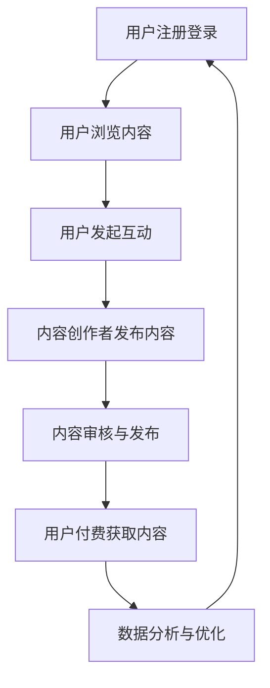

                 

 

> 关键词：知识付费、垂直论坛、技术领域、用户体验、内容构建、商业模式

> 摘要：本文将探讨如何在垂直技术领域打造一个成功的知识付费论坛，包括核心概念的联系、算法原理与操作步骤、数学模型与公式、项目实践、实际应用场景、工具和资源推荐、总结与展望等方面。

## 1. 背景介绍

随着互联网技术的飞速发展，知识付费已经成为一个不容忽视的市场。特别是在技术领域，程序员、开发者、数据科学家等专业人士对于高质量的知识内容有着极大的需求。因此，打造一个专注于技术领域的知识付费论坛，不仅能够满足专业人士的学习需求，还能够为论坛运营者带来稳定的收入。

### 1.1 垂直论坛的重要性

垂直论坛相比于综合论坛，具有更明确的目标用户群体和更精细化的内容。这不仅可以提高用户体验，还能够更好地进行商业变现。例如，一个专注于人工智能领域的知识付费论坛，可以提供AI相关的课程、教程、案例分析和行业动态，从而吸引AI领域的专业人士。

### 1.2 技术领域知识付费的需求

技术领域知识付费的需求主要来自于以下几个方面：

- **技能提升**：技术从业人员希望通过付费课程提升自己的技能水平，保持竞争力。
- **项目指导**：在实际项目中遇到问题时，用户希望能够通过付费咨询获得专业指导。
- **行业洞察**：技术从业人员需要了解最新的行业动态和趋势，以指导自己的职业规划。

## 2. 核心概念与联系

### 2.1 知识付费论坛的核心概念

- **用户**：论坛的核心参与者，包括学习者、提问者、解答者等。
- **内容**：论坛的核心资产，包括教程、案例、问答、行业动态等。
- **互动**：用户之间的交流和互动，包括评论、点赞、关注等。
- **付费**：用户通过付费获取高质量的内容和额外服务。

### 2.2 论坛架构的Mermaid流程图



## 3. 核心算法原理 & 具体操作步骤

### 3.1 算法原理概述

论坛的核心算法主要包括：

- **推荐算法**：根据用户的浏览历史和互动行为，推荐相关的内容。
- **排序算法**：根据内容的受欢迎程度、时效性等因素，对内容进行排序。
- **支付算法**：处理用户的支付请求，确保交易的顺利完成。

### 3.2 算法步骤详解

#### 3.2.1 推荐算法

1. **收集用户行为数据**：包括用户的浏览记录、点赞、评论等。
2. **建立用户画像**：通过数据挖掘和机器学习技术，为用户生成画像。
3. **内容标签化**：为每条内容打上相应的标签，便于推荐。
4. **推荐内容**：根据用户画像和内容标签，推荐相关的学习资源和交流话题。

#### 3.2.2 排序算法

1. **计算内容权重**：包括内容的点赞数、评论数、分享数等。
2. **结合时效性**：对内容的新旧进行加权。
3. **排序**：根据内容的权重和时效性，对内容进行排序。

#### 3.2.3 支付算法

1. **用户身份验证**：确认用户的身份和支付权限。
2. **支付请求处理**：处理用户的支付请求，包括金额的确认、支付渠道的选择等。
3. **支付结果反馈**：向用户反馈支付结果，包括支付成功或失败的信息。

### 3.3 算法优缺点

- **推荐算法**：优点是能够提高用户的粘性，缺点是需要大量的计算资源和数据支持。
- **排序算法**：优点是能够提高内容的曝光率，缺点是对内容的时效性处理较为简单。
- **支付算法**：优点是能够确保交易的安全和高效，缺点是需要考虑多种支付渠道和支付方式的兼容性。

### 3.4 算法应用领域

算法主要应用于：

- **内容推荐**：提高用户的活跃度和满意度。
- **内容排序**：提高内容的曝光率和影响力。
- **支付处理**：确保交易的顺利进行。

## 4. 数学模型和公式 & 详细讲解 & 举例说明

### 4.1 数学模型构建

论坛的核心数学模型主要包括：

- **用户活跃度模型**：衡量用户在论坛的活跃程度。
- **内容受欢迎度模型**：衡量内容的受欢迎程度。
- **支付风险模型**：评估支付交易的风险。

### 4.2 公式推导过程

#### 4.2.1 用户活跃度模型

$$
UAV = \frac{AL + CL + RL}{3}
$$

- **AL**：用户在论坛上的留言数。
- **CL**：用户在论坛上的点赞数。
- **RL**：用户在论坛上的回复数。

#### 4.2.2 内容受欢迎度模型

$$
CVI = \frac{LI + SI + FI}{3}
$$

- **LI**：内容的点赞数。
- **SI**：内容的分享数。
- **FI**：内容的收藏数。

#### 4.2.3 支付风险模型

$$
PRR = \frac{PI + BI + AI}{3}
$$

- **PI**：支付成功率。
- **BI**：支付失败率。
- **AI**：支付欺诈率。

### 4.3 案例分析与讲解

以用户活跃度模型为例，假设一个用户在论坛上的留言数为10，点赞数为20，回复数为30。那么，该用户的活跃度分数为：

$$
UAV = \frac{10 + 20 + 30}{3} = 20
$$

这个分数表明，该用户在论坛上的活跃度相对较高。

## 5. 项目实践：代码实例和详细解释说明

### 5.1 开发环境搭建

开发环境需要包括以下组件：

- **服务器**：用于存储论坛数据和运行相关服务。
- **前端框架**：如React或Vue.js，用于构建用户界面。
- **后端框架**：如Node.js或Django，用于处理业务逻辑。
- **数据库**：如MySQL或MongoDB，用于存储用户数据、内容数据等。

### 5.2 源代码详细实现

以下是一个简单的用户注册功能的代码实现：

#### 后端代码（Node.js）

```javascript
const express = require('express');
const app = express();
const bcrypt = require('bcrypt');

app.use(express.json());

app.post('/register', async (req, res) => {
    const { username, password } = req.body;

    // 密码加密
    const hashedPassword = await bcrypt.hash(password, 10);

    // 存储用户信息到数据库
    // ...

    res.json({ message: 'User registered successfully!' });
});

app.listen(3000, () => {
    console.log('Server started on port 3000');
});
```

#### 前端代码（React）

```jsx
import React, { useState } from 'react';
import axios from 'axios';

const RegisterForm = () => {
    const [username, setUsername] = useState('');
    const [password, setPassword] = useState('');

    const handleSubmit = async (e) => {
        e.preventDefault();

        try {
            const response = await axios.post('/register', { username, password });
            alert(response.data.message);
        } catch (error) {
            alert('Registration failed!');
        }
    };

    return (
        <form onSubmit={handleSubmit}>
            <label>
                Username:
                <input type="text" value={username} onChange={(e) => setUsername(e.target.value)} />
            </label>
            <label>
                Password:
                <input type="password" value={password} onChange={(e) => setPassword(e.target.value)} />
            </label>
            <button type="submit">Register</button>
        </form>
    );
};

export default RegisterForm;
```

### 5.3 代码解读与分析

上述代码实现了用户注册的基本功能。后端使用Node.js和Express框架处理HTTP请求，并使用bcrypt库对用户密码进行加密。前端使用React框架构建用户界面，并通过axios库向后端发送HTTP请求。

### 5.4 运行结果展示

用户访问论坛的注册页面，填写用户名和密码，提交表单后，如果注册成功，会弹出成功提示；如果注册失败，会弹出错误提示。

## 6. 实际应用场景

### 6.1 技术培训

知识付费论坛可以提供各种技术培训课程，包括编程、数据分析、人工智能等，帮助专业人士提升技能。

### 6.2 项目咨询

技术从业人员可以在论坛上发布项目问题，寻求专业人士的帮助和指导。

### 6.3 行业交流

论坛可以成为技术从业者的交流平台，分享行业动态、趋势和经验。

## 7. 工具和资源推荐

### 7.1 学习资源推荐

- **书籍**：《深入理解计算机系统》、《算法导论》等。
- **在线课程**：Coursera、edX等平台上的计算机科学课程。
- **技术社区**：GitHub、Stack Overflow等。

### 7.2 开发工具推荐

- **前端框架**：React、Vue.js等。
- **后端框架**：Node.js、Django等。
- **数据库**：MySQL、MongoDB等。

### 7.3 相关论文推荐

- **机器学习**：《XGBoost：A Scalable Tree Boosting Algorithm》。
- **深度学习**：《Deep Learning》。

## 8. 总结：未来发展趋势与挑战

### 8.1 研究成果总结

本文详细介绍了如何打造一个垂直技术领域的知识付费论坛，包括核心概念的联系、算法原理与操作步骤、数学模型与公式、项目实践等方面。

### 8.2 未来发展趋势

- **个性化推荐**：通过更先进的推荐算法，提高用户满意度。
- **区块链应用**：利用区块链技术提高交易的安全性和透明度。
- **智能合约**：在论坛中引入智能合约，实现自动化的内容审核和付费处理。

### 8.3 面临的挑战

- **数据隐私**：如何在提供个性化服务的同时保护用户隐私。
- **内容监管**：如何确保论坛上的内容质量，避免不良信息的传播。
- **商业模式创新**：如何在激烈的市场竞争中找到可持续的商业模式。

### 8.4 研究展望

未来的研究可以关注以下几个方面：

- **推荐算法的优化**：结合用户行为和内容特征，提高推荐效果。
- **区块链技术的应用**：探索在知识付费论坛中区块链技术的具体应用。
- **社交网络的整合**：将论坛与社交媒体平台整合，扩大用户群体。

## 9. 附录：常见问题与解答

### 9.1 论坛如何确保内容质量？

论坛可以通过以下方式确保内容质量：

- **内容审核**：设立专业的审核团队，对发布的内容进行审核。
- **用户评价**：鼓励用户对内容进行评价和举报，筛选高质量内容。
- **积分制度**：通过积分奖励制度，鼓励用户生成高质量内容。

### 9.2 如何提高用户的活跃度？

提高用户活跃度可以从以下几个方面入手：

- **个性化推荐**：根据用户兴趣推荐相关内容，提高用户粘性。
- **社区互动**：举办线上活动、挑战赛等，增加用户参与度。
- **激励机制**：通过积分、优惠券等方式激励用户活跃。

### 9.3 如何处理付费交易的风险？

处理付费交易风险可以从以下几个方面入手：

- **身份验证**：确保交易双方的身份真实有效。
- **支付保障**：提供支付保障服务，如退款、争议解决等。
- **风控系统**：建立风控系统，监控交易风险，及时处理异常交易。

----------------------------------------------------------------

作者：禅与计算机程序设计艺术 / Zen and the Art of Computer Programming


