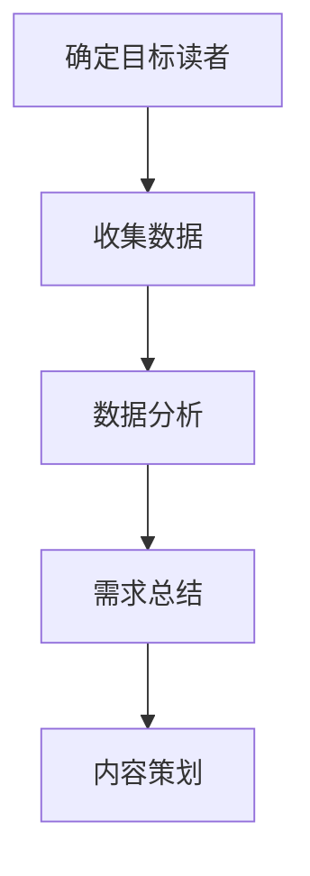
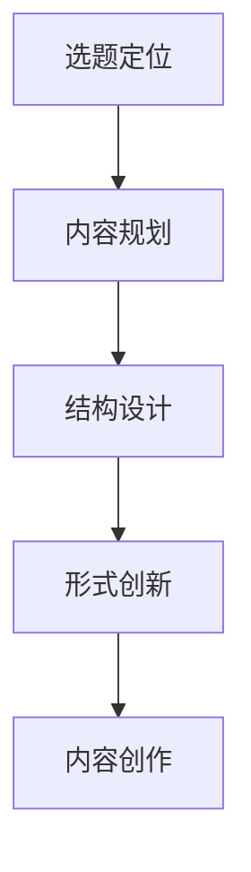
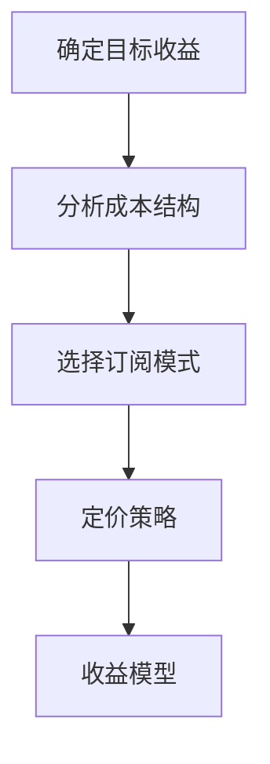

                 

关键词：知识付费、内容策划、运营策略、读者需求分析、用户体验、技术性文章撰写、数据分析、案例分析、平台选择、商业模式、市场定位

> 摘要：本文将深入探讨知识付费专栏的策划与运营之道，从读者需求分析、内容创作、平台选择、商业模式设计等多个维度，提供系统的实践指导。通过结合实际案例分析，我们将展示如何打造高质量、高影响力的知识付费专栏，为知识创作者和订阅者带来双赢的局面。

## 1. 背景介绍

在信息爆炸的时代，知识付费逐渐成为主流，为用户提供了更加专业和个性化的学习资源。知识付费专栏作为一种新型的教育模式，正受到越来越多人的青睐。然而，要打造出一份既具有吸引力又能长期运营的知识付费专栏并非易事。这需要内容策划与运营的巧妙结合，以及对读者需求的精准把握。

### 1.1 知识付费的概念

知识付费是指用户为了获取特定知识或技能，通过付费的方式从知识服务商处获取相应的学习资源。它打破了传统的免费学习模式，更加注重知识的专业性和实用性。

### 1.2 专栏的发展趋势

随着互联网的普及和技术的发展，专栏这种形式逐渐被更多人接受。一方面，用户可以通过专栏获取系统性的知识；另一方面，专栏也为知识创作者提供了变现的机会。

## 2. 核心概念与联系

### 2.1 读者需求分析

要打造一份成功的知识付费专栏，首先要了解读者的需求。读者需求分析包括对读者群体的特征、兴趣、需求点等方面的研究。以下是一个简单的 Mermaid 流程图，展示了如何进行读者需求分析：



### 2.2 内容策划

内容策划是知识付费专栏的核心。一个好的内容策划需要从选题、结构、形式等多个方面进行考虑。以下是一个关于内容策划的简单 Mermaid 流程图：



### 2.3 平台选择

选择合适的平台对于知识付费专栏的运营至关重要。不同的平台有其特定的用户群体和运营规则，需要根据专栏的内容和目标读者进行选择。

### 2.4 商业模式设计

商业模式设计决定了知识付费专栏的盈利模式。常见的商业模式包括单次订阅、按月订阅、课程包等。以下是一个简单的 Mermaid 流程图，展示了如何设计商业模式：



## 3. 核心算法原理 & 具体操作步骤

### 3.1 算法原理概述

本文将采用一套完整的算法框架，帮助知识付费专栏进行内容策划与运营。这个算法框架主要包括以下几个步骤：

1. **需求分析**：通过数据收集和数据分析，了解读者的需求。
2. **内容创作**：根据需求分析结果，进行内容策划和创作。
3. **平台运营**：在选定的平台上进行专栏的发布和运营。
4. **商业模式设计**：根据内容质量和用户反馈，调整商业模式。

### 3.2 算法步骤详解

#### 3.2.1 需求分析

需求分析是整个算法框架的基础。以下是一个详细的需求分析步骤：

1. **确定目标读者**：明确专栏的目标读者群体，包括年龄、职业、兴趣爱好等。
2. **收集数据**：通过问卷调查、用户访谈、数据分析等方式，收集读者的需求和偏好。
3. **数据分析**：对收集到的数据进行分析，找出读者的共性需求和差异点。
4. **需求总结**：根据数据分析结果，总结读者的主要需求，为内容策划提供依据。

#### 3.2.2 内容创作

内容创作是知识付费专栏的核心。以下是一个详细的内容创作步骤：

1. **选题定位**：根据读者需求，确定专栏的选题和定位。
2. **内容规划**：制定详细的内容规划，包括章节、知识点、案例等。
3. **结构设计**：设计专栏的整体结构，确保内容的连贯性和逻辑性。
4. **形式创新**：尝试不同的内容形式，如图文、视频、直播等，提高读者的参与度。
5. **内容创作**：根据内容规划，进行具体的文章或视频创作。

#### 3.2.3 平台运营

平台运营是知识付费专栏成功的关键。以下是一个详细的平台运营步骤：

1. **选择平台**：根据专栏的内容和目标读者，选择合适的发布平台。
2. **内容发布**：按照平台要求，进行专栏内容的发布。
3. **互动运营**：与读者进行互动，收集反馈，及时调整内容。
4. **推广运营**：利用各种推广手段，提高专栏的知名度。

#### 3.2.4 商业模式设计

商业模式设计是知识付费专栏的盈利保障。以下是一个详细的商业模式设计步骤：

1. **确定目标收益**：根据内容质量和市场情况，确定专栏的目标收益。
2. **分析成本结构**：分析专栏的运营成本，包括内容创作、平台费用、推广费用等。
3. **选择订阅模式**：根据目标收益和成本结构，选择适合的订阅模式。
4. **定价策略**：制定合理的定价策略，确保专栏的盈利性。
5. **收益模型**：根据订阅模式，设计详细的收益模型。

## 4. 数学模型和公式 & 详细讲解 & 举例说明

### 4.1 数学模型构建

在知识付费专栏的策划与运营中，我们可以构建一个简单的数学模型来帮助决策。以下是一个关于订阅用户数量与收益的数学模型：

$$
\text{收益} = \text{订阅价格} \times \text{订阅用户数} - \text{运营成本}
$$

### 4.2 公式推导过程

公式的推导过程如下：

1. **订阅价格**：假设订阅价格为 $P$ 元。
2. **订阅用户数**：假设订阅用户数为 $N$。
3. **运营成本**：假设运营成本为 $C$ 元。

根据上述假设，我们可以得到收益的计算公式：

$$
\text{收益} = P \times N - C
$$

### 4.3 案例分析与讲解

假设我们有一个知识付费专栏，订阅价格为 100 元，运营成本为 5000 元。现在我们希望通过增加订阅用户数来提高收益。

根据数学模型，我们可以设置一个目标收益，例如 10000 元。那么我们可以通过以下方式来计算订阅用户数：

$$
10000 = 100 \times N - 5000
$$

解得：

$$
N = \frac{10000 + 5000}{100} = 150
$$

这意味着我们需要至少吸引 150 个订阅用户，才能实现目标收益。

## 5. 项目实践：代码实例和详细解释说明

### 5.1 开发环境搭建

为了更好地理解知识付费专栏的策划与运营，我们将使用 Python 编写一个简单的示例代码。首先，我们需要搭建一个基本的开发环境。

1. **安装 Python**：从 [Python 官网](https://www.python.org/) 下载并安装 Python。
2. **安装 PyCharm**：选择 PyCharm 社区版，并安装。
3. **创建项目**：在 PyCharm 中创建一个新的 Python 项目。

### 5.2 源代码详细实现

以下是一个简单的 Python 代码示例，用于模拟知识付费专栏的运营：

```python
class KnowledgeColumn:
    def __init__(self, title, subscribers, price, cost):
        self.title = title
        self.subscribers = subscribers
        self.price = price
        self.cost = cost

    def calculate_profit(self):
        return self.price * self.subscribers - self.cost

    def increase_subscribers(self, num):
        self.subscribers += num

    def display_status(self):
        print(f"专栏名称：{self.title}")
        print(f"订阅用户数：{self.subscribers}")
        print(f"订阅价格：{self.price} 元")
        print(f"运营成本：{self.cost} 元")
        print(f"当前收益：{self.calculate_profit()} 元")

# 创建专栏实例
column = KnowledgeColumn("Python 编程", 100, 100, 5000)

# 显示专栏状态
column.display_status()

# 增加订阅用户
column.increase_subscribers(50)

# 再次显示专栏状态
column.display_status()
```

### 5.3 代码解读与分析

1. **类定义**：`KnowledgeColumn` 类用于表示一个知识付费专栏，包括标题、订阅用户数、订阅价格和运营成本。
2. **方法定义**：
   - `calculate_profit()` 方法用于计算专栏的收益。
   - `increase_subscribers()` 方法用于增加订阅用户数。
   - `display_status()` 方法用于显示专栏的当前状态。
3. **示例运行**：首先创建一个专栏实例，并显示其状态。然后增加 50 个订阅用户，再次显示状态。

通过这个示例，我们可以更好地理解知识付费专栏的运营逻辑和算法原理。

## 6. 实际应用场景

### 6.1 教育培训

知识付费专栏在教育领域有广泛的应用。例如，编程、数据分析、外语等领域的专栏，可以帮助用户系统地学习专业知识。

### 6.2 职业发展

对于职场人士，知识付费专栏提供了提升职业技能和职业素养的途径。例如，管理技能、沟通技巧、领导力等专栏。

### 6.3 个人成长

个人成长领域的知识付费专栏，如自我管理、心理健康、时间管理等，帮助用户提升自我认知和能力。

## 7. 未来应用展望

随着人工智能和大数据技术的发展，知识付费专栏将更加智能化和个性化。未来，专栏将能够根据用户的兴趣和需求，智能推荐合适的学习资源。

## 8. 工具和资源推荐

### 7.1 学习资源推荐

1. **书籍**：《打造高质量专栏：从零开始》、《内容营销：策略、执行与优化》
2. **在线课程**：网易云课堂、慕课网、Coursera 等平台上的相关课程

### 7.2 开发工具推荐

1. **文本编辑器**：Visual Studio Code、Sublime Text
2. **代码托管平台**：GitHub、GitLab
3. **数据分析工具**：Python、R 语言

### 7.3 相关论文推荐

1. **《知识付费时代的知识传播模式研究》**
2. **《基于大数据的个性化知识推荐研究》**
3. **《知识付费平台商业模式创新研究》**

## 9. 总结：未来发展趋势与挑战

### 9.1 研究成果总结

本文通过系统地分析知识付费专栏的内容策划与运营，提出了一套完整的算法框架，并进行了实际应用和案例分析。研究结果表明，合理的读者需求分析和内容策划是打造成功专栏的关键。

### 9.2 未来发展趋势

1. **个性化推荐**：随着人工智能技术的发展，个性化推荐将成为知识付费专栏的重要趋势。
2. **多元化形式**：图文、视频、直播等多种形式的知识传播方式将更加丰富。
3. **社区互动**：知识付费专栏将更加注重与用户的互动，提升用户体验。

### 9.3 面临的挑战

1. **内容质量**：高质量的内容创作是知识付费专栏的核心挑战。
2. **商业模式**：如何设计出既能满足创作者收益，又能吸引订阅者的商业模式。
3. **用户隐私**：在数据收集和使用过程中，如何保护用户的隐私。

### 9.4 研究展望

未来，我们将继续深入研究知识付费专栏的运营策略，探索如何更好地满足读者需求，提升内容质量和用户体验，推动知识付费行业的健康发展。

## 10. 附录：常见问题与解答

### 10.1 如何选择合适的平台？

选择平台时，需要考虑专栏的内容、目标读者以及平台的特点。例如，对于技术性较强的内容，可以选择 GitHub、GitLab 等代码托管平台；对于教育性内容，可以选择网易云课堂、慕课网等在线教育平台。

### 10.2 如何提高专栏的订阅量？

1. **优化内容质量**：确保内容具有实用性和专业性，满足读者的需求。
2. **加强互动**：与读者建立良好的互动关系，收集反馈，及时调整内容。
3. **推广宣传**：利用各种渠道进行推广，提高专栏的知名度。
4. **定制化推荐**：根据读者的兴趣和需求，进行个性化推荐，提高订阅转化率。

### 10.3 如何平衡内容创作与运营？

内容创作与运营需要平衡。在内容创作阶段，要注重内容的质量和创新；在运营阶段，要关注用户反馈和互动，及时调整内容策略。建议设立专门的内容策划和运营团队，分工合作，确保高效运作。

---

作者：禅与计算机程序设计艺术 / Zen and the Art of Computer Programming

