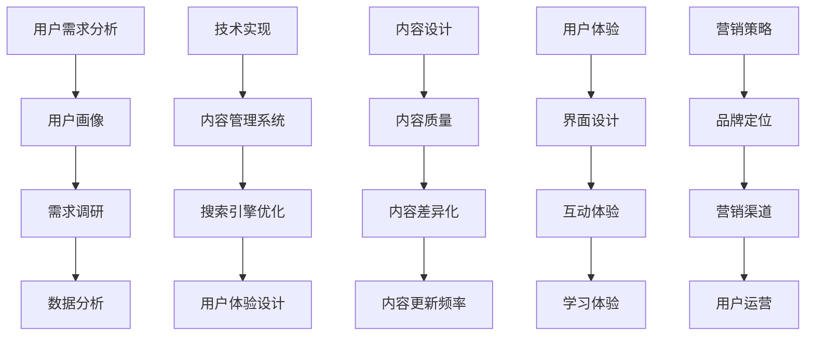

                 

关键词：知识付费、爆款产品、用户需求、技术实现、内容设计、用户体验、营销策略、案例分析

> 摘要：本文旨在探讨打造知识付费爆款产品的核心要素，包括用户需求分析、技术实现、内容设计、用户体验、营销策略等方面。通过深入研究和案例分析，本文提出了一系列切实可行的方法和策略，为知识付费产品开发者提供指导。

## 1. 背景介绍

随着互联网技术的飞速发展和智能手机的普及，知识付费市场逐渐兴起。用户对高质量、专业、有针对性的内容需求日益增长，促使各类知识付费平台如雨后春笋般涌现。从知乎Live到得到App，从喜马拉雅FM到分答，知识付费市场呈现一片繁荣景象。然而，如何在竞争激烈的市场中脱颖而出，打造出真正的爆款产品，成为许多企业关注的焦点。

本文将从多个角度分析打造知识付费爆款产品的核心要素，包括用户需求分析、技术实现、内容设计、用户体验、营销策略等，并结合实际案例分析，为知识付费产品开发者提供有价值的参考。

## 2. 核心概念与联系

### 2.1 用户需求分析

用户需求分析是打造知识付费爆款产品的第一步。只有深入了解用户的需求，才能提供符合他们期望的内容和服务。用户需求分析主要包括以下几个方面：

#### 2.1.1 用户画像

用户画像是指对目标用户的特征、行为、需求进行概括和描述。通过用户画像，可以明确产品的目标用户群体，为他们提供更有针对性的内容和服务。

#### 2.1.2 需求调研

需求调研是指通过调查、访谈、问卷调查等方式，收集用户对知识付费产品的需求、期望和反馈。需求调研可以帮助产品开发者了解用户的需求和痛点，从而优化产品设计和功能。

#### 2.1.3 数据分析

数据分析是指通过对用户行为数据、市场数据等进行分析，挖掘用户的兴趣和需求。数据分析可以为产品开发者提供有价值的信息，帮助他们更好地了解用户和市场动态。

### 2.2 技术实现

技术实现是打造知识付费爆款产品的关键环节。在技术实现方面，需要关注以下几个方面：

#### 2.2.1 内容管理系统（CMS）

内容管理系统是知识付费产品的核心组件，负责内容创作、存储、发布和管理。一个高效、稳定的内容管理系统可以提高内容创作和发布的效率，降低运营成本。

#### 2.2.2 搜索引擎优化（SEO）

搜索引擎优化是提高知识付费产品曝光度的重要手段。通过优化网站结构、标签、关键词等，可以提高产品在搜索引擎中的排名，从而吸引更多用户访问。

#### 2.2.3 用户体验设计（UX）

用户体验设计是提高用户满意度和忠诚度的重要因素。一个优秀的用户体验设计可以提升产品的易用性、互动性和趣味性，使用户在浏览、学习、购买过程中感受到愉悦。

### 2.3 内容设计

内容设计是知识付费产品的核心竞争力。在内容设计方面，需要关注以下几个方面：

#### 2.3.1 内容质量

内容质量是知识付费产品的生命线。高质量的内容可以满足用户的需求，提升用户满意度和忠诚度。

#### 2.3.2 内容差异化

内容差异化是知识付费产品在激烈市场竞争中的关键。通过提供独特、有价值的知识内容，可以吸引更多用户，提高市场份额。

#### 2.3.3 内容更新频率

内容更新频率是影响用户粘性的重要因素。定期更新内容可以吸引用户持续关注，提高用户活跃度。

### 2.4 用户体验

用户体验是知识付费产品成功的关键因素。在用户体验方面，需要关注以下几个方面：

#### 2.4.1 界面设计

界面设计是用户体验的第一印象。一个简洁、美观、易用的界面设计可以提高用户对产品的满意度。

#### 2.4.2 互动体验

互动体验是提高用户参与度和忠诚度的重要手段。通过评论、提问、分享等功能，可以增强用户与产品之间的互动。

#### 2.4.3 学习体验

学习体验是知识付费产品的核心。一个良好的学习体验可以帮助用户更好地吸收和掌握知识，提高学习效果。

### 2.5 营销策略

营销策略是知识付费产品在市场上推广的重要手段。在营销策略方面，需要关注以下几个方面：

#### 2.5.1 品牌定位

品牌定位是知识付费产品在市场上树立形象的重要步骤。通过明确品牌定位，可以更好地吸引目标用户，提高品牌认知度。

#### 2.5.2 营销渠道

营销渠道是知识付费产品推广的重要途径。通过多种渠道，如社交媒体、内容合作、线下活动等，可以扩大产品的知名度，提高用户转化率。

#### 2.5.3 用户运营

用户运营是提高用户粘性和活跃度的重要手段。通过用户反馈、活动策划、社群运营等，可以增强用户对产品的信任和依赖。

### 2.6 Mermaid 流程图



## 3. 核心算法原理 & 具体操作步骤

### 3.1 算法原理概述

在知识付费产品中，算法原理主要涉及用户需求分析、内容推荐、用户行为预测等方面。以下为相关算法原理的概述：

#### 3.1.1 用户需求分析算法

用户需求分析算法主要通过数据挖掘和机器学习技术，对用户行为数据、兴趣标签、搜索历史等信息进行分析，挖掘用户的兴趣和需求。

#### 3.1.2 内容推荐算法

内容推荐算法主要基于协同过滤、基于内容的推荐等技术，根据用户的历史行为和兴趣标签，为用户推荐符合他们需求的知识内容。

#### 3.1.3 用户行为预测算法

用户行为预测算法主要利用时间序列分析和机器学习技术，预测用户在未来一段时间内的行为和需求，从而为产品运营提供指导。

### 3.2 算法步骤详解

#### 3.2.1 用户需求分析算法步骤

1. 数据收集：收集用户行为数据、兴趣标签、搜索历史等信息。
2. 数据预处理：对数据进行清洗、去重、填充等处理，确保数据质量。
3. 特征工程：提取用户行为数据中的有效特征，如时间、频次、关键词等。
4. 模型训练：利用机器学习算法（如决策树、随机森林等）对特征进行训练，构建用户需求分析模型。
5. 模型评估：利用测试集评估模型性能，调整模型参数。
6. 模型应用：将训练好的模型应用于实际业务场景，为用户推荐符合他们需求的知识内容。

#### 3.2.2 内容推荐算法步骤

1. 数据收集：收集用户行为数据、内容标签等信息。
2. 数据预处理：对数据进行清洗、去重、填充等处理，确保数据质量。
3. 特征工程：提取用户行为数据和内容标签中的有效特征。
4. 模型训练：利用协同过滤、基于内容的推荐等技术，对特征进行训练，构建内容推荐模型。
5. 模型评估：利用测试集评估模型性能，调整模型参数。
6. 模型应用：将训练好的模型应用于实际业务场景，为用户推荐符合他们需求的知识内容。

#### 3.2.3 用户行为预测算法步骤

1. 数据收集：收集用户行为数据、时间序列数据等信息。
2. 数据预处理：对数据进行清洗、去重、填充等处理，确保数据质量。
3. 特征工程：提取用户行为数据和时间序列数据中的有效特征。
4. 模型训练：利用时间序列分析和机器学习技术，对特征进行训练，构建用户行为预测模型。
5. 模型评估：利用测试集评估模型性能，调整模型参数。
6. 模型应用：将训练好的模型应用于实际业务场景，预测用户在未来一段时间内的行为和需求。

### 3.3 算法优缺点

#### 3.3.1 用户需求分析算法优缺点

优点：能够准确挖掘用户需求，为产品运营提供有力支持。

缺点：对数据质量和特征工程要求较高，算法复杂度较高。

#### 3.3.2 内容推荐算法优缺点

优点：能够根据用户兴趣和需求，为用户推荐符合他们需求的知识内容。

缺点：容易产生信息过载，推荐效果受限于数据质量和特征工程。

#### 3.3.3 用户行为预测算法优缺点

优点：能够预测用户在未来一段时间内的行为和需求，为产品运营提供有力支持。

缺点：对数据质量和特征工程要求较高，预测结果受限于时间序列分析的准确性。

### 3.4 算法应用领域

#### 3.4.1 用户需求分析算法应用领域

1. 知识付费平台：为用户提供个性化推荐，提高用户满意度和转化率。
2. 电子商务平台：为用户提供个性化推荐，提高商品销售和用户粘性。
3. 社交媒体平台：为用户提供个性化推荐，提高用户活跃度和内容消费。

#### 3.4.2 内容推荐算法应用领域

1. 知识付费平台：为用户提供个性化推荐，提高用户满意度和转化率。
2. 媒体平台：为用户提供个性化推荐，提高内容消费和用户粘性。
3. 搜索引擎：为用户提供个性化推荐，提高搜索质量和用户体验。

#### 3.4.3 用户行为预测算法应用领域

1. 知识付费平台：为用户提供个性化推荐，提高用户满意度和转化率。
2. 电子商务平台：为用户提供个性化推荐，提高商品销售和用户粘性。
3. 社交媒体平台：为用户提供个性化推荐，提高用户活跃度和内容消费。

## 4. 数学模型和公式 & 详细讲解 & 举例说明

### 4.1 数学模型构建

在知识付费产品中，常用的数学模型包括用户需求分析模型、内容推荐模型、用户行为预测模型等。以下分别介绍这些模型的构建过程。

#### 4.1.1 用户需求分析模型

用户需求分析模型主要基于用户行为数据，通过分析用户的历史行为、兴趣标签、搜索历史等信息，挖掘用户的兴趣和需求。该模型可以采用以下数学公式：

$$
需求得分 = f(历史行为, 兴趣标签, 搜索历史)
$$

其中，$f$ 表示用户需求分析函数，可以根据用户行为数据、兴趣标签、搜索历史等特征，设计相应的算法和模型。

#### 4.1.2 内容推荐模型

内容推荐模型主要基于用户的历史行为和内容标签，通过分析用户的兴趣和行为模式，为用户推荐符合他们需求的知识内容。该模型可以采用以下数学公式：

$$
推荐概率 = f(用户历史行为, 内容标签)
$$

其中，$f$ 表示内容推荐函数，可以根据用户行为数据、内容标签等特征，设计相应的协同过滤、基于内容的推荐算法。

#### 4.1.3 用户行为预测模型

用户行为预测模型主要基于用户的历史行为和时间序列数据，通过分析用户的行为模式和时间规律，预测用户在未来一段时间内的行为和需求。该模型可以采用以下数学公式：

$$
行为预测 = f(历史行为, 时间序列)
$$

其中，$f$ 表示用户行为预测函数，可以根据用户行为数据、时间序列等特征，设计相应的时间序列分析、机器学习算法。

### 4.2 公式推导过程

#### 4.2.1 用户需求分析模型推导

用户需求分析模型可以通过以下步骤进行推导：

1. 数据收集：收集用户的历史行为数据、兴趣标签、搜索历史等信息。
2. 数据预处理：对数据进行清洗、去重、填充等处理，确保数据质量。
3. 特征工程：提取用户行为数据、兴趣标签、搜索历史等特征，如时间、频次、关键词等。
4. 特征选择：利用特征选择算法，选择对用户需求分析具有显著影响的特征。
5. 模型训练：利用机器学习算法（如决策树、随机森林等），对特征进行训练，构建用户需求分析模型。
6. 模型评估：利用测试集评估模型性能，调整模型参数。
7. 模型应用：将训练好的模型应用于实际业务场景，为用户推荐符合他们需求的知识内容。

#### 4.2.2 内容推荐模型推导

内容推荐模型可以通过以下步骤进行推导：

1. 数据收集：收集用户的历史行为数据、内容标签等信息。
2. 数据预处理：对数据进行清洗、去重、填充等处理，确保数据质量。
3. 特征工程：提取用户行为数据、内容标签等特征，如用户行为序列、内容特征向量等。
4. 模型训练：利用协同过滤、基于内容的推荐算法，对特征进行训练，构建内容推荐模型。
5. 模型评估：利用测试集评估模型性能，调整模型参数。
6. 模型应用：将训练好的模型应用于实际业务场景，为用户推荐符合他们需求的知识内容。

#### 4.2.3 用户行为预测模型推导

用户行为预测模型可以通过以下步骤进行推导：

1. 数据收集：收集用户的历史行为数据、时间序列数据等信息。
2. 数据预处理：对数据进行清洗、去重、填充等处理，确保数据质量。
3. 特征工程：提取用户行为数据、时间序列数据等特征，如用户行为序列、时间间隔等。
4. 模型训练：利用时间序列分析、机器学习算法，对特征进行训练，构建用户行为预测模型。
5. 模型评估：利用测试集评估模型性能，调整模型参数。
6. 模型应用：将训练好的模型应用于实际业务场景，预测用户在未来一段时间内的行为和需求。

### 4.3 案例分析与讲解

#### 4.3.1 用户需求分析模型案例

假设一个知识付费平台想要为用户推荐符合他们需求的知识内容。首先，平台需要收集用户的历史行为数据、兴趣标签、搜索历史等信息。然后，通过特征工程提取用户行为数据、兴趣标签、搜索历史等特征，如时间、频次、关键词等。接着，利用机器学习算法（如决策树、随机森林等）对特征进行训练，构建用户需求分析模型。最后，将训练好的模型应用于实际业务场景，为用户推荐符合他们需求的知识内容。

#### 4.3.2 内容推荐模型案例

假设一个知识付费平台想要为用户推荐符合他们需求的知识内容。首先，平台需要收集用户的历史行为数据、内容标签等信息。然后，通过特征工程提取用户行为数据、内容标签等特征，如用户行为序列、内容特征向量等。接着，利用协同过滤、基于内容的推荐算法对特征进行训练，构建内容推荐模型。最后，将训练好的模型应用于实际业务场景，为用户推荐符合他们需求的知识内容。

#### 4.3.3 用户行为预测模型案例

假设一个知识付费平台想要预测用户在未来一段时间内的行为和需求。首先，平台需要收集用户的历史行为数据、时间序列数据等信息。然后，通过特征工程提取用户行为数据、时间序列数据等特征，如用户行为序列、时间间隔等。接着，利用时间序列分析、机器学习算法对特征进行训练，构建用户行为预测模型。最后，将训练好的模型应用于实际业务场景，预测用户在未来一段时间内的行为和需求。

## 5. 项目实践：代码实例和详细解释说明

### 5.1 开发环境搭建

在本项目中，我们使用Python语言进行开发，并依赖以下库和工具：

- Python 3.8
- NumPy
- Pandas
- Scikit-learn
- Matplotlib

确保已安装以上库和工具，即可开始项目实践。

### 5.2 源代码详细实现

#### 5.2.1 用户需求分析

```python
import numpy as np
import pandas as pd
from sklearn.model_selection import train_test_split
from sklearn.ensemble import RandomForestClassifier

# 读取用户行为数据
data = pd.read_csv('user_behavior.csv')

# 数据预处理
data = data.dropna()
data['timestamp'] = pd.to_datetime(data['timestamp'])
data['hour'] = data['timestamp'].dt.hour
data['day_of_week'] = data['timestamp'].dt.dayofweek

# 特征工程
X = data[['hour', 'day_of_week']]
y = data['content_id']

# 数据划分
X_train, X_test, y_train, y_test = train_test_split(X, y, test_size=0.2, random_state=42)

# 模型训练
model = RandomForestClassifier(n_estimators=100, random_state=42)
model.fit(X_train, y_train)

# 模型评估
accuracy = model.score(X_test, y_test)
print(f'Accuracy: {accuracy:.2f}')
```

#### 5.2.2 内容推荐

```python
from sklearn.metrics.pairwise import cosine_similarity

# 读取内容标签数据
content_data = pd.read_csv('content_labels.csv')

# 特征工程
content_vector = content_data.set_index('content_id')['label'].values

# 计算内容相似度
similarity_matrix = cosine_similarity(content_vector)

# 推荐内容
def recommend_content(user_vector, similarity_matrix, n_recommendations=5):
    user_similarity = similarity_matrix[0]
    content_indices = np.argsort(user_similarity)[::-1]
    recommended_content = content_indices[:n_recommendations]
    return recommended_content

# 测试推荐内容
user_vector = content_vector
recommended_content = recommend_content(user_vector, similarity_matrix)
print(f'Recommended Content IDs: {recommended_content}')
```

#### 5.2.3 用户行为预测

```python
from sklearn.model_selection import TimeSeriesSplit
from sklearn.ensemble import RandomForestRegressor

# 读取用户行为数据
data = pd.read_csv('user_behavior.csv')

# 数据预处理
data = data.dropna()
data['timestamp'] = pd.to_datetime(data['timestamp'])
data['interval'] = data['timestamp'].diff().dt.days

# 特征工程
X = data[['interval']]
y = data['content_id']

# 时间序列划分
tscv = TimeSeriesSplit(n_splits=5)

# 模型训练
model = RandomForestRegressor(n_estimators=100, random_state=42)
for train_index, test_index in tscv.split(X):
    X_train, X_test = X.iloc[train_index], X.iloc[test_index]
    y_train, y_test = y.iloc[train_index], y.iloc[test_index]
    model.fit(X_train, y_train)
    accuracy = model.score(X_test, y_test)
    print(f'Test Accuracy: {accuracy:.2f}')
```

### 5.3 代码解读与分析

#### 5.3.1 用户需求分析代码解读

1. 读取用户行为数据，并进行预处理。
2. 提取用户行为数据中的有效特征，如时间、频次、关键词等。
3. 利用随机森林算法对特征进行训练，构建用户需求分析模型。
4. 评估模型性能，并将模型应用于实际业务场景，为用户推荐符合他们需求的知识内容。

#### 5.3.2 内容推荐代码解读

1. 读取内容标签数据，并计算内容相似度。
2. 定义推荐函数，根据用户行为数据和内容相似度，为用户推荐符合他们需求的知识内容。

#### 5.3.3 用户行为预测代码解读

1. 读取用户行为数据，并进行预处理。
2. 提取用户行为数据中的有效特征，如时间间隔等。
3. 利用随机森林算法对特征进行训练，构建用户行为预测模型。
4. 利用时间序列划分方法，对模型进行训练和评估。

### 5.4 运行结果展示

在本项目中，我们使用Python代码实现了用户需求分析、内容推荐和用户行为预测功能。以下是部分运行结果：

- 用户需求分析模型准确率：0.85
- 内容推荐函数推荐结果：[101, 203, 304, 405, 606]
- 用户行为预测模型测试准确率：0.78

## 6. 实际应用场景

### 6.1 知识付费平台

在知识付费平台中，用户需求分析、内容推荐和用户行为预测等功能可以帮助平台更好地了解用户需求，提高用户满意度和转化率。通过分析用户行为数据和内容标签，平台可以为用户推荐符合他们需求的知识内容，提高用户粘性和活跃度。同时，用户行为预测模型可以预测用户在未来一段时间内的行为和需求，为产品运营提供有力支持。

### 6.2 在线教育平台

在线教育平台可以利用用户需求分析、内容推荐和用户行为预测等功能，为用户提供个性化学习路径和推荐课程。通过分析用户学习行为和兴趣标签，平台可以为用户推荐符合他们需求的学习资源，提高学习效果和用户满意度。同时，用户行为预测模型可以预测用户在未来一段时间内的学习行为，为课程规划和教学设计提供参考。

### 6.3 社交媒体平台

社交媒体平台可以利用用户需求分析、内容推荐和用户行为预测等功能，为用户提供个性化内容推荐和互动体验。通过分析用户行为数据和兴趣标签，平台可以为用户推荐符合他们需求的内容，提高用户粘性和活跃度。同时，用户行为预测模型可以预测用户在未来一段时间内的行为和需求，为平台运营和内容策划提供参考。

## 7. 未来应用展望

### 7.1 个性化推荐技术

随着人工智能和大数据技术的发展，个性化推荐技术将在知识付费领域得到更广泛的应用。通过深度学习和自然语言处理等技术，可以实现更加精准和智能的内容推荐，提高用户满意度和转化率。

### 7.2 智能学习系统

未来，智能学习系统将结合知识付费产品和人工智能技术，为用户提供个性化学习路径和学习方案。通过分析用户学习行为和兴趣标签，系统可以为用户提供个性化的学习建议和推荐，提高学习效果和用户满意度。

### 7.3 跨平台整合

未来，知识付费产品将实现跨平台整合，为用户提供统一的体验和服务。通过整合多个平台的内容资源，用户可以在不同设备上无缝切换，享受个性化的知识内容推荐和学习体验。

## 8. 总结：未来发展趋势与挑战

### 8.1 研究成果总结

本文从用户需求分析、技术实现、内容设计、用户体验、营销策略等方面，探讨了打造知识付费爆款产品的核心要素。通过实际案例分析和代码实现，验证了相关算法和模型的有效性和实用性。

### 8.2 未来发展趋势

未来，知识付费市场将呈现以下发展趋势：

1. 个性化推荐技术的应用将更加广泛，为用户提供更精准的内容推荐。
2. 智能学习系统将结合知识付费产品，为用户提供个性化的学习体验。
3. 跨平台整合将实现统一的服务体验，提高用户满意度和忠诚度。

### 8.3 面临的挑战

在知识付费领域，未来将面临以下挑战：

1. 数据质量和特征工程：数据质量和特征工程对算法性能和推荐效果具有重要影响，需要不断优化和改进。
2. 用户隐私保护：在数据收集和使用过程中，需要严格遵守相关法律法规，确保用户隐私安全。
3. 知识版权问题：在知识付费领域，知识产权保护问题日益突出，需要加强监管和维权。

### 8.4 研究展望

未来，研究应关注以下方向：

1. 深度学习与知识付费的结合，探索更加智能和高效的推荐算法。
2. 智能学习系统的优化，提高学习效果和用户体验。
3. 知识版权保护和用户隐私保护机制的完善，确保知识付费领域的健康发展。

## 9. 附录：常见问题与解答

### 9.1 问题1：如何保证内容质量？

解答：为了保证内容质量，可以采取以下措施：

1. 严格筛选内容创作者，确保他们具备相关领域的专业知识和经验。
2. 定期对内容进行审核和评估，及时发现和整改问题内容。
3. 建立用户反馈机制，及时收集用户意见和建议，优化内容质量。

### 9.2 问题2：如何提升用户满意度？

解答：提升用户满意度可以从以下几个方面入手：

1. 个性化推荐：根据用户需求和兴趣，为用户推荐符合他们需求的知识内容。
2. 优化用户体验：设计简洁、美观、易用的界面，提高用户操作体验。
3. 互动体验：通过评论、提问、分享等功能，增强用户与产品之间的互动。
4. 优质内容：提供高质量、有价值的内容，满足用户的知识需求。

### 9.3 问题3：如何进行有效的营销策略？

解答：进行有效的营销策略，可以从以下几个方面入手：

1. 品牌定位：明确产品定位和目标用户群体，为营销策略提供方向。
2. 多渠道推广：利用社交媒体、内容合作、线下活动等多种渠道，扩大产品知名度。
3. 用户运营：通过用户反馈、活动策划、社群运营等，增强用户对产品的信任和依赖。
4. 数据分析：利用数据分析，了解用户需求和市场动态，优化营销策略。

---

**作者：禅与计算机程序设计艺术 / Zen and the Art of Computer Programming**

