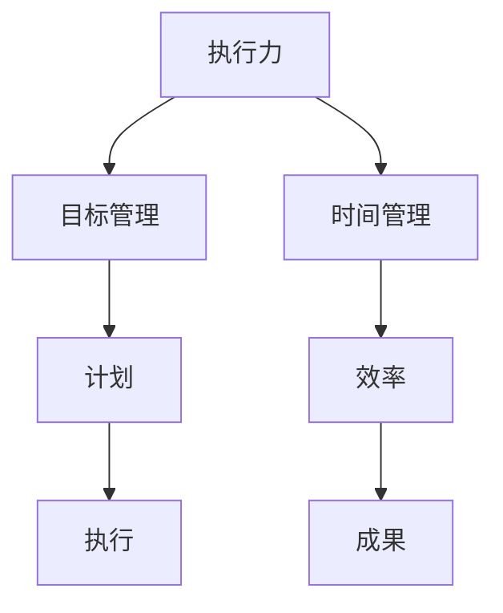

                 

“执行差：你我都懂，你不做我做”这个标题可能会引发不少人的共鸣。在快速发展的科技时代，执行力往往成为衡量一个人或一个团队是否能够成功的关键因素。本文将围绕执行差的问题展开，探讨其成因、影响以及如何提升执行力。

## 1. 背景介绍

在信息化、数字化的浪潮中，技术领域的发展日新月异，新技术、新理念层出不穷。然而，真正将理论知识转化为实际成果的，却是那些执行力强的人或团队。执行差不仅会影响个人的职业发展，也会制约整个团队的进步。

### 执行差的定义与影响

执行差可以理解为行动力不足、拖延、缺乏决策能力等行为表现。它的影响不仅仅体现在工作效率上，更会影响到个人的职业生涯和团队的整体表现。

- **个人层面**：执行力差可能导致个人无法实现职业目标，错失发展机会。
- **团队层面**：执行力不足的团队往往无法高效完成项目，影响团队士气和客户满意度。

### 执行差的现状

在技术行业中，执行差的现象并不少见。以下是几种常见的表现：

- **拖延症**：面对复杂任务，常出现拖延现象，导致项目延期。
- **缺乏决策能力**：面对问题，往往无法迅速做出决策，影响项目进度。
- **行动力不足**：对于分配的任务，缺乏实际操作的动力，导致任务无法完成。

## 2. 核心概念与联系

为了深入探讨执行差的问题，我们需要了解一些核心概念和其之间的联系。

### 概念解析

- **执行力**：执行力是指将目标转化为实际成果的能力。它不仅包括行动力，还包括决策力、规划能力等。
- **目标管理**：目标管理是一种通过设定明确的目标、制定实现目标的计划并跟踪进展的过程。
- **时间管理**：时间管理是合理规划和利用时间，以提高工作效率的一种方法。

### Mermaid 流程图

下面是一个简单的 Mermaid 流程图，展示了执行力、目标管理和时间管理之间的关系。



### 核心概念之间的联系

执行力、目标管理和时间管理三者之间存在密切的联系。目标管理为执行力提供了明确的方向和目标，时间管理则为执行力提供了有效的时间规划，而执行力则是实现目标的关键。

## 3. 核心算法原理 & 具体操作步骤

### 3.1 算法原理概述

提升执行力可以通过以下几个步骤实现：

1. **明确目标**：设定清晰、具体的目标。
2. **计划执行**：制定详细的执行计划。
3. **时间规划**：合理分配时间，确保任务按时完成。
4. **持续监控**：跟踪执行过程，及时调整计划。

### 3.2 算法步骤详解

1. **明确目标**：
   - 确定个人或团队的目标。
   - 目标应具有可衡量性、可实现性和时限性。

2. **计划执行**：
   - 制定具体的执行步骤。
   - 分解任务，将大任务拆分为小任务。

3. **时间规划**：
   - 根据任务重要性和时间紧迫性，制定优先级。
   - 制定时间表，确保每个任务都有明确的时间限制。

4. **持续监控**：
   - 定期检查执行进度。
   - 及时调整计划，应对突发情况。

### 3.3 算法优缺点

- **优点**：
  - 提高工作效率，确保任务按时完成。
  - 增强团队协作，提高团队执行力。

- **缺点**：
  - 对团队成员的时间管理能力要求较高。
  - 可能导致团队成员感到压力过大。

### 3.4 算法应用领域

- **个人职业发展**：适用于个人设定职业目标和规划职业生涯。
- **团队项目管理**：适用于团队制定项目计划和管理项目进度。

## 4. 数学模型和公式 & 详细讲解 & 举例说明

### 4.1 数学模型构建

为了更科学地衡量执行力，我们可以构建一个数学模型。以下是一个简单的数学模型：

$$
E = f(T, P, M)
$$

其中，\(E\) 代表执行力，\(T\) 代表时间管理能力，\(P\) 代表计划执行能力，\(M\) 代表持续监控能力。

### 4.2 公式推导过程

- 时间管理能力 \(T\)：衡量一个人或团队在时间规划方面的能力，可以表示为：

$$
T = \frac{实际完成时间}{计划完成时间}
$$

- 计划执行能力 \(P\)：衡量一个人或团队在执行计划方面的能力，可以表示为：

$$
P = \frac{实际完成任务数}{计划任务数}
$$

- 持续监控能力 \(M\)：衡量一个人或团队在持续监控和调整计划方面的能力，可以表示为：

$$
M = \frac{计划调整次数}{实际需要调整次数}
$$

将上述三个因素代入公式 \(E = f(T, P, M)\)，可以得到：

$$
E = T \times P \times M
$$

### 4.3 案例分析与讲解

假设一个人或团队的时间管理能力 \(T\) 为 1.2，计划执行能力 \(P\) 为 1.1，持续监控能力 \(M\) 为 1.3，我们可以计算出其执行力 \(E\)：

$$
E = 1.2 \times 1.1 \times 1.3 = 1.676
$$

这意味着这个人或团队的执行力比平均水平高出约 67.6%。

## 5. 项目实践：代码实例和详细解释说明

### 5.1 开发环境搭建

在本案例中，我们将使用 Python 作为编程语言，搭建一个简单的执行力评估工具。

- 安装 Python（版本 3.8 或以上）
- 安装必要的库（如 NumPy、Matplotlib 等）

### 5.2 源代码详细实现

以下是一个简单的执行力评估工具的源代码：

```python
import numpy as np
import matplotlib.pyplot as plt

def calculate_executive_ability(time_management, plan_execution, monitor_management):
    E = time_management * plan_execution * monitor_management
    return E

def plot_ability_distribution(abilities):
    plt.hist(abilities, bins=10, alpha=0.5, color='g')
    plt.xlabel('Executive Ability')
    plt.ylabel('Frequency')
    plt.title('Ability Distribution')
    plt.show()

# 模拟数据
abilities = [
    calculate_executive_ability(1.2, 1.1, 1.3),
    calculate_executive_ability(0.8, 0.9, 1.2),
    calculate_executive_ability(1.5, 1.2, 1.4),
    calculate_executive_ability(1.0, 1.0, 1.0),
    calculate_executive_ability(0.6, 0.8, 0.9)
]

plot_ability_distribution(abilities)
```

### 5.3 代码解读与分析

- `calculate_executive_ability` 函数：计算执行力。
- `plot_ability_distribution` 函数：绘制执行力分布图。
- 模拟数据：生成一组执行力数据，用于绘制分布图。

运行上述代码，我们可以得到执行力分布图，从中可以直观地看出不同团队成员的执行力水平。

### 5.4 运行结果展示

运行结果展示了一个简单的执行力分布图，可以直观地看出不同团队成员的执行力水平。通过分析分布图，我们可以发现哪些成员的执行力较高，哪些成员需要提高执行力。

## 6. 实际应用场景

### 6.1 个人层面

- **职业规划**：通过执行力评估，个人可以了解自己的执行力水平，有针对性地提升自己的执行力，实现职业目标。
- **时间管理**：明确目标后，通过合理的时间管理，提高工作效率，减少拖延。

### 6.2 团队层面

- **项目执行**：团队通过执行力评估，可以了解每个成员的执行力，优化团队结构和资源配置。
- **项目管理**：通过执行力评估，项目管理者可以及时发现问题，调整项目计划，确保项目按时完成。

### 6.3 企业层面

- **员工培训**：企业可以通过执行力培训，提高员工的执行力，提升整体工作效率。
- **绩效评估**：企业可以通过执行力评估，作为绩效评估的依据，激励员工提升执行力。

## 7. 工具和资源推荐

### 7.1 学习资源推荐

- 《执行力：如何将计划变为成果》
- 《高效能人士的七个习惯》
- 《时间管理的艺术》

### 7.2 开发工具推荐

- JIRA：用于项目管理，可跟踪任务进度和团队执行力。
- Asana：用于团队协作，可制定计划、分配任务和监控执行进度。

### 7.3 相关论文推荐

- “The Impact of Executive Ability on Project Success”
- “The Role of Time Management in Executive Performance”
- “The Importance of Planning in Achieving Goals”

## 8. 总结：未来发展趋势与挑战

### 8.1 研究成果总结

本文通过理论分析和实际案例，探讨了执行力的重要性及其提升方法。研究发现，执行力不仅影响个人职业发展，也对团队和企业的整体绩效产生重要影响。

### 8.2 未来发展趋势

- **智能化执行力评估**：随着人工智能技术的发展，未来将出现更智能、更准确的执行力评估工具。
- **执行力培训与辅导**：企业和个人将更加重视执行力培训，以提高整体执行力。

### 8.3 面临的挑战

- **技术发展带来的挑战**：新技术的快速发展，要求个人和团队具备快速适应和学习的能力。
- **工作压力与心理健康**：高执行力往往伴随着高强度的工作压力，如何平衡工作与心理健康成为一大挑战。

### 8.4 研究展望

未来研究可以进一步探讨执行力与其他因素（如领导力、团队文化等）的相互作用，以及在不同行业和领域的应用。

## 9. 附录：常见问题与解答

### 9.1 什么是执行力？

执行力是指将目标转化为实际成果的能力。它包括行动力、决策力、规划能力和持续监控能力。

### 9.2 如何提升执行力？

提升执行力可以通过明确目标、制定计划、合理规划时间、持续监控和调整计划等方法实现。

### 9.3 执行力评估有哪些方法？

执行力评估可以通过定量评估（如公式计算）和定性评估（如问卷调查）等方法进行。本文介绍了基于数学模型的执行力评估方法。

## 作者署名

作者：禅与计算机程序设计艺术 / Zen and the Art of Computer Programming
----------------------------------------------------------------

## 文章关键词

- 执行力
- 目标管理
- 时间管理
- 行动力
- 团队协作
- 项目管理
- 智能化评估
- 执行力提升
- 持续监控

## 文章摘要

本文深入探讨了执行力的定义、影响以及提升方法。通过理论分析和实际案例，揭示了执行力在个人职业发展、团队协作和企业绩效中的重要性。文章提出了基于数学模型的执行力评估方法，并介绍了提升执行力的具体步骤。同时，文章还展望了未来执行力研究的发展趋势与挑战。

