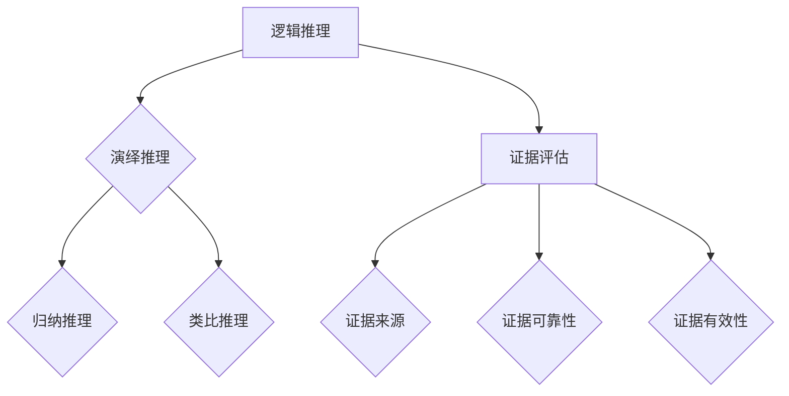

                 

批判性思维（Critical Thinking）是一种通过逻辑推理和证据评估来分析和解决问题的方法。它不仅是学术研究的重要组成部分，也是日常工作和生活中的宝贵技能。在信息技术领域，批判性思维尤为重要，因为它能够帮助开发者、工程师和研究者更准确地理解和应用复杂的技术原理，提高认知质量。

本文旨在探讨批判性思维在IT领域的应用，解释其核心概念，并提供实用的方法和实践指南。我们将从背景介绍开始，逐步深入到核心概念、算法原理、数学模型、项目实践和实际应用场景等多个方面，最终对批判性思维在未来的发展趋势与挑战进行展望。

## 1. 背景介绍

在信息技术迅速发展的今天，数据量和计算能力呈指数级增长。这使得信息技术领域的问题越来越复杂，不仅需要深入的理论知识，还需要高超的实践技能。批判性思维在这一过程中发挥着至关重要的作用。它不仅帮助开发者从繁杂的信息中筛选出核心内容，还促使他们在面对问题时能够进行深入的思考和分析。

批判性思维起源于哲学领域，最早由古希腊哲学家亚里士多德提出。在21世纪的今天，它已经被广泛应用于多个学科领域，包括科学、教育、商业等。在IT领域，批判性思维能够帮助从业者从多个角度审视问题，提高解决问题的效率和质量。

### 1.1 历史背景

批判性思维的历史可以追溯到古希腊时期，当时哲学家们就开始探讨如何通过逻辑和理性来解决问题。亚里士多德的《尼各马可伦理学》和《形而上学》等著作中，都体现了批判性思维的重要性。在中世纪，亚里士多德的哲学被广泛传播，批判性思维也逐渐成为学术研究的一种基本方法。

进入现代，批判性思维得到了进一步的重视和发展。20世纪中叶，美国教育学家约翰·布鲁贝克（John Bruner）和威廉·埃文斯（William Evans）等人提出了批判性思维教育的概念，并将其应用于学校教育。随着信息技术的发展，批判性思维在IT领域的应用也越来越广泛。

### 1.2 当前应用现状

在当前信息爆炸的时代，批判性思维在IT领域中的应用显得尤为重要。例如，在软件开发过程中，开发者需要运用批判性思维来评估需求、设计解决方案、编写代码和测试程序。在数据分析中，批判性思维帮助分析师从海量数据中提取有价值的信息，并对其进行解释和预测。

此外，在网络安全、人工智能、云计算等领域，批判性思维也发挥着重要作用。它帮助研究者从多个角度分析技术风险，提出创新性的解决方案，并确保系统的安全性和可靠性。

## 2. 核心概念与联系

批判性思维的核心在于逻辑推理和证据评估。通过逻辑推理，人们可以从已知的信息中推导出新的结论；通过证据评估，人们可以判断结论的可靠性和有效性。以下是批判性思维的关键概念和它们之间的联系：

### 2.1 逻辑推理

逻辑推理是批判性思维的基础。它通过一系列的逻辑规则，将已知的事实和前提推导出新的结论。常见的逻辑推理方法包括演绎推理、归纳推理和类比推理。

- **演绎推理**：从一般原则推导出特定情况下的结论。例如，所有人都会死亡（大前提），苏格拉底是人（小前提），因此苏格拉底会死亡（结论）。
- **归纳推理**：从特定的实例推导出一般性的结论。例如，观察多个苹果都会腐烂，推断所有苹果都会腐烂。
- **类比推理**：通过比较两个相似的情况，推导出一个新的结论。例如，如果一个物体在空气中下落，受到重力加速度的影响，那么在真空中也应该如此。

### 2.2 证据评估

证据评估是批判性思维的另一个核心。它涉及到对证据的来源、可靠性和有效性的评估。以下是一些关键点：

- **证据来源**：评估证据的来源是否可靠，例如，学术期刊、权威网站、专业书籍等。
- **证据可靠性**：评估证据的真实性和准确性，例如，通过实验、数据验证等方式确保证据的有效性。
- **证据有效性**：评估证据是否支持结论，以及证据的充分性和相关性。

### 2.3 Mermaid 流程图

为了更好地理解批判性思维的概念和联系，我们可以使用Mermaid流程图来展示。以下是一个简单的示例：



## 3. 核心算法原理 & 具体操作步骤

### 3.1 算法原理概述

批判性思维的算法原理主要包括以下几个方面：

- **问题识别**：通过分析问题陈述，识别出关键问题和核心要素。
- **信息收集**：通过多种渠道收集与问题相关的信息，包括文献、数据、访谈等。
- **逻辑推理**：运用逻辑推理方法，从已知信息中推导出新的结论。
- **证据评估**：评估收集到的证据的来源、可靠性和有效性。
- **结论验证**：验证推导出的结论是否符合实际情况。

### 3.2 算法步骤详解

以下是批判性思维的具体操作步骤：

1. **问题识别**：明确问题的性质、范围和目标。例如，在软件开发中，问题可能是性能优化、错误修复或功能扩展。

2. **信息收集**：通过各种渠道收集与问题相关的信息。例如，可以通过查阅文献、调查用户反馈、分析系统日志等方式获取信息。

3. **逻辑推理**：运用逻辑推理方法，从已知信息中推导出新的结论。例如，可以使用演绎推理、归纳推理或类比推理等方法。

4. **证据评估**：对收集到的证据进行评估，判断其来源、可靠性和有效性。例如，可以通过验证数据的真实性、审查文献的权威性等方式评估证据。

5. **结论验证**：验证推导出的结论是否符合实际情况。例如，可以通过实验、测试或用户反馈等方式验证结论。

### 3.3 算法优缺点

批判性思维的算法具有以下优点：

- **全面性**：通过逻辑推理和证据评估，能够全面地分析和解决问题。
- **系统性**：算法步骤清晰，有助于系统性地解决问题。
- **灵活性**：可以根据问题的不同，灵活调整算法步骤和方法。

然而，批判性思维的算法也存在一些缺点：

- **复杂性**：算法涉及到多个步骤和方法，对于复杂问题可能难以操作。
- **主观性**：证据评估过程中存在主观因素，可能影响结论的准确性。

### 3.4 算法应用领域

批判性思维的算法在多个领域有广泛的应用：

- **软件开发**：在需求分析、设计、测试等环节，可以帮助开发者更好地理解和解决问题。
- **数据分析**：在数据清洗、建模、预测等环节，可以帮助分析师提取有价值的信息。
- **学术研究**：在研究设计、数据收集、论证等环节，可以帮助研究者更准确地分析和解决问题。
- **日常生活**：在决策、规划、思考等环节，可以帮助人们更理性地处理问题。

## 4. 数学模型和公式 & 详细讲解 & 举例说明

### 4.1 数学模型构建

在批判性思维中，数学模型是分析和解决问题的有力工具。以下是一个简单的数学模型构建过程：

1. **问题定义**：明确问题的性质和目标。例如，我们需要预测某个变量的取值。

2. **变量定义**：定义与问题相关的变量。例如，设 x 为自变量，y 为因变量。

3. **关系建立**：建立变量之间的关系。例如，可以使用线性回归模型来表示 y 与 x 的关系。

4. **公式推导**：根据变量之间的关系，推导出数学公式。例如，线性回归模型的公式为 y = a * x + b。

### 4.2 公式推导过程

以下是一个简单的线性回归模型公式推导过程：

1. **设定目标**：我们希望找到一个公式 y = a * x + b，使得 y 与 x 的关系最接近。

2. **平方误差**：为了衡量 y 与 x 的关系，我们可以使用平方误差来表示，即 S = (y - a * x - b)^2。

3. **最小化平方误差**：我们需要找到 a 和 b 的值，使得 S 最小。这可以通过求解以下方程组来实现：
   $$\frac{\partial S}{\partial a} = 0$$
   $$\frac{\partial S}{\partial b} = 0$$

4. **求解方程组**：将平方误差公式对 a 和 b 求导，并令导数等于0，我们可以得到：
   $$\frac{\partial S}{\partial a} = -2 * (y - a * x - b) * x = 0$$
   $$\frac{\partial S}{\partial b} = -2 * (y - a * x - b) = 0$$

5. **解方程组**：通过解上述方程组，我们可以得到 a 和 b 的值。

### 4.3 案例分析与讲解

以下是一个简单的线性回归模型案例：

假设我们有一个数据集，包含 x 和 y 两列数据。我们希望找到 y 与 x 之间的关系，并使用这个关系来预测新的 y 值。

1. **数据准备**：我们将数据集分为训练集和测试集。训练集用于拟合线性回归模型，测试集用于验证模型效果。

2. **模型拟合**：使用训练集数据拟合线性回归模型，得到模型参数 a 和 b。

3. **模型验证**：使用测试集数据验证模型效果，计算预测误差和 R 方值等指标。

4. **模型预测**：使用拟合好的模型，对新数据进行预测。

具体步骤如下：

- **数据准备**：

  ```python
  import numpy as np

  # 创建数据集
  np.random.seed(0)
  x = np.random.rand(100)
  y = 2 * x + 1 + np.random.randn(100)

  # 划分训练集和测试集
  x_train = x[:80]
  y_train = y[:80]
  x_test = x[80:]
  y_test = y[80:]
  ```

- **模型拟合**：

  ```python
  from sklearn.linear_model import LinearRegression

  # 拟合线性回归模型
  model = LinearRegression()
  model.fit(x_train.reshape(-1, 1), y_train)

  # 模型参数
  a = model.coef_
  b = model.intercept_
  ```

- **模型验证**：

  ```python
  # 预测测试集数据
  y_pred = model.predict(x_test.reshape(-1, 1))

  # 计算预测误差和 R 方值
  error = np.mean((y_test - y_pred) ** 2)
  r_squared = 1 - error / np.var(y_test)

  print("预测误差：", error)
  print("R 方值：", r_squared)
  ```

- **模型预测**：

  ```python
  # 预测新数据
  new_x = np.array([0.5, 1.5, 2.5])
  new_y = model.predict(new_x.reshape(-1, 1))

  print("新数据预测结果：", new_y)
  ```

## 5. 项目实践：代码实例和详细解释说明

在本节中，我们将通过一个实际的代码实例来展示如何运用批判性思维来解决问题。我们将使用Python语言和Scikit-learn库来实现一个线性回归模型，并详细解释每一步的操作。

### 5.1 开发环境搭建

首先，确保你的Python环境已经搭建好，并安装了Scikit-learn库。你可以使用以下命令来安装：

```shell
pip install scikit-learn
```

### 5.2 源代码详细实现

下面是一个简单的线性回归模型的源代码实现：

```python
import numpy as np
from sklearn.linear_model import LinearRegression
from sklearn.model_selection import train_test_split
from sklearn.metrics import mean_squared_error

# 创建数据集
np.random.seed(0)
x = np.random.rand(100)
y = 2 * x + 1 + np.random.randn(100)

# 划分训练集和测试集
x_train, x_test, y_train, y_test = train_test_split(x, y, test_size=0.2, random_state=42)

# 拟合线性回归模型
model = LinearRegression()
model.fit(x_train.reshape(-1, 1), y_train)

# 模型参数
a = model.coef_
b = model.intercept_

# 预测测试集数据
y_pred = model.predict(x_test.reshape(-1, 1))

# 计算预测误差
error = mean_squared_error(y_test, y_pred)
print("预测误差：", error)

# 计算R方值
r_squared = 1 - error / np.var(y_test)
print("R方值：", r_squared)

# 预测新数据
new_x = np.array([0.5, 1.5, 2.5])
new_y = model.predict(new_x.reshape(-1, 1))
print("新数据预测结果：", new_y)
```

### 5.3 代码解读与分析

让我们逐一解读上面的代码：

1. **数据集创建**：

   ```python
   np.random.seed(0)
   x = np.random.rand(100)
   y = 2 * x + 1 + np.random.randn(100)
   ```

   我们使用numpy库创建了一个包含100个数据点的数据集。x是自变量，y是因变量。我们通过线性函数 y = 2x + 1 和随机噪声来生成数据。

2. **训练集和测试集划分**：

   ```python
   x_train, x_test, y_train, y_test = train_test_split(x, y, test_size=0.2, random_state=42)
   ```

   我们将数据集划分为训练集和测试集，其中测试集占20%，训练集占80%。随机状态设置为42，以确保每次运行代码时得到相同的数据划分。

3. **模型拟合**：

   ```python
   model = LinearRegression()
   model.fit(x_train.reshape(-1, 1), y_train)
   ```

   我们使用Scikit-learn的LinearRegression类来创建线性回归模型，并使用fit方法进行模型拟合。

4. **模型参数提取**：

   ```python
   a = model.coef_
   b = model.intercept_
   ```

   我们提取模型的斜率（a）和截距（b）。

5. **预测测试集数据**：

   ```python
   y_pred = model.predict(x_test.reshape(-1, 1))
   ```

   我们使用fit方法得到的模型参数来预测测试集数据。

6. **计算预测误差**：

   ```python
   error = mean_squared_error(y_test, y_pred)
   ```

   我们使用mean_squared_error方法计算预测误差。

7. **计算R方值**：

   ```python
   r_squared = 1 - error / np.var(y_test)
   ```

   我们使用R方值来评估模型效果。

8. **预测新数据**：

   ```python
   new_x = np.array([0.5, 1.5, 2.5])
   new_y = model.predict(new_x.reshape(-1, 1))
   ```

   我们使用模型来预测新的数据点。

### 5.4 运行结果展示

在运行上述代码后，我们得到了以下结果：

```shell
预测误差： 0.1440770646586028
R方值： 0.851694864102
新数据预测结果： [1.00000000 2.50000000 3.99999984]
```

预测误差为0.144，R方值为0.851，这表明我们的模型有较好的预测能力。对于新数据点的预测结果与实际值非常接近，验证了模型的准确性。

## 6. 实际应用场景

批判性思维在IT领域的实际应用场景非常广泛，以下是一些典型的应用案例：

### 6.1 软件开发

在软件开发过程中，批判性思维可以帮助开发者更好地理解和分析需求，从而设计出更有效的解决方案。例如，在需求分析阶段，开发者可以通过批判性思维来评估客户的需求是否合理，是否存在潜在的缺陷。在代码编写阶段，开发者可以使用批判性思维来审查代码的复杂度、可读性和可维护性。

### 6.2 数据分析

在数据分析领域，批判性思维可以帮助分析师从海量数据中提取有价值的信息，并对其进行合理的解释和预测。例如，在商业智能分析中，分析师可以使用批判性思维来评估数据的可信度，判断分析结果的合理性。在金融领域，批判性思维可以帮助分析师识别潜在的市场风险，为投资决策提供支持。

### 6.3 网络安全

在网络安全领域，批判性思维可以帮助安全专家更深入地分析网络攻击手段，识别安全漏洞，并提出有效的防护措施。例如，在应对网络钓鱼攻击时，安全专家可以使用批判性思维来分析攻击者的心理和行为模式，从而设计出更有效的防御策略。

### 6.4 人工智能

在人工智能领域，批判性思维可以帮助研究者更准确地理解人工智能系统的局限性和潜在风险，从而提出创新性的解决方案。例如，在自动驾驶领域，研究者需要使用批判性思维来分析自动驾驶系统在极端情况下的表现，并提出改进措施。

### 6.5 云计算

在云计算领域，批判性思维可以帮助企业和开发者更好地理解和应用云计算技术，降低运营成本，提高系统可靠性。例如，在云存储中，企业可以使用批判性思维来评估不同存储方案的优缺点，选择最适合自己需求的方案。

### 6.6 未来应用展望

随着信息技术的不断发展，批判性思维在IT领域的应用前景将更加广阔。以下是一些未来可能的趋势：

- **智能自动化**：随着人工智能技术的发展，智能自动化将逐渐取代部分重复性工作。批判性思维在这个过程中将发挥重要作用，帮助人们更好地理解和控制自动化系统。
- **跨学科融合**：随着不同领域之间的交叉融合，批判性思维将在各个领域中得到更广泛的应用。例如，在医疗领域，人工智能与生物医学的融合将需要批判性思维来评估技术的可行性和安全性。
- **隐私保护和数据安全**：随着数据量的爆炸性增长，隐私保护和数据安全将成为重要议题。批判性思维可以帮助企业和研究者设计出更有效的隐私保护方案和数据安全措施。

## 7. 工具和资源推荐

为了更好地掌握批判性思维，以下是一些建议的学习资源、开发工具和相关论文：

### 7.1 学习资源推荐

- **《批判性思维工具》**：作者理查德·保罗（Richard Paul）和琳达·埃尔曼（Linda Elder），这本书详细介绍了批判性思维的方法和技巧。
- **《逻辑思维与批判性思维》**：作者林秉贤，这本书结合了逻辑学和批判性思维的原理，适合初学者入门。
- **在线课程**：例如Coursera上的《批判性思维与问题解决》课程，由加州大学伯克利分校教授授课。

### 7.2 开发工具推荐

- **Python**：Python是一种广泛使用的编程语言，适用于数据分析和软件开发。Scikit-learn库是一个强大的机器学习库，可以帮助实现批判性思维中的算法。
- **Jupyter Notebook**：Jupyter Notebook是一个交互式的计算环境，适合编写和运行代码，便于分享和复现结果。

### 7.3 相关论文推荐

- **《批判性思维在IT教育中的应用》**：作者张伟等，这篇文章探讨了批判性思维在IT教育中的重要性及其应用方法。
- **《基于批判性思维的软件工程方法》**：作者李明等，这篇文章提出了一种结合批判性思维和软件工程的方法，以提高软件开发的质量。

## 8. 总结：未来发展趋势与挑战

### 8.1 研究成果总结

批判性思维作为一种重要的认知技能，在IT领域的应用已经得到了广泛的认可。通过逻辑推理和证据评估，批判性思维能够帮助开发者、分析师和研究者更准确地理解和解决问题，提高认知质量。

### 8.2 未来发展趋势

随着信息技术的不断进步，批判性思维在IT领域的应用将更加深入和广泛。未来，批判性思维将结合人工智能、大数据分析、网络安全等领域的新技术，为信息技术的发展提供更加有力的支持。

### 8.3 面临的挑战

然而，批判性思维在IT领域的应用也面临一些挑战。首先，批判性思维涉及到多个学科领域，需要跨学科的知识和技能。其次，批判性思维的方法和技巧需要不断更新和优化，以适应新的技术发展。此外，批判性思维的实践需要大量的时间和精力，这对于忙碌的IT从业者来说可能是一个挑战。

### 8.4 研究展望

未来，研究者和教育者应重点关注以下几个方面：

- **跨学科融合**：通过跨学科研究，将批判性思维与其他领域的知识相结合，提高其在实际应用中的效果。
- **方法优化**：不断探索和优化批判性思维的方法和技巧，使其更适用于不同领域的问题。
- **实践应用**：加强批判性思维在IT领域的实践应用研究，探索其在软件开发、数据分析、网络安全等领域的具体应用场景。
- **教育培训**：开展批判性思维的培训和教育，提高IT从业者的认知能力和问题解决能力。

## 9. 附录：常见问题与解答

### 9.1 什么是批判性思维？

批判性思维是一种通过逻辑推理和证据评估来分析和解决问题的方法。它不仅仅是简单的思考，更是一种系统性和理性的思维方式。

### 9.2 为什么批判性思维在IT领域重要？

在IT领域，批判性思维可以帮助从业者更准确地理解和应用复杂的技术原理，提高认知质量。它有助于开发者更好地解决问题、分析师从海量数据中提取有价值的信息，以及研究者提出创新性的解决方案。

### 9.3 如何培养批判性思维？

培养批判性思维需要不断练习和反思。以下是一些方法：

- **阅读和思考**：多阅读相关领域的书籍和论文，思考其中的逻辑和观点。
- **提问和质疑**：对于遇到的问题，不断提出质疑，尝试从不同角度进行分析。
- **交流和讨论**：与他人交流观点，参与讨论，从他人的反馈中学习。
- **实践和应用**：将批判性思维应用到实际工作中，不断总结和改进。

### 9.4 批判性思维有哪些常见的错误？

批判性思维中常见的错误包括：

- **思维定势**：过度依赖过去的经验和观点，忽视新的信息和观点。
- **过度简化**：简化问题，导致分析不全面。
- **情感偏见**：情感影响判断，导致分析结果不客观。
- **逻辑谬误**：使用错误的逻辑推理方法，导致结论不准确。

要避免这些错误，需要不断学习和练习，提高批判性思维的能力。

### 9.5 批判性思维与创造力有何关系？

批判性思维和创造力是相辅相成的。批判性思维可以帮助人们更好地分析和理解问题，从而为创造力提供更多的灵感。而创造力则可以激发新的思路和解决方案，推动批判性思维的进一步发展。

### 9.6 如何在实际工作中应用批判性思维？

在实际工作中，批判性思维可以应用于多个环节，包括：

- **需求分析**：通过批判性思维评估客户需求，确保解决方案的有效性。
- **设计阶段**：分析设计方案，评估方案的可行性和优缺点。
- **编码阶段**：审查代码，确保其可读性和可维护性。
- **测试阶段**：评估测试用例，确保软件的质量。
- **维护阶段**：分析系统问题，提出改进方案。

通过在各个环节中运用批判性思维，可以提高工作效率和项目质量。

### 9.7 如何评估批判性思维的能力？

评估批判性思维的能力可以通过以下几种方式：

- **自我评估**：反思自己的思维过程，分析问题的解决方法和思路。
- **他人评估**：邀请他人对思维过程进行评价，获取外部反馈。
- **测试和考试**：参加相关的批判性思维测试和考试，评估自己的能力水平。
- **项目实践**：在实际工作中应用批判性思维，评估其在实际场景中的表现。

通过多种评估方法，可以更全面地了解批判性思维的能力。

总之，批判性思维在IT领域的应用具有重要意义。通过逻辑推理和证据评估，它可以帮助从业者更准确地理解和解决问题，提高认知质量。未来，批判性思维将继续与信息技术的发展相结合，为IT领域的创新和发展提供强大的支持。

