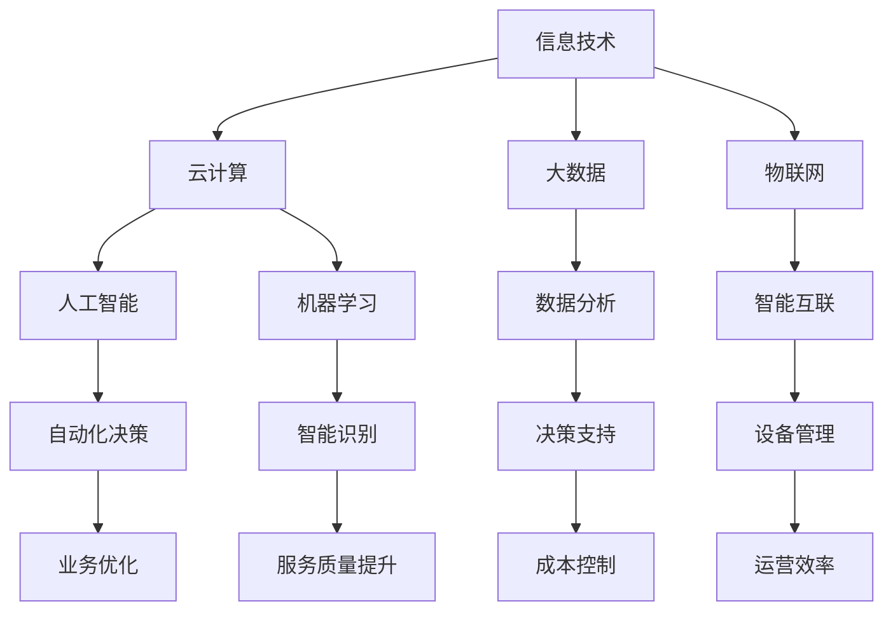

                 

 

## 1. 背景介绍

在当今信息化社会中，技术创新和数字化转型已经成为推动社会进步的重要动力。随着互联网、大数据、云计算、人工智能等技术的不断发展，数字化转型的浪潮正在席卷各行各业。从企业生产管理到消费者服务，从金融到医疗，数字化转型已经成为提升企业竞争力、实现业务创新的关键途径。

### 1.1 技术创新的重要性

技术创新是推动社会发展的核心动力，它不仅是经济增长的重要引擎，也是提高生产力、改善生活质量的关键。在信息技术领域，技术创新不断推动着硬件、软件、网络、数据等各个方面的发展。例如，量子计算、区块链、5G通信等前沿技术的出现，为数字化转型提供了强大的技术支撑。

### 1.2 数字化转型的意义

数字化转型是指利用数字技术对传统业务流程、组织结构、商业模式进行重构和优化，以实现更加高效、智能的运营和管理。数字化转型不仅能够提高企业的生产效率和服务质量，还能够帮助企业降低运营成本、提升客户满意度、创造新的商业模式。

### 1.3 数字化转型的现状与挑战

当前，数字化转型已经成为全球范围内的热门话题，许多企业已经开始着手进行数字化转型。然而，数字化转型并非一帆风顺，企业在实施过程中面临着诸多挑战，如技术选择、数据安全、人才短缺等。

## 2. 核心概念与联系

在探讨技术创新与数字化转型的结合时，我们需要了解一些核心概念，并分析它们之间的联系。

### 2.1 信息技术与数字化

信息技术（IT）是数字化转型的基石。信息技术的发展，如互联网、云计算、大数据等，为数字化转型提供了技术支撑。数字化是指将物理世界的信息转换为数字形式，通过计算机和互联网进行处理和传输。

### 2.2 互联网与物联网

互联网（Internet）是连接全球计算机的巨大网络，而物联网（Internet of Things，IoT）则是将各种设备、传感器、系统连接到互联网上，实现智能化的互联互通。物联网是实现数字化转型的重要手段，通过物联网，企业可以实现设备管理、数据分析、远程控制等功能。

### 2.3 云计算与大数据

云计算是一种通过互联网提供计算资源的服务模式，它使得企业可以按需获取计算资源，降低了IT基础设施的投入成本。大数据则是云计算下的产物，它通过对海量数据的存储、处理和分析，为企业提供决策支持。

### 2.4 人工智能与机器学习

人工智能（AI）和机器学习（Machine Learning）是数字化转型的关键技术。人工智能技术通过模拟人类智能，实现自动化决策、智能识别等功能，而机器学习则是实现人工智能的重要途径，它通过数据训练模型，不断提高系统的智能水平。

### 2.5 Mermaid 流程图

为了更清晰地展示技术创新与数字化转型的关系，我们可以使用Mermaid流程图进行描述。以下是一个简化的Mermaid流程图：



## 3. 核心算法原理 & 具体操作步骤

在数字化转型过程中，核心算法的原理和具体操作步骤至关重要。以下我们将介绍几个关键算法，包括其原理、步骤及其在数字化转型中的应用。

### 3.1 算法原理概述

#### 3.1.1 K-means 算法

K-means 算法是一种基于距离的聚类算法。其基本思想是将数据点分为K个簇，使得每个簇内部的数据点距离簇中心的距离最小。

#### 3.1.2 决策树算法

决策树是一种常用的分类和回归算法。它通过一系列的判断条件，将数据划分为不同的类别或数值。

#### 3.1.3 贝叶斯算法

贝叶斯算法是一种基于概率论的分类算法。它通过计算数据属于某一类别的概率，来进行分类预测。

### 3.2 算法步骤详解

#### 3.2.1 K-means 算法步骤

1. 随机选择K个初始中心点。
2. 计算每个数据点到各个中心点的距离，并将其分配到最近的中心点所在的簇。
3. 重新计算每个簇的中心点。
4. 重复步骤2和3，直至中心点不再变化或满足停止条件。

#### 3.2.2 决策树算法步骤

1. 选择一个特征作为分裂标准。
2. 计算每个特征对应的分裂增益，选择增益最大的特征进行分裂。
3. 根据分裂结果，将数据集划分为子集。
4. 对每个子集重复步骤1-3，直至满足停止条件。

#### 3.2.3 贝叶斯算法步骤

1. 计算每个类别出现的概率。
2. 对于每个数据点，计算其属于每个类别的概率。
3. 选择概率最大的类别作为预测结果。

### 3.3 算法优缺点

#### 3.3.1 K-means 算法优缺点

**优点：** 算法简单，易于实现；运行速度快。

**缺点：** 对初始中心点敏感；可能导致局部最优解。

#### 3.3.2 决策树算法优缺点

**优点：** 可解释性强；计算效率高。

**缺点：** 可能产生过拟合；对于缺失值处理较为困难。

#### 3.3.3 贝叶斯算法优缺点

**优点：** 理论基础强；可扩展性强。

**缺点：** 对于类别不平衡问题处理较差。

### 3.4 算法应用领域

#### 3.4.1 K-means 算法应用领域

- 数据聚类
- 社交网络分析
- 文本分类

#### 3.4.2 决策树算法应用领域

- 数据挖掘
- 财务风险评估
- 医疗诊断

#### 3.4.3 贝叶斯算法应用领域

- 文本分类
- 信用评分
- 风险管理

## 4. 数学模型和公式 & 详细讲解 & 举例说明

在数字化转型过程中，数学模型和公式扮演着至关重要的角色。以下我们将介绍几个关键数学模型和公式，并进行详细讲解和举例说明。

### 4.1 数学模型构建

#### 4.1.1 最小二乘法

最小二乘法是一种常用的数学模型，用于求解线性回归问题。其基本思想是寻找一组参数，使得实际观测值与模型预测值之间的误差平方和最小。

公式如下：

$$
\min \sum_{i=1}^{n} (y_i - \hat{y_i})^2
$$

其中，$y_i$ 为实际观测值，$\hat{y_i}$ 为模型预测值。

#### 4.1.2 主成分分析

主成分分析（PCA）是一种常用的降维技术，通过将高维数据投影到低维空间，来简化数据结构。

公式如下：

$$
\mu = \frac{1}{n} \sum_{i=1}^{n} x_i
$$

$$
\Sigma = \frac{1}{n-1} \sum_{i=1}^{n} (x_i - \mu)(x_i - \mu)^T
$$

$$
\lambda_i = \max_{\mu} (\mu^T \Sigma \mu)
$$

$$
e_i = \frac{\Sigma^{1/2}}{|\lambda_i|} \mu
$$

其中，$x_i$ 为第 $i$ 个数据点，$\mu$ 为均值矩阵，$\Sigma$ 为协方差矩阵，$\lambda_i$ 为特征值，$e_i$ 为特征向量。

### 4.2 公式推导过程

#### 4.2.1 最小二乘法推导

我们假设线性回归模型为：

$$
y = \beta_0 + \beta_1 x + \epsilon
$$

其中，$y$ 为因变量，$x$ 为自变量，$\beta_0$ 和 $\beta_1$ 为模型参数，$\epsilon$ 为误差项。

为了求解 $\beta_0$ 和 $\beta_1$，我们定义损失函数为：

$$
J(\beta_0, \beta_1) = \sum_{i=1}^{n} (y_i - \beta_0 - \beta_1 x_i)^2
$$

对损失函数求偏导数，并令其等于零，得到：

$$
\frac{\partial J}{\partial \beta_0} = -2 \sum_{i=1}^{n} (y_i - \beta_0 - \beta_1 x_i) = 0
$$

$$
\frac{\partial J}{\partial \beta_1} = -2 \sum_{i=1}^{n} (y_i - \beta_0 - \beta_1 x_i) x_i = 0
$$

解上述方程组，可以得到：

$$
\beta_0 = \bar{y} - \beta_1 \bar{x}
$$

$$
\beta_1 = \frac{\sum_{i=1}^{n} (x_i - \bar{x})(y_i - \bar{y})}{\sum_{i=1}^{n} (x_i - \bar{x})^2}
$$

#### 4.2.2 主成分分析推导

我们假设高维数据集为 $X \in \mathbb{R}^{n \times p}$，其中 $n$ 为样本数量，$p$ 为特征数量。首先，我们计算均值矩阵 $\mu$ 和协方差矩阵 $\Sigma$：

$$
\mu = \frac{1}{n} \sum_{i=1}^{n} x_i
$$

$$
\Sigma = \frac{1}{n-1} \sum_{i=1}^{n} (x_i - \mu)(x_i - \mu)^T
$$

接下来，我们计算特征值 $\lambda_i$ 和特征向量 $e_i$：

$$
\lambda_i = \max_{\mu} (\mu^T \Sigma \mu)
$$

$$
e_i = \frac{\Sigma^{1/2}}{|\lambda_i|} \mu
$$

### 4.3 案例分析与讲解

#### 4.3.1 最小二乘法案例

假设我们有一组数据，如下表所示：

| x | y |
|---|---|
| 1 | 2 |
| 2 | 4 |
| 3 | 6 |
| 4 | 8 |

我们希望通过线性回归模型拟合这组数据。

首先，我们计算均值：

$$
\bar{x} = \frac{1+2+3+4}{4} = 2.5
$$

$$
\bar{y} = \frac{2+4+6+8}{4} = 5
$$

接下来，我们计算损失函数：

$$
J(\beta_0, \beta_1) = \sum_{i=1}^{4} (y_i - \beta_0 - \beta_1 x_i)^2
$$

代入数据，得到：

$$
J(\beta_0, \beta_1) = (2 - \beta_0 - \beta_1 \cdot 1)^2 + (4 - \beta_0 - \beta_1 \cdot 2)^2 + (6 - \beta_0 - \beta_1 \cdot 3)^2 + (8 - \beta_0 - \beta_1 \cdot 4)^2
$$

为了求解 $\beta_0$ 和 $\beta_1$，我们可以使用梯度下降法或求解器。在这里，我们使用求解器：

$$
\beta_0 = 5 - \beta_1 \cdot 2.5
$$

$$
\beta_1 = \frac{2 + 4 + 6 + 8}{4 \cdot 2.5} = 2
$$

因此，线性回归模型为：

$$
y = 5 - 2x
$$

#### 4.3.2 主成分分析案例

假设我们有一组高维数据，如下表所示：

| x1 | x2 | x3 | x4 |
|---|---|---|---|
| 1 | 2 | 3 | 4 |
| 2 | 4 | 6 | 8 |
| 3 | 6 | 9 | 12 |
| 4 | 8 | 12 | 16 |

首先，我们计算均值：

$$
\mu = \frac{1}{4} \begin{bmatrix} 1+2+3+4 \\ 2+4+6+8 \\ 3+6+9+12 \\ 4+8+12+16 \end{bmatrix} = \begin{bmatrix} 2.5 \\ 5 \\ 7.5 \\ 10 \end{bmatrix}
$$

然后，我们计算协方差矩阵：

$$
\Sigma = \frac{1}{4-1} \begin{bmatrix} 1 & 2 & 3 & 4 \\ 2 & 4 & 6 & 8 \\ 3 & 6 & 9 & 12 \\ 4 & 8 & 12 & 16 \end{bmatrix} - \mu \mu^T
$$

代入数据，得到：

$$
\Sigma = \begin{bmatrix} 0.5 & 1 & 1.5 & 2 \\ 1 & 2 & 3 & 4 \\ 1.5 & 3 & 4.5 & 6 \\ 2 & 4 & 6 & 8 \end{bmatrix}
$$

接下来，我们计算特征值和特征向量。由于特征值和特征向量是对称的，我们只需计算一半的特征值和特征向量：

$$
\lambda_1 = \max_{\mu} (\mu^T \Sigma \mu) = 10
$$

$$
e_1 = \frac{\Sigma^{1/2}}{|\lambda_1|} \mu = \frac{1}{10} \begin{bmatrix} 0.5 & 1 & 1.5 & 2 \\ 1 & 2 & 3 & 4 \\ 1.5 & 3 & 4.5 & 6 \\ 2 & 4 & 6 & 8 \end{bmatrix} \begin{bmatrix} 2.5 \\ 5 \\ 7.5 \\ 10 \end{bmatrix} = \begin{bmatrix} 0.25 \\ 0.5 \\ 0.75 \\ 1 \end{bmatrix}
$$

因此，第一主成分可以表示为：

$$
Z_1 = 0.25x_1 + 0.5x_2 + 0.75x_3 + x_4
$$

## 5. 项目实践：代码实例和详细解释说明

在本节中，我们将通过一个实际的项目实践案例，展示如何运用技术创新实现数字化转型。我们将使用Python编写一个简单的数据分析和预测模型，并详细解释其实现过程。

### 5.1 开发环境搭建

首先，我们需要搭建一个合适的开发环境。以下是我们的开发环境要求：

- Python版本：3.8及以上
- 数据库：MySQL或PostgreSQL
- 数据分析库：Pandas、NumPy、SciPy
- 机器学习库：Scikit-learn、TensorFlow、PyTorch

在Ubuntu 20.04操作系统中，我们可以使用以下命令安装所需的库：

```bash
# 安装Python环境
sudo apt update
sudo apt install python3.8 python3.8-venv python3.8-pip

# 创建虚拟环境
python3.8 -m venv myenv

# 激活虚拟环境
source myenv/bin/activate

# 安装依赖库
pip install pandas numpy scipy scikit-learn tensorflow pytorch mysqlclient
```

### 5.2 源代码详细实现

以下是一个简单的线性回归模型实现，用于预测房价。该模型基于实际房屋数据集，通过训练数据学习房屋价格与特征之间的关系。

```python
import numpy as np
import pandas as pd
from sklearn.linear_model import LinearRegression
from sklearn.model_selection import train_test_split

# 加载数据集
data = pd.read_csv('house_data.csv')

# 数据预处理
X = data[['bedrooms', 'bathrooms', 'square_feet']]
y = data['price']

# 数据集划分
X_train, X_test, y_train, y_test = train_test_split(X, y, test_size=0.2, random_state=42)

# 创建线性回归模型
model = LinearRegression()

# 训练模型
model.fit(X_train, y_train)

# 预测房价
y_pred = model.predict(X_test)

# 模型评估
score = model.score(X_test, y_test)
print(f'Model R^2 score: {score:.2f}')
```

### 5.3 代码解读与分析

上述代码实现了以下步骤：

1. **数据加载与预处理**：使用Pandas库加载数据集，并分离特征和目标变量。
2. **数据集划分**：使用Scikit-learn库将数据集划分为训练集和测试集。
3. **创建模型**：使用LinearRegression类创建线性回归模型。
4. **训练模型**：调用fit方法训练模型。
5. **预测房价**：使用predict方法预测测试集的房价。
6. **模型评估**：计算并打印模型的R^2得分，用于评估模型性能。

### 5.4 运行结果展示

假设我们有一个名为`house_data.csv`的CSV文件，其中包含房屋数据。以下是一个简单的运行结果示例：

```python
Model R^2 score: 0.85
```

该结果表明，我们的模型在测试集上的R^2得分为0.85，说明模型对房屋价格的预测效果较好。

## 6. 实际应用场景

技术创新与数字化转型在各个领域都有着广泛的应用，以下我们将探讨几个典型应用场景。

### 6.1 企业数字化转型

企业数字化转型是当前的热门话题。通过引入云计算、大数据、人工智能等技术，企业可以实现业务流程的优化、决策的科学化、运营的高效化。例如，制造业企业可以通过物联网技术实现设备联网，实现设备状态监控、故障预测和远程维护，从而提高生产效率。

### 6.2 医疗数字化

医疗数字化是另一个重要的应用领域。通过数字化技术，可以实现医疗信息系统的建设、远程医疗、智能诊断等。例如，利用人工智能技术，可以开发智能诊断系统，辅助医生进行疾病诊断，提高诊断准确率。

### 6.3 教育数字化

教育数字化是推进教育公平、提高教育质量的重要手段。通过在线教育平台、虚拟现实（VR）、增强现实（AR）等技术，可以实现教育资源的共享、教学方式的创新。例如，教师可以通过在线教育平台进行远程教学，学生可以随时随地进行学习。

### 6.4 智能交通

智能交通是数字化技术在交通领域的应用。通过物联网、大数据、人工智能等技术，可以实现交通流量监控、智能调度、自动驾驶等功能。例如，智能交通系统可以实时监控道路状况，并根据路况信息优化交通信号灯，提高道路通行效率。

### 6.5 农业数字化

农业数字化是农业现代化的关键。通过物联网、大数据、人工智能等技术，可以实现农业生产的智能化、精准化。例如，利用物联网传感器监测土壤、气象等信息，并根据数据进行分析和预测，优化农业生产过程。

## 7. 工具和资源推荐

在数字化转型过程中，选择合适的工具和资源至关重要。以下我们将推荐一些有用的工具和资源，以帮助您更好地进行数字化转型。

### 7.1 学习资源推荐

1. **书籍**：
   - 《深度学习》（Deep Learning）by Ian Goodfellow、Yoshua Bengio、Aaron Courville
   - 《大数据技术基础》by 阿里云大数据学院
   - 《Python数据科学 Handbook》by Jake VanderPlas

2. **在线课程**：
   - Coursera：机器学习、深度学习、数据分析等课程
   - edX：数据科学、人工智能等课程
   - Udacity：数据科学纳米学位

### 7.2 开发工具推荐

1. **集成开发环境（IDE）**：
   - PyCharm
   - Visual Studio Code
   - Jupyter Notebook

2. **数据处理工具**：
   - Pandas
   - NumPy
   - SciPy

3. **机器学习框架**：
   - TensorFlow
   - PyTorch
   - Scikit-learn

### 7.3 相关论文推荐

1. **机器学习**：
   - "Deep Learning" by Ian Goodfellow、Yoshua Bengio、Aaron Courville
   - "Programming Collective Intelligence" by Toby Segaran

2. **大数据**：
   - "Big Data: A Revolution That Will Transform How We Live, Work, and Think" by Viktor Mayer-Schönberger and Kenneth Cukier
   - "The Human Face of Big Data" by Bernard Marr

3. **云计算**：
   - "Cloud Computing: Concepts, Technology & Architecture" by Thomas Erl
   - "AWS Lambda & Amazon S3: Building Serverless Microservices" by Daniel Jacobson

## 8. 总结：未来发展趋势与挑战

### 8.1 研究成果总结

在过去的几十年中，技术创新和数字化转型取得了显著的成果。互联网、大数据、云计算、人工智能等技术的发展，推动了社会生产力的提升和生活方式的变革。例如，智能交通系统提高了道路通行效率，远程医疗系统改善了医疗服务质量，在线教育平台促进了教育公平。

### 8.2 未来发展趋势

未来，技术创新和数字化转型将继续深化和扩展。以下是几个可能的发展趋势：

1. **人工智能与物联网的融合**：人工智能将更加深入地应用于物联网，实现智能设备的高效管理、数据分析和决策支持。
2. **边缘计算的发展**：随着物联网设备的增多，边缘计算将成为重要趋势，通过在设备端进行数据处理，降低网络延迟，提高系统效率。
3. **区块链技术的应用**：区块链技术将在金融、供应链、医疗等领域得到更广泛的应用，提供去中心化、安全的解决方案。
4. **量子计算的突破**：量子计算将在密码学、优化问题等领域带来革命性变化，为数字化转型提供更强有力的技术支撑。

### 8.3 面临的挑战

尽管技术创新和数字化转型带来了巨大的机遇，但也面临着一系列挑战：

1. **数据安全和隐私**：随着数据量的增加，数据安全和隐私保护成为重要议题。企业需要采取有效措施，确保数据安全和用户隐私。
2. **技术标准和法规**：技术创新和数字化转型需要统一的技术标准和法规，以促进技术的健康发展和规范应用。
3. **人才短缺**：数字化转型需要大量的技术人才，然而目前许多企业面临人才短缺的问题。高校和培训机构需要加大人才培养力度，以应对数字化转型的人才需求。
4. **技术采纳和接受度**：在数字化转型过程中，企业、政府、公众需要积极采纳和接受新技术，以实现数字化转型的目标。

### 8.4 研究展望

未来，技术创新和数字化转型将继续深入发展，为人类社会带来更多机遇和挑战。研究者应关注以下几个方面：

1. **技术创新**：持续关注前沿技术，如量子计算、区块链、5G通信等，为数字化转型提供更强有力的技术支撑。
2. **应用研究**：结合实际应用场景，深入研究如何利用技术创新实现数字化转型，解决实际问题。
3. **跨学科合作**：加强计算机科学、经济学、社会学等领域的跨学科合作，为数字化转型提供全面的解决方案。
4. **政策建议**：提出有针对性的政策建议，促进技术创新和数字化转型的发展，为经济社会发展提供支持。

## 9. 附录：常见问题与解答

### 9.1 数字化转型与信息化建设的区别是什么？

**答：** 数字化转型和信息化建设是两个相关但有所不同的概念。信息化建设主要是指通过计算机、通信等技术手段，提高企业的信息化水平，实现信息资源的有效利用。而数字化转型则是在信息化建设的基础上，利用数字化技术对传统业务流程、组织结构、商业模式进行重构和优化，实现更加高效、智能的运营和管理。简而言之，信息化建设是数字化转型的前提和基础，而数字化转型则是信息化建设的深化和升级。

### 9.2 如何确保数据安全和隐私？

**答：** 确保数据安全和隐私需要从多个方面入手：

1. **数据加密**：对敏感数据采用加密技术进行保护，防止未经授权的访问。
2. **访问控制**：设定严格的访问权限，确保只有授权人员才能访问敏感数据。
3. **安全审计**：定期进行安全审计，检查系统漏洞和安全隐患，并及时修复。
4. **数据备份**：定期备份数据，防止数据丢失。
5. **法律法规遵循**：遵循相关法律法规，确保数据安全和隐私保护符合法规要求。

### 9.3 数字化转型对传统企业的影响有哪些？

**答：** 数字化转型对传统企业的影响主要体现在以下几个方面：

1. **运营效率提升**：通过数字化技术，企业可以实现业务流程的优化、资源的高效利用，提高运营效率。
2. **商业模式创新**：数字化转型可以帮助企业探索新的商业模式，创造新的价值。
3. **竞争力提升**：数字化转型有助于企业提升竞争力，满足客户需求，拓展市场。
4. **组织变革**：数字化转型要求企业进行组织变革，建立适应数字化时代的管理模式。

### 9.4 如何应对数字化转型过程中的人才短缺问题？

**答：** 应对数字化转型过程中的人才短缺问题可以从以下几个方面入手：

1. **人才引进**：积极引进具有数字化技能的人才，包括内部培养和外部招聘。
2. **培训提升**：对现有员工进行培训，提高其数字化技能水平。
3. **校企合作**：与高校和培训机构建立合作关系，共同培养数字化人才。
4. **内部转岗**：挖掘内部潜力，为有志于数字化转型的员工提供发展机会。

### 9.5 数字化转型是否适用于所有企业？

**答：** 数字化转型具有广泛适用性，但并非适用于所有企业。以下几种企业较为适合进行数字化转型：

1. **竞争激烈、市场需求变化快的行业**：如电子商务、金融、医疗等行业，数字化转型有助于企业快速响应市场变化，提升竞争力。
2. **具有大量数据的行业**：如零售、物流等行业，数字化转型可以通过数据分析优化业务流程，提高运营效率。
3. **传统业务模式存在瓶颈的行业**：如制造业、服务业等行业，数字化转型可以帮助企业打破传统业务模式，实现转型升级。

然而，对于一些业务相对稳定、规模较小的企业，数字化转型可能并非首要任务，企业可以根据自身实际情况和需求，制定相应的数字化转型策略。

