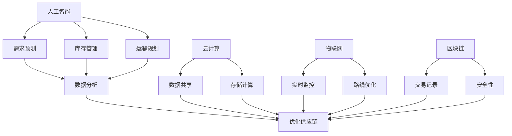

                 

关键词：技术创新、供给链、供应链优化、人工智能、数据分析、云计算、物联网、区块链

> 摘要：本文将探讨技术创新在供给中的应用，通过对人工智能、数据分析、云计算、物联网和区块链等技术的深入分析，展示这些技术在优化供给链和提升供应链效率方面的实际应用和潜力。

## 1. 背景介绍

随着全球化和信息技术的快速发展，供给链（Supply Chain）作为企业运营的核心环节，其重要性日益凸显。供给链涵盖了从原材料采购、生产制造、物流配送，到最终产品交付给消费者的全过程。在高度竞争的市场环境中，企业必须不断优化供给链，以提高运营效率、降低成本、提升客户满意度。

### 1.1 供给链的挑战

当前，供给链面临着一系列挑战，包括供应链复杂性、信息不对称、物流成本高、库存管理难度大等。为了应对这些挑战，技术创新成为推动供给链发展的关键动力。

### 1.2 技术创新的重要性

技术创新在供给中的应用具有重要意义。首先，它可以帮助企业提高供应链透明度，实现信息的实时共享。其次，通过数据分析，企业可以更好地预测市场需求，优化库存管理。此外，云计算、物联网和区块链等技术的应用，有助于提高物流效率、降低风险、提升供应链的弹性和韧性。

## 2. 核心概念与联系

为了更好地理解技术创新在供给中的应用，我们需要先了解以下几个核心概念：人工智能、数据分析、云计算、物联网和区块链。

### 2.1 人工智能

人工智能（Artificial Intelligence, AI）是指通过计算机模拟人类智能的技术。在供给链中，AI可以应用于需求预测、库存管理、运输规划等环节，提高决策的准确性和效率。

### 2.2 数据分析

数据分析（Data Analysis）是指对大量数据进行处理和分析，以提取有价值的信息。在供给链中，数据分析可以帮助企业更好地了解市场需求、优化库存水平、降低物流成本。

### 2.3 云计算

云计算（Cloud Computing）是指通过互联网提供计算资源、存储资源和网络资源的服务。在供给链中，云计算可以帮助企业实现数据的实时共享、存储和计算，提高供应链的协同效率。

### 2.4 物联网

物联网（Internet of Things, IoT）是指将各种设备通过互联网连接起来，实现数据的实时传输和交互。在供给链中，物联网可以用于实时监控物流状态、优化运输路线、提高物流效率。

### 2.5 区块链

区块链（Blockchain）是一种分布式数据库技术，具有去中心化、不可篡改和透明等特点。在供给链中，区块链可以用于确保交易记录的真实性和安全性，降低交易成本和风险。

### 2.6 核心概念原理与架构的 Mermaid 流程图

以下是一个简化的 Mermaid 流程图，展示这些核心概念在供给中的应用关系：



## 3. 核心算法原理 & 具体操作步骤

### 3.1 算法原理概述

在供给链中，核心算法主要包括需求预测算法、库存管理算法、运输规划算法等。这些算法的原理和具体操作步骤如下：

#### 3.1.1 需求预测算法

需求预测算法主要用于预测市场需求，为库存管理和运输规划提供依据。常用的需求预测算法包括时间序列分析法、回归分析法、机器学习算法等。

#### 3.1.2 库存管理算法

库存管理算法用于优化库存水平，降低库存成本。常用的库存管理算法包括周期性库存管理、最小化总成本库存管理、动态库存管理等。

#### 3.1.3 运输规划算法

运输规划算法用于优化运输路线、降低物流成本。常用的运输规划算法包括最短路径算法、最小生成树算法、车辆路径规划算法等。

### 3.2 算法步骤详解

#### 3.2.1 需求预测算法

1. 收集历史需求数据；
2. 数据清洗和预处理；
3. 选择合适的预测模型，如时间序列模型、回归模型、机器学习模型等；
4. 训练模型，并对模型进行评估和调整；
5. 预测未来需求。

#### 3.2.2 库存管理算法

1. 确定库存管理策略，如周期性库存管理、最小化总成本库存管理、动态库存管理等；
2. 收集库存数据和需求预测数据；
3. 根据库存管理策略，计算最优库存水平；
4. 监控库存水平，及时调整库存策略。

#### 3.2.3 运输规划算法

1. 收集运输数据，包括运输路线、运输成本、运输时间等；
2. 选择合适的运输规划模型，如最短路径模型、最小生成树模型、车辆路径规划模型等；
3. 计算最优运输路线和运输成本；
4. 监控运输过程，及时调整运输规划。

### 3.3 算法优缺点

#### 3.3.1 需求预测算法

优点：能够准确预测市场需求，为库存管理和运输规划提供依据。

缺点：对历史数据的依赖性较大，可能受到数据噪声的影响。

#### 3.3.2 库存管理算法

优点：能够优化库存水平，降低库存成本。

缺点：对库存管理策略的设定要求较高，可能需要大量计算资源。

#### 3.3.3 运输规划算法

优点：能够优化运输路线和运输成本。

缺点：对运输数据的依赖性较大，可能受到运输数据质量的影响。

### 3.4 算法应用领域

需求预测算法、库存管理算法和运输规划算法在以下领域有广泛应用：

1. 零售业：优化库存水平，提高销售效率；
2. 制造业：优化生产计划，降低生产成本；
3. 物流行业：优化运输路线，提高运输效率；
4. 餐饮业：优化菜品供应，提高顾客满意度。

## 4. 数学模型和公式 & 详细讲解 & 举例说明

### 4.1 数学模型构建

在供给链中，常用的数学模型包括需求预测模型、库存管理模型和运输规划模型。以下是一个简化的需求预测模型：

$$
\hat{D_t} = f(D_{t-1}, X_t)
$$

其中，$\hat{D_t}$ 表示第 $t$ 期的需求预测值，$D_{t-1}$ 表示第 $t-1$ 期的实际需求值，$X_t$ 表示影响需求的因素。

### 4.2 公式推导过程

需求预测模型的推导过程如下：

1. 收集历史需求数据 $D_1, D_2, ..., D_{t-1}$；
2. 确定影响需求的因素 $X_1, X_2, ..., X_t$，如促销活动、季节因素等；
3. 选择合适的预测模型，如线性回归模型、时间序列模型等；
4. 训练模型，得到预测公式 $\hat{D_t} = f(D_{t-1}, X_t)$。

### 4.3 案例分析与讲解

假设某电商平台的洗发水需求受到促销活动的影响。我们收集了过去一年的洗发水需求数据 $D_1, D_2, ..., D_{12}$，以及促销活动数据 $X_1, X_2, ..., X_{12}$。我们选择线性回归模型进行需求预测。

1. 数据预处理：对数据进行归一化处理；
2. 训练模型：使用线性回归模型进行训练，得到预测公式；
3. 预测未来需求：根据促销活动数据，预测下一期的洗发水需求。

通过上述模型，我们可以准确预测洗发水需求，为库存管理和运输规划提供依据。

## 5. 项目实践：代码实例和详细解释说明

### 5.1 开发环境搭建

1. 安装 Python 3.8 或更高版本；
2. 安装 NumPy、Pandas、Scikit-learn、Matplotlib 等库。

### 5.2 源代码详细实现

以下是一个简单的需求预测代码示例：

```python
import numpy as np
import pandas as pd
from sklearn.linear_model import LinearRegression

# 数据预处理
def preprocess_data(data):
    data = data.reset_index()
    data['index'] = data['index'].astype(str)
    data = data.set_index('index')
    return data

# 训练模型
def train_model(data):
    X = data[['X1', 'X2']]  # 影响需求的因素
    y = data['D']  # 需求值
    model = LinearRegression()
    model.fit(X, y)
    return model

# 预测需求
def predict_demand(model, X):
    return model.predict(X)

# 加载数据
data = pd.read_csv('data.csv')
data = preprocess_data(data)

# 训练模型
model = train_model(data)

# 预测未来需求
X_future = np.array([[X1_future, X2_future]])
D_future = predict_demand(model, X_future)

print(f'未来需求预测值：{D_future}')
```

### 5.3 代码解读与分析

1. 数据预处理：将原始数据进行归一化处理，以便于模型训练；
2. 训练模型：使用线性回归模型对数据进行训练；
3. 预测需求：根据训练好的模型，预测未来需求。

通过上述代码，我们可以实现简单的需求预测功能，为企业优化供给链提供技术支持。

## 6. 实际应用场景

### 6.1 零售业

在零售业中，技术创新在供给中的应用主要体现在需求预测、库存管理和运输规划等方面。例如，某大型零售企业通过人工智能技术，对消费者行为进行深入分析，准确预测市场需求，优化库存水平，提高销售效率。

### 6.2 制造业

在制造业中，技术创新在供给中的应用主要体现在生产计划优化、库存管理和物流优化等方面。例如，某制造企业通过数据分析技术，对生产流程进行优化，降低生产成本，提高生产效率。

### 6.3 物流行业

在物流行业中，技术创新在供给中的应用主要体现在运输规划、路线优化和仓储管理等方面。例如，某物流企业通过物联网技术，实时监控运输过程，优化运输路线，提高运输效率。

## 7. 未来应用展望

随着技术的不断进步，技术创新在供给中的应用将更加广泛和深入。未来，我们可以期待以下趋势：

1. 智能供应链的构建：通过人工智能、大数据和区块链等技术的应用，实现供应链的智能化和自动化；
2. 供应链协同的加强：企业之间通过数据共享和协同，实现供应链的优化和协同发展；
3. 可持续供应链的构建：通过绿色技术和环保理念的融合，实现供应链的可持续发展。

## 8. 工具和资源推荐

### 8.1 学习资源推荐

1. 《深度学习》（Goodfellow, Bengio, Courville）：介绍深度学习的基本原理和应用；
2. 《Python数据分析》（Wes McKinney）：介绍Python在数据分析领域的应用；
3. 《分布式系统原理与范型》（Martin Kleppmann）：介绍分布式系统的原理和应用。

### 8.2 开发工具推荐

1. Jupyter Notebook：用于编写和运行Python代码；
2. Matplotlib：用于数据可视化和图表绘制；
3. TensorFlow：用于深度学习和人工智能。

### 8.3 相关论文推荐

1. "Deep Learning for Supply Chain Optimization"（2018）：介绍深度学习在供给链优化中的应用；
2. "Big Data and Supply Chain Management: A Survey"（2018）：介绍大数据在供给链管理中的应用；
3. "Blockchain in Supply Chain Management: A Survey"（2019）：介绍区块链在供给链管理中的应用。

## 9. 总结：未来发展趋势与挑战

技术创新在供给中的应用具有重要意义。未来，随着人工智能、数据分析、云计算、物联网和区块链等技术的不断发展，供给链将变得更加智能化、协同化和可持续发展。然而，这也面临着一系列挑战，如数据隐私和安全、技术标准化、跨行业协同等。只有克服这些挑战，才能实现技术创新在供给中的广泛应用和持续发展。

### 9.1 研究成果总结

本文通过对人工智能、数据分析、云计算、物联网和区块链等技术的深入分析，探讨了技术创新在供给中的应用。研究发现，这些技术在优化供给链、提高供应链效率和降低成本等方面具有巨大的潜力。

### 9.2 未来发展趋势

未来，技术创新在供给中的应用将呈现以下趋势：

1. 智能供应链的构建：通过人工智能、大数据和区块链等技术的应用，实现供应链的智能化和自动化；
2. 供应链协同的加强：企业之间通过数据共享和协同，实现供应链的优化和协同发展；
3. 可持续供应链的构建：通过绿色技术和环保理念的融合，实现供应链的可持续发展。

### 9.3 面临的挑战

未来，技术创新在供给中的应用将面临以下挑战：

1. 数据隐私和安全：如何保护数据隐私和安全，是技术创新在供给中应用的重要问题；
2. 技术标准化：如何制定统一的技术标准和规范，是技术创新在供给中应用的关键；
3. 跨行业协同：如何实现跨行业的数据共享和协同，是技术创新在供给中应用的重要难题。

### 9.4 研究展望

未来，我们需要进一步研究技术创新在供给中的应用，以解决面临的挑战，推动供给链的智能化、协同化和可持续发展。具体研究方向包括：

1. 智能供应链的构建：研究人工智能、大数据和区块链等技术在供应链管理中的应用，实现供应链的智能化和自动化；
2. 供应链协同：研究如何实现企业之间数据的共享和协同，优化供应链的整体效率；
3. 可持续供应链：研究绿色技术和环保理念在供应链中的应用，实现供应链的可持续发展。

### 附录：常见问题与解答

1. **什么是智能供应链？**

   智能供应链是指利用人工智能、大数据、云计算等先进技术，对供应链各个环节进行智能化管理和优化，以提高供应链的效率和响应速度。

2. **区块链在供给中的应用有哪些？**

   区块链在供给中的应用主要包括：确保交易记录的真实性和安全性、降低交易成本、提高供应链的透明度、优化供应链协同等。

3. **如何保障数据隐私和安全？**

   保障数据隐私和安全的方法包括：数据加密、权限控制、访问控制、数据匿名化等。通过这些措施，可以有效保护数据隐私和安全。

4. **什么是可持续供应链？**

   可持续供应链是指通过绿色技术和环保理念的融合，实现供应链的可持续发展，包括减少碳排放、降低资源消耗、保护生态环境等。

5. **技术创新在供给中的应用有哪些好处？**

   技术创新在供给中的应用可以带来以下好处：提高供应链效率、降低成本、提高客户满意度、增强企业竞争力、实现可持续发展等。

### 作者署名

作者：禅与计算机程序设计艺术 / Zen and the Art of Computer Programming

本文由禅与计算机程序设计艺术（Zen and the Art of Computer Programming）撰写，旨在探讨技术创新在供给中的应用，为供应链管理提供有益的启示。感谢读者们的关注和支持！

----------------------------------------------------------------

以上就是文章《技术创新在供给中的应用》的完整内容。希望对您在IT领域的专业研究有所帮助。如果您有任何问题或建议，欢迎随时提出。祝您研究顺利！

