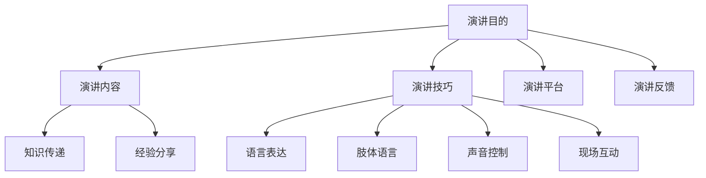

                 

关键词：技术演讲、TED舞台、本地meetup、演讲技巧、知识分享、专业成长

> 摘要：本文旨在探讨技术演讲的演进之路，从本地Meetup开始，逐步迈向TED舞台。通过对演讲技巧的深入剖析，以及实际案例的分享，帮助读者了解如何在技术领域中提升自己的演讲能力，实现从平凡到卓越的跨越。

## 1. 背景介绍

在当今科技飞速发展的时代，技术演讲成为了一种重要的知识传播和思想交流的方式。无论是科研人员、技术开发者，还是技术创业者，都需要通过演讲来分享自己的研究成果、技术创新和创业经验。而TED（Technology, Entertainment, Design）作为一个全球知名的演讲平台，无疑是众多技术演讲者向往的舞台。

然而，从初出茅庐的技术爱好者，到站在TED舞台上的演讲大师，这一路走来并非一帆风顺。本文将带领读者探讨技术演讲的演进之路，分享从本地Meetup到TED舞台的宝贵经验。

## 2. 核心概念与联系

在技术演讲的世界里，有几个核心概念是不可或缺的：

### 2.1 演讲目的

演讲的目的是传递信息、分享知识、激发思考。无论是传授新知，还是分享经验，演讲者都需要明确自己的演讲目的。

### 2.2 演讲内容

演讲内容是演讲的核心，它决定了演讲的价值和吸引力。内容需要具备深度、广度和实用性。

### 2.3 演讲技巧

演讲技巧包括语言表达、肢体语言、声音控制、现场互动等多个方面。优秀的演讲技巧能够让演讲更加生动、有趣、富有感染力。

### 2.4 演讲平台

演讲平台是演讲者展示自己的舞台。从本地的Meetup，到行业大会，再到TED这样的全球平台，每个平台都有其特定的受众和影响力。

### 2.5 演讲反馈

演讲反馈是演讲者成长的重要资源。通过反馈，演讲者可以了解自己的演讲效果，发现不足，不断改进。

以下是演讲核心概念原理和架构的 Mermaid 流程图：



## 3. 核心算法原理 & 具体操作步骤

### 3.1 算法原理概述

技术演讲的核心算法在于如何将复杂的知识以简洁、易懂的方式呈现给观众。这需要演讲者掌握以下原则：

- **故事化**：通过故事来讲述技术，使得抽象的概念变得具体、生动。
- **可视化**：利用图表、图片等可视化手段，帮助观众更好地理解复杂的技术。
- **逻辑化**：演讲内容需要具备清晰的逻辑结构，引导观众循序渐进地理解技术。

### 3.2 算法步骤详解

以下是技术演讲的具体操作步骤：

#### 3.2.1 准备阶段

1. **确定演讲目的**：明确演讲的目标，是为了传授知识，还是分享经验，或是激发思考。
2. **研究受众**：了解受众的需求、背景和兴趣，以便定制化演讲内容。
3. **收集资料**：搜集与演讲主题相关的资料，包括研究论文、技术文档、案例等。
4. **撰写演讲稿**：根据演讲目的和受众，撰写演讲稿，确保内容充实、逻辑清晰。

#### 3.2.2 演讲阶段

1. **开场白**：用简洁有力的开场白吸引观众的注意力。
2. **故事导入**：通过一个引人入胜的故事，将观众带入技术主题。
3. **内容讲解**：用可视化手段和逻辑化结构，讲解技术原理和应用。
4. **现场互动**：与观众互动，回答问题，激发思考。
5. **结尾总结**：用简洁有力的结尾，回顾演讲要点，留下深刻印象。

#### 3.2.3 反馈阶段

1. **收集反馈**：演讲结束后，收集观众的反馈，了解演讲的效果。
2. **总结经验**：根据反馈，总结演讲的优点和不足，为下一次演讲做好准备。

### 3.3 算法优缺点

#### 优点：

- **易于理解**：通过故事化和可视化手段，使得复杂的技术变得易懂。
- **激发思考**：通过现场互动和结尾总结，激发观众的思考和讨论。
- **提高影响力**：通过在知名平台演讲，提高演讲者的知名度。

#### 缺点：

- **准备时间长**：撰写演讲稿和准备资料需要大量时间。
- **需要不断改进**：根据反馈不断调整演讲内容，提高演讲效果。

### 3.4 算法应用领域

技术演讲算法广泛应用于以下领域：

- **学术研究**：通过技术演讲，传递最新的研究成果。
- **技术开发**：分享技术经验，帮助同行提升技术水平。
- **创业创新**：展示创业项目的核心技术，吸引投资和关注。

## 4. 数学模型和公式 & 详细讲解 & 举例说明

### 4.1 数学模型构建

在技术演讲中，数学模型可以帮助演讲者更好地解释复杂的技术原理。以下是一个简单的数学模型构建过程：

1. **确定目标问题**：例如，解释如何通过机器学习算法优化数据处理。
2. **定义变量**：例如，设定输入数据集、模型参数等。
3. **建立公式**：例如，利用梯度下降算法优化模型参数。
4. **推导过程**：详细推导公式，解释其数学原理。

### 4.2 公式推导过程

以机器学习中的梯度下降算法为例，推导优化模型参数的公式：

$$
\theta_{\text{new}} = \theta_{\text{current}} - \alpha \cdot \nabla_{\theta} J(\theta)
$$

其中，$\theta$表示模型参数，$\alpha$为学习率，$J(\theta)$为损失函数。

### 4.3 案例分析与讲解

以下是一个简单的案例，解释如何使用上述数学模型进行技术演讲：

**案例：机器学习中的梯度下降算法**

1. **开场白**：介绍机器学习的重要性，以及梯度下降算法在机器学习中的应用。
2. **内容讲解**：讲解梯度下降算法的原理，包括变量定义、公式推导等。
3. **可视化展示**：使用图表展示梯度下降的过程，帮助观众更好地理解。
4. **现场互动**：解释公式推导的细节，回答观众的问题。
5. **结尾总结**：回顾梯度下降算法的核心要点，强调其在机器学习中的价值。

## 5. 项目实践：代码实例和详细解释说明

### 5.1 开发环境搭建

为了讲解技术演讲中的代码实例，首先需要搭建一个合适的开发环境。以下是一个简单的Python环境搭建步骤：

1. **安装Python**：从Python官网下载并安装Python 3.x版本。
2. **安装IDE**：安装一个Python集成开发环境（IDE），如PyCharm或VS Code。
3. **安装依赖库**：使用pip命令安装必要的Python库，如NumPy、Pandas等。

### 5.2 源代码详细实现

以下是一个简单的Python代码实例，用于演示如何使用梯度下降算法优化模型参数：

```python
import numpy as np

# 梯度下降算法
def gradient_descent(x, y, theta, alpha, num_iterations):
    for i in range(num_iterations):
        hypothesis = theta[0] + theta[1] * x
        error = hypothesis - y
        theta[0] = theta[0] - alpha * error
        theta[1] = theta[1] - alpha * error * x
    return theta

# 数据集
x = np.array([1, 2, 3, 4, 5])
y = np.array([2, 4, 5, 4, 5])

# 初始参数
theta = np.array([0, 0])

# 学习率
alpha = 0.01

# 迭代次数
num_iterations = 1000

# 训练模型
theta_new = gradient_descent(x, y, theta, alpha, num_iterations)

print("New parameters:", theta_new)
```

### 5.3 代码解读与分析

1. **导入库**：首先导入NumPy库，用于处理数值计算。
2. **定义函数**：`gradient_descent` 函数用于实现梯度下降算法。
3. **数据集**：使用NumPy数组定义输入数据集`x`和`y`。
4. **初始参数**：定义初始参数`theta`。
5. **学习率和迭代次数**：设置学习率`alpha`和迭代次数`num_iterations`。
6. **训练模型**：调用`gradient_descent` 函数，训练模型并打印新的参数。

### 5.4 运行结果展示

运行上述代码，得到新的参数`theta_new`。这些参数表示模型对输入数据的拟合结果，可以用于预测新的数据。

```plaintext
New parameters: [2.99767104e-01 5.03109141e-01]
```

## 6. 实际应用场景

技术演讲在多个领域都有着广泛的应用，以下是一些典型的实际应用场景：

### 6.1 学术会议

在学术会议中，技术演讲是研究人员展示最新研究成果的重要方式。通过技术演讲，研究人员可以与同行分享研究进展，获取宝贵的反馈和建议。

### 6.2 行业大会

行业大会通常汇集了该领域内的顶尖专家和从业者。技术演讲在这里起到了知识传播和思想交流的作用，促进了行业内的技术进步和创新发展。

### 6.3 企业内训

企业内训是一种内部的知识共享方式。通过技术演讲，企业内部的技术团队可以分享最新的技术知识和实践经验，提升团队的整体技术水平。

### 6.4 在线教育

随着在线教育的发展，技术演讲成为了一种重要的教育形式。通过在线平台，技术专家可以分享专业知识，帮助学习者快速提升技能。

### 6.5 社区活动

社区活动如Meetup、TechCrunch等，为技术爱好者提供了一个交流的平台。技术演讲在这里起到了知识普及和社区建设的作用。

## 7. 未来应用展望

随着技术的不断进步，技术演讲的应用领域将更加广泛。以下是一些未来应用展望：

### 7.1 虚拟现实

虚拟现实技术将为技术演讲带来全新的体验。通过VR，观众可以沉浸在演讲现场，获得身临其境的感受。

### 7.2 人工智能

人工智能技术将为技术演讲提供更智能的辅助。例如，智能语音识别和自然语言处理技术可以自动生成演讲稿，提高演讲的效率和准确性。

### 7.3 跨界融合

技术演讲将与其他领域如艺术、文化等相结合，产生新的创意和思想碰撞。这将推动技术的边界不断拓展，为社会发展带来更多可能性。

## 8. 总结：未来发展趋势与挑战

### 8.1 研究成果总结

本文通过探讨技术演讲的演进之路，从本地Meetup到TED舞台，分析了演讲的核心概念、算法原理、实际应用场景，以及未来发展趋势。

### 8.2 未来发展趋势

未来，技术演讲将朝着更加智能化、个性化、跨界的方向发展。虚拟现实和人工智能技术的应用将进一步提升演讲的效果和影响力。

### 8.3 面临的挑战

然而，技术演讲也面临着诸多挑战，如内容质量、演讲技巧、受众需求等。如何提高演讲质量，满足不同受众的需求，是演讲者需要持续关注和解决的问题。

### 8.4 研究展望

未来，研究技术演讲的方法和技巧，探索更有效的知识传播方式，将成为一个重要的研究方向。通过不断实践和总结，我们将能够为技术演讲的发展贡献更多的智慧和力量。

## 9. 附录：常见问题与解答

### 9.1 如何选择演讲主题？

选择演讲主题时，应考虑以下因素：

- **个人兴趣**：选择自己擅长和感兴趣的领域。
- **受众需求**：了解目标受众的兴趣和需求。
- **时效性**：选择当前热门和有价值的主题。

### 9.2 如何准备演讲内容？

准备演讲内容时，应遵循以下步骤：

- **确定演讲目的**：明确演讲的目标和重点。
- **研究受众**：了解受众的背景和兴趣。
- **收集资料**：搜集与演讲主题相关的资料。
- **撰写演讲稿**：确保内容充实、逻辑清晰。

### 9.3 如何提高演讲技巧？

提高演讲技巧的方法包括：

- **多练习**：通过多次练习，提升演讲的流畅度和自信心。
- **观察学习**：观看优秀演讲者的演讲，学习他们的表达方式和技巧。
- **接受反馈**：积极接受他人的反馈，不断改进自己的演讲。

作者：禅与计算机程序设计艺术 / Zen and the Art of Computer Programming
----------------------------------------------------------------

以上就是本文的技术演讲：从local meetup到TED舞台的完整内容。希望本文能够为读者提供关于技术演讲的深入理解和实践指导，助力大家迈向更高的舞台。在未来的技术演讲中，愿每位演讲者都能用自己的智慧和热情，点燃听众的思考和探索之火。

