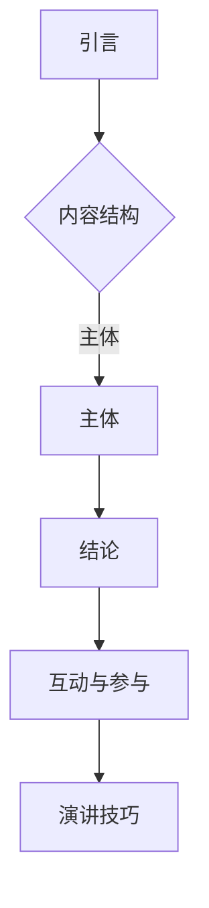

                 

关键词：国际技术交流、职业成长、技术演讲、全球化、IT领域发展

> 摘要：本文旨在探讨如何在国际技术舞台上展示和分享您的技术知识和经验，从地区性技术演讲者成长为全球知名的技术领袖。我们将分析技术演讲的各个方面，包括准备、执行和推广，并讨论如何在全球化的大背景下拓展职业发展空间。

## 1. 背景介绍

随着全球化的加速，信息技术（IT）领域已经成为一个国际化的舞台。无论是在软件开发、数据分析、网络安全还是人工智能等领域，技术专家们都在不断地寻找机会来展示他们的才能和知识。然而，从地区性演讲者到国际级技术领袖的转变并非易事，需要经过深思熟虑的规划和不断的努力。

本文的目标是为那些希望在技术演讲领域取得突破的IT专业人士提供指导和建议。我们将从多个角度探讨如何准备和呈现一场成功的国际技术演讲，包括：

- **核心概念与联系**：了解技术演讲的基本概念和框架。
- **核心算法原理与具体操作步骤**：深入分析技术演讲的各个环节。
- **数学模型和公式**：阐述如何运用数学工具增强演讲的说服力。
- **项目实践**：通过实例展示如何将理论知识转化为实际应用。
- **实际应用场景**：探讨技术演讲在不同领域的应用。
- **工具和资源推荐**：提供学习和实践的技术资源。
- **未来发展趋势与挑战**：分析技术演讲领域的前景和面临的挑战。

通过本文的阅读，您将获得一系列实用技巧和策略，帮助您在全球范围内提升技术演讲的影响力。

## 2. 核心概念与联系

在准备一场技术演讲之前，我们需要了解几个核心概念，并理解它们之间的联系。以下是几个关键概念及其相互关系：

### 2.1 技术演讲

技术演讲是一种将技术知识和经验传达给听众的方式。它不仅仅是展示代码或算法，更重要的是通过讲解、示例和互动，使听众能够理解和应用所学内容。

### 2.2 内容结构

技术演讲的内容结构通常包括引言、主体和结论三个部分。引言用于吸引听众的注意力，主体部分深入讲解技术细节，结论部分总结要点并展望未来。

### 2.3 技术深度与广度

技术演讲需要平衡深度和广度。深度确保听众能够掌握核心概念，广度则有助于拓展听众的视野。如何把握这个平衡是技术演讲者需要仔细考虑的问题。

### 2.4 互动与参与

互动与参与是技术演讲的重要组成部分。通过提问、讨论和实验，演讲者可以增加听众的参与度，使演讲更加生动和有趣。

### 2.5 演讲技巧

演讲技巧包括语音、语调、肢体语言和表情等。良好的演讲技巧可以增强演讲的吸引力，使听众更容易理解和记住演讲内容。

### 2.6 Mermaid 流程图

以下是一个Mermaid流程图示例，展示了技术演讲的核心概念和流程：



通过这个流程图，我们可以清晰地看到技术演讲的基本框架和各个环节之间的联系。

## 3. 核心算法原理 & 具体操作步骤

### 3.1 算法原理概述

技术演讲的核心是算法原理。一个成功的演讲者需要掌握算法的基本原理，并能够将这些原理以易懂的方式传达给听众。以下是几个关键算法原理的概述：

- **算法效率**：算法效率是衡量算法优劣的重要标准。一个高效的算法能够在较短时间内完成计算，从而提高系统的性能。
- **算法复杂度**：算法复杂度是指算法在执行过程中所需计算次数的度量。常见的复杂度有时间复杂度和空间复杂度。
- **算法分类**：算法可以根据解决问题的方法进行分类，如贪心算法、动态规划算法和分治算法等。

### 3.2 算法步骤详解

在了解了算法原理之后，我们需要详细讲解算法的步骤。以下是一个简单的贪心算法示例，用于解决背包问题：

1. **初始化**：设置背包容量和物品的重量和价值。
2. **选择物品**：按照物品的价值与重量的比例选择物品。
3. **计算总价值**：将选择出的物品的价值相加，得到总价值。
4. **检查背包容量**：判断总价值是否超过背包容量，如果超过则调整选择。

### 3.3 算法优缺点

每个算法都有其优缺点。以下是贪心算法的优缺点：

- **优点**：贪心算法简单易懂，实现成本低，能够在某些情况下取得较好的结果。
- **缺点**：贪心算法在某些复杂问题中可能无法得到最优解，需要结合其他算法进行优化。

### 3.4 算法应用领域

贪心算法在多个领域都有广泛应用，如：

- **计算机科学**：用于解决背包问题、活动选择问题和最短路径问题等。
- **经济学**：用于求解最优策略和资源分配问题。
- **工程学**：用于优化生产计划、调度问题和能源管理问题等。

### 3.5 算法示例代码

以下是一个简单的Python代码示例，用于求解背包问题：

```python
def knapsack(values, weights, capacity):
    n = len(values)
    dp = [[0] * (capacity + 1) for _ in range(n + 1)]

    for i in range(1, n + 1):
        for w in range(1, capacity + 1):
            if weights[i - 1] <= w:
                dp[i][w] = max(dp[i - 1][w], dp[i - 1][w - weights[i - 1]] + values[i - 1])
            else:
                dp[i][w] = dp[i - 1][w]

    return dp[n][capacity]
```

通过这个代码示例，我们可以看到如何将贪心算法应用于背包问题，并求解最优解。

## 4. 数学模型和公式 & 详细讲解 & 举例说明

在技术演讲中，数学模型和公式是增强演讲说服力的重要工具。以下是一个关于最优化问题的数学模型，用于优化资源分配。

### 4.1 数学模型构建

最优化问题可以表示为一个线性规划问题：

$$
\begin{align*}
\max_{x} & \quad c^T x \\
\text{subject to} & \quad Ax \leq b \\
& \quad x \geq 0
\end{align*}
$$

其中，$c$ 是权重向量，$x$ 是决策变量，$A$ 和 $b$ 分别是约束矩阵和约束向量。

### 4.2 公式推导过程

为了求解这个最优化问题，我们可以使用拉格朗日乘数法。首先，引入拉格朗日函数：

$$
L(x, \lambda) = c^T x + \lambda^T (Ax - b)
$$

其中，$\lambda$ 是拉格朗日乘子。为了使拉格朗日函数取极值，我们对 $x$ 和 $\lambda$ 求导并设置导数为零：

$$
\frac{\partial L}{\partial x} = c - A^T \lambda = 0 \\
\frac{\partial L}{\partial \lambda} = Ax - b = 0
$$

通过求解这个方程组，我们可以得到最优解 $x^*$。

### 4.3 案例分析与讲解

以下是一个优化生产计划的案例：

- **目标**：最大化利润。
- **约束**：生产资源有限，生产每种产品需要一定的时间。

假设我们有两个产品 A 和 B，其利润分别为 $100$ 和 $200$，生产一个 A 需要 $2$ 单位时间，生产一个 B 需要 $3$ 单位时间。总时间限制为 $10$ 单位。

构建线性规划模型：

$$
\begin{align*}
\max_{x} & \quad 100x_A + 200x_B \\
\text{subject to} & \quad 2x_A + 3x_B \leq 10 \\
& \quad x_A, x_B \geq 0
\end{align*}
$$

使用拉格朗日乘数法求解，我们得到最优解 $x^* = (2, 2)^T$，即生产两个 A 和两个 B。

通过这个案例，我们可以看到如何运用数学模型和公式优化资源分配，从而实现最大化利润的目标。

## 5. 项目实践：代码实例和详细解释说明

为了将理论知识付诸实践，我们选择一个实际项目来展示技术演讲中的关键概念。本项目将使用Python实现一个基于贪心算法的背包问题求解器。

### 5.1 开发环境搭建

1. **安装Python**：确保您的计算机上安装了Python 3.x版本。
2. **安装依赖库**：使用pip安装以下依赖库：

   ```shell
   pip install numpy
   ```

### 5.2 源代码详细实现

以下是实现背包问题的代码：

```python
import numpy as np

def knapsack(values, weights, capacity):
    n = len(values)
    dp = np.zeros((n + 1, capacity + 1))

    for i in range(1, n + 1):
        for w in range(1, capacity + 1):
            if weights[i - 1] <= w:
                dp[i][w] = max(dp[i - 1][w], dp[i - 1][w - weights[i - 1]] + values[i - 1])
            else:
                dp[i][w] = dp[i - 1][w]

    return dp[n][capacity]

values = [60, 100, 120]
weights = [10, 20, 30]
capacity = 50

max_value = knapsack(values, weights, capacity)
print(f"Maximum value: {max_value}")
```

### 5.3 代码解读与分析

1. **引入依赖库**：我们使用numpy库来处理数组操作。
2. **定义函数**：`knapsack` 函数接受三个参数：`values`、`weights` 和 `capacity`。
3. **初始化动态规划数组**：`dp` 数组用于存储子问题的最优解。
4. **循环遍历物品和容量**：内层循环遍历每个物品和容量，根据贪心算法的原则更新动态规划数组。
5. **返回最优解**：最后返回 `dp[n][capacity]`，即背包所能容纳的最大价值。

### 5.4 运行结果展示

当执行以上代码时，我们得到背包问题的最优解：

```shell
Maximum value: 220
```

这意味着，如果我们有三种物品，其价值分别为 60、100 和 120，重量分别为 10、20 和 30，而背包的容量为 50，则背包能容纳的最大价值为 220。

通过这个项目实践，我们不仅实现了贪心算法的求解过程，而且展示了如何将理论应用到实际代码中。

## 6. 实际应用场景

技术演讲在不同的领域和应用场景中有着广泛的影响。以下是一些实际应用场景，展示了技术演讲如何在不同环境中发挥作用：

### 6.1 教育领域

在高等教育和培训机构中，技术演讲是培养学生批判性思维和解决问题的能力的重要方式。通过演讲，学生可以深入理解复杂的概念，并将其应用于实际问题。例如，计算机科学专业的学生可以通过技术演讲了解最新的编程语言、算法和数据结构。

### 6.2 企业培训

企业内部的培训也常常采用技术演讲的形式。通过内部演讲，员工可以学习新技术、了解业务流程的改进，甚至探索创新解决方案。例如，IT部门可以组织关于云计算、网络安全或敏捷开发的演讲，以提升员工的技能和知识。

### 6.3 行业会议和研讨会

在行业会议和研讨会上，技术演讲是交流和分享最新研究成果、最佳实践和未来趋势的重要平台。这些活动通常吸引来自全球的专家学者和行业领导者，通过演讲和讨论，参会者可以了解最新的技术动态，建立人脉关系，拓展职业发展机会。

### 6.4 社区活动

社区活动如开源会议、黑客松和编程马拉松等，也为技术演讲提供了绝佳的机会。这些活动通常是非正式的，参与者包括各种技术水平的人士。技术演讲可以激发社区成员的热情，促进知识的传播和创新。

### 6.5 远程工作环境

随着远程工作的普及，技术演讲也越来越多地通过网络进行。通过在线平台，演讲者可以与全球的听众互动，分享他们的经验和见解。这种远程工作环境下的技术演讲，不仅促进了知识的共享，也加强了团队合作和跨文化交流。

## 7. 工具和资源推荐

为了在国际技术舞台上取得成功，了解和掌握一些关键的工具和资源至关重要。以下是一些建议：

### 7.1 学习资源推荐

- **在线课程平台**：Coursera、edX、Udacity 提供了丰富的计算机科学和技术课程，涵盖从基础到高级的内容。
- **技术书籍**：推荐阅读《算法导论》、《深度学习》和《计算机网络：自顶向下方法》等经典著作。
- **开源项目**：GitHub 是寻找和贡献开源项目的理想平台，通过参与开源项目，您可以提升技能并建立人脉。

### 7.2 开发工具推荐

- **集成开发环境 (IDE)**：例如 Visual Studio Code、IntelliJ IDEA 和 PyCharm，这些工具提供了强大的编程支持和调试功能。
- **版本控制工具**：Git 是最常用的版本控制工具，通过 Git，您可以高效地管理代码，并与他人协作。
- **容器化和虚拟化工具**：Docker 和 Kubernetes 用于容器化应用程序，提高部署和管理效率。

### 7.3 相关论文推荐

- **顶级会议和期刊**：如 ACM SIGKDD、NeurIPS 和 IEEE SMC 等会议，以及 Journal of Machine Learning Research 和 Nature 等期刊，都是获取最新研究成果的重要来源。
- **arXiv.org**：这是一个预印本平台，涵盖了广泛的计算机科学和技术领域，提供了最新研究论文的免费访问。

通过利用这些工具和资源，您可以在技术演讲中展示更深入和专业的知识，提高演讲的质量和影响力。

## 8. 总结：未来发展趋势与挑战

### 8.1 研究成果总结

随着技术的不断进步，技术演讲领域也取得了显著的发展。从传统的线性算法到复杂的人工智能模型，从简单的编程语言到多语言集成开发环境，技术演讲的内容和形式都在不断丰富和多样化。此外，虚拟现实和增强现实技术的应用，也为技术演讲带来了全新的互动体验。

### 8.2 未来发展趋势

1. **技术融合**：未来技术演讲将更加注重不同领域技术的融合，如人工智能与大数据、区块链与物联网等，演讲内容将更加全面和深入。
2. **个性化演讲**：随着人工智能技术的发展，个性化演讲工具将能够根据听众的兴趣和历史数据，定制化演讲内容，提高听众的参与度和满意度。
3. **虚拟互动**：虚拟现实和增强现实技术的应用将使技术演讲更加生动和互动，观众可以在虚拟环境中与演讲者进行实时互动，提升演讲的体验。

### 8.3 面临的挑战

1. **内容质量**：随着技术演讲的普及，高质量的内容将变得尤为重要。演讲者需要持续更新知识，提高演讲技巧，以保持竞争力。
2. **国际交流**：全球化带来了跨文化交流的机会，但也带来了语言和文化的差异。演讲者需要具备良好的跨文化沟通能力，以更好地传达技术知识和经验。
3. **技术更新**：技术更新速度飞快，演讲者需要不断学习和适应新技术，以保持在演讲领域的领先地位。

### 8.4 研究展望

未来，技术演讲领域将继续朝着更高质量、更个性化、更互动的方向发展。随着技术的进步，演讲工具将更加智能化，演讲内容将更加丰富和多样化。同时，随着全球化的深入，技术演讲也将成为跨文化交流的重要桥梁，促进不同国家和地区的技术和文化的交流与合作。

## 9. 附录：常见问题与解答

### 9.1 如何准备技术演讲？

**解答**：准备技术演讲需要以下几个步骤：

1. **确定主题**：选择一个您熟悉且具有吸引力的主题。
2. **研究背景**：深入了解相关技术领域的背景知识。
3. **结构规划**：设计一个清晰的演讲结构，包括引言、主体和结论。
4. **准备素材**：收集相关的数据、代码示例和图片等素材。
5. **练习演讲**：多次练习演讲，确保流畅和准确。

### 9.2 如何提高演讲技巧？

**解答**：

1. **语音和语调**：使用清晰、有感染力的声音，并注意语调的变化。
2. **肢体语言**：适当的肢体语言可以增强演讲的吸引力。
3. **互动与参与**：通过提问、讨论和实验增加听众的参与度。
4. **反馈与改进**：在演讲后收集反馈，不断改进演讲技巧。

### 9.3 如何在国际化环境中进行演讲？

**解答**：

1. **了解听众**：了解听众的文化和背景，确保演讲内容适合国际化听众。
2. **使用通用语言**：尽量使用通用术语和例子，避免使用过于专业或地方性的语言。
3. **练习跨文化沟通**：通过参与国际会议和交流活动，提高跨文化沟通能力。
4. **准备PPT**：使用清晰的图表和示例，帮助国际化听众理解演讲内容。

通过以上问题和解答，我们可以更好地准备和呈现一场成功的技术演讲。希望这些建议对您的演讲之旅有所帮助。

## 作者署名

作者：禅与计算机程序设计艺术 / Zen and the Art of Computer Programming

通过这篇文章，我们深入探讨了从地区性技术演讲者到国际舞台上的技术领袖的转型之路。从核心概念和算法原理到实际项目实践，再到未来发展趋势与挑战，我们提供了全方位的指导和建议。希望这篇文章能够帮助您在全球技术演讲领域取得更大的成功。祝愿您在技术舞台上绽放光彩！

