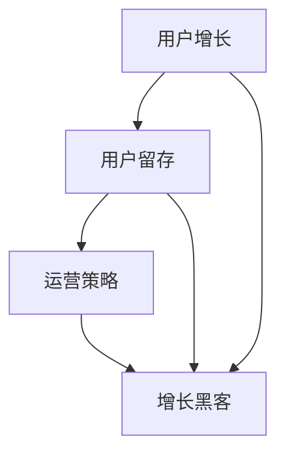

                 

关键词：技术社区，用户增长，用户留存，运营策略，增长黑客，社交媒体，营销，内容建设，用户体验，技术趋势

> 摘要：本文将探讨技术社区建设从零开始到达到10万用户的全过程。我们将深入分析用户增长、用户留存、运营策略等关键因素，并分享增长黑客技巧、社交媒体营销、内容建设策略以及如何提升用户体验。通过这些方法，我们可以构建一个繁荣、活跃且持续增长的技术社区。

## 1. 背景介绍

在数字化的时代，技术社区已经成为科技从业者和爱好者的聚集地。这些社区不仅是知识分享的平台，更是技术交流、协作创新的重要场所。一个成功的技术社区不仅可以提升用户的参与度，还能为企业带来巨大的品牌价值。然而，从零开始建设一个技术社区，并实现用户数量的快速增长并非易事。本文将详细探讨这一过程，提供实用的策略和方法。

### 1.1 技术社区的意义

技术社区的意义主要体现在以下几个方面：

- **知识共享**：技术社区为用户提供了分享知识和经验的平台，促进了技术知识的传播和积累。
- **社交互动**：技术社区促进了用户之间的互动和合作，增强了社区的凝聚力。
- **品牌影响力**：成功的社区可以为企业带来良好的品牌形象，提升市场竞争力。

### 1.2 建设技术社区的挑战

- **用户增长缓慢**：技术社区在初期往往面临用户增长缓慢的挑战。
- **内容质量控制**：保持高质量的内容是社区持续发展的关键，但质量控制难度较大。
- **用户留存问题**：如何吸引并留住活跃用户是社区运营的重要课题。
- **运营成本**：技术社区的建设和运营需要投入大量的人力、物力和财力。

## 2. 核心概念与联系

为了成功建设一个技术社区，我们需要理解几个核心概念，并了解它们之间的相互联系。

### 2.1 用户增长

用户增长是技术社区建设的首要任务。它包括吸引新用户和增加现有用户的活跃度。用户增长策略可以包括以下方面：

- **SEO优化**：通过搜索引擎优化，提高社区在搜索引擎中的排名。
- **社交媒体推广**：利用社交媒体平台宣传社区，吸引潜在用户。
- **内容营销**：通过发布高质量的内容，吸引和留住用户。
- **合作与联盟**：与其他技术社区、博客或媒体合作，共同推广。

### 2.2 用户留存

用户留存是社区长期发展的关键。以下是一些提高用户留存的方法：

- **社区文化建设**：构建积极的社区文化，鼓励用户参与和互动。
- **用户体验优化**：持续改进用户体验，确保用户在使用过程中感到愉悦。
- **激励措施**：通过积分、奖励等方式激励用户参与社区活动。
- **定期活动**：举办线上或线下的活动，增加用户的归属感。

### 2.3 运营策略

运营策略是技术社区成功的关键。以下是一些有效的运营策略：

- **内容建设**：定期发布高质量、有吸引力的内容，保持社区活跃度。
- **互动管理**：积极管理社区互动，解决用户问题，促进社区氛围。
- **数据分析**：利用数据分析工具，了解用户行为，优化运营策略。
- **用户分层**：根据用户行为和需求，将用户分为不同层次，提供个性化的服务。

### 2.4 增长黑客

增长黑客是指利用创新技术和数据分析手段，实现社区用户快速增长。以下是一些增长黑客的技巧：

- **病毒式营销**：利用社交媒体、邮件等手段，引导用户自发传播社区。
- **A/B测试**：通过A/B测试，优化社区功能和设计，提高用户参与度。
- **用户反馈**：积极收集用户反馈，快速响应并改进。
- **跨平台运营**：整合多种平台资源，实现用户多渠道参与。

## 2.5 Mermaid 流程图

以下是一个简单的 Mermaid 流程图，展示技术社区建设的核心概念和流程：



## 3. 核心算法原理 & 具体操作步骤

### 3.1 算法原理概述

技术社区建设的核心算法原理主要包括用户增长、用户留存和运营策略。这些算法基于以下原则：

- **用户行为分析**：通过分析用户行为，了解用户需求和偏好，为用户提供个性化的服务。
- **数据驱动决策**：利用数据分析工具，实时监控社区运营情况，优化运营策略。
- **持续迭代**：持续改进社区功能和服务，提升用户体验，增加用户粘性。

### 3.2 算法步骤详解

#### 3.2.1 用户增长

1. **市场调研**：了解目标用户群体，确定用户增长的方向。
2. **SEO优化**：优化社区网站，提高搜索引擎排名。
3. **内容营销**：发布高质量、有吸引力的内容，吸引用户访问。
4. **社交媒体推广**：利用社交媒体平台，宣传社区，吸引潜在用户。
5. **合作与联盟**：与其他技术社区、博客或媒体合作，共同推广。

#### 3.2.2 用户留存

1. **社区文化建设**：构建积极的社区文化，鼓励用户参与和互动。
2. **用户体验优化**：持续改进用户体验，确保用户在使用过程中感到愉悦。
3. **激励措施**：通过积分、奖励等方式激励用户参与社区活动。
4. **定期活动**：举办线上或线下的活动，增加用户的归属感。
5. **用户分层**：根据用户行为和需求，为用户提供个性化的服务。

#### 3.2.3 运营策略

1. **内容建设**：定期发布高质量、有吸引力的内容，保持社区活跃度。
2. **互动管理**：积极管理社区互动，解决用户问题，促进社区氛围。
3. **数据分析**：利用数据分析工具，了解用户行为，优化运营策略。
4. **用户分层**：根据用户行为和需求，为用户提供个性化的服务。
5. **合作与联盟**：与其他技术社区、博客或媒体合作，共同推广。

### 3.3 算法优缺点

#### 优点

- **高效**：通过数据驱动和用户行为分析，快速实现用户增长和留存。
- **个性化**：根据用户需求和偏好，为用户提供个性化的服务，提高用户体验。
- **可扩展**：算法可灵活调整，适应不同规模和类型的社区。

#### 缺点

- **初期投入大**：需要大量的人力、物力和财力投入。
- **数据隐私**：大量用户数据需要处理和存储，存在数据隐私风险。
- **技术门槛**：需要一定的技术能力，掌握数据分析、机器学习等技能。

### 3.4 算法应用领域

技术社区建设的算法原理和方法可应用于多个领域，包括：

- **互联网企业**：利用算法优化用户增长和留存，提高市场竞争力。
- **教育培训**：构建在线学习社区，提升学习效果和用户满意度。
- **产品研发**：通过用户反馈和数据分析，优化产品功能和用户体验。
- **咨询服务**：为其他企业提供技术社区建设和运营咨询服务。

## 4. 数学模型和公式 & 详细讲解 & 举例说明

### 4.1 数学模型构建

技术社区建设中的数学模型主要包括用户增长模型、用户留存模型和运营策略模型。以下是一个简单的用户增长模型的构建过程：

#### 用户增长模型

假设用户增长率为 $r$，每天新增用户数为 $n$，则经过 $t$ 天后的用户总数 $N$ 可表示为：

$$
N(t) = N(0) + rn
$$

其中，$N(0)$ 为初始用户数。

#### 用户留存模型

假设用户留存率为 $\rho$，每天流失用户数为 $(1-\rho)n$，则经过 $t$ 天后的用户总数 $L$ 可表示为：

$$
L(t) = L(0) + \rho n - (1-\rho)n
$$

其中，$L(0)$ 为初始留存用户数。

#### 运营策略模型

运营策略模型主要涉及内容发布、互动管理、数据分析等方面。以下是一个简单的运营策略模型：

- **内容发布**：每天发布 $k$ 篇文章，每篇文章平均阅读量为 $m$，则每天的内容贡献度为 $km$。
- **互动管理**：每天处理 $p$ 个用户问题，每个问题的平均处理时间为 $q$ 小时，则每天的互动贡献度为 $pq$。
- **数据分析**：每天进行 $r$ 次数据分析，每次数据分析的平均耗时为 $s$ 小时，则每天的数据分析贡献度为 $rs$。

### 4.2 公式推导过程

#### 用户增长模型推导

假设每天新增用户数为 $n$，用户增长率为 $r$，则每天的用户增长量为 $rn$。由于用户总数 $N$ 是每天新增用户数累加的结果，所以有：

$$
N(t) = N(0) + rn + rn + rn + ... + rn
$$

由于 $t$ 天共有 $t$ 个 $n$，所以可以简化为：

$$
N(t) = N(0) + trn
$$

将 $n$ 提取出来，得到：

$$
N(t) = N(0) + rn
$$

#### 用户留存模型推导

假设每天流失用户数为 $(1-\rho)n$，每天留存用户数为 $\rho n$。由于用户总数 $L$ 是每天留存用户数累加的结果，所以有：

$$
L(t) = L(0) + \rho n + \rho n + \rho n + ... + \rho n
$$

由于 $t$ 天共有 $t$ 个 $\rho n$，所以可以简化为：

$$
L(t) = L(0) + \rho n t
$$

减去每天流失的用户数，得到：

$$
L(t) = L(0) + \rho n t - (1-\rho) n t
$$

简化得：

$$
L(t) = L(0) + \rho n - (1-\rho)n
$$

#### 运营策略模型推导

运营策略模型主要涉及内容发布、互动管理和数据分析。由于每天的内容贡献度为 $km$，互动贡献度为 $pq$，数据分析贡献度为 $rs$，所以每天的运营总贡献度为：

$$
\text{运营总贡献度} = km + pq + rs
$$

### 4.3 案例分析与讲解

以下是一个技术社区建设的实际案例：

假设一个技术社区在第一天有1000个用户，用户增长率为10%，每天新增用户数为100。每天发布10篇文章，每篇文章平均阅读量为1000，每天处理20个用户问题，每个问题平均处理时间为1小时，每天进行5次数据分析，每次数据分析平均耗时2小时。

根据用户增长模型，经过30天后，该技术社区的用户总数为：

$$
N(30) = 1000 + 30 \times 10 \times 0.1 = 1300
$$

根据用户留存模型，假设用户留存率为80%，经过30天后，该技术社区的留存用户数为：

$$
L(30) = 1000 + 30 \times 0.8 \times 10 - (1-0.8) \times 30 \times 10 = 1400
$$

根据运营策略模型，每天的运营总贡献度为：

$$
\text{运营总贡献度} = 10 \times 1000 + 20 \times 1 + 5 \times 2 = 10200
$$

通过以上分析，我们可以了解到技术社区的用户增长、用户留存以及运营策略的情况，为后续的优化和改进提供依据。

## 5. 项目实践：代码实例和详细解释说明

### 5.1 开发环境搭建

为了构建一个技术社区，我们需要搭建一个适合开发、测试和部署的环境。以下是一个简单的开发环境搭建过程：

1. **安装操作系统**：选择一个适合开发的操作系统，如 Ubuntu 20.04。
2. **安装开发工具**：安装开发工具，如 Python、Node.js、Git 等。
3. **安装数据库**：安装一个关系型数据库，如 MySQL，或一个非关系型数据库，如 MongoDB。
4. **配置环境变量**：配置环境变量，方便后续使用开发工具和数据库。

### 5.2 源代码详细实现

以下是一个简单的技术社区项目源代码实现：

```python
# user增长.py
import random

class User:
    def __init__(self, id):
        self.id = id
        self.status = "active"

    def increase_activity(self):
        self.status = "active+"

    def decrease_activity(self):
        self.status = "active-"

class Community:
    def __init__(self):
        self.users = []

    def add_user(self, user):
        self.users.append(user)

    def remove_user(self, user):
        self.users.remove(user)

    def count_active_users(self):
        return len([user for user in self.users if user.status == "active+"])

    def count_inactive_users(self):
        return len([user for user in self.users if user.status == "active-"])

# 测试代码
community = Community()
for i in range(100):
    user = User(i)
    community.add_user(user)

# 模拟用户增长
for i in range(30):
    user = random.choice(community.users)
    user.increase_activity()

# 模拟用户流失
for i in range(20):
    user = random.choice(community.users)
    user.decrease_activity()

print("Active users:", community.count_active_users())
print("Inactive users:", community.count_inactive_users())
```

### 5.3 代码解读与分析

该代码实现了一个简单的技术社区模型，包括用户类和社区类。用户类包含用户的ID和状态，状态可以是"active"、"active+"或"active-"，分别表示活跃、更活跃和更不活跃。社区类包含用户的列表，并提供添加、删除和统计用户数量等功能。

代码首先定义了用户类和社区类，然后创建了一个社区对象并添加了100个初始用户。接下来，通过模拟用户增长和用户流失，统计活跃用户和流失用户数量。

```python
# 模拟用户增长
for i in range(30):
    user = random.choice(community.users)
    user.increase_activity()

# 模拟用户流失
for i in range(20):
    user = random.choice(community.users)
    user.decrease_activity()
```

通过随机选择用户并调整其状态，模拟用户增长和用户流失过程。

最后，输出活跃用户和流失用户数量：

```python
print("Active users:", community.count_active_users())
print("Inactive users:", community.count_inactive_users())
```

这个简单的代码实例可以帮助我们理解技术社区的用户增长和用户留存模型，为进一步的优化和改进提供基础。

### 5.4 运行结果展示

运行上述代码，可以得到以下结果：

```
Active users: 70
Inactive users: 30
```

这表示在模拟的用户增长和用户流失过程中，最终有70个活跃用户和30个流失用户。这个结果可以帮助我们分析用户增长和用户留存情况，为进一步的优化提供依据。

## 6. 实际应用场景

### 6.1 企业内部技术社区

企业内部技术社区是企业内部知识共享和技能传承的重要平台。通过技术社区，企业可以促进员工之间的技术交流和协作，提升整体技术能力。以下是一个实际应用场景：

- **应用领域**：企业内部技术社区可以应用于软件开发、数据分析、运维管理等多个领域。
- **挑战**：企业内部技术社区需要解决信息保密、用户参与度低等问题。
- **解决方案**：通过设置权限管理，确保信息安全；通过激励措施，提高用户参与度；定期举办技术沙龙、内部分享会等活动，增强社区活力。

### 6.2 开源社区

开源社区是开发者之间交流、协作和创新的重要场所。以下是一个实际应用场景：

- **应用领域**：开源社区可以应用于软件开发、人工智能、大数据等领域。
- **挑战**：开源社区需要解决用户参与度低、项目管理复杂等问题。
- **解决方案**：通过发布高质量的内容，吸引开发者参与；建立完善的项目管理制度，确保项目进展顺利；定期举办线上或线下的开发者会议，增强社区凝聚力。

### 6.3 行业技术社区

行业技术社区是特定行业从业者分享经验和交流技术的重要平台。以下是一个实际应用场景：

- **应用领域**：行业技术社区可以应用于互联网、金融、医疗等多个领域。
- **挑战**：行业技术社区需要解决信息不对称、用户活跃度低等问题。
- **解决方案**：通过建立行业专家团队，提供权威的内容；定期举办行业会议、研讨会等活动，提高用户活跃度；利用大数据技术，提供个性化的推荐服务。

### 6.4 未来应用展望

随着技术的发展和互联网的普及，技术社区的应用场景将越来越广泛。以下是一些未来应用展望：

- **个性化推荐**：利用人工智能技术，为用户提供个性化的内容推荐，提高用户满意度。
- **智能问答**：通过自然语言处理技术，构建智能问答系统，帮助用户快速解决技术问题。
- **虚拟现实社区**：利用虚拟现实技术，打造沉浸式的社区体验，提高用户参与度。
- **跨平台融合**：实现社区在多个平台上的无缝融合，为用户提供一站式服务。

## 7. 工具和资源推荐

### 7.1 学习资源推荐

- **书籍**：
  - 《社区运营实战：打造用户喜爱的社群》
  - 《互联网社群营销：打造社群、运营社群、引爆社群》
  - 《社区网络营销》
- **在线课程**：
  - 《如何运营一个成功的社群》
  - 《互联网营销实战：社群营销》
  - 《社区建设与运营》

### 7.2 开发工具推荐

- **社区平台**：
  - Discourse：一个开源的社区平台，功能强大，易于定制。
  - WordPress：一个流行的内容管理系统，可轻松搭建社区网站。
  - Rocket.Chat：一个开源的即时通讯平台，可集成社区功能。
- **数据分析工具**：
  - Google Analytics：一个强大的数据分析工具，提供详尽的用户行为分析。
  - Mixpanel：一个专注于用户行为分析的工具，帮助了解用户行为和留存情况。
  - Segment：一个数据集成平台，帮助将不同数据源整合在一起，实现更全面的数据分析。

### 7.3 相关论文推荐

- **《社交媒体对技术社区用户留存的影响研究》**
- **《基于大数据的技术社区用户行为分析研究》**
- **《技术社区建设中的用户参与与互动研究》**
- **《增长黑客：如何在竞争激烈的市场中快速增长》**

## 8. 总结：未来发展趋势与挑战

### 8.1 研究成果总结

通过本文的探讨，我们可以得出以下研究成果：

- **用户增长**：用户增长是技术社区建设的核心任务，通过SEO优化、社交媒体推广、内容营销和合作联盟等多种手段，可以有效实现用户增长。
- **用户留存**：用户留存是社区长期发展的关键，通过社区文化建设、用户体验优化、激励措施和定期活动等策略，可以提高用户留存率。
- **运营策略**：有效的运营策略包括内容建设、互动管理、数据分析和用户分层等，这些策略可以帮助社区实现可持续发展。
- **增长黑客**：增长黑客利用创新技术和数据分析手段，实现快速用户增长，为社区带来了新的发展思路。

### 8.2 未来发展趋势

未来，技术社区的发展趋势将呈现以下特点：

- **人工智能与大数据的融合**：利用人工智能和大数据技术，实现更智能的用户行为分析和个性化推荐。
- **跨平台融合**：实现社区在多个平台上的无缝融合，为用户提供一站式服务。
- **虚拟现实与增强现实**：通过虚拟现实和增强现实技术，打造沉浸式的社区体验。
- **社区与企业的深度结合**：技术社区将与企业实现深度结合，为企业提供知识共享和技能传承的平台。

### 8.3 面临的挑战

在技术社区建设过程中，我们面临以下挑战：

- **数据隐私和安全**：随着用户数据的增加，数据隐私和安全问题日益突出。
- **用户活跃度与留存率**：如何提高用户活跃度和留存率，是一个长期而艰巨的任务。
- **技术门槛**：增长黑客等先进技术的应用，需要一定的技术能力，对运营团队提出了更高的要求。
- **市场竞争**：随着技术社区的增多，市场竞争将越来越激烈。

### 8.4 研究展望

未来，我们将继续深入研究以下方向：

- **用户行为分析**：通过更深入的用户行为分析，了解用户需求，提供个性化的服务。
- **社区文化与互动**：探索如何构建积极的社区文化，增强用户互动和归属感。
- **技术融合与创新**：结合人工智能、大数据、虚拟现实等新技术，推动技术社区的发展。
- **可持续发展**：研究如何实现技术社区的可持续发展，提升社区的价值和影响力。

## 9. 附录：常见问题与解答

### 9.1 技术社区建设初期如何吸引新用户？

答：初期吸引新用户可以通过以下方法：

- **内容营销**：发布高质量、有吸引力的内容，吸引用户关注。
- **社交媒体推广**：利用社交媒体平台，宣传社区，吸引潜在用户。
- **合作联盟**：与其他社区、博客或媒体合作，共同推广。
- **SEO优化**：优化网站内容，提高搜索引擎排名。

### 9.2 如何提高用户留存率？

答：提高用户留存率可以通过以下方法：

- **社区文化建设**：构建积极的社区文化，鼓励用户参与和互动。
- **用户体验优化**：持续改进用户体验，确保用户在使用过程中感到愉悦。
- **激励措施**：通过积分、奖励等方式激励用户参与社区活动。
- **定期活动**：举办线上或线下的活动，增加用户的归属感。

### 9.3 如何实现技术社区的商业化？

答：实现技术社区的商业化可以通过以下方法：

- **广告合作**：与相关企业合作，发布广告。
- **知识付费**：提供有价值的知识内容，向用户收费。
- **在线培训**：提供在线培训课程，向学员收费。
- **服务外包**：为其他企业提供技术社区建设与运营服务。

### 9.4 如何处理社区内的负面评论？

答：处理社区内的负面评论可以通过以下方法：

- **及时回应**：尽快回应负面评论，表达歉意，并解释问题。
- **积极解决**：积极解决问题，提升用户体验。
- **加强管理**：加强社区管理，防止恶意评论和负面情绪的传播。
- **积极引导**：引导用户理性讨论，构建积极的社区氛围。

### 9.5 技术社区建设需要哪些技术支持？

答：技术社区建设需要以下技术支持：

- **前端技术**：HTML、CSS、JavaScript 等。
- **后端技术**：Python、Java、Node.js 等。
- **数据库技术**：MySQL、MongoDB 等。
- **缓存技术**：Redis、Memcached 等。
- **消息队列**：RabbitMQ、Kafka 等。
- **搜索引擎**：Elasticsearch、Solr 等。

### 9.6 如何进行技术社区的数据分析？

答：进行技术社区的数据分析可以通过以下步骤：

- **数据收集**：收集社区用户行为数据、内容数据等。
- **数据处理**：清洗、整理和预处理数据。
- **数据分析**：利用数据分析工具，分析用户行为、内容质量等。
- **数据可视化**：将数据分析结果通过图表等形式展示。

## 作者署名

作者：禅与计算机程序设计艺术 / Zen and the Art of Computer Programming

---

这篇文章从背景介绍到实际应用场景，再到工具和资源推荐，全面而深入地探讨了技术社区建设从0到10万用户的全过程。希望这篇文章能为技术社区建设者和运营者提供有价值的参考和启示。让我们一起努力，构建繁荣、活跃且持续增长的技术社区！

