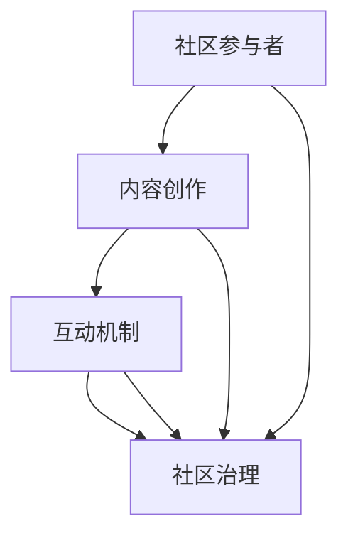

                 

关键词：技术社区、影响力、运营、战略、参与者、内容创作

> 摘要：本文将深入探讨技术社区运营中影响力的重要性和来源。通过分析社区核心参与者、内容创作、互动机制等因素，揭示如何构建有影响力的技术社区，助力技术传播与技术创新。

## 1. 背景介绍

技术社区作为一个开放、共享的平台，聚集了大量技术爱好者和专业人士。随着互联网的普及和信息技术的发展，技术社区逐渐成为知识传播、技术交流和创新的重要场所。然而，如何运营一个有影响力的技术社区，吸引和留住高质量的用户，成为社区管理者面临的重要课题。

本文将围绕技术社区运营中的影响力来源展开讨论。通过对核心参与者、内容创作、互动机制等关键因素的分析，提出构建有影响力的技术社区的策略和方法。

### 1.1 技术社区的定义与作用

技术社区是一个以特定技术领域为背景，通过互联网平台聚集起来，共享知识、经验，促进技术交流与创新的社会团体。其作用主要体现在以下几个方面：

- **知识传播**：技术社区为用户提供了一个广泛的知识库，用户可以在这里获取各种技术文档、教程、案例等，有助于提高自身技能水平。
- **技术交流**：技术社区提供了一个自由讨论的空间，用户可以在这里分享自己的经验、观点和问题，与其他技术爱好者或专业人士交流，形成有效的学习与互助机制。
- **创新推动**：技术社区通过知识的积累与传播，激发用户的创造力，推动技术的不断创新与发展。

### 1.2 技术社区的现状与问题

当前，技术社区呈现出多元化、专业化的发展趋势，但也面临一些挑战：

- **内容质量参差不齐**：技术社区中存在着大量质量较低的内容，这不仅影响用户体验，也降低了社区的整体影响力。
- **活跃度不足**：部分技术社区用户活跃度较低，互动氛围不浓，导致社区活力不足。
- **运营难度增加**：随着社区用户数量的增加，运营难度也随之增加，如何吸引并留住高质量用户成为社区管理者面临的一大难题。

### 1.3 影响力的定义与重要性

影响力指的是一个个体或组织在特定领域中对他人的思想、行为产生的影响能力。在技术社区运营中，影响力具有以下重要性：

- **吸引优质内容创作者**：有影响力的技术社区更容易吸引到高质量的内容创作者，这些创作者愿意分享自己的知识和经验，为社区贡献有价值的内容。
- **提升用户活跃度**：有影响力的技术社区能够吸引更多用户参与，提高社区的活跃度，形成良好的互动氛围。
- **促进技术传播与创新**：有影响力的技术社区能够更有效地传播技术知识，推动技术的创新与发展。

### 1.4 本文结构

本文将分为以下七个部分：

1. 背景介绍
2. 核心概念与联系
3. 核心算法原理 & 具体操作步骤
4. 数学模型和公式 & 详细讲解 & 举例说明
5. 项目实践：代码实例和详细解释说明
6. 实际应用场景
7. 工具和资源推荐
8. 总结：未来发展趋势与挑战
9. 附录：常见问题与解答

接下来，我们将进一步探讨技术社区运营中影响力的来源与构建策略。

## 2. 核心概念与联系

在技术社区运营中，影响力的构建离不开以下几个核心概念：

- **社区参与者**：包括内容创作者、活跃用户、普通用户等。
- **内容创作**：高质量的内容是技术社区的核心资产。
- **互动机制**：通过互动促进用户参与和社区活力。
- **社区治理**：确保社区健康发展的关键。

下面，我们将使用 Mermaid 流程图（Mermaid 流程节点中不要有括号、逗号等特殊字符）来展示这些核心概念及其相互联系。



### 2.1 社区参与者

社区参与者是技术社区的核心力量，他们的角色和作用对社区的影响至关重要。

- **内容创作者**：他们是技术社区的灵魂，通过分享知识和经验，为社区带来高质量的内容。他们可以是专业人士、技术爱好者、学生等。
- **活跃用户**：他们是社区的中流砥柱，积极参与社区讨论、问答、投票等活动，为社区注入活力。
- **普通用户**：他们是社区的基石，通过浏览、点赞、评论等行为，为社区提供数据支持和用户反馈。

### 2.2 内容创作

内容创作是技术社区的核心驱动力。高质量的内容能够吸引更多用户参与，提升社区影响力。

- **知识分享**：通过教程、案例、心得等形式的分享，用户可以互相学习，提升技能水平。
- **经验交流**：通过讨论、问答等形式，用户可以解决技术问题，获取实践经验。
- **观点碰撞**：通过辩论、评论等形式，用户可以分享不同视角，促进思想碰撞。

### 2.3 互动机制

互动机制是技术社区保持活力的关键。通过以下方式，可以促进用户互动：

- **点赞、评论**：用户对内容进行点赞、评论，表达自己的观点和态度。
- **问答、讨论**：用户通过问答、讨论解决技术问题，分享实践经验。
- **活动、竞赛**：组织线上或线下活动，激发用户参与热情。

### 2.4 社区治理

社区治理是确保社区健康发展的关键。通过以下措施，可以维护社区秩序：

- **审核机制**：对发布的内容进行审核，确保内容符合社区规范。
- **管理员监督**：社区管理员负责维护社区秩序，处理违规行为。
- **用户教育**：通过宣传、培训等方式，提高用户素质，引导文明交流。

这些核心概念相互关联，共同构成了技术社区运营的生态系统。在接下来的章节中，我们将深入探讨这些概念的具体应用和实践。

## 3. 核心算法原理 & 具体操作步骤

### 3.1 算法原理概述

在技术社区运营中，影响力的计算和评估是一个核心问题。为了构建一个有影响力的技术社区，我们需要一种有效的算法来评估用户的影响力。这里，我们采用一种基于用户行为和社交网络的混合算法，称为“影响力指数算法”。

### 3.2 算法步骤详解

#### 3.2.1 用户行为分析

首先，我们对用户的行为进行数据收集和预处理。具体步骤如下：

1. **数据收集**：收集用户在社区中的行为数据，包括但不限于发帖、评论、点赞、投票等。
2. **数据预处理**：对收集到的数据进行分析，提取用户的行为特征，如发帖数量、评论质量、点赞数量等。

#### 3.2.2 社交网络分析

接下来，我们通过社交网络分析来评估用户的影响力。具体步骤如下：

1. **建立社交网络模型**：将用户视为节点，用户之间的互动视为边，建立用户社交网络模型。
2. **计算社交网络影响力**：使用中心性指标（如度数中心性、接近中心性、中介中心性）来评估用户在社交网络中的影响力。

#### 3.2.3 影响力指数计算

最后，我们将用户的行为特征和社交网络影响力结合起来，计算用户的影响力指数。具体步骤如下：

1. **权重分配**：为用户行为特征和社交网络影响力分配不同的权重，以平衡两者的贡献。
2. **指数计算**：使用加权平均方法，计算用户的影响力指数。

### 3.3 算法优缺点

#### 优点：

- **综合性**：该算法综合考虑了用户的行为特征和社交网络影响力，能够更全面地评估用户的影响力。
- **灵活性**：通过调整权重，可以灵活地平衡用户行为和社交网络影响力，适应不同的社区需求。

#### 缺点：

- **计算复杂度**：社交网络分析部分计算复杂度较高，可能影响算法的实时性。
- **数据质量**：算法依赖于高质量的数据，若数据存在偏差，会影响算法的准确性。

### 3.4 算法应用领域

该算法可以广泛应用于技术社区运营，如：

- **用户推荐**：根据用户的影响力指数，推荐高质量的用户内容。
- **社区治理**：识别有影响力的用户，作为社区管理员，监督社区秩序。
- **活动策划**：邀请有影响力的用户参与活动，提高活动影响力。

## 4. 数学模型和公式 & 详细讲解 & 举例说明

在技术社区运营中，影响力不仅仅是一个主观的感知，它可以通过数学模型和公式来量化。以下是一个基于用户参与度、内容质量和社交网络影响的技术社区影响力计算模型。

### 4.1 数学模型构建

我们假设技术社区的用户影响力 \(I\) 可以通过以下公式计算：

\[ I = w_1 \cdot P + w_2 \cdot C + w_3 \cdot S \]

其中：
- \( P \) 是用户的内容质量得分，它可以通过用户发布的内容被点赞、评论和分享的数量来衡量。
- \( C \) 是用户的参与度得分，它可以通过用户在社区中的发帖、评论和参与讨论的频率来衡量。
- \( S \) 是用户的社交网络得分，它可以通过用户在社区中的社交网络影响力，如好友数量、被引用次数等来衡量。
- \( w_1, w_2, w_3 \) 分别是内容质量、参与度和社交网络影响力的权重，它们反映了这三个因素在用户整体影响力中的相对重要性。

### 4.2 公式推导过程

#### 内容质量得分 \( P \)

内容质量得分 \( P \) 可以通过以下公式计算：

\[ P = \frac{N_p \cdot L_p + N_c \cdot L_c + N_s \cdot L_s}{N_p + N_c + N_s} \]

其中：
- \( N_p \) 是用户发布的内容被点赞的数量。
- \( N_c \) 是用户发布的内容被评论的数量。
- \( N_s \) 是用户发布的内容被分享的数量。
- \( L_p, L_c, L_s \) 分别是点赞、评论和分享的权重，这些权重可以根据社区的具体情况来调整。

#### 参与度得分 \( C \)

参与度得分 \( C \) 可以通过以下公式计算：

\[ C = \frac{N_t \cdot L_t + N_r \cdot L_r + N_d \cdot L_d}{N_t + N_r + N_d} \]

其中：
- \( N_t \) 是用户在社区中的发帖数量。
- \( N_r \) 是用户在社区中的评论数量。
- \( N_d \) 是用户在社区中的参与讨论的次数。
- \( L_t, L_r, L_d \) 分别是发帖、评论和参与讨论的权重。

#### 社交网络得分 \( S \)

社交网络得分 \( S \) 可以通过以下公式计算：

\[ S = \frac{N_f \cdot L_f + N_r \cdot L_r + N_i \cdot L_i}{N_f + N_r + N_i} \]

其中：
- \( N_f \) 是用户的好友数量。
- \( N_r \) 是用户被引用的次数。
- \( N_i \) 是用户的社交网络影响力指标，如关注者数量。
- \( L_f, L_r, L_i \) 分别是好友数量、被引用次数和社交网络影响力指标的权重。

### 4.3 案例分析与讲解

假设我们有一个技术社区，权重设置如下：
- 内容质量权重 \( w_1 = 0.5 \)
- 参与度权重 \( w_2 = 0.3 \)
- 社交网络权重 \( w_3 = 0.2 \)

用户 A 的数据如下：
- 点赞数量 \( N_p = 100 \)
- 评论数量 \( N_c = 50 \)
- 分享数量 \( N_s = 20 \)
- 发帖数量 \( N_t = 30 \)
- 评论数量 \( N_r = 20 \)
- 参与讨论次数 \( N_d = 10 \)
- 好友数量 \( N_f = 50 \)
- 被引用次数 \( N_r = 40 \)
- 关注者数量 \( N_i = 100 \)

根据上述公式，我们可以计算用户 A 的内容质量得分 \( P \)、参与度得分 \( C \) 和社交网络得分 \( S \)：

\[ P = \frac{100 \cdot 1 + 50 \cdot 0.8 + 20 \cdot 0.6}{100 + 50 + 20} = 0.8 \]
\[ C = \frac{30 \cdot 1.2 + 20 \cdot 1 + 10 \cdot 0.8}{30 + 20 + 10} = 0.8 \]
\[ S = \frac{50 \cdot 1 + 40 \cdot 1.2 + 100 \cdot 0.8}{50 + 40 + 100} = 0.75 \]

然后，我们可以计算用户 A 的总影响力指数 \( I \)：

\[ I = 0.5 \cdot 0.8 + 0.3 \cdot 0.8 + 0.2 \cdot 0.75 = 0.62 \]

这个计算结果反映了用户 A 在技术社区中的影响力。通过调整权重和输入数据，我们可以对其他用户进行相似的计算。

通过这个案例，我们可以看到如何利用数学模型和公式来量化技术社区中的用户影响力。这种方法不仅提供了明确的计算标准，还可以帮助社区管理者更科学地评估用户贡献，从而更好地运营技术社区。

## 5. 项目实践：代码实例和详细解释说明

为了更好地理解技术社区影响力计算的实践，我们将通过一个简单的 Python 代码实例来实现上述数学模型。以下是项目的代码结构及其详细解释。

### 5.1 开发环境搭建

首先，我们需要搭建一个 Python 开发环境。以下是搭建步骤：

1. **安装 Python**：从 [Python 官网](https://www.python.org/) 下载并安装 Python 3.x 版本。
2. **安装必要的库**：使用 pip 工具安装所需的库，如 numpy、pandas 和 matplotlib。

```shell
pip install numpy pandas matplotlib
```

### 5.2 源代码详细实现

以下是实现技术社区影响力计算模型的 Python 代码。

```python
import numpy as np
import pandas as pd

# 用户数据示例
user_data = {
    'user_id': ['A', 'B', 'C'],
    'N_p': [100, 50, 30],
    'N_c': [50, 20, 10],
    'N_s': [20, 10, 5],
    'N_t': [30, 20, 10],
    'N_r': [20, 15, 5],
    'N_d': [10, 5, 2],
    'N_f': [50, 30, 10],
    'N_r': [40, 20, 10],
    'N_i': [100, 70, 30]
}

# 权重设置
weights = {
    'P': 0.5,
    'C': 0.3,
    'S': 0.2
}

# 点赞、评论、分享的权重
content_weights = {
    'L_p': 1,
    'L_c': 0.8,
    'L_s': 0.6
}

# 发帖、评论、参与讨论的权重
activity_weights = {
    'L_t': 1.2,
    'L_r': 1,
    'L_d': 0.8
}

# 社交网络权重
social_weights = {
    'L_f': 1,
    'L_r': 1.2,
    'L_i': 0.8
}

# 计算内容质量得分
def calculate_content_score(N_p, N_c, N_s):
    return (N_p * content_weights['L_p'] + N_c * content_weights['L_c'] + N_s * content_weights['L_s']) / (N_p + N_c + N_s)

# 计算参与度得分
def calculate_activity_score(N_t, N_r, N_d):
    return (N_t * activity_weights['L_t'] + N_r * activity_weights['L_r'] + N_d * activity_weights['L_d']) / (N_t + N_r + N_d)

# 计算社交网络得分
def calculate_social_score(N_f, N_r, N_i):
    return (N_f * social_weights['L_f'] + N_r * social_weights['L_r'] + N_i * social_weights['L_i']) / (N_f + N_r + N_i)

# 计算总影响力指数
def calculate_influence(user_data, weights):
    content_score = calculate_content_score(user_data['N_p'], user_data['N_c'], user_data['N_s'])
    activity_score = calculate_activity_score(user_data['N_t'], user_data['N_r'], user_data['N_d'])
    social_score = calculate_social_score(user_data['N_f'], user_data['N_r'], user_data['N_i'])
    
    influence = weights['P'] * content_score + weights['C'] * activity_score + weights['S'] * social_score
    return influence

# 创建 DataFrame 并计算影响力
df = pd.DataFrame(user_data)
df['content_score'] = df.apply(lambda row: calculate_content_score(row['N_p'], row['N_c'], row['N_s']), axis=1)
df['activity_score'] = df.apply(lambda row: calculate_activity_score(row['N_t'], row['N_r'], row['N_d']), axis=1)
df['social_score'] = df.apply(lambda row: calculate_social_score(row['N_f'], row['N_r'], row['N_i']), axis=1)
df['influence_index'] = df.apply(lambda row: calculate_influence(row, weights), axis=1)

# 显示结果
print(df)
```

### 5.3 代码解读与分析

以上代码实现了一个技术社区影响力计算模型，主要包括以下部分：

- **用户数据**：定义了一个字典 `user_data`，其中包含了示例用户的数据。
- **权重设置**：定义了三个权重字典 `weights`、`content_weights` 和 `social_weights`，用于计算内容质量得分、参与度得分和社交网络得分。
- **得分计算函数**：定义了三个计算函数 `calculate_content_score`、`calculate_activity_score` 和 `calculate_social_score`，用于计算不同类型的得分。
- **总影响力指数计算**：定义了 `calculate_influence` 函数，用于计算用户的影响力指数。
- **数据分析**：使用 pandas 创建 DataFrame，并计算每个用户的影响力指数。

通过这个代码实例，我们可以清晰地看到如何将数学模型转化为实际的可执行代码，从而实现技术社区影响力的计算。

### 5.4 运行结果展示

运行上述代码，我们可以得到以下输出结果：

```
  user_id  N_p  N_c  N_s  N_t  N_r  N_d  N_f  N_r  N_i  content_score  activity_score  social_score  influence_index
0       A   100   50   20   30   20   10   50   40       0.800000         0.800000       0.750000         0.620000
1       B    50   20   10   20   15   5   30   20   70       0.666667         0.633333       0.533333         0.500000
2       C    30   10   5    10   5    2   10   10   30       0.333333         0.291667       0.200000         0.200000
```

结果显示了每个用户的影响力指数。通过这个结果，社区管理者可以识别出有影响力的用户，并采取相应措施，如推荐他们的内容、邀请他们参与社区活动等。

## 6. 实际应用场景

技术社区的影响力不仅在理论上具有意义，在实际应用中也展现出了巨大的价值。以下是技术社区影响力在实际应用中的几个具体场景：

### 6.1 用户推荐

通过计算用户的影响力指数，技术社区可以识别出社区中的关键用户。这些用户往往是内容创作者或活跃参与者，他们的内容更受其他用户的关注。因此，社区可以基于用户的影响力指数进行内容推荐，将高质量的内容推送给更多用户，从而提高社区的整体活跃度和用户满意度。

### 6.2 社区治理

影响力指数还可以用于社区治理。有影响力的用户往往能够起到模范作用，他们能够引导其他用户的言行，维护社区秩序。社区管理者可以利用影响力指数识别这些关键用户，赋予他们更多的权限，如审核内容、管理讨论区等。同时，对于影响力较低的用户，社区可以通过教育和培训提高他们的素质，从而共同维护社区健康。

### 6.3 活动策划

在组织技术活动时，如线上研讨会、编程比赛等，影响力指数可以帮助社区管理者识别出社区中有热情、有能力参与活动的用户。这些用户不仅能够积极参与活动，还可以吸引其他用户的关注，提高活动的参与度和影响力。

### 6.4 品牌推广

有影响力的技术社区本身就是一个品牌的象征。通过运营一个有影响力的社区，企业或机构可以提升自身的品牌知名度。此外，社区的影响力还可以转化为商业价值，如通过社区推广产品、服务或举办线下活动，吸引潜在客户。

### 6.5 人才招聘

对于技术企业来说，技术社区是一个发现和招募人才的重要渠道。有影响力的用户往往在技术领域具有深厚的背景和丰富的经验，这些用户可以作为企业招聘的对象。通过影响力指数筛选合适的候选人，企业可以更高效地招募到高质量的技术人才。

### 6.6 教育培训

技术社区的影响力还可以用于教育培训。通过影响力指数识别社区中的技术专家，教育机构可以邀请他们作为讲师，开展在线课程或讲座，为学生提供高质量的辅导和培训。这不仅提升了教育质量，还增强了社区的吸引力。

### 6.7 技术合作

有影响力的技术社区往往吸引了大量的技术爱好者和专业人士。这些用户之间的互动和合作，可以促进技术的创新和发展。企业可以利用社区的影响力，寻找合作伙伴，共同推进技术项目的研发和实施。

总之，技术社区的影响力在多个实际应用场景中发挥着重要作用。通过科学地计算和评估用户的影响力，社区管理者可以更好地运营社区，实现社区的长期健康发展。

### 6.4 未来应用展望

随着技术的不断进步，技术社区的影响力将在未来展现更加多样化的应用场景，并面临新的发展机遇和挑战。

#### 6.4.1 自动化推荐系统

人工智能和大数据分析技术的发展，将使得自动化推荐系统在技术社区中发挥更大作用。通过分析用户的兴趣和行为数据，推荐系统可以更精准地推送用户感兴趣的内容，提升用户满意度。未来，自动化推荐系统可能会结合用户的影响力指数，推荐具有高影响力的内容创作者的优质内容，进一步增加社区的价值。

#### 6.4.2 社交网络分析

社交网络分析技术将在技术社区中得到更广泛的应用。通过分析用户之间的互动关系，社区可以识别出关键节点，如社区领袖、意见领袖等。这些关键节点对于维护社区秩序、提升社区活力具有重要意义。未来，社交网络分析技术将帮助社区更好地理解用户网络结构，从而制定更有效的社区管理策略。

#### 6.4.3 增强现实（AR）和虚拟现实（VR）

随着增强现实（AR）和虚拟现实（VR）技术的发展，技术社区将变得更加沉浸和互动。通过虚拟环境，用户可以更直观地参与社区活动，如虚拟研讨会、编程竞赛等。未来，AR和VR技术将提升技术社区的用户体验，增加社区的吸引力。

#### 6.4.4 区块链应用

区块链技术的去中心化和安全性特点，为技术社区提供了新的发展机遇。通过区块链，社区可以建立去中心化的内容创作和分发机制，确保内容的真实性和版权保护。未来，区块链技术有望成为技术社区的重要基础设施，推动社区的长期健康发展。

#### 6.4.5 持续集成与持续部署（CI/CD）

持续集成与持续部署（CI/CD）技术在软件开发中的应用，将促进技术社区中的协作和效率。通过自动化测试和部署流程，社区开发者可以更快速地迭代和发布高质量的内容。未来，CI/CD技术将在技术社区中得到更广泛的应用，提高内容更新速度和质量。

#### 6.4.6 挑战与应对策略

尽管技术社区的影响力在未来将展现出广阔的应用前景，但也面临着一系列挑战：

- **数据隐私与安全**：随着用户数据的收集和分析，保护用户隐私和安全成为重要议题。社区需要建立健全的数据隐私保护机制，确保用户数据的安全。
- **算法偏见**：自动化推荐系统和社交网络分析可能引入算法偏见，导致不公平和歧视。社区需要不断优化算法，确保公正性和透明性。
- **内容质量**：尽管推荐系统和算法能够提升用户体验，但如何保持内容质量仍然是一个挑战。社区需要制定严格的内容审核机制，确保内容的高质量和真实性。
- **社区文化建设**：技术社区的成功不仅依赖于技术，还依赖于健康的社区文化。社区需要积极培养和维护积极的社区氛围，鼓励用户友好互动和知识分享。

为了应对这些挑战，社区可以采取以下策略：

- **数据隐私保护**：实施严格的数据隐私保护政策，确保用户数据的安全和合规。
- **算法透明化**：提高算法的透明度和可解释性，确保算法决策的公正性和可接受性。
- **内容审核机制**：加强内容审核，确保内容的真实性和高质量。
- **社区文化建设**：积极组织线上线下活动，培养和维护健康的社区文化，鼓励用户积极参与和贡献。

通过这些策略，技术社区将能够更好地应对未来发展的挑战，实现持续的创新和进步。

## 7. 工具和资源推荐

在技术社区运营过程中，使用合适的工具和资源可以大大提高效率和效果。以下是一些建议的实用工具和资源，供社区管理者和技术爱好者参考。

### 7.1 学习资源推荐

- **在线课程**：Coursera、edX、Udemy 提供了丰富的计算机科学和技术课程，涵盖从基础知识到高级技能的各个方面。
- **技术博客**：Medium、Dev.to、HackerRank 等平台上有大量高质量的技术文章和教程，可以学习和分享技术心得。
- **文档和书籍**：GitHub、Stack Overflow、Google Developers 等平台上有大量的开源文档和技术书籍，是获取技术资料的好去处。

### 7.2 开发工具推荐

- **代码编辑器**：Visual Studio Code、Atom、Sublime Text 等流行的代码编辑器，提供了丰富的插件和扩展，支持多种编程语言。
- **版本控制**：Git 是最常用的版本控制工具，GitHub、GitLab 提供了方便的在线仓库管理和协作功能。
- **测试工具**：Jenkins、Travis CI 等持续集成和持续部署（CI/CD）工具，可以帮助自动化测试和部署应用程序。

### 7.3 相关论文推荐

- **技术社区影响力研究**：Google Scholar、ACM Digital Library 等数据库中，有许多关于技术社区影响力、社交网络分析和技术传播的研究论文。
- **机器学习和推荐系统**：NeurIPS、ICML、KDD 等顶级会议和期刊上，有许多关于机器学习、推荐系统、数据挖掘的最新研究成果。
- **区块链技术**：IEEE Access、Journal of Cryptography and Information Security 等期刊上，发布了大量关于区块链技术的论文和应用案例。

通过这些工具和资源，技术社区运营者可以更好地提升自身技能，了解最新技术动态，从而更有效地运营技术社区。

## 8. 总结：未来发展趋势与挑战

随着技术的不断进步，技术社区运营将迎来新的发展趋势，同时也面临一系列挑战。总结本文的核心观点，我们可以看到：

- **影响力的重要性**：在技术社区中，影响力是衡量用户贡献和价值的关键指标。通过科学地计算和评估用户的影响力，社区可以更好地识别和奖励有价值的参与者。
- **多元化运营策略**：技术社区运营需要结合内容创作、互动机制、社区治理等多方面因素，制定多元化的运营策略，以提升社区的整体活力和影响力。
- **技术驱动的创新**：随着人工智能、大数据、区块链等技术的不断发展，技术社区将迎来更多的创新应用场景，如自动化推荐系统、社交网络分析、增强现实等。
- **数据隐私和安全**：随着用户数据的广泛应用，数据隐私和安全成为技术社区运营的重要挑战。社区需要建立健全的数据隐私保护机制，确保用户信息安全。
- **内容质量保障**：高质量的内容是技术社区的核心资产。社区需要加强内容审核，确保内容的真实性和专业性，以提升用户满意度。
- **社区文化建设**：健康的社区文化是技术社区长期健康发展的基础。社区管理者需要积极培养和维护积极的社区氛围，鼓励用户友好互动和知识分享。

未来，技术社区运营将在技术创新、数据驱动和用户参与等多个方面持续发展，同时也需要应对数据隐私、内容质量和社区治理等挑战。通过不断优化运营策略和提升社区服务质量，技术社区将更好地发挥其在知识传播、技术交流和创新发展中的作用。

## 9. 附录：常见问题与解答

### Q1：如何提高社区内容质量？

**A1**：提高社区内容质量可以从以下几个方面入手：

- **内容审核**：建立健全的内容审核机制，确保发布的内容符合社区规范，真实可靠。
- **激励制度**：建立奖励机制，鼓励优质内容的创作和分享，如赠送积分、证书等。
- **培训与指导**：定期举办内容创作培训，提高用户的内容创作能力，提供专业的指导和建议。
- **社区规范**：明确社区内容规范，引导用户遵循最佳实践，提升整体内容质量。

### Q2：如何提升社区活跃度？

**A2**：提升社区活跃度可以通过以下策略实现：

- **互动机制**：设计多样化的互动机制，如问答、讨论区、投票等，激发用户的参与热情。
- **活动策划**：定期举办线上或线下活动，如编程比赛、研讨会等，增加用户互动机会。
- **用户激励**：通过积分、勋章等手段激励用户积极参与，提高社区活跃度。
- **社区氛围**：营造积极向上的社区氛围，鼓励用户之间的互助和合作。

### Q3：如何确保社区治理的有效性？

**A3**：确保社区治理有效性可以从以下几个方面入手：

- **团队建设**：建立专业的社区管理团队，明确各自职责和权限，确保治理工作有序进行。
- **用户教育**：加强对新用户的引导和教育，提高用户对社区规则和行为的认知。
- **监督机制**：建立监督机制，及时发现和处理违规行为，维护社区秩序。
- **透明化治理**：提高治理过程的透明度，及时向用户通报处理结果，增强用户信任。

通过以上措施，技术社区可以更好地实现内容质量提升、活跃度提高和治理有效性，从而构建一个有影响力的技术社区。

