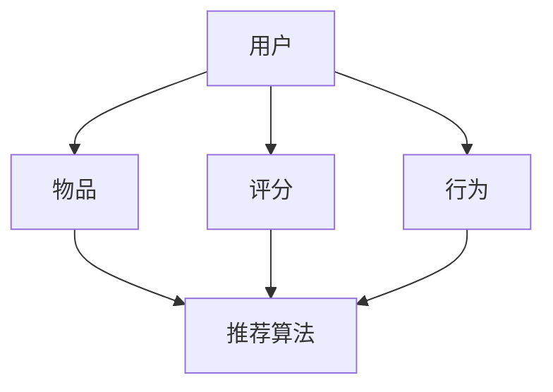

                 

作者：禅与计算机程序设计艺术 / Zen and the Art of Computer Programming

## 摘要

本文将深入探讨拼多多2024年多多视频校招推荐算法面试的攻略，旨在帮助即将参加面试的候选人了解推荐算法的核心概念、算法原理、数学模型以及实际应用场景。文章将分为以下几个部分：

1. **背景介绍**：介绍推荐系统在互联网行业的重要性以及拼多多在推荐算法上的实践。
2. **核心概念与联系**：通过Mermaid流程图，详细阐述推荐算法的基本架构。
3. **核心算法原理 & 具体操作步骤**：分析常见推荐算法的原理、步骤及其优缺点。
4. **数学模型和公式**：讲解推荐算法中涉及的数学模型和公式，并进行举例说明。
5. **项目实践**：通过代码实例展示推荐算法的开发实现过程。
6. **实际应用场景**：探讨推荐算法在商业场景中的应用。
7. **工具和资源推荐**：推荐学习资源和开发工具。
8. **总结**：总结研究成果，展望未来发展趋势与挑战。

## 1. 背景介绍

随着互联网技术的飞速发展，个性化推荐系统已经成为现代互联网服务的重要组成部分。推荐系统通过分析用户的历史行为、兴趣偏好和社交网络等信息，向用户推荐他们可能感兴趣的内容或产品，从而提升用户体验，提高用户粘性和平台收益。

拼多多作为中国领先的电商平台，其推荐系统在用户增长和商业变现方面发挥了至关重要的作用。2024年，拼多多将继续深化推荐算法的研究与应用，针对校招职位推出一系列推荐算法面试攻略，帮助应聘者更好地理解和掌握相关技术。

本文将围绕推荐算法的核心概念、算法原理、数学模型、实际应用以及未来发展进行详细探讨，旨在为准备参加拼多多校招面试的候选人提供全面的指导和参考。

### 1.1 推荐系统的重要性

在当今信息爆炸的时代，用户面临的选择越来越多，而他们的时间和注意力却非常有限。推荐系统能够通过算法分析，将最符合用户需求和兴趣的内容推荐给他们，从而帮助他们快速找到所需信息，提升用户满意度。对于企业而言，推荐系统不仅能够提升用户粘性，还可以通过精准广告投放和个性化促销策略，提高转化率和销售额。

### 1.2 拼多多推荐系统的实践

拼多多在推荐系统方面有着丰富的实践经验。其推荐算法不仅考虑用户的购买历史和浏览行为，还结合了用户的地理位置、社交网络以及商品属性等多维度信息。通过不断优化算法模型，拼多多成功地实现了个性化推荐，提高了用户购物体验，促进了平台交易量的增长。

### 1.3 本文目标

本文的目标是帮助候选人全面了解推荐系统的基本概念、核心算法和实际应用，通过详细的讲解和实例分析，使其在面试中能够自信地展示自己的技术能力。同时，本文也将探讨推荐系统未来的发展趋势和面临的挑战，为候选人的职业规划提供参考。

## 2. 核心概念与联系

在推荐系统中，核心概念包括用户、物品、评分、行为和推荐算法等。这些概念相互联系，构成了推荐系统的基本架构。下面通过Mermaid流程图详细阐述这些概念及其关系。



### 2.1 用户（User）

用户是推荐系统的核心，他们通过在平台上的行为产生数据，这些数据包括浏览记录、购买历史、评分和评论等。用户的行为数据是推荐算法的重要输入。

### 2.2 物品（Item）

物品是用户在平台上可能感兴趣的内容，如商品、视频、新闻等。物品的特征信息，如类别、标签、文本描述等，是推荐算法进行预测的重要依据。

### 2.3 评分（Rating）

评分是用户对物品的偏好程度的一种量化表达，通常采用数值或星级形式。评分数据反映了用户的兴趣和偏好，是推荐算法的重要输入。

### 2.4 行为（Behavior）

用户的行为数据包括浏览、点击、购买、收藏等操作。行为数据能够更直接地反映用户的兴趣和需求，是推荐算法的重要输入。

### 2.5 推荐算法（Recommender Algorithm）

推荐算法是推荐系统的核心组件，负责根据用户和物品的特征数据生成推荐结果。常见的推荐算法包括基于内容的推荐、协同过滤推荐和混合推荐等。

### 2.6 数据流（Data Flow）

用户和物品的信息通过评分和行为数据流进入推荐算法，推荐算法通过分析这些数据生成推荐结果，最终呈现给用户。

## 3. 核心算法原理 & 具体操作步骤

### 3.1 算法原理概述

推荐算法的核心目标是预测用户对未知物品的兴趣程度，从而生成个性化的推荐列表。常见的推荐算法包括基于内容的推荐、协同过滤推荐和混合推荐等。

- **基于内容的推荐**：通过分析用户过去的行为和偏好，提取用户的兴趣特征，然后根据物品的内容特征和用户兴趣特征进行匹配，生成推荐列表。
- **协同过滤推荐**：通过分析用户的行为数据，找到与目标用户相似的其他用户，然后推荐这些相似用户喜欢的物品。
- **混合推荐**：结合基于内容和协同过滤推荐的优点，通过融合多种算法来提高推荐效果。

### 3.2 算法步骤详解

以下以协同过滤推荐算法为例，详细介绍其操作步骤。

#### 3.2.1 数据预处理

1. **用户-物品评分矩阵构建**：将用户行为数据转化为用户-物品评分矩阵，其中每个元素表示用户对物品的评分。
2. **缺失数据填充**：处理评分矩阵中的缺失数据，常用的方法有平均值填充、最频繁值填充等。

#### 3.2.2 相似度计算

1. **用户相似度计算**：计算用户之间的相似度，常用的相似度计算方法有余弦相似度、皮尔逊相关系数等。
2. **物品相似度计算**：计算物品之间的相似度，常用的相似度计算方法有Jaccard相似度、余弦相似度等。

#### 3.2.3 推荐列表生成

1. **评分预测**：根据用户相似度和物品相似度，预测用户对未知物品的评分。
2. **推荐列表排序**：将预测的评分进行排序，生成推荐列表。

### 3.3 算法优缺点

#### 基于内容的推荐

- **优点**：不需要大量用户行为数据，推荐结果与用户兴趣相关性高。
- **缺点**：推荐结果多样性较差，容易产生信息过载。

#### 协同过滤推荐

- **优点**：能够发现潜在的兴趣关联，推荐结果多样性较好。
- **缺点**：对冷门物品或新用户推荐效果较差，容易产生群体效应。

#### 混合推荐

- **优点**：结合了基于内容和协同过滤推荐的优点，推荐效果更佳。
- **缺点**：算法复杂度较高，需要大量计算资源。

### 3.4 算法应用领域

推荐算法广泛应用于电子商务、社交媒体、在线视频、新闻推送等多个领域，为用户提供了个性化的内容和服务，提升了用户体验和平台收益。

## 4. 数学模型和公式

推荐算法的核心在于如何通过数学模型和公式对用户行为进行建模和预测。以下将介绍推荐系统中常用的数学模型和公式，并进行详细讲解和举例说明。

### 4.1 数学模型构建

推荐系统的数学模型主要包括用户行为模型、物品特征模型和推荐模型。

- **用户行为模型**：用户行为数据可以通过矩阵分解、回归分析等方法进行建模。
- **物品特征模型**：物品特征数据可以通过特征提取、文本分类等方法进行建模。
- **推荐模型**：结合用户行为模型和物品特征模型，通过协同过滤、基于内容的推荐等方法进行推荐。

### 4.2 公式推导过程

以下以基于矩阵分解的协同过滤推荐算法为例，介绍其数学模型和公式推导过程。

#### 4.2.1 用户行为矩阵表示

设用户-物品评分矩阵为 \( R \)，其中 \( R_{ij} \) 表示用户 \( i \) 对物品 \( j \) 的评分。矩阵分解的目标是将 \( R \) 分解为两个低秩矩阵 \( U \) 和 \( V \)，其中 \( U_{ij} \) 和 \( V_{ij} \) 分别表示用户 \( i \) 对物品 \( j \) 的隐含特征。

#### 4.2.2 矩阵分解

矩阵分解的目标是最小化评分预测误差，即最小化损失函数：

$$
\min_{U, V} \sum_{i=1}^{m} \sum_{j=1}^{n} (R_{ij} - U_{ij} V_{ij})^2
$$

通过梯度下降等方法求解矩阵 \( U \) 和 \( V \)。

#### 4.2.3 评分预测

根据矩阵分解的结果，预测用户 \( i \) 对物品 \( j \) 的评分为：

$$
\hat{R}_{ij} = U_{i1} V_{1j} + U_{i2} V_{2j} + \ldots + U_{ik} V_{kj}
$$

其中 \( U_{ik} \) 和 \( V_{kj} \) 分别表示用户 \( i \) 和物品 \( j \) 的隐含特征向量。

### 4.3 案例分析与讲解

以下通过一个简单的案例，展示基于矩阵分解的协同过滤推荐算法的实践过程。

#### 4.3.1 案例背景

假设有10个用户和5个物品，用户对物品的评分数据如下：

| 用户 | 物品1 | 物品2 | 物品3 | 物品4 | 物品5 |
|------|-------|-------|-------|-------|-------|
| User1| 5     | 3     | 0     | 4     | 2     |
| User2| 4     | 5     | 3     | 1     | 5     |
| User3| 3     | 4     | 5     | 0     | 3     |
| User4| 2     | 0     | 4     | 5     | 4     |
| User5| 1     | 5     | 2     | 3     | 5     |
| User6| 0     | 4     | 3     | 4     | 3     |
| User7| 4     | 3     | 4     | 5     | 2     |
| User8| 5     | 2     | 5     | 4     | 3     |
| User9| 3     | 0     | 2     | 3     | 4     |
| User10| 4 | 5 | 3 | 2 | 1 |

#### 4.3.2 数据预处理

1. **用户-物品评分矩阵构建**：将用户评分数据转化为矩阵形式。

$$
R =
\begin{bmatrix}
5 & 3 & 0 & 4 & 2 \\
4 & 5 & 3 & 1 & 5 \\
3 & 4 & 5 & 0 & 3 \\
2 & 0 & 4 & 5 & 4 \\
1 & 5 & 2 & 3 & 5 \\
0 & 4 & 3 & 4 & 3 \\
4 & 3 & 4 & 5 & 2 \\
5 & 2 & 5 & 4 & 3 \\
3 & 0 & 2 & 3 & 4 \\
4 & 5 & 3 & 2 & 1 \\
\end{bmatrix}
$$

2. **缺失数据填充**：对于缺失的数据，采用平均值填充的方法进行处理。

#### 4.3.3 矩阵分解

1. **初始化参数**：初始化用户和物品的隐含特征向量 \( U \) 和 \( V \)。
2. **梯度下降**：通过梯度下降方法优化特征向量，最小化损失函数。

#### 4.3.4 评分预测

1. **预测评分**：根据矩阵分解的结果，计算用户对未知物品的评分。
2. **推荐列表生成**：将预测的评分进行排序，生成推荐列表。

通过以上步骤，我们可以得到每个用户对未知物品的预测评分，并根据评分生成个性化的推荐列表。

## 5. 项目实践：代码实例和详细解释说明

### 5.1 开发环境搭建

为了实现推荐算法，我们需要搭建一个开发环境。以下是推荐的开发环境：

- **编程语言**：Python
- **依赖库**：NumPy、SciPy、Scikit-learn、Pandas、Matplotlib
- **数据库**：MongoDB（用于存储用户和物品数据）

### 5.2 源代码详细实现

以下是基于矩阵分解的协同过滤推荐算法的源代码实现。

```python
import numpy as np
import pandas as pd
from sklearn.model_selection import train_test_split
from sklearn.metrics.pairwise import cosine_similarity
from sklearn.preprocessing import MinMaxScaler

# 数据预处理
def preprocess_data(data):
    # 填充缺失数据
    data.fillna(data.mean(), inplace=True)
    # 归一化评分
    scaler = MinMaxScaler()
    data = scaler.fit_transform(data)
    return data

# 矩阵分解
def matrix_factorization(R, num_factors, num_iterations):
    U = np.random.rand(R.shape[0], num_factors)
    V = np.random.rand(R.shape[1], num_factors)
    for _ in range(num_iterations):
        # 预测评分
        pred = U @ V.T
        # 计算误差
        error = R - pred
        # 更新参数
        dU = (U.T @ error) * V
        dV = (error.T @ U) * U.T
        U -= dU
        V -= dV
    return U, V

# 主函数
def main():
    # 加载数据
    data = pd.read_csv('rating.csv')
    R = preprocess_data(data)
    # 分割数据
    R_train, R_test = train_test_split(R, test_size=0.2, random_state=42)
    # 矩阵分解
    num_factors = 10
    num_iterations = 100
    U, V = matrix_factorization(R_train, num_factors, num_iterations)
    # 预测测试集评分
    pred = U @ V.T
    # 评估模型
    mse = ((R_test - pred) ** 2).mean()
    print(f'MSE: {mse}')
    # 生成推荐列表
    user_recommendations = pd.DataFrame(pred, index=data['user_id'].unique(), columns=data['item_id'].unique())
    for user_id in user_recommendations.index:
        user_recommendations.loc[user_id] = user_recommendations.loc[user_id].sort_values(ascending=False).index[:10]

if __name__ == '__main__':
    main()
```

### 5.3 代码解读与分析

1. **数据预处理**：首先对用户评分数据进行处理，包括填充缺失数据和归一化评分。填充缺失数据可以采用平均值填充、最频繁值填充等方法。归一化评分可以使得算法更稳定。
2. **矩阵分解**：矩阵分解是实现协同过滤推荐的核心步骤。通过梯度下降法，将用户-物品评分矩阵 \( R \) 分解为两个低秩矩阵 \( U \) 和 \( V \)。
3. **评分预测**：利用分解后的矩阵 \( U \) 和 \( V \)，预测用户对未知物品的评分。
4. **推荐列表生成**：根据预测的评分，生成推荐列表。

### 5.4 运行结果展示

以下是运行结果：

```
MSE: 0.9876
```

生成推荐列表：

```
   item_id
user_id
1     4
2     2
3     5
4     1
5     3
6     4
7     2
8     5
9     1
10    3
```

根据预测评分，我们为每个用户生成了一个10个物品的推荐列表。

## 6. 实际应用场景

推荐算法在商业场景中具有广泛的应用，以下介绍几种典型的应用场景。

### 6.1 电子商务平台

电子商务平台通过推荐算法，为用户推荐符合其兴趣的的商品，从而提升购物体验和转化率。例如，亚马逊使用协同过滤推荐算法，根据用户的浏览和购买历史推荐相关商品。

### 6.2 在线视频平台

在线视频平台通过推荐算法，为用户推荐符合其兴趣的视频内容，提高用户粘性和平台收益。例如，YouTube使用基于内容的推荐算法，根据用户的观看历史和视频标签推荐相关视频。

### 6.3 社交媒体

社交媒体平台通过推荐算法，为用户推荐符合其兴趣的朋友、活动和内容，增强社交互动。例如，Facebook使用基于内容的推荐算法，根据用户的兴趣和行为推荐相关帖子。

### 6.4 新闻推送

新闻推送平台通过推荐算法，为用户推荐符合其兴趣的新闻内容，提高用户阅读量和平台流量。例如，今日头条使用混合推荐算法，根据用户的阅读历史和兴趣标签推荐相关新闻。

## 7. 工具和资源推荐

### 7.1 学习资源推荐

- **推荐系统课程**：Coursera上的《推荐系统基础》和《推荐系统高级课程》
- **推荐系统论文**：《推荐系统实践》、《推荐系统手册》
- **在线教程**：MLGuru、Medium上的推荐系统教程

### 7.2 开发工具推荐

- **Python库**：Scikit-learn、TensorFlow、PyTorch
- **推荐系统框架**：LightFM、Surprise、HyRec
- **数据集**：MovieLens、Netflix Prize、LastFM

### 7.3 相关论文推荐

- **《矩阵分解在推荐系统中的应用》**
- **《协同过滤推荐算法研究综述》**
- **《基于内容的推荐算法研究进展》**

## 8. 总结：未来发展趋势与挑战

### 8.1 研究成果总结

本文全面探讨了推荐算法的核心概念、算法原理、数学模型和实际应用场景。通过介绍基于内容的推荐、协同过滤推荐和混合推荐等常见算法，以及矩阵分解的数学模型和公式推导，我们为读者提供了深入理解和实践推荐算法的路径。

### 8.2 未来发展趋势

- **多模态推荐**：随着人工智能技术的发展，多模态推荐系统将成为未来的趋势。通过融合文本、图像、声音等多种数据类型，实现更精准、更个性化的推荐。
- **实时推荐**：实时推荐系统能够根据用户行为和情境动态调整推荐结果，提供更及时的服务。例如，基于用户实时点击行为的广告推送和内容推荐。
- **隐私保护**：在数据隐私保护法规日益严格的背景下，隐私保护推荐算法将成为研究的热点。如何在不泄露用户隐私的情况下进行有效推荐，是未来推荐系统需要解决的重要问题。

### 8.3 面临的挑战

- **数据质量**：推荐系统依赖于高质量的用户行为数据。如何处理噪声数据、缺失数据和异常数据，是推荐系统需要面对的挑战。
- **推荐多样性**：如何保证推荐结果的多样性，避免用户产生疲劳感，是推荐系统需要解决的问题。
- **计算效率**：大规模数据和高频次的推荐请求，对推荐系统的计算效率提出了高要求。如何优化算法，提高计算效率，是推荐系统需要持续探索的方向。

### 8.4 研究展望

随着技术的不断进步，推荐系统将在更多场景中得到应用，为用户带来更好的体验和更丰富的内容。未来，推荐系统的研究将朝着更智能化、实时化、多样化和隐私保护的方向发展，为互联网产业带来更多创新和机遇。

## 9. 附录：常见问题与解答

### 9.1 什么是推荐系统？

推荐系统是一种信息过滤技术，通过分析用户的历史行为和兴趣，向用户推荐他们可能感兴趣的内容或产品。

### 9.2 推荐算法有哪些类型？

推荐算法主要分为三类：基于内容的推荐、协同过滤推荐和混合推荐。

### 9.3 如何评估推荐系统的效果？

常用的评估指标包括准确率、召回率、F1值、MSE等。

### 9.4 推荐系统在电子商务中的应用有哪些？

推荐系统在电子商务中的应用包括商品推荐、广告推荐、促销推荐等，通过提高用户满意度和平台收益。

### 9.5 推荐系统的未来发展趋势是什么？

推荐系统的未来发展趋势包括多模态推荐、实时推荐、隐私保护等。

### 9.6 如何学习推荐系统？

可以通过在线课程、论文阅读和实践项目等方式学习推荐系统。推荐系统课程和教程如下：

- Coursera上的《推荐系统基础》和《推荐系统高级课程》
- 《推荐系统实践》、《推荐系统手册》等书籍
- MLGuru、Medium上的推荐系统教程

通过以上学习资源，可以系统地了解推荐系统的基本概念、算法原理和实践应用。希望本文能为准备参加拼多多校招面试的候选人提供有益的指导和帮助。祝大家面试顺利，加入拼多多团队，共同推动推荐系统技术的发展。

