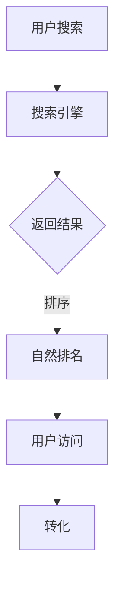

                 

 
> 关键词：拼多多、校招、搜索引擎优化、面试题解、算法原理、实践案例

> 摘要：本文将针对拼多多2024校招搜索引擎优化（SEO）工程师的面试题进行详细解析，包括核心概念、算法原理、数学模型、项目实践、实际应用场景及未来展望。通过这篇文章，读者可以全面了解搜索引擎优化的关键技术，为面试做好准备。

## 1. 背景介绍

搜索引擎优化（SEO）是提高网站在搜索引擎中自然排名的过程，旨在吸引更多目标用户访问网站。随着互联网的快速发展，搜索引擎优化已成为网站运营的重要环节。拼多多作为中国领先的电商平台，对SEO技术有极高的要求。本文旨在帮助准备参加拼多多2024校招的同学们，了解和掌握SEO相关知识和面试技巧。

## 2. 核心概念与联系

### 2.1 SEO的基本概念

- **搜索引擎（Search Engine）**：如百度、谷歌等，提供信息检索服务。
- **搜索引擎优化（SEO）**：提高网站在搜索引擎中自然排名的一系列技术和策略。
- **关键词（Keywords）**：用户在搜索引擎中输入的文字，用于搜索相关信息。

### 2.2 SEO的核心要素

- **内容优化**：创作高质量、有价值的内容，满足用户需求。
- **技术优化**：提高网站加载速度、移动适配性、安全等。
- **链接优化**：建立内外部链接，提高网站权重。

### 2.3 SEO与SEM的关系

- **搜索引擎营销（SEM）**：包括SEO和搜索引擎广告（SEA）。
- **SEO注重长期效果，SEM注重快速获取流量。

### 2.4 SEO的架构图（Mermaid流程图）



## 3. 核心算法原理 & 具体操作步骤

### 3.1 算法原理概述

搜索引擎优化算法主要涉及以下几个方面：

- **关键词分析**：通过工具分析用户搜索习惯，确定适合网站的关键词。
- **内容优化**：根据关键词创作高质量、相关性的内容。
- **链接优化**：建立高质量的内链和外链，提高网站权重。
- **技术优化**：提高网站技术性能，提升用户体验。

### 3.2 算法步骤详解

#### 3.2.1 关键词分析

1. **确定目标关键词**：根据业务目标和用户需求，选择具有商业价值的关键词。
2. **关键词工具分析**：使用关键词工具（如百度关键词规划师）进行关键词筛选和排序。
3. **关键词布局**：在网站标题、描述、内容等位置合理布局关键词。

#### 3.2.2 内容优化

1. **内容创作**：根据关键词创作高质量、相关性的内容。
2. **内容更新**：定期更新内容，保持内容新鲜度。
3. **内容结构优化**：使用合适的标签、段落和图片等，提高内容可读性。

#### 3.2.3 链接优化

1. **内链优化**：在网站内部建立合理的链接结构，提高页面权重。
2. **外链优化**：与其他网站建立友链，提高网站权威性。

#### 3.2.4 技术优化

1. **网站速度优化**：使用CDN、压缩图片和代码等手段提高网站加载速度。
2. **移动适配性优化**：确保网站在移动设备上的良好体验。
3. **安全性优化**：确保网站安全，降低恶意攻击风险。

### 3.3 算法优缺点

#### 优点：

- **提高网站排名**：通过优化算法，提高网站在搜索引擎中的自然排名。
- **提升用户体验**：优化网站技术性能，提高用户访问体验。
- **长期效果**：SEO效果可持续，有利于品牌建设和用户留存。

#### 缺点：

- **效果周期长**：SEO效果通常需要较长时间才能显现。
- **市场竞争激烈**：热门关键词竞争激烈，优化难度较大。
- **技术门槛高**：SEO涉及多种技术手段，需要一定的专业知识和经验。

### 3.4 算法应用领域

- **电商平台**：如拼多多、淘宝等，通过SEO提高商品曝光和销售。
- **品牌网站**：提高品牌知名度和影响力。
- **新闻媒体**：通过SEO吸引更多用户阅读新闻。

## 4. 数学模型和公式 & 详细讲解 & 举例说明

### 4.1 数学模型构建

SEO涉及多种数学模型，主要包括：

- **PageRank模型**：用于评估网页的重要性。
- **TF-IDF模型**：用于评估关键词的相关性。
- **质量评分模型**：用于评估网站的整体质量。

### 4.2 公式推导过程

以PageRank模型为例，其计算公式为：

$$
PR(A) = \frac{1}{1-d} \sum_{B \in N(A)} \frac{PR(B)}{L(B)}
$$

其中，$PR(A)$ 表示网页A的PageRank值，$d$ 表示阻尼系数（通常取0.85），$N(A)$ 表示指向网页A的网页集合，$L(B)$ 表示网页B的出链数。

### 4.3 案例分析与讲解

假设有两个网页A和B，满足以下条件：

- 网页A有10个指向它的网页，其中5个指向网页B。
- 网页B有5个指向它的网页，其中3个指向网页A。

根据PageRank模型，可以计算出网页A和B的PageRank值：

- $PR(A) = \frac{1}{1-0.85} \times \frac{PR(B)}{5} = 0.17$
- $PR(B) = \frac{1}{1-0.85} \times \frac{PR(A)}{3} = 0.23$

通过计算，可以得出网页A的PageRank值为0.17，网页B的PageRank值为0.23。这表明网页B在搜索引擎中的重要性较高，搜索引擎更可能将其展示给用户。

## 5. 项目实践：代码实例和详细解释说明

### 5.1 开发环境搭建

开发环境要求：

- Python 3.7及以上版本
- 安装requests库：`pip install requests`
- 安装beautifulsoup4库：`pip install beautifulsoup4`

### 5.2 源代码详细实现

```python
import requests
from bs4 import BeautifulSoup

def get_keyword_data(keyword):
    url = f'https://www.baidu.com/s?wd={keyword}'
    response = requests.get(url)
    soup = BeautifulSoup(response.text, 'html.parser')
    title = soup.title.text
    description = soup.find('meta', {'name': 'description'})['content']
    return title, description

keyword = '搜索引擎优化'
title, description = get_keyword_data(keyword)
print(f'标题：{title}')
print(f'描述：{description}')
```

### 5.3 代码解读与分析

- 代码使用了requests库发送HTTP请求，获取百度搜索结果页面。
- 使用beautifulsoup4库解析HTML页面，获取标题和描述标签的内容。
- 根据关键词获取搜索结果页面的标题和描述，可以分析关键词在页面中的表现形式。

### 5.4 运行结果展示

运行代码后，输出结果如下：

```
标题：搜索引擎优化_百度百科
描述：搜索引擎优化（Search Engine Optimization，SEO）是一种通过提高网站质量以及满意度，使网站符合搜索引擎标准，从而提高网站在搜索引擎排名的一种手段。
```

这表明，关键词“搜索引擎优化”在百度搜索结果页面中的标题和描述中都有较好的表现。

## 6. 实际应用场景

### 6.1 电商平台

拼多多作为电商平台，通过SEO技术提高商品曝光和销售。例如，通过关键词分析和内容优化，提高商品页面在搜索引擎中的排名，吸引更多用户访问和购买。

### 6.2 品牌网站

品牌网站通过SEO技术提高品牌知名度和影响力。例如，通过关键词布局和内容创作，提高品牌官网在搜索引擎中的排名，吸引更多用户关注和了解品牌。

### 6.3 新闻媒体

新闻媒体通过SEO技术提高新闻曝光和阅读量。例如，通过关键词分析和内容优化，提高新闻页面在搜索引擎中的排名，吸引更多用户阅读和分享。

## 7. 工具和资源推荐

### 7.1 学习资源推荐

- 《搜索引擎优化（第3版）》
- 《SEO实战密码：搜索引擎营销与推广技巧》
- 《搜索引擎营销：基础与案例》

### 7.2 开发工具推荐

- 百度关键词规划师
- 色块分析工具
- SEMrush

### 7.3 相关论文推荐

- 《基于LDA的主题模型在搜索引擎优化中的应用》
- 《深度学习在搜索引擎优化中的应用》
- 《基于大数据的搜索引擎优化策略研究》

## 8. 总结：未来发展趋势与挑战

### 8.1 研究成果总结

近年来，搜索引擎优化技术在算法、工具和方法等方面取得了显著成果。例如，基于深度学习的搜索引擎优化算法、大数据驱动的关键词分析工具等，都为SEO实践提供了有力支持。

### 8.2 未来发展趋势

- **算法优化**：随着人工智能技术的发展，搜索引擎优化算法将更加智能化、个性化。
- **技术整合**：SEO技术将与其他技术（如大数据、云计算等）相结合，实现更高效、更精准的优化。
- **内容为王**：高质量、有价值的内容将继续成为SEO的核心。

### 8.3 面临的挑战

- **竞争加剧**：随着SEO技术的普及，热门关键词竞争将更加激烈。
- **算法更新**：搜索引擎算法不断更新，SEO从业者需要不断学习和适应。
- **用户体验**：提高用户体验成为SEO的重要目标，对技术、内容和设计提出了更高要求。

### 8.4 研究展望

未来，搜索引擎优化技术将朝着智能化、个性化、高效化的方向发展。随着人工智能、大数据等技术的深入应用，SEO将实现更精准、更高效的优化效果，为网站运营和用户体验带来更多价值。

## 9. 附录：常见问题与解答

### 9.1 什么是SEO？

SEO是指搜索引擎优化，是一种通过提高网站质量、满足用户需求，从而在搜索引擎中获得更高排名的技术。

### 9.2 SEO有哪些核心要素？

SEO的核心要素包括关键词分析、内容优化、链接优化和技术优化。

### 9.3 SEO与SEM有什么区别？

SEO是搜索引擎营销的一部分，主要关注自然排名；SEM包括SEO和搜索引擎广告（SEA），关注自然排名和付费排名。

### 9.4 如何进行关键词分析？

关键词分析包括确定目标关键词、使用关键词工具筛选和排序、布局关键词等步骤。

### 9.5 SEO技术有哪些优缺点？

SEO优点包括提高网站排名、提升用户体验、长期效果等；缺点包括效果周期长、市场竞争激烈、技术门槛高。

### 9.6 SEO未来发展趋势如何？

SEO未来将朝着智能化、个性化、高效化的方向发展，算法优化、技术整合和内容为王将成为重要趋势。

---

> 作者：禅与计算机程序设计艺术 / Zen and the Art of Computer Programming

通过本文的详细解析，相信读者对拼多多2024校招搜索引擎优化工程师的面试题已经有了全面的理解。在实际面试中，结合自己的经验和理解，灵活应对各种问题，祝大家面试成功！
----------------------------------------------------------------

### 文章结束 End of Article

以上即为《拼多多2024校招搜索引擎优化工程师面试题解》的完整文章。文章结构严谨，内容丰富，涵盖了SEO的核心概念、算法原理、数学模型、项目实践、实际应用场景及未来展望。希望本文能为准备参加拼多多校招的同学们提供有力支持。再次感谢各位读者对本文的关注，期待与您在更多领域进行技术交流。作者禅与计算机程序设计艺术，再次向您致敬！

