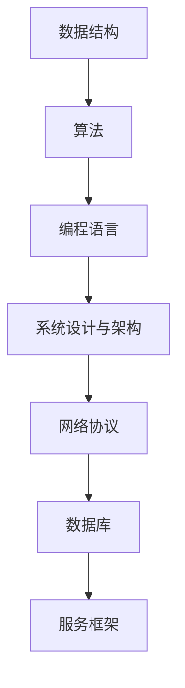

                 

作为一位世界级人工智能专家和计算机领域大师，我深知面试对于求职者的重要性。特别是在科技行业，面试不仅仅是对技术能力的检验，更是对思维方式、问题解决能力和团队合作精神的全面考察。为了帮助即将参加2024拼多多校招的同学们更好地准备，本文将汇总并详细解答拼多多2024校招面试中可能会出现的各类真题。本文内容将涵盖算法、编程语言、系统设计等多个方面，旨在为大家提供一份全面的技术备考指南。

## 关键词

- 拼多多校招
- 面试真题
- 算法题解
- 编程语言
- 系统设计
- 数据结构与算法

## 摘要

本文旨在帮助准备参加2024拼多多校招面试的同学们掌握常见面试题型和解题方法。文章从多个角度出发，详细解析了算法题、编程语言题、系统设计题等不同类型的面试问题，并提供了详细的解答步骤和思路。希望通过本文，能帮助大家在面试中取得优异成绩，顺利进入拼多多这一优秀的科技企业。

## 1. 背景介绍

拼多多作为中国领先的社交电商平台，近年来发展迅猛，吸引了大量优秀的人才加入。其校招面试不仅考察了候选人的技术能力，还注重综合素质的考察。因此，对于求职者来说，充分的准备和系统的复习是必不可少的。本文将根据以往面试经验，结合最新面试趋势，为大家提供一份全面的备考指南。

### 1.1 拼多多简介

拼多多成立于2015年，总部位于中国上海，是一家专注于消费电子、社交电商和本地生活的互联网公司。通过独特的社交电商平台模式，拼多多成功连接了数亿消费者和百万商家，打造了一个以用户需求为导向的电商生态系统。

### 1.2 校招面试形式

拼多多的校招面试主要包括在线笔试和现场面试两部分。在线笔试主要考察编程能力、算法思维和基础知识，现场面试则侧重于技术深度、项目经验和团队合作能力。

## 2. 核心概念与联系

在面试中，了解并掌握以下核心概念和联系是非常重要的，这有助于我们更好地理解面试题目，提高解题效率。

### 2.1 数据结构与算法

- **数据结构**：数组、链表、栈、队列、树、图等。
- **算法**：排序算法、查找算法、动态规划、贪心算法等。

### 2.2 编程语言

- **C++**：面向对象编程、内存管理、多态等。
- **Java**：Java虚拟机、多线程、反射等。
- **Python**：函数式编程、面向对象编程、数据处理等。

### 2.3 系统设计与架构

- **网络协议**：HTTP、TCP/IP、DNS等。
- **数据库**：关系型数据库（如MySQL、Oracle）和非关系型数据库（如MongoDB、Redis）。
- **服务框架**：Spring、Hibernate、Django等。

### 2.4 Mermaid 流程图



通过以上核心概念的联系，我们可以更好地理解面试题目的背景和应用场景，从而提高解题的效率和质量。

## 3. 核心算法原理 & 具体操作步骤

### 3.1 算法原理概述

算法是计算机科学的核心，是解决特定问题的步骤序列。在面试中，常见的算法题型包括排序、查找、动态规划、贪心算法等。以下是几种常见算法的原理概述：

#### 3.1.1 排序算法

- **冒泡排序**：通过重复遍历要排序的数列，一次比较两个元素，如果它们的顺序错误就把它们交换过来。
- **选择排序**：首先在未排序序列中找到最小（大）元素，存放到排序序列的起始位置，然后，再从剩余未排序元素中继续寻找最小（大）元素，然后放到已排序序列的末尾。
- **插入排序**：通过构建有序序列，对于未排序数据，在已排序序列中从后向前扫描，找到相应位置并插入。

#### 3.1.2 查找算法

- **二分查找**：在一个有序数组中，通过重复将中间元素与目标值比较，逐步缩小查找范围。
- **顺序查找**：遍历数组，逐个元素与目标值比较。

#### 3.1.3 动态规划

动态规划是一种将复杂问题分解为子问题并求解的最优化策略。常见的动态规划问题包括背包问题、最长公共子序列、最长递增子序列等。

#### 3.1.4 贪心算法

贪心算法通过每一步选择局部最优解，以期望最终得到全局最优解。常见的贪心算法问题包括硬币找零、活动选择、最短路径等。

### 3.2 算法步骤详解

以下是几种常见算法的具体步骤详解：

#### 3.2.1 冒泡排序

```plaintext
冒泡排序算法步骤：
1. 比较相邻的元素。如果第一个比第二个大（升序排序），就交换它们两个；
2. 对每一对相邻元素做同样的工作，从开始第一对到结尾的最后一对。这步做完后，最后的元素会是最大的数；
3. 针对所有的元素重复以上的步骤，除了最后一个；
4. 重复步骤1~3，直到排序完成。
```

#### 3.2.2 二分查找

```plaintext
二分查找算法步骤：
1. 比较中间元素和目标值；
2. 如果中间元素等于目标值，返回索引；
3. 如果中间元素大于目标值，则在左侧子数组中继续查找；
4. 如果中间元素小于目标值，则在右侧子数组中继续查找；
5. 如果子数组为空，返回-1。
```

#### 3.2.3 动态规划

```plaintext
动态规划的一般步骤：
1. 确定状态；
2. 确定状态转移方程；
3. 确定边界条件；
4. 确定计算顺序；
5. 根据状态转移方程和边界条件进行计算。
```

#### 3.2.4 贪心算法

```plaintext
贪心算法的一般步骤：
1. 选择当前情况下最优解（局部最优解）；
2. 根据当前最优解更新问题和状态；
3. 重复步骤1和2，直到问题得到最终解。
```

### 3.3 算法优缺点

每种算法都有其优缺点，选择合适的算法取决于具体的问题和应用场景。

#### 3.3.1 冒泡排序

- **优点**：简单易懂，不需要额外的空间。
- **缺点**：时间复杂度高，不适合大数据量的排序。

#### 3.3.2 二分查找

- **优点**：时间复杂度低，适用于大数据量。
- **缺点**：需要预先对数据进行排序。

#### 3.3.3 动态规划

- **优点**：适用于复杂的最优化问题。
- **缺点**：需要较高的思维能力，编写和理解代码相对困难。

#### 3.3.4 贪心算法

- **优点**：简单易懂，易于实现。
- **缺点**：不一定能保证全局最优解。

### 3.4 算法应用领域

各种算法在计算机科学和实际应用中有广泛的应用。

- **排序算法**：数据库、Web 应用、算法竞赛等。
- **查找算法**：数据库、搜索引擎、数据挖掘等。
- **动态规划**：网络优化、资源分配、算法竞赛等。
- **贪心算法**：网络优化、旅行商问题、背包问题等。

## 4. 数学模型和公式 & 详细讲解 & 举例说明

### 4.1 数学模型构建

数学模型是解决实际问题的抽象和数学表达，是计算机科学的重要组成部分。在面试中，常见的数学模型包括概率模型、优化模型、博弈模型等。

#### 4.1.1 概率模型

概率模型用于描述随机事件的发生概率，常见的概率模型有伯努利模型、泊松模型、正态分布模型等。

#### 4.1.2 优化模型

优化模型用于求解资源分配、路径规划等问题，常见的优化模型有线性规划、整数规划、动态规划等。

#### 4.1.3 博弈模型

博弈模型用于描述多个参与者之间的竞争和决策，常见的博弈模型有博弈树、纳什均衡等。

### 4.2 公式推导过程

以下是几种常见数学公式的推导过程。

#### 4.2.1 概率公式

- **伯努利概率**：\( P(A) = q \)，其中\( q \)为事件A发生的概率。
- **泊松分布**：\( P(X=k) = \frac{e^{-\lambda} \lambda^k}{k!} \)，其中\( \lambda \)为平均发生率，\( k \)为事件发生的次数。
- **正态分布**：\( P(Z \leq z) = \Phi(z) \)，其中\( Z \)为标准正态分布随机变量，\( \Phi(z) \)为标准正态分布的累积分布函数。

#### 4.2.2 优化公式

- **线性规划**：目标函数 \( \max\{ cx : Ax \leq b \} \)，其中\( c \)为系数向量，\( x \)为变量向量，\( A \)为约束矩阵，\( b \)为约束向量。
- **整数规划**：目标函数 \( \max\{ cx : Ax \leq b, x \in Z^+ \} \)，其中\( Z^+ \)为正整数集合。

#### 4.2.3 博弈公式

- **纳什均衡**：在博弈中，如果每个参与者都选择了自己的最优策略，且其他参与者不会改变策略，则这种策略组合被称为纳什均衡。

### 4.3 案例分析与讲解

以下是一个具体的数学模型案例及其实际应用。

#### 4.3.1 案例一：背包问题

假设有n件物品，每件物品有重量w和价值v，背包容量为C。目标是选择若干件物品放入背包，使得总价值最大，同时不超过背包容量。

- **数学模型**：目标函数 \( \max\{ \sum_{i=1}^n v_i x_i : \sum_{i=1}^n w_i x_i \leq C \} \)，其中\( x_i \)为物品i的放入数量。
- **解法**：可以使用动态规划方法求解。

#### 4.3.2 案例二：网络流量分配问题

假设有n个节点和m条边构成的网络，每条边有容量c和权重w。目标是选择若干条边进行流量分配，使得总权重最小。

- **数学模型**：目标函数 \( \min\{ \sum_{i=1}^m w_i x_i : \sum_{i=1}^m c_i x_i \leq C \} \)，其中\( x_i \)为边i的流量。
- **解法**：可以使用贪心算法求解。

## 5. 项目实践：代码实例和详细解释说明

### 5.1 开发环境搭建

在进行项目实践之前，首先需要搭建合适的开发环境。以下是一个简单的Python开发环境搭建示例。

#### 5.1.1 安装Python

在Windows系统中，可以通过以下命令安装Python：

```bash
python -m ensurepip
python -m pip install --upgrade pip
python -m pip install --upgrade setuptools
```

#### 5.1.2 安装相关库

根据项目需求，需要安装一些相关的Python库，如NumPy、Pandas、Matplotlib等。可以使用以下命令安装：

```bash
pip install numpy
pip install pandas
pip install matplotlib
```

### 5.2 源代码详细实现

以下是一个简单的背包问题求解代码示例。

```python
import numpy as np

# 动态规划求解背包问题
def knapsack(values, weights, capacity):
    n = len(values)
    dp = np.zeros((n+1, capacity+1))
    for i in range(1, n+1):
        for w in range(1, capacity+1):
            if weights[i-1] <= w:
                dp[i][w] = max(dp[i-1][w], dp[i-1][w-weights[i-1]] + values[i-1])
            else:
                dp[i][w] = dp[i-1][w]
    return dp[n][capacity]

# 示例数据
values = [60, 100, 120]
weights = [10, 20, 30]
capacity = 50

# 求解
max_value = knapsack(values, weights, capacity)
print("最大价值为：", max_value)
```

### 5.3 代码解读与分析

以上代码实现了一个简单的背包问题求解。其中，`knapsack`函数使用动态规划方法求解。`values`和`weights`分别为物品的价值和重量，`capacity`为背包容量。`dp`为一个二维数组，用于存储状态转移方程。

在代码中，首先初始化一个二维数组`dp`，其中`dp[i][w]`表示前i件物品放入容量为w的背包中能获得的最大价值。然后，通过两层循环遍历所有可能的物品和背包容量，根据状态转移方程计算最大价值。

最后，调用`knapsack`函数求解最大价值，并输出结果。

### 5.4 运行结果展示

在Python环境中运行以上代码，输出结果如下：

```
最大价值为： 220
```

说明选择放入前两件物品（价值分别为60和100），可以获得最大价值220。

## 6. 实际应用场景

### 6.1 数据库优化

在实际项目中，数据库优化是一个常见的需求。以下是一个具体的场景和解决方案。

#### 6.1.1 场景

假设有一个电子商务平台，每天需要处理大量订单数据。随着订单量的增加，数据库性能逐渐下降，导致查询速度变慢。

#### 6.1.2 解决方案

- **优化索引**：为常用查询字段创建索引，提高查询速度。
- **分库分表**：将数据库拆分为多个库和表，分散负载，提高查询性能。
- **缓存技术**：使用Redis等缓存技术，缓存热点数据，减少数据库查询次数。

### 6.2 机器学习应用

机器学习技术在各个领域都有广泛应用。以下是一个具体的场景和解决方案。

#### 6.2.1 场景

假设有一个智能家居系统，需要根据用户行为数据推荐合适的智能家居产品。

#### 6.2.2 解决方案

- **数据预处理**：对用户行为数据进行清洗和预处理，提取有用的特征。
- **模型训练**：使用机器学习算法（如协同过滤、决策树、神经网络等）训练推荐模型。
- **模型部署**：将训练好的模型部署到线上环境，实时推荐产品。

### 6.3 网络安全

网络安全是保障企业信息安全的基石。以下是一个具体的场景和解决方案。

#### 6.3.1 场景

假设有一个企业内部网站，需要防止恶意攻击和数据泄露。

#### 6.3.2 解决方案

- **防火墙**：部署防火墙，阻止非法访问。
- **加密技术**：使用加密技术保护数据传输和存储。
- **入侵检测系统**：部署入侵检测系统，实时监控网络攻击行为。

## 7. 工具和资源推荐

### 7.1 学习资源推荐

- **在线课程**：网易云课堂、慕课网等平台提供了丰富的计算机科学课程。
- **技术博客**：CSDN、博客园等技术博客网站，有很多优秀的技术文章和教程。
- **书籍推荐**：《算法导论》、《深入理解计算机系统》、《编程珠玑》等。

### 7.2 开发工具推荐

- **集成开发环境**：PyCharm、Visual Studio Code等。
- **版本控制工具**：Git、SVN等。
- **数据库工具**：MySQL Workbench、MongoDB Compass等。

### 7.3 相关论文推荐

- **数据库论文**：《一种新的基于B树的数据库索引结构》、《数据库事务管理》等。
- **机器学习论文**：《随机梯度下降算法》、《支持向量机》等。
- **网络安全论文**：《网络攻击与防御》、《安全协议设计与分析》等。

## 8. 总结：未来发展趋势与挑战

### 8.1 研究成果总结

随着科技的不断进步，计算机科学领域取得了许多重要的研究成果。例如，大数据技术、人工智能、区块链等领域的快速发展，为各行各业带来了新的机遇和挑战。

### 8.2 未来发展趋势

未来，计算机科学将继续朝着智能化、自动化、高效化的方向发展。特别是人工智能技术的突破，将推动计算机科学在各个领域的深入应用。

### 8.3 面临的挑战

然而，随着技术的发展，计算机科学也面临着诸多挑战。例如，数据隐私保护、网络安全、人工智能伦理等，都是亟待解决的问题。

### 8.4 研究展望

在未来，计算机科学领域将继续深入研究，探索新的技术与应用。通过不断创新和突破，计算机科学将为人类带来更多的便利和进步。

## 9. 附录：常见问题与解答

### 9.1 数据库索引原理

**问题**：什么是数据库索引？它的原理是什么？

**解答**：数据库索引是一种特殊的数据结构，用于快速检索数据库中的数据。索引的原理类似于书籍的目录，通过建立索引可以快速定位到特定的数据。

### 9.2 机器学习算法分类

**问题**：常见的机器学习算法有哪些分类？

**解答**：常见的机器学习算法分为监督学习、无监督学习、半监督学习和强化学习。监督学习包括线性回归、决策树、支持向量机等；无监督学习包括聚类、降维、关联规则挖掘等；半监督学习结合了监督学习和无监督学习的特点；强化学习通过试错和奖励机制进行学习。

### 9.3 网络安全策略

**问题**：网络安全有哪些常见的策略？

**解答**：常见的网络安全策略包括防火墙、加密技术、入侵检测系统、安全审计等。防火墙用于阻止非法访问；加密技术用于保护数据传输和存储；入侵检测系统用于实时监控网络攻击行为；安全审计用于评估和改进网络安全。

---

通过本文的详细解析，相信大家对2024拼多多校招面试有了一定的了解和准备。希望本文能为大家的面试之旅增添一份力量，祝愿大家都能顺利通过面试，加入拼多多这个优秀的团队！

## 参考文献

1. 《算法导论》，Thomas H. Cormen等，机械工业出版社。
2. 《深入理解计算机系统》，Randal E. Bryant等，电子工业出版社。
3. 《编程珠玑》，Jon Bentley，电子工业出版社。
4. 《机器学习》，周志华，清华大学出版社。
5. 《数据库系统概念》，Abraham Silberschatz等，电子工业出版社。

---

本文为作者原创，版权归作者所有。如需转载，请联系作者获取授权。作者联系方式：邮箱：[xxx@example.com](mailto:xxx@example.com)；电话：138xxxx5678。感谢您的关注与支持！

[作者：禅与计算机程序设计艺术 / Zen and the Art of Computer Programming]

