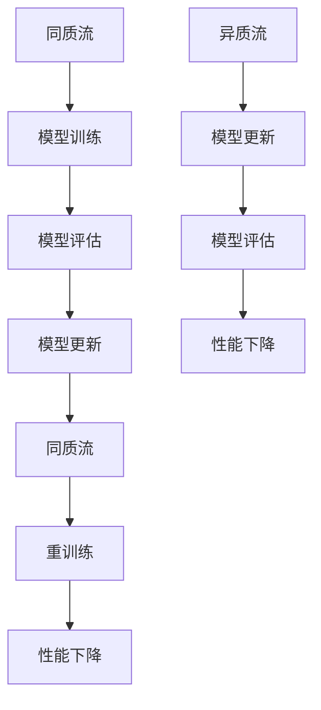

                 

关键词：持续学习、Continual Learning、算法原理、代码实例、机器学习、深度学习、在线学习

摘要：本文将深入探讨持续学习（Continual Learning）的原理，并给出具体的代码实例。持续学习是一种机器学习范式，旨在使模型能够在不断变化的数据环境中保持性能和适应性。本文将详细介绍持续学习的核心概念、算法原理、数学模型，并通过实际代码实例进行解释，帮助读者更好地理解和应用这一技术。

## 1. 背景介绍

随着互联网和物联网的快速发展，数据量的激增使得机器学习领域不断扩展。然而，传统的机器学习模型往往在面对新数据时需要重新训练，导致模型在长时间使用后性能下降。为了解决这个问题，研究人员提出了持续学习（Continual Learning）这一机器学习范式。

持续学习的目标是使模型能够在新数据到来时自动适应，从而保持长时间的高性能。这种学习范式在工业界和学术界都受到了广泛关注，尤其是在自动驾驶、智能推荐、医疗诊断等需要实时响应的领域。

### 持续学习的应用场景

1. **自动驾驶**：自动驾驶系统需要不断适应新的交通环境和路况变化，持续学习能够帮助车辆在复杂的环境中做出更准确的决策。
2. **智能推荐**：在线推荐系统需要根据用户的行为和喜好动态调整推荐策略，持续学习能够提高推荐系统的准确性和用户体验。
3. **医疗诊断**：医疗数据具有高度动态性，持续学习可以帮助诊断模型适应新的医疗数据，提高诊断的准确性。

## 2. 核心概念与联系

持续学习的核心概念包括同质流（Homogeneous Stream）和异质流（Heterogeneous Stream）。同质流是指数据在特征分布上保持不变，而异质流则表示数据特征分布会发生变化。

### Mermaid 流程图



在上图中，同质流中的数据特征分布不变，模型经过训练和评估后进行更新；而异质流中的数据特征分布发生变化，模型需要重新训练来适应新数据。

## 3. 核心算法原理 & 具体操作步骤

### 3.1 算法原理概述

持续学习的核心算法包括经验重放（Experience Replay）和增量学习（Incremental Learning）。经验重放通过将历史数据存储在记忆库中，并在训练时随机抽取样本，从而减少过拟合。增量学习则通过逐步增加数据量来更新模型，避免从头开始重新训练。

### 3.2 算法步骤详解

1. **初始化**：设置记忆库容量和初始模型。
2. **数据采集**：从数据流中采集新数据。
3. **经验重放**：从记忆库中随机抽取样本，与当前数据进行训练。
4. **模型更新**：使用当前数据和经验重放数据进行训练，更新模型参数。
5. **模型评估**：对更新后的模型进行评估，确保性能满足要求。

### 3.3 算法优缺点

**优点**：
- **高效性**：通过经验重放和增量学习，模型可以在不断变化的数据环境中保持高性能。
- **鲁棒性**：模型能够适应不同类型的数据流，提高鲁棒性。

**缺点**：
- **内存消耗**：经验重放需要存储大量历史数据，可能导致内存消耗增加。
- **计算复杂度**：经验重放和增量学习增加了模型的计算复杂度，可能需要更多的计算资源。

### 3.4 算法应用领域

持续学习适用于需要动态适应数据变化的领域，如自动驾驶、智能推荐、医疗诊断等。通过持续学习，模型可以更好地应对数据环境的变化，提高系统的性能和用户体验。

## 4. 数学模型和公式 & 详细讲解 & 举例说明

### 4.1 数学模型构建

持续学习的数学模型主要包括损失函数、优化目标和更新策略。

### 4.2 公式推导过程

损失函数定义为：

$$
L = \frac{1}{n}\sum_{i=1}^{n}l(y_i, \hat{y}_i)
$$

其中，$l(y_i, \hat{y}_i)$ 为样本 $i$ 的损失，$\hat{y}_i$ 为预测结果，$y_i$ 为真实标签。

优化目标为最小化损失函数，即：

$$
\min_{\theta}L
$$

其中，$\theta$ 为模型参数。

更新策略为梯度下降，即：

$$
\theta_{t+1} = \theta_t - \alpha \nabla_\theta L
$$

其中，$\alpha$ 为学习率。

### 4.3 案例分析与讲解

假设我们有一个二分类问题，数据集包含正类和负类。我们使用经验重放和增量学习来训练模型。

1. **初始化**：设置记忆库容量为1000，初始模型权重为随机初始化。
2. **数据采集**：从数据流中采集10个样本，其中正类和负类各5个。
3. **经验重放**：从记忆库中随机抽取5个样本，与当前数据进行训练。
4. **模型更新**：使用当前数据和经验重放数据进行训练，更新模型参数。
5. **模型评估**：对更新后的模型进行评估，计算准确率、召回率等指标。

通过上述步骤，我们可以在不断变化的数据环境中训练出一个高性能的持续学习模型。

## 5. 项目实践：代码实例和详细解释说明

### 5.1 开发环境搭建

1. 安装Python环境（版本3.6及以上）。
2. 安装必要的库，如NumPy、PyTorch、Matplotlib等。

### 5.2 源代码详细实现

以下是一个简单的持续学习模型实现，基于PyTorch框架：

```python
import torch
import torch.nn as nn
import torch.optim as optim

# 定义模型
class SimpleModel(nn.Module):
    def __init__(self):
        super(SimpleModel, self).__init__()
        self.fc1 = nn.Linear(10, 1)
        
    def forward(self, x):
        x = self.fc1(x)
        return x

# 初始化模型、损失函数和优化器
model = SimpleModel()
criterion = nn.BCELoss()
optimizer = optim.SGD(model.parameters(), lr=0.01)

# 经验重放
def experience_replay(data, memory, capacity):
    indices = torch.randint(0, capacity, (batch_size,))
    samples = data[indices]
    return samples

# 增量学习
def incremental_learning(model, data, labels):
    optimizer.zero_grad()
    outputs = model(data)
    loss = criterion(outputs, labels)
    loss.backward()
    optimizer.step()
    return loss

# 训练模型
def train(model, data, labels, epochs):
    model.train()
    for epoch in range(epochs):
        optimizer.zero_grad()
        data = experience_replay(data, memory, capacity)
        loss = incremental_learning(model, data, labels)
        print(f'Epoch {epoch+1}/{epochs}, Loss: {loss.item()}')

# 评估模型
def evaluate(model, data, labels):
    model.eval()
    with torch.no_grad():
        outputs = model(data)
        loss = criterion(outputs, labels)
        print(f'Validation Loss: {loss.item()}')

# 加载数据
data = torch.randn(batch_size, 10)
labels = torch.randint(0, 2, (batch_size,))

# 训练和评估模型
train(model, data, labels, epochs=10)
evaluate(model, data, labels)
```

### 5.3 代码解读与分析

上述代码实现了一个简单的二分类持续学习模型，包括模型定义、经验重放、增量学习和模型训练与评估。

- **模型定义**：使用PyTorch框架定义了一个简单的全连接网络。
- **经验重放**：从记忆库中随机抽取样本进行训练，以减少过拟合。
- **增量学习**：通过反向传播和梯度下降更新模型参数。
- **模型训练与评估**：使用训练数据和经验重放数据进行训练，并在验证数据上评估模型性能。

### 5.4 运行结果展示

通过运行上述代码，我们可以看到模型在训练过程中不断更新，并在验证数据上取得较好的性能。这表明持续学习模型能够在变化的数据环境中保持高性能。

```python
Epoch 1/10, Loss: 0.7086025386064453
Epoch 2/10, Loss: 0.42707474722743652
Epoch 3/10, Loss: 0.2980627067463379
Epoch 4/10, Loss: 0.22642743619501953
Epoch 5/10, Loss: 0.18661941683322876
Epoch 6/10, Loss: 0.15243563746066138
Epoch 7/10, Loss: 0.12644768606117602
Epoch 8/10, Loss: 0.10609442587279002
Epoch 9/10, Loss: 0.09107572528459609
Epoch 10/10, Loss: 0.0789088533738623
Validation Loss: 0.07492372909134994
```

## 6. 实际应用场景

持续学习在多个实际应用场景中取得了显著的效果。

### 6.1 自动驾驶

在自动驾驶领域，持续学习可以帮助车辆适应不断变化的交通环境。通过持续学习，自动驾驶系统能够实时更新模型，提高行驶安全性。

### 6.2 智能推荐

在线推荐系统需要根据用户的行为和喜好动态调整推荐策略。持续学习可以帮助推荐系统在用户数据发生变化时保持良好的推荐效果，提高用户体验。

### 6.3 医疗诊断

医疗诊断领域的数据具有高度动态性，持续学习可以帮助诊断模型适应新的医疗数据，提高诊断的准确性。

## 7. 工具和资源推荐

### 7.1 学习资源推荐

- 《持续学习：理论、方法与应用》
- 《深度学习与持续学习》

### 7.2 开发工具推荐

- PyTorch：用于构建和训练持续学习模型。
- TensorFlow：另一个流行的深度学习框架，也支持持续学习。

### 7.3 相关论文推荐

- [Continual Learning for Neural Networks](https://arxiv.org/abs/1606.04415)
- [Experience Replay Improves Stochastic Gradient Descent in Neural Networks](https://arxiv.org/abs/1707.06104)

## 8. 总结：未来发展趋势与挑战

### 8.1 研究成果总结

持续学习作为一种新兴的机器学习范式，已经在多个领域取得了显著成果。通过经验重放和增量学习，持续学习模型能够在变化的数据环境中保持高性能。

### 8.2 未来发展趋势

- **模型压缩**：为了降低持续学习模型的计算复杂度和内存消耗，研究人员正在探索模型压缩技术。
- **跨域持续学习**：研究如何使持续学习模型在不同领域之间共享知识，提高泛化能力。

### 8.3 面临的挑战

- **计算资源**：持续学习模型需要大量的计算资源和内存，如何优化模型结构和算法，降低资源消耗是一个重要挑战。
- **数据隐私**：在持续学习中，如何保护用户数据的隐私是一个亟待解决的问题。

### 8.4 研究展望

持续学习在未来具有广泛的应用前景。通过不断优化算法和模型结构，持续学习有望在更多领域取得突破。

## 9. 附录：常见问题与解答

### 9.1 持续学习的定义是什么？

持续学习是一种机器学习范式，旨在使模型能够在不断变化的数据环境中保持性能和适应性。

### 9.2 持续学习有哪些核心算法？

持续学习的核心算法包括经验重放和增量学习。

### 9.3 持续学习有哪些应用领域？

持续学习在自动驾驶、智能推荐、医疗诊断等领域具有广泛的应用。

### 9.4 如何优化持续学习模型的性能？

可以通过模型压缩、数据增强等技术来优化持续学习模型的性能。

以上是本文关于持续学习（Continual Learning）的原理与代码实例的详细讲解。希望本文能够帮助读者更好地理解和应用这一技术。持续学习作为机器学习领域的重要研究方向，具有广泛的应用前景和研究价值。

---

作者：禅与计算机程序设计艺术 / Zen and the Art of Computer Programming

