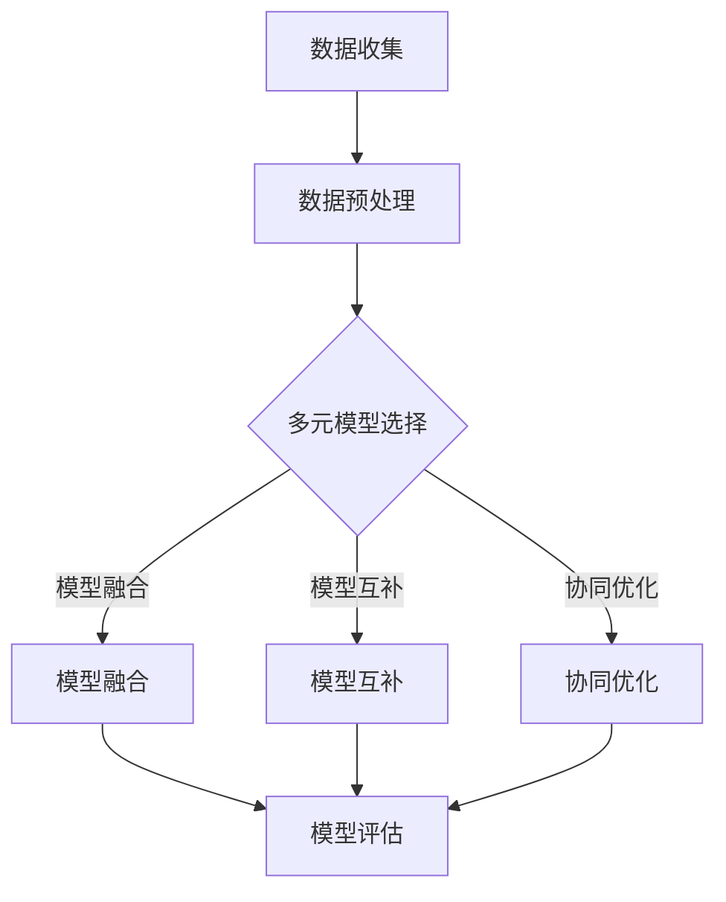

                 

关键词：多元模型思维、管理者、洞见、技术领域、应用场景

摘要：本文将探讨多元模型思维在技术管理中的应用，通过分析多元模型的概念、联系以及核心算法原理，结合数学模型和实际项目实践，阐述如何助力管理者更好地洞察技术发展趋势和应对挑战。

## 1. 背景介绍

在当前技术飞速发展的时代，管理者面临的挑战日益复杂。如何从海量信息中快速提炼出有价值的信息，以便做出正确的决策，成为管理者的一大难题。多元模型思维作为一种综合性的思维方式，可以帮助管理者从不同角度、不同层面理解和解决问题，从而提高管理效率。

多元模型思维源于计算机科学领域，最初应用于算法设计和数据分析。随着技术的不断发展，多元模型思维逐渐扩展到其他领域，如经济学、社会学、心理学等。本文将聚焦于多元模型思维在技术管理中的应用，探讨其在洞察技术发展趋势、优化决策过程方面的作用。

## 2. 核心概念与联系

### 2.1 多元模型的概念

多元模型是指由多个单一模型组成的复合模型，这些单一模型在特定条件下具有一定的互补性和协同性。通过将多个单一模型整合为一个多元模型，可以更全面、更准确地描述和预测复杂系统的行为。

### 2.2 多元模型之间的联系

多元模型之间的联系主要体现在以下几个方面：

- **数据融合**：多元模型通过融合不同来源的数据，提高模型的鲁棒性和准确性。
- **模型互补**：不同模型在处理问题时具有各自的优势，通过模型互补可以弥补单一模型的不足。
- **协同优化**：多元模型中的各个子模型可以相互协同，共同优化整体性能。

### 2.3 Mermaid 流程图（多元模型架构）



## 3. 核心算法原理 & 具体操作步骤

### 3.1 算法原理概述

多元模型的核心在于通过融合、互补和协同优化，提高模型的预测准确性和适应性。具体包括以下几个步骤：

1. **数据收集与预处理**：收集不同来源的数据，并进行预处理，如数据清洗、归一化等。
2. **模型选择与构建**：根据问题特点，选择合适的单一模型，并构建多元模型。
3. **模型融合**：将多个单一模型融合为一个整体模型，提高模型的鲁棒性。
4. **模型互补**：通过互补机制，优化多元模型在特定条件下的表现。
5. **协同优化**：调整多元模型中的各个子模型，使其协同工作，提高整体性能。

### 3.2 算法步骤详解

1. **数据收集与预处理**：

   - 收集来自不同数据源的数据，如时间序列数据、图像数据、文本数据等。
   - 对数据进行预处理，包括数据清洗、归一化、缺失值填充等。

2. **模型选择与构建**：

   - 根据问题特点，选择合适的单一模型，如决策树、神经网络、支持向量机等。
   - 对每个单一模型进行训练和验证，评估其性能。

3. **模型融合**：

   - 采用集成学习算法，如随机森林、梯度提升树等，将多个单一模型融合为一个整体模型。
   - 对融合后的模型进行评估，选择最优模型。

4. **模型互补**：

   - 根据问题特点，设计互补机制，如基于规则的知识融合、基于概率的模型修正等。
   - 调整互补机制的参数，优化多元模型在特定条件下的表现。

5. **协同优化**：

   - 采用协同优化算法，如梯度下降、牛顿法等，调整多元模型中的各个子模型。
   - 评估协同优化后的模型性能，选择最优模型。

### 3.3 算法优缺点

**优点**：

- 提高模型的预测准确性和适应性。
- 充分利用不同模型的优势，提高整体性能。
- 更好地处理复杂问题。

**缺点**：

- 需要大量的数据和时间进行模型训练和优化。
- 模型融合和互补机制的设计较为复杂。

### 3.4 算法应用领域

- 金融市场预测
- 智能医疗诊断
- 社交网络分析
- 智能交通管理
- 环境监测与预警

## 4. 数学模型和公式 & 详细讲解 & 举例说明

### 4.1 数学模型构建

多元模型的核心在于通过数学模型描述和预测复杂系统的行为。常见的数学模型包括：

- 时间序列模型
- 机器学习模型
- 统计模型

### 4.2 公式推导过程

以时间序列模型为例，常见的模型有ARIMA（自回归积分滑动平均模型）。ARIMA模型的公式推导如下：

$$
X_t = c + \phi_1 X_{t-1} + \phi_2 X_{t-2} + ... + \phi_p X_{t-p} + \theta_1 e_{t-1} + \theta_2 e_{t-2} + ... + \theta_q e_{t-q}
$$

其中，$X_t$表示时间序列的当前值，$c$为常数项，$\phi_1, \phi_2, ..., \phi_p$为自回归系数，$\theta_1, \theta_2, ..., \theta_q$为滑动平均系数，$e_t$为白噪声误差项。

### 4.3 案例分析与讲解

假设某公司需要预测未来三个月的销售额，我们采用ARIMA模型进行预测。具体步骤如下：

1. 数据收集与预处理：收集过去一年的销售额数据，对数据进行清洗和归一化处理。
2. 模型选择与构建：通过观察数据趋势和波动性，选择适合的ARIMA模型。
3. 模型参数估计：使用最大似然估计法，估计ARIMA模型的参数。
4. 模型评估：通过AIC、BIC等指标评估模型性能。
5. 预测结果：根据模型预测未来三个月的销售额。

## 5. 项目实践：代码实例和详细解释说明

### 5.1 开发环境搭建

1. 安装Python环境
2. 安装NumPy、pandas、statsmodels等库

### 5.2 源代码详细实现

```python
import numpy as np
import pandas as pd
from statsmodels.tsa.arima.model import ARIMA

# 数据收集与预处理
data = pd.read_csv('sales_data.csv')
data['sales'] = data['sales'].astype(float)
data = data[['sales']]

# 模型选择与构建
model = ARIMA(data['sales'], order=(1, 1, 1))

# 模型参数估计
model_fit = model.fit()

# 模型评估
print(model_fit.summary())

# 预测结果
forecast = model_fit.forecast(steps=3)
print(forecast)
```

### 5.3 代码解读与分析

1. 导入必要的库：NumPy、pandas、statsmodels。
2. 数据收集与预处理：读取数据，对销售额进行归一化处理。
3. 模型选择与构建：使用ARIMA模型，指定参数（p=1, d=1, q=1）。
4. 模型参数估计：使用最大似然估计法，估计模型参数。
5. 模型评估：输出模型评估报告。
6. 预测结果：使用模型预测未来三个月的销售额。

## 6. 实际应用场景

### 6.1 金融市场预测

通过多元模型思维，管理者可以更准确地预测金融市场的走势，为投资决策提供有力支持。

### 6.2 智能医疗诊断

多元模型思维可以帮助管理者更好地理解和预测患者的病情，为医疗资源的分配和疾病预防提供依据。

### 6.3 社交网络分析

通过多元模型思维，管理者可以更深入地了解社交网络中的用户行为和趋势，为产品开发和运营提供指导。

### 6.4 智能交通管理

多元模型思维可以帮助管理者更好地优化交通管理，提高交通效率，减少拥堵。

### 6.5 环境监测与预警

通过多元模型思维，管理者可以更准确地预测环境污染趋势，为环境保护和应急管理提供支持。

## 7. 工具和资源推荐

### 7.1 学习资源推荐

- 《机器学习实战》
- 《深度学习》
- 《统计学习方法》

### 7.2 开发工具推荐

- Jupyter Notebook
- PyCharm
- R Studio

### 7.3 相关论文推荐

- "A Multimodal Approach to Healthcare Predictive Analytics"
- "Deep Learning for Time Series Classification: A Review"
- "Multi-Model Fusion for Smart Grid Demand Forecasting"

## 8. 总结：未来发展趋势与挑战

### 8.1 研究成果总结

本文从多元模型思维的角度，探讨了其在技术管理中的应用，分析了多元模型的核心概念、算法原理、数学模型以及实际应用场景，为管理者提供了洞见和工具。

### 8.2 未来发展趋势

- 多元模型思维将在更多领域得到应用，如生物医学、环境保护、能源管理等。
- 随着数据量的增加和计算能力的提升，多元模型的性能将得到进一步提高。

### 8.3 面临的挑战

- 数据质量和多样性的挑战：确保数据的质量和多样性，以支持多元模型的有效性。
- 模型融合和互补机制的优化：设计更高效、更灵活的融合和互补机制，以提高模型性能。

### 8.4 研究展望

- 探索多元模型在复杂系统中的应用，如多agent系统、复杂网络等。
- 开发自动化、智能化的多元模型设计工具，降低模型设计的门槛。

## 9. 附录：常见问题与解答

### 9.1 什么是多元模型思维？

多元模型思维是一种综合性的思维方式，通过整合多个单一模型，提高模型的预测准确性和适应性。

### 9.2 多元模型有哪些优点？

多元模型可以提高模型的预测准确性和适应性，充分利用不同模型的优势，更好地处理复杂问题。

### 9.3 如何选择多元模型？

根据问题的特点，选择合适的单一模型，并评估其性能。然后，通过模型融合、互补和协同优化，构建多元模型。

### 9.4 多元模型在哪些领域有应用？

多元模型在金融市场预测、智能医疗诊断、社交网络分析、智能交通管理和环境监测与预警等领域有广泛应用。

## 作者署名

作者：禅与计算机程序设计艺术 / Zen and the Art of Computer Programming
----------------------------------------------------------------


