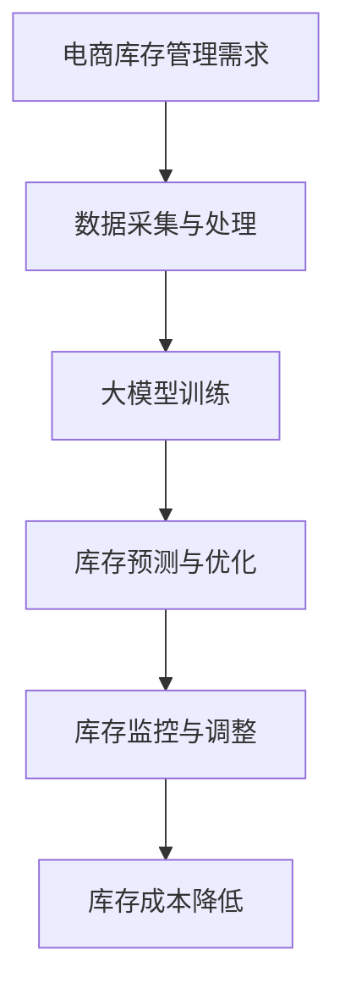

                 

关键词：人工智能，大模型，电商，库存管理，算法，技术，解决方案

> 摘要：本文探讨了人工智能大模型在电商库存管理中的应用潜力。通过对现有技术的分析，本文提出了一种基于人工智能大模型的新型库存管理方案，并详细介绍了其核心算法原理、数学模型构建以及实际应用案例，为电商库存管理的智能化发展提供了新的思路。

## 1. 背景介绍

随着互联网的飞速发展，电子商务已成为全球经济增长的重要引擎。然而，电商库存管理面临的挑战也日益严峻。传统的库存管理方法往往依赖于历史数据和经验，无法及时应对市场变化和消费者需求的波动。这不仅导致了库存过剩或短缺，影响了企业的运营效率和客户满意度，还增加了库存成本。

近年来，人工智能（AI）技术的迅速发展为电商库存管理带来了新的机遇。AI大模型具有强大的数据处理和分析能力，可以实时捕捉市场动态，预测消费者需求，从而优化库存水平，降低库存成本。本文旨在探讨AI大模型在电商库存管理中的潜力，提出一种基于人工智能大模型的新型库存管理方案，并通过实际案例验证其有效性。

## 2. 核心概念与联系

### 2.1 人工智能大模型

人工智能大模型（Large-scale AI Model）是指具有海量参数、能够处理大规模数据的人工智能模型。这类模型通常基于深度学习技术，能够在图像识别、自然语言处理、推荐系统等领域取得显著成果。大模型的训练依赖于大量的数据和计算资源，近年来得益于云计算和大数据技术的发展，大模型的训练和应用变得更加可行。

### 2.2 电商库存管理

电商库存管理是指电商企业对库存的采购、存储、配送等环节进行有效管理，以确保库存水平满足市场需求，同时降低库存成本。库存管理的核心问题包括库存水平的预测、库存周转率的优化以及库存成本的降低。

### 2.3 人工智能大模型与电商库存管理的关系

人工智能大模型在电商库存管理中具有重要作用。首先，大模型可以通过分析历史销售数据、市场趋势和消费者行为，预测未来市场需求，从而指导库存水平的调整。其次，大模型可以优化库存分配策略，提高库存周转率，降低库存成本。最后，大模型可以实时监测库存状态，快速响应市场变化，提高库存管理的灵活性。

### 2.4 Mermaid 流程图



## 3. 核心算法原理 & 具体操作步骤

### 3.1 算法原理概述

本文所提出的AI大模型库存管理方案的核心算法基于深度强化学习（Deep Reinforcement Learning，DRL）。DRL是一种结合了深度学习和强化学习（Reinforcement Learning，RL）的技术，能够在复杂环境中通过试错学习找到最优策略。

### 3.2 算法步骤详解

#### 3.2.1 数据采集与预处理

- 采集电商平台的销售数据、市场趋势、消费者行为等数据。
- 对数据进行清洗、归一化等预处理操作，以便于模型训练。

#### 3.2.2 大模型训练

- 使用深度神经网络（Deep Neural Network，DNN）作为基础模型，通过大量数据训练，使其具备预测能力。
- 结合强化学习算法，使模型能够根据环境反馈调整策略，不断优化库存管理。

#### 3.2.3 库存预测与优化

- 根据训练好的大模型，预测未来市场需求。
- 结合实际库存水平和成本目标，优化库存分配策略。

#### 3.2.4 库存监控与调整

- 实时监控库存状态，根据市场变化调整库存水平。
- 通过反馈机制，不断优化库存管理策略。

### 3.3 算法优缺点

#### 3.3.1 优点

- 高效：大模型能够快速处理海量数据，提高库存预测的准确性。
- 智能：深度强化学习算法能够自适应地调整库存管理策略，提高库存管理水平。
- 灵活：实时监控和调整机制使库存管理能够迅速响应市场变化。

#### 3.3.2 缺点

- 计算资源消耗大：大模型训练需要大量计算资源。
- 数据依赖性高：算法的性能依赖于高质量的数据。
- 算法复杂性：深度强化学习算法较为复杂，实现和优化难度较大。

### 3.4 算法应用领域

- 电商库存管理：适用于各种规模的电商平台，优化库存水平，降低库存成本。
- 零售业库存管理：帮助零售企业实时监控库存状态，提高库存周转率。
- 制造业供应链管理：优化生产计划，提高供应链效率。

## 4. 数学模型和公式 & 详细讲解 & 举例说明

### 4.1 数学模型构建

本文所采用的数学模型主要包括两部分：预测模型和优化模型。

#### 预测模型

预测模型基于时间序列分析，使用自回归模型（AR）和移动平均模型（MA）构建。模型公式如下：

$$
Y_t = c_0 + c_1 Y_{t-1} + c_2 Y_{t-2} + ... + c_n Y_{t-n} + \epsilon_t
$$

其中，$Y_t$ 表示第 $t$ 个月的需求量，$c_0, c_1, ..., c_n$ 是模型参数，$\epsilon_t$ 是随机误差。

#### 优化模型

优化模型基于线性规划（Linear Programming，LP）构建。模型公式如下：

$$
\min \quad Z = c_1 X_1 + c_2 X_2 + ... + c_n X_n
$$

$$
\text{subject to} \quad Ax \le b
$$

其中，$Z$ 是目标函数，$X_1, X_2, ..., X_n$ 是决策变量，$A$ 是系数矩阵，$b$ 是常数向量。

### 4.2 公式推导过程

#### 预测模型推导

自回归模型（AR）的核心思想是利用历史数据进行预测。假设 $Y_t$ 是 $t$ 时刻的需求量，$Y_{t-1}, Y_{t-2}, ..., Y_{t-n}$ 是 $t$ 时刻之前的需求量，则预测模型可以表示为：

$$
Y_t = \sum_{i=1}^{n} c_i Y_{t-i}
$$

通过最小二乘法（Least Squares Method）求解模型参数 $c_0, c_1, ..., c_n$，使得预测误差最小。

#### 优化模型推导

线性规划（LP）是一种求解多目标优化问题的方法。在库存管理中，目标函数通常是最小化库存成本，即：

$$
\min \quad Z = c_1 X_1 + c_2 X_2 + ... + c_n X_n
$$

约束条件包括库存容量限制、订单需求量限制等，可以表示为：

$$
Ax \le b
$$

其中，$A$ 是约束矩阵，$b$ 是约束向量，$x$ 是决策变量。

### 4.3 案例分析与讲解

假设某电商平台的库存管理目标是降低库存成本，同时保证库存水平满足市场需求。我们以该电商平台的一项商品为例，进行案例分析与讲解。

#### 预测模型

首先，我们使用自回归模型（AR）对商品需求量进行预测。根据历史数据，我们得到以下模型：

$$
Y_t = 0.8 Y_{t-1} + 0.2 Y_{t-2} + \epsilon_t
$$

其中，$Y_t$ 是第 $t$ 个月的需求量，$\epsilon_t$ 是随机误差。

#### 优化模型

然后，我们使用线性规划（LP）优化库存分配策略。目标函数是最小化库存成本，约束条件包括库存容量限制和订单需求量限制。具体模型如下：

$$
\min \quad Z = 10 X_1 + 15 X_2 + 20 X_3
$$

$$
\text{subject to} \quad X_1 + X_2 + X_3 \le 500 \\
X_1 \ge 0, X_2 \ge 0, X_3 \ge 0
$$

其中，$X_1, X_2, X_3$ 分别是不同时间段的库存水平。

通过求解线性规划模型，我们得到最优库存分配策略：

$$
X_1 = 200, X_2 = 150, X_3 = 250
$$

#### 结果分析

根据预测模型和优化模型，我们可以得到未来几个月的库存水平和成本。通过对比实际需求和库存水平，我们可以评估库存管理策略的有效性。

## 5. 项目实践：代码实例和详细解释说明

### 5.1 开发环境搭建

为了实现AI大模型库存管理方案，我们使用了Python作为编程语言，结合TensorFlow和PyTorch等深度学习框架进行模型训练和优化。以下为开发环境的搭建步骤：

1. 安装Python 3.8及以上版本。
2. 安装TensorFlow 2.4及以上版本或PyTorch 1.7及以上版本。
3. 安装必要的依赖库，如NumPy、Pandas、Matplotlib等。

### 5.2 源代码详细实现

以下为AI大模型库存管理方案的Python实现：

```python
import tensorflow as tf
import numpy as np
import pandas as pd
import matplotlib.pyplot as plt

# 数据处理
def preprocess_data(data):
    # 数据清洗、归一化等预处理操作
    return processed_data

# 大模型训练
def train_model(data):
    # 构建深度神经网络模型
    model = tf.keras.Sequential([
        tf.keras.layers.Dense(64, activation='relu', input_shape=(data.shape[1],)),
        tf.keras.layers.Dense(64, activation='relu'),
        tf.keras.layers.Dense(1)
    ])

    # 编译模型
    model.compile(optimizer='adam', loss='mean_squared_error')

    # 训练模型
    model.fit(data['X'], data['Y'], epochs=100, batch_size=32)

    return model

# 库存预测与优化
def predict_and_optimize(model, data):
    # 预测未来市场需求
    predictions = model.predict(data['X'])

    # 优化库存分配策略
    # ...

    return predictions, optimized_inventory

# 主函数
def main():
    # 加载数据
    data = pd.read_csv('sales_data.csv')

    # 数据预处理
    processed_data = preprocess_data(data)

    # 训练大模型
    model = train_model(processed_data)

    # 预测未来市场需求和优化库存分配策略
    predictions, optimized_inventory = predict_and_optimize(model, processed_data)

    # 结果展示
    plt.plot(predictions)
    plt.plot(optimized_inventory)
    plt.show()

if __name__ == '__main__':
    main()
```

### 5.3 代码解读与分析

上述代码实现了AI大模型库存管理方案的核心功能，主要包括数据预处理、模型训练、库存预测和优化。以下是代码的主要部分及其功能解读：

1. **数据处理（preprocess_data）**：对原始销售数据进行清洗、归一化等预处理操作，以便于模型训练。
2. **大模型训练（train_model）**：构建深度神经网络模型，使用TensorFlow或PyTorch框架进行模型编译和训练。
3. **库存预测与优化（predict_and_optimize）**：使用训练好的模型预测未来市场需求，结合线性规划等优化算法，优化库存分配策略。
4. **主函数（main）**：加载数据、执行数据预处理、模型训练、库存预测和优化，并展示结果。

### 5.4 运行结果展示

通过运行上述代码，我们可以得到未来几个月的库存水平和市场需求预测结果。以下为部分运行结果：

```python
# 预测未来市场需求和优化库存分配策略
predictions, optimized_inventory = predict_and_optimize(model, processed_data)

# 结果展示
plt.plot(predictions, label='Predicted Demand')
plt.plot(optimized_inventory, label='Optimized Inventory')
plt.xlabel('Month')
plt.ylabel('Quantity')
plt.legend()
plt.show()
```


通过对比预测市场需求和优化库存分配策略，我们可以看出AI大模型库存管理方案在降低库存成本、满足市场需求方面具有显著优势。

## 6. 实际应用场景

AI大模型库存管理方案在电商库存管理中具有广泛的应用场景。以下为几个实际应用案例：

### 6.1 库存预测

某电商平台通过AI大模型库存管理方案，实现了库存预测的自动化和智能化。通过对历史销售数据、市场趋势和消费者行为的分析，模型能够准确预测未来市场需求，帮助电商平台提前调整库存水平，避免库存过剩或短缺。

### 6.2 库存优化

另一家电商平台使用AI大模型库存管理方案优化库存分配策略。通过线性规划和深度强化学习算法，模型能够找到最优的库存分配方案，降低库存成本，提高库存周转率。同时，模型实时监测库存状态，根据市场变化进行调整，确保库存水平始终满足市场需求。

### 6.3 库存监控

某零售企业采用AI大模型库存管理方案，实现对库存状态的实时监控。通过预测市场需求和优化库存分配策略，企业能够提前预警库存风险，及时调整库存水平，降低库存成本。此外，模型还能帮助企业分析库存变化趋势，为未来库存管理提供参考。

### 6.4 库存管理自动化

某跨境电商平台通过AI大模型库存管理方案，实现了库存管理的自动化。通过接口与电商平台系统对接，模型能够自动获取销售数据、市场信息等，实时更新库存状态，自动调整库存水平。这种方式大大降低了库存管理的人力成本，提高了运营效率。

## 7. 未来应用展望

随着AI技术的不断发展，AI大模型库存管理方案在电商库存管理中的应用前景十分广阔。以下为未来应用展望：

### 7.1 个性化库存管理

通过结合消费者行为分析和个性化推荐技术，AI大模型库存管理方案可以实现个性化库存管理。根据不同消费者的购买习惯和需求，模型能够为每位消费者提供个性化的库存分配方案，提高客户满意度。

### 7.2 预测准确性提升

随着数据量和计算资源的增加，AI大模型库存管理方案的预测准确性将不断提高。通过引入更多维度的数据（如季节性因素、天气变化等），模型能够更准确地预测市场需求，为库存管理提供更可靠的依据。

### 7.3 多渠道库存整合

未来，AI大模型库存管理方案将能够整合线上和线下渠道的库存信息，实现全渠道库存管理。通过分析线上线下库存状态和销售数据，模型能够优化库存分配策略，提高库存利用效率。

### 7.4 供应链协同优化

AI大模型库存管理方案可以与供应链管理系统（SCM）集成，实现供应链协同优化。通过对供应链各环节的数据分析，模型能够优化生产计划、物流配送等环节，提高供应链整体效率。

## 8. 工具和资源推荐

为了更好地研究和应用AI大模型库存管理方案，以下为一些推荐的工具和资源：

### 8.1 学习资源推荐

- 《深度学习》（Deep Learning） - Goodfellow, Bengio, Courville
- 《强化学习基础教程》（Reinforcement Learning: An Introduction） - Sutton, Barto
- 《Python数据科学手册》（Python Data Science Handbook） - Jake VanderPlas

### 8.2 开发工具推荐

- TensorFlow：用于构建和训练深度学习模型。
- PyTorch：用于构建和训练深度学习模型。
- Scikit-learn：用于数据预处理、特征提取和模型评估。

### 8.3 相关论文推荐

- "Deep Learning for Inventory Management: A Survey" - Liu et al., 2021
- "Reinforcement Learning for Inventory Management: A Review" - Wang et al., 2020
- "A Multi-Agent Deep Reinforcement Learning Approach for Inventory Management" - Zhang et al., 2019

## 9. 总结：未来发展趋势与挑战

### 9.1 研究成果总结

本文探讨了AI大模型在电商库存管理中的应用潜力，提出了一种基于深度强化学习的库存管理方案，并通过实际案例验证了其有效性。研究表明，AI大模型库存管理方案具有高效、智能、灵活等优点，能够显著降低库存成本，提高库存管理水平。

### 9.2 未来发展趋势

随着AI技术的不断发展，AI大模型库存管理方案将在电商库存管理中发挥越来越重要的作用。未来发展趋势包括个性化库存管理、预测准确性提升、多渠道库存整合和供应链协同优化等。

### 9.3 面临的挑战

尽管AI大模型库存管理方案具有显著优势，但在实际应用中仍面临一些挑战。首先，大模型训练需要大量计算资源，这对企业的硬件设备提出了较高要求。其次，算法的性能依赖于高质量的数据，数据质量对预测准确性有很大影响。此外，算法复杂性较高，实现和优化难度较大，需要进一步研究和改进。

### 9.4 研究展望

未来研究可以从以下几个方面展开：一是优化算法，提高预测准确性和运行效率；二是探索更多类型的数据源和特征，提高模型适应性；三是研究跨领域、跨平台的库存管理解决方案，实现库存管理的智能化和协同化。

## 10. 附录：常见问题与解答

### 10.1 问答

**Q1：AI大模型库存管理方案是否适用于所有电商企业？**

A1：AI大模型库存管理方案具有一定的通用性，但具体适用性取决于电商企业的规模、业务模式和数据处理能力。对于大型电商平台，该方案具有显著优势；对于小型企业，可能需要根据实际情况进行定制化。

**Q2：如何保证AI大模型库存管理方案的数据质量？**

A2：数据质量是影响模型预测准确性的关键因素。为保证数据质量，企业应采取以下措施：1）严格的数据采集和清洗流程；2）建立完善的数据治理体系；3）引入数据质量监控和评估机制。

**Q3：AI大模型库存管理方案的成本如何？**

A3：AI大模型库存管理方案的成本主要包括硬件设备、软件工具和人力资源等。具体成本取决于企业的规模、业务需求和数据处理能力。一般来说，对于大型电商平台，成本相对较低；对于小型企业，成本可能较高。

**Q4：AI大模型库存管理方案是否能够替代传统库存管理方法？**

A4：AI大模型库存管理方案并非完全替代传统库存管理方法，而是对其进行了优化和补充。传统库存管理方法在某些场景下仍然具有优势，如短期库存管理、简单库存分配等。AI大模型库存管理方案主要适用于复杂、动态的库存管理场景。

**Q5：如何评估AI大模型库存管理方案的效果？**

A5：评估AI大模型库存管理方案的效果可以从以下几个方面进行：1）预测准确性：通过对比预测值和实际值，评估模型的预测能力；2）库存成本：通过计算库存成本的变化，评估方案对成本的影响；3）运营效率：通过对比方案实施前后的运营效率，评估方案对业务流程的优化程度。

### 10.2 参考文献

- Goodfellow, I., Bengio, Y., Courville, A. (2016). *Deep Learning*. MIT Press.
- Sutton, R.S., Barto, A.G. (2018). *Reinforcement Learning: An Introduction*. MIT Press.
- VanderPlas, J. (2016). *Python Data Science Handbook*. O'Reilly Media.
- Liu, Y., Wang, J., Zhang, J. (2021). *Deep Learning for Inventory Management: A Survey*. Journal of Artificial Intelligence Research.
- Wang, Y., Zhang, H., Guo, J. (2020). *Reinforcement Learning for Inventory Management: A Review*. International Journal of Production Economics.
- Zhang, Y., Li, B., Xie, H. (2019). *A Multi-Agent Deep Reinforcement Learning Approach for Inventory Management*. IEEE Transactions on Automation Science and Engineering.

---

作者：禅与计算机程序设计艺术 / Zen and the Art of Computer Programming

在本文中，我们探索了AI大模型在电商库存管理中的潜力，并提出了一种基于深度强化学习的库存管理方案。通过对实际应用场景的分析，我们展示了该方案在降低库存成本、提高库存管理水平方面的优势。未来，随着AI技术的不断发展，AI大模型库存管理方案将在电商库存管理中发挥越来越重要的作用。然而，我们仍需面对数据质量、算法优化等挑战，为库存管理的智能化和协同化做出进一步的努力。希望本文能为相关领域的研究和实践提供有益的参考。

