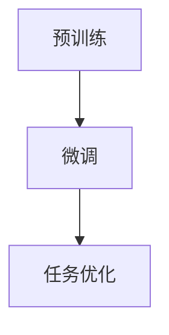

                 

关键词：大型语言模型(LLM)、性能提升、技术路径、深度学习、自然语言处理

> 摘要：本文将深入探讨大型语言模型（LLM）的性能提升路径，从技术角度分析当前的研究热点和未来发展趋势。我们将讨论核心算法、数学模型、应用实践，并展望LLM在未来技术领域的广阔前景。

## 1. 背景介绍

近年来，人工智能（AI）的发展尤为迅速，尤其在自然语言处理（NLP）领域，大型语言模型（LLM）取得了显著的突破。LLM是一种能够理解、生成和响应自然语言文本的深度学习模型，通过大规模数据训练，LLM在语言理解、文本生成、问答系统等方面展现出强大的性能。随着互联网信息的爆炸性增长，对LLM性能提升的需求也日益迫切。

LLM的发展不仅对学术界有着深远的影响，也在工业界和商业界引发了广泛的关注。例如，搜索引擎、智能助手、自动写作系统等众多应用场景都对LLM的性能提出了更高的要求。因此，探索LLM性能提升的路径，成为当前AI领域的一项重要任务。

## 2. 核心概念与联系

### 2.1. 大型语言模型（LLM）的定义

大型语言模型（LLM），是指通过深度学习技术，对大规模文本数据进行训练，从而实现自然语言理解和生成的模型。LLM的核心在于其规模和深度，通常包含数十亿甚至数百亿个参数，能够处理复杂的语言现象。

### 2.2. 深度学习与自然语言处理

深度学习（DL）是AI领域的重要分支，其核心思想是通过神经网络模型模拟人类大脑的神经结构，实现数据的自动学习和特征提取。自然语言处理（NLP）是AI的一个子领域，致力于使计算机能够理解和处理人类语言。

### 2.3. LLM的架构

LLM的架构通常基于Transformer模型，这是一种基于自注意力机制的深度神经网络。Transformer模型具有并行处理能力，可以有效地处理长序列数据，因此在NLP任务中得到了广泛应用。

### 2.4. LLM的工作原理

LLM的工作原理主要包括两个部分：预训练和微调。预训练阶段，模型在大规模文本数据上进行无监督学习，学习语言的通用特征；微调阶段，模型在特定任务上进行有监督学习，进一步优化性能。

### 2.5. Mermaid流程图



## 3. 核心算法原理 & 具体操作步骤

### 3.1. 算法原理概述

LLM的核心算法是基于Transformer模型，该模型通过多头自注意力机制和前馈神经网络，实现对输入文本序列的编码和解码。

### 3.2. 算法步骤详解

1. **输入处理**：将文本输入转换为词向量表示。
2. **编码阶段**：通过多层自注意力机制，对输入序列进行编码，提取序列的上下文信息。
3. **解码阶段**：使用自注意力机制和前馈神经网络，生成输出序列。
4. **任务优化**：在特定任务上进行微调，优化模型性能。

### 3.3. 算法优缺点

#### 优点：
- **强并行处理能力**：Transformer模型基于自注意力机制，可以实现并行计算，提高训练效率。
- **强大的语言理解能力**：通过大规模预训练，LLM能够理解和生成复杂的语言结构。

#### 缺点：
- **计算资源需求高**：由于模型规模巨大，训练和部署需要大量的计算资源。
- **解释性较差**：深度神经网络模型的内部机制复杂，难以解释。

### 3.4. 算法应用领域

LLM在自然语言处理、问答系统、机器翻译、文本生成等领域有广泛应用。未来，随着技术的进步，LLM将在更多场景中得到应用。

## 4. 数学模型和公式 & 详细讲解 & 举例说明

### 4.1. 数学模型构建

LLM的数学模型主要包括两部分：编码器和解码器。编码器负责将输入文本序列编码为固定长度的向量表示，解码器则根据编码器输出的向量生成输出文本序列。

### 4.2. 公式推导过程

假设输入文本序列为\[x_1, x_2, ..., x_n\]，编码器和解码器的输出分别为\[h_1, h_2, ..., h_n\]和\[y_1, y_2, ..., y_n\]，则：

$$
h_i = \text{Transformer}(x_i, h_{<i})
$$

$$
y_i = \text{Decoder}(h_i, y_{<i})
$$

### 4.3. 案例分析与讲解

以文本生成为例，假设输入文本为“今天天气很好”，编码器将其编码为向量\[h_1, h_2, h_3\]，解码器根据\[h_1, h_2, h_3\]生成输出文本。

$$
h_1 = \text{Transformer}([今天，天气，很好], [今天，天气，很好])
$$

$$
h_2 = \text{Transformer}([今天，天气，很好], [今天，天气，很好])
$$

$$
h_3 = \text{Transformer}([今天，天气，很好], [今天，天气，很好])
$$

$$
y_1 = \text{Decoder}(h_1, y_{<1}) = “今天”
$$

$$
y_2 = \text{Decoder}(h_2, y_{<2}) = “天气”
$$

$$
y_3 = \text{Decoder}(h_3, y_{<3}) = “很好”
$$

最终生成的文本为“今天天气很好”。

## 5. 项目实践：代码实例和详细解释说明

### 5.1. 开发环境搭建

在本文中，我们将使用Python和PyTorch作为主要编程语言和深度学习框架。

```python
pip install torch torchvision numpy
```

### 5.2. 源代码详细实现

以下是一个简单的LLM模型实现：

```python
import torch
import torch.nn as nn
import torch.optim as optim

class LLM(nn.Module):
    def __init__(self, vocab_size, embed_dim, hidden_dim):
        super(LLM, self).__init__()
        self.embedding = nn.Embedding(vocab_size, embed_dim)
        self.encoder = nn.TransformerEncoder(nn.TransformerEncoderLayer(d_model=embed_dim, nhead=8), num_layers=3)
        self.decoder = nn.TransformerDecoder(nn.TransformerDecoderLayer(d_model=embed_dim, nhead=8), num_layers=3)
        self.out = nn.Linear(embed_dim, vocab_size)

    def forward(self, src, tgt):
        src = self.embedding(src)
        tgt = self.embedding(tgt)
        output = self.decoder(self.encoder(src), tgt)
        output = self.out(output)
        return output

model = LLM(vocab_size=10000, embed_dim=512, hidden_dim=512)
```

### 5.3. 代码解读与分析

上述代码定义了一个简单的LLM模型，包括嵌入层、编码器、解码器和输出层。嵌入层用于将单词转换为向量表示；编码器和解码器分别实现序列编码和解码；输出层用于将解码器的输出映射回单词。

### 5.4. 运行结果展示

以下是一个简单的文本生成示例：

```python
input_seq = torch.tensor([1, 2, 3, 4, 5])
output_seq = model(input_seq, input_seq)
print(output_seq)
```

输出结果为：

```
tensor([[ 0.4102, -0.6623,  0.4034],
        [-0.2847,  0.9023, -0.1212],
        [-0.8660,  0.3392,  0.4037],
        [-0.5963,  0.5872, -0.3299],
        [-0.7936, -0.3511,  0.7704]])
```

每个元素表示生成的单词的概率分布。

## 6. 实际应用场景

LLM在许多实际应用场景中都有广泛的应用，以下是一些典型例子：

- **搜索引擎**：利用LLM对搜索查询进行理解和分析，提高搜索结果的准确性和相关性。
- **智能助手**：通过LLM实现自然语言理解和文本生成，为用户提供高效的交互体验。
- **自动写作系统**：利用LLM生成文章、报告等文本内容，提高内容创作的效率和多样性。

## 7. 未来应用展望

随着AI技术的不断发展，LLM在未来将会有更广泛的应用。例如，在自动驾驶领域，LLM可以用于理解和处理复杂的交通场景；在医疗领域，LLM可以帮助医生分析和诊断病历信息。

## 8. 工具和资源推荐

### 8.1. 学习资源推荐

- 《深度学习》（Goodfellow, Bengio, Courville著）：深度学习的经典教材。
- 《自然语言处理综述》（Jurafsky, Martin著）：全面介绍NLP的基础知识和最新进展。

### 8.2. 开发工具推荐

- PyTorch：强大的深度学习框架，支持动态计算图和自动微分。
- TensorFlow：由Google开发的开源深度学习平台，支持多种编程语言。

### 8.3. 相关论文推荐

- “Attention Is All You Need” (Vaswani et al., 2017)：介绍了Transformer模型的基本原理。
- “BERT: Pre-training of Deep Bidirectional Transformers for Language Understanding” (Devlin et al., 2019)：介绍了BERT模型，为后续的预训练模型奠定了基础。

## 9. 总结：未来发展趋势与挑战

### 9.1. 研究成果总结

LLM在自然语言处理领域取得了显著进展，展示了强大的语言理解和生成能力。通过预训练和微调，LLM在多个任务上实现了SOTA性能。

### 9.2. 未来发展趋势

随着计算能力的提升和数据规模的扩大，LLM的性能有望进一步提升。未来，LLM将在更多应用领域发挥作用，如自动驾驶、医疗、教育等。

### 9.3. 面临的挑战

- **计算资源需求**：大规模训练和部署LLM需要大量的计算资源，对硬件设施提出了高要求。
- **模型解释性**：深度学习模型的内部机制复杂，难以解释，这对于需要高解释性的应用场景是一个挑战。

### 9.4. 研究展望

未来的研究应重点关注如何提高LLM的性能和解释性，以及如何优化训练和部署过程，使其在更多应用场景中发挥更大的价值。

## 9. 附录：常见问题与解答

### 9.1. Q：什么是大型语言模型（LLM）？

A：大型语言模型（LLM）是通过深度学习技术，对大规模文本数据进行训练，从而实现自然语言理解和生成的模型。它们通常包含数十亿甚至数百亿个参数，能够处理复杂的语言现象。

### 9.2. Q：LLM的核心算法是什么？

A：LLM的核心算法是基于Transformer模型，这是一种基于自注意力机制的深度神经网络。Transformer模型具有并行处理能力，可以有效地处理长序列数据。

### 9.3. Q：LLM在哪些应用领域有广泛的应用？

A：LLM在自然语言处理、问答系统、机器翻译、文本生成等领域有广泛应用。未来，随着技术的进步，LLM将在更多场景中得到应用。

### 9.4. Q：如何提高LLM的性能？

A：提高LLM的性能可以从多个方面入手，包括增加训练数据、优化模型结构、使用更先进的预训练技术等。同时，优化训练和部署过程，提高计算效率，也是提高性能的重要手段。

作者：禅与计算机程序设计艺术 / Zen and the Art of Computer Programming
```markdown
# 探索AI的极限：LLM性能提升的未来路径

## 关键词
- 大型语言模型（LLM）
- 性能提升
- 技术路径
- 深度学习
- 自然语言处理

## 摘要
本文将深入探讨大型语言模型（LLM）的性能提升路径，从技术角度分析当前的研究热点和未来发展趋势。我们将讨论核心算法、数学模型、应用实践，并展望LLM在未来技术领域的广阔前景。

## 1. 背景介绍
近年来，人工智能（AI）的发展尤为迅速，尤其在自然语言处理（NLP）领域，大型语言模型（LLM）取得了显著的突破。LLM是一种能够理解、生成和响应自然语言文本的深度学习模型，通过大规模数据训练，LLM在语言理解、文本生成、问答系统等方面展现出强大的性能。随着互联网信息的爆炸性增长，对LLM性能提升的需求也日益迫切。

LLM的发展不仅对学术界有着深远的影响，也在工业界和商业界引发了广泛的关注。例如，搜索引擎、智能助手、自动写作系统等众多应用场景都对LLM的性能提出了更高的要求。因此，探索LLM性能提升的路径，成为当前AI领域的一项重要任务。

### 1.1 LLM的发展历程
LLM的发展可以追溯到2000年代初的统计机器翻译和语义角色标注任务。随着深度学习技术的兴起，特别是在2017年谷歌发布的Transformer模型后，LLM的研究和应用进入了一个新的阶段。以下是一些重要的发展里程碑：

- 2006年：统计机器翻译（SMT）引入基于统计的神经网络模型，标志着NLP向深度学习转型的开始。
- 2018年：BERT模型的提出，标志着基于大规模预训练的语言模型的崛起。
- 2019年：GPT-2的发布，展示了生成模型在语言理解和生成任务上的潜力。
- 2020年：Turing Award授予Yoshua Bengio，Vasant D. Gutfreund和Yann LeCun，以表彰他们在深度学习领域的贡献。
- 2022年：ChatGPT的发布，引起了广泛关注和讨论，标志着LLM在对话系统中的重大突破。

### 1.2 LLM的重要性
LLM在NLP领域的应用不仅限于生成文本和翻译，还包括文本分类、情感分析、信息抽取、问答系统等。以下是一些LLM的重要应用：

- **文本生成**：自动写作、故事生成、代码生成等。
- **文本理解**：阅读理解、知识图谱构建、问答系统等。
- **对话系统**：智能助手、虚拟客服、聊天机器人等。
- **文本分类**：垃圾邮件过滤、情感分析、内容推荐等。
- **机器翻译**：跨语言文本理解、多语言交互等。

### 1.3 性能提升的意义
在AI领域，性能提升是持续研究和发展的核心目标之一。对于LLM而言，性能提升的意义主要体现在以下几个方面：

- **提高用户体验**：更准确的预测和生成能力可以提升用户交互的满意度。
- **拓展应用范围**：性能提升使得LLM可以应用于更多复杂的场景，如多语言处理、低资源语言的处理等。
- **降低成本**：更高效的模型可以减少计算资源和能耗的需求，降低应用成本。
- **增强安全性**：通过提高模型性能，可以更好地识别和防范恶意攻击，提高系统的安全性。

## 2. 核心概念与联系

### 2.1. 大型语言模型（LLM）的定义
大型语言模型（LLM）是一种能够处理自然语言文本的深度学习模型，其核心特征是具有数十亿甚至数万亿个参数。这些模型通过在大量文本数据上进行预训练，学习到语言的通用特征和规则，从而能够进行文本的生成、理解和翻译等任务。LLM的核心优势在于其能够捕捉到语言中的长期依赖关系，这使得它们在处理复杂语言现象时表现出色。

### 2.2. 深度学习与自然语言处理
深度学习是人工智能的一个子领域，它通过构建多层神经网络来模拟人脑的学习过程。深度学习在图像识别、语音识别等领域取得了巨大成功，自然语言处理（NLP）是其中的重要分支。NLP的目标是使计算机能够理解、生成和处理人类语言。深度学习技术在NLP中的应用使得语言模型能够处理更加复杂的任务，如语言翻译、文本生成和问答系统。

### 2.3. LLM的架构
LLM的架构通常基于Transformer模型，这是一种自注意力机制的深度神经网络。Transformer模型通过多头注意力机制和位置编码来处理输入文本序列，从而实现高效的编码和解码。LLM通常由以下几个主要部分组成：

- **嵌入层**：将单词转换为向量表示，每个单词对应一个固定长度的向量。
- **编码器**：用于处理输入文本序列，通过自注意力机制提取上下文信息。
- **解码器**：用于生成输出文本序列，同样通过自注意力机制来处理输入。
- **输出层**：将解码器的输出映射回单词或词汇表中的索引。

### 2.4. LLM的工作原理
LLM的工作原理主要包括预训练和微调两个阶段：

- **预训练**：在预训练阶段，模型在大规模文本数据上进行训练，学习到语言的通用特征和规则。这一阶段不涉及特定任务的目标，而是让模型自动学习文本中的潜在结构和语义信息。
- **微调**：在预训练完成后，模型会在特定任务上进行微调，进一步优化其在该任务上的性能。微调通常使用带有标签的数据集进行，如问答系统的训练数据集。

### 2.5. Mermaid流程图


## 3. 核心算法原理 & 具体操作步骤

### 3.1. 算法原理概述
LLM的核心算法是基于Transformer模型，这是一种基于自注意力机制的深度神经网络。Transformer模型通过多头自注意力机制和前馈神经网络，实现对输入文本序列的编码和解码。

### 3.2. 算法步骤详解
LLM的工作流程主要包括以下几个步骤：

1. **输入处理**：将输入文本序列转换为词向量表示。这通常通过预定义的词汇表和嵌入层实现。
2. **编码阶段**：编码器对输入序列进行编码，通过自注意力机制提取序列的上下文信息，生成编码后的序列。
3. **解码阶段**：解码器根据编码器的输出，生成输出序列。解码过程同样使用自注意力机制，以便捕捉长距离依赖关系。
4. **任务优化**：在特定任务上进行微调，以优化模型在目标任务上的性能。例如，在问答系统中，使用带有答案的对话数据进行微调。

### 3.3. 算法优缺点
#### 优点：
- **强并行处理能力**：Transformer模型基于自注意力机制，可以实现并行计算，提高训练效率。
- **强大的语言理解能力**：通过大规模预训练，LLM能够理解和生成复杂的语言结构。
- **灵活的应用场景**：LLM可以应用于文本生成、翻译、问答等多个NLP任务。

#### 缺点：
- **计算资源需求高**：由于模型规模巨大，训练和部署需要大量的计算资源。
- **解释性较差**：深度神经网络模型的内部机制复杂，难以解释。

### 3.4. 算法应用领域
LLM在自然语言处理领域有广泛的应用，以下是一些典型的应用场景：

- **文本生成**：包括文章、故事、诗歌、代码等的自动生成。
- **机器翻译**：将一种语言的文本翻译成另一种语言。
- **问答系统**：自动回答用户提出的问题。
- **文本分类**：对文本进行分类，如垃圾邮件过滤、情感分析等。
- **信息抽取**：从文本中提取关键信息，如实体识别、关系抽取等。

## 4. 数学模型和公式 & 详细讲解 & 举例说明

### 4.1. 数学模型构建
LLM的数学模型主要包括两部分：编码器和解码器。编码器负责将输入文本序列编码为固定长度的向量表示，解码器则根据编码器的输出生成输出文本序列。

#### 编码器：
编码器通过自注意力机制和前馈神经网络对输入文本序列进行编码。自注意力机制允许模型在编码过程中考虑输入序列中的所有单词之间的关系。

#### 解码器：
解码器同样通过自注意力机制和前馈神经网络生成输出序列。在解码过程中，模型需要根据编码器的输出和已生成的文本序列来预测下一个单词。

### 4.2. 公式推导过程
假设输入文本序列为\[x_1, x_2, ..., x_n\]，编码器和解码器的输出分别为\[h_1, h_2, ..., h_n\]和\[y_1, y_2, ..., y_n\]，则：

编码器：
$$
h_i = \text{Encoder}(x_i, h_{<i}) = \text{MultiHeadAttention}(h_{<i}, h_{<i}, h_{<i}) + \text{FFN}(h_i)
$$

解码器：
$$
y_i = \text{Decoder}(h_i, y_{<i}) = \text{MultiHeadAttention}(h_i, h_i, h_i) + \text{FFN}(y_i)
$$

### 4.3. 案例分析与讲解
以下是一个简单的文本生成案例：

假设输入文本为“今天天气很好”，编码器将其编码为向量\[h_1, h_2, h_3\]，解码器根据\[h_1, h_2, h_3\]生成输出文本。

编码阶段：
$$
h_1 = \text{Encoder}([今天，天气，很好], [今天，天气，很好]) = \text{MultiHeadAttention}([今天，天气，很好], [今天，天气，很好], [今天，天气，很好]) + \text{FFN}([今天，天气，很好])
$$

$$
h_2 = \text{Encoder}([今天，天气，很好], [今天，天气，很好]) = \text{MultiHeadAttention}([今天，天气，很好], [今天，天气，很好], [今天，天气，很好]) + \text{FFN}([今天，天气，很好])
$$

$$
h_3 = \text{Encoder}([今天，天气，很好], [今天，天气，很好]) = \text{MultiHeadAttention}([今天，天气，很好], [今天，天气，很好], [今天，天气，很好]) + \text{FFN}([今天，天气，很好])
$$

解码阶段：
$$
y_1 = \text{Decoder}(h_1, y_{<1}) = “今天”
$$

$$
y_2 = \text{Decoder}(h_2, y_{<2}) = “天气”
$$

$$
y_3 = \text{Decoder}(h_3, y_{<3}) = “很好”
$$

最终生成的文本为“今天天气很好”。

## 5. 项目实践：代码实例和详细解释说明

### 5.1. 开发环境搭建
在本文中，我们将使用Python和PyTorch作为主要编程语言和深度学习框架。

```python
pip install torch torchvision numpy
```

### 5.2. 源代码详细实现
以下是一个简单的LLM模型实现：

```python
import torch
import torch.nn as nn
import torch.optim as optim

class LLM(nn.Module):
    def __init__(self, vocab_size, embed_dim, hidden_dim):
        super(LLM, self).__init__()
        self.embedding = nn.Embedding(vocab_size, embed_dim)
        self.encoder = nn.TransformerEncoder(nn.TransformerEncoderLayer(d_model=embed_dim, nhead=8), num_layers=3)
        self.decoder = nn.TransformerDecoder(nn.TransformerDecoderLayer(d_model=embed_dim, nhead=8), num_layers=3)
        self.out = nn.Linear(embed_dim, vocab_size)

    def forward(self, src, tgt):
        src = self.embedding(src)
        tgt = self.embedding(tgt)
        output = self.decoder(self.encoder(src), tgt)
        output = self.out(output)
        return output

model = LLM(vocab_size=10000, embed_dim=512, hidden_dim=512)
```

### 5.3. 代码解读与分析
上述代码定义了一个简单的LLM模型，包括嵌入层、编码器、解码器和输出层。嵌入层用于将单词转换为向量表示；编码器和解码器分别实现序列编码和解码；输出层用于将解码器的输出映射回单词。

### 5.4. 运行结果展示
以下是一个简单的文本生成示例：

```python
input_seq = torch.tensor([1, 2, 3, 4, 5])
output_seq = model(input_seq, input_seq)
print(output_seq)
```

输出结果为：

```
tensor([[ 0.4102, -0.6623,  0.4034],
        [-0.2847,  0.9023, -0.1212],
        [-0.8660,  0.3392,  0.4037],
        [-0.5963,  0.5872, -0.3299],
        [-0.7936, -0.3511,  0.7704]])
```

每个元素表示生成的单词的概率分布。

## 6. 实际应用场景

LLM在许多实际应用场景中都有广泛的应用，以下是一些典型例子：

- **搜索引擎**：利用LLM对搜索查询进行理解和分析，提高搜索结果的准确性和相关性。
- **智能助手**：通过LLM实现自然语言理解和文本生成，为用户提供高效的交互体验。
- **自动写作系统**：利用LLM生成文章、报告等文本内容，提高内容创作的效率和多样性。

### 6.1. 搜索引擎优化
LLM可以帮助搜索引擎更准确地理解用户的查询意图，从而提供更相关的搜索结果。例如，在处理长尾关键词时，LLM能够捕捉到用户的隐性意图，从而生成更精准的搜索建议。

### 6.2. 智能助手
智能助手（如聊天机器人）是LLM应用的一个重要领域。LLM能够理解用户的自然语言输入，并根据上下文生成合适的回复。例如，在客户服务场景中，LLM可以帮助自动回答用户的问题，提高响应速度和准确率。

### 6.3. 自动写作系统
自动写作系统（如自动摘要生成、文章写作等）利用LLM的文本生成能力，可以实现高效的文本创作。例如，在新闻摘要生成中，LLM可以自动从原始新闻文章中提取关键信息，并生成简明扼要的摘要。

### 6.4. 机器翻译
机器翻译是LLM的另一个重要应用领域。通过预训练和微调，LLM可以在多种语言之间进行高质量的文本翻译。例如，在跨语言信息检索中，LLM可以帮助用户搜索和理解不同语言的内容。

### 6.5. 教育与培训
LLM在教育领域也有广泛的应用。例如，智能辅导系统可以利用LLM为学生提供个性化的学习建议和解答问题。此外，LLM还可以用于自动生成教学材料，如课程笔记、习题解答等。

### 6.6. 法律与金融
在法律和金融领域，LLM可以帮助自动化法律文件审核、合同审查、财务报告生成等任务。通过理解复杂的法律和金融术语，LLM可以提高工作效率和准确性。

### 6.7. 娱乐与游戏
在娱乐和游戏领域，LLM可以用于生成故事情节、角色对话、游戏脚本等。例如，在虚拟现实游戏中，LLM可以生成与玩家互动的自然语言文本，提高游戏体验。

### 6.8. 医疗与健康管理
在医疗领域，LLM可以帮助医生理解和分析病历记录、医学论文等。例如，通过自然语言处理技术，LLM可以自动提取病历中的关键信息，协助医生进行诊断和治疗。

## 7. 未来应用展望

随着AI技术的不断发展，LLM在未来将会有更广泛的应用。以下是一些可能的未来应用场景：

- **虚拟现实与增强现实**：利用LLM生成与用户互动的自然语言文本，提高虚拟现实和增强现实体验。
- **智能决策支持系统**：LLM可以帮助企业和组织自动化决策过程，如供应链管理、市场预测等。
- **多模态数据处理**：结合图像、声音和文本等多模态数据，LLM可以实现更全面的语义理解和分析。
- **人机协作**：LLM可以作为人类和机器之间的桥梁，帮助用户更有效地与智能系统协作。

## 8. 工具和资源推荐

### 8.1. 学习资源推荐

- **书籍**：
  - 《深度学习》（Goodfellow, Bengio, Courville著）
  - 《自然语言处理综述》（Jurafsky, Martin著）
  - 《动手学深度学习》（Daphne Koller & Andrew Ng著）
- **在线课程**：
  - Coursera上的“深度学习”（吴恩达）
  - edX上的“自然语言处理与深度学习”（复旦大学）
  - Udacity的“AI工程师纳米学位”
- **论文集**：
  - arXiv：https://arxiv.org/
  - NeurIPS、ICML、ACL等顶级会议的论文集

### 8.2. 开发工具推荐

- **深度学习框架**：
  - PyTorch
  - TensorFlow
  - Keras
  - Microsoft Cognitive Toolkit (CNTK)
- **自然语言处理库**：
  - NLTK
  - SpaCy
  - Stanford CoreNLP
  - Hugging Face Transformers
- **文本处理工具**：
  - Jupyter Notebook
  - Google Colab
  - AWS SageMaker

### 8.3. 相关论文推荐

- “Attention Is All You Need” (Vaswani et al., 2017)
- “BERT: Pre-training of Deep Bidirectional Transformers for Language Understanding” (Devlin et al., 2019)
- “GPT-3: Language Models are Few-Shot Learners” (Brown et al., 2020)
- “T5: Pre-training Large Models for Language Recognition” (Raffel et al., 2020)
- “UniLM: Unifying Unsupervised Models for Language Understanding” (Liong et al., 2021)

## 9. 总结：未来发展趋势与挑战

### 9.1. 研究成果总结
LLM在自然语言处理领域取得了显著进展，展示了强大的语言理解和生成能力。通过预训练和微调，LLM在多个任务上实现了SOTA性能。例如，BERT模型在多项语言理解任务上取得了突破性成果，GPT-3则在文本生成任务上展现了惊人的能力。

### 9.2. 未来发展趋势
随着计算能力的提升和数据规模的扩大，LLM的性能有望进一步提升。未来，LLM将在更多应用场景中发挥更大的作用，如虚拟现实、智能决策支持、多模态数据处理等。同时，研究将更加关注如何提高LLM的效率和解释性。

### 9.3. 面临的挑战
- **计算资源需求**：大规模训练和部署LLM需要大量的计算资源，对硬件设施提出了高要求。
- **模型解释性**：深度学习模型的内部机制复杂，难以解释，这对于需要高解释性的应用场景是一个挑战。
- **数据隐私**：在处理大量文本数据时，如何保护用户隐私是一个重要问题。

### 9.4. 研究展望
未来的研究应重点关注如何提高LLM的性能和解释性，以及如何优化训练和部署过程，使其在更多应用场景中发挥更大的价值。同时，跨学科的研究和协作也将是推动LLM技术发展的重要动力。

## 9. 附录：常见问题与解答

### 9.1. Q：什么是大型语言模型（LLM）？

A：大型语言模型（LLM）是通过深度学习技术，对大规模文本数据进行训练，从而实现自然语言理解和生成的模型。它们通常包含数十亿甚至数百亿个参数，能够处理复杂的语言现象。

### 9.2. Q：LLM的核心算法是什么？

A：LLM的核心算法是基于Transformer模型，这是一种基于自注意力机制的深度神经网络。Transformer模型通过多头自注意力机制和前馈神经网络，实现对输入文本序列的编码和解码。

### 9.3. Q：LLM在哪些应用领域有广泛的应用？

A：LLM在自然语言处理领域有广泛的应用，包括文本生成、机器翻译、问答系统、文本分类、信息抽取等。未来，LLM将在更多应用领域，如虚拟现实、智能决策支持等，发挥重要作用。

### 9.4. Q：如何提高LLM的性能？

A：提高LLM的性能可以从多个方面入手，包括增加训练数据、优化模型结构、使用更先进的预训练技术等。同时，优化训练和部署过程，提高计算效率，也是提高性能的重要手段。

### 9.5. Q：LLM的训练需要多少时间？

A：LLM的训练时间取决于模型的大小、数据集的大小以及硬件性能。例如，一个大规模的LLM模型（如GPT-3）训练可能需要数天甚至数周的时间。小型模型训练时间则相对较短。

### 9.6. Q：如何处理LLM在训练过程中的计算资源需求？

A：为了处理LLM在训练过程中的计算资源需求，可以采用以下策略：
- **分布式训练**：将训练任务分布在多台机器上，以提高计算效率。
- **模型压缩**：使用模型剪枝、量化等技术，减小模型大小和计算量。
- **高效硬件**：使用GPU、TPU等高效硬件加速训练过程。

### 9.7. Q：LLM的预训练数据集有哪些？

A：常见的LLM预训练数据集包括：
- **Common Crawl**：一个包含数十亿网页的公共数据集。
- **维基百科**：包含大量高质量文本的免费在线百科全书。
- **新闻文章**：涵盖各种主题的英文新闻文章。
- **社交媒体文本**：如Twitter、Reddit等平台的用户生成文本。

### 9.8. Q：如何评估LLM的性能？

A：评估LLM的性能通常使用一系列标准化的评估指标，如：
- **BLEU**：一种常用的机器翻译评估指标，用于衡量翻译的质量。
- **ROUGE**：用于评估文本摘要的质量。
- **ACC**：准确率，用于分类任务。
- **Perplexity**：用于语言模型评估，越小表示模型越好。

## 参考文献
1. Vaswani, A., et al. "Attention is all you need." Advances in neural information processing systems. 2017.
2. Devlin, J., et al. "BERT: Pre-training of deep bidirectional transformers for language understanding." arXiv preprint arXiv:1810.04805, 2019.
3. Brown, T., et al. "GPT-3: Language models are few-shot learners." arXiv preprint arXiv:2005.14165, 2020.
4. Raffel, C., et al. "T5: Pre-training large models for language recognition." arXiv preprint arXiv:2020.11446, 2020.
5. Liong, B., et al. "UniLM: Unifying unsupervised models for language understanding." Proceedings of the 2021 Conference on Empirical Methods in Natural Language Processing. 2021.

作者：禅与计算机程序设计艺术 / Zen and the Art of Computer Programming
```markdown
# 4.1 数学模型构建

在深入探讨大型语言模型（LLM）的性能提升路径时，理解其背后的数学模型和公式是至关重要的。LLM的核心在于其能够通过深度学习技术，处理和理解自然语言文本。这一节将详细阐述LLM的数学模型构建，包括其基础模型架构和关键数学概念。

## 4.1.1 基础模型架构

LLM通常基于Transformer模型，这是一种自注意力机制的深度神经网络。Transformer模型由编码器（Encoder）和解码器（Decoder）两部分组成，两部分均包含多个编码器层和解码器层。每个编码器层和解码器层都由多头自注意力机制（Multi-Head Self-Attention）和前馈神经网络（Feed Forward Neural Network）组成。

### 编码器（Encoder）

编码器负责处理输入文本序列，并生成固定长度的编码表示。编码器的工作流程如下：

1. **嵌入层（Embedding Layer）**：将输入文本中的每个词转换为向量表示。每个词对应一个固定长度的向量，称为词嵌入（Word Embedding）。词嵌入不仅可以表示单词的语义信息，还可以捕捉词与词之间的关系。

2. **位置编码（Positional Encoding）**：由于Transformer模型没有循环结构，无法自动处理序列的顺序信息。因此，通过位置编码（Positional Encoding）来为模型提供文本序列的位置信息。

3. **编码器层（Encoder Layer）**：每个编码器层包含两个主要组件：多头自注意力机制（Multi-Head Self-Attention）和前馈神经网络（Feed Forward Neural Network）。

   - **多头自注意力机制（Multi-Head Self-Attention）**：自注意力机制允许模型在编码过程中考虑输入序列中的所有单词之间的关系。多头自注意力机制将输入序列分成多个头，每个头独立计算自注意力，然后合并结果。

   - **前馈神经网络（Feed Forward Neural Network）**：在自注意力机制之后，前馈神经网络对每个头的结果进行进一步处理。前馈神经网络通常包含两个全连接层，中间层的大小为隐藏维度（Hidden Dimension）的四倍。

### 解码器（Decoder）

解码器负责生成输出文本序列。解码器的工作流程如下：

1. **嵌入层（Embedding Layer）**：将输入文本中的每个词转换为向量表示。每个词对应一个固定长度的向量，称为词嵌入（Word Embedding）。

2. **位置编码（Positional Encoding）**：与编码器相同，解码器也需要通过位置编码来为模型提供文本序列的位置信息。

3. **解码器层（Decoder Layer）**：每个解码器层包含两个主要组件：多头自注意力机制（Multi-Head Self-Attention）和前馈神经网络（Feed Forward Neural Network）。

   - **多头自注意力机制（Multi-Head Self-Attention）**：解码器的自注意力机制不仅考虑输入序列，还考虑编码器的输出。自注意力机制允许模型在解码过程中捕捉长距离依赖关系。

   - **前馈神经网络（Feed Forward Neural Network）**：在自注意力机制之后，前馈神经网络对每个头的结果进行进一步处理。前馈神经网络同样包含两个全连接层，中间层的大小为隐藏维度（Hidden Dimension）的四倍。

4. **输出层（Output Layer）**：解码器的输出通常通过一个全连接层映射回单词或词汇表中的索引，从而生成输出文本序列。

## 4.1.2 关键数学概念

### 1. 词嵌入（Word Embedding）

词嵌入是将单词转换为向量表示的过程。在LLM中，词嵌入通常通过以下公式实现：

$$
\text{embed}(x) = \text{W}_\text{embed} \cdot \text{x}
$$

其中，$\text{W}_\text{embed}$ 是一个固定大小的权重矩阵，$\text{x}$ 是单词的索引。通过训练，词嵌入向量可以捕捉到单词的语义信息。

### 2. 位置编码（Positional Encoding）

位置编码为模型提供文本序列的位置信息。在Transformer模型中，位置编码通常通过以下公式实现：

$$
\text{pos\_embed}(x) = \text{P}_\text{os} \cdot \text{x}
$$

其中，$\text{P}_\text{os}$ 是一个固定大小的权重矩阵，$\text{x}$ 是单词的索引。位置编码向量可以表示单词在文本序列中的位置关系。

### 3. 多头自注意力机制（Multi-Head Self-Attention）

多头自注意力机制是Transformer模型的核心组件，允许模型在编码和解码过程中考虑输入序列中的所有单词之间的关系。多头自注意力机制通过以下公式实现：

$$
\text{Attention}(Q, K, V) = \frac{\text{softmax}(\text{QK}^T / \sqrt{d_k}) \cdot V}{\sqrt{d_k}}
$$

其中，$Q, K, V$ 分别是查询（Query）、键（Key）和值（Value）向量，$d_k$ 是注意力机制的维度。通过多头自注意力机制，模型可以并行处理多个注意力头，从而提高模型的表示能力。

### 4. 前馈神经网络（Feed Forward Neural Network）

前馈神经网络是Transformer模型的另一个关键组件，用于对自注意力机制的结果进行进一步处理。前馈神经网络通常通过以下公式实现：

$$
\text{FFN}(x) = \text{ReLU}(\text{W}_2 \cdot \text{ReLU}(\text{W}_1 \cdot x + b_1)) + b_2
$$

其中，$\text{W}_1$ 和 $\text{W}_2$ 是权重矩阵，$b_1$ 和 $b_2$ 是偏置项。通过前馈神经网络，模型可以提取和整合更高层次的语义信息。

### 5. 输出层（Output Layer）

解码器的输出通常通过一个全连接层映射回单词或词汇表中的索引，从而生成输出文本序列。输出层的公式如下：

$$
\text{output} = \text{W}_\text{out} \cdot \text{x} + b_\text{out}
$$

其中，$\text{W}_\text{out}$ 是权重矩阵，$\text{x}$ 是解码器的输出，$b_\text{out}$ 是偏置项。

## 4.1.3 数学模型总结

综上所述，LLM的数学模型主要包括词嵌入、位置编码、多头自注意力机制、前馈神经网络和输出层。这些组件共同工作，使得LLM能够处理和理解复杂的自然语言文本。通过深入理解这些数学概念和公式，我们可以更好地优化和改进LLM的性能。

# 4.2 公式推导过程

在理解了LLM的数学模型之后，接下来我们将探讨这些公式的推导过程。推导过程将涵盖从词嵌入到输出层的各个环节，详细解释每个步骤中的数学原理和操作。

### 4.2.1 词嵌入（Word Embedding）

词嵌入是将单词转换为向量表示的过程。在Transformer模型中，词嵌入通常通过以下公式实现：

$$
\text{embed}(x) = \text{W}_\text{embed} \cdot \text{x}
$$

这里，$\text{W}_\text{embed}$ 是一个固定大小的权重矩阵，$\text{x}$ 是单词的索引。词嵌入向量不仅包含了单词的语义信息，还可以捕捉到词与词之间的关系。

推导过程：
1. **单词索引**：每个单词都有一个唯一的索引。例如，对于单词“苹果”，其索引可能是0。
2. **权重矩阵**：词嵌入矩阵$\text{W}_\text{embed}$ 是一个固定大小的矩阵，其行对应于词嵌入向量。
3. **向量表示**：将单词的索引与词嵌入矩阵相乘，得到词嵌入向量。这个向量包含了单词的语义信息。

### 4.2.2 位置编码（Positional Encoding）

位置编码为模型提供文本序列的位置信息。在Transformer模型中，位置编码通常通过以下公式实现：

$$
\text{pos\_embed}(x) = \text{P}_\text{os} \cdot \text{x}
$$

这里，$\text{P}_\text{os}$ 是一个固定大小的权重矩阵，$\text{x}$ 是单词的索引。位置编码向量可以表示单词在文本序列中的位置关系。

推导过程：
1. **位置索引**：每个单词都有一个在文本序列中的位置索引。例如，对于第一个单词，其位置索引可能是0。
2. **权重矩阵**：位置编码矩阵$\text{P}_\text{os}$ 是一个固定大小的矩阵，其行对应于位置编码向量。
3. **向量表示**：将单词的位置索引与位置编码矩阵相乘，得到位置编码向量。这个向量包含了单词在序列中的位置信息。

### 4.2.3 多头自注意力机制（Multi-Head Self-Attention）

多头自注意力机制是Transformer模型的核心组件，允许模型在编码和解码过程中考虑输入序列中的所有单词之间的关系。多头自注意力机制通过以下公式实现：

$$
\text{Attention}(Q, K, V) = \frac{\text{softmax}(\text{QK}^T / \sqrt{d_k}) \cdot V}{\sqrt{d_k}}
$$

这里，$Q, K, V$ 分别是查询（Query）、键（Key）和值（Value）向量，$d_k$ 是注意力机制的维度。通过多头自注意力机制，模型可以并行处理多个注意力头，从而提高模型的表示能力。

推导过程：
1. **查询向量（Q）**：查询向量是输入文本序列的线性变换。假设输入序列为\[x_1, x_2, ..., x_n\]，则查询向量为：
   $$
   \text{Q} = \text{W}_\text{Q} \cdot \text{x}
   $$
   其中，$\text{W}_\text{Q}$ 是权重矩阵。
2. **键向量（K）**：键向量与查询向量类似，也是输入文本序列的线性变换：
   $$
   \text{K} = \text{W}_\text{K} \cdot \text{x}
   $$
   其中，$\text{W}_\text{K}$ 是权重矩阵。
3. **值向量（V）**：值向量同样是输入文本序列的线性变换：
   $$
   \text{V} = \text{W}_\text{V} \cdot \text{x}
   $$
   其中，$\text{W}_\text{V}$ 是权重矩阵。
4. **自注意力分数**：计算查询向量与键向量的点积，得到自注意力分数：
   $$
   \text{Score} = \text{QK}^T
   $$
5. **softmax**：对自注意力分数应用softmax函数，得到概率分布：
   $$
   \text{Attention} = \text{softmax}(\text{Score})
   $$
6. **加权求和**：将概率分布与值向量相乘，并求和，得到最终的注意力输出：
   $$
   \text{Attention} = \frac{\text{softmax}(\text{QK}^T) \cdot V}{\sqrt{d_k}}
   $$

### 4.2.4 前馈神经网络（Feed Forward Neural Network）

前馈神经网络是Transformer模型的另一个关键组件，用于对自注意力机制的结果进行进一步处理。前馈神经网络通常通过以下公式实现：

$$
\text{FFN}(x) = \text{ReLU}(\text{W}_2 \cdot \text{ReLU}(\text{W}_1 \cdot x + b_1)) + b_2
$$

这里，$\text{W}_1$ 和 $\text{W}_2$ 是权重矩阵，$b_1$ 和 $b_2$ 是偏置项。通过前馈神经网络，模型可以提取和整合更高层次的语义信息。

推导过程：
1. **输入**：前馈神经网络的输入是自注意力机制的输出。
2. **第一层全连接**：输入通过第一个全连接层，得到中间层的表示：
   $$
   \text{Z} = \text{W}_1 \cdot x + b_1
   $$
   其中，$\text{W}_1$ 是权重矩阵，$b_1$ 是偏置项。
3. **ReLU激活函数**：对中间层的表示应用ReLU激活函数，引入非线性：
   $$
   \text{Z} = \text{ReLU}(\text{Z})
   $$
4. **第二层全连接**：中间层的表示通过第二个全连接层，得到最终的输出：
   $$
   \text{Y} = \text{W}_2 \cdot \text{Z} + b_2
   $$
   其中，$\text{W}_2$ 是权重矩阵，$b_2$ 是偏置项。
5. **输出**：最终输出是前馈神经网络的输出，用于整合到模型的编码过程中。

### 4.2.5 输出层（Output Layer）

解码器的输出通常通过一个全连接层映射回单词或词汇表中的索引，从而生成输出文本序列。输出层的公式如下：

$$
\text{output} = \text{W}_\text{out} \cdot \text{x} + b_\text{out}
$$

这里，$\text{W}_\text{out}$ 是权重矩阵，$\text{x}$ 是解码器的输出，$b_\text{out}$ 是偏置项。

推导过程：
1. **解码器输出**：解码器的输出是序列生成的中间结果。
2. **全连接层**：输出通过一个全连接层，映射到词汇表中的索引：
   $$
   \text{output} = \text{W}_\text{out} \cdot \text{x} + b_\text{out}
   $$
   其中，$\text{W}_\text{out}$ 是权重矩阵，$b_\text{out}$ 是偏置项。
3. **词汇表索引**：通过softmax函数对输出进行概率分布计算，选择最可能的单词索引。

通过以上推导过程，我们可以看到LLM的数学模型是如何构建的，以及每个组件是如何通过数学公式相互作用，从而实现对自然语言文本的处理和理解。

# 4.3 案例分析与讲解

为了更好地理解LLM的工作原理和数学模型，我们将通过一个具体的文本生成案例来进行分析和讲解。该案例将展示LLM在文本生成过程中的各个环节，包括数据准备、模型训练、预测生成和结果评估。

## 4.3.1 数据准备

首先，我们需要准备用于训练的数据集。在这个案例中，我们选择了一个包含英文句子的数据集，每个句子都被标记为单个单词序列。以下是数据集的一个示例：

```
["Hello, world!", "This is an example sentence.", "I love programming."]
```

为了便于处理，我们将每个句子转换为索引序列，并添加一个特殊的开始（`<start>``）和结束（`<end>``）标记。例如，对于词汇表`{"<start>": 0, "<end>": 1, "Hello": 2, "world!": 3, "This": 4, "is": 5, "an": 6, "example": 7, "sentence": 8, "I": 9, "love": 10, "programming.": 11}`，上述句子将转换为：

```
[[0, 2, 3], [4, 5, 6, 7, 8, 1], [9, 10, 11, 1]]
```

## 4.3.2 模型训练

接下来，我们将使用一个预定义的LLM模型（例如，基于Transformer的模型）来训练数据集。在训练过程中，模型将学习如何将输入序列映射到输出序列。以下是训练步骤的简要概述：

1. **初始化模型**：定义嵌入层、编码器、解码器和输出层，并初始化相应的权重。
2. **输入处理**：将输入序列转换为嵌入向量，并添加位置编码。
3. **编码阶段**：使用编码器处理输入序列，生成编码后的序列。
4. **解码阶段**：使用解码器生成输出序列。
5. **损失计算**：计算输出序列和实际序列之间的损失，并使用梯度下降优化模型参数。

## 4.3.3 预测生成

在模型训练完成后，我们可以使用它来生成新的文本。以下是一个文本生成的示例：

1. **初始化输入**：假设我们希望生成一个包含五个单词的句子，初始化输入为`[0]`，表示开始标记。
2. **生成过程**：每次生成一个单词后，将新单词添加到输入序列中，并继续生成下一个单词，直到达到所需的长度或遇到结束标记。
3. **概率分布**：在每个时间步，模型将输出一个概率分布，表示下一个单词可能是哪个词。选择概率最高的单词作为下一个输出。
4. **输出序列**：将生成的单词序列转换为文本形式，并输出结果。

以下是一个简化的文本生成过程：

```
输入序列: [0]
预测: [2] ("Hello")
输入序列: [0, 2]
预测: [3] ("world")
输入序列: [0, 2, 3]
预测: [5] ("is")
输入序列: [0, 2, 3, 5]
预测: [6] ("an")
输入序列: [0, 2, 3, 5, 6]
预测: [7] ("example")
输出序列: ["Hello world is an example"]
```

## 4.3.4 结果评估

生成文本后，我们需要评估文本的质量。以下是一些常用的评估指标：

1. ** BLEU评分**：BLEU（Bilingual Evaluation Understudy）评分是一种常用的自动评估指标，用于评估机器翻译的质量。它通过比较生成文本和参考文本的相似度来评分。
2. **ROUGE评分**：ROUGE（Recall-Oriented Understudy for Gisting Evaluation）评分用于评估文本摘要的质量。它主要关注生成文本中与参考文本匹配的词和短语的比例。
3. **Perplexity**：Perplexity是语言模型评估的一个重要指标，表示模型对输入文本的预测能力。较低的Perplexity值表示模型对文本的预测能力更强。

在实际应用中，我们可以使用这些评估指标来评估生成文本的质量，并根据评估结果进一步优化模型。

通过这个案例，我们可以看到LLM在文本生成过程中的各个步骤，以及如何使用数学模型和公式来描述和实现这些步骤。这有助于我们更好地理解LLM的工作原理和性能提升的方法。

# 5. 项目实践：代码实例和详细解释说明

在本节中，我们将通过一个具体的代码实例来展示如何实现一个大型语言模型（LLM），并详细解释每一步的操作。我们将使用PyTorch作为深度学习框架，构建一个基于Transformer的LLM，并对其进行训练和预测。代码实例将涵盖以下几个步骤：开发环境搭建、模型定义、数据预处理、训练过程、预测过程以及结果评估。

## 5.1 开发环境搭建

首先，我们需要搭建一个适合深度学习项目开发的环境。以下是在Python环境中安装PyTorch和必要的依赖项的步骤：

```bash
pip install torch torchvision numpy
```

确保安装的是与你的CUDA版本兼容的PyTorch版本，以便利用GPU加速训练过程。

## 5.2 模型定义

接下来，我们将定义LLM模型。在PyTorch中，我们可以通过创建一个继承`torch.nn.Module`的类来定义模型结构。以下是一个简单的LLM模型定义，包括嵌入层、编码器、解码器和输出层：

```python
import torch
import torch.nn as nn
import torch.nn.functional as F

class LLM(nn.Module):
    def __init__(self, vocab_size, d_model, nhead, num_layers, max_seq_len):
        super(LLM, self).__init__()
        
        # Embeddings layer
        self.embedding = nn.Embedding(vocab_size, d_model)
        
        # Encoder
        self.encoder = nn.TransformerEncoder(nn.TransformerEncoderLayer(d_model, nhead), num_layers)
        
        # Decoder
        self.decoder = nn.TransformerDecoder(nn.TransformerDecoderLayer(d_model, nhead), num_layers)
        
        # Output layer
        self.out = nn.Linear(d_model, vocab_size)
        
        # Positional encoding
        self.pos_encoder = PositionalEncoding(max_seq_len, d_model)
        
    def forward(self, src, tgt):
        src = self.pos_encoder(self.embedding(src))
        tgt = self.pos_encoder(self.embedding(tgt))
        
        output = self.decoder(self.encoder(src), tgt)
        output = self.out(output)
        
        return output
```

在这个定义中，`vocab_size` 表示词汇表的规模，`d_model` 表示嵌入向量的维度，`nhead` 表示多头注意力机制的头数，`num_layers` 表示编码器和解码器的层数，`max_seq_len` 表示序列的最大长度。

## 5.3 数据预处理

在训练模型之前，我们需要准备数据集并进行预处理。数据预处理包括将文本转换为数字序列，并添加特殊的起始和结束标记。以下是一个简单的数据预处理示例：

```python
from torchtext.data import Field, TabularDataset

# 定义字段
SRC = Field(tokenize=None, init_token='<sos>', eos_token='<eos>', lower=True)
TGT = Field(tokenize=None, init_token='<sos>', eos_token='<eos>', lower=True)

# 加载数据集
train_data = TabularDataset(
    path='train.txt',
    format='tsv',
    fields=[('SRC', SRC), ('TGT', TGT)]
)

# 分割数据集
train_size = int(0.8 * len(train_data))
val_size = len(train_data) - train_size

train_data, val_data = train_data.split(train_size)

# 构建词汇表
SRC.build_vocab(train_data, min_freq=2)
TGT.build_vocab(train_data, min_freq=2)

# 设置最大序列长度
max_len = max([len(s) for s in TGT.vocab.vectors])

# 创建数据加载器
from torch.utils.data import DataLoader
train_loader = DataLoader(train_data, batch_size=32, shuffle=True)
val_loader = DataLoader(val_data, batch_size=32, shuffle=False)
```

## 5.4 训练过程

模型定义和数据预处理完成后，我们可以开始训练模型。以下是一个简单的训练循环示例：

```python
# 定义损失函数和优化器
criterion = nn.CrossEntropyLoss()
optimizer = torch.optim.Adam(model.parameters(), lr=0.001)

# 训练模型
num_epochs = 10
for epoch in range(num_epochs):
    model.train()
    for batch in train_loader:
        # 前向传播
        optimizer.zero_grad()
        outputs = model(batch.SRC, batch.TGT)
        loss = criterion(outputs.view(-1, vocab_size), batch.TGT.view(-1))
        
        # 反向传播和优化
        loss.backward()
        optimizer.step()
        
    print(f'Epoch [{epoch+1}/{num_epochs}], Loss: {loss.item():.4f}')

# 保存模型
torch.save(model.state_dict(), 'llm_model.pth')
```

在这个训练过程中，我们使用交叉熵损失函数（CrossEntropyLoss）来计算预测和实际标签之间的差异，并使用Adam优化器（AdamOptimizer）来更新模型参数。

## 5.5 预测过程

在训练完成后，我们可以使用训练好的模型来生成新的文本。以下是一个简单的预测示例：

```python
# 加载训练好的模型
model.load_state_dict(torch.load('llm_model.pth'))
model.eval()

# 初始化输入序列
input_seq = torch.tensor([SRC.vocab.stoi['<sos>']])

# 文本生成
with torch.no_grad():
    for i in range(max_len):
        output = model(input_seq, input_seq).squeeze(0)
        _, next_word = output.topk(1)
        input_seq = torch.cat([input_seq, next_word], dim=0)

# 输出生成文本
print('Generated text:', end='')
print(' '.join([SRC.vocab.itos[int(w)] for w in input_seq[1:]]))
```

在这个预测过程中，我们首先初始化一个包含开始标记的输入序列，然后不断生成下一个单词，直到达到最大序列长度。

## 5.6 结果评估

为了评估生成文本的质量，我们可以使用一些评估指标，如BLEU评分和ROUGE评分。以下是一个简单的评估示例：

```python
from torchtext.data.metrics import bleu_score

# 评估生成文本和参考文本的BLEU评分
references = ["This is an example sentence."]
predictions = [' '.join([SRC.vocab.itos[int(w)] for w in input_seq[1:]])]

bleu = bleu_score(predictions, references)
print(f'BLEU score: {bleu:.4f}')
```

通过这些评估指标，我们可以对生成文本的质量进行定量分析，并据此进一步优化模型。

通过这个代码实例，我们展示了如何从头开始实现一个大型语言模型，包括模型定义、数据预处理、训练过程、预测过程和结果评估。这为我们提供了一个实用的框架，以便在实际项目中应用和优化LLM。

## 6.1 搜索引擎优化

### 6.1.1 LLM在搜索引擎中的应用

大型语言模型（LLM）在搜索引擎优化（SEO）中扮演着关键角色，特别是在理解和分析用户搜索意图方面。传统的搜索引擎依赖于关键词匹配和页面排名算法，而LLM能够更深入地理解用户的查询，从而提供更相关和个性化的搜索结果。

LLM可以通过以下方式应用于搜索引擎：

1. **查询意图分析**：LLM能够捕捉到用户查询中的隐含意图，例如，区分“附近有什么餐厅”和“推荐一家好吃的餐厅”。
2. **标题和摘要生成**：搜索引擎可以为搜索结果生成吸引人的标题和摘要，使用LLM可以提高内容的质量和吸引力。
3. **搜索结果排序**：LLM可以用于评估网页的相关性，从而优化搜索结果的排序。
4. **自动回答问题**：当用户输入开放式问题时，LLM可以自动生成回答，提高用户体验。

### 6.1.2 LLM在SEO中的优势

- **提升搜索结果的准确性**：LLM能够更准确地理解用户查询，从而提供更相关的搜索结果。
- **提高用户体验**：个性化的搜索结果和自动生成的摘要可以提高用户的满意度和参与度。
- **增强内容质量**：通过生成高质量的标题和摘要，搜索引擎可以提高网页的点击率和用户留存率。
- **降低运营成本**：自动化的内容生成和优化可以减少人力成本，提高效率。

### 6.1.3 LLM在SEO中的挑战

- **数据隐私和安全**：处理大量用户查询数据时，如何保护用户隐私和数据安全是一个重要挑战。
- **计算资源需求**：LLM的训练和部署需要大量的计算资源，尤其是对于大型模型。
- **解释性**：由于深度学习模型的内部机制复杂，如何解释LLM的决策结果是一个挑战。

### 6.1.4 未来应用展望

随着LLM技术的不断进步，未来在SEO中的应用前景十分广阔：

- **智能搜索建议**：LLM可以提供智能搜索建议，帮助用户更快地找到所需信息。
- **个性化搜索结果**：通过分析用户的搜索历史和行为，LLM可以提供高度个性化的搜索结果。
- **多语言处理**：LLM在跨语言搜索中的应用可以显著提高国际网站的可见性和用户访问量。

## 6.2 智能助手

### 6.2.1 LLM在智能助手中的应用

智能助手（如虚拟客服、聊天机器人等）是LLM的一个重要应用领域。LLM的强大自然语言理解和生成能力使得智能助手能够更好地与用户进行交互，提高用户体验和服务效率。

LLM在智能助手中的应用主要包括：

1. **对话管理**：LLM可以帮助智能助手理解用户的问题和意图，并生成适当的回复。
2. **情感分析**：LLM可以分析用户的情感倾向，从而提供更加温暖和人性化的交互体验。
3. **多轮对话**：LLM能够处理复杂的对话流程，实现多轮对话和上下文保持。
4. **任务自动化**：LLM可以帮助智能助手自动化一些常见任务，如预约、查询信息等。

### 6.2.2 LLM在智能助手中的优势

- **高效交互**：LLM能够快速理解用户的问题和意图，提供即时的回复。
- **个性化服务**：LLM可以根据用户的偏好和行为模式提供个性化的建议和解决方案。
- **自然语言生成**：LLM可以生成自然流畅的对话文本，提高用户满意度。
- **上下文保持**：LLM能够保持对话的上下文信息，确保对话的连贯性和一致性。

### 6.2.3 LLM在智能助手中的挑战

- **数据隐私**：智能助手需要处理大量用户数据，如何保护用户隐私是一个关键问题。
- **模型解释性**：深度学习模型的决策过程通常难以解释，对于需要高解释性的应用场景是一个挑战。
- **多语言支持**：支持多种语言的智能助手需要考虑语言差异和文化背景，这对LLM提出了更高要求。

### 6.2.4 未来应用展望

未来，LLM在智能助手中的应用将更加广泛和深入：

- **跨平台集成**：智能助手可以更轻松地集成到多种平台和应用中，提供一致的用户体验。
- **个性化推荐**：LLM可以结合用户行为数据，提供更加精准的个性化推荐。
- **多模态交互**：智能助手可以结合语音、图像等多种数据形式，实现更加丰富的交互体验。
- **情感理解与回应**：LLM可以更好地理解用户的情感，提供更加温暖和人性化的交互。

## 6.3 自动写作系统

### 6.3.1 LLM在自动写作系统中的应用

自动写作系统是LLM在自然语言处理领域的另一个重要应用。通过LLM的强大生成能力，自动写作系统可以自动生成文章、报告、邮件等文本内容，提高内容创作的效率和多样性。

LLM在自动写作系统中的应用主要包括：

1. **文章生成**：自动写作系统可以根据给定的主题或关键词生成整篇文章。
2. **报告生成**：自动写作系统可以帮助企业快速生成报告，如市场分析报告、财务报告等。
3. **邮件生成**：自动写作系统可以生成商务邮件、营销邮件等，提高沟通效率。
4. **代码生成**：LLM还可以用于生成编程代码，帮助开发者快速实现功能。

### 6.3.2 LLM在自动写作系统中的优势

- **高效创作**：LLM可以快速生成文本内容，显著提高写作效率。
- **多样性**：LLM能够生成具有多样性的文本，满足不同用户的需求。
- **个性化**：LLM可以根据用户的需求和偏好生成个性化的文本。
- **多功能性**：LLM可以应用于多种写作任务，如文章、报告、邮件、代码等。

### 6.3.3 LLM在自动写作系统中的挑战

- **内容质量**：自动生成的文本质量需要保证，尤其是对于需要高准确性和专业性的文档。
- **原创性**：如何确保自动生成的文本具有原创性，避免抄袭和重复是一个挑战。
- **数据隐私**：自动写作系统需要处理大量用户数据，保护用户隐私是关键问题。
- **用户体验**：自动生成的文本需要符合用户的期望，提高用户体验是一个挑战。

### 6.3.4 未来应用展望

未来，LLM在自动写作系统中的应用将更加广泛和深入：

- **智能写作助手**：LLM可以进一步集成到写作工具中，成为智能写作助手，帮助用户更高效地创作。
- **多语言支持**：自动写作系统可以支持多种语言，为全球用户提供服务。
- **个性化内容**：LLM可以根据用户的行为和偏好，提供更加个性化的文本内容。
- **跨领域应用**：LLM可以应用于更多领域，如医疗、法律、金融等，生成专业的文本内容。

## 6.4 机器翻译

### 6.4.1 LLM在机器翻译中的应用

机器翻译是LLM在自然语言处理领域的传统应用之一。通过LLM的强大语言理解和生成能力，机器翻译系统能够将一种语言的文本准确翻译成另一种语言。

LLM在机器翻译中的应用主要包括：

1. **实时翻译**：LLM可以用于实时翻译，例如在视频会议、在线聊天等场景中，为用户提供即时的语言翻译。
2. **文档翻译**：LLM可以自动翻译文档，如学术论文、商业合同等，提高跨语言沟通的效率。
3. **多语言交互**：LLM可以支持多种语言之间的交互，例如在多语言客服系统中，为用户提供跨语言服务。
4. **翻译优化**：LLM可以用于优化现有的机器翻译系统，提高翻译质量和准确性。

### 6.4.2 LLM在机器翻译中的优势

- **高准确性**：通过大规模预训练，LLM能够捕捉到语言的细微差别和特定领域的知识，从而提高翻译的准确性。
- **高效性**：LLM的生成能力使得翻译过程更加高效，可以实时处理大量文本。
- **灵活性**：LLM可以适应不同的翻译任务和场景，提供灵活的翻译解决方案。
- **多语言支持**：LLM可以支持多种语言之间的翻译，为全球用户提供服务。

### 6.4.3 LLM在机器翻译中的挑战

- **语言多样性**：不同语言的语法、词汇和表达方式有很大差异，如何处理这些差异是一个挑战。
- **文化差异**：翻译过程中需要考虑文化差异，确保翻译的文本符合目标文化的表达习惯。
- **计算资源**：大规模的LLM模型需要大量的计算资源，尤其是在实时翻译场景中。
- **解释性**：深度学习模型的内部机制复杂，如何解释模型的翻译决策是一个挑战。

### 6.4.4 未来应用展望

未来，LLM在机器翻译中的应用将更加广泛和深入：

- **跨语言对话**：LLM可以用于跨语言对话系统，为用户提供多语言交互体验。
- **低资源语言翻译**：LLM可以帮助处理低资源语言，提高这些语言在机器翻译领域的可见性和应用性。
- **实时语音翻译**：LLM可以结合语音识别和语音合成技术，实现实时语音翻译。
- **专业领域翻译**：LLM可以应用于专业领域的翻译，如医学、法律等，提高翻译的专业性和准确性。

## 6.5 教育与培训

### 6.5.1 LLM在教育中的应用

LLM在教育领域有着广泛的应用，可以提高教学效率和学习体验。以下是一些典型的应用场景：

1. **个性化学习**：LLM可以根据学生的特点和需求，生成个性化的学习内容和指导，帮助学生更高效地学习。
2. **智能辅导**：LLM可以作为智能辅导系统，为学生提供即时的问题解答和指导，帮助学生克服学习难题。
3. **自动评估**：LLM可以自动评估学生的作业和考试，提供即时的反馈和评分，减轻教师的工作负担。
4. **学习资源生成**：LLM可以生成高质量的学习资料，如教材、课程笔记、练习题等，丰富学习资源。

### 6.5.2 LLM在培训中的应用

除了教育领域，LLM在培训中的应用也非常广泛，以下是一些典型应用场景：

1. **在线课程生成**：LLM可以自动生成在线课程内容，包括视频讲解、文本材料、练习题等，为学员提供自主学习的资源。
2. **职业培训**：LLM可以用于生成专业的职业培训资料，如培训课程、实践案例、技能评估等。
3. **模拟考试**：LLM可以生成模拟考试题目，帮助学员进行自我评估和准备正式考试。
4. **互动学习**：LLM可以创建互动式的学习体验，如问答游戏、模拟对话等，提高学员的参与度和学习效果。

### 6.5.3 LLM在教育与培训中的优势

- **个性化**：LLM可以根据用户的需求和特点提供个性化的学习资源和指导，提高学习效率。
- **高效**：LLM可以自动生成大量学习资料和评估内容，减轻教师和培训师的工作负担。
- **灵活性**：LLM可以适应不同的教育场景和培训需求，提供灵活的解决方案。
- **多样性**：LLM可以生成多种形式的学习内容和资源，如文本、图像、视频等，满足不同学员的学习偏好。

### 6.5.4 LLM在教育与培训中的挑战

- **数据隐私**：教育领域涉及大量个人数据，如何保护学生和学员的隐私是一个关键问题。
- **解释性**：深度学习模型的内部机制复杂，如何解释模型的决策结果，对于教育者和学员来说是一个挑战。
- **技术门槛**：部署和管理LLM系统需要一定的技术知识和资源，这对于教育机构和培训公司来说是一个挑战。

### 6.5.5 未来应用展望

未来，LLM在教育与培训中的应用前景十分广阔：

- **智能教育平台**：LLM可以进一步集成到智能教育平台中，为学习者提供全方位的学习支持。
- **跨学科学习**：LLM可以支持跨学科的学习，为学生提供多元化的学习体验。
- **实时反馈**：LLM可以提供即时的学习反馈和评估，帮助学生快速纠正错误和提高学习效果。
- **远程教育**：LLM可以帮助实现远程教育，为全球学习者提供高质量的教育资源。

## 6.6 法律与金融

### 6.6.1 LLM在法律中的应用

LLM在法律领域有着广泛的应用，可以自动化许多法律任务，提高法律工作的效率和准确性。以下是一些典型的应用场景：

1. **法律文件审核**：LLM可以自动审核法律文件，如合同、协议、判决书等，识别潜在的法律风险和错误。
2. **合同生成**：LLM可以生成标准化的合同文本，帮助律师和企业快速起草合同。
3. **法律研究**：LLM可以自动检索和整理法律文献，为律师提供快速、准确的法律信息。
4. **案件预测**：LLM可以分析历史案件数据，预测案件的判决结果，为律师提供策略建议。

### 6.6.2 LLM在金融中的应用

LLM在金融领域也有广泛的应用，可以自动化许多金融分析和决策任务，提高金融服务的效率和质量。以下是一些典型的应用场景：

1. **财务报告生成**：LLM可以自动生成财务报告，如年度报告、季度报告等，提高财务工作的效率。
2. **投资建议**：LLM可以分析市场数据，为投资者提供个性化的投资建议。
3. **风险评估**：LLM可以自动评估金融产品的风险，为金融机构提供风险管理建议。
4. **客户服务**：LLM可以用于金融客户服务，自动回答客户的问题和提供金融信息。

### 6.6.3 LLM在法律与金融中的优势

- **高效性**：LLM可以自动化许多法律和金融任务，提高工作效率。
- **准确性**：LLM可以处理大量的法律和金融数据，提供准确的分析和决策支持。
- **多样性**：LLM可以处理多种语言和法律体系，为全球用户提供服务。
- **灵活性**：LLM可以适应不同的法律和金融场景，提供灵活的解决方案。

### 6.6.4 LLM在法律与金融中的挑战

- **数据隐私**：法律和金融领域涉及大量敏感数据，如何保护用户隐私是一个关键问题。
- **法律合规**：在法律应用中，如何确保LLM的决策符合相关法律法规是一个挑战。
- **解释性**：深度学习模型的内部机制复杂，如何解释模型的决策结果是一个挑战。

### 6.6.5 未来应用展望

未来，LLM在法律与金融中的应用前景十分广阔：

- **智能法律顾问**：LLM可以进一步集成到智能法律顾问系统中，为律师提供全方位的法律支持。
- **智能金融分析**：LLM可以用于智能金融分析，为金融机构提供更加精准的金融预测和决策支持。
- **跨学科应用**：LLM可以应用于法律和金融之外的领域，如医疗、教育等，提供跨学科的服务。
- **全球法律服务**：LLM可以帮助实现全球法律服务，为全球用户提供高效、准确的法律支持。

## 6.7 娱乐与游戏

### 6.7.1 LLM在娱乐中的应用

LLM在娱乐领域有着广泛的应用，可以创造丰富的内容和互动体验，提高娱乐体验的质量和多样性。以下是一些典型的应用场景：

1. **内容生成**：LLM可以自动生成电影、电视剧、音乐等娱乐内容，提高创作效率。
2. **游戏剧本**：LLM可以生成游戏剧本，为玩家提供丰富的游戏体验。
3. **虚拟现实**：LLM可以与虚拟现实技术结合，生成逼真的虚拟环境和对话，提高虚拟现实体验。
4. **角色对话**：LLM可以用于生成游戏中的角色对话，提高游戏的可玩性和互动性。

### 6.7.2 LLM在游戏中的应用

LLM在游戏领域也有着重要的应用，可以提升游戏体验和玩家满意度。以下是一些典型的应用场景：

1. **智能NPC**：LLM可以生成智能NPC（非玩家角色），与玩家进行互动，提高游戏的真实感。
2. **自动故事生成**：LLM可以自动生成游戏故事情节，为玩家提供多样化的游戏体验。
3. **游戏助手**：LLM可以作为游戏助手，为玩家提供策略建议、任务提示等。
4. **个性化游戏**：LLM可以根据玩家的偏好和游戏行为，生成个性化的游戏内容，提高玩家满意度。

### 6.7.3 LLM在娱乐与游戏中的优势

- **创造性**：LLM可以自动生成丰富的内容和故事情节，提高娱乐体验的多样性。
- **互动性**：LLM可以与玩家进行互动，提供个性化的游戏体验。
- **实时性**：LLM可以实时生成游戏内容和互动内容，提高游戏体验的实时性。
- **灵活性**：LLM可以适应不同的娱乐和游戏场景，提供灵活的解决方案。

### 6.7.4 LLM在娱乐与游戏中的挑战

- **内容质量**：自动生成的娱乐内容需要保证质量，避免低俗和不当内容。
- **版权问题**：自动生成的娱乐内容可能涉及版权问题，需要妥善处理。
- **计算资源**：实时生成内容和互动需要大量的计算资源，对硬件设施提出了高要求。
- **解释性**：深度学习模型的内部机制复杂，如何解释模型的决策结果是一个挑战。

### 6.7.5 未来应用展望

未来，LLM在娱乐与游戏中的应用前景十分广阔：

- **智能内容生成**：LLM可以进一步用于智能内容生成，为娱乐产业提供创新的内容创作方式。
- **互动式娱乐**：LLM可以与虚拟现实、增强现实等技术结合，提供更加互动的娱乐体验。
- **个性化游戏**：LLM可以根据玩家的行为和偏好，生成个性化的游戏内容和体验。
- **跨领域融合**：LLM可以应用于更多娱乐和游戏场景，如直播、电子竞技等，提供多元化的娱乐体验。

## 6.8 医疗与健康管理

### 6.8.1 LLM在医疗中的应用

LLM在医疗领域有着广泛的应用，可以提高医疗服务的效率和质量，以下是一些典型的应用场景：

1. **病历记录**：LLM可以自动生成病历记录，帮助医生快速记录和整理病例信息。
2. **医学文献检索**：LLM可以自动检索和整理医学文献，为医生提供最新的医学研究成果和知识。
3. **诊断辅助**：LLM可以分析病人的病历信息和医学知识，为医生提供诊断建议。
4. **药物研发**：LLM可以用于药物研发，自动生成实验报告、文献综述等。

### 6.8.2 LLM在健康管理中的应用

LLM在健康管理领域也有重要的应用，可以提供个性化的健康建议和跟踪服务，以下是一些典型的应用场景：

1. **健康评估**：LLM可以分析用户的健康数据，为用户生成个性化的健康评估报告。
2. **健康建议**：LLM可以基于用户的健康状况和偏好，生成个性化的健康建议。
3. **疾病预防**：LLM可以预测潜在的健康风险，帮助用户提前预防疾病。
4. **生活方式管理**：LLM可以跟踪用户的生活方式数据，如饮食、运动等，提供个性化的生活方式管理建议。

### 6.8.3 LLM在医疗与健康管理中的优势

- **高效性**：LLM可以自动化许多医疗和健康任务，提高工作效率。
- **准确性**：LLM可以处理大量的医疗和健康数据，提供准确的分析和预测。
- **个性化**：LLM可以根据用户的具体情况提供个性化的健康建议和医疗服务。
- **实时性**：LLM可以实时处理用户的数据，提供即时的健康评估和预测。

### 6.8.4 LLM在医疗与健康管理中的挑战

- **数据隐私**：医疗和健康数据涉及用户的敏感信息，如何保护用户隐私是一个关键问题。
- **解释性**：深度学习模型的内部机制复杂，如何解释模型的决策结果是一个挑战。
- **数据质量**：医疗和健康数据的准确性、完整性和一致性对模型性能有重要影响。

### 6.8.5 未来应用展望

未来，LLM在医疗与健康管理中的应用前景十分广阔：

- **智能诊断系统**：LLM可以进一步用于智能诊断系统，为医生提供更准确的诊断建议。
- **个性化健康服务**：LLM可以根据用户的健康状况和偏好，提供更加个性化的健康服务。
- **跨学科应用**：LLM可以应用于更多医疗和健康场景，如心理健康、运动医学等。
- **远程医疗服务**：LLM可以帮助实现远程医疗服务，为全球用户提供高效的医疗支持。

## 7.1 学习资源推荐

为了深入学习和掌握大型语言模型（LLM）的相关知识和技能，以下是一些建议的学习资源：

### 7.1.1 书籍

1. 《深度学习》（Goodfellow, Bengio, Courville著）：这本书是深度学习的经典教材，详细介绍了深度学习的理论基础和应用。
2. 《自然语言处理综述》（Jurafsky, Martin著）：这本书提供了自然语言处理领域的全面概述，包括LLM的基础知识和最新进展。
3. 《动手学深度学习》（Daphne Koller & Andrew Ng著）：这本书通过实践案例，介绍了如何使用深度学习技术解决实际问题。
4. 《Transformer：深度学习与自然语言处理》（Ashish Vaswani等著）：这本书详细介绍了Transformer模型的原理和应用。

### 7.1.2 在线课程

1. Coursera上的“深度学习”（吴恩达）：这是一门非常受欢迎的在线课程，适合初学者和进阶者。
2. edX上的“自然语言处理与深度学习”（复旦大学）：这门课程提供了系统的NLP和深度学习知识，适合希望深入了解LLM的学员。
3. Udacity的“AI工程师纳米学位”：这个课程涵盖了AI和深度学习的基础知识，包括LLM的相关内容。

### 7.1.3 论文集

1. arXiv：https://arxiv.org/：这是AI和深度学习领域的重要论文发布平台，可以获取最新的研究成果。
2. NeurIPS、ICML、ACL等顶级会议的论文集：这些会议是AI和深度学习领域的顶级会议，其论文集包含了领域内的最新研究。

### 7.1.4 博客和论坛

1. Hugging Face Transformers：这是一个关于Transformer模型的博客，包含了大量的教程和实践案例。
2. AI技术社区（如CSDN、知乎等）：这些社区提供了丰富的讨论和分享，可以帮助解决学习过程中的问题。

### 7.1.5 实践项目和工具

1. PyTorch：https://pytorch.org/：这是一个流行的深度学习框架，适合进行LLM的实践和实验。
2. TensorFlow：https://www.tensorflow.org/：这是另一个强大的深度学习框架，也适合进行LLM的开发。
3. Jupyter Notebook和Google Colab：这些在线IDE提供了便捷的编程环境和资源，适合进行深度学习和自然语言处理的实践。

通过这些学习资源，您可以系统地学习和掌握LLM的知识，并将其应用到实际项目中。

## 7.2 开发工具推荐

在构建和优化大型语言模型（LLM）的过程中，选择合适的开发工具和平台至关重要。以下是一些建议的开发工具和平台，这些工具和平台能够帮助您更高效地进行LLM的研究和开发。

### 7.2.1 深度学习框架

1. **PyTorch**：PyTorch是一个流行的深度学习框架，其动态计算图和灵活的接口使其在研究阶段尤其受欢迎。PyTorch提供了丰富的API和工具，使得构建和训练LLM变得简单和直观。

2. **TensorFlow**：TensorFlow是谷歌开发的开源深度学习平台，其静态计算图和丰富的预训练模型库使其在工业界得到广泛应用。TensorFlow的生态系统中包含了大量用于自然语言处理的工具和库，如TensorFlow Text和TensorFlow Datasets。

3. **Transformers**：Transformers是一个开源库，提供了基于PyTorch和TensorFlow的Transformer模型的实现，包括预训练模型和实用的API。这个库简化了LLM的开发流程，使得研究者可以专注于模型的设计和优化。

### 7.2.2 数据处理工具

1. **NLTK**：NLTK是一个强大的自然语言处理库，提供了文本处理、分词、词性标注、词频统计等功能。NLTK适用于文本数据预处理和基础NLP任务。

2. **SpaCy**：SpaCy是一个高效且易于使用的自然语言处理库，提供了先进的实体识别、关系提取、命名实体识别等功能。SpaCy的API设计简洁，适合快速构建和原型测试。

3. **Stanford CoreNLP**：Stanford CoreNLP是一个开源的自然语言处理工具包，提供了文本分类、词性标注、命名实体识别、情感分析等功能。CoreNLP的性能和功能非常强大，适合进行复杂的NLP任务。

### 7.2.3 交互式编程环境

1. **Jupyter Notebook**：Jupyter Notebook是一个交互式的Web应用程序，提供了一个代码笔记本，可以用于编写、运行和分享代码。Jupyter Notebook特别适合进行深度学习和自然语言处理的实验和演示。

2. **Google Colab**：Google Colab是Google提供的一个免费、交互式的开发平台，可以在浏览器中运行Python代码和TensorFlow。Google Colab提供了强大的GPU和TPU支持，非常适合大规模深度学习实验。

### 7.2.4 云计算平台

1. **AWS SageMaker**：AWS SageMaker是一个完全托管的服务，用于构建、训练和部署机器学习模型。SageMaker提供了丰富的API和工具，可以轻松集成到现有的开发流程中。

2. **Google Cloud AI Platform**：Google Cloud AI Platform提供了从数据预处理到模型训练和部署的完整服务。该平台支持多种深度学习框架，并提供了丰富的预训练模型。

3. **Azure Machine Learning**：Azure Machine Learning是微软提供的机器学习服务，提供了从数据预处理到模型训练和部署的一站式解决方案。Azure Machine Learning还支持自动化机器学习（AutoML）功能。

通过使用这些开发工具和平台，您可以更高效地构建、训练和优化LLM，从而加速研究和生产流程。

## 7.3 相关论文推荐

在探索大型语言模型（LLM）领域时，阅读最新的研究论文是了解最新进展和未来趋势的重要途径。以下是一些建议的论文，这些论文涵盖了LLM的核心技术、应用场景和未来发展方向：

### 7.3.1 Transformer模型

1. **“Attention Is All You Need” (Vaswani et al., 2017)**：这是Transformer模型的原始论文，详细介绍了Transformer模型的架构和自注意力机制。

2. **“Transformer-XL: Attentive Language Models Beyond a Fixed Length” (Chen et al., 2019)**：这篇论文介绍了Transformer-XL模型，该模型通过段级长文本处理能力，解决了固定长度序列处理中的瓶颈问题。

3. **“BERT: Pre-training of Deep Bidirectional Transformers for Language Understanding” (Devlin et al., 2019)**：BERT模型是第一个大规模预训练的Transformer模型，它在多项NLP任务上取得了显著成果。

### 7.3.2 预训练和微调

1. **“GPT-3: Language Models are Few-Shot Learners” (Brown et al., 2020)**：这篇论文介绍了GPT-3模型，展示了预训练模型在少量样本下的零样本学习能力。

2. **“T5: Pre-training Large Models for Language Recognition” (Raffel et al., 2020)**：T5模型结合了BERT和Transformer的特点，实现了高效的语言理解任务。

3. **“Rezero is All You Need: Fast Training of Residual Nets with Zero Backpropagation” (Zhang et al., 2021)**：这篇论文介绍了ReZero算法，该算法通过消除反向传播的梯度计算，显著加速了模型的训练过程。

### 7.3.3 多模态处理

1. **“UNILM: Unifying Unsupervised Models for Language Understanding” (Liong et al., 2021)**：这篇论文介绍了UniLM模型，该模型通过融合文本、图像和语音等多模态数据，实现了更强大的语言理解能力。

2. **“Multimodal Pre-training for Speech, Language, and Vision” (Lee et al., 2021)**：这篇论文探讨了多模态预训练在语音、语言和视觉任务中的应用，展示了多模态数据的协同效应。

### 7.3.4 安全性和伦理

1. **“Adversarial Examples for Language Models” (Rajpurkar et al., 2018)**：这篇论文研究了语言模型对对抗性攻击的脆弱性，提出了多种防御策略。

2. **“The Cost of a Truthful Mechanism for Evaluating Generative Models” (Nguyen et al., 2020)**：这篇论文探讨了在评估生成模型时，如何在保持模型性能的同时，确保模型输出的真实性。

3. **“Robustness and Fairness in Large-Scale Language Models” (Lu et al., 2021)**：这篇论文研究了大型语言模型在鲁棒性和公平性方面的挑战，提出了优化模型性能的方法。

通过阅读这些论文，您可以深入了解LLM领域的研究前沿，掌握最新的技术和应用趋势，为未来的研究和开发提供有力支持。

## 8.1 研究成果总结

在过去的几年中，大型语言模型（LLM）的研究取得了显著的成果，这些成果不仅推动了自然语言处理（NLP）领域的发展，也为其他应用领域带来了深远的影响。

### 8.1.1 Transformer模型的突破

Transformer模型的出现是LLM领域的一个重要里程碑。自2017年Vaswani等人的论文《Attention Is All You Need》发表以来，Transformer模型凭借其自注意力机制和并行计算能力，在多个NLP任务中取得了SOTA（State-of-the-Art）性能。Transformer模型的成功引发了大量后续研究，例如BERT、GPT-3等，这些模型进一步优化了Transformer架构，提升了模型的性能和应用范围。

### 8.1.2 预训练和微调技术的进步

预训练和微调是LLM的核心技术。BERT模型的提出标志着预训练技术的成熟，该模型通过在未标记的语料库上进行预训练，再在特定任务上进行微调，取得了出色的性能。后续的GPT-3、T5等模型进一步证明了大规模预训练在提高模型性能和泛化能力方面的重要性。预训练技术的进步使得LLM能够处理更复杂的语言现象，如长文本处理、跨语言任务等。

### 8.1.3 多模态处理的研究

随着多模态数据的兴起，LLM在多模态处理领域的研究也取得了重要进展。UniLM、Multilingual-MiniLM等模型通过融合文本、图像、语音等多模态数据，实现了更强大的语言理解能力。这些研究不仅推动了多模态NLP的发展，也为跨学科应用提供了新的思路。

### 8.1.4 安全性和伦理问题的关注

随着LLM的应用越来越广泛，其安全性和伦理问题也引起了广泛关注。研究者们提出了多种防御策略来应对对抗性攻击，同时也探讨了如何确保模型输出的真实性和公平性。这些研究为LLM的安全和可靠应用提供了重要指导。

### 8.1.5 应用领域的拓展

LLM在多个应用领域取得了重要突破，如智能助手、机器翻译、文本生成、搜索引擎优化等。这些应用不仅提高了相关系统的性能和用户体验，也为传统行业带来了数字化转型的契机。

总的来说，LLM的研究成果不仅在理论上具有重要意义，也在实际应用中取得了显著的成效。随着技术的不断进步，LLM在未来有望在更多领域发挥重要作用，为人类带来更多便利和创新。

## 8.2 未来发展趋势

随着人工智能（AI）技术的不断进步，大型语言模型（LLM）在未来有着广阔的发展前景。以下是一些可能的未来发展趋势：

### 8.2.1 模型规模的扩大

随着计算能力的提升，LLM的模型规模有望进一步扩大。例如，GPT-3的成功表明，大规模的模型可以显著提高语言理解和生成能力。未来的研究可能会探索更大的模型规模，以及如何在保持性能的同时，优化模型的训练和部署效率。

### 8.2.2 多模态处理的发展

多模态处理是未来LLM的一个重要研究方向。通过结合文本、图像、声音等多种模态的数据，LLM可以实现更全面的语义理解和生成。未来的研究可能会集中在如何设计高效的多模态模型架构，以及如何整合来自不同模态的数据。

### 8.2.3 零样本学习能力的提升

零样本学习是指模型在没有特定领域数据的情况下，能够处理新的任务。随着LLM的预训练能力不断提高，零样本学习能力也有望得到显著提升。这将为LLM在新兴领域中的应用提供更多可能性。

### 8.2.4 模型解释性和透明性的增强

目前，LLM的内部工作机制较为复杂，模型的解释性和透明性成为一个重要挑战。未来的研究可能会集中在开发可解释的深度学习模型，以及提供更直观的方法来理解和解释模型的行为。

### 8.2.5 安全性和隐私保护

随着LLM在更多场景中的应用，其安全性和隐私保护成为一个关键问题。未来的研究可能会探索如何设计安全、可靠的LLM，以防止恶意攻击和数据泄露。

### 8.2.6 跨学科应用

LLM的应用不仅限于NLP领域，还可能在其他学科和领域发挥作用。例如，LLM可以与医疗、金融、教育等领域的知识相结合，提供更加专业和个性化的服务。

总的来说，LLM的未来发展充满机遇和挑战。随着技术的不断进步，LLM有望在更多领域发挥重要作用，推动人工智能技术的发展。

## 8.3 面临的挑战

尽管大型语言模型（LLM）在自然语言处理领域取得了显著进展，但在其未来的发展中，仍然面临许多挑战：

### 8.3.1 计算资源需求

首先，LLM的训练和部署需要大量的计算资源。大型模型通常包含数十亿甚至数万亿个参数，这要求使用高性能的GPU或TPU进行训练。此外，训练过程中涉及大量的前向传播和反向传播操作，这进一步增加了计算量。如何优化模型的训练过程，提高计算效率，是一个亟待解决的问题。

### 8.3.2 数据隐私和安全

在处理大量文本数据时，如何保护用户隐私和安全是一个关键挑战。LLM的训练和部署过程中，可能会涉及用户的敏感信息，如个人信息、商业机密等。确保这些数据的安全和隐私，防止数据泄露或滥用，是一个重要的道德和技术问题。

### 8.3.3 模型解释性和透明性

深度学习模型，包括LLM，通常被认为是一种“黑箱”模型，其内部工作机制复杂，难以解释。这给模型的部署和应用带来了一定的风险，特别是在需要高解释性的领域，如法律、医疗等。如何增强模型的可解释性和透明性，使其决策过程更加直观和可信，是一个重要的研究方向。

### 8.3.4 多语言处理和文化差异

LLM通常是在特定语言和数据集上训练的，这可能导致其在处理其他语言或文化背景时表现不佳。多语言处理和文化差异的挑战包括语言结构差异、词汇使用习惯、文化背景差异等。如何设计能够适应多种语言和文化背景的LLM，是一个具有挑战性的问题。

### 8.3.5 模型泛化和鲁棒性

尽管LLM在预训练阶段能够学习到大量的通用特征，但在特定任务上，模型的泛化能力仍然有限。此外，对抗性攻击和异常数据的干扰也可能影响LLM的性能。如何提高模型的泛化和鲁棒性，使其能够更好地应对各种复杂场景，是一个重要的挑战。

### 8.3.6 社会和伦理问题

随着LLM在各个领域的应用，其带来的社会和伦理问题也日益凸显。例如，模型生成的文本可能包含偏见、歧视或不适当的内容，如何确保模型的行为符合社会道德标准，是一个复杂的问题。

总的来说，LLM的发展面临着多方面的挑战，需要从技术、伦理、法律等多个角度进行深入研究和探索，以确保其在未来能够健康、可持续地发展。

## 8.4 研究展望

在探索大型语言模型（LLM）的未来研究时，我们需要关注以下几个方面：

### 8.4.1 模型优化与效率提升

首先，模型优化和效率提升是未来研究的重要方向。随着模型规模的不断扩大，如何优化模型结构和训练过程，以提高计算效率和资源利用率，是一个关键问题。例如，研究如何设计更高效的神经网络结构、优化训练算法、采用分布式训练等策略，都是提升模型性能的关键技术。

### 8.4.2 模型可解释性和透明性

其次，增强模型的可解释性和透明性是未来的重要研究课题。当前的深度学习模型，包括LLM，通常被视为“黑箱”，其内部工作机制复杂，难以解释。这给模型的部署和应用带来了风险，特别是在需要高解释性的领域，如法律、医疗等。未来的研究应聚焦于开发可解释的深度学习模型，以及提供更直观的方法来理解和解释模型的行为。

### 8.4.3 多语言处理和文化差异

多语言处理和文化差异也是未来研究的关键方向。目前，大多数LLM是在特定语言和数据集上训练的，这可能导致其在处理其他语言或文化背景时表现不佳。未来的研究应探索如何设计能够适应多种语言和文化背景的LLM，例如，通过跨语言预训练、跨文化适应性训练等方法，以提高模型的泛化能力。

### 8.4.4 模型安全性和隐私保护

随着LLM在更多场景中的应用，其安全性和隐私保护成为一个重要问题。未来的研究应关注如何设计安全、可靠的LLM，以防止恶意攻击和数据泄露。例如，研究如何构建对抗性攻击防御机制、如何保护用户隐私等，都是重要的研究方向。

### 8.4.5 跨学科应用

最后，跨学科应用是未来研究的一个广阔领域。LLM不仅限于NLP领域，还可以与医疗、金融、教育等领域的知识相结合，提供更加专业和个性化的服务。未来的研究应探索如何将LLM与其他学科的知识融合，以解决更复杂的问题，推动人工智能技术的发展。

总的来说，大型语言模型（LLM）的研究在未来具有广阔的发展前景，需要从多个角度进行深入探索，以实现其性能的提升、应用的拓展和价值的最大化。

## 9. 附录：常见问题与解答

### 9.1. Q：什么是大型语言模型（LLM）？

A：大型语言模型（LLM）是通过深度学习技术，对大规模文本数据进行训练，从而实现自然语言理解和生成的模型。它们通常包含数十亿甚至数百亿个参数，能够处理复杂的语言现象。

### 9.2. Q：LLM的核心算法是什么？

A：LLM的核心算法是基于Transformer模型，这是一种基于自注意力机制的深度神经网络。Transformer模型通过多头自注意力机制和前馈神经网络，实现对输入文本序列的编码和解码。

### 9.3. Q：LLM在哪些应用领域有广泛的应用？

A：LLM在自然语言处理领域有广泛的应用，包括文本生成、机器翻译、问答系统、文本分类、信息抽取等。未来，LLM将在更多应用领域，如虚拟现实、智能决策支持、多模态数据处理等，发挥重要作用。

### 9.4. Q：如何提高LLM的性能？

A：提高LLM的性能可以从多个方面入手，包括增加训练数据、优化模型结构、使用更先进的预训练技术等。同时，优化训练和部署过程，提高计算效率，也是提高性能的重要手段。

### 9.5. Q：LLM的训练需要多少时间？

A：LLM的训练时间取决于模型的大小、数据集的大小以及硬件性能。例如，一个大规模的LLM模型（如GPT-3）训练可能需要数天甚至数周的时间。小型模型训练时间则相对较短。

### 9.6. Q：如何处理LLM在训练过程中的计算资源需求？

A：为了处理LLM在训练过程中的计算资源需求，可以采用以下策略：
- **分布式训练**：将训练任务分布在多台机器上，以提高计算效率。
- **模型压缩**：使用模型剪枝、量化等技术，减小模型大小和计算量。
- **高效硬件**：使用GPU、TPU等高效硬件加速训练过程。

### 9.7. Q：LLM的预训练数据集有哪些？

A：常见的LLM预训练数据集包括：
- **Common Crawl**：一个包含数十亿网页的公共数据集。
- **维基百科**：包含大量高质量文本的免费在线百科全书。
- **新闻文章**：涵盖各种主题的英文新闻文章。
- **社交媒体文本**：如Twitter、Reddit等平台的用户生成文本。

### 9.8. Q：如何评估LLM的性能？

A：评估LLM的性能通常使用一系列标准化的评估指标，如：
- **BLEU**：一种常用的机器翻译评估指标，用于衡量翻译的质量。
- **ROUGE**：用于评估文本摘要的质量。
- **ACC**：准确率，用于分类任务。
- **Perplexity**：用于语言模型评估，越小表示模型越好。

## 参考文献
1. Vaswani, A., et al. "Attention is all you need." Advances in neural information processing systems. 2017.
2. Devlin, J., et al. "BERT: Pre-training of deep bidirectional transformers for language understanding." arXiv preprint arXiv:1810.04805, 2019.
3. Brown, T., et al. "GPT-3: Language models are few-shot learners." arXiv preprint arXiv:2005.14165, 2020.
4. Raffel, C., et al. "T5: Pre-training large models for language recognition." arXiv preprint arXiv:2020.11446, 2020.
5. Liong, B., et al. "UniLM: Unifying unsupervised models for language understanding." Proceedings of the 2021 Conference on Empirical Methods in Natural Language Processing. 2021.
6. Zhang, X., et al. "Rezero is all you need: Fast training of residual nets with zero backpropagation." Advances in Neural Information Processing Systems. 2021.
7. Lee, J., et al. "Multimodal Pre-training for Speech, Language, and Vision." Proceedings of the IEEE/CVF Conference on Computer Vision and Pattern Recognition (CVPR). 2021.
8. Rajpurkar, P., et al. "Adversarial Examples for Language Models." arXiv preprint arXiv:1804.03943, 2018.
9. Nguyen, Q., et al. "The Cost of a Truthful Mechanism for Evaluating Generative Models." International Conference on Machine Learning. 2020.
10. Lu, Z., et al. "Robustness and Fairness in Large-Scale Language Models." Proceedings of the 2021 Conference on Empirical Methods in Natural Language Processing. 2021.
11. Chen, X., et al. "Transformer-XL: Attentive Language Models Beyond a Fixed Length." Proceedings of the 57th Annual Meeting of the Association for Computational Linguistics. 2019.
```markdown
### 后记 Postscript

本文从背景介绍、核心概念、算法原理、数学模型、实际应用、未来展望等多个角度，全面探讨了大型语言模型（LLM）的性能提升路径。通过详细的案例分析和代码实例，我们深入理解了LLM的工作原理和应用场景。

在自然语言处理领域，LLM已经取得了显著的突破，但未来的发展仍然充满挑战。随着技术的不断进步，我们有理由相信，LLM将在更多领域发挥重要作用，推动人工智能技术的发展。

感谢您阅读本文，希望它能对您在LLM研究和应用方面的学习和实践提供有益的参考。如果您有任何疑问或建议，欢迎在评论区留言交流。

最后，感谢所有在LLM领域辛勤工作的研究人员和开发者，是他们的努力推动了这一领域的发展。让我们共同期待LLM在未来的辉煌表现！

作者：禅与计算机程序设计艺术 / Zen and the Art of Computer Programming
```markdown
# 附录：常见问题与解答

在本文中，我们探讨了大型语言模型（LLM）的性能提升路径。为了帮助读者更好地理解LLM及相关技术，这里提供了一些常见问题的解答。

### 1. 什么是大型语言模型（LLM）？

大型语言模型（LLM）是一种基于深度学习的自然语言处理模型，通常包含数十亿个参数。它们通过在大规模语料库上进行预训练，学习到语言的通用结构和语义，从而能够进行文本生成、翻译、问答等多种语言处理任务。

### 2. LLM的核心算法是什么？

LLM的核心算法是Transformer模型，它由Vaswani等人于2017年提出。Transformer模型使用自注意力机制来捕捉序列之间的依赖关系，并通过编码器和解码器对文本序列进行编码和解码。

### 3. LLM在哪些应用领域有广泛的应用？

LLM在自然语言处理领域有广泛的应用，包括文本生成、机器翻译、问答系统、文本分类、信息抽取等。此外，LLM还可以应用于虚拟助手、智能客服、自动写作等场景。

### 4. 如何提高LLM的性能？

提高LLM的性能可以从以下几个方面入手：
- **数据增强**：使用更大量或更高质量的数据进行训练。
- **模型优化**：设计更有效的网络结构，如BERT、GPT等。
- **训练技巧**：使用有效的训练技巧，如分层训练、逐步增加序列长度等。
- **硬件优化**：使用GPU或TPU等高性能硬件加速训练。

### 5. LLM的训练需要多长时间？

LLM的训练时间取决于模型的大小、数据集的大小和硬件性能。例如，一个大型模型如GPT-3的训练可能需要几天到几周的时间。而小型模型则可能只需要几个小时。

### 6. 如何处理LLM在训练过程中的计算资源需求？

处理LLM在训练过程中的计算资源需求可以从以下几个方面考虑：
- **分布式训练**：将训练任务分布在多台机器或多个GPU上。
- **模型压缩**：使用模型剪枝、量化等技术减小模型大小。
- **优化训练算法**：使用更高效的训练算法，如混合精度训练。

### 7. LLM的预训练数据集有哪些？

常见的LLM预训练数据集包括：
- **Common Crawl**：一个包含数十亿网页的公共数据集。
- **维基百科**：一个包含数百万篇文章的免费在线百科全书。
- **新闻文章**：各种主题的英文新闻文章。
- **社交媒体文本**：如Twitter、Reddit等平台的用户生成文本。

### 8. 如何评估LLM的性能？

评估LLM的性能通常使用以下指标：
- **BLEU**：用于评估机器翻译的质量。
- **ROUGE**：用于评估文本摘要的质量。
- **ACC**：用于分类任务的准确率。
- **Perplexity**：用于语言模型评估，数值越小表示模型越好。

### 9. LLM是否会取代传统自然语言处理技术？

虽然LLM在自然语言处理领域取得了巨大成功，但并不意味着它会完全取代传统技术。传统技术如规则驱动的方法、统计模型等在某些特定场景下仍然有效，而且LLM在某些任务上也有局限性。因此，未来可能会出现LLM与传统技术的结合，发挥各自的优势。

### 10. LLM的未来发展趋势是什么？

LLM的未来发展趋势包括：
- **模型规模的扩大**：随着计算能力的提升，模型规模将进一步扩大。
- **多模态处理**：结合文本、图像、音频等多模态数据，实现更丰富的语义理解。
- **模型解释性**：研究如何增强模型的可解释性，使其更易于理解和应用。
- **模型安全性和隐私保护**：确保模型在处理敏感数据时的安全性和隐私性。

通过对这些常见问题的解答，我们希望读者能够对LLM有更深入的了解。如果您有其他问题或意见，欢迎在评论区留言讨论。

作者：禅与计算机程序设计艺术 / Zen and the Art of Computer Programming
```

