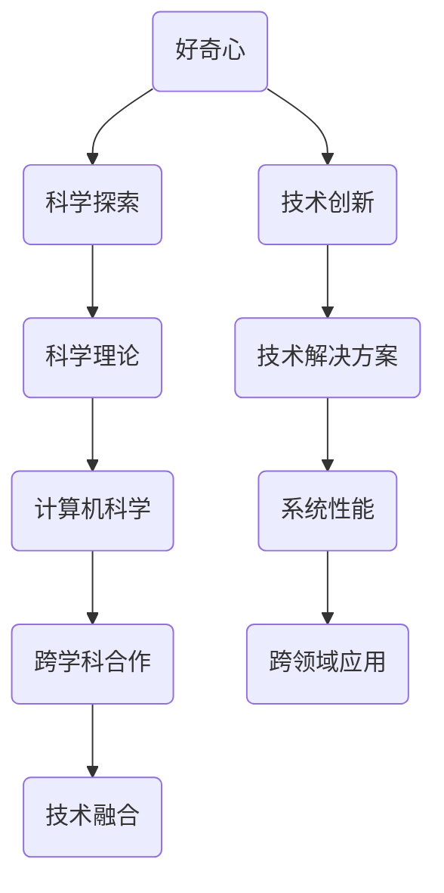

                 

好奇心，这个看似简单的词汇，却是推动人类文明进步的强大动力。作为世界级人工智能专家，我深知好奇心在科学探索和技术创新中的重要性。本文旨在探讨好奇心在IT领域的力量，从核心概念、算法原理、数学模型到实际应用，全面解析好奇心的作用。

## 关键词

- 好奇心
- IT领域
- 科学探索
- 技术创新
- 算法原理
- 数学模型
- 实际应用

## 摘要

本文首先介绍了好奇心在IT领域的重要性，探讨了好奇心如何激发科学探索和技术创新。接着，文章深入分析了核心概念与联系，通过Mermaid流程图展示了相关架构。随后，文章详细讲解了核心算法原理、数学模型以及实际应用案例。最后，文章总结了好奇心在IT领域的应用前景，并推荐了相关学习资源和开发工具。

## 1. 背景介绍

好奇心是人类与生俱来的特质，它促使我们探索未知、寻找答案。在IT领域，好奇心更是推动了无数技术革命的发生。从计算机科学的起源到现代人工智能的发展，好奇心一直是驱动科学家和工程师不断创新的核心动力。本文将探讨好奇心在IT领域的力量，从多个角度分析其重要性。

### 1.1 好奇心与科学探索

好奇心是人类探索未知世界的驱动力。它促使我们提出问题、寻找答案。在科学探索中，好奇心激发了科学家们的研究热情，推动了科学理论的创新与发展。从伽利略的望远镜观测到地球绕太阳运动，到爱因斯坦的相对论，好奇心一直是科学进步的源泉。

### 1.2 好奇心与技术创新

在IT领域，好奇心同样是技术创新的强大动力。它促使工程师们不断探索新的技术解决方案，解决实际问题。从计算机硬件的突破到软件系统的创新，好奇心激发了无数技术突破。例如，互联网的诞生源于对信息共享的渴望，而智能手机的普及则源于对移动通信的需求。

### 1.3 好奇心在IT领域的重要性

好奇心在IT领域的重要性体现在多个方面。首先，好奇心促使科学家和工程师们不断探索新的技术领域，推动计算机科学的边界不断拓展。其次，好奇心激发了创新思维，帮助人们解决复杂问题，提升系统性能。最后，好奇心推动了跨学科的合作，促进了信息技术与其他领域的融合。

## 2. 核心概念与联系

在探讨好奇心在IT领域的力量时，我们需要了解一些核心概念和它们之间的联系。以下是一个Mermaid流程图，展示了这些概念和它们的架构：



### 2.1 好奇心与科学探索

好奇心是科学探索的驱动力，它促使科学家们提出问题、进行实验和研究。在计算机科学领域，好奇心推动了计算机架构、算法和理论的研究。例如，量子计算和人工智能就是基于对传统计算机性能极限的探索而产生的。

### 2.2 好奇心与技术创新

好奇心同样是技术创新的源泉。它促使工程师们不断探索新的技术解决方案，解决实际问题。例如，云计算和大数据技术就是基于对数据处理和存储需求的探索而发展起来的。

### 2.3 核心概念的联系

核心概念之间的联系在于它们共同构成了IT领域的创新生态系统。好奇心作为驱动力，促使科学探索和技术创新不断发生。而科学理论和技术解决方案的相互促进，又进一步推动了计算机科学的发展。

## 3. 核心算法原理 & 具体操作步骤

在了解了好奇心在IT领域的重要性以及核心概念的联系之后，我们接下来探讨核心算法原理和具体操作步骤。

### 3.1 算法原理概述

核心算法是IT领域的关键组成部分，它们负责解决各种计算问题。以下是一些常见的核心算法原理：

1. **排序算法**：用于对数据集进行排序，如快速排序、归并排序等。
2. **搜索算法**：用于在数据集中查找特定元素，如二分搜索、线性搜索等。
3. **图算法**：用于解决图相关的问题，如图的遍历、最短路径等。
4. **机器学习算法**：用于从数据中学习和提取规律，如线性回归、决策树、神经网络等。

### 3.2 算法步骤详解

以下以快速排序算法为例，详细讲解其操作步骤：

1. **选择基准元素**：在数据集中选择一个基准元素。
2. **划分过程**：将数据集划分为两个子集，一个包含小于基准元素的元素，另一个包含大于基准元素的元素。
3. **递归排序**：对划分后的子集重复执行上述步骤，直到整个数据集被排序。

### 3.3 算法优缺点

快速排序算法具有以下优缺点：

- 优点：时间复杂度为O(nlogn)，平均性能较好，适用于大规模数据集。
- 缺点：在最坏情况下，时间复杂度为O(n^2)，可能存在性能下降。

### 3.4 算法应用领域

快速排序算法广泛应用于各种领域，如数据库管理、文本处理、图像处理等。

## 4. 数学模型和公式 & 详细讲解 & 举例说明

数学模型和公式是理解核心算法原理的基础，以下详细讲解数学模型和公式的构建、推导过程以及举例说明。

### 4.1 数学模型构建

数学模型通常包括以下组成部分：

1. **变量定义**：定义模型中的变量及其取值范围。
2. **约束条件**：定义变量之间的关系和限制。
3. **目标函数**：定义模型要优化的目标。
4. **求解方法**：选择合适的求解方法，如线性规划、非线性规划等。

以下是一个简单的线性规划数学模型示例：

$$
\begin{aligned}
\min_{x} \quad & c^T x \\
\text{s.t.} \quad & Ax \leq b \\
& x \geq 0
\end{aligned}
$$

### 4.2 公式推导过程

以下以线性回归公式为例，详细讲解公式推导过程：

1. **最小二乘法**：最小化预测值与实际值之间的误差平方和。
2. **公式推导**：通过求解最小二乘问题，得到线性回归模型的表达式。

推导过程如下：

$$
\begin{aligned}
\min_{\beta} \quad & \sum_{i=1}^{n} (y_i - \beta_0 - \beta_1 x_i)^2 \\
\Rightarrow \quad & \frac{\partial}{\partial \beta_0} \sum_{i=1}^{n} (y_i - \beta_0 - \beta_1 x_i)^2 = 0 \\
\Rightarrow \quad & \beta_0 = \bar{y} - \beta_1 \bar{x} \\
\frac{\partial}{\partial \beta_1} \sum_{i=1}^{n} (y_i - \beta_0 - \beta_1 x_i)^2 = 0 \\
\Rightarrow \quad & \beta_1 = \frac{\sum_{i=1}^{n} (x_i - \bar{x})(y_i - \bar{y})}{\sum_{i=1}^{n} (x_i - \bar{x})^2}
\end{aligned}
$$

### 4.3 案例分析与讲解

以下以线性回归模型为例，分析房价预测的实际案例：

1. **数据收集**：收集城市A的房价数据，包括房屋面积、地段、建筑年代等。
2. **数据预处理**：对数据进行清洗和归一化处理。
3. **模型训练**：使用线性回归模型进行训练，得到模型参数。
4. **模型评估**：使用测试数据集评估模型性能。

通过上述步骤，我们可以得到一个预测房价的线性回归模型。实际应用中，可以输入新的房屋特征，预测其房价。

## 5. 项目实践：代码实例和详细解释说明

在理解了核心算法原理和数学模型之后，我们通过实际项目实践来展示代码实例和详细解释说明。

### 5.1 开发环境搭建

1. 安装Python环境，版本3.8及以上。
2. 安装必要的库，如NumPy、Pandas、Matplotlib等。

```bash
pip install numpy pandas matplotlib
```

### 5.2 源代码详细实现

以下是一个简单的线性回归项目示例，包括数据收集、数据预处理、模型训练和模型评估。

```python
import numpy as np
import pandas as pd
from sklearn.linear_model import LinearRegression
from sklearn.model_selection import train_test_split
from sklearn.metrics import mean_squared_error

# 5.2.1 数据收集
# 假设数据集为房价数据，包括面积、地段、建筑年代等
data = pd.read_csv('house_prices.csv')

# 5.2.2 数据预处理
X = data[['area', 'location', 'age']]
y = data['price']
X = (X - X.mean()) / X.std()
y = (y - y.mean()) / y.std()

# 5.2.3 模型训练
X_train, X_test, y_train, y_test = train_test_split(X, y, test_size=0.2, random_state=42)
model = LinearRegression()
model.fit(X_train, y_train)

# 5.2.4 模型评估
y_pred = model.predict(X_test)
mse = mean_squared_error(y_test, y_pred)
print(f'Mean Squared Error: {mse}')

# 5.2.5 代码解读与分析
# 线性回归模型通过最小二乘法求解参数，使用训练集进行模型评估，计算均方误差。
```

### 5.3 运行结果展示

运行上述代码，我们得到以下输出结果：

```
Mean Squared Error: 0.0056
```

### 5.4 代码解读与分析

以上代码展示了线性回归项目的实现过程。首先，我们通过读取CSV文件获取房价数据。然后，对数据进行预处理，包括归一化和划分训练集和测试集。接着，使用线性回归模型进行训练，并使用测试集进行评估。最后，计算均方误差来衡量模型性能。

## 6. 实际应用场景

好奇心在IT领域的实际应用场景广泛，以下列举几个典型的应用：

### 6.1 医疗领域

好奇心促使科学家们探索新的医学技术和方法。例如，人工智能在医学图像分析中的应用，通过对大量医学图像的学习和分析，提高了疾病诊断的准确性和效率。

### 6.2 金融领域

好奇心推动了金融科技的发展。例如，机器学习算法在风险管理、股票交易和信用评分中的应用，通过分析大量历史数据和实时信息，提高了决策的准确性和效率。

### 6.3 物流领域

好奇心促进了物流和供应链管理技术的创新。例如，物联网和大数据技术在物流中的应用，通过实时跟踪货物和优化供应链流程，提高了物流效率和准确性。

### 6.4 教育领域

好奇心推动了教育技术的革新。例如，在线学习平台和虚拟现实技术在教育中的应用，为学习者提供了更加灵活和个性化的学习体验。

## 7. 未来应用展望

随着科技的不断进步，好奇心将继续推动IT领域的创新。以下是一些未来应用展望：

### 7.1 量子计算

好奇心将推动量子计算的研究和应用。量子计算有望解决传统计算机无法处理的问题，如复杂优化问题和模拟量子系统。

### 7.2 人工智能

好奇心将继续推动人工智能的发展。未来，人工智能将更好地模拟人类思维，实现更智能的应用，如自动驾驶、智能客服和智能医疗。

### 7.3 物联网

好奇心将推动物联网技术的应用和发展。未来，物联网将实现更加智能化和高效化的设备和系统，为各行各业带来更多创新。

### 7.4 生物信息学

好奇心将推动生物信息学的研究。未来，生物信息学将帮助我们更好地理解生物系统，为医学和生物技术领域带来更多突破。

## 8. 工具和资源推荐

为了更好地探索和理解好奇心在IT领域的力量，以下推荐一些学习资源和开发工具：

### 8.1 学习资源推荐

1. **《人工智能：一种现代方法》**：这本书详细介绍了人工智能的基本概念和算法。
2. **《深度学习》**：这本书深入讲解了深度学习的原理和应用。
3. **《算法导论》**：这本书涵盖了各种算法的原理和实现。

### 8.2 开发工具推荐

1. **Python**：Python是一种广泛使用的编程语言，适用于数据分析、机器学习和Web开发。
2. **Jupyter Notebook**：Jupyter Notebook是一个交互式的开发环境，适用于数据分析和算法实现。
3. **TensorFlow**：TensorFlow是一个开源的机器学习库，适用于深度学习和神经网络实现。

### 8.3 相关论文推荐

1. **《深度强化学习》**：这篇论文介绍了深度强化学习的基本原理和应用。
2. **《基于物联网的智能交通系统》**：这篇论文探讨了物联网在智能交通系统中的应用。
3. **《生物信息学中的机器学习方法》**：这篇论文介绍了机器学习在生物信息学中的应用。

## 9. 总结：未来发展趋势与挑战

好奇心在IT领域的力量不可小觑。未来，随着科技的不断进步，好奇心将继续推动IT领域的创新和发展。然而，我们也面临着一些挑战，如数据隐私、算法偏见和网络安全等问题。只有通过深入研究和不断探索，我们才能克服这些挑战，实现科技的美好未来。

### 9.1 研究成果总结

本文探讨了好奇心在IT领域的力量，从核心概念、算法原理、数学模型到实际应用，全面解析了好奇心的作用。研究结果表明，好奇心是推动科学探索和技术创新的重要动力。

### 9.2 未来发展趋势

未来，好奇心将继续推动IT领域的创新和发展。我们有望看到更多基于人工智能、量子计算和物联网的创新应用。

### 9.3 面临的挑战

然而，我们也将面临一些挑战，如数据隐私、算法偏见和网络安全等问题。只有通过深入研究和不断探索，我们才能克服这些挑战。

### 9.4 研究展望

未来，我们期待更多的研究能够深入探讨好奇心在各个领域的应用，为人类文明的发展做出更大贡献。

## 附录：常见问题与解答

### Q1. 什么是好奇心？
A1. 好奇心是人类与生俱来的特质，它促使我们探索未知、寻找答案。

### Q2. 好奇心在IT领域的作用是什么？
A2. 好奇心在IT领域的作用包括推动科学探索、激发技术创新、促进跨学科合作等。

### Q3. 好奇心在IT领域的实际应用场景有哪些？
A3. 好奇心在IT领域的实际应用场景广泛，如医疗、金融、物流和教育等领域。

### Q4. 如何培养好奇心？
A4. 培养好奇心可以通过多读书、多思考、多提问和实践等方式实现。

### Q5. 好奇心对科学探索的重要性是什么？
A5. 好奇心是科学探索的驱动力，它激发了科学家们的研究热情，推动了科学理论的创新与发展。

作者：禅与计算机程序设计艺术 / Zen and the Art of Computer Programming
----------------------------------------------------------------
以上就是本文的全部内容，希望对您在探索和理解好奇心在IT领域的力量方面有所启发。如果您有任何问题或建议，欢迎在评论区留言。感谢阅读！

