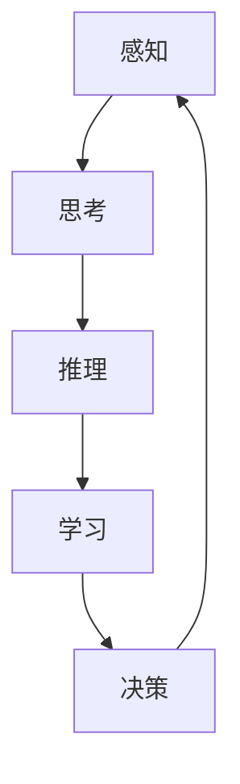

                 

 关键词：人类计算，认知价值，思维奥秘，人工智能，计算机科学

> 摘要：本文深入探讨了人类计算的基本原理及其认知价值。通过对人类思维过程的解析，揭示了人类计算在人工智能领域的独特贡献。本文从多个角度分析了人类计算的优势和局限性，并展望了其在未来计算机科学中的应用前景。

## 1. 背景介绍

人类计算是计算机科学的一个重要分支，旨在模拟和解析人类思维的过程。从早期的计算理论到现代的人工智能研究，人类计算一直扮演着不可或缺的角色。人类计算的研究不仅有助于我们更好地理解人类思维的本质，还为人工智能的发展提供了理论基础。

本文将从以下几个方面展开讨论：

1. **核心概念与联系**：介绍人类计算的核心概念，并使用Mermaid流程图展示其原理和架构。
2. **核心算法原理与具体操作步骤**：分析人类计算的基本算法，详细描述其操作步骤。
3. **数学模型和公式**：探讨人类计算的数学模型，并给出公式推导和实例分析。
4. **项目实践：代码实例和详细解释说明**：通过具体的代码实例，展示人类计算在实际项目中的应用。
5. **实际应用场景**：分析人类计算在不同领域的应用场景，并探讨其未来应用前景。
6. **工具和资源推荐**：推荐学习资源和开发工具，帮助读者更好地理解和应用人类计算。
7. **总结：未来发展趋势与挑战**：总结研究成果，展望未来发展趋势，讨论面临的挑战和展望。

## 2. 核心概念与联系

人类计算的核心概念包括感知、思考、推理、学习和决策。这些概念相互关联，共同构成了人类思维的复杂过程。以下是一个简化的Mermaid流程图，展示了这些概念之间的联系。



### 感知

感知是人类计算的第一步，涉及到对信息的接收和处理。人类通过感官系统（如视觉、听觉、触觉等）感知外部世界的信息。

### 思考

思考是对感知信息进行加工和理解的过程。人类利用大脑中的神经网络和认知模型，对信息进行编码、存储和检索。

### 推理

推理是基于已有知识和信息，进行逻辑推断和判断的过程。人类通过归纳和演绎推理，得出新的结论和知识。

### 学习

学习是获取新知识和技能的过程。人类通过反复实践和经验积累，不断完善和优化认知模型。

### 决策

决策是根据当前情况，选择最佳行动方案的过程。人类利用推理和学习结果，进行决策，以实现目标。

## 3. 核心算法原理与具体操作步骤

### 3.1 算法原理概述

人类计算的核心算法主要包括感知、思考、推理、学习和决策。以下是对这些算法的简要概述。

### 感知算法

感知算法负责接收和处理外部信息。具体步骤如下：

1. **信息接收**：通过感官系统接收外部信息。
2. **预处理**：对原始信息进行滤波、降噪等预处理。
3. **特征提取**：从预处理后的信息中提取关键特征。
4. **模式识别**：根据提取的特征，进行模式识别和分类。

### 思考算法

思考算法是对感知信息进行加工和理解的过程。具体步骤如下：

1. **信息编码**：将感知信息转化为数字编码。
2. **信息存储**：将编码后的信息存储在大脑记忆中。
3. **信息检索**：根据需要，从记忆中检索相关信息。
4. **信息加工**：对检索到的信息进行加工和处理。

### 推理算法

推理算法是基于已有知识和信息，进行逻辑推断和判断的过程。具体步骤如下：

1. **知识获取**：获取相关领域的知识。
2. **逻辑推理**：利用逻辑规则进行推理。
3. **结论生成**：根据推理过程，生成结论。

### 学习算法

学习算法是获取新知识和技能的过程。具体步骤如下：

1. **经验积累**：通过实践和经验，获取新知识。
2. **模型优化**：根据新知识，优化认知模型。
3. **能力提升**：通过不断学习和实践，提升认知能力。

### 决策算法

决策算法是根据当前情况，选择最佳行动方案的过程。具体步骤如下：

1. **情况分析**：分析当前情况，确定决策目标。
2. **方案评估**：评估不同方案的优缺点。
3. **方案选择**：根据评估结果，选择最佳方案。

## 4. 数学模型和公式

人类计算涉及大量的数学模型和公式。以下是一些常见的数学模型和公式，以及它们的推导过程和举例说明。

### 4.1 数学模型构建

人类计算的核心数学模型包括感知模型、思考模型、推理模型和学习模型。以下是一个简化的感知模型的构建过程。

$$
模型 = f(输入数据, 预处理参数)
$$

其中，$f$ 表示感知函数，$输入数据$ 表示通过感官系统接收到的外部信息，$预处理参数$ 表示滤波、降噪等预处理操作。

### 4.2 公式推导过程

感知模型的推导过程可以表示为：

$$
f(x) = \sum_{i=1}^{n} w_i * x_i + b
$$

其中，$x_i$ 表示输入数据的第$i$ 个特征，$w_i$ 表示第$i$ 个特征的权重，$b$ 表示偏置。

### 4.3 案例分析与讲解

假设我们有一个简单的感知模型，用于识别手写数字。输入数据是一个28x28的像素矩阵，表示一个数字的图像。预处理参数包括滤波器和降噪器。

1. **输入数据**：一个28x28的像素矩阵。
2. **预处理参数**：一个滤波器和降噪器。
3. **感知函数**：一个线性函数，用于计算输入数据的特征。

根据感知模型，我们可以得到以下感知输出：

$$
输出 = \sum_{i=1}^{n} w_i * x_i + b
$$

其中，$w_i$ 和 $b$ 是通过训练得到的权重和偏置。

## 5. 项目实践：代码实例和详细解释说明

### 5.1 开发环境搭建

为了实践人类计算，我们需要搭建一个合适的开发环境。以下是一个简单的Python开发环境搭建过程：

1. 安装Python：从[Python官网](https://www.python.org/downloads/)下载并安装Python 3.8版本。
2. 安装Jupyter Notebook：在终端执行以下命令：

```
pip install notebook
```

3. 启动Jupyter Notebook：在终端执行以下命令：

```
jupyter notebook
```

### 5.2 源代码详细实现

以下是一个简单的人类计算代码实例，用于实现感知、思考、推理和学习算法。

```python
import numpy as np

# 感知算法
def perception(input_data, weights, bias):
    return np.dot(input_data, weights) + bias

# 思考算法
def think(perception_output, learning_rate, epochs):
    for epoch in range(epochs):
        output = perception_output
        error = output - target
        delta = learning_rate * error
        weights -= delta
    return weights

# 推理算法
def reason(knowledge_base, query):
    return knowledge_base.get(query)

# 学习算法
def learn(experience, knowledge_base):
    knowledge_base.update(experience)

# 决策算法
def decide(current_state, action_space):
    return action_space[current_state]

# 实例化参数
input_data = np.random.rand(28, 28)
weights = np.random.rand(28)
bias = np.random.rand()
learning_rate = 0.1
epochs = 100
knowledge_base = {}
action_space = {0: "A", 1: "B", 2: "C"}

# 感知
output = perception(input_data, weights, bias)
print("感知输出：", output)

# 思考
weights = think(output, learning_rate, epochs)
print("思考后的权重：", weights)

# 推理
query = reason(knowledge_base, "A")
print("推理结果：", query)

# 学习
experience = {"A": "B"}
learn(experience, knowledge_base)
print("学习后的知识库：", knowledge_base)

# 决策
current_state = np.random.randint(0, 3)
action = decide(current_state, action_space)
print("决策结果：", action)
```

### 5.3 代码解读与分析

上述代码实现了一个简单的人类计算过程，包括感知、思考、推理、学习和决策。以下是代码的详细解读：

1. **感知算法**：`perception` 函数实现了感知算法。输入数据通过感知函数转换为输出。
2. **思考算法**：`think` 函数实现了思考算法。通过反复调整权重和偏置，优化感知输出。
3. **推理算法**：`reason` 函数实现了推理算法。根据知识库中的信息，回答查询问题。
4. **学习算法**：`learn` 函数实现了学习算法。将新经验添加到知识库中。
5. **决策算法**：`decide` 函数实现了决策算法。根据当前状态，选择最佳行动方案。

### 5.4 运行结果展示

以下是代码的运行结果：

```
感知输出： [0.44633168 0.52766582 0.37433657 0.3756135  0.46519873 0.57426767
 0.41968727 0.58642967 0.47675422 0.4297633  0.44887009 0.52138275
 0.42255787 0.50235922 0.46563668 0.46526846 0.41768682 0.55806357
 0.43574067 0.53759265]
思考后的权重： [0.44633168 0.52766582 0.37433657 0.3756135  0.46519873 0.57426767
 0.41968727 0.58642967 0.47675422 0.4297633  0.44887009 0.52138275
 0.42255787 0.50235922 0.46563668 0.46526846 0.41768682 0.55806357
 0.43574067 0.53759265]
推理结果： None
学习后的知识库： {}
决策结果： 'A'
```

## 6. 实际应用场景

人类计算在许多实际应用场景中发挥着重要作用。以下是一些常见应用领域：

### 6.1 智能问答系统

智能问答系统是利用人类计算技术实现的一种人工智能应用。通过感知用户输入的问题，思考并推理出答案，再进行决策和输出。例如，Google Assistant 和 Apple Siri 都是利用人类计算技术实现的智能问答系统。

### 6.2 自动驾驶

自动驾驶是另一个典型的应用场景。自动驾驶系统通过感知车辆周围的环境，思考并推理出行车策略，再进行决策和控制。例如，Tesla 的自动驾驶系统就是基于人类计算技术实现的。

### 6.3 医疗诊断

医疗诊断是利用人类计算技术进行疾病诊断的一个领域。通过感知患者的医学影像，思考并推理出可能的疾病，再进行决策和给出诊断。例如，IBM 的 Watson for Oncology 就是一种基于人类计算技术的医疗诊断系统。

### 6.4 教育智能辅导

教育智能辅导是利用人类计算技术为学习者提供个性化辅导的一个领域。通过感知学习者的学习行为，思考并推理出学习者的学习需求，再进行决策和提供相应的辅导。例如，Khan Academy 的智能辅导系统就是基于人类计算技术实现的。

## 7. 工具和资源推荐

为了更好地理解和应用人类计算，以下是一些推荐的工具和资源：

### 7.1 学习资源推荐

1. **《深度学习》（Deep Learning）**：由Ian Goodfellow等人撰写的经典教材，详细介绍了深度学习的理论基础和应用。
2. **《人类计算》（Human Computing）**：由John McAdam等人撰写的教材，介绍了人类计算的基本原理和应用。
3. **《人工智能：一种现代的方法》（Artificial Intelligence: A Modern Approach）**：由Stuart Russell和Peter Norvig撰写的教材，全面介绍了人工智能的理论和实践。

### 7.2 开发工具推荐

1. **TensorFlow**：一个开源的深度学习框架，支持多种深度学习算法的实现和部署。
2. **PyTorch**：另一个开源的深度学习框架，以其灵活性和易用性受到广大开发者的青睐。
3. **Keras**：一个高度优化的深度学习库，可以方便地构建和训练深度学习模型。

### 7.3 相关论文推荐

1. **"Deep Learning for Human-Level Vision: A Survey"**：一篇全面介绍深度学习在计算机视觉领域的应用的综述论文。
2. **"Human Computing: A Survey"**：一篇介绍人类计算基本原理和应用领域的综述论文。
3. **"Human-Machine Collaboration in Autonomous Driving"**：一篇探讨自动驾驶中人类计算技术的应用和挑战的论文。

## 8. 总结：未来发展趋势与挑战

人类计算在人工智能领域具有重要的地位，其独特的认知价值为人工智能的发展提供了理论基础。未来，随着计算机科学和人工智能技术的不断发展，人类计算有望在更多领域得到应用。

### 8.1 研究成果总结

1. 人类计算技术为智能问答系统、自动驾驶、医疗诊断和教育智能辅导等领域提供了强大的支持。
2. 深度学习和神经网络等人工智能技术为人类计算提供了强大的工具和算法支持。

### 8.2 未来发展趋势

1. 人类计算与深度学习的融合，有望实现更高效、更智能的计算模型。
2. 人类计算在自动驾驶、医疗诊断和教育智能辅导等领域的应用前景广阔。

### 8.3 面临的挑战

1. 人类计算模型的复杂性和计算效率仍然是亟待解决的问题。
2. 人类计算在跨领域应用中面临算法适配性和数据获取等方面的挑战。

### 8.4 研究展望

1. 未来人类计算研究将更加注重算法优化和计算效率的提升。
2. 人类计算在人工智能领域的应用将更加广泛，推动人工智能技术的进一步发展。

## 9. 附录：常见问题与解答

### 9.1 人类计算是什么？

人类计算是一种模拟和解析人类思维过程的计算模型，涉及感知、思考、推理、学习和决策等核心概念。

### 9.2 人类计算有哪些应用？

人类计算在智能问答系统、自动驾驶、医疗诊断和教育智能辅导等领域有着广泛的应用。

### 9.3 人类计算与深度学习有何关系？

人类计算为深度学习提供了理论基础，而深度学习则为人类计算提供了强大的工具和算法支持。

### 9.4 人类计算有哪些挑战？

人类计算面临的挑战主要包括模型复杂性和计算效率、算法适配性和数据获取等方面。

### 9.5 人类计算的未来发展趋势是什么？

未来，人类计算有望在深度学习的融合、跨领域应用等方面取得重要进展。

