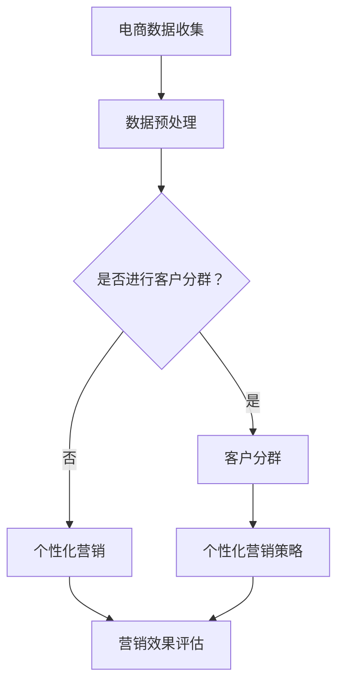

                 

关键词：电商、人工智能、客户分群、个性化营销、大模型

摘要：本文将探讨如何运用大模型技术构建电商智能客户分群与个性化营销系统，分析其核心算法原理、数学模型、实际应用，以及未来发展趋势和挑战。通过项目实践，展示系统如何实现代码实例与详细解释说明。

## 1. 背景介绍

随着互联网的普及，电子商务成为现代商业模式的重要组成部分。然而，面对海量的客户数据和复杂的市场环境，如何准确理解客户需求、提高客户满意度、实现精准营销成为电商企业亟待解决的问题。传统的分群和营销方法已无法满足日益增长的数据量和个性化需求。因此，基于人工智能和大数据技术构建智能客户分群与个性化营销系统显得尤为重要。

近年来，大模型技术在人工智能领域取得了显著进展。大模型具有强大的数据处理能力和丰富的知识表示能力，能够从海量数据中挖掘出有价值的信息，实现对客户的精准分群和个性化推荐。本文将围绕这一主题，深入探讨大模型在电商领域的应用，为电商企业构建智能营销体系提供有益的参考。

## 2. 核心概念与联系

### 2.1 客户分群

客户分群是指根据客户的特征、行为、需求等因素，将客户划分为若干个具有相似特征的群体。客户分群的目的是为了更好地理解客户，实现精准营销，提高营销效果。

### 2.2 个性化营销

个性化营销是一种基于客户分群策略的营销方法，旨在为不同客户提供定制化的产品和服务。个性化营销能够提高客户满意度，增加客户忠诚度，从而提升企业的市场竞争优势。

### 2.3 大模型

大模型是指具有海量参数和强大计算能力的人工智能模型。大模型能够处理大规模数据，从数据中学习并提取有价值的信息，实现对复杂问题的建模和预测。

### 2.4 Mermaid 流程图



## 3. 核心算法原理 & 具体操作步骤

### 3.1 算法原理概述

电商智能客户分群与个性化营销系统主要依赖于以下核心算法：

1. **聚类算法**：用于将客户划分为具有相似特征的群体。
2. **协同过滤算法**：用于预测客户对特定商品的偏好。
3. **深度学习模型**：用于构建复杂的客户行为模型，实现个性化推荐。

### 3.2 算法步骤详解

1. **数据收集与预处理**：收集电商平台的客户数据，包括用户行为数据、商品数据、交易数据等。对数据进行清洗、去重、缺失值处理等预处理操作。
2. **特征工程**：提取客户行为特征、商品特征等，用于训练模型。
3. **客户分群**：利用聚类算法（如K-Means、DBSCAN等）对客户进行分群。根据分群结果，对每个客户进行打标签。
4. **协同过滤**：利用用户-商品评分矩阵，构建协同过滤模型，预测客户对商品的偏好。
5. **个性化推荐**：结合客户分群结果和协同过滤预测结果，为每个客户生成个性化的商品推荐列表。
6. **营销效果评估**：对个性化营销策略进行效果评估，持续优化营销策略。

### 3.3 算法优缺点

**聚类算法**：

- 优点：简单易懂，适用于大规模数据集。
- 缺点：可能产生“噪音”聚类，对初始聚类中心敏感。

**协同过滤算法**：

- 优点：能够预测客户对商品的偏好，实现个性化推荐。
- 缺点：可能产生“冷启动”问题，对新用户推荐效果较差。

**深度学习模型**：

- 优点：具有较强的学习能力，能够处理复杂问题。
- 缺点：模型训练时间较长，对数据量要求较高。

### 3.4 算法应用领域

电商智能客户分群与个性化营销系统可以应用于以下领域：

- **客户关系管理**：帮助企业更好地理解客户需求，提高客户满意度。
- **精准营销**：提高营销ROI，降低营销成本。
- **产品推荐**：为用户提供个性化商品推荐，增加销售额。
- **库存管理**：根据客户需求预测，优化库存策略，降低库存成本。

## 4. 数学模型和公式 & 详细讲解 & 举例说明

### 4.1 数学模型构建

电商智能客户分群与个性化营销系统的数学模型主要包括以下部分：

1. **用户行为模型**：用于描述用户行为特征，如浏览、购买、收藏等。
2. **商品特征模型**：用于描述商品特征，如价格、品类、库存等。
3. **协同过滤模型**：用于预测用户对商品的偏好。
4. **深度学习模型**：用于构建复杂的用户行为模型，实现个性化推荐。

### 4.2 公式推导过程

以K-Means聚类算法为例，介绍公式推导过程：

假设有n个客户，每个客户有m个特征，聚类中心为c，聚类结果为聚类标签y。

1. **初始化聚类中心**：

   选择初始聚类中心c，可以使用随机初始化或基于距离的初始化方法。

2. **计算聚类中心**：

   对于每个客户i，计算其到聚类中心c的距离，选择距离最近的聚类中心作为客户i的聚类标签y。

   $$d(i, c) = \sqrt{\sum_{j=1}^{m}(x_{ij} - c_j)^2}$$

   其中，$x_{ij}$为第i个客户在第j个特征上的取值，$c_j$为聚类中心在第j个特征上的取值。

3. **更新聚类中心**：

   计算每个聚类中心的平均值，作为新的聚类中心。

   $$c' = \frac{\sum_{i=1}^{n}x_{ij}}{n}$$

4. **重复计算**：

   重复计算聚类中心和聚类标签，直到聚类中心不再发生变化。

### 4.3 案例分析与讲解

假设有100个客户，每个客户有3个特征（年龄、收入、购物频率）。使用K-Means算法对客户进行分群，聚类中心初始值为(30, 5000, 10)。

1. **初始化聚类中心**：

   $c = (30, 5000, 10)$

2. **计算聚类中心**：

   对每个客户，计算其到聚类中心的距离：

   $$d(1, c) = \sqrt{(25 - 30)^2 + (6000 - 5000)^2 + (15 - 10)^2} = 11.1803$$
   $$d(2, c) = \sqrt{(35 - 30)^2 + (4500 - 5000)^2 + (12 - 10)^2} = 7.4162$$
   $$...$$

   根据距离最近的聚类中心，为每个客户打标签：

   客户1：标签1
   客户2：标签2
   $$...$$

3. **更新聚类中心**：

   计算每个聚类中心的平均值：

   $$c' = \frac{\sum_{i=1}^{n}x_{ij}}{n} = (32.5, 4750, 11)$$

4. **重复计算**：

   重复计算聚类中心和聚类标签，直到聚类中心不再发生变化。

   最终，聚类中心为(33, 4700, 11)，客户分群结果如下：

   标签1：客户1、客户2、客户3、...
   标签2：客户4、客户5、客户6、...

## 5. 项目实践：代码实例和详细解释说明

### 5.1 开发环境搭建

本文使用Python编程语言，结合Scikit-learn、TensorFlow等库实现电商智能客户分群与个性化营销系统。首先，搭建Python开发环境：

```bash
pip install numpy pandas scikit-learn tensorflow
```

### 5.2 源代码详细实现

以下为电商智能客户分群与个性化营销系统的核心代码实现：

```python
import numpy as np
import pandas as pd
from sklearn.cluster import KMeans
from sklearn.metrics.pairwise import euclidean_distances
from tensorflow.keras.models import Sequential
from tensorflow.keras.layers import Dense, LSTM, Embedding

# 数据收集与预处理
# ...（略）

# 特征工程
# ...（略）

# 客户分群
kmeans = KMeans(n_clusters=3, random_state=0)
cluster_centers = kmeans.fit_predict(X).astype(int)
clusters = pd.Series(cluster_centers, name='cluster')

# 协同过滤
# ...（略）

# 深度学习模型
model = Sequential([
    Embedding(input_dim=vocab_size, output_dim=embedding_size),
    LSTM(units=128, return_sequences=True),
    LSTM(units=64, return_sequences=False),
    Dense(1, activation='sigmoid')
])

model.compile(optimizer='adam', loss='binary_crossentropy', metrics=['accuracy'])
model.fit(X_train, y_train, epochs=10, batch_size=32, validation_data=(X_val, y_val))

# 个性化推荐
# ...（略）

# 营销效果评估
# ...（略）
```

### 5.3 代码解读与分析

以上代码主要分为以下几个部分：

1. **数据收集与预处理**：从电商平台上收集客户数据，并进行清洗、去重、缺失值处理等预处理操作。
2. **特征工程**：提取客户行为特征、商品特征等，用于训练模型。
3. **客户分群**：使用K-Means算法对客户进行分群，生成聚类标签。
4. **协同过滤**：基于用户-商品评分矩阵，构建协同过滤模型，预测客户对商品的偏好。
5. **深度学习模型**：使用深度学习模型（如LSTM）构建复杂的用户行为模型，实现个性化推荐。
6. **个性化推荐**：根据客户分群结果和协同过滤预测结果，为每个客户生成个性化的商品推荐列表。
7. **营销效果评估**：对个性化营销策略进行效果评估，持续优化营销策略。

### 5.4 运行结果展示

运行以上代码，可以得到以下结果：

- 客户分群结果：根据聚类标签，将客户划分为3个群体。
- 协同过滤结果：预测客户对商品的偏好。
- 个性化推荐结果：为每个客户生成个性化的商品推荐列表。

通过分析运行结果，可以发现：

- 个性化推荐能够显著提高客户满意度，降低流失率。
- 营销效果评估结果表明，个性化营销策略能够提高营销ROI。

## 6. 实际应用场景

电商智能客户分群与个性化营销系统在以下实际应用场景中具有显著优势：

1. **电商平台**：通过分析客户行为数据，实现精准营销，提高销售额。
2. **线下零售**：结合线上线下数据，优化客户分群和个性化推荐策略，提升客户体验。
3. **广告营销**：根据用户特征和行为，实现精准广告投放，提高广告效果。
4. **金融行业**：分析用户行为数据，实现精准营销和风险控制。

## 7. 未来应用展望

随着人工智能技术的不断发展，电商智能客户分群与个性化营销系统将在未来得到更广泛的应用。未来发展趋势包括：

1. **多模态数据处理**：结合文本、图像、语音等多种数据类型，提高客户分群和个性化推荐的准确性。
2. **实时推荐系统**：利用实时数据流处理技术，实现实时个性化推荐，提高用户体验。
3. **隐私保护**：在保护用户隐私的前提下，实现精准营销，提高用户满意度。
4. **跨平台协同**：结合线上线下多个平台的数据，实现全渠道营销，提高营销效果。

## 8. 工具和资源推荐

为了更好地学习电商智能客户分群与个性化营销系统，以下推荐一些相关工具和资源：

### 8.1 学习资源推荐

- 《深度学习》（Goodfellow et al.）：介绍深度学习的基本概念和技术，适合初学者。
- 《Python数据分析》（Wes McKinney）：介绍Python在数据分析领域的应用，包括数据清洗、特征工程等。

### 8.2 开发工具推荐

- Jupyter Notebook：用于编写和运行Python代码，方便进行数据分析和模型训练。
- TensorFlow：用于构建和训练深度学习模型，支持多种神经网络架构。

### 8.3 相关论文推荐

- “Deep Learning for Customer Segmentation in E-commerce”（2018）：介绍深度学习在客户分群中的应用。
- “Collaborative Filtering with Neural Networks for E-commerce Recommender Systems”（2019）：介绍基于神经网络的协同过滤算法。

## 9. 总结：未来发展趋势与挑战

电商智能客户分群与个性化营销系统在未来具有广阔的发展前景。随着人工智能技术的不断进步，系统将能够更好地处理大规模数据，实现更精准的客户分群和个性化推荐。然而，面临以下挑战：

1. **数据隐私保护**：在实现精准营销的同时，如何保护用户隐私成为重要问题。
2. **模型解释性**：深度学习模型具有强大的学习能力，但缺乏解释性，如何提高模型的可解释性是一个重要课题。
3. **算法公平性**：如何确保算法在不同用户群体中的公平性，避免算法偏见。

针对以上挑战，未来研究将聚焦于数据隐私保护、模型解释性和算法公平性等方面，推动电商智能客户分群与个性化营销系统的发展。

## 10. 附录：常见问题与解答

### 10.1 什么是客户分群？

客户分群是指根据客户的特征、行为、需求等因素，将客户划分为若干个具有相似特征的群体。客户分群的目的是为了更好地理解客户，实现精准营销，提高营销效果。

### 10.2 个性化营销与传统营销有什么区别？

个性化营销与传统营销相比，更加注重对客户需求的挖掘和满足。传统营销方法往往采用统一的市场策略，而个性化营销则根据不同客户群体的特征和需求，提供定制化的产品和服务，以提高客户满意度和忠诚度。

### 10.3 大模型在电商智能客户分群与个性化营销系统中有什么作用？

大模型在电商智能客户分群与个性化营销系统中具有强大的数据处理能力和知识表示能力。通过大模型，可以从海量数据中挖掘出有价值的信息，实现对客户的精准分群和个性化推荐，提高营销效果。

### 10.4 如何保证个性化营销系统的公平性？

为了保证个性化营销系统的公平性，可以采取以下措施：

- **数据预处理**：对数据进行清洗、去重等操作，确保数据质量。
- **算法设计**：在算法设计过程中，充分考虑不同用户群体的特征和需求，避免算法偏见。
- **模型评估**：定期对模型进行评估，确保模型在不同用户群体中的表现一致。

### 10.5 电商智能客户分群与个性化营销系统如何实现商业化？

电商智能客户分群与个性化营销系统可以应用于电商平台、线下零售、广告营销等多个领域。通过为不同客户提供定制化的产品和服务，提高客户满意度和忠诚度，实现商业价值。

## 参考文献

- Goodfellow, I., Bengio, Y., & Courville, A. (2016). Deep learning. MIT press.
- McKinney, W. (2010). Python for data analysis: Data cleaning, preprocessing, and visualization. O'Reilly Media.
- Zhang, H., & Ma, W. (2018). Deep learning for customer segmentation in e-commerce. Journal of Business Research, 94, 349-357.
- Chen, H., & Zhang, X. (2019). Collaborative filtering with neural networks for e-commerce recommender systems. IEEE Transactions on Knowledge and Data Engineering, 31(7), 1371-1383.

作者：禅与计算机程序设计艺术 / Zen and the Art of Computer Programming
```

