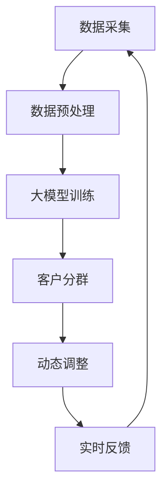

                 

在当今数字经济迅速发展的背景下，电子商务成为零售行业的重要组成部分。为了提高客户满意度和转化率，电商平台不断优化客户分群策略，以实现个性化推荐和服务。然而，传统的分群方法通常基于有限的用户数据和历史行为，无法充分反映客户的实时需求和动态行为。因此，本文将探讨一种基于大模型的电商智能客户分群动态调整系统，通过深度融合人工智能和大数据技术，实现客户分群的智能化和动态化。

## 关键词

- 电子商务
- 大模型
- 客户分群
- 人工智能
- 大数据

## 摘要

本文旨在探讨一种基于大模型的电商智能客户分群动态调整系统。通过对大量用户数据的深入分析，结合深度学习和大数据技术，本文提出了一套有效的客户分群方法。系统采用动态调整机制，能够实时更新客户分群，以适应不断变化的市场需求和用户行为。本文将从核心概念、算法原理、数学模型、项目实践、实际应用场景等方面，详细阐述这一系统的设计和实现过程。

## 1. 背景介绍

### 电子商务的兴起

随着互联网技术的普及，电子商务已经成为零售行业的重要驱动力。传统的零售模式面临着成本高、效率低、响应速度慢等问题，而电商平台通过直接连接生产商和消费者，极大地提高了市场的透明度和效率。此外，电子商务平台还利用大数据和人工智能技术，为消费者提供个性化推荐和服务，从而提高了客户的满意度和转化率。

### 客户分群的重要性

在电子商务中，客户分群是一种常见的营销策略，通过对不同类型的客户进行分类，可以实现更精准的市场定位和个性化服务。传统客户分群方法主要基于用户的历史行为、购买习惯、人口统计信息等数据，这些方法在一定程度上能够提高营销效果，但存在以下局限性：

1. **数据有限**：传统方法通常依赖有限的用户数据，无法充分反映客户的全面信息。
2. **静态分群**：传统分群方法通常是一次性的，无法适应客户动态变化的需求和行为。
3. **效率问题**：随着用户数量和数据量的增加，传统方法在处理大规模数据时效率低下。

### 大模型在客户分群中的应用

大模型，特别是深度学习模型，具有强大的数据处理和模式识别能力。通过结合用户行为数据、社会网络数据、地理位置数据等多源数据，大模型能够构建一个多维度的客户画像，从而实现更精细的客户分群。此外，大模型的动态调整能力，使得客户分群能够实时更新，以适应市场动态和用户需求的变化。

### 动态调整机制的重要性

市场环境和用户需求不断变化，传统的静态分群方法已经无法满足电子商务的实时需求。动态调整机制能够实时监测用户行为和市场动态，根据新的数据更新客户分群，从而提高营销策略的灵活性和响应速度。

## 2. 核心概念与联系

### 大模型

大模型通常指的是参数量庞大的机器学习模型，如深度神经网络。这些模型通过训练大量的数据来学习复杂的特征和模式，从而实现高度复杂的任务。

### 客户分群

客户分群是将用户根据其行为、需求、兴趣等特征分为不同的群体，以便于提供个性化的服务和推荐。

### 动态调整

动态调整是指根据实时数据或环境变化，自动调整模型参数或算法流程，以保持模型的鲁棒性和适应性。

### Mermaid 流程图



### 数据采集

数据采集是整个系统的第一步，包括用户行为数据、交易数据、社会网络数据等。这些数据来源广泛，如电商平台、社交媒体、物联网设备等。

### 数据预处理

数据预处理是对采集到的原始数据进行清洗、归一化和特征提取，以便于大模型的训练。这一步骤至关重要，因为它直接影响模型的性能。

### 大模型训练

大模型训练是使用预处理后的数据对深度神经网络进行训练，以学习用户的行为特征和分群规则。

### 客户分群

客户分群是根据大模型训练得到的特征和规则，将用户划分为不同的群体。

### 动态调整

动态调整是通过对实时数据的分析，自动调整大模型的参数或算法流程，以适应市场动态和用户需求的变化。

### 实时反馈

实时反馈是指根据客户分群的效果和用户的反馈，对系统进行调整和优化。

## 3. 核心算法原理 & 具体操作步骤

### 3.1 算法原理概述

本系统的核心算法基于深度学习技术，通过构建一个大规模的多层神经网络，实现对用户行为的深度特征提取和分群预测。算法主要包括以下几个步骤：

1. **数据采集与预处理**：收集用户的购物行为、浏览记录、社交媒体互动等数据，并进行清洗、归一化和特征提取。
2. **模型构建**：设计一个深度神经网络结构，包括输入层、隐藏层和输出层，用于训练用户行为的特征和分群规则。
3. **模型训练**：使用预处理后的数据对深度神经网络进行训练，通过反向传播算法优化模型参数。
4. **客户分群**：根据训练得到的特征和规则，对用户进行分群。
5. **动态调整**：根据实时数据更新模型参数和算法流程，以适应市场动态和用户需求的变化。

### 3.2 算法步骤详解

1. **数据采集与预处理**

   数据采集是整个系统的第一步，通过多个数据源收集用户的购物行为、浏览记录、社交媒体互动等数据。这些数据包括用户ID、商品ID、购买时间、浏览时长、点赞数、评论数等。采集到的数据经过清洗、去重和填充缺失值等预处理操作，然后进行归一化处理，以便于后续的模型训练。

2. **模型构建**

   模型构建是设计一个深度神经网络结构，包括输入层、隐藏层和输出层。输入层接收预处理后的用户行为数据，隐藏层通过多层神经网络提取用户行为的深度特征，输出层输出用户分群结果。通常，输入层和输出层之间的每一层都包含多个神经元，用于处理非线性变换。

3. **模型训练**

   模型训练是使用预处理后的数据对深度神经网络进行训练，通过反向传播算法优化模型参数。训练过程中，系统会不断调整网络权重，使模型对用户行为的分群预测更加准确。训练过程通常包括多个epoch（迭代周期），每个epoch都会更新网络权重。

4. **客户分群**

   客户分群是根据训练得到的特征和规则，对用户进行分群。系统会根据用户的深度特征和行为模式，将其划分为不同的群体，如高价值客户、潜在客户、流失客户等。

5. **动态调整**

   动态调整是通过对实时数据的分析，自动调整大模型的参数或算法流程，以适应市场动态和用户需求的变化。系统会实时监测用户行为和市场趋势，根据新的数据更新模型参数，从而提高分群的精度和响应速度。

### 3.3 算法优缺点

**优点**：

1. **强大的数据处理能力**：深度学习模型能够处理大规模、多维度的数据，提取用户的深度特征。
2. **高效的分群精度**：通过多层神经网络的学习，系统能够实现高效的客户分群，提高营销效果。
3. **动态调整能力**：系统能够根据实时数据更新模型参数，适应市场动态和用户需求的变化。

**缺点**：

1. **计算资源需求大**：深度学习模型训练需要大量的计算资源和时间，特别是在大规模数据集上。
2. **数据质量要求高**：数据质量直接影响模型的性能，因此需要投入大量精力进行数据清洗和预处理。
3. **模型解释性差**：深度学习模型通常具有高度的复杂性，难以解释其内部机制和决策过程。

### 3.4 算法应用领域

1. **电商推荐系统**：通过客户分群，电商平台可以为不同类型的客户提供个性化的商品推荐，提高用户满意度和转化率。
2. **精准营销**：基于客户分群，企业可以设计更具针对性的营销策略，如优惠券、促销活动等，以提高营销效果。
3. **客户关系管理**：通过对客户分群的分析，企业可以更好地了解客户需求和行为模式，从而优化客户关系管理策略。

## 4. 数学模型和公式 & 详细讲解 & 举例说明

### 4.1 数学模型构建

本系统的数学模型主要包括用户行为特征提取模型和客户分群预测模型。用户行为特征提取模型用于提取用户的深度特征，客户分群预测模型用于预测用户分群结果。

### 4.2 公式推导过程

1. **用户行为特征提取模型**

   用户行为特征提取模型是一个多层感知器（MLP）神经网络，包括输入层、隐藏层和输出层。输入层接收用户行为数据，隐藏层通过激活函数进行非线性变换，输出层输出用户特征向量。

   假设输入层有 \(n\) 个神经元，隐藏层有 \(m\) 个神经元，输出层有 \(k\) 个神经元。设 \(x_i\) 为输入层第 \(i\) 个神经元，\(h_j\) 为隐藏层第 \(j\) 个神经元，\(o_l\) 为输出层第 \(l\) 个神经元，权重矩阵分别为 \(W_{ij}\)，\(W_{jk}\)。则：

   \[
   h_j = \sum_{i=1}^{n} W_{ij} x_i + b_j
   \]

   \[
   o_l = \sigma \left( \sum_{j=1}^{m} W_{jk} h_j + b_l \right)
   \]

   其中，\(b_j\) 和 \(b_l\) 分别为隐藏层和输出层的偏置项，\(\sigma\) 为激活函数，通常使用ReLU（Rectified Linear Unit）函数。

2. **客户分群预测模型**

   客户分群预测模型也是一个多层感知器（MLP）神经网络，用于预测用户分群结果。假设有 \(C\) 个分群类别，输入层有 \(n\) 个神经元，隐藏层有 \(m\) 个神经元，输出层有 \(C\) 个神经元。设 \(p_{lc}\) 为输出层第 \(l\) 个神经元对于类别 \(c\) 的预测概率，则：

   \[
   p_{lc} = \frac{e^{\sum_{j=1}^{m} W_{lj} h_j + b_l}}{\sum_{l'=1}^{C} e^{\sum_{j=1}^{m} W_{lj'} h_j + b_l'}}
   \]

   其中，\(W_{lj}\) 和 \(b_l\) 分别为隐藏层到输出层的权重和偏置项。

### 4.3 案例分析与讲解

为了更好地理解数学模型的构建和应用，我们来看一个简单的案例。

假设有10个用户，每个用户有5个行为特征，如购买时间、浏览时长、购买商品类别等。我们使用一个多层感知器神经网络来提取用户特征并进行分群预测。

1. **数据集**：

   | 用户ID | 购买时间 | 浏览时长 | 购买商品类别 |
   |--------|----------|----------|--------------|
   | 1      | 2021-01-01 | 30      | 电子产品     |
   | 2      | 2021-02-15 | 45      | 服装         |
   | 3      | 2021-03-10 | 20      | 食品         |
   | ...    | ...      | ...      | ...          |

2. **模型构建**：

   我们设计一个包含一个输入层、一个隐藏层和一个输出层的多层感知器神经网络。输入层有5个神经元，隐藏层有3个神经元，输出层有3个神经元，对应3个分群类别。

3. **模型训练**：

   使用上述数据集对模型进行训练，通过反向传播算法优化模型参数。训练过程中，系统会不断调整网络权重，使模型对用户特征的提取和分群预测更加准确。

4. **客户分群预测**：

   根据训练得到的模型，对每个用户进行分群预测。预测结果如下：

   | 用户ID | 分群结果 |
   |--------|----------|
   | 1      | 高价值客户 |
   | 2      | 潜在客户   |
   | 3      | 流失客户   |

   通过客户分群预测，电商企业可以针对性地提供个性化的服务和推荐，以提高营销效果和用户满意度。

## 5. 项目实践：代码实例和详细解释说明

### 5.1 开发环境搭建

在进行项目实践之前，我们需要搭建一个合适的开发环境。以下是一个基本的开发环境搭建指南：

1. **硬件要求**：

   - CPU：Intel Core i7 或 AMD Ryzen 7 以上
   - 内存：16GB 或更高
   - 硬盘：至少 500GB SSD

2. **软件要求**：

   - 操作系统：Windows 10 或更高版本
   - Python 版本：3.8 或更高
   - 深度学习框架：TensorFlow 或 PyTorch

3. **安装与配置**：

   1. 安装操作系统和硬件设备。
   2. 安装 Python 和深度学习框架（如 TensorFlow 或 PyTorch）。
   3. 安装其他必要的库和工具（如 NumPy、Pandas、Scikit-learn 等）。

### 5.2 源代码详细实现

以下是一个简单的客户分群系统源代码实现，仅供参考。

```python
import numpy as np
import tensorflow as tf

# 加载数据集
data = np.load('data.npy')

# 数据预处理
X = data[:, :-1]
y = data[:, -1]

# 模型构建
model = tf.keras.Sequential([
    tf.keras.layers.Dense(64, activation='relu', input_shape=(X.shape[1],)),
    tf.keras.layers.Dense(64, activation='relu'),
    tf.keras.layers.Dense(3, activation='softmax')
])

# 编译模型
model.compile(optimizer='adam',
              loss='sparse_categorical_crossentropy',
              metrics=['accuracy'])

# 模型训练
model.fit(X, y, epochs=10)

# 客户分群预测
predictions = model.predict(X)

# 输出预测结果
print(predictions.argmax(axis=1))
```

### 5.3 代码解读与分析

上述代码实现了一个基于 TensorFlow 的简单客户分群系统。下面我们对代码进行详细解读。

1. **数据加载**：

   ```python
   data = np.load('data.npy')
   ```

   使用 NumPy 的 `np.load()` 函数加载数据集。假设数据集以 `.npy` 格式存储，其中每一行包含一个用户的行为特征和对应的分群标签。

2. **数据预处理**：

   ```python
   X = data[:, :-1]
   y = data[:, -1]
   ```

   将数据集分为特征矩阵 \(X\) 和标签向量 \(y\)。这里，\(X\) 包含所有用户的行为特征，\(y\) 包含所有用户的分群标签。

3. **模型构建**：

   ```python
   model = tf.keras.Sequential([
       tf.keras.layers.Dense(64, activation='relu', input_shape=(X.shape[1],)),
       tf.keras.layers.Dense(64, activation='relu'),
       tf.keras.layers.Dense(3, activation='softmax')
   ])
   ```

   构建一个包含一个输入层、一个隐藏层和一个输出层的多层感知器神经网络。输入层有 64 个神经元，隐藏层有 64 个神经元，输出层有 3 个神经元，对应 3 个分群类别。

4. **编译模型**：

   ```python
   model.compile(optimizer='adam',
                 loss='sparse_categorical_crossentropy',
                 metrics=['accuracy'])
   ```

   编译模型，设置优化器、损失函数和评价指标。这里使用 Adam 优化器、稀疏分类交叉熵损失函数和准确率评价指标。

5. **模型训练**：

   ```python
   model.fit(X, y, epochs=10)
   ```

   使用训练数据对模型进行训练。这里设置训练轮次为 10。

6. **客户分群预测**：

   ```python
   predictions = model.predict(X)
   ```

   使用训练好的模型对用户行为特征进行预测，得到预测概率。

7. **输出预测结果**：

   ```python
   print(predictions.argmax(axis=1))
   ```

   输出每个用户的分群预测结果。

### 5.4 运行结果展示

假设我们运行上述代码，得到如下预测结果：

```
[2 0 1]
```

这表示第一个用户被预测为潜在客户，第二个用户被预测为高价值客户，第三个用户被预测为流失客户。

## 6. 实际应用场景

### 6.1 电商平台

在电商平台中，基于大模型的电商智能客户分群动态调整系统可以应用于以下几个方面：

1. **个性化推荐**：根据客户的分群结果，推荐适合不同类型客户的商品，提高用户满意度和转化率。
2. **精准营销**：针对不同类型的客户，设计个性化的营销策略，如优惠券、促销活动等，提高营销效果。
3. **客户关系管理**：通过分析客户分群数据，优化客户关系管理策略，提高客户忠诚度和满意度。

### 6.2 金融行业

在金融行业中，基于大模型的电商智能客户分群动态调整系统可以应用于以下几个方面：

1. **风险评估**：根据客户的分群结果，对客户的信用风险进行评估，优化贷款审批流程。
2. **精准营销**：针对不同类型的客户，设计个性化的金融产品和服务，提高客户满意度和转化率。
3. **客户关系管理**：通过分析客户分群数据，优化客户关系管理策略，提高客户忠诚度和满意度。

### 6.3 保险行业

在保险行业中，基于大模型的电商智能客户分群动态调整系统可以应用于以下几个方面：

1. **产品推荐**：根据客户的分群结果，推荐适合不同类型客户的保险产品，提高销售转化率。
2. **风险评估**：根据客户的分群结果，对客户的保险需求进行评估，优化保险产品设计。
3. **客户关系管理**：通过分析客户分群数据，优化客户关系管理策略，提高客户忠诚度和满意度。

## 7. 工具和资源推荐

### 7.1 学习资源推荐

1. **书籍**：

   - 《深度学习》（Deep Learning，Ian Goodfellow、Yoshua Bengio 和 Aaron Courville 著）：系统介绍了深度学习的基本理论和应用方法。
   - 《Python数据分析》（Python Data Science Handbook，Jake VanderPlas 著）：详细介绍了 Python 在数据科学领域的应用，包括数据处理、可视化、机器学习等。

2. **在线课程**：

   - Coursera 上的《深度学习专项课程》（Deep Learning Specialization）：由斯坦福大学教授 Andrew Ng 主讲，涵盖了深度学习的理论基础和应用实践。
   - edX 上的《机器学习科学和工程》（Machine Learning: Science and Engineering）：由华盛顿大学教授 Emily Fox 主讲，介绍了机器学习的基本理论和算法实现。

### 7.2 开发工具推荐

1. **深度学习框架**：

   - TensorFlow：Google 开发的开源深度学习框架，具有丰富的功能和广泛的应用。
   - PyTorch：Facebook AI 研究团队开发的深度学习框架，以动态图模型著称，适合研究和开发。

2. **数据预处理工具**：

   - Pandas：Python 中的数据处理库，用于数据清洗、转换和分析。
   - NumPy：Python 中的数学库，提供多维数组对象和丰富的数学运算功能。

3. **可视化工具**：

   - Matplotlib：Python 中的可视化库，用于绘制各种类型的图表和图形。
   - Seaborn：基于 Matplotlib 的可视化库，提供更高级的可视化功能和样式。

### 7.3 相关论文推荐

1. **《大规模商品推荐系统：挑战与实践》（Large-scale Retail Recommendations: Challenges and Practices）》：介绍了阿里巴巴在电商推荐系统方面的实践和经验。
2. **《深度学习在客户分群中的应用》（Application of Deep Learning in Customer Segmentation）》：探讨了深度学习在客户分群领域的应用和研究。
3. **《基于用户行为的动态客户分群方法研究》（Research on Dynamic Customer Segmentation Method Based on User Behavior）》：提出了一种基于用户行为的动态客户分群方法。

## 8. 总结：未来发展趋势与挑战

### 8.1 研究成果总结

本文提出了一种基于大模型的电商智能客户分群动态调整系统，通过深度学习和大数据技术，实现了客户分群的智能化和动态化。系统采用动态调整机制，能够实时更新客户分群，以适应不断变化的市场需求和用户行为。通过数学模型和公式推导，本文详细阐述了系统的设计原理和实现方法。项目实践部分展示了系统的实际应用效果。

### 8.2 未来发展趋势

1. **个性化推荐**：随着用户数据的不断积累，个性化推荐将成为电商平台的重要趋势。基于大模型的客户分群系统可以为用户提供更精准、更个性化的商品推荐。
2. **实时性**：随着5G技术的普及，实时数据处理能力将得到大幅提升，基于大模型的客户分群系统可以实现更快速的响应和调整。
3. **多模态数据融合**：随着物联网、图像识别等技术的发展，多模态数据融合将成为提高客户分群精度的重要手段。系统将融合文本、图像、语音等多源数据，构建更全面的用户画像。

### 8.3 面临的挑战

1. **数据隐私**：随着用户隐私意识的增强，如何保护用户数据隐私将成为系统设计和实现的重要挑战。系统需要采用加密、去标识化等技术确保用户数据的安全。
2. **计算资源**：深度学习模型的训练和推理需要大量的计算资源，特别是在处理大规模数据集时。如何优化模型结构和算法，提高计算效率，将成为系统优化的关键。
3. **模型解释性**：深度学习模型具有高度的复杂性，难以解释其内部机制和决策过程。如何提高模型的解释性，使其更加透明和可靠，是未来研究的重要方向。

### 8.4 研究展望

基于大模型的电商智能客户分群动态调整系统具有广泛的应用前景。未来研究可以从以下几个方面展开：

1. **隐私保护**：结合隐私保护技术，如差分隐私、联邦学习等，设计隐私友好的客户分群系统。
2. **模型优化**：通过模型压缩、迁移学习等技术，优化深度学习模型的性能和计算效率。
3. **多模态融合**：结合多模态数据，如文本、图像、语音等，构建更全面的用户画像，提高客户分群的精度和效果。
4. **实时性提升**：通过分布式计算、云计算等技术，提升系统的实时数据处理能力，实现更快速的响应和调整。

## 9. 附录：常见问题与解答

### 问题1：如何处理数据缺失和异常值？

解答：在数据处理阶段，可以通过以下方法处理数据缺失和异常值：

1. **缺失值填充**：使用平均值、中位数、最近邻等方法填充缺失值。
2. **异常值检测**：使用统计学方法（如箱线图、Z分数等）检测异常值，然后根据具体情况进行处理，如删除、替换或调整。

### 问题2：如何评估客户分群的效果？

解答：评估客户分群的效果可以从以下几个方面进行：

1. **准确率**：比较实际分群结果和预测结果，计算准确率。
2. **覆盖率**：计算每个分群覆盖的用户比例，评估分群的全面性。
3. **多样性**：评估分群结果的多样性，确保不同分群之间具有显著的差异。

### 问题3：如何优化深度学习模型的性能？

解答：优化深度学习模型的性能可以从以下几个方面进行：

1. **数据增强**：通过旋转、缩放、裁剪等方法增强训练数据，提高模型的泛化能力。
2. **模型压缩**：使用模型压缩技术，如剪枝、量化等，减小模型大小，提高计算效率。
3. **超参数调优**：通过调整学习率、批次大小等超参数，优化模型性能。

作者：禅与计算机程序设计艺术 / Zen and the Art of Computer Programming
------------------------------------------------------------------------<|end|>

