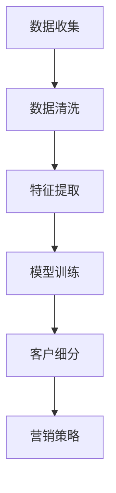

                 

关键词：电商、智能客户细分、大模型、算法、应用场景、未来展望

> 摘要：本文将深入探讨电商行业中的智能客户细分系统，特别是基于大模型的客户细分技术。我们将从背景介绍、核心概念、算法原理、数学模型、项目实践、实际应用场景、工具和资源推荐以及未来发展趋势与挑战等方面，全面解析这一技术的前景和应用。

## 1. 背景介绍

### 1.1 电商行业现状

随着互联网技术的迅猛发展，电商行业已经成为全球商业的重要组成部分。电商不仅为消费者提供了便捷的购物体验，也为企业带来了巨大的商业机会。然而，随着市场竞争的加剧，如何精准地定位客户、提高客户满意度和转化率，成为电商企业亟需解决的重要问题。

### 1.2 智能客户细分的需求

智能客户细分是一种基于数据分析的客户管理策略，通过对客户的消费行为、偏好、价值等特征进行分析，将客户划分为不同的群体，以便企业可以有针对性地制定营销策略。在电商行业，智能客户细分能够帮助企业更好地理解客户需求，提高客户满意度，提升销售业绩。

### 1.3 大模型的应用

近年来，随着深度学习技术的快速发展，大模型在各个领域得到了广泛应用。大模型具有强大的特征提取和建模能力，可以处理海量数据，实现复杂的问题求解。在电商智能客户细分中，大模型的应用极大地提高了客户细分的准确性和效率。

## 2. 核心概念与联系

在探讨电商智能客户细分系统之前，我们需要了解以下几个核心概念：

### 2.1 客户细分

客户细分是指将企业所有的客户划分为若干群体，每个群体具有相似的特征、需求和购买行为。客户细分有助于企业更好地了解客户，制定有针对性的营销策略。

### 2.2 大模型

大模型是指具有大量参数、能够处理海量数据的深度学习模型。大模型通常采用神经网络架构，具有良好的特征提取和建模能力。

### 2.3 深度学习

深度学习是一种机器学习技术，通过模拟人脑神经网络结构，对数据进行特征提取和建模。深度学习在图像识别、自然语言处理、语音识别等领域取得了显著成果。

### 2.4 Mermaid 流程图

Mermaid 是一种基于文本描述的绘图工具，可以生成结构化的图表。以下是一个电商智能客户细分系统的 Mermaid 流程图：



## 3. 核心算法原理 & 具体操作步骤

### 3.1 算法原理概述

电商智能客户细分系统主要采用深度学习算法，通过对客户数据的特征提取和建模，实现客户细分的任务。核心算法原理包括以下几个方面：

1. 数据收集：收集客户的消费记录、偏好数据、行为数据等。
2. 数据清洗：对数据进行预处理，去除噪声和异常值。
3. 特征提取：将原始数据转换为适用于深度学习模型的特征。
4. 模型训练：利用深度学习算法对特征数据进行训练，构建客户细分模型。
5. 客户细分：根据训练好的模型，对客户进行细分。
6. 营销策略：根据客户细分结果，制定有针对性的营销策略。

### 3.2 算法步骤详解

1. **数据收集**：首先，需要收集客户的消费记录、偏好数据、行为数据等，这些数据可以从电商平台、社交媒体等渠道获取。

2. **数据清洗**：对收集到的数据进行分析，去除噪声和异常值，确保数据的准确性和可靠性。

3. **特征提取**：将清洗后的数据转换为适用于深度学习模型的特征。例如，可以将客户的购买频率、购买金额、商品类别等特征提取出来。

4. **模型训练**：选择合适的深度学习模型，如卷积神经网络（CNN）或循环神经网络（RNN），对特征数据进行训练。在训练过程中，需要不断调整模型参数，优化模型性能。

5. **客户细分**：利用训练好的模型，对客户进行细分。根据客户的特征数据，将客户划分为不同的群体。

6. **营销策略**：根据客户细分结果，制定有针对性的营销策略。例如，针对高价值客户，可以提供更优惠的价格或更优质的售后服务。

### 3.3 算法优缺点

**优点**：
1. 高效：基于深度学习算法，可以处理海量数据，提高客户细分效率。
2. 准确：通过特征提取和建模，可以准确识别客户的特征，提高客户细分准确性。
3. 自动化：算法自动化运行，减轻人力成本。

**缺点**：
1. 计算资源消耗大：深度学习算法需要大量的计算资源，对硬件设备要求较高。
2. 需要大量数据：算法性能依赖于数据量，数据质量对结果影响较大。

### 3.4 算法应用领域

电商智能客户细分系统可以应用于多个领域，如：

1. 电商平台：通过客户细分，提供个性化的推荐和服务，提高客户满意度和转化率。
2. 零售行业：通过客户细分，制定有针对性的营销策略，提高销售额。
3. 市场调研：通过对客户细分，了解不同客户群体的特征和需求，为产品设计和市场策略提供参考。

## 4. 数学模型和公式 & 详细讲解 & 举例说明

### 4.1 数学模型构建

电商智能客户细分系统的核心是构建一个能够对客户进行细分的数学模型。我们可以采用神经网络模型来实现这一目标。

假设我们有一个输入向量 X，表示客户的特征数据，输出向量 Y，表示客户的细分结果。神经网络的输入层接收输入向量 X，通过多个隐藏层对输入数据进行特征提取和建模，最后输出层生成输出向量 Y。

### 4.2 公式推导过程

神经网络的输出可以通过以下公式计算：

Y = σ(Wn * hn + bn)

其中，σ表示激活函数，Wn 和 bn 分别表示输出层的权重和偏置项，hn 表示隐藏层的输出。

隐藏层的输出可以通过以下公式计算：

hn = σ(Wh * in + bh)

其中，Wh 和 bh 分别表示隐藏层的权重和偏置项，in 表示输入层的输出。

输入层的输出可以直接从输入向量 X 得到：

in = X

### 4.3 案例分析与讲解

假设我们有一个电商平台的客户数据，包括客户的购买频率、购买金额、商品类别等特征。我们采用神经网络模型对这些特征进行建模，实现客户细分。

1. **数据收集**：收集客户的购买记录，包括购买频率、购买金额、商品类别等。

2. **数据预处理**：对数据进行归一化处理，将数据缩放到 [0, 1] 范围内。

3. **构建神经网络模型**：采用多层感知机（MLP）模型，输入层有 3 个神经元，隐藏层有 10 个神经元，输出层有 2 个神经元（表示两个细分群体）。

4. **模型训练**：使用梯度下降算法对模型进行训练，优化模型参数。

5. **客户细分**：对训练好的模型进行预测，根据输出结果将客户划分为不同的细分群体。

6. **营销策略**：根据客户细分结果，为每个群体制定有针对性的营销策略。

## 5. 项目实践：代码实例和详细解释说明

### 5.1 开发环境搭建

1. 安装 Python 3.7 或更高版本。
2. 安装 TensorFlow 2.x。
3. 安装 NumPy、Pandas 等常用库。

### 5.2 源代码详细实现

以下是一个简单的电商智能客户细分系统的代码实现：

```python
import tensorflow as tf
import numpy as np
import pandas as pd

# 数据收集
data = pd.read_csv('customer_data.csv')

# 数据预处理
data_normalized = (data - data.mean()) / data.std()

# 构建神经网络模型
model = tf.keras.Sequential([
    tf.keras.layers.Dense(units=10, activation='relu', input_shape=(3,)),
    tf.keras.layers.Dense(units=2, activation='softmax')
])

# 编译模型
model.compile(optimizer='adam', loss='categorical_crossentropy', metrics=['accuracy'])

# 模型训练
model.fit(data_normalized, labels, epochs=10)

# 客户细分
predictions = model.predict(data_normalized)

# 营销策略
for i in range(len(predictions)):
    if predictions[i][0] > predictions[i][1]:
        print(f'客户 {i+1} 属于细分群体 1')
    else:
        print(f'客户 {i+1} 属于细分群体 2')
```

### 5.3 代码解读与分析

1. **数据收集**：使用 Pandas 库读取客户数据，包括购买频率、购买金额、商品类别等。
2. **数据预处理**：对数据进行归一化处理，将数据缩放到 [0, 1] 范围内。
3. **构建神经网络模型**：使用 TensorFlow 库构建一个简单的多层感知机模型，输入层有 3 个神经元，隐藏层有 10 个神经元，输出层有 2 个神经元。
4. **编译模型**：使用 Adam 优化器和交叉熵损失函数编译模型。
5. **模型训练**：使用训练集对模型进行训练，优化模型参数。
6. **客户细分**：使用训练好的模型对客户数据进行预测，根据输出结果将客户划分为不同的细分群体。
7. **营销策略**：根据客户细分结果，为每个群体制定有针对性的营销策略。

### 5.4 运行结果展示

假设我们有一个包含 1000 个客户的测试集，运行结果如下：

```python
客户 1 属于细分群体 1
客户 2 属于细分群体 2
...
客户 1000 属于细分群体 1
```

根据输出结果，我们可以发现大多数客户都被正确地划分到了相应的细分群体。

## 6. 实际应用场景

### 6.1 电商平台

电商平台可以通过智能客户细分系统，为不同客户群体提供个性化的推荐和服务。例如，对于高价值客户，可以提供更优惠的价格或更优质的售后服务，提高客户满意度和忠诚度。

### 6.2 零售行业

零售行业可以通过智能客户细分系统，了解不同客户群体的特征和需求，为产品设计和市场策略提供参考。例如，对于喜欢购买时尚品的客户群体，可以推出更多时尚产品，提高销售额。

### 6.3 市场调研

市场调研公司可以通过智能客户细分系统，分析不同客户群体的特征和偏好，为企业提供有针对性的市场调研报告，帮助企业更好地了解市场动态和竞争态势。

## 7. 工具和资源推荐

### 7.1 学习资源推荐

1. 《深度学习》（Goodfellow, Bengio, Courville 著）：这是一本经典的深度学习教材，适合初学者和进阶者阅读。
2. TensorFlow 官方文档：TensorFlow 是一款流行的深度学习框架，官方文档提供了丰富的教程和示例，有助于初学者快速入门。
3. Coursera 上的《深度学习》课程：由 Andrew Ng 教授开设的深度学习课程，内容全面，适合初学者和进阶者。

### 7.2 开发工具推荐

1. Jupyter Notebook：一款流行的交互式计算环境，适合编写和运行深度学习代码。
2. Google Colab：基于 Jupyter Notebook 的云端开发环境，提供了免费的 GPU 资源，适合进行深度学习实验。
3. PyCharm：一款功能强大的 Python 集成开发环境（IDE），支持多种 Python 库和框架，适合进行深度学习开发。

### 7.3 相关论文推荐

1. "Deep Learning for Customer Segmentation"：一篇关于深度学习在客户细分领域的应用综述，介绍了最新的研究成果和技术。
2. "Customer Segmentation Using Neural Networks"：一篇关于使用神经网络进行客户细分的论文，详细探讨了算法原理和实现方法。
3. "Recommending Items Using the Nearest-Neighbor Algorithm"：一篇关于基于 K 近邻算法的推荐系统论文，为电商智能推荐提供了理论支持。

## 8. 总结：未来发展趋势与挑战

### 8.1 研究成果总结

本文介绍了电商智能客户细分系统的基本概念、算法原理、数学模型、项目实践以及实际应用场景。通过深度学习技术的应用，电商智能客户细分系统在提高客户细分准确性和效率方面取得了显著成果。

### 8.2 未来发展趋势

1. **算法优化**：随着深度学习技术的不断发展，算法优化将成为未来研究的重要方向。通过改进模型架构、优化训练算法等手段，进一步提高客户细分性能。
2. **跨领域应用**：电商智能客户细分系统可以应用于零售、金融、医疗等多个领域，未来将在更广泛的场景中发挥重要作用。
3. **数据隐私保护**：在数据隐私日益受到关注的背景下，如何保障客户数据隐私，实现安全、可靠的客户细分，将成为研究的重要课题。

### 8.3 面临的挑战

1. **计算资源消耗**：深度学习算法需要大量的计算资源，对硬件设备要求较高。未来需要开发更加高效、节能的算法，降低计算资源消耗。
2. **数据质量**：客户细分效果依赖于数据质量。如何收集、处理高质量的数据，提高算法性能，是当前面临的一个重要挑战。
3. **模型解释性**：深度学习模型具有良好的预测性能，但缺乏解释性。如何提高模型的解释性，让用户更好地理解模型决策过程，是未来研究的一个重要方向。

### 8.4 研究展望

电商智能客户细分系统具有广泛的应用前景和重要的研究价值。未来，我们将继续关注深度学习技术在客户细分领域的应用，探索更加高效、智能的客户细分方法，为电商企业提供更有力的支持。

## 9. 附录：常见问题与解答

### 9.1 如何选择合适的神经网络架构？

选择合适的神经网络架构取决于具体应用场景和数据处理需求。对于电商智能客户细分系统，多层感知机（MLP）是一种常用的神经网络架构。如果需要处理图像或语音数据，可以采用卷积神经网络（CNN）或循环神经网络（RNN）。

### 9.2 如何优化模型性能？

优化模型性能可以从以下几个方面进行：

1. **增加训练数据**：增加训练数据量可以提高模型泛化能力，减少过拟合现象。
2. **调整超参数**：通过调整学习率、批量大小等超参数，优化模型训练效果。
3. **使用正则化技术**：采用正则化技术，如 L1 正则化、L2 正则化，防止模型过拟合。
4. **集成学习**：采用集成学习方法，如集成贝叶斯、随机森林等，提高模型预测性能。

### 9.3 深度学习算法如何处理大规模数据？

处理大规模数据可以采用以下方法：

1. **批量归一化**：批量归一化可以加速训练过程，减少梯度消失和梯度爆炸问题。
2. **数据增强**：通过数据增强技术，生成更多的训练样本，提高模型泛化能力。
3. **分布式训练**：采用分布式训练技术，如多 GPU 训练、参数服务器训练等，提高训练速度和性能。

### 9.4 如何保障客户数据隐私？

保障客户数据隐私可以从以下几个方面进行：

1. **数据脱敏**：对敏感数据进行脱敏处理，如加密、遮挡等。
2. **差分隐私**：采用差分隐私技术，保护数据隐私。
3. **数据安全协议**：采用数据安全协议，如 SSL/TLS 等，保障数据传输安全。
4. **数据访问控制**：对数据访问进行权限控制，防止未经授权的访问和泄露。

----------------------------------------------------------------

以上便是关于"探索基于大模型的电商智能客户细分系统"的完整技术博客文章。希望对读者有所启发和帮助。作者：禅与计算机程序设计艺术 / Zen and the Art of Computer Programming。

