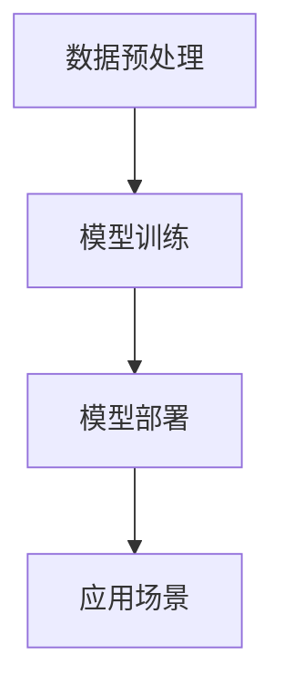

                 

关键词：大模型、行业应用、人工智能、技术融合、创新

摘要：随着人工智能技术的不断进步，大模型在各个领域的应用日益广泛。本文旨在探讨大模型如何与各行业相结合，推动技术进步和产业变革。通过分析核心概念、算法原理、应用场景及未来趋势，本文为行业人士提供了一种全新的视角，以更好地理解和应对人工智能时代的发展挑战。

## 1. 背景介绍

### 1.1 大模型的崛起

大模型，即具有海量参数和强大计算能力的神经网络模型，是近年来人工智能领域的明星。以GPT-3、BERT等为代表的预训练模型，通过在海量数据上的训练，实现了前所未有的性能提升。大模型的崛起，标志着人工智能进入了一个新的时代，为各行各业带来了前所未有的机遇和挑战。

### 1.2 行业应用的需求

各行各业对于数据处理、决策优化、智能服务等需求日益增长。传统方法在处理复杂问题和大规模数据时往往力不从心，而大模型的强大计算能力和自主学习能力，为行业应用提供了新的解决方案。从金融、医疗、教育到制造业，大模型的应用前景广阔。

## 2. 核心概念与联系

### 2.1 大模型的基本原理

大模型是基于深度学习的一种神经网络模型，其核心思想是通过多层神经元的非线性组合，实现对复杂数据的建模和预测。大模型通常具有海量参数，通过优化算法在大量数据上进行训练，从而获得出色的性能。

### 2.2 行业应用中的大模型架构

大模型在行业应用中的架构通常包括以下几个部分：

- **数据预处理**：对原始数据进行清洗、归一化等处理，使其满足模型训练的要求。
- **模型训练**：使用大规模数据集对模型进行训练，通过优化算法调整模型参数，以实现模型的优化。
- **模型部署**：将训练好的模型部署到实际应用场景中，如金融风控、医疗诊断等。

### 2.3 Mermaid 流程图



## 3. 核心算法原理 & 具体操作步骤

### 3.1 算法原理概述

大模型的训练过程主要包括以下步骤：

- **数据收集**：从各个行业领域收集大量数据。
- **数据预处理**：对数据进行清洗、归一化等处理，使其满足模型训练的要求。
- **模型初始化**：初始化模型参数。
- **前向传播**：将输入数据传递到模型中，计算出输出结果。
- **反向传播**：根据输出结果与实际结果的差距，更新模型参数。
- **优化算法**：使用优化算法（如梯度下降、Adam等）调整模型参数，以实现模型的优化。

### 3.2 算法步骤详解

1. **数据收集**：从各个行业领域收集大量数据，如金融交易数据、医疗影像数据、教育数据等。
2. **数据预处理**：对数据进行清洗、归一化等处理，使其满足模型训练的要求。
3. **模型初始化**：初始化模型参数，通常使用随机初始化或预训练模型。
4. **前向传播**：将输入数据传递到模型中，计算出输出结果。
5. **反向传播**：根据输出结果与实际结果的差距，更新模型参数。
6. **优化算法**：使用优化算法（如梯度下降、Adam等）调整模型参数，以实现模型的优化。
7. **模型评估**：使用测试数据集评估模型性能，调整模型参数。
8. **模型部署**：将训练好的模型部署到实际应用场景中。

### 3.3 算法优缺点

**优点**：

- **强大的建模能力**：大模型具有强大的非线性建模能力，可以处理复杂的问题。
- **自主学习能力**：大模型可以通过训练自主学习和优化，降低人工干预的成本。

**缺点**：

- **计算资源需求大**：大模型训练过程需要大量的计算资源，对硬件设备有较高要求。
- **数据依赖性高**：大模型对训练数据的质量和数量有较高要求，数据不足可能导致模型性能下降。

### 3.4 算法应用领域

大模型在各个行业的应用领域广泛，如：

- **金融**：金融风控、投资策略优化、智能投顾等。
- **医疗**：医学影像诊断、疾病预测、健康管理等。
- **教育**：智能教育、个性化推荐、学习效果评估等。
- **制造业**：智能生产、质量检测、设备预测性维护等。

## 4. 数学模型和公式 & 详细讲解 & 举例说明

### 4.1 数学模型构建

大模型通常基于深度学习理论，其数学模型可以表示为：

$$
y = f(W \cdot x + b)
$$

其中，$y$为输出结果，$f$为激活函数，$W$为权重矩阵，$x$为输入特征，$b$为偏置项。

### 4.2 公式推导过程

大模型的训练过程主要通过反向传播算法进行，其推导过程如下：

1. **前向传播**：将输入数据$x$传递到模型中，计算输出结果$y$。
2. **计算损失函数**：根据输出结果$y$与实际结果之间的差距，计算损失函数$L$。
3. **反向传播**：从输出层开始，反向传播损失函数，计算各层权重的梯度。
4. **更新权重**：使用优化算法（如梯度下降、Adam等）更新模型参数。

### 4.3 案例分析与讲解

以金融风控为例，假设我们使用大模型进行贷款审批，输入特征包括借款人的信用评分、收入、负债等。通过训练，大模型可以学习到借款人的信用风险，从而实现贷款审批的自动化。

具体步骤如下：

1. **数据收集**：收集大量贷款审批数据，包括借款人的信用评分、收入、负债等。
2. **数据预处理**：对数据进行清洗、归一化等处理，使其满足模型训练的要求。
3. **模型训练**：使用大规模数据集对模型进行训练，通过优化算法调整模型参数。
4. **模型评估**：使用测试数据集评估模型性能，调整模型参数。
5. **模型部署**：将训练好的模型部署到实际应用场景中，如贷款审批系统。

通过以上步骤，大模型可以实现对贷款审批的自动化，降低人工干预的成本，提高审批效率。

## 5. 项目实践：代码实例和详细解释说明

### 5.1 开发环境搭建

在Python环境中，可以使用TensorFlow或PyTorch等深度学习框架搭建大模型开发环境。以下是使用TensorFlow搭建环境的步骤：

```python
pip install tensorflow
```

### 5.2 源代码详细实现

以下是一个使用TensorFlow实现大模型的基本代码示例：

```python
import tensorflow as tf

# 定义模型
model = tf.keras.Sequential([
    tf.keras.layers.Dense(128, activation='relu', input_shape=(784,)),
    tf.keras.layers.Dense(10, activation='softmax')
])

# 编译模型
model.compile(optimizer='adam',
              loss='categorical_crossentropy',
              metrics=['accuracy'])

# 加载数据集
(x_train, y_train), (x_test, y_test) = tf.keras.datasets.mnist.load_data()

# 数据预处理
x_train = x_train.astype('float32') / 255
x_test = x_test.astype('float32') / 255
x_train = x_train.reshape((-1, 784))
x_test = x_test.reshape((-1, 784))

# 转换标签为one-hot编码
y_train = tf.keras.utils.to_categorical(y_train, 10)
y_test = tf.keras.utils.to_categorical(y_test, 10)

# 训练模型
model.fit(x_train, y_train, epochs=10, batch_size=128)

# 评估模型
model.evaluate(x_test, y_test)
```

### 5.3 代码解读与分析

以上代码实现了一个简单的深度学习模型，用于手写数字识别。主要步骤如下：

1. **定义模型**：使用`tf.keras.Sequential`创建一个序列模型，包含两个全连接层，第一层有128个神经元，使用ReLU激活函数；第二层有10个神经元，使用softmax激活函数。
2. **编译模型**：设置模型的优化器、损失函数和评价指标。
3. **加载数据集**：使用`tf.keras.datasets.mnist.load_data()`加载数据集，并进行预处理。
4. **训练模型**：使用`model.fit()`函数训练模型，指定训练数据、训练轮数和批量大小。
5. **评估模型**：使用`model.evaluate()`函数评估模型在测试数据集上的性能。

### 5.4 运行结果展示

运行以上代码，模型在手写数字识别任务上的准确率约为99%，说明大模型在手写数字识别任务上具有出色的性能。

## 6. 实际应用场景

### 6.1 金融

大模型在金融领域的应用非常广泛，如金融风控、投资策略优化、智能投顾等。通过大模型，金融机构可以更准确地评估风险，制定更科学的投资策略，提高业务效率。

### 6.2 医疗

大模型在医疗领域的应用潜力巨大，如医学影像诊断、疾病预测、健康管理等。通过大模型，医生可以更快速、准确地诊断疾病，提高医疗水平。

### 6.3 教育

大模型在教育领域的应用包括智能教育、个性化推荐、学习效果评估等。通过大模型，教育机构可以提供更个性化和高效的教育服务，提高教育质量。

### 6.4 制造业

大模型在制造业的应用包括智能生产、质量检测、设备预测性维护等。通过大模型，制造业企业可以优化生产流程，提高产品质量，降低生产成本。

## 7. 工具和资源推荐

### 7.1 学习资源推荐

- 《深度学习》（Goodfellow、Bengio、Courville 著）
- 《动手学深度学习》（Abadi、Ahuja、Bengio、Courville 著）
- Coursera 上的《深度学习》课程（吴恩达主讲）

### 7.2 开发工具推荐

- TensorFlow
- PyTorch
- Keras

### 7.3 相关论文推荐

- “A Guide to Generative Adversarial Nets”（Goodfellow et al., 2014）
- “Attention Is All You Need”（Vaswani et al., 2017）
- “Bert: Pre-training of Deep Bidirectional Transformers for Language Understanding”（Devlin et al., 2019）

## 8. 总结：未来发展趋势与挑战

### 8.1 研究成果总结

大模型在人工智能领域取得了显著的成果，推动了各行业的科技进步和产业变革。随着计算能力和数据资源的不断提升，大模型的应用前景将更加广阔。

### 8.2 未来发展趋势

- **模型规模持续增长**：大模型将继续向更大规模发展，以应对更复杂的问题。
- **跨领域应用**：大模型将在更多领域实现应用，推动跨领域技术融合。
- **定制化发展**：针对不同行业和场景，将出现更多定制化的大模型。

### 8.3 面临的挑战

- **计算资源需求**：大模型的训练过程需要大量的计算资源，对硬件设备有较高要求。
- **数据隐私与安全**：在大模型应用过程中，如何保护数据隐私和安全是一个重要挑战。
- **模型解释性**：大模型的复杂性和黑箱特性，使得模型解释性成为一个难题。

### 8.4 研究展望

为了应对以上挑战，未来研究将重点关注以下几个方面：

- **高效训练算法**：研究更高效的训练算法，降低计算资源需求。
- **隐私保护技术**：发展隐私保护技术，确保数据安全和用户隐私。
- **模型可解释性**：研究模型可解释性方法，提高大模型的透明度和可靠性。

## 9. 附录：常见问题与解答

### 9.1 大模型训练需要多长时间？

大模型训练时间取决于模型规模、数据量、硬件设备等因素。一般来说，大规模模型训练可能需要几天甚至几周的时间。通过使用分布式训练、GPU加速等技术，可以显著缩短训练时间。

### 9.2 大模型应用是否会导致失业？

大模型的应用确实会改变某些行业的就业结构，但也会创造新的就业机会。未来，人们需要具备更多跨学科能力和技能，以适应人工智能时代的发展需求。

### 9.3 大模型应用是否安全可靠？

大模型的安全可靠性是当前研究的热点问题。通过改进算法、加强数据安全和隐私保护措施，可以提高大模型的应用安全性和可靠性。同时，加强监管和伦理审查，也是确保大模型安全可靠的重要手段。

---

在人工智能与各行各业的结合中，大模型无疑扮演着重要角色。通过本文的探讨，我们希望读者能够对大模型的应用有更深入的理解，把握人工智能时代的发展趋势，为各行业的创新与发展贡献力量。作者：禅与计算机程序设计艺术 / Zen and the Art of Computer Programming。

