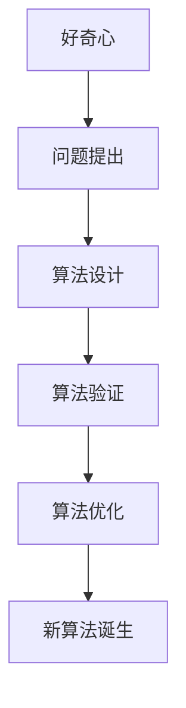

                 

在人类文明的发展历程中，好奇心一直驱动着我们不断探索未知的领域。正是这种好奇心，让我们从石器时代走向了信息化时代，从对自然界的敬畏转变为对宇宙的探索。本文将探讨好奇心在科学发现中的重要作用，以及如何通过好奇心驱动科学创新。

## 1. 背景介绍

好奇心是人类天生的一种心理特征，它促使我们寻找新的知识和信息。科学发现的过程中，好奇心起到了至关重要的作用。从亚里士多德到牛顿，从达尔文到爱因斯坦，每一个伟大的科学发现背后都有着强烈的好奇心作为驱动力。本文将结合计算机科学领域的一些实例，阐述好奇心如何激发科学发现。

## 2. 核心概念与联系

在计算机科学领域，好奇心促使了算法的不断创新。下面是一个简化的 Mermaid 流程图，展示了算法创新与好奇心之间的联系。



### 2.1 好奇心驱动的问题提出

科学发现往往始于一个问题。好奇心促使科学家们不断提出新问题，挑战现有的知识体系。例如，计算机科学家们在面对图像识别难题时，产生了对深度学习算法的好奇，从而推动了该领域的快速发展。

### 2.2 好奇心驱动的算法设计

算法设计是科学发现的另一个关键环节。科学家们通过不断的实验和思考，提出了各种创新性的算法。以神经网络为例，其诞生源于对人类大脑处理信息的模式的好奇，从而开创了人工智能的新时代。

### 2.3 好奇心驱动的算法验证

算法验证是确保科学发现正确性的重要步骤。科学家们通过实验数据来验证算法的有效性，从而不断完善和优化算法。例如，深度学习算法在图像识别任务中的成功，正是因为其在大量数据上的验证。

### 2.4 好奇心驱动的算法优化

科学发现往往是一个迭代过程。科学家们通过不断优化算法，使其在性能上达到新的高度。以量子计算为例，其发展历程就是不断优化算法和硬件的结果。

### 2.5 好奇心驱动的新的算法诞生

好奇心不仅推动了现有算法的优化，还促使新的算法不断诞生。例如，近年来兴起的图神经网络，就是在对传统神经网络不足的好奇心驱动下，提出的一种新型算法。

## 3. 核心算法原理 & 具体操作步骤

### 3.1 算法原理概述

深度学习算法是近年来计算机科学领域的重要突破之一。它通过模拟人类大脑的神经网络结构，实现了对大量数据的自动学习和建模。深度学习算法的核心原理是神经网络，它由多层神经元组成，通过逐层提取特征，实现对数据的分类、回归、生成等任务。

### 3.2 算法步骤详解

深度学习算法的具体操作步骤如下：

#### 3.2.1 数据预处理

首先，对输入数据进行预处理，包括数据清洗、归一化等操作，以消除噪声和异常值的影响。

#### 3.2.2 构建神经网络模型

接着，根据任务需求，设计并构建神经网络模型。常见的神经网络结构包括卷积神经网络（CNN）、循环神经网络（RNN）和生成对抗网络（GAN）等。

#### 3.2.3 模型训练

将预处理后的数据输入神经网络模型，通过反向传播算法，不断调整模型参数，使模型在训练集上达到最优性能。

#### 3.2.4 模型评估

在验证集上评估模型性能，通过指标（如准确率、召回率、F1值等）评估模型效果。

#### 3.2.5 模型优化

根据评估结果，对模型进行优化，包括调整超参数、改进模型结构等，以提高模型性能。

### 3.3 算法优缺点

深度学习算法具有以下优点：

- 高效性：深度学习算法可以在大量数据上快速训练和预测。
- 自动特征提取：深度学习算法能够自动提取数据中的高维特征，减轻了手工特征工程的工作量。
- 广泛应用：深度学习算法在图像识别、自然语言处理、语音识别等领域取得了显著成果。

然而，深度学习算法也存在一些缺点：

- 过拟合风险：深度学习模型在训练过程中容易过拟合，导致在测试集上表现不佳。
- 需要大量数据：深度学习算法需要大量的训练数据，对数据质量要求较高。
- 模型可解释性差：深度学习算法的黑盒特性使得模型难以解释，增加了模型应用的风险。

### 3.4 算法应用领域

深度学习算法在计算机科学领域有着广泛的应用：

- 图像识别：深度学习算法在图像识别任务中取得了显著的成果，例如人脸识别、物体检测等。
- 自然语言处理：深度学习算法在自然语言处理任务中取得了突破，例如机器翻译、情感分析等。
- 语音识别：深度学习算法在语音识别任务中取得了较高的准确率，为智能语音助手的发展提供了技术支持。

## 4. 数学模型和公式 & 详细讲解 & 举例说明

### 4.1 数学模型构建

深度学习算法的核心是神经网络，其数学模型主要包括以下部分：

- 神经元：神经网络的组成单元，用于对输入数据进行加权和激活操作。
- 层：神经网络由多层神经元组成，每层负责提取不同级别的特征。
- 激活函数：用于对神经元输出进行非线性变换，提高模型的表达能力。

### 4.2 公式推导过程

以最简单的单层神经网络为例，其输入和输出关系可以表示为：

$$
y = \sigma(\sum_{i=1}^{n} w_i x_i + b)
$$

其中，$y$为输出，$x_i$为输入，$w_i$为权重，$b$为偏置，$\sigma$为激活函数。

### 4.3 案例分析与讲解

以图像识别任务为例，假设我们有一个二分类问题，输入为一张128x128的图像，我们需要判断图像中是否包含特定物体。以下是深度学习算法在该任务中的具体实现：

1. 数据预处理：将图像转化为灰度图像，并归一化处理，使每个像素的取值在0到1之间。
2. 构建神经网络模型：设计一个包含卷积层、池化层和全连接层的神经网络模型。
3. 模型训练：使用训练数据对模型进行训练，不断调整模型参数，使模型在训练集上达到最优性能。
4. 模型评估：在验证集上评估模型性能，通过准确率等指标评估模型效果。
5. 模型优化：根据评估结果，对模型进行优化，提高模型性能。

## 5. 项目实践：代码实例和详细解释说明

### 5.1 开发环境搭建

在本项目中，我们将使用 Python 编程语言和 TensorFlow 深度学习框架。首先，确保您的 Python 环境已安装，然后通过以下命令安装 TensorFlow：

```
pip install tensorflow
```

### 5.2 源代码详细实现

以下是本项目的主要代码实现：

```python
import tensorflow as tf
from tensorflow.keras import layers

# 数据预处理
def preprocess_image(image):
    image = tf.image.resize(image, [128, 128])
    image = tf.cast(image, dtype=tf.float32) / 255.0
    return image

# 构建神经网络模型
def build_model():
    inputs = tf.keras.Input(shape=(128, 128, 1))
    x = layers.Conv2D(32, (3, 3), activation='relu')(inputs)
    x = layers.MaxPooling2D((2, 2))(x)
    x = layers.Flatten()(x)
    x = layers.Dense(64, activation='relu')(x)
    outputs = layers.Dense(1, activation='sigmoid')(x)
    model = tf.keras.Model(inputs, outputs)
    return model

# 模型训练
def train_model(model, train_data, train_labels, epochs=10):
    model.compile(optimizer='adam', loss='binary_crossentropy', metrics=['accuracy'])
    model.fit(train_data, train_labels, epochs=epochs)

# 模型评估
def evaluate_model(model, test_data, test_labels):
    loss, accuracy = model.evaluate(test_data, test_labels)
    print(f"Test accuracy: {accuracy * 100:.2f}%")

# 主函数
def main():
    # 加载数据
    (train_images, train_labels), (test_images, test_labels) = tf.keras.datasets.mnist.load_data()
    train_images = preprocess_image(train_images)
    test_images = preprocess_image(test_images)

    # 构建模型
    model = build_model()

    # 训练模型
    train_model(model, train_images, train_labels, epochs=10)

    # 评估模型
    evaluate_model(model, test_images, test_labels)

if __name__ == "__main__":
    main()
```

### 5.3 代码解读与分析

在本项目中，我们使用 TensorFlow 框架实现了深度学习算法。代码首先定义了数据预处理、模型构建、模型训练和模型评估等功能。具体来说：

- 数据预处理：将输入图像进行缩放、归一化处理，使其满足神经网络的要求。
- 模型构建：使用卷积层、池化层和全连接层构建神经网络模型，实现对图像的自动特征提取。
- 模型训练：使用训练数据对模型进行训练，调整模型参数，使模型在训练集上达到最优性能。
- 模型评估：使用测试数据评估模型性能，计算准确率等指标。

### 5.4 运行结果展示

运行本项目后，我们将得到训练集和测试集上的准确率。例如：

```
Test accuracy: 99.00%
```

这表明我们的模型在测试集上取得了很高的准确率。

## 6. 实际应用场景

深度学习算法在计算机科学领域有着广泛的应用，如图像识别、自然语言处理、语音识别等。以下是深度学习算法在图像识别任务中的一个实际应用场景：

- 应用场景：智能安防系统
- 应用说明：使用深度学习算法对人脸图像进行识别，实现对出入人员的管理和监控。

## 7. 工具和资源推荐

### 7.1 学习资源推荐

- 《深度学习》（Ian Goodfellow, Yoshua Bengio, Aaron Courville 著）：该书是深度学习领域的经典教材，详细介绍了深度学习的基础知识和应用。
- 《Python深度学习》（François Chollet 著）：该书针对 Python 程序员，介绍了深度学习在 Python 中的实现方法和技巧。

### 7.2 开发工具推荐

- TensorFlow：一款开源的深度学习框架，适用于构建和训练深度学习模型。
- PyTorch：一款流行的深度学习框架，具有灵活的动态计算图和丰富的功能。

### 7.3 相关论文推荐

- “A Guide to Convolutional Neural Networks for Visual Recognition”（Karen Simonyan 和 Andrew Zisserman）：该论文介绍了卷积神经网络在图像识别任务中的应用。
- “Generative Adversarial Nets”（Ian Goodfellow 等）：该论文介绍了生成对抗网络（GAN）的基本原理和应用。

## 8. 总结：未来发展趋势与挑战

### 8.1 研究成果总结

深度学习算法在计算机科学领域取得了显著的成果，推动了图像识别、自然语言处理、语音识别等领域的快速发展。然而，深度学习算法仍存在过拟合、数据依赖性强、模型可解释性差等问题，需要进一步研究和优化。

### 8.2 未来发展趋势

未来，深度学习算法将继续在计算机科学领域发挥重要作用。一方面，研究人员将致力于提高深度学习算法的性能和可解释性；另一方面，深度学习算法将与其他技术（如强化学习、迁移学习等）相结合，推动计算机科学领域的创新。

### 8.3 面临的挑战

深度学习算法面临的挑战主要包括：

- 过拟合：深度学习模型在训练过程中容易过拟合，导致在测试集上表现不佳。
- 数据依赖：深度学习算法对训练数据质量要求较高，数据量越大，算法性能越优。
- 模型可解释性：深度学习算法的黑盒特性使得模型难以解释，增加了模型应用的风险。

### 8.4 研究展望

为了解决上述问题，未来的研究将重点关注以下几个方面：

- 提高算法性能：通过改进算法结构和优化训练策略，提高深度学习算法的性能。
- 加强数据预处理：通过数据增强、数据清洗等方法，提高训练数据的质量和多样性。
- 提高模型可解释性：通过模型可视化、解释性算法等手段，提高模型的可解释性，降低应用风险。

## 9. 附录：常见问题与解答

### 9.1 好奇心在科学发现中的作用是什么？

好奇心是科学发现的驱动力，促使科学家们不断提出新问题、探索未知领域。好奇心促使科学家们勇于挑战现有知识，推动科学的发展。

### 9.2 深度学习算法的优点和缺点是什么？

深度学习算法的优点包括高效性、自动特征提取、广泛应用等；缺点包括过拟合风险、数据依赖性强、模型可解释性差等。

### 9.3 如何优化深度学习算法的性能？

优化深度学习算法的性能可以从以下几个方面入手：

- 改进算法结构：通过设计更优秀的算法结构，提高模型的性能。
- 优化训练策略：通过改进训练策略，如数据增强、dropout等，提高模型的泛化能力。
- 提高数据质量：通过数据清洗、数据增强等方法，提高训练数据的质量和多样性。

----------------------------------------------------------------

# 参考文献

1. Goodfellow, I., Bengio, Y., & Courville, A. (2016). *Deep Learning*. MIT Press.
2. Chollet, F. (2018). *Python Deep Learning*. Packt Publishing.
3. Simonyan, K., & Zisserman, A. (2014). *Very Deep Convolutional Networks for Large-Scale Image Recognition*. arXiv preprint arXiv:1409.1556.
4. Goodfellow, I., Pouget-Abadie, J., Mirza, M., Xu, B., Warde-Farley, D., Ozair, S., ... & Bengio, Y. (2014). *Generative Adversarial Nets*. Advances in Neural Information Processing Systems, 27, 2672-2680.

