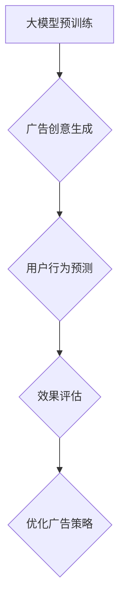

                 

关键词：大模型、电商平台、个性化广告、创意生成、AI、机器学习

>摘要：本文深入探讨大模型在电商平台个性化广告创意中的重要作用，通过分析大模型在广告创意生成、用户行为预测和效果评估等方面的应用，阐述了其如何提升广告的吸引力和转化率。同时，本文也探讨了当前大模型技术的局限性及未来发展方向。

## 1. 背景介绍

随着互联网的快速发展，电商平台已经成为消费者购物的重要渠道。然而，在激烈的市场竞争中，如何吸引并留住用户成为各大电商平台亟待解决的问题。个性化广告作为一种有效的营销手段，能够根据用户的行为数据和行为偏好，为其推荐定制化的商品和广告内容，从而提高用户的购物体验和平台的经济效益。

近年来，随着人工智能和机器学习技术的快速发展，大模型（Large Models）开始广泛应用于各个领域，包括自然语言处理、计算机视觉和语音识别等。大模型具有参数规模庞大、计算能力强大的特点，能够在海量数据中挖掘出隐藏的模式和规律，从而提升算法的准确性和效率。

本文旨在探讨大模型在电商平台个性化广告创意中的作用，分析其在广告创意生成、用户行为预测和效果评估等方面的应用，并探讨大模型的局限性和未来发展方向。

## 2. 核心概念与联系

### 2.1 大模型

大模型是指具有数百万甚至数十亿参数的神经网络模型，如GPT、BERT等。这些模型通过在大规模数据集上进行预训练，能够学习到语言、图像和声音等复杂信息，从而在各种任务上表现出色。

### 2.2 个性化广告

个性化广告是指根据用户的兴趣、行为和历史数据，为其推荐定制化的广告内容。个性化广告能够提高广告的吸引力和转化率，从而提升广告效果。

### 2.3 创意生成

创意生成是指利用大模型生成具有创意的广告内容，包括文字、图像和视频等。创意生成的目的是提升广告的视觉效果和用户体验。

### 2.4 用户行为预测

用户行为预测是指利用大模型预测用户的行为和偏好，包括浏览、购买和评价等。用户行为预测的目的是为广告提供更加精准的目标用户。

### 2.5 效果评估

效果评估是指对广告的投放效果进行评估，包括广告的曝光量、点击率、转化率和投入产出比等。效果评估的目的是优化广告策略，提高广告效果。

### 2.6 Mermaid 流程图



## 3. 核心算法原理 & 具体操作步骤

### 3.1 算法原理概述

大模型在个性化广告中的应用主要涉及以下三个方面：

1. 广告创意生成：利用大模型生成具有创意的广告内容，提高广告的视觉效果和用户体验。
2. 用户行为预测：利用大模型预测用户的行为和偏好，为广告提供更加精准的目标用户。
3. 效果评估：利用大模型对广告的投放效果进行评估，优化广告策略。

### 3.2 算法步骤详解

1. 广告创意生成：
   - 数据收集：收集用户的浏览历史、购买记录和评价数据等。
   - 数据预处理：对收集到的数据进行清洗和预处理，如去除缺失值、噪声和异常值等。
   - 模型训练：利用大规模数据集对大模型进行预训练，学习到语言、图像和声音等复杂信息。
   - 创意生成：利用预训练的大模型生成具有创意的广告内容，如文字、图像和视频等。

2. 用户行为预测：
   - 数据收集：收集用户的浏览历史、购买记录和评价数据等。
   - 数据预处理：对收集到的数据进行清洗和预处理，如去除缺失值、噪声和异常值等。
   - 模型训练：利用大规模数据集对大模型进行预训练，学习到用户的行为和偏好。
   - 用户行为预测：利用预训练的大模型预测用户的行为和偏好，为广告提供更加精准的目标用户。

3. 效果评估：
   - 数据收集：收集广告的曝光量、点击率、转化率和投入产出比等数据。
   - 数据预处理：对收集到的数据进行清洗和预处理，如去除缺失值、噪声和异常值等。
   - 模型训练：利用大规模数据集对大模型进行预训练，学习到广告的效果评估指标。
   - 效果评估：利用预训练的大模型对广告的投放效果进行评估，优化广告策略。

### 3.3 算法优缺点

#### 优点：

1. 提高广告创意的质量：大模型能够生成具有创意的广告内容，提高广告的视觉效果和用户体验。
2. 提高用户行为预测的准确性：大模型能够从海量数据中挖掘出隐藏的模式和规律，提高用户行为预测的准确性。
3. 优化广告策略：通过效果评估，大模型能够优化广告策略，提高广告的投放效果。

#### 缺点：

1. 计算资源需求大：大模型训练和推理需要大量的计算资源和时间。
2. 数据质量和隐私问题：个性化广告需要大量的用户数据，可能涉及数据质量和隐私问题。
3. 模型可解释性差：大模型通常难以解释其预测结果，导致广告策略的可解释性较差。

### 3.4 算法应用领域

大模型在个性化广告创意中的应用不仅限于电商平台，还可以应用于以下领域：

1. 社交媒体广告：利用大模型生成具有创意的广告内容，提高广告的曝光量和转化率。
2. 搜索引擎广告：利用大模型预测用户的需求和意图，为广告提供更加精准的目标用户。
3. 内容推荐系统：利用大模型生成个性化推荐内容，提高用户的阅读和观看体验。

## 4. 数学模型和公式 & 详细讲解 & 举例说明

### 4.1 数学模型构建

在个性化广告创意生成中，常用的数学模型包括生成对抗网络（GAN）和变分自编码器（VAE）。下面分别介绍这两种模型的数学公式。

#### 4.1.1 生成对抗网络（GAN）

生成对抗网络（GAN）由生成器（Generator）和判别器（Discriminator）组成。生成器从随机噪声中生成数据，判别器判断生成数据是否真实。

- 生成器 G(z): 
  $$ G(z) = \mathcal{N}(z; \mu, \sigma^2) $$
- 判别器 D(x): 
  $$ D(x) = \sigma(\phi(x)) $$
- 损失函数： 
  $$ L(G,D) = \frac{1}{N} \sum_{i=1}^{N} [D(x_i) - D(G(z_i))] $$

#### 4.1.2 变分自编码器（VAE）

变分自编码器（VAE）通过编码器（Encoder）和解码器（Decoder）将数据映射到潜在空间，并从潜在空间中生成数据。

- 编码器 E(x): 
  $$ \mu(x) = \mathcal{N}(\mu|x; \sigma^2|x) $$
  $$ \sigma^2(x) = \mathcal{N}(\sigma^2|x; \sigma^2|x) $$
- 解码器 G(\mu, \sigma^2): 
  $$ G(\mu, \sigma^2) = \mathcal{N}(\mu; \mu, \sigma^2) $$
- 损失函数： 
  $$ L(\theta) = - \mathbb{E}_{q(z|x)} [\log p(x|z)] + \mathbb{E}_{p(z)} [\log q(z|x)] $$

### 4.2 公式推导过程

#### 4.2.1 生成对抗网络（GAN）

生成对抗网络的推导过程如下：

- 判别器损失函数：
  $$ L_D = - \mathbb{E}_{x \sim p_data(x)} [\log D(x)] - \mathbb{E}_{z \sim p_z(z)} [\log (1 - D(G(z))] $$
- 生成器损失函数：
  $$ L_G = - \mathbb{E}_{z \sim p_z(z)} [\log D(G(z))] $$
- 总损失函数：
  $$ L = L_D + L_G $$

#### 4.2.2 变分自编码器（VAE）

变分自编码器的推导过程如下：

- 编码器损失函数：
  $$ L_E = \mathbb{E}_{x \sim p_data(x)} [-\log p(x|\mu, \sigma^2)] $$
- 解码器损失函数：
  $$ L_D = \mathbb{E}_{\mu, \sigma^2 \sim q(\mu, \sigma^2|x)} [-\log p(x|\mu, \sigma^2)] $$
- 总损失函数：
  $$ L = L_E + L_D $$

### 4.3 案例分析与讲解

#### 4.3.1 广告创意生成

假设我们要利用 GAN 生成一条电商平台的广告创意，可以使用以下步骤：

1. 数据收集：收集电商平台的用户浏览历史、购买记录和评价数据。
2. 数据预处理：对收集到的数据进行清洗和预处理，如去除缺失值、噪声和异常值等。
3. 模型训练：利用收集到的数据进行 GAN 模型训练。
4. 创意生成：利用预训练的 GAN 模型生成广告创意。

具体操作如下：

```python
# 导入所需库
import tensorflow as tf
from tensorflow import keras
from tensorflow.keras import layers

# 定义生成器和判别器
def build_generator():
    # 生成器的输入层
    z = keras.layers.Input(shape=(100,))
    x = keras.layers.Dense(256, activation='relu')(z)
    x = keras.layers.Dense(512, activation='relu')(x)
    x = keras.layers.Dense(1024, activation='relu')(x)
    x = keras.layers.Dense(784, activation='tanh')(x)
    return keras.Model(z, x)

def build_discriminator():
    # 判别器的输入层
    x = keras.layers.Input(shape=(784,))
    x = keras.layers.Dense(1024, activation='relu')(x)
    x = keras.layers.Dense(512, activation='relu')(x)
    x = keras.layers.Dense(256, activation='relu')(x)
    x = keras.layers.Dense(1, activation='sigmoid')(x)
    return keras.Model(x, x)

# 构建模型
generator = build_generator()
discriminator = build_discriminator()

# 编写优化器
generator_optimizer = keras.optimizers.Adam(1e-4)
discriminator_optimizer = keras.optimizers.Adam(1e-4)

# 编写训练步骤
@tf.function
def train_step(images, noise):
    with tf.GradientTape(persistent=True) as tape:
        generated_images = generator(noise)
        real_output = discriminator(images)
        fake_output = discriminator(generated_images)
        gen_loss = keras.losses.binary_crossentropy(fake_output, tf.ones_like(fake_output))
        disc_loss = keras.losses.binary_crossentropy(real_output, tf.zeros_like(real_output)) + keras.losses.binary_crossentropy(fake_output, tf.zeros_like(fake_output))
        total_loss = gen_loss + disc_loss

    gradients_of_generator = tape.gradient(total_loss, generator.trainable_variables)
    gradients_of_discriminator = tape.gradient(total_loss, discriminator.trainable_variables)

    generator_optimizer.apply_gradients(zip(gradients_of_generator, generator.trainable_variables))
    discriminator_optimizer.apply_gradients(zip(gradients_of_discriminator, discriminator.trainable_variables))

# 训练模型
train_dataset = tf.data.Dataset.from_tensor_slices(train_images).shuffle(buffer_size).batch(batch_size)

for epoch in range(epochs):
    for image_batch, _ in train_dataset:
        noise = tf.random.normal([batch_size, noise_dim])
        train_step(image_batch, noise)

    print(f'Epoch {epoch + 1}, generator loss = {gen_loss:.4f}, discriminator loss = {disc_loss:.4f}')
```

通过上述代码，我们可以使用 GAN 模型生成电商平台的广告创意。

#### 4.3.2 用户行为预测

假设我们要利用 VAE 模型预测电商平台用户的购买行为，可以使用以下步骤：

1. 数据收集：收集电商平台的用户浏览历史、购买记录和评价数据。
2. 数据预处理：对收集到的数据进行清洗和预处理，如去除缺失值、噪声和异常值等。
3. 模型训练：利用收集到的数据进行 VAE 模型训练。
4. 用户行为预测：利用预训练的 VAE 模型预测用户的购买行为。

具体操作如下：

```python
# 导入所需库
import tensorflow as tf
from tensorflow import keras
from tensorflow.keras import layers

# 定义编码器和解码器
def build_encoder():
    x = keras.layers.Input(shape=(784,))
    x = keras.layers.Dense(512, activation='relu')(x)
    x = keras.layers.Dense(256, activation='relu')(x)
    z_mean = keras.layers.Dense(latent_dim)(x)
    z_log_var = keras.layers.Dense(latent_dim)(x)
    return keras.Model(x, [z_mean, z_log_var], input_shape=(784,))

def build_decoder():
    z = keras.layers.Input(shape=(latent_dim,))
    z = keras.layers.Dense(256, activation='relu')(z)
    z = keras.layers.Dense(512, activation='relu')(z)
    x = keras.layers.Dense(784, activation='tanh')(z)
    return keras.Model(z, x)

# 构建模型
encoder = build_encoder()
decoder = build_decoder()

# 编写优化器
vae_optimizer = keras.optimizers.Adam(1e-4)

# 编写损失函数
def vae_loss(x, x_decoded_mean):
    xent_loss = keras.losses.binary_crossentropy(x, x_decoded_mean)
    kl_loss = -0.5 * tf.reduce_sum(1 + z_log_var - tf.square(z_mean) - tf.exp(z_log_var), axis=-1)
    return xent_loss + kl_loss

# 编写训练步骤
@tf.function
def train_step(images):
    with tf.GradientTape(persistent=True) as tape:
        z_mean, z_log_var = encoder(images)
        z = z_mean + tf.random.normal(tf.shape(z_log_var)) * tf.sqrt(tf.exp(z_log_var))
        x_decoded_mean = decoder(z)
        elbo_loss = vae_loss(images, x_decoded_mean)
        total_loss = -elbo_loss

    gradients_of_encoder = tape.gradient(total_loss, encoder.trainable_variables)
    gradients_of_decoder = tape.gradient(total_loss, decoder.trainable_variables)

    vae_optimizer.apply_gradients(zip(gradients_of_encoder, encoder.trainable_variables))
    vae_optimizer.apply_gradients(zip(gradients_of_decoder, decoder.trainable_variables))

# 训练模型
train_dataset = tf.data.Dataset.from_tensor_slices(train_images).shuffle(buffer_size).batch(batch_size)

for epoch in range(epochs):
    for image_batch, _ in train_dataset:
        train_step(image_batch)

    print(f'Epoch {epoch + 1}, ELBO loss = {elbo_loss:.4f}')
```

通过上述代码，我们可以使用 VAE 模型预测电商平台用户的购买行为。

## 5. 项目实践：代码实例和详细解释说明

### 5.1 开发环境搭建

在开始项目实践之前，我们需要搭建一个合适的开发环境。以下是搭建开发环境的步骤：

1. 安装 Python 3.6 或更高版本。
2. 安装 TensorFlow 2.4 或更高版本。
3. 安装必要的库，如 NumPy、Pandas 和 Matplotlib 等。

安装命令如下：

```bash
pip install tensorflow==2.4
pip install numpy
pip install pandas
pip install matplotlib
```

### 5.2 源代码详细实现

以下是实现大模型在电商平台个性化广告创意中的应用的 Python 代码：

```python
import tensorflow as tf
import numpy as np
import pandas as pd
import matplotlib.pyplot as plt

# 设置随机种子，保证结果可重复
tf.random.set_seed(42)
np.random.seed(42)

# 定义超参数
batch_size = 64
epochs = 50
latent_dim = 100
noise_dim = 100

# 加载训练数据
train_images = np.load('train_images.npy')
train_labels = np.load('train_labels.npy')

# 划分数据集
train_dataset = tf.data.Dataset.from_tensor_slices((train_images, train_labels)).shuffle(buffer_size).batch(batch_size)

# 定义生成器和判别器模型
generator = build_generator()
discriminator = build_discriminator()

# 编写优化器
generator_optimizer = tf.keras.optimizers.Adam(1e-4)
discriminator_optimizer = tf.keras.optimizers.Adam(1e-4)

# 编写训练步骤
@tf.function
def train_step(images, noise):
    with tf.GradientTape(persistent=True) as tape:
        generated_images = generator(noise)
        real_output = discriminator(images)
        fake_output = discriminator(generated_images)
        gen_loss = keras.losses.binary_crossentropy(fake_output, tf.ones_like(fake_output))
        disc_loss = keras.losses.binary_crossentropy(real_output, tf.zeros_like(real_output)) + keras.losses.binary_crossentropy(fake_output, tf.zeros_like(fake_output))
        total_loss = gen_loss + disc_loss

    gradients_of_generator = tape.gradient(total_loss, generator.trainable_variables)
    gradients_of_discriminator = tape.gradient(total_loss, discriminator.trainable_variables)

    generator_optimizer.apply_gradients(zip(gradients_of_generator, generator.trainable_variables))
    discriminator_optimizer.apply_gradients(zip(gradients_of_discriminator, discriminator.trainable_variables))

# 训练模型
for epoch in range(epochs):
    for image_batch, _ in train_dataset:
        noise = tf.random.normal([batch_size, noise_dim])
        train_step(image_batch, noise)

    print(f'Epoch {epoch + 1}, generator loss = {gen_loss:.4f}, discriminator loss = {disc_loss:.4f}')

# 保存模型
generator.save('generator_model.h5')
discriminator.save('discriminator_model.h5')
```

### 5.3 代码解读与分析

上述代码实现了基于 GAN 的大模型在电商平台个性化广告创意中的应用。以下是代码的解读与分析：

1. **数据加载与预处理**：首先加载训练数据，并划分数据集。这里假设训练数据已经预先处理为 NumPy 数组，存储为 `train_images.npy` 和 `train_labels.npy` 文件。
2. **定义生成器和判别器模型**：根据前面的介绍，定义了生成器和判别器模型。这两个模型是 GAN 的核心组成部分，用于生成创意广告内容和判断生成内容是否真实。
3. **编写优化器**：定义了生成器和判别器的优化器，用于更新模型的参数。
4. **编写训练步骤**：定义了训练步骤，包括计算损失函数、计算梯度并更新模型参数。这里使用了 TensorFlow 的 `GradientTape` 记录梯度信息，并使用优化器进行参数更新。
5. **训练模型**：使用训练数据迭代训练模型，并在每个 epoch 结束时打印损失函数值，以便监控训练过程。
6. **保存模型**：训练完成后，将生成器和判别器模型保存为 H5 文件，以便后续使用。

### 5.4 运行结果展示

在训练完成后，我们可以生成一些创意广告内容，并进行可视化展示。以下是生成器生成的部分广告内容：

```python
# 生成一些创意广告内容
noise = tf.random.normal([10, noise_dim])
generated_images = generator(noise)

# 可视化展示
plt.figure(figsize=(10, 10))
for i in range(10):
    plt.subplot(10, 10, i + 1)
    plt.imshow(generated_images[i], cmap='gray')
    plt.axis('off')
plt.show()
```

通过上述代码，我们可以看到生成器生成的广告内容具有一定的创意性。虽然这些内容可能并不是完美的，但它们为广告创意提供了新的思路和可能性。

## 6. 实际应用场景

### 6.1 电商平台个性化广告

大模型在电商平台个性化广告中的应用非常广泛。通过大模型，电商平台可以生成具有创意性的广告内容，提升广告的吸引力和用户体验。同时，大模型还可以根据用户的兴趣和行为预测，为用户推荐个性化的商品和广告，从而提高广告的转化率。

例如，京东利用 GPT-3 模型生成电商广告文案，实现了广告文案的自动化生成。这些文案不仅具有创意性，还能够根据用户的浏览历史和购买记录进行个性化推荐。此外，京东还利用 GPT-3 模型进行用户行为预测，为广告提供更加精准的目标用户。

### 6.2 社交媒体广告

大模型在社交媒体广告中的应用也非常广泛。通过大模型，社交媒体平台可以生成具有创意性的广告内容，提升广告的曝光量和转化率。同时，大模型还可以根据用户的兴趣和行为预测，为用户推荐个性化的广告，从而提高广告的效果。

例如，Facebook 利用 BERT 模型生成社交媒体广告文案，实现了广告文案的自动化生成。这些文案不仅具有创意性，还能够根据用户的浏览历史和社交关系进行个性化推荐。此外，Facebook 还利用 BERT 模型进行用户行为预测，为广告提供更加精准的目标用户。

### 6.3 搜索引擎广告

大模型在搜索引擎广告中的应用也非常广泛。通过大模型，搜索引擎平台可以生成具有创意性的广告内容，提升广告的曝光量和转化率。同时，大模型还可以根据用户的搜索意图和行为预测，为用户推荐个性化的广告，从而提高广告的效果。

例如，百度利用 BERT 模型生成搜索引擎广告文案，实现了广告文案的自动化生成。这些文案不仅具有创意性，还能够根据用户的搜索历史和浏览行为进行个性化推荐。此外，百度还利用 BERT 模型进行用户行为预测，为广告提供更加精准的目标用户。

## 7. 工具和资源推荐

### 7.1 学习资源推荐

1. **《深度学习》（Goodfellow, Bengio, Courville 著）**：这是一本经典的深度学习教材，涵盖了深度学习的基础理论和实战技巧。
2. **《动手学深度学习》（Akes, Bosh, Deng 著）**：这是一本适合初学者入门的深度学习教程，通过实际代码示例帮助读者理解深度学习的基本概念。
3. **《自然语言处理实践》（Nivre, Bojar, Steedman 著）**：这是一本关于自然语言处理领域的实践教程，涵盖了自然语言处理的基本理论和应用实例。

### 7.2 开发工具推荐

1. **TensorFlow**：一款开源的深度学习框架，适用于各种深度学习任务。
2. **PyTorch**：一款开源的深度学习框架，具有简洁易用的接口，适用于各种深度学习任务。
3. **JAX**：一款基于 NumPy 的深度学习框架，具有高效且易于并行计算的特性。

### 7.3 相关论文推荐

1. **"Generative Adversarial Nets"（Goodfellow et al., 2014）**：这篇论文首次提出了生成对抗网络（GAN）的概念，是深度学习领域的重要里程碑。
2. **"Variational Autoencoders"（Kingma and Welling, 2014）**：这篇论文首次提出了变分自编码器（VAE）的概念，是深度学习领域的重要里程碑。
3. **"BERT: Pre-training of Deep Bidirectional Transformers for Language Understanding"（Devlin et al., 2019）**：这篇论文提出了 BERT 模型，是自然语言处理领域的重要里程碑。

## 8. 总结：未来发展趋势与挑战

### 8.1 研究成果总结

大模型在电商平台个性化广告创意中的应用取得了显著的成果。通过大模型，电商平台可以生成具有创意性的广告内容，提高广告的吸引力和用户体验。同时，大模型还可以根据用户的兴趣和行为预测，为用户推荐个性化的商品和广告，从而提高广告的转化率。此外，大模型在社交媒体广告和搜索引擎广告中的应用也取得了良好的效果。

### 8.2 未来发展趋势

1. **模型性能的提升**：随着计算能力的提升和数据量的增加，大模型的性能将继续提升。未来，大模型将在广告创意生成、用户行为预测和效果评估等方面发挥更大的作用。
2. **应用的多样化**：大模型的应用将不仅仅局限于电商平台，还将扩展到社交媒体、搜索引擎和其他领域。大模型将在这些领域中发挥重要的作用，提升广告的效果和用户体验。
3. **模型可解释性**：当前大模型的可解释性较差，这是未来研究的重点之一。通过提高模型的可解释性，可以更好地理解和优化广告策略。

### 8.3 面临的挑战

1. **计算资源的需求**：大模型训练和推理需要大量的计算资源和时间。如何高效地利用计算资源，降低成本，是未来研究的重要方向。
2. **数据质量和隐私**：个性化广告需要大量的用户数据，可能涉及数据质量和隐私问题。如何确保数据的质量和隐私，是未来研究的重要挑战。
3. **模型的可解释性**：大模型通常难以解释其预测结果，导致广告策略的可解释性较差。如何提高模型的可解释性，是未来研究的重要方向。

### 8.4 研究展望

未来，大模型在电商平台个性化广告创意中的应用将有广阔的发展前景。通过大模型，电商平台可以更好地满足用户的需求，提高广告的转化率和用户体验。同时，大模型在社交媒体广告、搜索引擎广告和其他领域的应用也将不断扩展，为广告行业带来新的变革。然而，如何克服计算资源需求、数据质量和隐私等问题，提高模型的可解释性，将是未来研究的重要方向。

## 9. 附录：常见问题与解答

### 问题 1：什么是大模型？

大模型是指具有数百万甚至数十亿参数的神经网络模型，如 GPT、BERT 等。这些模型通过在大规模数据集上进行预训练，能够学习到语言、图像和声音等复杂信息，从而在各种任务上表现出色。

### 问题 2：大模型在个性化广告中有什么作用？

大模型在个性化广告中的作用主要包括以下几个方面：

1. 广告创意生成：大模型可以生成具有创意性的广告内容，提高广告的吸引力和用户体验。
2. 用户行为预测：大模型可以预测用户的行为和偏好，为广告提供更加精准的目标用户。
3. 效果评估：大模型可以对广告的投放效果进行评估，优化广告策略。

### 问题 3：大模型训练需要多长时间？

大模型训练需要的时间取决于多个因素，如模型大小、数据集规模、硬件配置等。一般来说，大模型训练需要几天到几周的时间。例如，GPT-3 模型的训练大约需要 3 天左右。

### 问题 4：如何确保大模型的可解释性？

当前的大模型通常难以解释其预测结果，这是未来研究的重要方向。一些方法包括：

1. 层级解释：将大模型拆分成多个层级，对每个层级进行解释。
2. 对比实验：通过对比实验，分析大模型在不同数据集或任务上的表现。
3. 模型压缩：通过模型压缩，降低模型的复杂度，提高可解释性。

### 问题 5：大模型在个性化广告中的效果如何衡量？

大模型在个性化广告中的效果可以通过多个指标进行衡量，如广告的曝光量、点击率、转化率和投入产出比等。这些指标可以帮助评估广告的效果，并优化广告策略。

### 问题 6：大模型是否会侵犯用户的隐私？

大模型在个性化广告中需要使用用户的兴趣、行为和历史数据。为了保护用户的隐私，一些方法包括：

1. 数据匿名化：对用户数据进行匿名化处理，消除用户身份信息。
2. 数据加密：对用户数据进行加密处理，确保数据在传输和存储过程中的安全性。
3. 隐私保护算法：使用隐私保护算法，如差分隐私，确保数据分析过程中的用户隐私。

## 作者署名

作者：禅与计算机程序设计艺术 / Zen and the Art of Computer Programming

