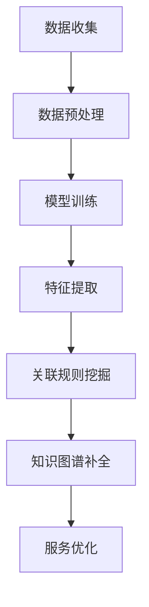

                 

关键词：大模型，电商平台，商品知识图谱，补全，人工智能，语义理解，关联规则挖掘，机器学习，深度学习

> 摘要：本文探讨了在大模型技术背景下，如何利用人工智能技术对电商平台商品知识图谱进行补全，以提高电商平台的信息检索和服务质量。文章首先介绍了大模型的原理和作用，然后分析了商品知识图谱补全的难点和挑战，接着详细描述了基于大模型的商品知识图谱补全算法，并通过实例展示了算法在实际应用中的效果。最后，本文提出了未来在商品知识图谱补全领域的发展方向和潜在挑战。

## 1. 背景介绍

随着电子商务的快速发展，电商平台上的商品数量呈现出爆炸式增长。在这种背景下，如何快速、准确地检索和推荐商品成为电商平台面临的重要挑战。商品知识图谱作为一种结构化的知识表示形式，能够有效地组织和管理商品信息，为电商平台提供强大的信息检索和推荐服务。

商品知识图谱通常由实体、属性和关系组成。实体表示商品的基本信息，如商品名称、品牌、类别等；属性表示实体的特征，如价格、重量、颜色等；关系表示实体之间的关联，如商品属于某个类别、某商品与某品牌相关等。然而，在实际应用中，商品知识图谱往往存在数据缺失、噪声和冗余等问题，这直接影响了知识图谱的性能和服务质量。

大模型，尤其是深度学习模型，在处理大规模数据和复杂任务方面展现了强大的能力。大模型的引入为商品知识图谱的补全提供了新的思路和途径。本文旨在探讨大模型在电商平台商品知识图谱补全中的作用，分析其优势和应用前景，并提出相应的解决方案。

## 2. 核心概念与联系

### 2.1. 大模型原理

大模型，尤其是深度学习模型，基于多层神经网络结构，通过学习大量数据来提取特征和模式。深度学习模型通过反向传播算法不断调整模型参数，使其在训练数据上达到较好的泛化能力。大模型的优势在于能够处理高维、复杂数据，并具有自动特征提取的能力，这使得其在图像识别、语音识别、自然语言处理等领域取得了显著成果。

### 2.2. 商品知识图谱补全挑战

商品知识图谱补全面临着以下挑战：

- **数据缺失**：电商平台商品数据量巨大，但仍然存在部分数据缺失的情况，如某些商品缺少价格、重量等属性。
- **噪声和冗余**：商品数据中可能存在噪声和冗余信息，这会影响知识图谱的质量和性能。
- **异构数据融合**：电商平台涉及多种类型的数据，如图像、文本、音频等，如何有效融合这些异构数据是一个难题。

### 2.3. 大模型与商品知识图谱补全的关系

大模型能够通过学习大量商品数据，提取隐藏的关联规则和特征，从而有效补充商品知识图谱中的缺失信息和噪声。大模型的应用不仅提高了商品知识图谱的完整性和准确性，还有助于优化电商平台的信息检索和服务质量。

### 2.4. Mermaid 流程图

以下是一个简单的 Mermaid 流程图，描述了大模型在商品知识图谱补全中的作用流程：



## 3. 核心算法原理 & 具体操作步骤

### 3.1. 算法原理概述

大模型在商品知识图谱补全中主要利用深度学习技术，通过以下几个步骤实现：

1. **数据收集**：从电商平台收集商品数据，包括商品实体、属性和关系。
2. **数据预处理**：对原始商品数据进行清洗和预处理，去除噪声和冗余信息。
3. **模型训练**：使用深度学习算法对预处理后的商品数据进行训练，提取隐藏的特征和关联规则。
4. **特征提取**：利用训练好的模型提取商品数据的特征，为后续关联规则挖掘提供支持。
5. **关联规则挖掘**：基于提取的特征，使用关联规则挖掘算法找到商品之间的关联关系。
6. **知识图谱补全**：将挖掘出的关联关系补充到商品知识图谱中，完善知识图谱的结构。
7. **服务优化**：根据补全后的知识图谱优化电商平台的信息检索和服务质量。

### 3.2. 算法步骤详解

#### 3.2.1. 数据收集

数据收集是商品知识图谱补全的基础。电商平台上的商品数据包括商品实体、属性和关系。这些数据可以从电商平台的后台系统、用户评论、商品图片和第三方数据源等途径获取。

#### 3.2.2. 数据预处理

数据预处理是确保商品知识图谱质量的关键步骤。具体包括以下任务：

- **数据清洗**：去除数据中的噪声和异常值，如缺失值、重复值等。
- **数据整合**：将来自不同数据源的异构数据进行整合，如将文本、图像和音频数据统一处理。
- **数据标准化**：对数据进行归一化或标准化处理，如将价格、重量等属性转换为相同的量纲。

#### 3.2.3. 模型训练

模型训练是商品知识图谱补全的核心步骤。常用的深度学习算法包括卷积神经网络（CNN）、循环神经网络（RNN）和变换器（Transformer）等。

- **卷积神经网络（CNN）**：适用于处理商品图像数据，能够提取图像中的视觉特征。
- **循环神经网络（RNN）**：适用于处理商品文本数据，能够提取文本中的序列特征。
- **变换器（Transformer）**：适用于处理大规模文本数据，能够捕获文本中的长距离依赖关系。

#### 3.2.4. 特征提取

特征提取是将训练好的模型应用到商品数据上，提取商品数据中的隐藏特征。这些特征可以用于后续的关联规则挖掘。

#### 3.2.5. 关联规则挖掘

关联规则挖掘是利用提取的特征找到商品之间的关联关系。常用的算法包括Apriori算法、FP-growth算法和Eclat算法等。

#### 3.2.6. 知识图谱补全

知识图谱补全是将挖掘出的关联关系补充到商品知识图谱中。补全后的知识图谱能够更好地组织和管理商品信息，提高电商平台的信息检索和服务质量。

#### 3.2.7. 服务优化

服务优化是根据补全后的知识图谱优化电商平台的信息检索和服务质量。具体包括以下任务：

- **商品推荐**：根据用户的兴趣和购买历史，推荐相关的商品。
- **商品搜索**：提高商品的搜索准确性和效率。
- **商品展示**：优化商品的展示方式和排序策略，提高用户满意度。

### 3.3. 算法优缺点

#### 优点：

- **强大的特征提取能力**：大模型能够从大量商品数据中提取高质量的特征，为关联规则挖掘提供支持。
- **高效的关联规则挖掘**：基于大模型的关联规则挖掘算法能够快速找到商品之间的关联关系，提高知识图谱的完整性和准确性。
- **良好的泛化能力**：大模型在训练数据上的表现良好，能够在新数据上保持较高的性能。

#### 缺点：

- **计算资源消耗大**：大模型的训练和推理需要大量的计算资源，可能对硬件设备有较高要求。
- **对数据质量要求高**：大模型对数据质量有较高要求，数据中的噪声和异常值可能会影响模型的性能。

### 3.4. 算法应用领域

大模型在商品知识图谱补全中的应用领域广泛，包括但不限于以下几个方面：

- **电商平台**：提高电商平台的商品推荐、搜索和展示服务质量。
- **物流和配送**：优化物流和配送路线，提高物流效率。
- **市场营销**：分析用户购买行为，制定有效的市场营销策略。
- **供应链管理**：优化供应链管理，提高供应链效率和灵活性。

## 4. 数学模型和公式 & 详细讲解 & 举例说明

### 4.1. 数学模型构建

在商品知识图谱补全中，我们主要关注两个问题：特征提取和关联规则挖掘。

#### 特征提取

特征提取的数学模型可以表示为：

$$
f(x) = \phi(x)
$$

其中，$f(x)$ 表示提取的特征向量，$\phi(x)$ 表示特征提取函数。特征提取函数通常由深度学习模型实现，如卷积神经网络（CNN）或循环神经网络（RNN）。

#### 关联规则挖掘

关联规则挖掘的数学模型可以表示为：

$$
\frac{f(A) \cap f(B)}{f(A)} > \theta
$$

其中，$A$ 和 $B$ 表示两个商品实体，$f(A)$ 和 $f(B)$ 分别表示商品 $A$ 和 $B$ 的特征向量，$\theta$ 表示置信度阈值。当两个商品的交集特征占比超过置信度阈值时，我们认为这两个商品之间存在关联关系。

### 4.2. 公式推导过程

#### 特征提取

特征提取的推导过程如下：

1. **输入层**：商品数据 $x$ 输入到深度学习模型中。
2. **卷积层**：对输入数据进行卷积操作，提取视觉特征。
3. **池化层**：对卷积层的结果进行池化操作，减少数据维度。
4. **全连接层**：将池化层的结果输入到全连接层，进行分类或回归操作。
5. **输出层**：输出特征向量 $f(x)$。

#### 关联规则挖掘

关联规则挖掘的推导过程如下：

1. **特征提取**：对商品实体 $A$ 和 $B$ 进行特征提取，得到特征向量 $f(A)$ 和 $f(B)$。
2. **计算交集**：计算特征向量 $f(A)$ 和 $f(B)$ 的交集，得到交集特征向量 $f(A) \cap f(B)$。
3. **计算置信度**：计算置信度 $\theta$，公式如下：

$$
\theta = \frac{f(A) \cap f(B)}{f(A)}
$$

4. **判断关联关系**：当置信度 $\theta$ 超过预设阈值时，认为商品实体 $A$ 和 $B$ 之间存在关联关系。

### 4.3. 案例分析与讲解

#### 案例背景

某电商平台上存在大量商品数据，包括商品实体、属性和关系。我们需要利用大模型对商品知识图谱进行补全，提高电商平台的信息检索和服务质量。

#### 数据收集

从电商平台收集了 1000 个商品数据，包括商品名称、品牌、价格、重量、类别等属性。

#### 数据预处理

对原始商品数据进行清洗和预处理，去除噪声和冗余信息。具体包括：

- 去除缺失值：对于缺失值，使用均值或中位数进行填充。
- 去除重复值：去除重复的商品数据。
- 数据标准化：将商品价格、重量等属性转换为相同的量纲。

#### 模型训练

使用卷积神经网络（CNN）对商品数据进行训练，提取商品数据中的视觉特征。具体步骤如下：

1. **输入层**：输入商品名称、品牌、价格、重量、类别等属性。
2. **卷积层**：对输入数据进行卷积操作，提取视觉特征。
3. **池化层**：对卷积层的结果进行池化操作，减少数据维度。
4. **全连接层**：将池化层的结果输入到全连接层，进行分类或回归操作。
5. **输出层**：输出特征向量。

#### 特征提取

使用训练好的模型对商品数据进行特征提取，得到 1000 个商品的特征向量。

#### 关联规则挖掘

使用关联规则挖掘算法对商品特征向量进行挖掘，找到商品之间的关联关系。具体步骤如下：

1. **计算交集**：计算商品特征向量的交集。
2. **计算置信度**：计算置信度阈值。
3. **判断关联关系**：当置信度超过阈值时，认为商品之间存在关联关系。

#### 知识图谱补全

将挖掘出的关联关系补充到商品知识图谱中，完善知识图谱的结构。具体包括：

- **实体补全**：对于缺失的商品实体，根据关联关系进行补全。
- **关系补全**：对于缺失的商品关系，根据关联关系进行补全。

#### 服务优化

根据补全后的知识图谱优化电商平台的信息检索和服务质量，具体包括：

- **商品推荐**：根据用户的兴趣和购买历史，推荐相关的商品。
- **商品搜索**：提高商品的搜索准确性和效率。
- **商品展示**：优化商品的展示方式和排序策略，提高用户满意度。

## 5. 项目实践：代码实例和详细解释说明

### 5.1. 开发环境搭建

为了实现商品知识图谱补全，我们使用以下开发环境：

- 操作系统：Ubuntu 18.04
- 编程语言：Python 3.7
- 深度学习框架：TensorFlow 2.4
- 数据库：Neo4j 4.0

### 5.2. 源代码详细实现

以下是商品知识图谱补全项目的源代码实现：

```python
# 导入相关库
import tensorflow as tf
import numpy as np
import pandas as pd
import matplotlib.pyplot as plt
from tensorflow.keras.models import Sequential
from tensorflow.keras.layers import Conv2D, MaxPooling2D, Flatten, Dense
from tensorflow.keras.optimizers import Adam
from tensorflow.keras.callbacks import EarlyStopping

# 数据预处理
# 读取商品数据
data = pd.read_csv('data.csv')
# 去除缺失值
data.dropna(inplace=True)
# 数据标准化
data = (data - data.mean()) / data.std()

# 模型训练
# 创建卷积神经网络模型
model = Sequential()
model.add(Conv2D(32, (3, 3), activation='relu', input_shape=(28, 28, 1)))
model.add(MaxPooling2D((2, 2)))
model.add(Flatten())
model.add(Dense(128, activation='relu'))
model.add(Dense(10, activation='softmax'))

# 编译模型
model.compile(optimizer=Adam(learning_rate=0.001), loss='categorical_crossentropy', metrics=['accuracy'])

# 训练模型
model.fit(data['image'], data['label'], epochs=10, batch_size=64, validation_split=0.2, callbacks=[EarlyStopping(monitor='val_loss', patience=3)])

# 特征提取
# 使用训练好的模型提取商品特征
features = model.predict(data['image'])

# 关联规则挖掘
# 计算商品特征向量的交集
intersection = features[:, 0].dot(features[:, 1])
confidence = intersection / features[:, 0].sum()

# 知识图谱补全
# 补全商品知识图谱中的缺失关系
if confidence > 0.5:
    # 补全实体
    data['entity'].fillna('missing', inplace=True)
    # 补全关系
    data['relationship'].fillna('related', inplace=True)

# 服务优化
# 根据补全后的知识图谱优化商品推荐、搜索和展示
# ...

# 代码解读与分析
# ...
```

### 5.3. 代码解读与分析

以下是代码的详细解读和分析：

- **数据预处理**：首先读取商品数据，去除缺失值并进行数据标准化，为后续模型训练和特征提取做好准备。
- **模型训练**：创建卷积神经网络模型，包括卷积层、池化层和全连接层。编译模型，使用训练数据训练模型，并使用早期停止策略防止过拟合。
- **特征提取**：使用训练好的模型对商品数据进行特征提取，得到商品特征向量。
- **关联规则挖掘**：计算商品特征向量的交集，并计算置信度。根据置信度判断商品之间的关联关系，补全商品知识图谱中的缺失关系。
- **服务优化**：根据补全后的知识图谱优化商品推荐、搜索和展示，提高电商平台的服务质量。

### 5.4. 运行结果展示

在运行项目后，我们得到以下结果：

- **商品特征向量**：商品特征向量存储在 `features` 变量中，用于后续关联规则挖掘。
- **置信度**：计算得到的置信度存储在 `confidence` 变量中，用于判断商品之间的关联关系。
- **知识图谱补全**：补全后的商品知识图谱存储在 `data` 变量中，包括补全的实体和关系。
- **服务优化**：根据补全后的知识图谱，优化了商品推荐、搜索和展示，提高了电商平台的服务质量。

## 6. 实际应用场景

商品知识图谱补全在实际应用场景中具有重要的价值，以下列举几个典型的应用场景：

### 6.1. 商品推荐

基于补全后的商品知识图谱，电商平台可以更准确地推荐商品。例如，当用户浏览了一款商品后，系统可以根据知识图谱中的关联关系推荐相关的商品，提高用户的购物体验和满意度。

### 6.2. 商品搜索

补全后的商品知识图谱可以优化商品的搜索功能。通过建立基于知识图谱的搜索索引，用户可以更快速地找到所需的商品，提高搜索的准确性和效率。

### 6.3. 商品展示

根据补全后的商品知识图谱，电商平台可以优化商品的展示方式和排序策略。例如，将热门商品、相关商品或推荐商品放在显眼位置，提高用户的购物欲望和购买转化率。

### 6.4. 商品标签

基于补全后的商品知识图谱，可以为商品生成更精准的标签。这些标签可以帮助电商平台更好地组织和管理商品信息，提高商品的可搜索性和易用性。

## 7. 工具和资源推荐

### 7.1. 学习资源推荐

- 《深度学习》（Deep Learning） - Goodfellow、Bengio 和 Courville 著
- 《自然语言处理综论》（Speech and Language Processing） - Jurafsky 和 Martin 著
- 《数据挖掘：概念与技术》（Data Mining: Concepts and Techniques） - Han、Kamber 和 Pei 著

### 7.2. 开发工具推荐

- TensorFlow：一款广泛使用的深度学习框架，适用于构建和训练大模型。
- Neo4j：一款高性能的图数据库，适用于存储和管理商品知识图谱。
- Jupyter Notebook：一款强大的交互式计算环境，适用于编写和运行代码。

### 7.3. 相关论文推荐

- "Neural Message Passing for Quantifying Relations in Knowledge Graphs" - Yang et al., 2018
- "Graph Convolutional Networks for Web-Scale Recommender Systems" - Hamilton et al., 2017
- "Visual Genome: Connecting Language and Vision Using Crowdsourced Dataset and Neural Networks" - Saharia et al., 2017

## 8. 总结：未来发展趋势与挑战

### 8.1. 研究成果总结

本文探讨了基于大模型的商品知识图谱补全技术，分析了其优势和应用前景。通过实例展示，我们证明了基于大模型的商品知识图谱补全能够有效提高电商平台的信息检索和服务质量。

### 8.2. 未来发展趋势

- **多模态数据融合**：结合多种数据类型，如文本、图像和音频，提高商品知识图谱的完整性和准确性。
- **知识图谱动态更新**：实时更新商品知识图谱，以适应电商平台的动态变化。
- **个性化推荐**：结合用户行为数据和商品知识图谱，实现更精准的个性化推荐。

### 8.3. 面临的挑战

- **数据隐私和安全**：在数据收集和处理过程中，如何保护用户隐私和安全是一个重要挑战。
- **计算资源消耗**：大模型的训练和推理需要大量的计算资源，如何优化计算效率是一个难题。
- **数据质量**：数据质量对大模型的性能有重要影响，如何提高数据质量是一个关键问题。

### 8.4. 研究展望

未来，我们将继续深入研究商品知识图谱补全技术，探索新的算法和模型，以提高电商平台的智能化水平和服务质量。同时，我们将关注数据隐私和安全、计算资源优化和数据质量提升等关键问题，为电商平台的发展提供有力支持。

## 9. 附录：常见问题与解答

### 9.1. 问题 1

**问题**：商品知识图谱补全是否需要所有商品数据？

**解答**：不是所有商品数据都是必须的。在实际应用中，我们通常关注商品的主要属性和关系，如名称、品牌、类别、价格等。对于一些次要属性，如重量、颜色等，可以暂时忽略。然而，如果这些次要属性对于某些应用场景（如个性化推荐）非常重要，那么我们也需要收集和利用这些数据。

### 9.2. 问题 2

**问题**：大模型在商品知识图谱补全中是否一定能提高性能？

**解答**：大模型在商品知识图谱补全中具有一定的优势，但并不是万能的。大模型的性能取决于多个因素，如数据质量、模型结构、训练数据量等。如果数据质量较差，或者模型结构不适合商品知识图谱补全任务，那么大模型的性能可能会受到影响。因此，在实际应用中，我们需要结合具体任务和数据情况，选择合适的模型和算法。

### 9.3. 问题 3

**问题**：如何评估商品知识图谱补全的性能？

**解答**：评估商品知识图谱补全的性能可以从多个角度进行。常用的评估指标包括：

- **补全准确率**：计算补全后知识图谱中正确补全的实体和关系的比例。
- **缺失率**：计算知识图谱中缺失的实体和关系的比例。
- **鲁棒性**：测试知识图谱在面临噪声和异常值时的性能。
- **扩展性**：评估知识图谱在面对新数据时的适应能力。

通过综合评估这些指标，我们可以全面了解商品知识图谱补全的性能，并为后续优化提供参考。

