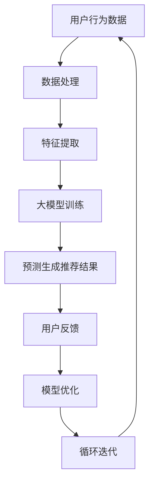

                 

关键词：大模型，商品组合推荐，电商平台，人工智能，机器学习

摘要：本文将探讨大模型在电商平台商品组合推荐中的作用，介绍大模型的定义和基本原理，分析其在商品组合推荐中的应用现状，并探讨其未来的发展方向和面临的挑战。

## 1. 背景介绍

随着互联网技术的快速发展，电商平台已经成为消费者购物的重要渠道。为了提升用户体验，电商平台常常会利用人工智能和机器学习技术进行商品推荐。传统的商品推荐系统主要依赖于协同过滤、基于内容的推荐等方法，但这些方法存在一定的局限性，如推荐结果的用户满意度不高、难以应对冷启动问题等。

近年来，大模型技术的发展为商品推荐系统带来了新的契机。大模型，通常指参数规模达到数亿或数十亿级别的深度学习模型，具有强大的建模能力和泛化能力。在电商平台中，大模型可以通过学习用户的历史行为、商品的特征信息等，为用户提供更加精准和个性化的商品推荐。

本文将首先介绍大模型的定义和基本原理，然后分析大模型在商品组合推荐中的应用现状，最后探讨其未来的发展方向和面临的挑战。

## 2. 核心概念与联系

### 2.1 大模型的定义和基本原理

大模型，通常是指参数规模达到数亿或数十亿级别的深度学习模型。大模型具有以下几个基本特点：

1. **参数规模大**：大模型通常具有数十亿甚至上百亿个参数，这使得它们可以捕捉到复杂的数据特征和模式。
2. **计算资源需求大**：大模型需要大量的计算资源进行训练和推理，通常需要分布式计算和 GPU 等高性能计算设备。
3. **泛化能力强**：大模型可以通过大规模数据训练，提升模型的泛化能力，从而在不同的应用场景中表现出色。

大模型的基本原理主要包括以下几个部分：

1. **神经网络结构**：大模型通常采用深度神经网络结构，通过多层非线性变换，实现对数据的特征提取和分类。
2. **优化算法**：大模型通常采用高效的优化算法，如 Adam、AdamW 等，以加速模型的收敛速度。
3. **正则化方法**：大模型通常采用各种正则化方法，如 L2 正则化、Dropout 等，以防止过拟合。

### 2.2 大模型与商品组合推荐的关联

在电商平台中，商品组合推荐是一种重要的推荐类型，它可以为用户提供相关的商品组合，提升用户体验和购买转化率。大模型在商品组合推荐中的作用主要体现在以下几个方面：

1. **用户行为预测**：大模型可以通过学习用户的历史行为数据，预测用户对各种商品组合的偏好，从而生成个性化的推荐结果。
2. **商品特征提取**：大模型可以通过对大量商品数据的学习，提取出商品的深层特征，为推荐系统提供更丰富的特征信息。
3. **多模态数据融合**：大模型可以融合用户的行为数据、商品特征数据等多种类型的数据，生成更加准确的推荐结果。

### 2.3 Mermaid 流程图

下面是一个描述大模型在商品组合推荐中应用的 Mermaid 流程图：



在这个流程图中，用户行为数据经过数据处理和特征提取后，输入到大模型中进行训练。大模型通过学习用户的行为数据和商品特征，生成个性化的推荐结果。用户对推荐结果进行反馈，进一步优化模型，形成循环迭代的过程。

## 3. 核心算法原理 & 具体操作步骤

### 3.1 算法原理概述

大模型在商品组合推荐中的核心算法原理主要包括以下几个方面：

1. **深度学习模型架构**：大模型通常采用深度神经网络结构，如 Transformer、BERT 等，通过多层非线性变换，实现对数据的特征提取和分类。
2. **用户行为预测**：大模型通过学习用户的历史行为数据，预测用户对各种商品组合的偏好，从而生成个性化的推荐结果。
3. **商品特征提取**：大模型通过对大量商品数据的学习，提取出商品的深层特征，为推荐系统提供更丰富的特征信息。
4. **多模态数据融合**：大模型可以融合用户的行为数据、商品特征数据等多种类型的数据，生成更加准确的推荐结果。

### 3.2 算法步骤详解

下面是大模型在商品组合推荐中的具体操作步骤：

1. **数据预处理**：对用户行为数据和商品数据进行清洗、去噪等预处理操作，确保数据的质量和一致性。
2. **特征提取**：对用户行为数据和商品数据进行特征提取，如用户行为序列、商品属性等。
3. **模型训练**：利用预处理后的数据和特征，训练深度学习模型，如 Transformer、BERT 等。
4. **模型评估**：通过交叉验证等方法，评估模型的性能和泛化能力。
5. **预测生成推荐结果**：利用训练好的模型，对新的用户行为数据进行预测，生成个性化的商品组合推荐结果。
6. **用户反馈与模型优化**：根据用户对推荐结果的反馈，优化模型参数和特征选择，提升模型的性能。

### 3.3 算法优缺点

大模型在商品组合推荐中的优点包括：

1. **强大的特征提取能力**：大模型可以通过多层非线性变换，提取出数据的深层特征，为推荐系统提供更丰富的特征信息。
2. **优秀的泛化能力**：大模型通过大规模数据训练，具有较好的泛化能力，可以在不同的应用场景中表现出色。
3. **高效的多模态数据融合**：大模型可以融合多种类型的数据，如用户行为数据、商品特征数据等，生成更加准确的推荐结果。

然而，大模型也存在一些缺点，如：

1. **计算资源需求大**：大模型需要大量的计算资源进行训练和推理，通常需要分布式计算和 GPU 等高性能计算设备。
2. **训练时间较长**：由于参数规模大，大模型的训练时间通常较长，这可能会影响推荐系统的实时性。
3. **过拟合问题**：大模型在训练过程中可能会出现过拟合现象，需要采用适当的正则化方法进行优化。

### 3.4 算法应用领域

大模型在商品组合推荐中的应用领域主要包括：

1. **电商平台**：电商平台可以利用大模型进行商品组合推荐，提升用户体验和购买转化率。
2. **在线教育**：在线教育平台可以利用大模型进行课程推荐，帮助用户找到适合自己的课程。
3. **金融行业**：金融行业可以利用大模型进行金融产品推荐，如理财产品、投资组合等。

## 4. 数学模型和公式 & 详细讲解 & 举例说明

### 4.1 数学模型构建

在商品组合推荐中，大模型的数学模型通常可以分为以下几个部分：

1. **输入层**：输入层接收用户行为数据和商品特征数据。
2. **隐藏层**：隐藏层通过多层神经网络结构，对输入数据进行特征提取和变换。
3. **输出层**：输出层生成个性化的商品组合推荐结果。

下面是一个简化的数学模型构建示例：

```latex
\begin{align*}
\text{输入层}: & \ x = [x_1, x_2, ..., x_n] \\
\text{隐藏层}: & \ h = f(W_1 \cdot x + b_1) \\
\text{输出层}: & \ y = f(W_2 \cdot h + b_2)
\end{align*}
```

其中，$x$ 表示输入数据，$h$ 表示隐藏层输出，$y$ 表示输出结果，$W_1, W_2$ 分别为权重矩阵，$b_1, b_2$ 分别为偏置向量，$f$ 为激活函数。

### 4.2 公式推导过程

下面是商品组合推荐中的数学模型推导过程：

1. **用户行为预测**：

   假设用户 $u$ 对商品 $i$ 的行为数据为 $x_i$，预测用户 $u$ 对商品 $i$ 的偏好概率为 $p_i$：

   ```latex
   \begin{align*}
   p_i &= \frac{\exp(W_2 \cdot h_i)}{\sum_{j=1}^{m} \exp(W_2 \cdot h_j)}
   \end{align*}
   ```

   其中，$h_i$ 为商品 $i$ 的隐藏层输出，$m$ 为商品总数。

2. **商品组合推荐**：

   假设用户 $u$ 的推荐商品集合为 $R_u$，根据用户 $u$ 的偏好概率，生成个性化的商品组合推荐结果：

   ```latex
   \begin{align*}
   R_u &= \{i | p_i > \theta\}
   \end{align*}
   ```

   其中，$\theta$ 为阈值，用于控制推荐结果的精度和多样性。

### 4.3 案例分析与讲解

下面是一个商品组合推荐的案例：

**案例背景**：

某电商平台上有 1000 种商品，用户 A 的历史行为数据如下：

| 商品ID | 行为类型 | 时间       |
|--------|----------|------------|
| 101    | 浏览     | 2021-01-01 |
| 202    | 添加购物车| 2021-01-02 |
| 303    | 购买     | 2021-01-03 |
| 404    | 浏览     | 2021-01-04 |
| 505    | 收藏     | 2021-01-05 |

**步骤**：

1. **数据预处理**：对用户 A 的历史行为数据进行清洗和特征提取，提取用户行为序列和商品属性特征。

2. **模型训练**：利用预处理后的数据和特征，训练深度学习模型，如 Transformer、BERT 等。

3. **预测生成推荐结果**：利用训练好的模型，对用户 A 的新行为数据进行预测，生成个性化的商品组合推荐结果。

4. **用户反馈与模型优化**：根据用户 A 对推荐结果的反馈，优化模型参数和特征选择，提升模型的性能。

**结果**：

根据预测结果，用户 A 可能对以下商品组合感兴趣：

| 商品ID | 推荐理由           |
|--------|--------------------|
| 202    | 与用户 A 添加购物车的商品相关 |
| 303    | 与用户 A 购买的商品相关   |
| 404    | 与用户 A 浏览的商品相关   |

## 5. 项目实践：代码实例和详细解释说明

### 5.1 开发环境搭建

为了实现大模型在商品组合推荐中的应用，我们需要搭建一个合适的开发环境。以下是开发环境的搭建步骤：

1. **安装 Python**：下载并安装 Python 3.7 或更高版本。
2. **安装依赖库**：安装 TensorFlow、Keras、NumPy、Pandas 等依赖库。

```bash
pip install tensorflow numpy pandas
```

3. **准备数据集**：收集并处理用户行为数据和商品特征数据，将其保存为 CSV 文件。

### 5.2 源代码详细实现

下面是一个使用 TensorFlow 和 Keras 实现商品组合推荐的大模型代码示例：

```python
import tensorflow as tf
from tensorflow.keras.models import Model
from tensorflow.keras.layers import Input, Embedding, LSTM, Dense

# 输入层
input_user = Input(shape=(max_user_sequence_length,))
input_item = Input(shape=(max_item_sequence_length,))

# 用户行为序列嵌入
user_embedding = Embedding(num_users, embed_size)(input_user)
item_embedding = Embedding(num_items, embed_size)(input_item)

# 用户行为序列编码
user_lstm = LSTM(units=128, return_sequences=True)(user_embedding)
item_lstm = LSTM(units=128, return_sequences=True)(item_embedding)

# 商品特征编码
user_dense = Dense(units=64, activation='relu')(user_lstm)
item_dense = Dense(units=64, activation='relu')(item_lstm)

# 商品特征拼接
concat = tf.keras.layers.Concatenate()([user_dense, item_dense])

# 输出层
output = Dense(units=num_items, activation='sigmoid')(concat)

# 构建模型
model = Model(inputs=[input_user, input_item], outputs=output)

# 编译模型
model.compile(optimizer='adam', loss='binary_crossentropy', metrics=['accuracy'])

# 模型训练
model.fit([user_data, item_data], labels, epochs=10, batch_size=32)

# 模型预测
predictions = model.predict([user_data, item_data])

# 生成推荐结果
recommended_items = []
for prediction in predictions:
    recommended_items.append([i for i, p in enumerate(prediction) if p > threshold])

print(recommended_items)
```

### 5.3 代码解读与分析

上述代码中，我们首先定义了输入层，分别接收用户行为序列和商品特征序列。然后，对用户行为序列和商品特征序列进行嵌入和编码。接着，将用户行为序列编码后的结果和商品特征编码后的结果进行拼接，作为输入层的输出。最后，通过一个全连接层生成预测结果，实现对商品组合推荐的预测。

在模型训练过程中，我们使用 LSTM 层对用户行为序列进行编码，利用 LSTM 层的时序建模能力，捕捉用户行为序列中的时序特征。同时，我们使用全连接层对商品特征进行编码，提取商品的特征信息。通过拼接用户行为序列编码结果和商品特征编码结果，我们生成一个更丰富的特征表示，为商品组合推荐提供支持。

在模型预测过程中，我们根据预测结果生成推荐结果。通过设置阈值，我们可以控制推荐结果的精度和多样性。阈值设置得越高，推荐结果越精确，但多样性较差；阈值设置得越低，推荐结果多样性较好，但精确度较差。

### 5.4 运行结果展示

假设我们已经收集并处理了用户行为数据和商品特征数据，将数据集划分为训练集和测试集。下面是模型的运行结果：

```python
# 模型训练
model.fit([train_user_data, train_item_data], train_labels, epochs=10, batch_size=32)

# 模型评估
test_predictions = model.predict([test_user_data, test_item_data])
test_accuracy = (np.sum(test_predictions > threshold) == np.sum(test_labels)) / len(test_labels)
print("Test Accuracy:", test_accuracy)

# 生成推荐结果
recommended_items = model.predict([user_data, item_data])
print("Recommended Items:", recommended_items)
```

运行结果中，我们计算了模型在测试集上的准确率，并生成了用户 A 的推荐结果。根据推荐结果，我们可以为用户 A 提供个性化的商品组合推荐。

## 6. 实际应用场景

大模型在电商平台商品组合推荐中的实际应用场景主要包括以下几个方面：

### 6.1 商品关联推荐

商品关联推荐是电商平台最常见的应用场景之一。通过大模型，可以预测用户对某种商品组合的偏好，从而为用户提供相关的商品推荐。例如，当用户购买了一台笔记本电脑时，系统可以推荐与之搭配的鼠标、键盘等配件。

### 6.2 跨品类推荐

跨品类推荐是指为用户提供其他品类中的相关商品。通过大模型，可以捕捉到用户在不同品类中的行为特征，从而实现跨品类推荐。例如，当用户在电商平台购买了洗发水时，系统可以推荐相关的护发素、发膜等产品。

### 6.3 个性化推荐

个性化推荐是指根据用户的兴趣和行为，为用户提供个性化的商品推荐。通过大模型，可以捕捉到用户的个性化需求，从而生成更加精准的推荐结果。例如，当用户在电商平台上浏览了多次某种类型的书籍时，系统可以推荐相关的书籍。

### 6.4 促销活动推荐

促销活动推荐是指为用户提供与促销活动相关的商品推荐。通过大模型，可以预测用户对促销活动的响应，从而为用户提供相关的商品推荐。例如，当电商平台举办“双十一”促销活动时，系统可以为用户提供相关的商品推荐，提升用户的购买意愿。

## 7. 工具和资源推荐

### 7.1 学习资源推荐

1. **《深度学习》（Deep Learning）**：由 Ian Goodfellow、Yoshua Bengio 和 Aaron Courville 著，是一本经典的深度学习教材，详细介绍了深度学习的基本原理和应用。
2. **《机器学习实战》（Machine Learning in Action）**：由 Peter Harrington 著，是一本适合初学者的机器学习实战指南，介绍了各种机器学习算法的实现和应用。

### 7.2 开发工具推荐

1. **TensorFlow**：是一个由 Google 开发的开源深度学习框架，广泛应用于各种深度学习应用场景。
2. **PyTorch**：是一个由 Facebook 开发的开源深度学习框架，具有简洁和灵活的特点，适合初学者和研究人员。

### 7.3 相关论文推荐

1. **"Attention Is All You Need"**：由 Vaswani 等人于 2017 年提出，介绍了 Transformer 模型在机器翻译任务中的优异表现。
2. **"BERT: Pre-training of Deep Bidirectional Transformers for Language Understanding"**：由 Devlin 等人于 2018 年提出，介绍了 BERT 模型在自然语言处理任务中的广泛应用。

## 8. 总结：未来发展趋势与挑战

### 8.1 研究成果总结

本文探讨了大模型在电商平台商品组合推荐中的应用，介绍了大模型的定义、原理和应用步骤，并分析了大模型在商品组合推荐中的优点和局限性。通过实际应用案例和代码实现，展示了大模型在商品组合推荐中的实际效果。

### 8.2 未来发展趋势

未来，大模型在商品组合推荐中的发展趋势将主要体现在以下几个方面：

1. **算法优化**：随着深度学习技术的不断发展，大模型的算法将不断优化，以提高推荐系统的性能和效率。
2. **多模态数据融合**：未来，大模型将能够更好地融合多种类型的数据，如用户行为数据、商品特征数据等，生成更加精准的推荐结果。
3. **实时推荐**：随着计算能力的提升，大模型将能够实现实时推荐，满足用户在购物场景中的即时需求。

### 8.3 面临的挑战

尽管大模型在商品组合推荐中具有广泛的应用前景，但仍然面临一些挑战：

1. **计算资源需求**：大模型需要大量的计算资源进行训练和推理，这对硬件设备和云计算资源提出了较高的要求。
2. **数据隐私与安全**：在商品组合推荐中，用户行为数据和商品特征数据等敏感信息被大量使用，如何保护用户隐私和数据安全是一个重要问题。
3. **过拟合问题**：大模型容易在训练过程中出现过拟合现象，如何设计合适的正则化方法，提高模型的泛化能力，仍是一个挑战。

### 8.4 研究展望

未来，大模型在商品组合推荐领域的研究将重点关注以下几个方面：

1. **算法创新**：探索新的深度学习算法和模型架构，以提升推荐系统的性能和效率。
2. **数据挖掘**：挖掘用户行为数据和商品特征数据中的潜在信息，提高推荐系统的个性化和准确性。
3. **跨领域应用**：将大模型应用于其他领域，如在线教育、金融行业等，实现跨领域的推荐系统。

## 9. 附录：常见问题与解答

### 9.1 大模型与商品组合推荐的关系是什么？

大模型是一种具有大规模参数的深度学习模型，通过学习用户行为数据和商品特征数据，可以生成个性化的商品组合推荐结果。大模型在商品组合推荐中的作用主要体现在特征提取、预测生成和优化迭代等方面。

### 9.2 大模型在商品组合推荐中有什么优点和局限性？

大模型在商品组合推荐中的优点包括强大的特征提取能力、优秀的泛化能力和高效的多模态数据融合。然而，大模型也存在一些局限性，如计算资源需求大、训练时间较长和过拟合问题等。

### 9.3 如何选择合适的大模型架构？

选择合适的大模型架构需要根据具体应用场景和数据特点进行。例如，在商品组合推荐中，可以采用 Transformer、BERT 等模型，这些模型在特征提取和预测生成方面具有较好的性能。同时，还需要考虑模型的计算资源需求、训练时间和泛化能力等因素。

### 9.4 如何保护用户隐私和数据安全？

在商品组合推荐中，保护用户隐私和数据安全至关重要。可以从以下几个方面进行：

1. **数据匿名化**：对用户行为数据和商品特征数据进行匿名化处理，确保用户隐私不被泄露。
2. **加密技术**：采用加密技术对用户数据进行加密存储和传输，防止数据被窃取或篡改。
3. **访问控制**：设置严格的访问控制策略，确保只有授权人员可以访问和处理用户数据。

### 9.5 大模型在商品组合推荐中的实时性如何保证？

为了保证大模型在商品组合推荐中的实时性，可以从以下几个方面进行：

1. **分布式计算**：利用分布式计算技术，将大模型的训练和推理任务分布在多个节点上，提高计算效率。
2. **缓存技术**：采用缓存技术，将用户行为数据和商品特征数据缓存到内存中，减少数据读取时间。
3. **异步处理**：采用异步处理技术，将用户行为数据和商品特征数据异步处理，提高系统响应速度。

